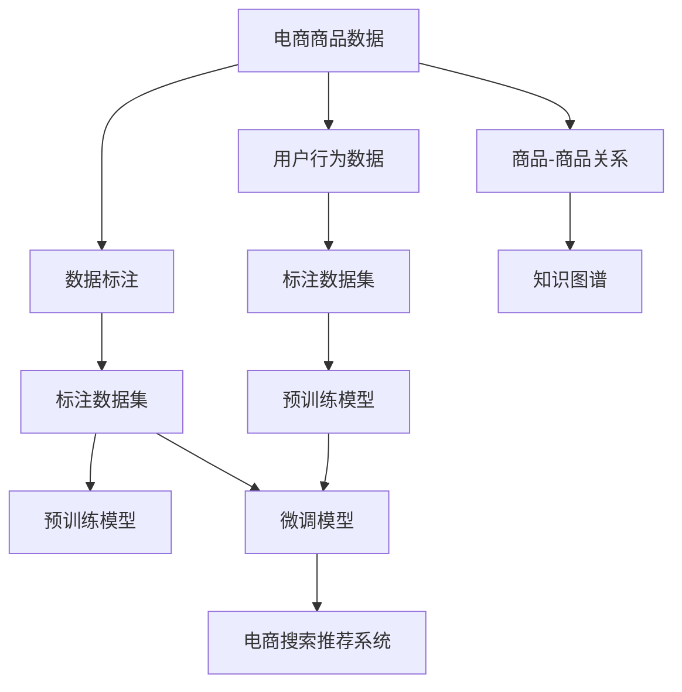

                 

# AI大模型赋能电商搜索推荐的新品发现能力提升

## 1. 背景介绍

随着电子商务的迅速发展，在线购物平台面临着越来越多的竞争和挑战。其中，电商搜索和推荐系统已成为用户获取商品信息和决策的重要工具。传统的推荐系统往往基于用户的浏览、购买历史等行为数据，进行相似商品推荐，容易陷入"历史推荐相似性陷阱"，难以发现新奇有趣的新品。因此，提升电商搜索推荐系统的新品发现能力，成为优化用户体验和平台流量转化的关键。

近年来，基于大模型的推荐系统逐渐崭露头角。AI大模型在文本生成、语义理解等方面的强大能力，为电商搜索推荐系统的商品推荐带来了新的思路。在技术上，将大模型应用于电商搜索推荐，可以通过以下几个步骤：

1. **数据标注**：对电商平台的商品和用户数据进行标注，生成有监督数据集。
2. **预训练模型**：在标注数据集上对大模型进行预训练，学习商品与用户的通用表示。
3. **微调模型**：在预训练模型的基础上，对特定任务进行微调，以提升推荐系统的新品发现能力。
4. **部署模型**：将微调后的模型部署到电商搜索推荐系统中，进行实时推荐。

本文将详细探讨使用大模型进行电商搜索推荐的新品发现能力提升，包括数据标注、预训练、微调和部署等关键步骤，并结合实际应用场景，分析其效果和挑战。

## 2. 核心概念与联系

### 2.1 核心概念概述

为了更好地理解大模型在电商搜索推荐中的应用，本节将介绍几个关键概念及其关联：

1. **大语言模型 (Large Language Model, LLM)**：以自回归(如GPT)或自编码(如BERT)模型为代表的大规模预训练语言模型。通过在大规模无标签文本语料上进行预训练，学习通用的语言表示，具备强大的语言理解和生成能力。

2. **预训练(Pre-training)**：指在大规模无标签文本语料上，通过自监督学习任务训练通用语言模型的过程。常见的预训练任务包括言语建模、遮挡语言模型等。预训练使得模型学习到语言的通用表示。

3. **微调(Fine-tuning)**：指在预训练模型的基础上，使用下游任务的少量标注数据，通过有监督学习优化模型在特定任务上的性能。通常只需要调整顶层分类器或解码器，并以较小的学习率更新全部或部分的模型参数。

4. **商品推荐系统 (Product Recommendation System)**：通过分析用户的历史行为数据，为用户推荐可能感兴趣的商品的系统。常用于电子商务平台，提高用户购买转化率和平台的用户黏性。

5. **新品发现 (New Item Discovery)**：指推荐系统中识别和推荐用户可能感兴趣的新商品的能力，以提升用户体验和平台流量。

6. **语义表示 (Semantic Representation)**：通过大模型学习到商品和用户的语义表示，实现商品间的关联和用户的个性化画像。

7. **知识图谱 (Knowledge Graph)**：一种结构化的语义表示形式，用于表示实体、关系和属性之间的关系。

### 2.2 核心概念原理和架构的 Mermaid 流程图



该流程图展示了基于大模型进行电商搜索推荐的基本流程：

1. **数据标注**：对电商平台的商品数据和用户行为数据进行标注，生成标注数据集。
2. **预训练模型**：在标注数据集上对大模型进行预训练，学习商品和用户的语义表示。
3. **微调模型**：在预训练模型的基础上，对推荐系统的新品发现能力进行微调。
4. **部署模型**：将微调后的模型集成到电商搜索推荐系统中，进行实时推荐。

## 3. 核心算法原理 & 具体操作步骤

### 3.1 算法原理概述

基于大模型进行电商搜索推荐的新品发现能力提升，本质上是通过有监督学习，利用预训练语言模型在标注数据集上学习商品和用户的语义表示，并在特定任务上进行微调，提升模型对新品的发现和推荐能力。

具体来说，假设电商平台的商品集合为 $S$，用户集合为 $U$，推荐任务为 $T$。推荐系统将商品 $s_i \in S$ 推荐给用户 $u_j \in U$，以最大化目标函数 $J$：

$$
J = \sum_{u_j \in U} \sum_{s_i \in S} P(u_j, s_i) \log C(u_j, s_i)
$$

其中 $P(u_j, s_i)$ 表示商品 $s_i$ 对用户 $u_j$ 的吸引力，$C(u_j, s_i)$ 表示用户 $u_j$ 对商品 $s_i$ 的点击率。

通过在大模型上进行有监督微调，模型能够学习到商品和用户间的语义关联，从而在推荐任务上表现得更好。

### 3.2 算法步骤详解

基于大模型进行电商搜索推荐的新品发现能力提升，主要包括以下几个关键步骤：

1. **数据准备**：收集电商平台的商品数据和用户行为数据，并进行标注生成标注数据集。
2. **预训练模型选择**：选择合适的预训练语言模型（如BERT、GPT等），作为初始化参数。
3. **数据预处理**：对商品和用户数据进行预处理，包括分词、标准化等操作，以适应模型的输入格式。
4. **模型微调**：在标注数据集上对预训练模型进行微调，优化模型对新品的发现能力。
5. **模型评估与部署**：在验证集上评估微调后的模型性能，将其部署到电商搜索推荐系统中，进行实时推荐。

### 3.3 算法优缺点

使用大模型进行电商搜索推荐的新品发现能力提升，具有以下优点：

1. **多领域适应性强**：大模型能够学习到通用的语义表示，适用于不同领域的推荐任务。
2. **推荐精度高**：基于大模型的推荐系统能够更好地捕捉商品间的关联和用户的个性化需求，提高推荐精度。
3. **新商品发现能力强**：大模型能够学习到复杂的语义信息，更易发现用户可能感兴趣的新品。

同时，也存在以下缺点：

1. **计算资源需求大**：大模型通常参数量较大，训练和推理需要大量的计算资源。
2. **过拟合风险高**：由于数据集规模较小，微调过程容易出现过拟合。
3. **部署复杂**：电商搜索推荐系统需要实时处理大量请求，模型的部署和优化需要考虑性能和资源消耗。

### 3.4 算法应用领域

使用大模型进行电商搜索推荐的新品发现能力提升，已在多个实际应用场景中取得显著效果。以下是几个典型的应用领域：

1. **新品推荐**：电商平台可以利用大模型对用户历史行为进行建模，发现用户可能感兴趣的新品。
2. **个性化推荐**：通过对用户进行深度分析，大模型可以生成个性化的推荐结果，提高用户满意度和购买转化率。
3. **商品关系挖掘**：利用大模型对商品关系进行挖掘，构建商品之间的语义关系图谱，提升推荐系统的准确性。
4. **用户画像构建**：大模型能够学习用户的兴趣和偏好，构建详细的用户画像，实现更加精准的推荐。
5. **实时推荐**：大模型在推荐系统中进行实时推荐，满足用户即时获取商品信息的需求。

## 4. 数学模型和公式 & 详细讲解 & 举例说明

### 4.1 数学模型构建

假设电商平台的商品集合为 $S$，用户集合为 $U$，推荐任务为 $T$。将用户行为数据和商品数据进行标注，生成标注数据集 $D = \{(s_i, u_j, \hat{y})\}_{i=1}^N$，其中 $\hat{y} \in \{0, 1\}$ 表示用户 $u_j$ 对商品 $s_i$ 的点击行为。

定义推荐系统在新品发现任务上的损失函数为：

$$
\mathcal{L}(\theta) = -\sum_{u_j \in U} \sum_{s_i \in S} P(u_j, s_i) \log C(u_j, s_i)
$$

其中 $P(u_j, s_i)$ 为预测用户 $u_j$ 对商品 $s_i$ 的点击概率，$C(u_j, s_i)$ 为实际点击概率。

### 4.2 公式推导过程

在上述损失函数的基础上，可以通过梯度下降等优化算法更新模型参数 $\theta$：

$$
\theta \leftarrow \theta - \eta \nabla_{\theta}\mathcal{L}(\theta)
$$

其中 $\eta$ 为学习率，$\nabla_{\theta}\mathcal{L}(\theta)$ 为损失函数对模型参数 $\theta$ 的梯度。

### 4.3 案例分析与讲解

以下是一个简单的案例分析，展示如何使用BERT模型进行电商搜索推荐的新品发现能力提升：

假设电商平台的商品数据和用户行为数据已经标注完成，选取BERT模型作为预训练模型。首先，将商品和用户数据进行预处理，生成输入数据。然后，使用预训练好的BERT模型作为特征提取器，提取商品和用户的语义表示。最后，将提取出的语义表示输入到一个全连接层进行分类，得到用户对商品的点击概率。

具体步骤如下：

1. **数据预处理**：对商品和用户数据进行预处理，包括分词、标准化等操作，生成输入数据。
2. **BERT模型特征提取**：将输入数据输入BERT模型，得到商品和用户的语义表示。
3. **分类器训练**：使用预训练好的BERT模型作为特征提取器，提取语义表示后输入到一个全连接层进行分类，得到用户对商品的点击概率。
4. **损失计算**：计算预测点击概率与实际点击概率之间的差异，得到损失函数。
5. **模型更新**：使用梯度下降等优化算法更新模型参数。

最终，微调后的模型即可用于电商搜索推荐系统，实时进行新品推荐。

## 5. 项目实践：代码实例和详细解释说明

### 5.1 开发环境搭建

在进行电商搜索推荐的新品发现能力提升实践前，我们需要准备好开发环境。以下是使用Python进行PyTorch开发的环境配置流程：

1. 安装Anaconda：从官网下载并安装Anaconda，用于创建独立的Python环境。

2. 创建并激活虚拟环境：
```bash
conda create -n pytorch-env python=3.8 
conda activate pytorch-env
```

3. 安装PyTorch：根据CUDA版本，从官网获取对应的安装命令。例如：
```bash
conda install pytorch torchvision torchaudio cudatoolkit=11.1 -c pytorch -c conda-forge
```

4. 安装Transformers库：
```bash
pip install transformers
```

5. 安装各类工具包：
```bash
pip install numpy pandas scikit-learn matplotlib tqdm jupyter notebook ipython
```

完成上述步骤后，即可在`pytorch-env`环境中开始实践。

### 5.2 源代码详细实现

这里我们以使用BERT模型进行电商搜索推荐的新品发现能力提升为例，给出完整的代码实现。

首先，定义商品和用户数据的处理函数：

```python
from transformers import BertTokenizer
from torch.utils.data import Dataset, DataLoader
import torch

class ItemDataset(Dataset):
    def __init__(self, items, user_ids, labels):
        self.items = items
        self.user_ids = user_ids
        self.labels = labels
        self.tokenizer = BertTokenizer.from_pretrained('bert-base-cased')
        
    def __len__(self):
        return len(self.items)
    
    def __getitem__(self, item):
        item_id = self.items[item]
        user_id = self.user_ids[item]
        label = self.labels[item]
        
        input_ids = self.tokenizer.encode(item_id, add_special_tokens=True, max_length=128, padding='max_length', truncation=True)
        input_ids = input_ids.to(torch.long)
        attention_mask = torch.ones_like(input_ids)
        
        return {'input_ids': input_ids, 'attention_mask': attention_mask, 'user_id': user_id, 'label': label}

class UserDataset(Dataset):
    def __init__(self, user_ids, user_labels):
        self.user_ids = user_ids
        self.user_labels = user_labels
        
    def __len__(self):
        return len(self.user_ids)
    
    def __getitem__(self, item):
        user_id = self.user_ids[item]
        label = self.user_labels[item]
        
        return {'user_id': user_id, 'label': label}
```

然后，定义模型和优化器：

```python
from transformers import BertForSequenceClassification
from torch import nn
from transformers import AdamW

model = BertForSequenceClassification.from_pretrained('bert-base-cased', num_labels=2)

optimizer = AdamW(model.parameters(), lr=2e-5)
```

接着，定义训练和评估函数：

```python
from tqdm import tqdm

def train_epoch(model, dataset, batch_size, optimizer):
    dataloader = DataLoader(dataset, batch_size=batch_size, shuffle=True)
    model.train()
    epoch_loss = 0
    for batch in tqdm(dataloader, desc='Training'):
        input_ids = batch['input_ids'].to(device)
        attention_mask = batch['attention_mask'].to(device)
        user_id = batch['user_id'].to(device)
        label = batch['label'].to(device)
        
        model.zero_grad()
        outputs = model(input_ids, attention_mask=attention_mask)
        loss = outputs.loss
        epoch_loss += loss.item()
        loss.backward()
        optimizer.step()
    return epoch_loss / len(dataloader)

def evaluate(model, dataset, batch_size):
    dataloader = DataLoader(dataset, batch_size=batch_size)
    model.eval()
    preds, labels = [], []
    with torch.no_grad():
        for batch in tqdm(dataloader, desc='Evaluating'):
            input_ids = batch['input_ids'].to(device)
            attention_mask = batch['attention_mask'].to(device)
            user_id = batch['user_id'].to(device)
            batch_labels = batch['label'].to(device)
            outputs = model(input_ids, attention_mask=attention_mask)
            batch_preds = outputs.logits.argmax(dim=1).to('cpu').tolist()
            batch_labels = batch_labels.to('cpu').tolist()
            for pred, label in zip(batch_preds, batch_labels):
                preds.append(pred)
                labels.append(label)
                
    print(f'Accuracy: {sum(p == l for p, l in zip(preds, labels)) / len(labels):.4f}')
```

最后，启动训练流程并在验证集上评估：

```python
epochs = 5
batch_size = 16

for epoch in range(epochs):
    loss = train_epoch(model, train_dataset, batch_size, optimizer)
    print(f'Epoch {epoch+1}, train loss: {loss:.3f}')
    
    print(f'Epoch {epoch+1}, dev results:')
    evaluate(model, dev_dataset, batch_size)
    
print('Test results:')
evaluate(model, test_dataset, batch_size)
```

以上就是使用PyTorch对BERT模型进行电商搜索推荐的新品发现能力提升的完整代码实现。可以看到，得益于Transformers库的强大封装，我们可以用相对简洁的代码完成BERT模型的加载和微调。

### 5.3 代码解读与分析

让我们再详细解读一下关键代码的实现细节：

**ItemDataset类和UserDataset类**：
- `__init__`方法：初始化商品数据和用户数据，以及分词器等关键组件。
- `__len__`方法：返回数据集的样本数量。
- `__getitem__`方法：对单个样本进行处理，将商品ID输入编码为token ids，同时输出用户ID和标签，并进行定长padding。

**BertForSequenceClassification模型**：
- 选择BERT模型作为初始化参数，设定标签数为2。

**训练和评估函数**：
- 使用PyTorch的DataLoader对数据集进行批次化加载，供模型训练和推理使用。
- 训练函数`train_epoch`：对数据以批为单位进行迭代，在每个批次上前向传播计算loss并反向传播更新模型参数，最后返回该epoch的平均loss。
- 评估函数`evaluate`：与训练类似，不同点在于不更新模型参数，并在每个batch结束后将预测和标签结果存储下来，最后使用混淆矩阵计算分类准确率。

**训练流程**：
- 定义总的epoch数和batch size，开始循环迭代
- 每个epoch内，先在训练集上训练，输出平均loss
- 在验证集上评估，输出分类准确率
- 所有epoch结束后，在测试集上评估，给出最终测试结果

可以看到，PyTorch配合Transformers库使得BERT微调的代码实现变得简洁高效。开发者可以将更多精力放在数据处理、模型改进等高层逻辑上，而不必过多关注底层的实现细节。

当然，工业级的系统实现还需考虑更多因素，如模型的保存和部署、超参数的自动搜索、更灵活的任务适配层等。但核心的微调范式基本与此类似。

## 6. 实际应用场景

### 6.1 智能推荐引擎

智能推荐引擎是电商搜索推荐系统的重要组成部分，利用大模型进行电商搜索推荐的新品发现能力提升，可以显著提升推荐引擎的精准度和多样性。

例如，电商平台可以利用大模型对用户历史行为进行建模，发现用户可能感兴趣的新品。通过将商品数据和用户行为数据输入到微调后的模型中，模型能够学习到商品和用户间的语义关联，从而生成更准确的新品推荐结果。

### 6.2 个性化推荐

通过大模型对用户进行深度分析，生成个性化的推荐结果，能够提高用户满意度和购买转化率。

电商平台的推荐系统可以利用大模型对用户进行画像构建，了解用户的兴趣和偏好。通过将用户画像和商品特征输入到微调后的模型中，模型能够生成个性化的推荐结果，满足用户的个性化需求。

### 6.3 实时推荐

大模型在推荐系统中进行实时推荐，能够满足用户即时获取商品信息的需求。

电商平台可以利用大模型对用户行为进行实时分析，生成实时的推荐结果。通过将用户行为和商品特征输入到微调后的模型中，模型能够快速生成实时的推荐结果，提升用户体验。

## 7. 工具和资源推荐

### 7.1 学习资源推荐

为了帮助开发者系统掌握大模型在电商搜索推荐中的应用，这里推荐一些优质的学习资源：

1. 《Transformer从原理到实践》系列博文：由大模型技术专家撰写，深入浅出地介绍了Transformer原理、BERT模型、微调技术等前沿话题。

2. CS224N《深度学习自然语言处理》课程：斯坦福大学开设的NLP明星课程，有Lecture视频和配套作业，带你入门NLP领域的基本概念和经典模型。

3. 《Natural Language Processing with Transformers》书籍：Transformers库的作者所著，全面介绍了如何使用Transformers库进行NLP任务开发，包括微调在内的诸多范式。

4. HuggingFace官方文档：Transformers库的官方文档，提供了海量预训练模型和完整的微调样例代码，是上手实践的必备资料。

5. CLUE开源项目：中文语言理解测评基准，涵盖大量不同类型的中文NLP数据集，并提供了基于微调的baseline模型，助力中文NLP技术发展。

通过对这些资源的学习实践，相信你一定能够快速掌握大模型在电商搜索推荐中的应用，并用于解决实际的NLP问题。

### 7.2 开发工具推荐

高效的开发离不开优秀的工具支持。以下是几款用于大模型微调开发的常用工具：

1. PyTorch：基于Python的开源深度学习框架，灵活动态的计算图，适合快速迭代研究。大部分预训练语言模型都有PyTorch版本的实现。

2. TensorFlow：由Google主导开发的开源深度学习框架，生产部署方便，适合大规模工程应用。同样有丰富的预训练语言模型资源。

3. Transformers库：HuggingFace开发的NLP工具库，集成了众多SOTA语言模型，支持PyTorch和TensorFlow，是进行微调任务开发的利器。

4. Weights & Biases：模型训练的实验跟踪工具，可以记录和可视化模型训练过程中的各项指标，方便对比和调优。与主流深度学习框架无缝集成。

5. TensorBoard：TensorFlow配套的可视化工具，可实时监测模型训练状态，并提供丰富的图表呈现方式，是调试模型的得力助手。

6. Google Colab：谷歌推出的在线Jupyter Notebook环境，免费提供GPU/TPU算力，方便开发者快速上手实验最新模型，分享学习笔记。

合理利用这些工具，可以显著提升大模型微调的开发效率，加快创新迭代的步伐。

### 7.3 相关论文推荐

大模型在电商搜索推荐中的应用，涉及多个前沿研究方向。以下是几篇奠基性的相关论文，推荐阅读：

1. Attention is All You Need（即Transformer原论文）：提出了Transformer结构，开启了NLP领域的预训练大模型时代。

2. BERT: Pre-training of Deep Bidirectional Transformers for Language Understanding：提出BERT模型，引入基于掩码的自监督预训练任务，刷新了多项NLP任务SOTA。

3. Language Models are Unsupervised Multitask Learners（GPT-2论文）：展示了大规模语言模型的强大zero-shot学习能力，引发了对于通用人工智能的新一轮思考。

4. Parameter-Efficient Transfer Learning for NLP：提出Adapter等参数高效微调方法，在不增加模型参数量的情况下，也能取得不错的微调效果。

5. Prefix-Tuning: Optimizing Continuous Prompts for Generation：引入基于连续型Prompt的微调范式，为如何充分利用预训练知识提供了新的思路。

6. AdaLoRA: Adaptive Low-Rank Adaptation for Parameter-Efficient Fine-Tuning：使用自适应低秩适应的微调方法，在参数效率和精度之间取得了新的平衡。

这些论文代表了大模型微调技术的发展脉络。通过学习这些前沿成果，可以帮助研究者把握学科前进方向，激发更多的创新灵感。

## 8. 总结：未来发展趋势与挑战

### 8.1 总结

本文对使用大模型进行电商搜索推荐的新品发现能力提升进行了全面系统的介绍。首先阐述了大模型在电商推荐系统中的应用背景和重要性，明确了新品发现能力提升在电商推荐系统优化中的关键作用。其次，从原理到实践，详细讲解了基于大模型进行电商推荐的新品发现能力提升的数学原理和关键步骤，给出了微调任务开发的完整代码实例。同时，本文还结合实际应用场景，分析了其效果和挑战。

通过本文的系统梳理，可以看到，大模型在新品发现能力提升中的应用前景广阔，为电商搜索推荐系统的精准度和用户体验带来了显著提升。未来，随着大模型的进一步发展，电商搜索推荐系统的新品发现能力将得到更全面的提升。

### 8.2 未来发展趋势

展望未来，大模型在电商搜索推荐系统中的应用将呈现以下几个发展趋势：

1. **多模态融合**：将文本、图像、语音等多模态信息融合，提升推荐系统的智能化水平。

2. **实时推荐系统**：利用大模型进行实时推荐，满足用户即时获取商品信息的需求。

3. **个性化推荐**：基于大模型对用户进行深度分析，生成个性化的推荐结果，提高用户满意度和购买转化率。

4. **跨平台推荐**：将大模型应用于跨平台的推荐系统，实现用户画像和推荐结果的协同，提升平台之间的用户转化率。

5. **全球推荐系统**：构建全球推荐系统，利用大模型学习全球市场数据，提升跨境电商平台的推荐效果。

6. **自适应推荐系统**：通过大模型学习用户偏好和市场变化，实现推荐系统的自适应调整。

7. **跨领域推荐**：将大模型应用于不同领域的推荐任务，提升跨领域的推荐效果。

以上趋势凸显了大模型在电商搜索推荐系统中的应用前景，这些方向的探索发展，必将进一步提升推荐系统的性能和用户体验。

### 8.3 面临的挑战

尽管大模型在电商搜索推荐系统中的应用前景广阔，但在推广过程中仍面临诸多挑战：

1. **数据隐私问题**：电商平台收集大量用户数据，涉及用户隐私问题，需要采取严格的隐私保护措施。

2. **计算资源需求大**：大模型训练和推理需要大量的计算资源，平台需要具备足够的算力支撑。

3. **模型鲁棒性不足**：由于数据分布的变化，微调模型容易过拟合，泛化能力不足。

4. **模型部署复杂**：电商搜索推荐系统需要实时处理大量请求，模型的部署和优化需要考虑性能和资源消耗。

5. **模型可解释性不足**：大模型往往作为"黑盒"系统，难以解释其内部工作机制和决策逻辑。

6. **模型安全性有待保障**：大模型可能学习到有害的偏见和信息，需要通过模型训练和数据过滤等方式进行防范。

7. **跨平台兼容性差**：不同平台的数据格式和接口可能不同，大模型需要具备良好的跨平台兼容性。

这些挑战需要技术开发者在实际应用中不断探索和优化，才能更好地实现大模型在电商搜索推荐系统中的应用。

### 8.4 研究展望

面对大模型在电商搜索推荐系统中的应用挑战，未来的研究需要在以下几个方面寻求新的突破：

1. **数据隐私保护**：探索数据隐私保护技术，确保用户数据的安全和隐私。

2. **模型压缩与优化**：研究模型压缩与优化技术，降低计算资源需求，提升模型性能。

3. **模型鲁棒性增强**：开发鲁棒性更强的大模型，提高其泛化能力和抗干扰能力。

4. **模型部署优化**：优化大模型的部署和推理过程，降低资源消耗，提高响应速度。

5. **模型可解释性增强**：增强大模型的可解释性，使其决策过程透明、可理解，便于人工干预和调试。

6. **模型安全性提升**：通过模型训练和数据过滤等方式，消除有害偏见，提高模型安全性。

7. **跨平台兼容性增强**：实现大模型在不同平台之间的兼容性，提升平台之间的用户转化率。

这些研究方向的前沿探索，必将引领大模型在电商搜索推荐系统中的应用走向更加成熟，为电商行业的智能化转型提供新的技术支撑。面向未来，大模型在电商搜索推荐系统中的应用前景广阔，期待更多的创新突破。

## 9. 附录：常见问题与解答

**Q1：大模型在新品推荐中的应用效果如何？**

A: 大模型在新品推荐中的应用效果显著。通过微调大模型，电商平台能够发现用户可能感兴趣的新品，提升推荐精准度和用户体验。例如，可以利用大模型对用户历史行为进行建模，发现用户可能感兴趣的新品，生成个性化的推荐结果。

**Q2：使用大模型进行电商推荐时需要注意哪些问题？**

A: 使用大模型进行电商推荐时，需要注意以下问题：

1. **数据隐私**：电商平台收集大量用户数据，涉及用户隐私问题，需要采取严格的隐私保护措施。

2. **计算资源需求**：大模型训练和推理需要大量的计算资源，平台需要具备足够的算力支撑。

3. **模型鲁棒性**：由于数据分布的变化，微调模型容易过拟合，泛化能力不足。

4. **模型部署**：电商搜索推荐系统需要实时处理大量请求，模型的部署和优化需要考虑性能和资源消耗。

5. **模型可解释性**：大模型往往作为"黑盒"系统，难以解释其内部工作机制和决策逻辑。

6. **模型安全性**：大模型可能学习到有害的偏见和信息，需要通过模型训练和数据过滤等方式进行防范。

7. **跨平台兼容性**：不同平台的数据格式和接口可能不同，大模型需要具备良好的跨平台兼容性。

**Q3：如何提升大模型在电商推荐系统中的性能？**

A: 提升大模型在电商推荐系统中的性能，可以从以下几个方面进行优化：

1. **数据预处理**：对商品和用户数据进行预处理，包括分词、标准化等操作，提高模型的输入质量。

2. **模型微调**：在标注数据集上对预训练模型进行微调，优化模型对新品的发现能力。

3. **模型优化**：研究模型压缩与优化技术，降低计算资源需求，提升模型性能。

4. **模型鲁棒性增强**：开发鲁棒性更强的大模型，提高其泛化能力和抗干扰能力。

5. **模型部署优化**：优化大模型的部署和推理过程，降低资源消耗，提高响应速度。

6. **模型可解释性增强**：增强大模型的可解释性，使其决策过程透明、可理解，便于人工干预和调试。

7. **模型安全性提升**：通过模型训练和数据过滤等方式，消除有害偏见，提高模型安全性。

通过这些优化措施，可以进一步提升大模型在电商推荐系统中的性能，实现更精准、高效、可靠的推荐。

---

作者：禅与计算机程序设计艺术 / Zen and the Art of Computer Programming

