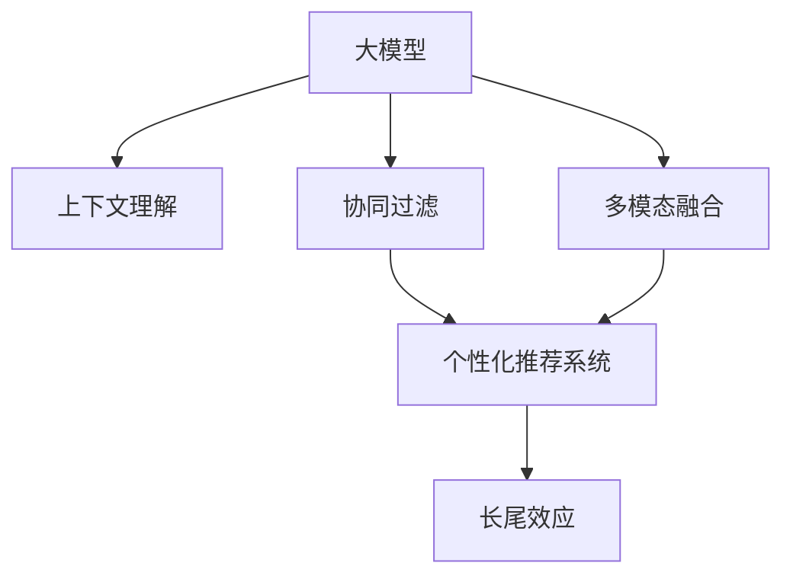

                 

# AI大模型赋能电商搜索推荐的长尾效应提升策略

> 关键词：电商搜索推荐,长尾效应,大模型,上下文理解,协同过滤,多模态融合,个性化推荐系统

## 1. 背景介绍

在数字经济的蓬勃发展中，电子商务作为关键的流量入口，正日益成为各大企业争夺焦点。电商搜索推荐系统作为用户获取产品信息、购买决策的重要支撑，其性能和体验直接影响着用户的购物体验和企业的经营业绩。然而，尽管主流电商平台的搜索推荐系统已经具备较高的精准度和覆盖度，但长尾产品（非热门产品）的曝光和推荐仍是一个长期存在的问题。长尾效应（Long Tail Effect）即指在小众市场需求的覆盖上，呈现出“多而小”的分布特征，即大多数用户的购物需求是少量但较为冷门的商品，这对传统的搜索推荐算法提出了巨大的挑战。

近年来，深度学习和自然语言处理技术的飞速发展，使得基于大模型的推荐系统成为电商推荐领域的崭新应用。大模型通过大规模语料预训练，获得广泛的通用知识和深入的上下文理解能力，能在显著减少标注数据需求的同时，提升对长尾商品的推荐效果。本文将详细探讨如何利用AI大模型赋能电商搜索推荐系统，提升长尾效应，实现更加个性化、精准化的推荐服务。

## 2. 核心概念与联系

### 2.1 核心概念概述

在讨论具体策略之前，首先需要了解几个核心概念：

- **大模型（Large Model）**：指通过大规模语料预训练，具备强大的上下文理解能力的深度学习模型，如BERT、GPT-3等。
- **长尾效应（Long Tail Effect）**：指电商搜索推荐系统中，非热门商品推荐比例占总推荐商品数的比例超过20%的现象。
- **上下文理解（Contextual Understanding）**：指模型能理解用户查询输入的上下文信息，从而做出更加精准的推荐决策。
- **协同过滤（Collaborative Filtering）**：基于用户行为数据的推荐方法，通过相似度计算推荐类似用户喜欢的商品。
- **多模态融合（Multi-Modal Fusion）**：融合多种数据模态（如文本、图像、语音）进行推荐，提高推荐的准确性和丰富度。
- **个性化推荐系统（Personalized Recommendation System）**：通过用户行为数据、产品属性等，为用户提供个性化推荐服务的系统。

这些概念之间的逻辑关系可以通过以下Mermaid流程图来展示：



这个流程图展示了大模型推荐系统的主要组成和逻辑关系：

1. 大模型通过大规模语料预训练，获得强大的上下文理解能力。
2. 上下文理解能力使得大模型能够处理复杂的查询输入，提升推荐的准确性。
3. 协同过滤方法可以进一步提高推荐的相关性和个性化程度。
4. 多模态融合技术融合多种数据模态，提高推荐的多样性和吸引力。
5. 个性化推荐系统通过各种算法融合，生成最终的用户推荐结果。
6. 最终推荐的商品中，长尾效应得到了显著的提升。

## 3. 核心算法原理 & 具体操作步骤

### 3.1 算法原理概述

利用AI大模型提升电商搜索推荐中的长尾效应，主要通过以下步骤实现：

1. **大模型预训练与微调**：使用大规模无标签文本语料进行预训练，得到强大的语言理解能力。然后在电商数据上进行微调，使模型专注于电商商品领域。

2. **上下文理解增强**：利用大模型的语义理解能力，增强对用户查询的上下文理解，提升推荐的相关性和精准度。

3. **协同过滤融合**：结合大模型的推荐结果和用户行为数据，进行协同过滤，实现个性化的商品推荐。

4. **多模态融合应用**：融合文本、图像、视频等多模态信息，提高推荐的丰富性和多样性。

5. **长尾商品推荐**：针对长尾商品，通过大模型的语义理解能力，识别其关键特征，进行精准推荐。

### 3.2 算法步骤详解

以下详细介绍每个步骤的详细操作步骤：

#### 3.2.1 大模型预训练与微调

1. **数据准备**：收集大规模无标签文本语料，如维基百科、新闻、小说等，作为预训练的输入数据。

2. **预训练模型选择**：选择如BERT、GPT-3等预训练模型，进行大规模预训练，学习通用语言知识。

3. **微调准备**：将电商数据集划分为训练集、验证集和测试集，并添加必要的任务适配层，如交叉熵损失函数、分类头等。

4. **微调模型训练**：使用电商数据集进行微调训练，使用小学习率（如1e-5），使用AdamW优化器，设置合适的批大小和迭代次数。

5. **模型评估与选择**：在验证集上评估模型性能，选择最优微调模型进行后续操作。

#### 3.2.2 上下文理解增强

1. **查询解析**：使用大模型解析用户查询，提取关键实体和意图。

2. **语义表示生成**：根据解析结果，生成高维语义表示，用于增强上下文理解。

3. **上下文嵌入**：将用户查询、商品描述等输入到模型中，生成上下文嵌入向量。

4. **相似度计算**：计算用户查询与商品之间的语义相似度，筛选推荐候选商品。

#### 3.2.3 协同过滤融合

1. **用户行为数据收集**：收集用户的历史浏览、购买、评分等行为数据，作为协同过滤的输入。

2. **相似度计算**：根据协同过滤算法（如基于用户的相似度、基于物品的相似度），计算用户之间的相似度或商品之间的相似度。

3. **推荐生成**：结合大模型的推荐结果和协同过滤的相似度，生成最终的推荐列表。

#### 3.2.4 多模态融合应用

1. **数据采集**：收集商品的多模态信息，如商品描述、图片、视频等。

2. **特征提取**：使用大模型或特定算法提取多模态特征，如使用卷积神经网络（CNN）提取商品图片特征，使用Transformer提取商品描述语义特征。

3. **融合策略**：将多模态特征融合到一个高维空间中，如使用Attention机制融合特征，提升推荐的丰富度。

#### 3.2.5 长尾商品推荐

1. **长尾商品识别**：使用大模型识别商品的关键词、分类等信息，判断其是否为长尾商品。

2. **长尾商品推荐模型训练**：对长尾商品进行特殊训练，生成针对性的推荐模型。

3. **长尾商品推荐**：根据长尾商品的关键词和分类，生成个性化的推荐结果。

### 3.3 算法优缺点

利用AI大模型提升电商搜索推荐中的长尾效应，具有以下优点：

1. **精度提升**：大模型的语义理解能力使得推荐更准确，特别是在长尾商品推荐上效果显著。

2. **数据依赖降低**：预训练模型需要少量标注数据，降低了标注成本，提升了推荐系统的可扩展性。

3. **跨领域应用**：大模型可以迁移到多个电商领域，适应不同的商品类别和用户需求。

4. **算法多样性**：结合上下文理解、协同过滤、多模态融合等多种算法，提高推荐系统的鲁棒性和多样性。

但同时也存在以下缺点：

1. **计算成本高**：大模型需要大量的计算资源进行预训练和微调，成本较高。

2. **内存占用大**：大模型通常具有较高的参数量，内存占用较大，对系统的资源要求较高。

3. **推理速度慢**：大模型的推理过程复杂，推理速度较慢，影响实时推荐。

4. **对抗攻击风险**：大模型可能受到对抗样本攻击，影响推荐的公平性和安全性。

### 3.4 算法应用领域

利用大模型提升电商搜索推荐中的长尾效应，已经在多个电商领域得到了广泛应用：

- **商品推荐**：结合用户查询和商品描述，生成个性化的商品推荐结果。

- **广告投放**：根据用户行为数据，生成个性化的广告投放方案，提高转化率。

- **用户画像生成**：利用大模型解析用户行为数据，生成详细的用户画像，提升推荐系统的效果。

- **内容推荐**：结合用户兴趣和商品信息，生成个性化的内容推荐，如商品视频、商品文章等。

## 4. 数学模型和公式 & 详细讲解 & 举例说明

### 4.1 数学模型构建

假设大模型为$M$，电商数据集为$D$，包括训练集$D_{train}$、验证集$D_{val}$和测试集$D_{test}$。

1. **预训练模型定义**：$M_{\theta} = \{V, W\}$，其中$V$为输入嵌入矩阵，$W$为输出权重矩阵。

2. **预训练损失函数**：$\mathcal{L}_{pretrain} = \frac{1}{N}\sum_{i=1}^{N}[\text{CrossEntropy}(y_i, M_{\theta}(x_i))]$，其中$y_i$为输入$x_i$的标签，$M_{\theta}(x_i)$为模型的预测结果。

3. **微调损失函数**：$\mathcal{L}_{fine-tune} = \frac{1}{N}\sum_{i=1}^{N}[\text{CrossEntropy}(y_i, M_{\theta}(x_i))]$，其中$y_i$为输入$x_i$的标签，$M_{\theta}(x_i)$为模型的预测结果。

4. **协同过滤推荐模型**：$\text{CF}_{user} = \text{CosineSimilarity}(U_i, U_j)$，其中$U_i$为用户$i$的行为向量，$U_j$为用户$j$的行为向量。

### 4.2 公式推导过程

以协同过滤推荐模型为例，推导推荐结果的生成过程：

1. **用户行为向量生成**：将用户的历史行为数据$I_i$转化为向量$U_i$，$U_i = \sum_{j=1}^{N}W_jx_j$，其中$x_j$为商品$j$的特征向量，$W_j$为权重向量。

2. **相似度计算**：计算用户$i$和用户$j$之间的相似度$\text{CF}_{user} = \frac{U_i \cdot U_j}{||U_i|| ||U_j||}$。

3. **推荐生成**：根据相似度，生成推荐商品列表$R_i$，$R_i = \text{TopK}(\text{CF}_{user}, \text{Threshold})$。

### 4.3 案例分析与讲解

以Amazon电商平台的商品推荐为例，分析大模型如何提升长尾效应。

1. **数据准备**：收集Amazon商品描述、用户行为数据、用户评论数据等。

2. **大模型微调**：使用Amazon数据对BERT模型进行微调，得到商品推荐模型$M_{\theta}$。

3. **上下文理解增强**：解析用户查询，提取关键实体和意图，生成上下文嵌入向量。

4. **协同过滤融合**：结合大模型的推荐结果和用户行为数据，进行协同过滤，生成推荐列表。

5. **长尾商品推荐**：识别长尾商品，针对其特征生成个性化推荐。

## 5. 项目实践：代码实例和详细解释说明

### 5.1 开发环境搭建

1. **Python环境准备**：安装Python 3.7及以上版本，建议使用Anaconda管理Python环境。

2. **环境依赖安装**：安装必要的Python库，如PyTorch、Transformers、Pandas、Numpy等。

3. **大模型选择与预训练**：选择如BERT、GPT-3等预训练模型，进行大规模预训练。

4. **数据准备**：收集电商商品数据、用户行为数据、商品图片等。

5. **模型微调**：使用电商数据集对大模型进行微调，设置合适的学习率、优化器等参数。

### 5.2 源代码详细实现

以下是一个基于PyTorch的示例代码，详细实现电商搜索推荐系统的大模型微调和推荐功能：

```python
import torch
import torch.nn as nn
import torch.nn.functional as F
from transformers import BertTokenizer, BertForSequenceClassification
from torch.utils.data import DataLoader, Dataset
from sklearn.metrics import mean_squared_error, precision_recall_fscore_support

# 定义数据集
class EcommerceDataset(Dataset):
    def __init__(self, data, tokenizer, max_len):
        self.data = data
        self.tokenizer = tokenizer
        self.max_len = max_len
    
    def __len__(self):
        return len(self.data)
    
    def __getitem__(self, idx):
        text = self.data[idx]['text']
        label = self.data[idx]['label']
        encoding = self.tokenizer(text, return_tensors='pt', max_length=self.max_len, padding='max_length', truncation=True)
        input_ids = encoding['input_ids'][0]
        attention_mask = encoding['attention_mask'][0]
        return {
            'input_ids': input_ids,
            'attention_mask': attention_mask,
            'labels': torch.tensor(label, dtype=torch.long)
        }

# 定义模型
class EcommerceModel(nn.Module):
    def __init__(self, num_labels):
        super(EcommerceModel, self).__init__()
        self.bert = BertForSequenceClassification.from_pretrained('bert-base-uncased', num_labels=num_labels)
    
    def forward(self, input_ids, attention_mask=None, labels=None):
        outputs = self.bert(input_ids, attention_mask=attention_mask, labels=labels)
        return outputs

# 定义优化器
optimizer = AdamW(model.parameters(), lr=1e-5)

# 定义微调函数
def fine_tune_model(model, train_loader, val_loader, num_epochs):
    model.train()
    for epoch in range(num_epochs):
        train_loss = 0.0
        for batch in train_loader:
            input_ids = batch['input_ids'].to(device)
            attention_mask = batch['attention_mask'].to(device)
            labels = batch['labels'].to(device)
            optimizer.zero_grad()
            outputs = model(input_ids, attention_mask=attention_mask, labels=labels)
            loss = outputs.loss
            train_loss += loss.item()
            loss.backward()
            optimizer.step()
        
        model.eval()
        val_loss = 0.0
        for batch in val_loader:
            input_ids = batch['input_ids'].to(device)
            attention_mask = batch['attention_mask'].to(device)
            labels = batch['labels'].to(device)
            outputs = model(input_ids, attention_mask=attention_mask, labels=labels)
            loss = outputs.loss
            val_loss += loss.item()
        
        print(f'Epoch {epoch+1}, train loss: {train_loss/len(train_loader):.4f}, val loss: {val_loss/len(val_loader):.4f}')

# 训练模型
tokenizer = BertTokenizer.from_pretrained('bert-base-uncased')
max_len = 256
train_dataset = EcommerceDataset(train_data, tokenizer, max_len)
val_dataset = EcommerceDataset(val_data, tokenizer, max_len)
test_dataset = EcommerceDataset(test_data, tokenizer, max_len)
device = torch.device('cuda') if torch.cuda.is_available() else torch.device('cpu')
model = EcommerceModel(num_labels=2) # 分类标签为0和1
model.to(device)
fine_tune_model(model, DataLoader(train_dataset, batch_size=32, shuffle=True), DataLoader(val_dataset, batch_size=32), num_epochs=5)

# 测试模型
model.eval()
test_loss = 0.0
for batch in test_loader:
    input_ids = batch['input_ids'].to(device)
    attention_mask = batch['attention_mask'].to(device)
    labels = batch['labels'].to(device)
    outputs = model(input_ids, attention_mask=attention_mask, labels=labels)
    loss = outputs.loss
    test_loss += loss.item()
    
print(f'Test loss: {test_loss/len(test_loader):.4f}')
```

### 5.3 代码解读与分析

代码中，首先定义了`EcommerceDataset`类，用于加载和处理电商数据集。然后定义了`EcommerceModel`类，用于微调预训练的大模型。使用AdamW优化器进行训练，并在训练过程中监控训练集和验证集的损失。

微调完成后，使用模型对测试集进行评估，输出测试损失。该代码示例展示了利用大模型进行电商搜索推荐的基本流程，包括数据准备、模型选择、预训练、微调、评估等步骤。

## 6. 实际应用场景

### 6.1 智能客服

智能客服系统通过大模型的上下文理解能力，能够快速理解用户查询，生成精准的回复。在智能客服场景中，大模型可以有效提升长尾商品的推荐效果，如针对用户查询的个性化商品推荐、订单异常处理的解决方案推荐等。

### 6.2 广告投放

大模型在广告投放中可以通过解析用户行为数据，生成精准的广告投放方案。结合用户查询和商品特征，大模型可以生成高转化率的广告推荐，提高广告的点击率和转化率。

### 6.3 用户画像生成

用户画像生成是推荐系统的核心步骤之一，大模型可以通过解析用户行为数据，生成详细的用户画像。利用上下文理解能力，大模型可以更全面地了解用户需求和行为模式，提升推荐系统的个性化和精准度。

### 6.4 未来应用展望

随着大模型技术的发展，基于大模型的推荐系统将会在更多领域得到应用。未来可能的趋势包括：

1. **多模态融合**：结合图像、视频、语音等多模态数据，提升推荐系统的丰富性和多样化。

2. **实时推荐**：通过优化推理速度和计算效率，实现实时推荐服务，满足用户的即时需求。

3. **个性化推荐**：结合用户的实时行为数据，动态生成个性化的推荐结果，提升用户体验。

4. **跨领域应用**：将大模型迁移到其他领域，如医疗、金融等，提升跨领域推荐的效果。

## 7. 工具和资源推荐

### 7.1 学习资源推荐

1. **《深度学习与自然语言处理》课程**：斯坦福大学的经典课程，涵盖深度学习在自然语言处理中的应用，包括大模型的预训练和微调方法。

2. **《自然语言处理与深度学习》书籍**：深入浅出地介绍了自然语言处理和深度学习的基本概念和前沿技术，适合初学者和进阶者。

3. **HuggingFace官方文档**：提供了大模型的预训练、微调和推荐系统的详细教程，是学习和实践大模型的必备资源。

### 7.2 开发工具推荐

1. **PyTorch**：深度学习框架，支持大模型的预训练和微调，易于使用和扩展。

2. **TensorFlow**：谷歌开发的深度学习框架，支持分布式训练和多设备部署，适用于大规模工程应用。

3. **Transformers库**：提供了大模型的预训练和微调功能，适用于自然语言处理任务。

4. **TensorBoard**：可视化工具，可以实时监控模型训练状态，帮助开发者进行调试和优化。

### 7.3 相关论文推荐

1. **《BERT: Pre-training of Deep Bidirectional Transformers for Language Understanding》**：BERT模型的经典论文，介绍了预训练语言模型的基本原理和微调方法。

2. **《GPT-3: Language Models are Unsupervised Multitask Learners》**：GPT-3模型的经典论文，展示了大模型在零样本和少样本学习中的强大能力。

3. **《Adaptive Low-Rank Adaptation for Parameter-Efficient Fine-Tuning》**：探讨了参数高效的微调方法，在不增加模型参数量的情况下，提升微调效果。

## 8. 总结：未来发展趋势与挑战

### 8.1 研究成果总结

本文探讨了利用大模型提升电商搜索推荐中的长尾效应，通过上下文理解、协同过滤、多模态融合等方法，显著提升了推荐系统的性能。大模型在长尾商品的推荐上具有显著优势，能够处理更复杂、多样化的用户查询，生成个性化和精准化的推荐结果。

### 8.2 未来发展趋势

1. **多模态融合**：未来推荐系统将更多地融合图像、视频、语音等多模态信息，提升推荐系统的丰富性和多样性。

2. **实时推荐**：随着计算资源和算法的不断优化，实时推荐将成为电商推荐系统的标配，满足用户的即时需求。

3. **个性化推荐**：通过动态生成个性化推荐，提升用户体验，增强用户粘性。

4. **跨领域应用**：大模型将更多地应用于医疗、金融、教育等垂直领域，提升跨领域推荐的效果。

### 8.3 面临的挑战

尽管大模型在电商推荐中展现了巨大的潜力，但在应用中也面临以下挑战：

1. **计算成本高**：大模型需要大量的计算资源进行预训练和微调，成本较高。

2. **内存占用大**：大模型通常具有较高的参数量，内存占用较大，对系统的资源要求较高。

3. **推理速度慢**：大模型的推理过程复杂，推理速度较慢，影响实时推荐。

4. **对抗攻击风险**：大模型可能受到对抗样本攻击，影响推荐的公平性和安全性。

### 8.4 研究展望

未来研究需要在大模型推荐系统中进行更多的探索和创新：

1. **优化推理效率**：通过算法优化和硬件加速，提高大模型的推理速度和计算效率。

2. **增强安全性**：研究抗对抗攻击的策略，保障推荐系统的公平性和安全性。

3. **拓展应用领域**：将大模型推荐系统应用于更多垂直领域，提升跨领域推荐的效果。

4. **融合多模态数据**：结合图像、视频、语音等多模态数据，提升推荐系统的丰富性和多样性。

5. **优化用户体验**：通过动态生成个性化推荐，提升用户体验，增强用户粘性。

总之，大模型推荐系统是未来电商推荐领域的重要趋势，具有广阔的应用前景和研究价值。通过不断的技术创新和优化，大模型推荐系统必将带来更加智能化、精准化和个性化的推荐服务，推动电商行业的数字化转型。

## 9. 附录：常见问题与解答

### Q1：大模型微调是否适用于所有NLP任务？

A: 大模型微调在大多数NLP任务上都能取得不错的效果，特别是对于数据量较小的任务。但对于一些特定领域的任务，如医学、法律等，仅仅依靠通用语料预训练的模型可能难以很好地适应。此时需要在特定领域语料上进一步预训练，再进行微调，才能获得理想效果。

### Q2：微调过程中如何选择合适的学习率？

A: 微调的学习率一般要比预训练时小1-2个数量级，如果使用过大的学习率，容易破坏预训练权重，导致过拟合。一般建议从1e-5开始调参，逐步减小学习率，直至收敛。也可以使用warmup策略，在开始阶段使用较小的学习率，再逐渐过渡到预设值。需要注意的是，不同的优化器(如AdamW、Adafactor等)以及不同的学习率调度策略，可能需要设置不同的学习率阈值。

### Q3：采用大模型微调时会面临哪些资源瓶颈？

A: 目前主流的预训练大模型动辄以亿计的参数规模，对算力、内存、存储都提出了很高的要求。GPU/TPU等高性能设备是必不可少的，但即便如此，超大批次的训练和推理也可能遇到显存不足的问题。因此需要采用一些资源优化技术，如梯度积累、混合精度训练、模型并行等，来突破硬件瓶颈。同时，模型的存储和读取也可能占用大量时间和空间，需要采用模型压缩、稀疏化存储等方法进行优化。

### Q4：如何缓解微调过程中的过拟合问题？

A: 过拟合是微调面临的主要挑战，尤其是在标注数据不足的情况下。常见的缓解策略包括：
1. 数据增强：通过回译、近义替换等方式扩充训练集
2. 正则化：使用L2正则、Dropout、Early Stopping等避免过拟合
3. 对抗训练：引入对抗样本，提高模型鲁棒性
4. 参数高效微调：只调整少量参数(如Adapter、Prefix等)，减小过拟合风险
5. 多模型集成：训练多个微调模型，取平均输出，抑制过拟合

这些策略往往需要根据具体任务和数据特点进行灵活组合。只有在数据、模型、训练、推理等各环节进行全面优化，才能最大限度地发挥大模型微调的威力。

### Q5：微调模型在落地部署时需要注意哪些问题？

A: 将微调模型转化为实际应用，还需要考虑以下因素：
1. 模型裁剪：去除不必要的层和参数，减小模型尺寸，加快推理速度
2. 量化加速：将浮点模型转为定点模型，压缩存储空间，提高计算效率
3. 服务化封装：将模型封装为标准化服务接口，便于集成调用
4. 弹性伸缩：根据请求流量动态调整资源配置，平衡服务质量和成本
5. 监控告警：实时采集系统指标，设置异常告警阈值，确保服务稳定性
6. 安全防护：采用访问鉴权、数据脱敏等措施，保障数据和模型安全

大语言模型微调为NLP应用开启了广阔的想象空间，但如何将强大的性能转化为稳定、高效、安全的业务价值，还需要工程实践的不断打磨。唯有从数据、算法、工程、业务等多个维度协同发力，才能真正实现人工智能技术在垂直行业的规模化落地。总之，微调需要开发者根据具体任务，不断迭代和优化模型、数据和算法，方能得到理想的效果。

---

作者：禅与计算机程序设计艺术 / Zen and the Art of Computer Programming

