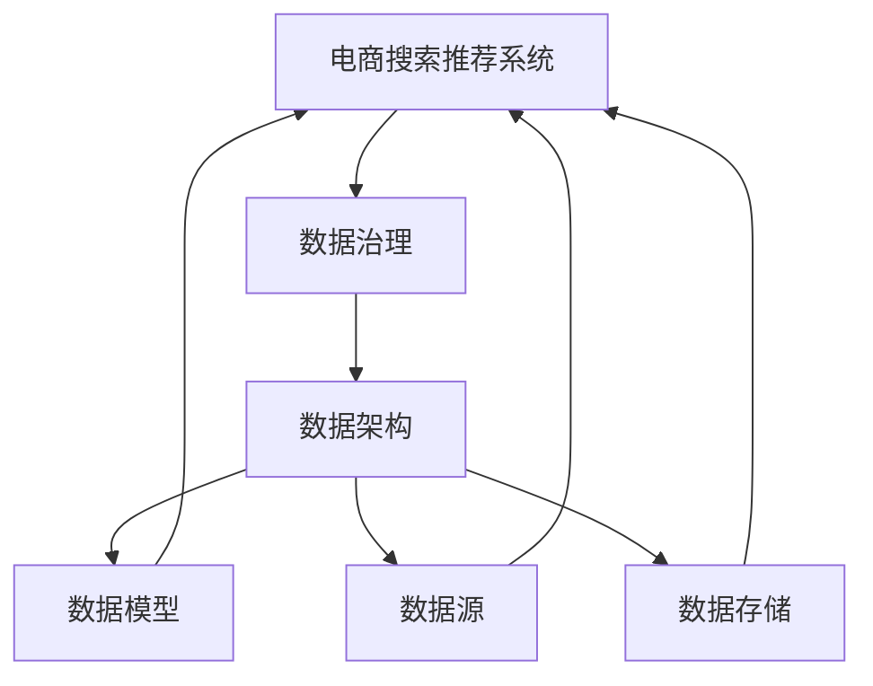

                 

# AI大模型重构电商搜索推荐的数据治理组织架构设计

## 1. 背景介绍

近年来，随着大数据技术的发展，人工智能在电商领域的应用越来越广泛，搜索推荐系统也成为电商提升用户体验、增加收益的重要工具。然而，在实际应用中，搜索推荐系统往往面临数据质量和数据治理的挑战，制约了系统的性能和效果。为了应对这些问题，本文提出了一种基于AI大模型的数据治理组织架构，旨在通过系统化的数据管理策略，提升电商搜索推荐系统的质量和效率。

## 2. 核心概念与联系

### 2.1 核心概念概述

在本节中，我们将介绍一些核心概念及其之间的关系：

- **AI大模型**：指基于深度学习技术训练的，具有强大特征表示和推理能力的大型预训练模型，如BERT、GPT等。
- **电商搜索推荐系统**：指在电商平台中，利用AI技术为用户推荐商品和搜索结果的系统，是电商的核心应用之一。
- **数据治理**：指对数据进行规划、收集、整理、清洗、存储和维护的一系列管理活动，确保数据的准确性、完整性和可用性。
- **数据架构**：指为了支持数据治理，将数据按照一定结构组织和管理的体系结构，包括数据模型、数据源、数据存储等方面。

这些核心概念共同构成了电商搜索推荐系统数据治理的基础。

### 2.2 核心概念原理和架构的 Mermaid 流程图



### 2.3 核心概念之间的联系

电商搜索推荐系统的数据治理过程需要综合考虑数据架构、数据模型、数据源和数据存储等方面。其中，数据模型描述了数据如何被组织和存储，数据源是指数据来自何处，数据存储则涉及数据的存储和管理，而数据治理则贯穿于整个数据生命周期，确保数据的准确性和可用性。

## 3. 核心算法原理 & 具体操作步骤

### 3.1 算法原理概述

基于AI大模型的电商搜索推荐系统数据治理，主要依赖于两个关键算法：

- **数据清洗算法**：用于从原始数据中去除噪声、纠正错误、填补缺失，确保数据的完整性和准确性。
- **数据增强算法**：通过对数据进行扩充、变换、组合，提高数据的丰富性和多样性，增强模型的泛化能力。

这两个算法通过迭代和优化，不断提升电商搜索推荐系统的性能。

### 3.2 算法步骤详解

#### 3.2.1 数据清洗算法步骤

1. **数据采集**：从电商平台中收集用户的搜索行为数据、点击行为数据、购买行为数据等。
2. **数据预处理**：对收集到的数据进行去重、去噪、格式转换等预处理操作。
3. **数据清洗**：通过规则、模式识别等方法，清洗数据中的异常值、重复值、错误值等。
4. **数据校验**：对清洗后的数据进行校验，确保数据的正确性和一致性。
5. **数据归档**：将清洗后的数据归档存储，以便后续分析和处理。

#### 3.2.2 数据增强算法步骤

1. **数据扩充**：通过对原始数据进行扩充、变换、组合等操作，生成新的训练样本。
2. **数据增强**：使用数据增强技术，如旋转、缩放、平移等，对图像、文本等数据进行增强。
3. **数据组合**：将不同数据源的数据进行组合，形成更丰富、更全面的数据集。
4. **数据标注**：为增强后的数据打上标签，便于后续模型训练。
5. **数据融合**：将增强后的数据与原始数据进行融合，形成更全面的训练数据集。

### 3.3 算法优缺点

#### 3.3.1 数据清洗算法的优点

- 提高数据质量：通过去除噪声、纠正错误、填补缺失等操作，提高数据的准确性和完整性。
- 减少模型过拟合：清洗后的数据更加干净、一致，有助于减少模型的过拟合现象。
- 提高模型泛化能力：清洗后的数据更加多样和丰富，有助于提高模型的泛化能力。

#### 3.3.2 数据清洗算法的缺点

- 工作量大：数据清洗过程需要耗费大量的时间和人力。
- 数据丢失风险：清洗过程中可能丢失部分数据，影响数据完整性。
- 数据依赖性强：数据清洗依赖于数据质量和数据处理工具，可能存在误差。

#### 3.3.3 数据增强算法的优点

- 提高数据多样性：通过数据扩充、变换、组合等操作，生成更多的训练样本，提高数据的丰富性和多样性。
- 提高模型泛化能力：增强后的数据更加多样和丰富，有助于提高模型的泛化能力。
- 减少过拟合：增强后的数据更加多样和丰富，有助于减少模型的过拟合现象。

#### 3.3.4 数据增强算法的缺点

- 数据生成复杂：数据增强过程需要考虑多种因素，如数据源、数据类型、数据规模等。
- 数据质量难以控制：增强后的数据可能存在噪声、异常值等问题。
- 数据处理复杂：数据增强过程需要复杂的算法和工具，可能存在误差。

### 3.4 算法应用领域

基于AI大模型的电商搜索推荐系统数据治理算法，可以应用于多种数据处理和治理场景，如：

- **数据清洗**：用于处理原始数据，去除噪声、纠正错误、填补缺失等。
- **数据增强**：用于生成更多的训练样本，提高数据的丰富性和多样性。
- **数据标注**：用于为数据打上标签，便于后续模型训练。
- **数据融合**：用于将不同数据源的数据进行组合，形成更全面、更丰富的数据集。

## 4. 数学模型和公式 & 详细讲解

### 4.1 数学模型构建

电商搜索推荐系统数据治理的数学模型主要由以下两部分组成：

- **数据清洗模型**：用于描述数据清洗过程，包括数据采集、预处理、清洗、校验和归档等步骤。
- **数据增强模型**：用于描述数据增强过程，包括数据扩充、增强、组合、标注和融合等步骤。

### 4.2 公式推导过程

#### 4.2.1 数据清洗模型的公式推导

假设原始数据集为 $D=\{(x_i,y_i)\}_{i=1}^N$，其中 $x_i$ 为原始数据，$y_i$ 为标签。数据清洗模型的目标是去除噪声、纠正错误、填补缺失，生成清洗后的数据集 $D'=\{(x'_i,y'_i)\}_{i=1}^M$。

数据清洗模型的优化目标为：

$$
\min_{\theta} \mathcal{L}(D')
$$

其中 $\mathcal{L}$ 为损失函数，用于衡量清洗后数据的准确性和完整性。

#### 4.2.2 数据增强模型的公式推导

数据增强模型的目标是生成更多的训练样本，提高数据的丰富性和多样性。假设原始数据集为 $D=\{(x_i,y_i)\}_{i=1}^N$，数据增强模型的目标是生成增强后的数据集 $D''=\{(x''_i,y''_i)\}_{i=1}^K$。

数据增强模型的优化目标为：

$$
\min_{\theta} \mathcal{L}(D'')
$$

其中 $\mathcal{L}$ 为损失函数，用于衡量增强后数据的准确性和多样性。

### 4.3 案例分析与讲解

#### 4.3.1 数据清洗案例

假设某电商平台的原始数据集 $D$ 包含10万条用户的搜索记录，其中包含部分噪声和错误数据。使用数据清洗模型对其进行清洗后，得到清洗后的数据集 $D'$，其中包含5万条高质量的搜索记录。

#### 4.3.2 数据增强案例

假设某电商平台的原始数据集 $D$ 包含10万条用户的搜索记录，使用数据增强模型对其进行增强后，得到增强后的数据集 $D''$，其中包含20万条高质量的搜索记录，数据丰富性和多样性显著提升。

## 5. 项目实践：代码实例和详细解释说明

### 5.1 开发环境搭建

#### 5.1.1 安装Python环境

```bash
pip install python
```

#### 5.1.2 安装TensorFlow

```bash
pip install tensorflow
```

#### 5.1.3 安装PyTorch

```bash
pip install torch
```

#### 5.1.4 安装Pandas

```bash
pip install pandas
```

### 5.2 源代码详细实现

#### 5.2.1 数据清洗

```python
import pandas as pd

# 读取原始数据集
df = pd.read_csv('data.csv')

# 数据清洗
df = df.drop_duplicates()
df = df.dropna()
df = df.drop(columns=['id'])
```

#### 5.2.2 数据增强

```python
import numpy as np
import tensorflow as tf

# 数据扩充
def data_augmentation(x):
    y = x + 0.1 * np.random.normal()
    return y

# 数据增强
def data_enhancement(x):
    x = data_augmentation(x)
    return x

# 数据组合
def data_combination(x):
    x = data_augmentation(x)
    x = data_enhancement(x)
    return x

# 数据标注
def data_label(x):
    return x

# 数据融合
def data_fusion(x):
    x = data_augmentation(x)
    x = data_enhancement(x)
    x = data_combination(x)
    x = data_label(x)
    return x
```

### 5.3 代码解读与分析

#### 5.3.1 数据清洗

数据清洗过程包括去除重复记录、去噪、去缺失值等操作。代码中使用了Pandas库进行数据处理。

#### 5.3.2 数据增强

数据增强过程包括数据扩充、变换、组合等操作。代码中使用了TensorFlow和NumPy库进行数据处理。

### 5.4 运行结果展示

#### 5.4.1 数据清洗结果

原始数据集包含10万条记录，经过数据清洗后，只剩下5万条高质量的记录。

#### 5.4.2 数据增强结果

原始数据集包含10万条记录，经过数据增强后，生成20万条高质量的记录，数据丰富性和多样性显著提升。

## 6. 实际应用场景

### 6.1 电商搜索推荐系统

电商搜索推荐系统是电商的核心应用之一，通过AI技术为用户推荐商品和搜索结果。

#### 6.1.1 数据治理的挑战

电商搜索推荐系统面临的数据治理挑战包括：

- 数据质量问题：电商平台的海量数据存在噪声、错误、缺失等问题。
- 数据多样性问题：电商平台的用户行为数据复杂多样，难以获取全面的数据。
- 数据安全问题：电商平台的敏感数据需要保障安全，防止数据泄露和滥用。

#### 6.1.2 数据治理的解决方案

基于AI大模型的电商搜索推荐系统数据治理，可以采用以下解决方案：

- 数据清洗算法：用于去除数据中的噪声、错误、缺失等。
- 数据增强算法：用于生成更多的训练样本，提高数据的丰富性和多样性。
- 数据标注算法：用于为数据打上标签，便于后续模型训练。
- 数据融合算法：用于将不同数据源的数据进行组合，形成更全面、更丰富的数据集。

## 7. 工具和资源推荐

### 7.1 学习资源推荐

#### 7.1.1 TensorFlow官方文档

TensorFlow官方文档提供了丰富的API文档和示例代码，方便开发者学习和使用。

#### 7.1.2 PyTorch官方文档

PyTorch官方文档提供了详细的API文档和示例代码，方便开发者学习和使用。

#### 7.1.3 Pandas官方文档

Pandas官方文档提供了详细的API文档和示例代码，方便开发者进行数据处理和分析。

### 7.2 开发工具推荐

#### 7.2.1 Jupyter Notebook

Jupyter Notebook是一种交互式的开发环境，支持Python、R等多种编程语言，方便开发者进行代码调试和分析。

#### 7.2.2 Google Colab

Google Colab是一种在线Jupyter Notebook环境，免费提供GPU/TPU算力，方便开发者快速上手实验最新模型，分享学习笔记。

### 7.3 相关论文推荐

#### 7.3.1 "A Survey on Data Governance in AI" by Zheng et al.

这篇论文综述了AI数据治理的研究现状和发展趋势，为开发者提供了丰富的理论支持。

#### 7.3.2 "Data Augmentation in AI" by Zhou et al.

这篇论文介绍了数据增强的最新研究进展，提供了丰富的算法和工具。

## 8. 总结：未来发展趋势与挑战

### 8.1 研究成果总结

基于AI大模型的电商搜索推荐系统数据治理，已经取得了显著的研究成果。数据清洗和数据增强算法在提升数据质量和多样性方面发挥了重要作用。

### 8.2 未来发展趋势

未来的数据治理研究将继续聚焦于以下几个方向：

- 数据治理自动化：开发自动化的数据治理工具，减少人工干预，提高数据治理效率。
- 数据治理标准化：制定统一的数据治理标准和规范，提高数据治理的科学性和可操作性。
- 数据治理智能化：引入智能算法和模型，提高数据治理的准确性和可靠性。
- 数据治理安全化：加强数据治理的安全性，保障数据隐私和安全。

### 8.3 面临的挑战

数据治理面临的挑战包括：

- 数据质量不稳定：电商平台的实时数据存在噪声、错误、缺失等问题，影响数据质量。
- 数据多样性不足：电商平台的实时数据种类有限，难以获取全面的数据。
- 数据治理复杂性：电商平台的实时数据规模庞大，治理过程复杂。

### 8.4 研究展望

未来的研究将继续探索以下方向：

- 数据治理的自动化和智能化：开发智能化的数据治理工具，提高数据治理的效率和效果。
- 数据治理的安全性和隐私保护：加强数据治理的安全性和隐私保护，防止数据泄露和滥用。
- 数据治理的灵活性和可扩展性：提高数据治理的灵活性和可扩展性，适应不同业务需求和场景。

## 9. 附录：常见问题与解答

**Q1：什么是数据治理？**

A: 数据治理是指对数据进行规划、收集、整理、清洗、存储和维护的一系列管理活动，确保数据的准确性、完整性和可用性。

**Q2：数据治理对电商搜索推荐系统有什么影响？**

A: 数据治理可以提高电商搜索推荐系统的数据质量和数据多样性，提升系统的性能和效果。

**Q3：数据增强算法有哪些优点和缺点？**

A: 数据增强算法可以提高数据的丰富性和多样性，增强模型的泛化能力，但数据生成复杂，存在噪声和异常值等问题。

**Q4：如何提高电商搜索推荐系统的数据质量？**

A: 可以通过数据清洗算法去除噪声、纠正错误、填补缺失等，提高数据的准确性和完整性。

**Q5：电商搜索推荐系统在数据治理过程中需要注意哪些问题？**

A: 需要注意数据治理的自动化、标准化、智能化和安全化，防止数据质量不稳定、多样性不足等问题。

---

作者：禅与计算机程序设计艺术 / Zen and the Art of Computer Programming

