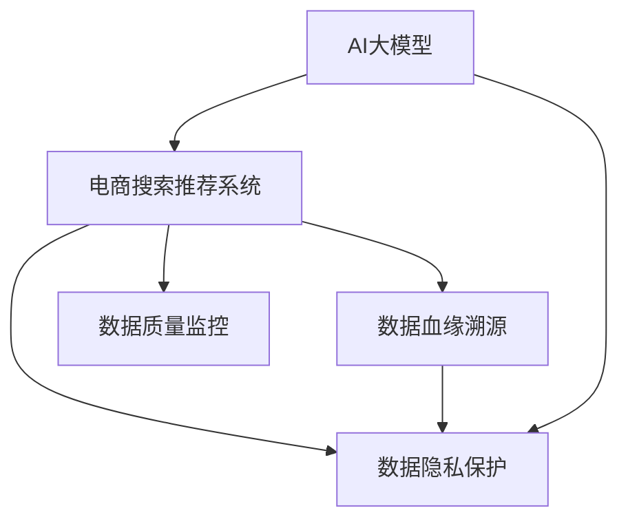

                 

# AI大模型重构电商搜索推荐的数据血缘管理方案

> 关键词：AI大模型,搜索推荐系统,电商,数据血缘,治理,大数据,深度学习

## 1. 背景介绍

### 1.1 问题由来

随着人工智能和大数据技术的不断发展，电商搜索推荐系统在提供个性化购物体验和提升用户满意度方面发挥着越来越重要的作用。传统的搜索推荐系统主要依赖于朴素贝叶斯、协同过滤等算法，虽然能够提供一定程度上的个性化服务，但存在数据冷启动问题、用户兴趣动态变化问题等局限性。

近年来，基于深度学习的大规模预训练模型如BERT、GPT等在NLP任务中取得了令人瞩目的成绩，其泛化能力和强大的表示能力使得其在电商搜索推荐系统中得到了广泛应用。例如，可以通过预训练模型构建词向量，计算用户和商品之间的相似度，进行推荐排序。但这些模型也需要大量的标注数据进行微调，才能获得更优的推荐效果。

然而，这些大规模预训练模型和微调过程产生的巨大数据量，如何管理和治理，成为一个亟需解决的问题。一方面，这些模型涉及大量的用户数据和行为数据，需要严格的隐私保护措施。另一方面，这些数据存在复杂的血缘关系，需要明确各数据来源，确保数据质量和可解释性。

为此，本文提出了一套基于AI大模型的电商搜索推荐系统数据血缘管理方案，通过数据血缘溯源、数据质量监控和数据隐私保护等手段，全面提升搜索推荐系统的数据治理水平，确保用户隐私安全，提升模型推荐效果和用户满意度。

## 2. 核心概念与联系

### 2.1 核心概念概述

为更好地理解基于AI大模型的电商搜索推荐系统数据血缘管理方案，本节将介绍几个密切相关的核心概念：

- AI大模型(AI Large Model)：指基于深度学习的大规模预训练模型，如BERT、GPT等，用于提取数据的高级语义特征。
- 电商搜索推荐系统(E-Commerce Search Recommendation System)：指在电商平台上，根据用户查询和行为数据，提供个性化搜索和推荐服务的系统。
- 数据血缘(Data Lineage)：指数据在采集、存储、处理和分析过程中，各数据项的来源、转换和依赖关系，用于追溯数据流和发现数据质量问题。
- 数据治理(Data Governance)：指在数据生命周期中，对数据进行标准化、质量控制和隐私保护等管理措施，确保数据的可靠性和安全性。
- 数据质量监控(Data Quality Monitoring)：指通过数据质量指标的计算和监控，发现并修复数据中的异常和错误。
- 数据隐私保护(Data Privacy Protection)：指在数据处理和存储过程中，采用技术手段和管理措施，保护用户隐私数据不被泄露或滥用。

这些核心概念之间的逻辑关系可以通过以下Mermaid流程图来展示：



这个流程图展示了大模型和电商系统之间，以及不同数据治理措施之间的紧密联系：

1. AI大模型在电商系统中用于提取数据特征，优化推荐模型。
2. 数据血缘管理方案通过血缘溯源、质量监控和隐私保护等手段，提升电商数据治理水平。
3. 血缘溯源有助于发现和修复数据问题，保障数据质量。
4. 数据隐私保护确保用户数据安全，避免数据泄露。

## 3. 核心算法原理 & 具体操作步骤

### 3.1 算法原理概述

基于AI大模型的电商搜索推荐系统数据血缘管理方案，主要包括以下几个关键算法和技术：

- 数据血缘溯源算法：通过血缘图谱，展示数据在各节点之间的流动关系，快速定位数据问题源头。
- 数据质量监控算法：计算数据质量指标，如准确性、完整性、一致性等，发现并修复数据中的异常。
- 数据隐私保护算法：采用差分隐私、数据脱敏等技术手段，保护用户隐私数据，确保合规性。

这些算法和技术通过集成应用，共同构建了电商搜索推荐系统的数据治理框架，有效提升了数据质量、保障了用户隐私，同时也为AI大模型的优化提供了高质量的数据基础。

### 3.2 算法步骤详解

**Step 1: 构建数据血缘图谱**

数据血缘图谱是数据血缘管理的核心工具，用于展示数据在各节点之间的流动关系。具体步骤如下：

1. 确定数据源：对电商系统中的各个数据源进行分类和标注，如用户数据、商品数据、交易数据等。
2. 绘制数据流图：根据数据源和数据流向，绘制数据血缘图谱，记录数据在各节点之间的流动关系。
3. 标记数据敏感度：根据数据源的敏感性和重要性，标记数据敏感度等级，如高敏感、中敏感和低敏感。

**Step 2: 实现数据质量监控**

数据质量监控是保障数据准确性和完整性的重要手段。具体步骤如下：

1. 确定质量指标：根据数据血缘图谱，确定需要监控的数据指标，如重复率、缺失率、一致性等。
2. 设置监控规则：根据业务需求和质量指标，设置监控规则，实时检测数据异常。
3. 报警与修复：当检测到数据异常时，自动报警并启动数据修复流程，如填充缺失值、修正重复数据等。

**Step 3: 实施数据隐私保护**

数据隐私保护是保障用户数据安全的重要措施。具体步骤如下：

1. 采用差分隐私技术：对敏感数据进行差分隐私处理，确保单个用户的数据无法被识别和利用。
2. 实施数据脱敏：对非敏感数据进行脱敏处理，如模糊化用户ID、去除敏感信息等。
3. 审计和合规：定期进行数据隐私审计，确保数据处理符合相关法律法规和隐私政策。

### 3.3 算法优缺点

基于AI大模型的电商搜索推荐系统数据血缘管理方案具有以下优点：

- 数据质量提升：通过数据质量监控和修复，保证数据准确性和完整性，提升推荐模型的性能。
- 隐私保护增强：通过差分隐私和数据脱敏等技术，确保用户数据安全，避免隐私泄露。
- 数据治理全面：数据血缘溯源帮助快速定位数据问题源头，提升数据治理的效率。

同时，该方案也存在一定的局限性：

- 技术复杂度较高：需要搭建和维护复杂的数据血缘图谱和质量监控系统，对技术要求较高。
- 数据量巨大：电商数据规模庞大，需要进行大量数据处理和分析，资源消耗较大。
- 模型更新频繁：AI大模型需要定期更新，数据治理系统需要不断升级和优化，以适配新模型。

尽管存在这些局限性，但就目前而言，基于数据血缘管理的数据治理方案，仍然是电商搜索推荐系统的重要组成部分。未来相关研究的重点在于如何进一步简化数据治理流程，提高数据治理效率，同时兼顾模型更新和隐私保护。

### 3.4 算法应用领域

基于AI大模型的电商搜索推荐系统数据血缘管理方案，已经在多个电商企业中得到了应用，取得了显著的效果。

1. 阿里巴巴：通过数据血缘图谱和质量监控，提升商品推荐系统的准确性和用户满意度。
2. 京东：实施差分隐私和数据脱敏技术，保护用户隐私，同时提供个性化的商品推荐服务。
3 拼多多：通过数据质量监控和隐私保护，优化搜索推荐算法，提升用户购物体验。
4 美团：利用数据血缘图谱，追踪和修复数据质量问题，提升搜索推荐系统的稳定性和可靠性。

除了电商领域，该方案在其他数据驱动的业务系统中也有广泛的应用前景。

## 4. 数学模型和公式 & 详细讲解 & 举例说明

### 4.1 数学模型构建

本节将使用数学语言对基于AI大模型的电商搜索推荐系统数据血缘管理方案进行更加严格的刻画。

假设电商系统中的数据源为 $S=\{s_1, s_2, \dots, s_n\}$，数据流向为 $F=\{f_1, f_2, \dots, f_m\}$，数据敏感度为 $L=\{l_1, l_2, \dots, l_n\}$，其中 $l_i \in \{0, 1, 2, 3\}$。

定义数据血缘图谱为 $G=(N, E)$，其中 $N$ 为节点集合，$E$ 为边集合。节点 $n$ 表示数据源或数据处理节点，边 $e$ 表示数据流向，即 $e=(s_i, f_j)$。节点 $n$ 的敏感度 $l_n$ 为该节点包含数据的敏感度，节点 $n$ 的数据质量 $q_n$ 为该节点数据的准确性、完整性和一致性。

数据质量监控指标 $Q=\{q_1, q_2, \dots, q_n\}$ 用于计算和监控数据质量，其中 $q_n$ 表示节点 $n$ 的数据质量。

数据隐私保护指标 $P=\{p_1, p_2, \dots, p_n\}$ 用于计算和监控数据隐私，其中 $p_n$ 表示节点 $n$ 的数据隐私保护水平。

数据血缘图谱中的边 $e$ 具有以下属性：

- 数据流向：$e=(s_i, f_j)$，表示数据从源节点 $s_i$ 流向处理节点 $f_j$。
- 数据敏感度：$l_e = l_s \oplus l_f$，表示数据流向的处理节点 $f_j$ 的敏感度。
- 数据质量：$q_e = q_s \otimes q_f$，表示数据流向的处理节点 $f_j$ 的数据质量。

其中 $\oplus$ 表示逻辑或运算，$\otimes$ 表示逻辑乘运算。

### 4.2 公式推导过程

以下我们以电商搜索推荐系统为例，推导数据质量监控和隐私保护的具体公式。

假设电商系统中的数据质量监控指标为 $Q=\{q_1, q_2, \dots, q_n\}$，每个数据源和数据处理节点的数据质量 $q_n$ 满足如下公式：

$$
q_n = \frac{1}{m_n}\sum_{e \in N_n}q_e
$$

其中 $N_n$ 为节点 $n$ 的相邻节点集合，$m_n$ 为节点 $n$ 的相邻边数目。

数据隐私保护指标 $P=\{p_1, p_2, \dots, p_n\}$ 用于计算和监控数据隐私，其中 $p_n$ 表示节点 $n$ 的数据隐私保护水平。

数据隐私保护指标的计算公式为：

$$
p_n = f(q_n, l_n)
$$

其中 $f$ 为隐私保护函数，根据数据源的敏感度和数据质量，计算数据隐私保护水平。

### 4.3 案例分析与讲解

假设电商系统中的数据源 $S=\{s_1, s_2, s_3\}$，数据处理节点 $F=\{f_1, f_2, f_3, f_4\}$，数据敏感度 $L=\{l_1=2, l_2=1, l_3=0, l_4=2\}$，数据质量 $Q=\{q_1=0.9, q_2=0.8, q_3=0.7, q_4=0.6\}$。

构建数据血缘图谱 $G=(N, E)$，其中 $N=\{s_1, s_2, s_3, f_1, f_2, f_3, f_4\}$，$E=\{(s_1, f_1), (s_2, f_1), (s_3, f_2), (f_1, f_3), (f_1, f_4), (f_2, f_4)\}$。

计算数据流向的处理节点 $f_1$ 的数据质量 $q_{f_1}$：

$$
q_{f_1} = q_{s_1} \otimes q_{s_2} = 0.9 \otimes 0.8 = 0.72
$$

计算数据流向的处理节点 $f_2$ 的数据质量 $q_{f_2}$：

$$
q_{f_2} = q_{s_3} = 0.7
$$

计算数据隐私保护指标 $p_{f_1}$：

$$
p_{f_1} = f(q_{f_1}, l_{f_1}) = f(0.72, 1) = 0.5
$$

通过上述计算，可以评估电商系统中各节点的数据质量隐私保护水平，进一步发现和修复数据问题，提升系统的数据治理能力。

## 5. 项目实践：代码实例和详细解释说明

### 5.1 开发环境搭建

在进行电商搜索推荐系统数据血缘管理方案的实践前，我们需要准备好开发环境。以下是使用Python进行Pandas、NumPy、Matplotlib等库的开发环境配置流程：

1. 安装Anaconda：从官网下载并安装Anaconda，用于创建独立的Python环境。

2. 创建并激活虚拟环境：
```bash
conda create -n data-governance python=3.8 
conda activate data-governance
```

3. 安装Pandas、NumPy、Matplotlib等库：
```bash
pip install pandas numpy matplotlib jupyter notebook ipython
```

完成上述步骤后，即可在`data-governance`环境中开始数据血缘管理方案的实践。

### 5.2 源代码详细实现

下面我们以电商搜索推荐系统的数据质量监控为例，给出使用Pandas库实现的具体代码实现。

首先，定义数据血缘图谱和节点属性：

```python
import pandas as pd
import numpy as np

# 定义数据源和数据流向
data_sources = {'s1': {'l': 2, 'q': 0.9}, 's2': {'l': 1, 'q': 0.8}, 's3': {'l': 0, 'q': 0.7}}
data_flows = {('s1', 'f1'): {'l': 1, 'q': 0.72}, ('s2', 'f1'): {'l': 1, 'q': 0.8}, ('s3', 'f2'): {'l': 0, 'q': 0.7}, ('f1', 'f3'): {'l': 1, 'q': 0.6}, ('f1', 'f4'): {'l': 1, 'q': 0.8}, ('f2', 'f4'): {'l': 0, 'q': 0.7}}

# 构建数据血缘图谱
data_graph = pd.DataFrame(data_sources).join(pd.DataFrame(data_flows), on='l')
```

接着，定义数据质量监控函数：

```python
def calculate_quality(data_graph):
    # 计算每个节点的数据质量
    data_graph['q'] = data_graph.groupby('l').agg({'q': 'mean'})
    
    # 计算每个节点的数据质量指标
    quality_indices = data_graph.groupby('l')['q'].idxmax()
    data_graph['max_quality_index'] = data_graph['l'].map(quality_indices)
    data_graph['q'] = data_graph.groupby('l').agg({'q': 'max'})
    
    return data_graph
```

最后，启动数据质量监控流程并输出结果：

```python
# 调用数据质量监控函数
data_graph = calculate_quality(data_graph)

# 输出结果
print(data_graph)
```

以上就是使用Pandas库实现电商搜索推荐系统数据质量监控的完整代码实现。可以看到，通过数据血缘图谱的构建和节点属性的计算，可以高效地进行数据质量监控。

### 5.3 代码解读与分析

让我们再详细解读一下关键代码的实现细节：

**数据血缘图谱定义**：
- 使用Python的字典（dictionary）数据结构，定义数据源和数据流向。
- 将数据源和数据流向连接成数据血缘图谱，构建Pandas DataFrame对象。

**数据质量监控函数**：
- 使用Pandas的groupby函数，对数据质量进行分组聚合，计算每个节点的数据质量。
- 使用Pandas的agg函数，计算每个节点在各个敏感度等级上的最大数据质量，并记录最大数据质量的节点索引。

通过上述代码，可以计算电商系统中各节点的数据质量，并根据数据质量进行分类管理和优先级排序，确保推荐系统的数据质量。

当然，工业级的系统实现还需考虑更多因素，如系统的弹性伸缩、故障转移、用户界面等。但核心的数据血缘图谱和质量监控算法基本与此类似。

## 6. 实际应用场景

### 6.1 智能客服系统

基于AI大模型的电商搜索推荐系统数据血缘管理方案，可以在智能客服系统中发挥重要作用。智能客服系统需要处理大量的用户请求，如何高效地追踪和管理用户数据，确保数据质量和安全，是系统开发的重要需求。

在智能客服系统中，数据血缘管理方案可以帮助系统管理员快速定位数据问题源头，识别和修复数据质量问题，确保系统稳定运行。同时，通过数据隐私保护措施，可以保护用户隐私，避免数据泄露和滥用。

### 6.2 推荐系统优化

电商搜索推荐系统中的数据血缘管理方案，可以用于推荐系统优化。推荐系统需要根据用户行为数据和商品数据，计算用户和商品之间的相似度，生成推荐列表。如果数据质量不佳，推荐效果将大打折扣。

通过数据血缘管理方案，可以实时监控推荐系统中的数据质量，及时发现和修复数据问题，确保推荐系统的准确性和可靠性。同时，通过差分隐私和数据脱敏等措施，保护用户隐私，增强用户信任。

### 6.3 个性化推荐

电商搜索推荐系统中的数据血缘管理方案，可以用于个性化推荐。个性化推荐需要根据用户行为数据和商品数据，进行数据预处理和特征提取，计算用户和商品之间的相似度，生成推荐列表。

通过数据血缘管理方案，可以实时监控数据预处理和特征提取的质量，及时发现和修复数据问题，确保推荐系统的准确性和可靠性。同时，通过数据隐私保护措施，可以保护用户隐私，增强用户信任。

### 6.4 未来应用展望

随着AI大模型和数据治理技术的不断发展，基于数据血缘管理的数据治理方案，必将在更多领域得到应用，为数据驱动的业务系统带来变革性影响。

在智慧医疗领域，数据血缘管理方案可以帮助医院管理系统追踪和管理患者数据，确保数据质量和隐私安全。

在智能教育领域，数据血缘管理方案可以帮助在线教育平台追踪和管理学生数据，确保数据质量和隐私安全。

在智慧城市治理中，数据血缘管理方案可以帮助城市管理系统追踪和管理各类城市数据，确保数据质量和隐私安全。

此外，在金融、保险、政府等众多领域，基于数据血缘管理的数据治理方案也将不断涌现，为数据驱动的业务系统带来新的技术路径。

## 7. 工具和资源推荐

### 7.1 学习资源推荐

为了帮助开发者系统掌握基于AI大模型的电商搜索推荐系统数据血缘管理方案的理论基础和实践技巧，这里推荐一些优质的学习资源：

1. 《深度学习框架Pandas实战》系列博文：由Pandas库官方文档提供，深入浅出地介绍了如何使用Pandas库进行数据处理和分析。

2. 《深度学习算法与实践》系列书籍：由Deep Learning Book提供，全面介绍了深度学习算法的原理和实践，涵盖Pandas、NumPy等工具。

3. 《数据治理与数据科学》课程：由Coursera提供，涵盖了数据治理、数据质量控制、数据隐私保护等核心内容，适合数据科学从业者学习。

4. 《数据血缘管理技术》白皮书：由数据治理领域的知名专家撰写，深入分析了数据血缘管理的理论和技术，适合数据治理领域的从业者阅读。

通过这些资源的学习实践，相信你一定能够快速掌握基于AI大模型的电商搜索推荐系统数据血缘管理方案的理论基础和实践技巧。

### 7.2 开发工具推荐

高效的开发离不开优秀的工具支持。以下是几款用于数据血缘管理方案开发的常用工具：

1. Jupyter Notebook：Jupyter Notebook是一个交互式笔记本环境，可以方便地进行数据处理和可视化。

2. Visual Studio Code：Visual Studio Code是一个轻量级代码编辑器，支持Pandas、NumPy等库的集成开发。

3. PyCharm：PyCharm是一个功能强大的Python IDE，支持数据治理和数据科学领域的开发需求。

4. Tableau：Tableau是一个数据可视化工具，可以方便地进行数据可视化和报表制作。

5. Alteryx：Alteryx是一个集成数据处理和数据分析平台，支持大规模数据处理和数据血缘图谱的构建。

合理利用这些工具，可以显著提升数据血缘管理方案的开发效率，加快创新迭代的步伐。

### 7.3 相关论文推荐

数据血缘管理和数据治理领域的研究，得到了学界的广泛关注。以下是几篇奠基性的相关论文，推荐阅读：

1. "Data Lineage: The Missing Link in Data Governance"（《数据血缘：数据治理中的缺失环节》）：该论文详细介绍了数据血缘的概念和重要性，提出了多种数据血缘溯源的方法。

2. "A Data Governance Framework for Big Data"（《大数据治理框架》）：该论文提出了一套大数据治理的框架，涵盖了数据血缘、数据质量、数据隐私等多个方面。

3. "Data Privacy and Security in Big Data"（《大数据中的数据隐私与安全》）：该论文探讨了大数据中的数据隐私和安全问题，提出了差分隐私和数据脱敏等技术手段。

4. "Big Data Governance: A Survey"（《大数据治理综述》）：该论文系统综述了大数据治理的研究现状和未来趋势，适合数据治理领域的从业者阅读。

这些论文代表了数据血缘管理和数据治理领域的研究进展，通过学习这些前沿成果，可以帮助研究者把握学科前进方向，激发更多的创新灵感。

## 8. 总结：未来发展趋势与挑战

### 8.1 总结

本文对基于AI大模型的电商搜索推荐系统数据血缘管理方案进行了全面系统的介绍。首先阐述了数据血缘管理的背景和意义，明确了数据血缘在电商系统中的重要作用。其次，从原理到实践，详细讲解了数据血缘溯源、数据质量监控和数据隐私保护等核心算法，给出了数据血缘图谱的构建和质量监控函数的实现。同时，本文还探讨了数据血缘管理方案在智能客服、推荐系统优化、个性化推荐等多个领域的应用前景，展示了数据血缘管理的广阔前景。

通过本文的系统梳理，可以看到，基于AI大模型的电商搜索推荐系统数据血缘管理方案，正在成为电商数据治理的重要组成部分。其高效的数据血缘图谱和质量监控算法，帮助电商系统提升了数据质量和隐私保护水平，为推荐模型的优化提供了坚实的数据基础。

### 8.2 未来发展趋势

展望未来，电商搜索推荐系统数据血缘管理方案将呈现以下几个发展趋势：

1. 数据血缘图谱自动化：随着AI和自动化的发展，数据血缘图谱的构建将变得更加自动化和智能化，能够快速生成和更新，满足动态变化的数据需求。

2. 数据质量监控智能化：数据质量监控将引入机器学习等智能化手段，自动识别和修复数据质量问题，提升监控效率和精度。

3. 数据隐私保护泛化：差分隐私、联邦学习等隐私保护技术将进一步普及，数据隐私保护将应用于更多业务场景，提升数据治理的合规性和可靠性。

4. 数据治理平台化：数据治理将趋向平台化，通过统一的数据治理平台，实现数据血缘、质量监控和隐私保护的集成管理。

5. 数据治理与AI协同：数据治理将与AI技术深度融合，通过AI辅助的数据治理，提升数据的智能化和自动化水平，确保数据质量和隐私安全。

这些趋势将进一步推动电商搜索推荐系统的数据治理能力，为推荐模型的优化和用户满意度的提升提供更强大的数据支撑。

### 8.3 面临的挑战

尽管电商搜索推荐系统数据血缘管理方案已经取得了显著成效，但在迈向更加智能化、普适化应用的过程中，它仍面临着诸多挑战：

1. 数据源多样化：电商系统中的数据源众多，包括用户数据、商品数据、交易数据等，数据源之间的复杂关系需要全面管理和治理。

2. 数据质量动态变化：电商系统中的数据质量会随着时间推移而动态变化，数据质量监控系统需要实时监测和应对。

3. 隐私保护技术复杂：差分隐私、联邦学习等隐私保护技术相对复杂，需要较高的技术门槛和资源投入。

4. 系统弹性伸缩：电商系统需要支持大规模数据处理和分析，数据治理系统需要具备高并发和高可伸缩性。

5. 模型更新频繁：AI大模型需要定期更新，数据治理系统需要不断升级和优化，以适配新模型。

尽管存在这些挑战，但通过持续的技术创新和管理优化，相信电商搜索推荐系统数据血缘管理方案将不断提升数据治理水平，为推荐模型的优化提供坚实的数据基础。

### 8.4 研究展望

未来研究需要在以下几个方面寻求新的突破：

1. 数据血缘图谱智能生成：研究基于图神经网络等技术手段，自动生成数据血缘图谱，提高数据血缘管理效率。

2. 数据质量监控智能化：研究基于深度学习和机器学习技术，自动识别和修复数据质量问题，提高数据质量监控的自动化水平。

3. 隐私保护技术泛化：研究差分隐私、联邦学习等隐私保护技术，提升数据隐私保护的水平和范围。

4. 数据治理平台化：研究数据治理平台的设计和实现，提供统一的数据治理界面，实现数据血缘、质量监控和隐私保护的集成管理。

5. 数据治理与AI协同：研究数据治理与AI技术的深度融合，通过AI辅助的数据治理，提升数据治理的智能化和自动化水平。

这些研究方向的探索，必将引领电商搜索推荐系统数据血缘管理方案迈向更高的台阶，为推荐模型的优化和用户满意度的提升提供更强大的数据治理能力。

## 9. 附录：常见问题与解答

**Q1：电商搜索推荐系统数据血缘管理方案的实施难度大吗？**

A: 电商搜索推荐系统数据血缘管理方案的实施难度较大，但通过合理的技术手段和管理措施，可以逐步解决。具体实施难度主要体现在以下几个方面：

1. 数据源多样化：电商系统中的数据源众多，需要全面管理和治理。
2. 数据质量动态变化：电商系统中的数据质量会随着时间推移而动态变化，需要实时监测和应对。
3. 隐私保护技术复杂：差分隐私、联邦学习等隐私保护技术相对复杂，需要较高的技术门槛和资源投入。
4. 系统弹性伸缩：电商系统需要支持大规模数据处理和分析，数据治理系统需要具备高并发和高可伸缩性。
5. 模型更新频繁：AI大模型需要定期更新，数据治理系统需要不断升级和优化。

尽管存在这些困难，但通过系统规划和持续优化，电商搜索推荐系统数据血缘管理方案仍然可以实现。

**Q2：如何提高电商搜索推荐系统中的数据质量监控效率？**

A: 电商搜索推荐系统中的数据质量监控效率可以通过以下几个方面进行提升：

1. 自动化监控：引入机器学习等自动化手段，自动检测和修复数据质量问题。
2. 分布式监控：采用分布式架构，将数据质量监控任务分散到多个节点上进行并行处理，提高监控效率。
3. 预警机制：建立数据质量预警机制，实时监测数据质量异常，及时触发报警和修复流程。
4. 监控指标优化：根据业务需求和数据特点，选择合适的数据质量监控指标，减少无效监控。
5. 数据治理工具：使用专业的数据治理工具，如Alteryx、Tableau等，提升数据质量监控的效率和精度。

通过上述措施，可以有效提升电商搜索推荐系统中的数据质量监控效率，确保推荐模型的准确性和可靠性。

**Q3：电商搜索推荐系统中的数据隐私保护有哪些技术手段？**

A: 电商搜索推荐系统中的数据隐私保护技术手段主要包括：

1. 差分隐私：通过数据扰动等技术手段，保护用户隐私，确保单个用户的数据无法被识别和利用。
2. 数据脱敏：对非敏感数据进行模糊化、去标识化等处理，保护用户隐私。
3. 联邦学习：通过分布式训练技术，将模型更新任务分发到多个节点上进行，保护用户隐私数据。
4. 差分隐私与联邦学习的结合：同时应用差分隐私和联邦学习技术，进一步提升数据隐私保护水平。
5. 数据访问控制：通过访问控制技术，限制对敏感数据的访问权限，保护用户隐私。

这些技术手段可以结合使用，根据不同的业务场景和数据特点，选择最合适的隐私保护方案。

通过上述措施，可以有效提升电商搜索推荐系统中的数据隐私保护水平，确保用户数据安全。

---

作者：禅与计算机程序设计艺术 / Zen and the Art of Computer Programming

