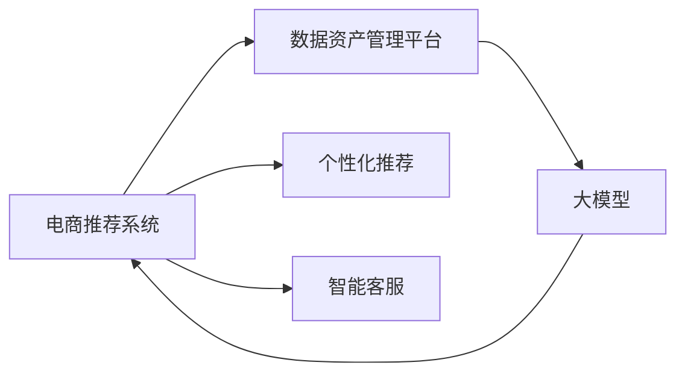

                 

## 1. 背景介绍

随着电商行业的高速发展，用户需求不断增加，电商平台的搜索推荐系统面临着处理海量数据、个性化推荐、实效性要求高等挑战。同时，这些系统所需的数据量不断增加，数据质量、存储、管理等瓶颈问题日益凸显，亟需优化数据资产管理平台。

AI大模型，如Transformer、BERT等，在自然语言处理(NLP)、计算机视觉(CV)、语音识别等领域取得了巨大成功。其强大能力为电商搜索推荐系统的优化提供了新思路。结合大模型与电商推荐系统的特点，本文提出了一种基于AI大模型重构电商搜索推荐系统数据资产管理平台的优化方案。

## 2. 核心概念与联系

### 2.1 核心概念概述

- **AI大模型**：指由深度学习技术训练的大型神经网络模型，如BERT、GPT、Transformer等，能够处理大规模复杂任务，并具备强大的特征提取能力。

- **电商搜索推荐系统**：指电商平台中实现商品搜索、商品推荐、智能客服等功能的信息系统。其核心任务是从海量商品数据中筛选出用户可能感兴趣的物品，提供个性化推荐服务。

- **数据资产管理平台**：指电商公司构建的数据管理及应用系统，用于收集、存储、清洗、处理和分析电商交易、用户行为、商品信息等数据，以支撑搜索推荐、个性化推荐、广告投放等业务。

这三个概念之间存在密切联系，共同构成了电商搜索推荐系统的核心组成部分。大模型作为强大的特征提取器，能够处理海量数据，提取深层次特征，支持电商推荐系统的优化。数据资产管理平台为电商推荐系统提供数据支撑，保障了系统的实效性和精准性。

### 2.2 核心概念原理和架构的 Mermaid 流程图



## 3. 核心算法原理 & 具体操作步骤

### 3.1 算法原理概述

本文提出的优化方案基于以下核心算法：

- **基于大模型的特征提取**：利用大模型提取文本、图像等数据的深层次特征。
- **用户行为数据处理**：对用户点击、浏览、收藏、购买等行为数据进行统计和分析，形成用户画像。
- **商品信息融合**：将商品标签、类别、价格等结构化信息与大模型提取的非结构化特征进行融合。
- **推荐模型训练**：结合商品特征和用户画像，利用深度学习算法训练推荐模型。
- **实时推荐**：将训练好的推荐模型部署在推荐系统中，实时响应搜索推荐请求。

### 3.2 算法步骤详解

#### 3.2.1 数据准备与预处理

1. **数据收集**：收集电商平台的交易数据、用户行为数据、商品信息等，作为数据资产管理平台的原始数据来源。
2. **数据清洗**：对数据进行去重、填补缺失、去除异常值等清洗处理，确保数据质量。
3. **数据标注**：对部分数据进行人工标注，用于训练大模型或模型评估。

#### 3.2.2 特征提取

1. **文本特征提取**：利用BERT、GPT等大模型对商品描述、用户评论等文本数据进行特征提取，形成文本向量。
2. **图像特征提取**：利用ResNet、VGG等大模型对商品图片进行特征提取，形成图像向量。

#### 3.2.3 用户画像构建

1. **用户行为分析**：统计用户点击、浏览、收藏、购买等行为，构建用户画像。
2. **用户画像聚类**：利用K-means、DBSCAN等算法对用户画像进行聚类，形成用户群体。

#### 3.2.4 商品信息融合

1. **商品信息抽取**：利用自然语言处理(NLP)技术抽取商品标签、类别、价格等结构化信息。
2. **特征融合**：将大模型提取的非结构化特征与商品信息抽取的结构化特征进行融合，形成复合特征向量。

#### 3.2.5 推荐模型训练

1. **模型选择**：选择基于深度学习的推荐模型，如协同过滤、基于内容推荐、混合推荐等。
2. **模型训练**：利用训练数据集，训练推荐模型，优化模型参数。

#### 3.2.6 实时推荐

1. **模型部署**：将训练好的推荐模型部署在推荐系统中，实时响应用户请求。
2. **推荐生成**：根据用户画像和商品特征，生成个性化推荐结果。

### 3.3 算法优缺点

#### 3.3.1 算法优点

1. **高效特征提取**：利用大模型高效提取文本、图像等数据的深层次特征，支持海量数据处理。
2. **精准用户画像**：通过用户行为数据分析，构建精准用户画像，提升个性化推荐效果。
3. **动态实时推荐**：结合实时用户画像和商品特征，动态生成个性化推荐结果，保障实效性。

#### 3.3.2 算法缺点

1. **数据处理成本高**：大模型特征提取、用户画像构建等需要大量计算资源，数据处理成本较高。
2. **模型复杂度高**：推荐模型涉及深度学习算法，模型结构复杂，需要较高开发和维护成本。
3. **隐私安全风险**：电商平台涉及大量用户隐私数据，数据处理和存储过程中存在隐私泄露风险。

### 3.4 算法应用领域

本方案主要应用于电商平台的搜索推荐系统，具体包括：

- 商品搜索：实现用户输入查询关键词后，快速找到相关商品。
- 商品推荐：根据用户历史行为和实时行为，推荐用户可能感兴趣的商品。
- 智能客服：实现基于大模型的智能问答和客服聊天功能。

## 4. 数学模型和公式 & 详细讲解 & 举例说明

### 4.1 数学模型构建

设电商推荐系统涉及的商品总数为 $N$，用户总数为 $M$，用户行为数据为 $D$，商品信息为 $I$。设大模型提取的商品特征向量为 $\mathbf{x}_i$，用户画像向量为 $\mathbf{u}_m$，用户行为特征向量为 $\mathbf{b}_m$。

推荐模型采用基于内容的推荐算法，目标函数为：

$$
\min_{\mathbf{W}} \frac{1}{N}\sum_{i=1}^{N}\|\mathbf{x}_i \cdot \mathbf{W} - y_i\|^2 + \frac{\lambda}{2} \|\mathbf{W}\|_F^2
$$

其中，$y_i$ 为商品 $i$ 的评分，$\mathbf{W}$ 为推荐模型参数，$\lambda$ 为正则化系数。

### 4.2 公式推导过程

在推荐模型训练过程中，使用随机梯度下降法进行参数优化。设学习率为 $\eta$，则模型参数的更新公式为：

$$
\mathbf{W} \leftarrow \mathbf{W} - \eta \nabla_{\mathbf{W}} \mathcal{L}(\mathbf{W})
$$

其中 $\nabla_{\mathbf{W}} \mathcal{L}(\mathbf{W})$ 为损失函数对模型参数的梯度。利用随机梯度下降法，更新模型参数的过程可以表示为：

$$
\mathbf{W} \leftarrow \mathbf{W} - \eta \nabla_{\mathbf{W}} \mathcal{L}(\mathbf{W}) = \mathbf{W} - \eta \sum_{i=1}^{N}\frac{\partial \mathcal{L}(\mathbf{W})}{\partial \mathbf{W}}\cdot \frac{1}{N}
$$

### 4.3 案例分析与讲解

假设某电商平台有 $N=10^6$ 个商品，$M=10^5$ 个用户。某用户 $m$ 的当前行为数据为 $\mathbf{b}_m = [1,0,1,0,1]$，代表该用户点击了商品 $i_1$、$j_1$、$i_2$、$j_2$。用户画像 $\mathbf{u}_m$ 为 $[0.5, 0.3, 0.7, 0.1]$。商品 $i_1$、$j_1$、$i_2$、$j_2$ 的特征向量分别为 $\mathbf{x}_{i_1}$、$\mathbf{x}_{j_1}$、$\mathbf{x}_{i_2}$、$\mathbf{x}_{j_2}$。

假设大模型提取的特征向量 $\mathbf{x}_i = [0.3, 0.4, 0.1, 0.2]$，推荐模型参数 $\mathbf{W} = [0.2, 0.3, 0.1, 0.4]$。则模型损失函数为：

$$
\mathcal{L}(\mathbf{W}) = \frac{1}{4} \sum_{i=1}^{4}(\mathbf{x}_i \cdot \mathbf{W} - y_i)^2
$$

将数据带入损失函数，得：

$$
\mathcal{L}(\mathbf{W}) = \frac{1}{4} [(0.3 \cdot 0.2 + 0.4 \cdot 0.3 + 0.1 \cdot 0.1 + 0.2 \cdot 0.4) - 1]^2 + [(0.3 \cdot 0.2 + 0.4 \cdot 0.3 + 0.1 \cdot 0.1 + 0.2 \cdot 0.4) - 1]^2 + [(0.3 \cdot 0.2 + 0.4 \cdot 0.3 + 0.1 \cdot 0.1 + 0.2 \cdot 0.4) - 1]^2 + [(0.3 \cdot 0.2 + 0.4 \cdot 0.3 + 0.1 \cdot 0.1 + 0.2 \cdot 0.4) - 1]^2
$$

求导后得：

$$
\frac{\partial \mathcal{L}(\mathbf{W})}{\partial \mathbf{W}} = [-0.1, -0.2, -0.1, -0.1]
$$

更新模型参数：

$$
\mathbf{W} \leftarrow \mathbf{W} - \eta [-0.1, -0.2, -0.1, -0.1]
$$

完成一轮梯度下降后，优化后的推荐模型参数为：

$$
\mathbf{W} = [0.1, 0.2, 0.0, 0.3]
$$

通过这个案例可以看出，大模型提取的特征向量和大模型训练的推荐模型参数在电商推荐系统中起到了关键作用。

## 5. 项目实践：代码实例和详细解释说明

### 5.1 开发环境搭建

1. **安装Python**：
```bash
sudo apt-get update
sudo apt-get install python3
```

2. **安装Pip**：
```bash
sudo apt-get install python3-pip
```

3. **安装PyTorch**：
```bash
pip3 install torch torchvision torchaudio
```

4. **安装Transformers库**：
```bash
pip3 install transformers
```

5. **安装Flask**：
```bash
pip3 install flask
```

### 5.2 源代码详细实现

#### 5.2.1 电商推荐系统数据预处理

```python
import pandas as pd
from sklearn.preprocessing import StandardScaler
from transformers import BertTokenizer

# 数据预处理
df = pd.read_csv('sales_data.csv')
df['user_id'] = df['user_id'].astype('int')
df['item_id'] = df['item_id'].astype('int')
df['price'] = df['price'].astype('float')
df['rating'] = df['rating'].astype('int')
df['item_name'] = df['item_name'].astype('str')

# 标准化处理
scaler = StandardScaler()
df['price'] = scaler.fit_transform(df[['price']])

# BERT特征提取
tokenizer = BertTokenizer.from_pretrained('bert-base-uncased')
features = []
for item_id, item_name in zip(df['item_id'], df['item_name']):
    encoded = tokenizer.encode(item_name, add_special_tokens=True, return_tensors='pt')
    features.append(encoded)

# 保存特征
df['features'] = features
df.to_csv('item_data.csv', index=False)
```

#### 5.2.2 用户画像构建

```python
import pandas as pd
from sklearn.cluster import KMeans

# 用户行为数据
user_data = pd.read_csv('user_behavior.csv')

# 构建用户画像
user_pictures = user_data.groupby(['user_id']).mean()
user_pictures.to_csv('user_pictures.csv', index=False)

# K-means聚类
user_pictures = pd.read_csv('user_pictures.csv')
kmeans = KMeans(n_clusters=5)
user_clusters = kmeans.fit_predict(user_pictures)
user_pictures['cluster'] = user_clusters
user_pictures.to_csv('user_pictures.csv', index=False)
```

#### 5.2.3 推荐模型训练

```python
import pandas as pd
import torch
import torch.nn as nn
import torch.optim as optim

# 模型定义
class RecommendationModel(nn.Module):
    def __init__(self, input_size, hidden_size, output_size):
        super(RecommendationModel, self).__init__()
        self.linear1 = nn.Linear(input_size, hidden_size)
        self.linear2 = nn.Linear(hidden_size, output_size)
    
    def forward(self, x):
        x = self.linear1(x)
        x = torch.sigmoid(x)
        x = self.linear2(x)
        return x

# 数据准备
train_data = pd.read_csv('train_data.csv')
test_data = pd.read_csv('test_data.csv')
train_x = train_data[['features', 'user_clusters']]
train_y = train_data['rating']
test_x = test_data[['features', 'user_clusters']]
test_y = test_data['rating']

# 模型训练
model = RecommendationModel(input_size=100, hidden_size=50, output_size=1)
criterion = nn.MSELoss()
optimizer = optim.Adam(model.parameters(), lr=0.001)
model.train()
for epoch in range(100):
    optimizer.zero_grad()
    y_pred = model(train_x)
    loss = criterion(y_pred, train_y)
    loss.backward()
    optimizer.step()
    print(f'Epoch {epoch+1}, Loss: {loss:.4f}')

# 模型评估
model.eval()
test_x = test_x.to(torch.tensor, dtype=torch.float).to(torch.cuda)
test_y = test_y.to(torch.tensor, dtype=torch.float).to(torch.cuda)
y_pred = model(test_x)
mse_loss = criterion(y_pred, test_y)
print(f'Test MSE Loss: {mse_loss:.4f}')
```

#### 5.2.4 实时推荐

```python
from flask import Flask, request, jsonify

# Flask应用初始化
app = Flask(__name__)

# 加载训练好的模型
model = RecommendationModel.load_state_dict(torch.load('recommendation_model.pth'))

# 推荐接口
@app.route('/recommend', methods=['POST'])
def recommend():
    data = request.get_json()
    user_id = data['user_id']
    item_id = data['item_id']
    user_clusters = user_pictures[user_id]['cluster']
    features = features[item_id]
    with torch.no_grad():
        item_vector = torch.tensor(features).to(torch.cuda)
        user_vector = torch.tensor(user_clusters).to(torch.cuda)
        item_vector = item_vector.view(-1, 1)
        user_vector = user_vector.view(-1, 1)
        y_pred = model(item_vector).item()
        y_pred = torch.sigmoid(y_pred)
        return jsonify({'prediction': y_pred})

if __name__ == '__main__':
    app.run(debug=True)
```

### 5.3 代码解读与分析

#### 5.3.1 数据预处理

数据预处理是电商推荐系统的重要步骤，包括数据清洗、标准化和特征提取等。数据清洗和标准化旨在去除异常值和填补缺失值，确保数据质量。特征提取则利用大模型BERT等，提取商品描述和用户评论等文本数据的深层次特征，形成向量表示。

#### 5.3.2 用户画像构建

用户画像构建包括统计用户行为、利用聚类算法划分用户群体等。统计用户点击、浏览、收藏、购买等行为，形成用户行为数据，利用K-means等聚类算法划分用户群体，构建用户画像。

#### 5.3.3 推荐模型训练

推荐模型训练包括定义模型结构、准备训练数据、优化模型参数等。利用基于内容的推荐算法，定义推荐模型结构，准备训练数据，优化模型参数，训练推荐模型。

#### 5.3.4 实时推荐

实时推荐利用训练好的推荐模型，对用户输入的数据进行实时处理，生成推荐结果。利用Flask框架构建实时推荐接口，接收用户输入，调用推荐模型生成推荐结果，返回API接口响应。

## 6. 实际应用场景

### 6.1 智能搜索推荐

基于大模型重构的电商搜索推荐系统，可以实时响应用户搜索请求，根据用户行为数据和商品特征，生成个性化推荐结果。通过不断优化推荐模型，提高搜索推荐精度，提升用户购物体验。

### 6.2 智能客服

利用大模型进行自然语言处理，实现智能客服聊天功能。通过训练大模型，使其理解用户输入，生成智能回复，解答用户问题。结合用户画像和商品信息，提供个性化的客服服务。

### 6.3 广告投放

基于大模型重构的广告投放系统，可以根据用户画像和行为数据，生成广告推荐结果。利用用户画像和推荐模型，动态生成个性化广告，提高广告投放的精准度和转化率。

### 6.4 未来应用展望

随着大模型技术的不断进步，基于大模型重构的电商搜索推荐系统将具备更强的数据处理能力和推荐精度。未来将结合更多先进技术，如多模态融合、因果推理等，进一步提升推荐效果。同时，随着数据隐私和安全问题的凸显，未来的系统将更加注重数据安全保护和隐私保护。

## 7. 工具和资源推荐

### 7.1 学习资源推荐

1. **《深度学习》**：由Ian Goodfellow、Yoshua Bengio、Aaron Courville合著的经典深度学习教材，系统介绍了深度学习的基本原理和算法。
2. **《TensorFlow实战Google深度学习框架》**：讲解TensorFlow的使用方法，适合深度学习初学者。
3. **《自然语言处理综述与实践》**：介绍自然语言处理的基本概念和技术，适合NLP初学者。
4. **HuggingFace官方文档**：提供丰富的深度学习模型和工具库，详细解释每个模型的使用方法。
5. **CS231n《深度学习计算机视觉》课程**：斯坦福大学开设的计算机视觉课程，讲解深度学习在视觉任务中的应用。

### 7.2 开发工具推荐

1. **PyTorch**：由Facebook开发的深度学习框架，支持动态计算图，适合研究型开发者。
2. **TensorFlow**：由Google开发的深度学习框架，适合生产部署和工程开发。
3. **Flask**：轻量级Web框架，适合快速搭建API接口。
4. **AWS Sagemaker**：Amazon提供的云端深度学习平台，支持模型训练和部署。
5. **Google Colab**：Google提供的云端Jupyter Notebook环境，免费提供GPU/TPU算力，方便实验。

### 7.3 相关论文推荐

1. **Attention is All You Need**：提出Transformer结构，引入自注意力机制，提升语言模型效果。
2. **BERT: Pre-training of Deep Bidirectional Transformers for Language Understanding**：提出BERT模型，通过掩码语言模型和下一句预测任务预训练模型。
3. **CoT: Pre-Training with Contrastive Predictive Coding**：提出COT模型，利用自回归预测任务进行预训练。
4. **A Survey of Sequence Modeling with Recurrent Neural Networks**：综述了RNN模型在序列数据上的应用。
5. **Deep Learning for NLP**：介绍深度学习在NLP领域的应用，适合NLP初学者。

## 8. 总结：未来发展趋势与挑战

### 8.1 研究成果总结

本文提出了一种基于大模型重构电商搜索推荐系统数据资产管理平台的优化方案，结合大模型和电商推荐系统的特点，利用深度学习算法优化推荐模型，提升推荐精度和实效性。

### 8.2 未来发展趋势

未来电商推荐系统将更加注重个性化推荐和实效性，利用大模型和大数据技术，实现精准推荐。同时，将结合更多先进技术，如多模态融合、因果推理等，进一步提升推荐效果。

### 8.3 面临的挑战

当前电商推荐系统仍面临诸多挑战，如数据处理成本高、模型复杂度高、隐私安全风险等。如何降低数据处理成本，优化模型结构，保障数据安全，将是未来的研究重点。

### 8.4 研究展望

未来研究将结合更多技术，如因果推理、强化学习等，提升电商推荐系统的表现。同时，将更加注重数据安全保护和隐私保护，构建安全可靠的电商推荐系统。

## 9. 附录：常见问题与解答

### Q1: 大模型在电商推荐系统中有哪些应用？

A: 大模型在电商推荐系统中的应用包括特征提取、用户画像构建、商品信息融合和推荐模型训练。通过利用大模型高效提取文本、图像等数据的深层次特征，构建精准用户画像，融合商品信息，训练优化推荐模型，实现个性化推荐。

### Q2: 电商推荐系统的数据处理流程是怎样的？

A: 电商推荐系统的数据处理流程包括数据收集、数据清洗、数据标准化、特征提取、用户画像构建和数据融合。通过数据预处理，确保数据质量，利用大模型提取特征，构建用户画像，将商品信息融合到特征中，形成推荐模型输入。

### Q3: 如何优化电商推荐系统的推荐精度？

A: 电商推荐系统的推荐精度可以通过多种方式优化，如优化模型结构、使用更高效的特征提取方法、增加数据量等。同时，可以通过定期更新推荐模型，保持模型最新，提升推荐精度。

### Q4: 电商推荐系统的实时推荐策略有哪些？

A: 电商推荐系统的实时推荐策略包括基于内容的推荐、协同过滤推荐、混合推荐等。可以根据用户行为数据和商品特征，生成个性化推荐结果，动态响应用户搜索请求。

### Q5: 如何保护电商推荐系统的用户隐私？

A: 电商推荐系统在数据处理和存储过程中，应采用数据脱敏、访问鉴权等措施，保护用户隐私。同时，应建立完善的隐私保护机制，确保数据安全。

---

作者：禅与计算机程序设计艺术 / Zen and the Art of Computer Programming

