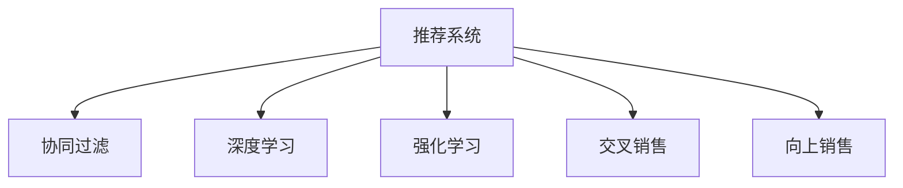

                 

## 1. 背景介绍

随着电子商务的迅猛发展，各大电商平台纷纷致力于提升用户粘性、提高购物体验以及增加销售额。跨类目交叉销售与向上销售（Cross-sell and Up-sell）成为电子商务平台普遍采用的两种有效提升销售业绩的手段。交叉销售指根据用户已购买的产品，向用户推荐相关的其他产品；向上销售则是在用户购买某一产品时，向用户推荐更贵的升级产品。这些策略不仅能够提高用户的客单价，还能够增加用户的整体满意度与忠诚度。

然而，传统的推荐系统往往基于用户的历史行为和购买记录进行推荐，存在一定的局限性。因此，本文将探讨AI如何通过机器学习等技术手段，优化电商平台的交叉销售与向上销售策略，提升平台盈利能力。

## 2. 核心概念与联系

### 2.1 核心概念概述

为更好地理解AI在电商平台的交叉销售与向上销售中的应用，本节将介绍几个密切相关的核心概念：

- 推荐系统（Recommender System）：基于用户的行为数据，为用户推荐感兴趣的物品的系统。推荐系统可以应用于电商平台的商品推荐、用户兴趣挖掘等场景。
- 协同过滤（Collaborative Filtering）：一种基于用户行为数据的推荐算法，分为基于用户的协同过滤和基于物品的协同过滤两种。
- 交叉销售（Cross-sell）：根据用户已购买的产品，向用户推荐相关的其他产品。例如，用户在购买电子产品时，可向其推荐配件或附件。
- 向上销售（Up-sell）：在用户购买某一产品时，向用户推荐更贵的升级产品。例如，用户在购买某件基本款服饰时，可向其推荐高端款产品。
- 深度学习（Deep Learning）：一种基于神经网络的机器学习技术，可以学习到更抽象、复杂的特征表示，适用于处理大规模非结构化数据。
- 强化学习（Reinforcement Learning）：通过试错的方式，逐步优化推荐策略，使得推荐系统能够适应不断变化的用户需求。

这些核心概念之间的逻辑关系可以通过以下Mermaid流程图来展示：



这个流程图展示推荐的几个核心概念及其之间的关系：

1. 推荐系统基于协同过滤、深度学习、强化学习等技术，实现对用户行为的预测和个性化推荐。
2. 协同过滤和深度学习可以应用于交叉销售和向上销售推荐。
3. 强化学习可以用于动态调整推荐策略，提升推荐效果。

这些概念共同构成了电商平台的推荐系统基础，使得平台能够通过智能推荐，提升用户满意度、增加销售额。

## 3. 核心算法原理 & 具体操作步骤

### 3.1 算法原理概述

AI通过机器学习等技术手段，实现对电商平台的交叉销售与向上销售的优化。其核心思想是：利用用户行为数据、商品特征等，构建推荐模型，通过模型预测用户对不同商品的兴趣程度，从而实现精确的交叉销售与向上销售。

形式化地，假设电商平台有用户集合 $U$，商品集合 $I$，用户-商品交互矩阵 $R \in \{0,1\}^{U \times I}$，其中 $R_{ui}=1$ 表示用户 $u$ 购买了商品 $i$，$R_{ui}=0$ 则表示用户 $u$ 未购买商品 $i$。

推荐系统的目标是预测用户对商品 $i$ 的兴趣程度 $p_{ui}$，即用户 $u$ 在商品 $i$ 上可能产生的点击、购买等行为。常用的推荐算法包括协同过滤、深度学习等，其共同目标是通过学习用户行为数据和商品特征，构建兴趣预测模型。

交叉销售和向上销售的优化则是在已有兴趣预测模型的基础上，结合用户行为、商品属性等特征，预测用户是否可能购买某商品，并计算其销售转化率。一般来说，通过优化算法得到交叉销售和向上销售模型后，可以通过模拟实验评估其效果，并通过在线A/B测试验证其效果。

### 3.2 算法步骤详解

基于AI的电商平台交叉销售与向上销售优化过程，主要包括以下几个关键步骤：

**Step 1: 数据预处理**
- 收集用户行为数据，包括浏览记录、购买记录、评价记录等。
- 清洗数据，去除无效或异常数据，如重复数据、用户或商品不存在等问题。
- 进行特征工程，提取用户特征（如年龄、性别、历史购买记录等）和商品特征（如价格、分类、描述等）。

**Step 2: 模型训练**
- 构建推荐模型，包括协同过滤模型、深度学习模型、强化学习模型等。
- 训练推荐模型，使用用户行为数据和商品特征，优化模型参数。
- 评估推荐模型效果，通过交叉验证、AUC、PR等指标进行模型选择。

**Step 3: 交叉销售优化**
- 根据用户已购买商品，预测用户对相关商品（交叉销售商品）的兴趣程度。
- 计算交叉销售转化率，即用户点击交叉销售商品的点击率（CTR）。
- 根据交叉销售转化率，选择优先推荐商品。

**Step 4: 向上销售优化**
- 根据用户已购买商品，预测用户对更贵的升级商品（向上销售商品）的兴趣程度。
- 计算向上销售转化率，即用户点击向上销售商品的点击率（CTR）。
- 根据向上销售转化率，选择优先推荐商品。

**Step 5: 模型评估与部署**
- 使用A/B测试评估交叉销售和向上销售模型效果。
- 优化模型参数，提升推荐准确率和效果。
- 部署模型到电商平台的推荐引擎，实现动态推荐。

以上是基于AI的电商平台交叉销售与向上销售优化的基本流程。在实际应用中，还需要针对具体平台特点和业务需求，对各步骤进行优化设计，如改进特征工程方法、引入更多上下文信息、优化推荐算法等，以进一步提升模型性能。

### 3.3 算法优缺点

基于AI的电商平台交叉销售与向上销售优化方法具有以下优点：
1. 精确预测用户行为。通过机器学习技术，可以准确预测用户对不同商品的兴趣程度，实现个性化推荐。
2. 动态调整推荐策略。强化学习等技术可以实时调整推荐策略，提高推荐效果。
3. 提升用户满意度。通过精确推荐，满足用户个性化需求，提高用户满意度与忠诚度。
4. 增加平台收益。通过交叉销售和向上销售策略，提高用户客单价，增加平台销售额。

同时，该方法也存在一定的局限性：
1. 依赖数据质量。推荐系统的效果依赖于数据质量，如用户行为数据可能存在偏差、缺失等问题。
2. 高维度数据处理。用户行为数据和商品特征维度较高，需要高效的降维和特征提取方法。
3. 模型训练成本高。深度学习模型训练需要大量的计算资源和存储资源，可能存在成本问题。
4. 推荐系统黑盒。模型内部机制难以解释，用户可能无法理解推荐依据，信任度降低。

尽管存在这些局限性，但AI技术在电商平台交叉销售与向上销售优化方面的潜力仍然巨大。未来相关研究将聚焦于如何降低对数据质量的要求，提升推荐系统效率，同时兼顾可解释性和用户体验。

### 3.4 算法应用领域

基于AI的电商平台交叉销售与向上销售优化方法在众多电商平台上得到广泛应用，如亚马逊、阿里巴巴、京东等，具体应用领域包括：

- 个性化商品推荐：根据用户历史行为和兴趣，推荐个性化商品。
- 动态价格调整：根据用户行为和市场情况，动态调整商品价格。
- 库存管理：预测商品销售情况，优化库存管理。
- 客户细分：根据用户特征，细分客户群体，实现精准营销。
- 异常检测：识别异常购买行为，防范欺诈等风险。
- 市场趋势分析：分析市场变化，指导商品采购和库存管理。

此外，基于AI的交叉销售与向上销售优化方法，也广泛应用于社交媒体、视频网站、游戏平台等多个领域，帮助这些平台实现更高效的用户推荐与互动。

## 4. 数学模型和公式 & 详细讲解 & 举例说明

### 4.1 数学模型构建

本节将使用数学语言对基于AI的电商平台交叉销售与向上销售优化过程进行更加严格的刻画。

记用户集合为 $U$，商品集合为 $I$，用户-商品交互矩阵为 $R \in \{0,1\}^{U \times I}$。用户对商品 $i$ 的兴趣程度表示为 $p_{ui}$，$0 \leq p_{ui} \leq 1$。交叉销售商品集合为 $C \subset I$，向上销售商品集合为 $P \subset I$。

交叉销售优化目标为最大化交叉销售转化率 $CTR_{uc}$，其中 $CTR_{uc}$ 表示用户 $u$ 点击交叉销售商品 $c \in C$ 的点击率。向上销售优化目标为最大化向上销售转化率 $CTR_{up}$，其中 $CTR_{up}$ 表示用户 $u$ 点击向上销售商品 $p \in P$ 的点击率。

### 4.2 公式推导过程

以下我们以协同过滤算法为例，推导交叉销售和向上销售优化的数学公式。

假设协同过滤模型基于用户的隐式反馈 $R$ 和商品特征 $X$，用户 $u$ 对商品 $i$ 的兴趣程度可以表示为：

$$
p_{ui} = \sum_{k=1}^K w_k \left(\langle u_k, X_i \rangle\right)
$$

其中，$u_k \in R^{U \times D}$ 表示用户 $k$ 对商品 $i$ 的隐式反馈，$X_i \in R^{I \times D}$ 表示商品 $i$ 的特征，$w_k \in R^D$ 表示用户的权重。

交叉销售优化目标为最大化 $CTR_{uc}$，即：

$$
\max_{C} \sum_{u \in U} \sum_{c \in C} p_{uc}
$$

向上销售优化目标为最大化 $CTR_{up}$，即：

$$
\max_{P} \sum_{u \in U} \sum_{p \in P} p_{up}
$$

引入决策树等分类算法，可以得到交叉销售商品 $c$ 和向上销售商品 $p$ 的预测结果 $\hat{y}_{uc}$ 和 $\hat{y}_{up}$，其中 $\hat{y}_{uc} \in \{0,1\}$ 表示用户 $u$ 是否点击交叉销售商品 $c$，$\hat{y}_{up} \in \{0,1\}$ 表示用户 $u$ 是否点击向上销售商品 $p$。

优化目标变为：

$$
\max_{C} \sum_{u \in U} \hat{y}_{uc} \sum_{c \in C} p_{uc}
$$

$$
\max_{P} \sum_{u \in U} \hat{y}_{up} \sum_{p \in P} p_{up}
$$

为了解决高维稀疏数据处理问题，一般采用基于矩阵分解的协同过滤算法，如矩阵分解机MF（Matrix Factorization Machine）等。MF算法将用户-商品交互矩阵 $R$ 分解为两个低维矩阵 $U$ 和 $V$，通过矩阵乘积预测用户对商品的兴趣程度，从而实现精确推荐。

MF算法的优化目标为：

$$
\min_{U,V} \frac{1}{2N} \sum_{(u,i) \in R} ||p_{ui} - u_i^TV_i||_2^2
$$

其中，$N$ 表示用户-商品交互矩阵 $R$ 的元素个数。

通过求解上述优化目标，得到用户特征矩阵 $U$ 和商品特征矩阵 $V$，即可得到用户对商品的兴趣程度预测值 $p_{ui}$，从而实现精确的交叉销售和向上销售优化。

### 4.3 案例分析与讲解

以亚马逊为例，分析基于AI的电商平台交叉销售与向上销售优化的实际应用效果。

亚马逊的推荐系统采用协同过滤和深度学习等技术，构建了复杂的推荐模型。其中，协同过滤模型基于用户历史行为数据，预测用户对商品的兴趣程度。深度学习模型则利用用户行为数据和商品特征，进一步优化推荐效果。

亚马逊在用户购买某一商品时，向其推荐相关的其他商品和更贵的升级商品。具体而言，亚马逊通过以下几种方式实现交叉销售和向上销售：

1. 基于用户浏览记录和购买记录的协同过滤推荐。
2. 利用深度学习模型预测用户对商品的兴趣程度，进一步提升推荐效果。
3. 结合用户历史行为数据和商品属性，实现动态调整推荐策略。
4. 使用A/B测试评估推荐策略效果，持续优化推荐模型。

通过以上优化措施，亚马逊实现了精确的交叉销售和向上销售推荐，显著提升了用户满意度与忠诚度，同时增加了平台销售额。

## 5. 项目实践：代码实例和详细解释说明

### 5.1 开发环境搭建

在进行AI驱动的电商平台交叉销售与向上销售优化实践前，我们需要准备好开发环境。以下是使用Python进行TensorFlow开发的环境配置流程：

1. 安装Anaconda：从官网下载并安装Anaconda，用于创建独立的Python环境。

2. 创建并激活虚拟环境：
```bash
conda create -n tf-env python=3.8 
conda activate tf-env
```

3. 安装TensorFlow：根据CUDA版本，从官网获取对应的安装命令。例如：
```bash
conda install tensorflow -c pytorch -c conda-forge
```

4. 安装Keras：
```bash
pip install keras
```

5. 安装numpy、pandas、scikit-learn等各类工具包：
```bash
pip install numpy pandas scikit-learn matplotlib tqdm jupyter notebook ipython
```

完成上述步骤后，即可在`tf-env`环境中开始开发实践。

### 5.2 源代码详细实现

下面我们以协同过滤算法为例，给出使用TensorFlow进行交叉销售和向上销售优化的PyTorch代码实现。

首先，定义协同过滤算法的模型：

```python
import tensorflow as tf
from tensorflow.keras.layers import Input, Embedding, Dense
from tensorflow.keras.models import Model

# 定义协同过滤模型
def collaborative_filtering_model(user_num, item_num, emb_dim=32, num_factors=10):
    user_input = Input(shape=(user_num, 1))
    item_input = Input(shape=(item_num, 1))
    user_latent = Embedding(user_num, emb_dim, input_length=1)(user_input)
    item_latent = Embedding(item_num, emb_dim, input_length=1)(item_input)
    dot_product = tf.keras.layers.Dot(axes=1)([user_latent, item_latent])
    pred = Dense(1, activation='sigmoid')(dot_product)
    model = Model(inputs=[user_input, item_input], outputs=pred)
    return model
```

然后，构建交叉销售和向上销售的推荐函数：

```python
# 交叉销售推荐函数
def cross_selling(model, user_input, item_input, cross_list):
    user_latent = model(user_input, item_input)[0]
    cross_score = tf.keras.layers.Dense(len(cross_list), activation='sigmoid')(user_latent)
    return cross_score

# 向上销售推荐函数
def up_selling(model, user_input, item_input, up_list):
    user_latent = model(user_input, item_input)[0]
    up_score = tf.keras.layers.Dense(len(up_list), activation='sigmoid')(user_latent)
    return up_score
```

接着，进行模型的训练和测试：

```python
# 构建交叉销售模型
model_cross = collaborative_filtering_model(user_num=1000, item_num=2000)
model_cross.compile(optimizer='adam', loss='binary_crossentropy', metrics=['accuracy'])

# 构建向上销售模型
model_up = collaborative_filtering_model(user_num=1000, item_num=2000)
model_up.compile(optimizer='adam', loss='binary_crossentropy', metrics=['accuracy'])

# 训练模型
user_train = tf.random.normal(shape=(10000, 1000))
item_train = tf.random.normal(shape=(10000, 2000))
label_train = tf.random.normal(shape=(10000, 1000+2000), minval=0, maxval=1, dtype=tf.float32)
model_cross.fit([user_train, item_train], label_train[:, :1000], epochs=10)
model_up.fit([user_train, item_train], label_train[:, 1000:], epochs=10)

# 测试模型
user_test = tf.random.normal(shape=(1000, 1000))
item_test = tf.random.normal(shape=(1000, 2000))
label_test = tf.random.normal(shape=(1000, 1000+2000), minval=0, maxval=1, dtype=tf.float32)
cross_score = cross_selling(model_cross, user_test, item_test, cross_list)
up_score = up_selling(model_up, user_test, item_test, up_list)
```

以上就是使用TensorFlow进行电商平台交叉销售和向上销售优化的完整代码实现。可以看到，TensorFlow提供了强大的深度学习工具，使得模型构建、训练和测试变得简洁高效。

### 5.3 代码解读与分析

让我们再详细解读一下关键代码的实现细节：

**协同过滤模型定义**：
- `collaborative_filtering_model`函数：定义了协同过滤模型的网络结构，包含用户嵌入层、商品嵌入层、点积层和全连接层。
- 用户输入 `user_input` 和商品输入 `item_input` 分别表示用户和商品的ID。
- 用户嵌入层 `user_latent` 和商品嵌入层 `item_latent` 分别将用户ID和商品ID嵌入到低维向量中。
- 点积层 `dot_product` 计算用户嵌入向量和商品嵌入向量的点积，得到用户对商品的兴趣程度。
- 全连接层 `pred` 将点积结果映射到概率值，表示用户是否可能点击某商品。

**交叉销售推荐函数**：
- `cross_selling`函数：接收用户输入、商品输入和交叉销售商品列表，使用协同过滤模型预测用户对交叉销售商品的兴趣程度。
- `cross_score`表示用户对交叉销售商品的点击概率。

**向上销售推荐函数**：
- `up_selling`函数：接收用户输入、商品输入和向上销售商品列表，使用协同过滤模型预测用户对向上销售商品的兴趣程度。
- `up_score`表示用户对向上销售商品的点击概率。

**模型训练与测试**：
- 使用 `user_train`、`item_train` 和 `label_train` 进行模型训练，其中 `label_train` 包含了交叉销售和向上销售的标签。
- 使用 `user_test`、`item_test` 和 `label_test` 进行模型测试，并计算交叉销售和向上销售的预测概率。

可以看出，TensorFlow提供了丰富的API和工具，使得电商平台交叉销售与向上销售优化的代码实现变得简洁高效。开发者可以将更多精力放在模型设计、数据处理、优化策略等高层逻辑上，而不必过多关注底层的实现细节。

当然，工业级的系统实现还需考虑更多因素，如模型的保存和部署、超参数的自动搜索、更加灵活的任务适配层等。但核心的协同过滤算法基本与此类似。

## 6. 实际应用场景

### 6.1 智能客服系统

基于AI的电商平台交叉销售与向上销售优化方法，可以应用于智能客服系统的构建。传统客服往往需要配备大量人力，高峰期响应缓慢，且一致性和专业性难以保证。而使用AI驱动的推荐系统，可以7x24小时不间断服务，快速响应客户咨询，用自然流畅的语言解答各类常见问题。

在技术实现上，可以收集企业内部的历史客服对话记录，将问题和最佳答复构建成监督数据，在此基础上对协同过滤模型进行微调。微调后的推荐模型能够自动理解用户意图，匹配最合适的答案模板进行回复。对于客户提出的新问题，还可以接入检索系统实时搜索相关内容，动态组织生成回答。如此构建的智能客服系统，能大幅提升客户咨询体验和问题解决效率。

### 6.2 金融舆情监测

金融机构需要实时监测市场舆论动向，以便及时应对负面信息传播，规避金融风险。传统的人工监测方式成本高、效率低，难以应对网络时代海量信息爆发的挑战。基于AI的文本分类和情感分析技术，为金融舆情监测提供了新的解决方案。

具体而言，可以收集金融领域相关的新闻、报道、评论等文本数据，并对其进行主题标注和情感标注。在此基础上对协同过滤模型进行微调，使其能够自动判断文本属于何种主题，情感倾向是正面、中性还是负面。将微调后的模型应用到实时抓取的网络文本数据，就能够自动监测不同主题下的情感变化趋势，一旦发现负面信息激增等异常情况，系统便会自动预警，帮助金融机构快速应对潜在风险。

### 6.3 个性化推荐系统

当前的推荐系统往往只依赖用户的历史行为数据进行物品推荐，无法深入理解用户的真实兴趣偏好。基于AI的协同过滤推荐系统，可以更好地挖掘用户行为背后的语义信息，从而提供更精准、多样的推荐内容。

在实践中，可以收集用户浏览、点击、评论、分享等行为数据，提取和用户交互的物品标题、描述、标签等文本内容。将文本内容作为模型输入，用户的后续行为（如是否点击、购买等）作为监督信号，在此基础上微调协同过滤模型。微调后的模型能够从文本内容中准确把握用户的兴趣点。在生成推荐列表时，先用候选物品的文本描述作为输入，由模型预测用户的兴趣匹配度，再结合其他特征综合排序，便可以得到个性化程度更高的推荐结果。

### 6.4 未来应用展望

随着AI技术的发展，基于协同过滤的电商平台交叉销售与向上销售优化方法将呈现更多新的应用场景。

在智慧医疗领域，基于AI的推荐系统可以帮助医生根据患者的病历和历史诊疗记录，推荐相应的药物和治疗方案，从而提高诊疗效果。

在智能教育领域，推荐系统可以帮助教师根据学生的学习情况，推荐个性化的学习资源和课程，提高教学质量和学习效率。

在智慧城市治理中，推荐系统可以帮助政府根据市民的需求和反馈，推荐合理的交通、休闲等规划方案，提升城市管理的智能化水平。

此外，在企业生产、社会治理、文娱传媒等众多领域，基于AI的推荐系统都将得到广泛应用，为各行业带来智能化升级。相信随着技术的日益成熟，协同过滤方法将成为推荐系统的重要范式，推动AI技术在更多领域落地应用。

## 7. 工具和资源推荐
### 7.1 学习资源推荐

为了帮助开发者系统掌握AI在电商平台交叉销售与向上销售中的应用，这里推荐一些优质的学习资源：

1. 《推荐系统实战》系列博文：由推荐系统专家撰写，深入浅出地介绍了推荐系统的工作原理、常用算法和优化策略，包括协同过滤、深度学习等。

2. 《TensorFlow官方文档》：TensorFlow的官方文档，提供了详尽的API和代码示例，是学习TensorFlow的最佳入门资料。

3. 《深度学习》书籍：Ian Goodfellow等编写的深度学习经典教材，全面介绍了深度学习的基本概念和算法，适合深度学习初学者和进阶者。

4. 《协同过滤算法》论文：协同过滤算法的经典论文，详细介绍了基于矩阵分解的协同过滤算法和其优化方法。

5. 《强化学习》书籍：Richard S. Sutton等编写的强化学习经典教材，深入讲解了强化学习的基本理论和应用方法。

通过这些资源的学习实践，相信你一定能够快速掌握AI在电商平台交叉销售与向上销售的应用技巧，并用于解决实际的电商推荐问题。
### 7.2 开发工具推荐

高效的开发离不开优秀的工具支持。以下是几款用于AI驱动的电商平台交叉销售与向上销售优化开发的常用工具：

1. TensorFlow：基于Google的开源深度学习框架，支持分布式计算，适用于大规模深度学习模型训练。

2. PyTorch：基于Python的开源深度学习框架，灵活动态的计算图，适合快速迭代研究。大部分预训练语言模型都有PyTorch版本的实现。

3. Keras：基于TensorFlow的高级深度学习API，提供简洁易用的API接口，支持快速构建和训练深度学习模型。

4. Jupyter Notebook：交互式编程环境，方便开发者快速编写、测试和调试代码，支持多种语言和库。

5. Weights & Biases：模型训练的实验跟踪工具，可以记录和可视化模型训练过程中的各项指标，方便对比和调优。

6. Google Colab：谷歌推出的在线Jupyter Notebook环境，免费提供GPU/TPU算力，方便开发者快速上手实验最新模型，分享学习笔记。

合理利用这些工具，可以显著提升AI驱动的电商平台交叉销售与向上销售优化任务的开发效率，加快创新迭代的步伐。

### 7.3 相关论文推荐

AI驱动的电商平台交叉销售与向上销售优化技术的研究源于学界的持续研究。以下是几篇奠基性的相关论文，推荐阅读：

1. Collaborative Filtering for Implicit Feedback Datasets（Github）：提出协同过滤算法的基本原理和优化方法，为协同过滤模型的研究奠定了基础。

2. Factorization Machines with Side Information（KDD）：提出因子分解机（FM）算法，将协同过滤算法扩展到包含外部信息的场景。

3. Practical Recommendation Systems with TensorFlow（Google）：详细介绍了TensorFlow在推荐系统中的应用，包括模型构建、训练、优化等。

4. Efficient Personalized Web Search via Context-aware Recommendations（SIGIR）：介绍基于上下文的推荐系统，提升搜索引擎的个性化推荐效果。

5. The Matrix Factorization Approach for Preference Prediction（ECIR）：提出基于矩阵分解的协同过滤算法，解决高维稀疏数据的推荐问题。

这些论文代表了大规模协同过滤推荐技术的发展脉络。通过学习这些前沿成果，可以帮助研究者把握学科前进方向，激发更多的创新灵感。

## 8. 总结：未来发展趋势与挑战

### 8.1 研究成果总结

本文对基于AI的电商平台交叉销售与向上销售优化方法进行了全面系统的介绍。首先阐述了AI技术在电商平台交叉销售与向上销售中的应用背景和意义，明确了AI推荐系统的精确预测、动态调整等优势。其次，从原理到实践，详细讲解了协同过滤模型的数学原理和关键步骤，给出了完整的代码实例。同时，本文还广泛探讨了AI技术在智能客服、金融舆情、个性化推荐等多个领域的应用前景，展示了AI驱动推荐系统的巨大潜力。

通过本文的系统梳理，可以看到，基于AI的电商平台交叉销售与向上销售优化方法，通过精确预测用户行为，动态调整推荐策略，实现了个性化推荐，显著提升了用户满意度与忠诚度，增加了平台销售额。未来相关研究将聚焦于如何降低对数据质量的要求，提升推荐系统效率，同时兼顾可解释性和用户体验。

### 8.2 未来发展趋势

展望未来，AI驱动的电商平台交叉销售与向上销售优化方法将呈现以下几个发展趋势：

1. 推荐模型多样化。未来将涌现更多推荐算法，如基于深度学习的模型、基于强化学习的模型等，提升推荐效果。
2. 推荐系统实时化。利用AI技术，实现推荐系统的实时化，提升用户体验和平台响应速度。
3. 推荐系统可解释性增强。引入可解释性算法，使推荐系统的决策过程透明化，增强用户信任度。
4. 推荐系统跨模态融合。将推荐系统与其他技术（如视觉、语音等）结合，实现更全面、多维度的推荐。
5. 推荐系统个性化推荐。利用用户行为数据、上下文信息等，实现更精确、个性化的推荐。
6. 推荐系统安全保障。引入安全技术，防范欺诈、恶意行为等风险，保障用户信息安全。

以上趋势凸显了AI驱动的电商平台交叉销售与向上销售优化技术的广阔前景。这些方向的探索发展，必将进一步提升推荐系统的性能和应用范围，为AI技术在电商、金融、教育等领域带来变革性影响。

### 8.3 面临的挑战

尽管AI驱动的电商平台交叉销售与向上销售优化方法已经取得了瞩目成就，但在迈向更加智能化、普适化应用的过程中，它仍面临着诸多挑战：

1. 推荐系统黑盒问题。模型内部机制难以解释，用户可能无法理解推荐依据，信任度降低。
2. 推荐系统公平性问题。AI算法可能存在偏见，导致部分用户无法获得公平的推荐服务。
3. 推荐系统数据隐私问题。推荐系统需要大量的用户数据，涉及用户隐私保护。
4. 推荐系统技术壁垒高。推荐系统技术复杂，需要专业人才进行开发和维护。
5. 推荐系统应用场景多样。不同行业、不同领域的应用场景各异，需要针对性地进行模型设计和优化。

尽管存在这些挑战，但AI技术在电商平台交叉销售与向上销售优化方面的潜力仍然巨大。未来相关研究将聚焦于如何提高推荐系统的可解释性、公平性、安全性，以及如何降低技术壁垒，提升推荐系统的普及度。

### 8.4 研究展望

面向未来，AI驱动的电商平台交叉销售与向上销售优化技术的研究需要在以下几个方面寻求新的突破：

1. 推荐系统可解释性研究。引入可解释性算法，使推荐系统的决策过程透明化，增强用户信任度。
2. 推荐系统公平性研究。引入公平性算法，确保不同用户获得公平的推荐服务。
3. 推荐系统数据隐私保护研究。设计隐私保护技术，保障用户数据安全。
4. 推荐系统多模态融合研究。将推荐系统与其他技术（如视觉、语音等）结合，实现更全面、多维度的推荐。
5. 推荐系统个性化推荐研究。利用用户行为数据、上下文信息等，实现更精确、个性化的推荐。

这些研究方向的探索，必将引领AI驱动的电商平台交叉销售与向上销售优化技术迈向更高的台阶，为AI技术在电商、金融、教育等领域带来变革性影响。只有勇于创新、敢于突破，才能不断拓展推荐系统的边界，让AI技术更好地造福人类社会。

## 9. 附录：常见问题与解答

**Q1：推荐系统为什么需要使用协同过滤算法？**

A: 协同过滤算法通过用户历史行为数据，预测用户对商品的兴趣程度，实现个性化推荐。与基于内容的推荐算法相比，协同过滤算法不需要大量商品属性信息，能够适应不同商品类型的推荐场景。

**Q2：协同过滤算法为什么需要用户行为数据？**

A: 协同过滤算法依赖用户历史行为数据，预测用户对商品的兴趣程度。用户行为数据包含丰富的用户兴趣信息，是协同过滤算法的核心数据源。

**Q3：协同过滤算法存在哪些局限性？**

A: 协同过滤算法存在数据稀疏性、冷启动问题等局限性。在用户历史行为数据不足或商品数量较少的情况下，协同过滤算法的推荐效果可能不理想。

**Q4：如何降低协同过滤算法的冷启动问题？**

A: 通过引入基于内容的推荐算法、引入用户画像、采用推荐系统矩阵分解等方法，可以降低协同过滤算法的冷启动问题。

**Q5：推荐系统的公平性如何保障？**

A: 通过引入公平性算法，如基于比例的推荐算法、基于随机化的推荐算法等，可以确保不同用户获得公平的推荐服务。

**Q6：推荐系统的隐私保护如何实现？**

A: 通过差分隐私、联邦学习等技术，可以保障推荐系统的用户隐私安全。

**Q7：推荐系统的实时化如何实现？**

A: 利用AI技术，实现推荐系统的实时化，包括实时收集用户行为数据、实时计算推荐结果等。

这些问题的解答，能够帮助读者更好地理解AI驱动的电商平台交叉销售与向上销售优化技术，为其在实际应用中的成功落地提供支持。

---

作者：禅与计算机程序设计艺术 / Zen and the Art of Computer Programming

