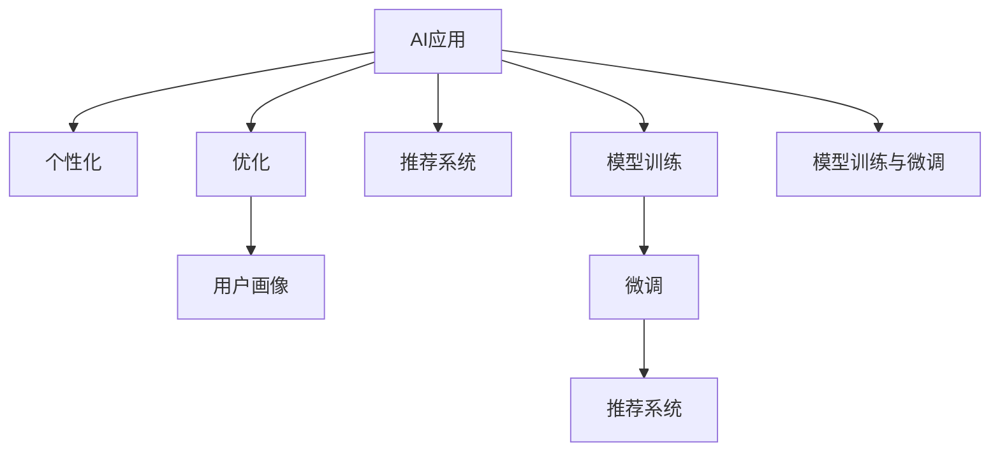

                 

# AI应用的个性化和优化

## 1. 背景介绍

### 1.1 问题由来
随着人工智能(AI)技术的迅猛发展，AI在各行各业的应用越来越广泛，从智能客服、推荐系统到医疗诊断、自动驾驶等领域，AI正在以惊人的速度改变着我们的生活方式。然而，尽管AI技术在许多方面表现出色，但其通用性和泛化能力仍有待提升，无法真正理解用户的个性化需求和偏好。这一问题，催生了AI应用的个性化和优化技术。

### 1.2 问题核心关键点
个性化和优化是AI应用迈向智能化的关键一步。它旨在通过深度学习和数据挖掘技术，使AI模型更加贴合用户的行为模式和偏好，从而提升用户体验和系统性能。

1. **数据的多样性和实时性**：个性化和优化技术要求大量的、多样化的用户行为数据，以便模型能够准确地预测用户的偏好和需求。同时，这些数据需要实时更新，以确保模型能够及时反映用户最新的变化。
2. **模型的适应性和泛化能力**：模型必须能够适应不同用户群体的差异，并在新用户和场景下泛化良好。
3. **算法的可解释性和透明度**：模型决策过程需要具有可解释性，用户能够理解模型的推理逻辑，从而增强信任感和接受度。
4. **算法的效率和可扩展性**：模型需要高效运行，能够在低延迟下处理大量数据和实时请求。

### 1.3 问题研究意义
研究AI应用的个性化和优化技术，对于提升用户体验、优化系统性能、推动AI技术的产业化进程具有重要意义：

1. **提升用户体验**：个性化的AI应用能够更好地满足用户的个性化需求，提供更加贴合的服务，从而提升用户的满意度和忠诚度。
2. **优化系统性能**：通过优化算法，AI系统能够更高效地处理数据和任务，减少资源消耗，提升系统的响应速度和稳定性。
3. **推动产业化**：个性化和优化技术的应用，有助于AI技术在更多行业领域的落地，加速AI技术的商业化进程。
4. **带来技术创新**：个性化和优化技术的不断探索，将推动AI技术向更深度、更广度的方向发展，催生更多新的研究方向和应用场景。
5. **赋能产业升级**：AI技术的个性化和优化，能够提升各行各业的生产效率和决策水平，推动产业数字化转型升级。

## 2. 核心概念与联系

### 2.1 核心概念概述

为更好地理解AI应用的个性化和优化技术，本节将介绍几个密切相关的核心概念：

- **AI应用**：指利用人工智能技术解决特定问题的软件系统，如智能推荐、个性化广告、智能客服等。
- **个性化**：指根据用户的个性化需求和行为模式，定制化地提供服务和产品。
- **优化**：指通过算法和模型，提升系统的性能和效率，如减少计算成本、提高响应速度、降低误判率等。
- **用户画像**：通过数据分析和挖掘，构建用户的行为和偏好模型，以便更好地理解用户需求。
- **推荐系统**：通过算法为用户推荐感兴趣的内容或产品，提高用户体验。
- **模型训练与微调**：通过大量的标注数据训练模型，并在实际应用中微调模型，以适应新数据和新需求。

这些核心概念之间的逻辑关系可以通过以下Mermaid流程图来展示：



这个流程图展示了个性化与优化技术的主要工作流程：

1. 通过数据分析构建用户画像，理解用户需求。
2. 使用推荐系统，为用户提供个性化的服务和产品。
3. 对推荐系统进行优化，提升系统性能。
4. 通过模型训练和微调，不断更新推荐系统，适应新数据和新需求。

## 3. 核心算法原理 & 具体操作步骤
### 3.1 算法原理概述

AI应用的个性化和优化技术，本质上是一种基于数据的深度学习范式。其核心思想是：通过大量的用户行为数据，训练一个能够准确预测用户需求和偏好的模型，并在此基础上进行个性化推荐和服务。

形式化地，假设用户行为数据集为 $D=\{(x_i,y_i)\}_{i=1}^N$，其中 $x_i$ 为用户的特征向量，$y_i$ 为用户的偏好或行为。定义目标函数为：

$$
\min_{\theta} \mathcal{L}(\theta; D)
$$

其中 $\theta$ 为模型的参数，$\mathcal{L}(\theta; D)$ 为目标损失函数，用于衡量模型在数据集 $D$ 上的预测误差。通过优化目标函数，找到最优的模型参数 $\theta^*$，使得模型能够准确预测用户行为。

### 3.2 算法步骤详解

基于AI应用的个性化和优化技术，通常包括以下几个关键步骤：

**Step 1: 数据收集与处理**

- 收集用户的行为数据，如浏览记录、购买历史、评分反馈等。
- 对数据进行预处理，包括数据清洗、特征提取、归一化等，以提高数据质量。

**Step 2: 用户画像构建**

- 使用聚类算法、因子分析等方法，将用户的行为数据进行归纳和分类，形成用户画像。
- 建立用户画像数据库，包括用户的兴趣偏好、行为习惯、评分评价等。

**Step 3: 推荐模型训练**

- 选择合适的推荐算法，如协同过滤、内容推荐、深度学习等，构建推荐模型。
- 使用用户画像数据库和行为数据集，训练推荐模型。

**Step 4: 模型微调**

- 在实际应用中，根据用户的新行为数据，对推荐模型进行微调，以适应新数据和新需求。
- 采用正则化技术、对抗训练等方法，避免模型过拟合。

**Step 5: 实时推荐**

- 使用微调后的推荐模型，对用户进行实时推荐，并更新用户画像数据库。
- 结合实时反馈数据，持续优化推荐模型。

### 3.3 算法优缺点

个性化和优化技术具有以下优点：

1. 提高用户体验：通过个性化推荐，用户能够更快地找到感兴趣的内容或产品，提高满意度。
2. 优化系统性能：个性化推荐系统能够根据用户行为实时调整推荐策略，提升系统的响应速度和准确性。
3. 可解释性强：通过用户画像和推荐模型，能够清晰地解释推荐结果的来源和依据，增加用户信任。
4. 算法灵活性高：个性化和优化算法可以根据不同的应用场景和需求进行调整和优化。

同时，个性化和优化技术也存在以下缺点：

1. 数据隐私问题：用户行为数据的收集和使用需要遵守隐私法规，避免泄露用户隐私。
2. 算法复杂度高：个性化和优化算法需要处理大量的数据和计算资源，可能面临计算瓶颈。
3. 模型泛化能力不足：如果用户行为数据过于稀疏或不具代表性，可能导致模型泛化能力差。
4. 误判率较高：个性化推荐系统可能存在误判风险，如推荐错误内容或产品，影响用户体验。

### 3.4 算法应用领域

个性化和优化技术在多个领域都有广泛应用，例如：

- **电商推荐**：根据用户浏览和购买历史，为用户推荐感兴趣的商品，提高转化率。
- **内容推荐**：根据用户兴趣，推荐新闻、文章、视频等内容，提升用户体验。
- **广告投放**：通过个性化广告，提高广告的点击率和转化率，降低投放成本。
- **智能客服**：根据用户输入，推荐合适的回答模板，提高客服效率和用户满意度。
- **金融风控**：通过分析用户行为，识别潜在风险，进行精准的信用评估和欺诈检测。
- **医疗诊断**：根据患者历史数据，推荐合适的诊疗方案，提高诊断准确率。

除了上述这些经典应用外，个性化和优化技术还在更多场景中得到创新应用，如个性化旅游、智能家居、智能城市等，为各行各业带来了新的机遇和挑战。

## 4. 数学模型和公式 & 详细讲解  
### 4.1 数学模型构建

本节将使用数学语言对AI应用的个性化和优化技术进行更加严格的刻画。

假设推荐系统的输入为 $x \in \mathbb{R}^d$，表示用户的行为特征向量。目标函数为：

$$
\min_{\theta} \frac{1}{N} \sum_{i=1}^N \ell(\theta; x_i, y_i)
$$

其中 $\ell(\theta; x_i, y_i)$ 为损失函数，$\theta$ 为模型参数。常见的损失函数包括均方误差、交叉熵等。

### 4.2 公式推导过程

以协同过滤算法为例，其基本思想是寻找与目标用户行为相似的K个用户，根据这些用户的偏好对目标用户进行推荐。假设这些用户的特征向量为 $x_{ik} \in \mathbb{R}^d$，目标用户的偏好为 $y_i \in \{0,1\}$，则协同过滤算法的目标函数可以表示为：

$$
\min_{\theta} \frac{1}{N} \sum_{i=1}^N \ell(\theta; x_i, y_i) = \min_{\theta} \frac{1}{N} \sum_{i=1}^N \sum_{k=1}^K \ell(\theta; x_i, y_i, x_{ik})
$$

其中 $x_{ik}$ 表示用户 $i$ 对物品 $k$ 的评分，$\ell(\theta; x_i, y_i, x_{ik})$ 为协同过滤算法的损失函数，通常采用均方误差或点积损失：

$$
\ell(\theta; x_i, y_i, x_{ik}) = \begin{cases}
||x_i - x_{ik}||_2^2 - y_i, & \text{如果 } x_{ik} = y_i \\
||x_i - x_{ik}||_2^2 + (1-y_i), & \text{如果 } x_{ik} \neq y_i
\end{cases}
$$

上式中，$||x_i - x_{ik}||_2$ 表示用户 $i$ 和用户 $k$ 的特征向量之间的欧几里得距离。

通过求解上述目标函数，协同过滤算法找到最优的模型参数 $\theta^*$，使得预测结果与实际评分之间的误差最小。

## 5. 项目实践：代码实例和详细解释说明
### 5.1 开发环境搭建

在进行个性化和优化实践前，我们需要准备好开发环境。以下是使用Python进行PyTorch开发的环境配置流程：

1. 安装Anaconda：从官网下载并安装Anaconda，用于创建独立的Python环境。

2. 创建并激活虚拟环境：
```bash
conda create -n pytorch-env python=3.8 
conda activate pytorch-env
```

3. 安装PyTorch：根据CUDA版本，从官网获取对应的安装命令。例如：
```bash
conda install pytorch torchvision torchaudio cudatoolkit=11.1 -c pytorch -c conda-forge
```

4. 安装Transformers库：
```bash
pip install transformers
```

5. 安装各类工具包：
```bash
pip install numpy pandas scikit-learn matplotlib tqdm jupyter notebook ipython
```

完成上述步骤后，即可在`pytorch-env`环境中开始个性化和优化实践。

### 5.2 源代码详细实现

这里我们以基于协同过滤算法的个性化推荐系统为例，给出使用PyTorch和Transformers库进行实现的代码。

首先，定义推荐模型的数据处理函数：

```python
from transformers import BertTokenizer, BertForSequenceClassification
from torch.utils.data import Dataset
import torch

class RecommendationDataset(Dataset):
    def __init__(self, features, labels, tokenizer, max_len=128):
        self.features = features
        self.labels = labels
        self.tokenizer = tokenizer
        self.max_len = max_len
        
    def __len__(self):
        return len(self.features)
    
    def __getitem__(self, item):
        text = self.features[item]
        label = self.labels[item]
        
        encoding = self.tokenizer(text, return_tensors='pt', max_length=self.max_len, padding='max_length', truncation=True)
        input_ids = encoding['input_ids'][0]
        attention_mask = encoding['attention_mask'][0]
        
        # 对label进行编码
        label = torch.tensor(label, dtype=torch.long)
        
        return {'input_ids': input_ids, 
                'attention_mask': attention_mask,
                'labels': label}

# 加载预训练模型
model = BertForSequenceClassification.from_pretrained('bert-base-cased', num_labels=2)
```

然后，定义推荐模型的训练和评估函数：

```python
from transformers import AdamW
from tqdm import tqdm

device = torch.device('cuda') if torch.cuda.is_available() else torch.device('cpu')
model.to(device)

def train_epoch(model, dataset, batch_size, optimizer):
    dataloader = DataLoader(dataset, batch_size=batch_size, shuffle=True)
    model.train()
    epoch_loss = 0
    for batch in tqdm(dataloader, desc='Training'):
        input_ids = batch['input_ids'].to(device)
        attention_mask = batch['attention_mask'].to(device)
        labels = batch['labels'].to(device)
        model.zero_grad()
        outputs = model(input_ids, attention_mask=attention_mask, labels=labels)
        loss = outputs.loss
        epoch_loss += loss.item()
        loss.backward()
        optimizer.step()
    return epoch_loss / len(dataloader)

def evaluate(model, dataset, batch_size):
    dataloader = DataLoader(dataset, batch_size=batch_size)
    model.eval()
    preds, labels = [], []
    with torch.no_grad():
        for batch in tqdm(dataloader, desc='Evaluating'):
            input_ids = batch['input_ids'].to(device)
            attention_mask = batch['attention_mask'].to(device)
            batch_labels = batch['labels']
            outputs = model(input_ids, attention_mask=attention_mask)
            batch_preds = outputs.logits.argmax(dim=2).to('cpu').tolist()
            batch_labels = batch_labels.to('cpu').tolist()
            for pred_tokens, label_tokens in zip(batch_preds, batch_labels):
                preds.append(pred_tokens)
                labels.append(label_tokens)
                
    print(classification_report(labels, preds))
```

最后，启动训练流程并在测试集上评估：

```python
epochs = 5
batch_size = 16

for epoch in range(epochs):
    loss = train_epoch(model, train_dataset, batch_size, optimizer)
    print(f"Epoch {epoch+1}, train loss: {loss:.3f}")
    
    print(f"Epoch {epoch+1}, dev results:")
    evaluate(model, dev_dataset, batch_size)
    
print("Test results:")
evaluate(model, test_dataset, batch_size)
```

以上就是使用PyTorch和Transformers库实现基于协同过滤算法的个性化推荐系统的完整代码。可以看到，得益于Transformers库的强大封装，我们可以用相对简洁的代码完成模型的训练和评估。

### 5.3 代码解读与分析

让我们再详细解读一下关键代码的实现细节：

**RecommendationDataset类**：
- `__init__`方法：初始化特征和标签等关键组件。
- `__len__`方法：返回数据集的样本数量。
- `__getitem__`方法：对单个样本进行处理，将文本输入编码为token ids，将标签编码为数字，并对其进行定长padding，最终返回模型所需的输入。

**model的加载**：
- 使用BertForSequenceClassification类加载预训练模型，设置标签数量为2，即二分类任务。

**训练和评估函数**：
- 使用PyTorch的DataLoader对数据集进行批次化加载，供模型训练和推理使用。
- 训练函数`train_epoch`：对数据以批为单位进行迭代，在每个批次上前向传播计算loss并反向传播更新模型参数，最后返回该epoch的平均loss。
- 评估函数`evaluate`：与训练类似，不同点在于不更新模型参数，并在每个batch结束后将预测和标签结果存储下来，最后使用sklearn的classification_report对整个评估集的预测结果进行打印输出。

**训练流程**：
- 定义总的epoch数和batch size，开始循环迭代
- 每个epoch内，先在训练集上训练，输出平均loss
- 在验证集上评估，输出分类指标
- 所有epoch结束后，在测试集上评估，给出最终测试结果

可以看到，PyTorch配合Transformers库使得个性化推荐系统的代码实现变得简洁高效。开发者可以将更多精力放在数据处理、模型改进等高层逻辑上，而不必过多关注底层的实现细节。

当然，工业级的系统实现还需考虑更多因素，如模型的保存和部署、超参数的自动搜索、更灵活的任务适配层等。但核心的个性化和优化范式基本与此类似。

## 6. 实际应用场景
### 6.1 智能推荐系统

基于协同过滤算法的个性化推荐系统，可以广泛应用于电商、新闻、视频等多个领域。通过分析用户的历史行为数据，推荐系统能够为用户推荐感兴趣的商品、新闻、视频等内容，提升用户体验。

在技术实现上，可以收集用户浏览、点击、评分等行为数据，构建用户画像，并使用协同过滤算法对用户进行推荐。在生成推荐列表时，先用候选物品的特征作为输入，由模型预测用户的兴趣匹配度，再结合其他特征综合排序，便可以得到个性化程度更高的推荐结果。

### 6.2 个性化广告投放

广告投放是互联网公司的核心业务之一，如何精准地投放广告，提升广告的点击率和转化率，是广告业务的重要课题。基于协同过滤算法的个性化推荐系统，能够根据用户的历史行为数据，预测用户的兴趣和需求，从而实现精准的广告投放。

在实践中，广告平台可以收集用户的浏览记录、购买历史、点击反馈等数据，构建用户画像，并使用协同过滤算法对用户进行个性化广告推荐。广告平台还能够根据用户的实时行为数据，动态调整广告投放策略，提高广告的效果和转化率。

### 6.3 智能客服系统

智能客服系统能够自动回答用户的问题，提高客服效率和用户满意度。通过分析用户的历史交互记录和行为数据，智能客服系统能够理解用户的需求和意图，并推荐合适的回答模板。

在技术实现上，智能客服系统可以使用协同过滤算法，根据用户的历史行为数据，推荐合适的回答模板。在生成回答时，智能客服系统还需要注意上下文语境，保持对话连贯性和逻辑性，从而提高用户的满意度。

### 6.4 金融风控系统

金融风控系统通过分析用户的金融行为数据，识别潜在风险，进行精准的信用评估和欺诈检测。通过构建用户画像，金融风控系统能够理解用户的金融需求和行为，从而进行个性化的风险评估。

在实践中，金融风控系统可以收集用户的贷款记录、信用卡使用、转账记录等数据，构建用户画像，并使用协同过滤算法进行风险评估。金融风控系统还能够根据用户的实时行为数据，动态调整风险评估策略，提高系统的准确性和及时性。

### 6.5 医疗诊断系统

医疗诊断系统通过分析患者的病历数据和医疗记录，推荐合适的诊疗方案，提高诊断准确率。通过构建用户画像，医疗诊断系统能够理解患者的健康需求和行为，从而进行个性化的诊疗建议。

在实践中，医疗诊断系统可以收集患者的病历数据、医疗记录、遗传信息等数据，构建患者画像，并使用协同过滤算法进行诊疗建议。医疗诊断系统还能够根据患者的实时行为数据，动态调整诊疗方案，提高诊断的及时性和准确性。

### 6.6 内容推荐系统

内容推荐系统通过分析用户的历史行为数据，推荐感兴趣的内容或产品，提升用户体验。使用协同过滤算法，内容推荐系统能够理解用户的兴趣和需求，从而进行个性化的内容推荐。

在实践中，内容推荐系统可以收集用户的历史浏览记录、评分反馈、社交关系等数据，构建用户画像，并使用协同过滤算法进行内容推荐。内容推荐系统还能够根据用户的实时行为数据，动态调整推荐策略，提高推荐效果。

### 6.7 未来应用展望

随着协同过滤算法和个性化推荐技术的发展，基于AI应用的个性化和优化技术将在更多领域得到应用，为各行各业带来新的机遇和挑战。

在智慧医疗领域，个性化和优化技术可应用于病历分析、诊疗建议、药物研发等环节，提升医疗服务的智能化水平，辅助医生诊疗，加速新药开发进程。

在智能教育领域，个性化和优化技术可应用于作业批改、学情分析、知识推荐等方面，因材施教，促进教育公平，提高教学质量。

在智慧城市治理中，个性化和优化技术可应用于城市事件监测、舆情分析、应急指挥等环节，提高城市管理的自动化和智能化水平，构建更安全、高效的未来城市。

此外，在企业生产、社会治理、文娱传媒等众多领域，基于个性化和优化技术的AI应用也将不断涌现，为经济社会发展注入新的动力。相信随着技术的日益成熟，AI应用的个性化和优化必将成为智能技术的重要范式，推动人工智能技术在更多领域落地应用。

## 7. 工具和资源推荐
### 7.1 学习资源推荐

为了帮助开发者系统掌握AI应用的个性化和优化技术，这里推荐一些优质的学习资源：

1. 《深度学习入门》系列书籍：由深度学习领域的权威专家撰写，全面介绍了深度学习的基本概念和算法，适合初学者入门。

2. 《推荐系统》课程：斯坦福大学开设的推荐系统课程，系统讲解了协同过滤算法、矩阵分解等经典推荐技术，是推荐系统的学习资源。

3. 《自然语言处理与深度学习》书籍：介绍自然语言处理和深度学习在推荐系统中的应用，涵盖协同过滤、序列推荐等前沿技术。

4. 《人工智能安全》课程：介绍人工智能技术的风险和挑战，重点讲解了数据隐私、模型偏见等问题，是人工智能技术学习的补充。

5. 《Recommender Systems: From Theory to Application》书籍：全面介绍了推荐系统的理论基础和应用实践，是推荐系统的经典书籍。

通过对这些资源的学习实践，相信你一定能够快速掌握AI应用的个性化和优化技术的精髓，并用于解决实际的AI问题。
###  7.2 开发工具推荐

高效的开发离不开优秀的工具支持。以下是几款用于AI应用个性化和优化开发的常用工具：

1. PyTorch：基于Python的开源深度学习框架，灵活动态的计算图，适合快速迭代研究。大部分深度学习模型都有PyTorch版本的实现。

2. TensorFlow：由Google主导开发的开源深度学习框架，生产部署方便，适合大规模工程应用。同样有丰富的深度学习模型资源。

3. Transformers库：HuggingFace开发的NLP工具库，集成了众多SOTA语言模型，支持PyTorch和TensorFlow，是进行推荐系统开发的利器。

4. Weights & Biases：模型训练的实验跟踪工具，可以记录和可视化模型训练过程中的各项指标，方便对比和调优。与主流深度学习框架无缝集成。

5. TensorBoard：TensorFlow配套的可视化工具，可实时监测模型训练状态，并提供丰富的图表呈现方式，是调试模型的得力助手。

6. Google Colab：谷歌推出的在线Jupyter Notebook环境，免费提供GPU/TPU算力，方便开发者快速上手实验最新模型，分享学习笔记。

合理利用这些工具，可以显著提升AI应用个性化和优化任务的开发效率，加快创新迭代的步伐。

### 7.3 相关论文推荐

AI应用的个性化和优化技术的发展源于学界的持续研究。以下是几篇奠基性的相关论文，推荐阅读：

1. Matrix Factorization Techniques for Recommender Systems：提出了基于矩阵分解的推荐算法，成为推荐系统的经典方法。

2. Scalable Matrix Factorization Techniques for Recommender Systems：提出了高效的矩阵分解算法，解决了大规模推荐系统中的计算瓶颈问题。

3. Recommendation Systems in Perspective：全面介绍了推荐系统的各类算法和应用，包括协同过滤、矩阵分解、深度学习等技术。

4. A Neural Collaborative Filtering Approach for Product Recommendation：提出基于神经网络的协同过滤算法，显著提升了推荐系统的性能和泛化能力。

5. Personalized Ranking with Implicit Feedback：提出基于隐式反馈的个性化推荐算法，能够处理用户行为数据中的稀疏性问题。

6. Attention Is All You Need：提出Transformer结构，开启了NLP领域的预训练大模型时代，对推荐系统也产生了重要影响。

这些论文代表了个性化推荐技术的发展脉络。通过学习这些前沿成果，可以帮助研究者把握学科前进方向，激发更多的创新灵感。

## 8. 总结：未来发展趋势与挑战

### 8.1 总结

本文对AI应用的个性化和优化技术进行了全面系统的介绍。首先阐述了AI应用的个性化和优化技术的研究背景和意义，明确了个性化和优化技术在提升用户体验、优化系统性能方面的独特价值。其次，从原理到实践，详细讲解了个性化和优化技术的数学原理和关键步骤，给出了个性化和优化任务开发的完整代码实例。同时，本文还广泛探讨了个性化和优化技术在智能推荐、广告投放、智能客服等多个行业领域的应用前景，展示了个性化和优化技术的巨大潜力。此外，本文精选了个性化和优化技术的各类学习资源，力求为读者提供全方位的技术指引。

通过本文的系统梳理，可以看到，AI应用的个性化和优化技术正在成为智能推荐系统的重要范式，极大地拓展了推荐系统应用边界，推动了AI技术在更多行业领域的落地。随着个性化和优化技术的不断发展，基于AI应用的智能系统必将在用户体验和系统性能上迈向新的高度，推动AI技术的产业化进程。

### 8.2 未来发展趋势

展望未来，AI应用的个性化和优化技术将呈现以下几个发展趋势：

1. **模型规模和复杂度进一步提升**：随着算力成本的下降和数据规模的扩张，个性化和优化模型的参数量还将持续增长。超大规模模型蕴含的丰富知识，有望支撑更加复杂多变的个性化和优化任务。

2. **模型泛化能力增强**：个性化和优化算法将引入更多先验知识，如知识图谱、逻辑规则等，增强模型的泛化能力，提升推荐系统的准确性和鲁棒性。

3. **实时性和个性化进一步提升**：个性化和优化算法将进一步优化计算图，减少前向传播和反向传播的资源消耗，实现更加轻量级、实时性的部署。

4. **跨领域应用拓展**：个性化和优化技术将在更多领域得到应用，如医疗、金融、教育等，为这些行业带来新的机遇和挑战。

5. **联邦学习和边缘计算**：个性化和优化算法将结合联邦学习和边缘计算技术，在保护用户隐私的前提下，实现个性化和优化的实时计算和响应。

6. **多模态融合**：个性化和优化算法将引入更多先验知识，如知识图谱、逻辑规则等，增强模型的泛化能力，提升推荐系统的准确性和鲁棒性。

以上趋势凸显了AI应用个性化和优化技术的广阔前景。这些方向的探索发展，必将进一步提升推荐系统的性能和应用范围，为人工智能技术落地应用提供新的动力。

### 8.3 面临的挑战

尽管AI应用的个性化和优化技术已经取得了瞩目成就，但在迈向更加智能化、普适化应用的过程中，它仍面临着诸多挑战：

1. **数据隐私问题**：用户行为数据的收集和使用需要遵守隐私法规，避免泄露用户隐私。如何在保护用户隐私的同时，实现个性化和优化算法的有效应用，是一大难题。

2. **算法复杂度高**：个性化和优化算法需要处理大量的数据和计算资源，可能面临计算瓶颈。如何优化算法性能，降低计算成本，是一大挑战。

3. **模型泛化能力不足**：如果用户行为数据过于稀疏或不具代表性，可能导致模型泛化能力差。如何构建更具代表性的用户画像，提升模型的泛化能力，是一大难题。

4. **误判率较高**：个性化和优化算法可能存在误判风险，如推荐错误内容或产品，影响用户体验。如何提高算法的准确性和鲁棒性，是一大挑战。

5. **可解释性不足**：个性化和优化算法的决策过程需要具有可解释性，增加用户信任。如何提高算法的可解释性，是一大挑战。

6. **安全性问题**：个性化和优化算法可能面临恶意攻击，如数据篡改、模型劫持等，如何保障系统的安全性，是一大挑战。

这些挑战凸显了AI应用个性化和优化技术的复杂性和多样性。如何在数据、算法、工程、伦理等多个维度进行全面优化，将是个性化和优化技术走向成熟的关键。

### 8.4 研究展望

面对AI应用个性化和优化技术所面临的种种挑战，未来的研究需要在以下几个方面寻求新的突破：

1. **无监督和半监督个性化和优化**：摆脱对大规模标注数据的依赖，利用自监督学习、主动学习等无监督和半监督范式，最大限度利用非结构化数据，实现更加灵活高效的个性化和优化。

2. **多模态个性化和优化**：引入视觉、语音等多模态信息，实现多模态信息的融合，提升推荐系统的智能水平。

3. **跨领域个性化和优化**：将个性化和优化算法与其他AI技术结合，如因果推理、强化学习等，实现跨领域的智能系统。

4. **联邦学习与边缘计算**：结合联邦学习和边缘计算技术，实现个性化和优化的实时计算和响应，保护用户隐私。

5. **动态个性化和优化**：引入动态系统理论，优化个性化和优化算法的动态特性，提高系统的鲁棒性和适应性。

6. **可解释性增强**：引入可解释性增强技术，如因果分析、对抗训练等，提高算法的可解释性和透明度。

7. **安全性保障**：引入安全防御技术，如对抗样本生成、模型鲁棒性检测等，保障系统的安全性。

这些研究方向将引领AI应用个性化和优化技术迈向更高的台阶，为构建安全、可靠、可解释、可控的智能系统铺平道路。面向未来，AI应用的个性化和优化技术还需要与其他人工智能技术进行更深入的融合，多路径协同发力，共同推动人工智能技术的进步和发展。

## 9. 附录：常见问题与解答

**Q1：个性化和优化技术适用于所有NLP任务吗？**

A: 个性化和优化技术在大多数NLP任务上都能取得不错的效果，特别是对于数据量较小的任务。但对于一些特定领域的任务，如医学、法律等，仅仅依靠通用语料预训练的模型可能难以很好地适应。此时需要在特定领域语料上进一步预训练，再进行微调，才能获得理想效果。

**Q2：个性化和优化算法是否需要大量的标注数据？**

A: 个性化和优化算法通常需要大量的标注数据进行训练，但也可以通过无监督和半监督学习范式，利用非结构化数据进行学习，如自监督学习、主动学习等。同时，还可以通过联邦学习等技术，保护用户隐私，实现个性化和优化的实时计算。

**Q3：个性化和优化算法的泛化能力如何？**

A: 个性化和优化算法的泛化能力通常较好，因为其训练数据覆盖了用户的多样化行为，模型能够更好地理解用户的多样化需求。但需要确保训练数据的代表性，避免过拟合。

**Q4：个性化和优化算法的计算成本如何？**

A: 个性化和优化算法通常需要处理大量的数据和计算资源，可能面临计算瓶颈。因此，需要优化算法性能，降低计算成本。同时，还可以引入联邦学习、边缘计算等技术，实现个性化和优化的实时计算。

**Q5：个性化和优化算法的安全性如何？**

A: 个性化和优化算法可能面临恶意攻击，如数据篡改、模型劫持等，需要引入安全防御技术，如对抗样本生成、模型鲁棒性检测等，保障系统的安全性。

通过这些问题的解答，可以看到个性化和优化技术在应用过程中需要考虑的多方面因素，以及如何通过技术手段克服这些挑战，实现更高效的个性化和优化效果。

---

作者：禅与计算机程序设计艺术 / Zen and the Art of Computer Programming

