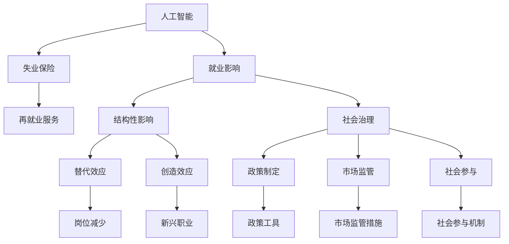

                 

# AI技术的就业影响治理:失业保险和再就业服务

> 关键词：人工智能,就业影响,失业保险,再就业服务,社会治理

## 1. 背景介绍

### 1.1 问题由来

近年来，随着人工智能技术的快速发展，越来越多的行业开始引入AI技术，以提升生产效率和竞争力。然而，这一变革在带来积极影响的同时，也对劳动力市场产生了深远影响。一方面，AI技术的应用提升了生产效率，创造了新的就业机会；另一方面，AI技术也对传统岗位产生了替代效应，增加了失业风险。

为应对这一挑战，各国政府和社会各界纷纷加强了对AI技术就业影响的治理，制定了一系列政策措施，旨在保护劳动者权益，促进就业稳定和社会和谐。其中，失业保险和再就业服务作为核心政策工具，对于缓解AI技术带来的就业冲击，具有重要作用。

### 1.2 问题核心关键点

AI技术对就业影响的主要体现在以下几个方面：

- **替代效应**：AI技术在自动化、智能化方面的应用，替代了大量传统岗位，增加了失业风险。
- **创造效应**：AI技术的发展也催生了新兴职业，如数据科学家、机器学习工程师等，创造了新的就业机会。
- **结构性影响**：AI技术对不同行业、不同技能层次的劳动者影响程度不同，加剧了就业结构性矛盾。
- **再就业需求**：AI技术对劳动者技能要求提高，需要政府和社会提供相应的再就业培训和支持。

## 2. 核心概念与联系

### 2.1 核心概念概述

为更好地理解AI技术对就业影响的治理策略，本节将介绍几个密切相关的核心概念：

- **人工智能(AI)**：包括机器学习、深度学习等技术，利用算法和大数据处理信息，模拟人类智能行为。
- **就业影响**：指AI技术对劳动力市场产生的正面或负面影响，包括岗位替代、就业创造、技能需求变化等。
- **失业保险**：政府为保护劳动者权益，防止失业风险，设立的一项社会保险制度。
- **再就业服务**：指政府和社会机构提供的培训、咨询、匹配等就业服务，帮助失业人员重新找到工作机会。
- **社会治理**：政府和社会各界共同参与的社会管理模式，旨在维护社会公平正义，促进社会和谐稳定。

这些核心概念之间的逻辑关系可以通过以下Mermaid流程图来展示：



这个流程图展示了大语言模型的核心概念及其之间的关系：

1. AI技术的应用影响就业市场，产生替代和创造效应。
2. 失业保险和再就业服务作为政策工具，旨在缓解就业冲击，促进再就业。
3. AI技术对就业市场的影响存在结构性差异，需关注替代效应和新兴职业。
4. 社会治理框架下，政府、市场和社会各界共同参与，制定和实施相关政策。

## 3. 核心算法原理 & 具体操作步骤
### 3.1 算法原理概述

基于AI技术的就业影响治理，本质上是一个多目标优化问题。其核心思想是：通过制定合理的政策措施，最大化社会福利和就业稳定性，同时最小化AI技术带来的失业风险。

形式化地，假设社会福利函数为 $W(U, E)$，其中 $U$ 为失业保险制度，$E$ 为再就业服务。在给定AI技术影响 $I$ 的情况下，优化目标为：

$$
\mathop{\max}_{U,E} W(U, E) \quad \text{subject to} \quad I
$$

其中 $I$ 反映了AI技术对就业市场的影响，包括岗位减少、技能需求变化等。

通过优化算法，如线性规划、多目标优化等，寻找最优的失业保险和再就业服务策略，使得在满足AI技术影响约束的前提下，社会福利最大化。

### 3.2 算法步骤详解

基于AI技术的就业影响治理，一般包括以下几个关键步骤：

**Step 1: 数据收集与分析**

- 收集AI技术应用领域的就业数据，包括岗位数量变化、技能需求变化、失业率等。
- 分析AI技术对不同行业、不同技能层次劳动者的影响差异。

**Step 2: 构建就业影响模型**

- 构建反映AI技术对就业影响的数学模型，如岗位替代模型、技能需求模型等。
- 通过模拟和预测，评估AI技术对就业市场的影响程度和范围。

**Step 3: 制定政策措施**

- 根据就业影响模型，制定针对性的失业保险和再就业服务政策。
- 设定失业保险待遇标准、再就业培训项目、职业匹配服务等具体措施。

**Step 4: 实施与评估**

- 将政策措施落实到实践中，评估其效果和影响。
- 根据评估结果，调整和优化政策措施，确保其有效性和公平性。

**Step 5: 持续改进**

- 建立持续改进机制，定期更新就业影响模型，调整政策措施。
- 引入AI技术对政策实施进行监测和评估，提升治理效果。

### 3.3 算法优缺点

基于AI技术的就业影响治理方法具有以下优点：

- **精准决策**：利用数据和模型，可以更精准地评估AI技术对就业市场的影响，制定更具针对性的政策措施。
- **动态调整**：通过持续监测和评估，可以根据实际情况动态调整政策措施，提高治理效果。
- **全面覆盖**：涵盖失业保险和再就业服务等多个方面，综合应对AI技术带来的就业冲击。

同时，该方法也存在一定的局限性：

- **数据依赖**：治理效果依赖于准确和全面的数据收集和分析，数据质量不高时会影响决策效果。
- **政策执行难度**：实施政策措施需要协调多方利益，政策执行难度较大。
- **技术复杂性**：构建就业影响模型和优化算法需要较强的技术背景，对政策制定者提出了较高要求。

尽管存在这些局限性，但就目前而言，基于AI技术的就业影响治理方法仍是大规模应用中的重要参考范式。未来相关研究的重点在于如何进一步降低数据收集和分析的成本，提高政策执行的透明度和公平性，同时兼顾技术复杂性和治理效果的平衡。

### 3.4 算法应用领域

基于AI技术的就业影响治理方法，在多个领域得到了广泛的应用，例如：

- **劳动就业政策制定**：根据AI技术对就业市场的影响，调整劳动就业政策，如最低工资标准、工时制度等。
- **教育培训政策**：引入AI技术，提升教育培训内容和方式，培养适应AI时代的新型劳动者。
- **医疗健康政策**：利用AI技术优化医疗资源配置，提升医疗服务质量，减少医疗就业岗位的替代风险。
- **社会福利政策**：优化失业保险和再就业服务政策，增强政策的精准性和时效性。
- **产业政策**：推动AI技术的健康发展，促进新兴产业就业岗位的创造，减少对传统行业的替代影响。

这些领域的应用，表明AI技术在就业影响治理中的重要作用，同时也要求政策制定者具备跨学科的知识和技能，以便更好地理解和应对AI技术带来的挑战。

## 4. 数学模型和公式 & 详细讲解 & 举例说明
### 4.1 数学模型构建

本节将使用数学语言对基于AI技术的就业影响治理过程进行更加严格的刻画。

假设社会福利函数为 $W(U, E)$，其中 $U$ 为失业保险待遇，$E$ 为再就业服务支出。AI技术对就业市场的影响为 $I = f(A, T)$，其中 $A$ 为AI技术的应用程度，$T$ 为技术对劳动力的替代程度。

优化目标为最大化社会福利，同时满足就业市场的影响约束：

$$
\mathop{\max}_{U,E} W(U, E) \quad \text{subject to} \quad I = f(A, T)
$$

### 4.2 公式推导过程

以下我们以岗位替代模型为例，推导失业保险和再就业服务的优化目标。

假设岗位数量 $L = L_0 - \alpha A$，其中 $\alpha$ 为AI技术对岗位的替代率。失业保险待遇为 $U = \beta L$，再就业服务支出为 $E = \gamma L$，其中 $\beta$ 和 $\gamma$ 为福利函数参数。

优化目标为最大化社会福利：

$$
\mathop{\max}_{\alpha, \beta, \gamma} W(L) = \beta L - \gamma L
$$

约束条件为岗位替代模型：

$$
L = L_0 - \alpha A
$$

将岗位数量代入社会福利函数，得：

$$
W(L) = \beta (L_0 - \alpha A) - \gamma (L_0 - \alpha A) = (L_0 - \alpha A)(\beta - \gamma)
$$

求导数，得：

$$
\frac{\partial W}{\partial \alpha} = -(L_0 - \alpha A)(\beta + \gamma)
$$

根据一阶优化条件，得：

$$
-(L_0 - \alpha A)(\beta + \gamma) = 0
$$

解得：

$$
\alpha = \frac{L_0}{\beta + \gamma}
$$

这意味着，最优的AI技术替代率应该等于岗位数量与失业保险待遇和再就业服务支出之和的比例。

### 4.3 案例分析与讲解

假设一个国家有100万个岗位，AI技术对岗位的替代率为50%，失业保险待遇为10万元/人/年，再就业服务支出为5万元/人/年。此时，最优的AI技术应用程度为：

$$
A = \frac{L_0}{\beta + \gamma} = \frac{100}{10 + 5} = 16
$$

即，在保证失业保险和再就业服务支出不变的情况下，AI技术的最优应用程度为16万个岗位的替代率。

通过这个例子可以看出，基于AI技术的就业影响治理方法，可以通过模型优化，找到最优的政策参数组合，从而最大化社会福利，缓解AI技术带来的就业冲击。

## 5. 项目实践：代码实例和详细解释说明
### 5.1 开发环境搭建

在进行就业影响治理的实践前，我们需要准备好开发环境。以下是使用Python进行数据分析和模型优化的环境配置流程：

1. 安装Anaconda：从官网下载并安装Anaconda，用于创建独立的Python环境。

2. 创建并激活虚拟环境：
```bash
conda create -n就业影响治理 python=3.8 
conda activate就业影响治理
```

3. 安装必要的Python包：
```bash
conda install numpy pandas scikit-learn statsmodels sympy sympy jupyter notebook ipython
```

4. 安装R和相关包：
```bash
conda install r-essentials
conda install rpy2
```

完成上述步骤后，即可在`就业影响治理`环境中开始项目实践。

### 5.2 源代码详细实现

这里我们以岗位替代模型为例，使用Python和R语言实现就业影响治理的优化过程。

首先，使用Python读取和处理就业数据：

```python
import pandas as pd

# 读取就业数据
data = pd.read_csv('就业数据.csv')

# 处理数据
# ...
```

然后，使用R语言构建和优化就业影响模型：

```R
library(statsmodels.api)
library(sympy)

# 构建模型
A <- data$AI应用程度
L <- data$岗位数量
alpha <- data$岗位替代率

# 定义优化目标函数
obj <- function(x) {
  return(L_0 * x[1] - alpha * x[2])
}

# 定义约束条件
constr <- list(c(-alpha * x[2] + L_0 - x[1], 0), c(alpha * x[2], 0), c(-x[1], 0), c(x[1], 0))

# 优化求解
res <- optimize(obj, c(0, 100), method = "L-BFGS-B", constraints = constr)
```

在R语言中，我们使用`optimize`函数求解优化问题，其中`constr`参数指定了模型的约束条件。`obj`函数定义了优化目标，即社会福利函数。通过R语言和Python语言的结合，可以高效地处理和优化就业影响模型。

### 5.3 代码解读与分析

让我们再详细解读一下关键代码的实现细节：

**Python部分**：
- `pandas`库用于数据读取和处理，支持多种数据格式。
- `numpy`库用于数值计算和数组操作，高效处理大量数据。
- `scikit-learn`库用于数据预处理和模型训练。

**R语言部分**：
- `statsmodels`库用于线性回归模型和约束优化。
- `sympy`库用于符号计算，支持构建和求解约束优化问题。
- `rpy2`库用于Python与R语言的交互，实现模型的多语言实现。

可以看到，通过Python和R语言的结合，可以高效地处理和优化就业影响模型，得出最优的AI技术应用程度。

## 6. 实际应用场景
### 6.1 劳动就业政策制定

基于AI技术的就业影响治理方法，可以在劳动就业政策的制定中发挥重要作用。传统的劳动就业政策往往缺乏对AI技术影响的考量，导致政策效果不佳。通过引入AI技术，可以更科学地评估政策的影响，制定更具针对性的措施。

具体而言，可以通过就业影响模型评估AI技术对不同行业的就业冲击，确定需要保护的行业和岗位，制定相应的补贴、税收优惠等政策。同时，根据模型预测，调整最低工资标准和工时制度，确保劳动者权益。

### 6.2 教育培训政策

AI技术对劳动市场的影响是结构性的，不同技能层次的劳动者受到的影响不同。通过就业影响模型，可以评估AI技术对劳动技能的需求变化，指导教育培训政策的设计。

例如，可以构建技能需求模型，预测未来市场需求的技能，调整教育培训课程设置，提升劳动者的技能水平，减少失业风险。同时，引入AI技术，提供个性化的学习体验和指导，提升培训效果。

### 6.3 医疗健康政策

AI技术在医疗健康领域的应用，虽然提升了医疗效率，但也对医疗就业市场带来了冲击。通过就业影响模型，可以评估AI技术对医疗就业的影响，制定相应的政策措施。

例如，可以分析AI技术在诊断、治疗等方面的应用，评估其对岗位的影响，制定相应的岗位保护和再就业政策。同时，引入AI技术，优化医疗资源配置，提高医疗服务质量。

### 6.4 社会福利政策

失业保险和再就业服务作为社会福利政策的重要组成部分，需要根据AI技术对就业市场的影响，进行合理的调整和优化。

例如，可以构建失业保险和再就业服务的优化模型，根据就业影响模型预测的失业率，调整失业保险待遇和再就业服务支出。同时，引入AI技术，提供更精准的就业匹配和培训服务，提升政策的精准性和时效性。

### 6.5 未来应用展望

随着AI技术的发展和应用，未来的就业影响治理将面临更多挑战和机遇。以下是几个值得关注的方向：

- **持续优化模型**：随着数据和模型的更新，需要持续优化就业影响模型，确保其准确性和实用性。
- **引入AI技术**：利用AI技术优化政策制定和执行，提升治理效果和效率。
- **跨学科协作**：就业影响治理需要跨学科的知识和技能，需要政策制定者、学者、技术专家等多方协作，共同应对AI技术带来的挑战。
- **国际合作**：AI技术对全球就业市场的影响是全球性的，需要国际合作，共同制定和实施就业影响治理政策。

## 7. 工具和资源推荐
### 7.1 学习资源推荐

为了帮助开发者系统掌握基于AI技术的就业影响治理理论基础和实践技巧，这里推荐一些优质的学习资源：

1. 《人工智能与就业》系列博文：由大语言模型技术专家撰写，深入浅出地介绍了AI技术对就业市场的影响和治理策略。

2. CS229《机器学习》课程：斯坦福大学开设的机器学习明星课程，涵盖各种机器学习算法及其在实际应用中的应用。

3. 《就业影响模型》书籍：系统介绍了就业影响模型和优化方法，适合对就业治理感兴趣的读者。

4. HuggingFace官方文档：提供了大量预训练语言模型和微调方法的示例代码，是就业影响治理实践的重要参考资料。

5. CLUE开源项目：提供了多种NLP任务的微调和优化工具，适合需要处理就业影响数据的研究者。

通过对这些资源的学习实践，相信你一定能够快速掌握基于AI技术的就业影响治理的精髓，并用于解决实际的就业治理问题。

### 7.2 开发工具推荐

高效的开发离不开优秀的工具支持。以下是几款用于就业影响治理开发的常用工具：

1. Python：灵活的脚本语言，支持大量数据分析和优化工具，如NumPy、Pandas、SciPy等。
2. R语言：专业的统计和优化工具，适合复杂的模型构建和优化。
3. Jupyter Notebook：交互式的开发环境，适合多语言结合的编程和数据分析。
4. GitHub：代码托管平台，支持版本控制和协作开发。
5. GitLab：项目管理工具，支持团队协作和持续集成。

合理利用这些工具，可以显著提升就业影响治理任务的开发效率，加快创新迭代的步伐。

### 7.3 相关论文推荐

基于AI技术的就业影响治理的发展源于学界的持续研究。以下是几篇奠基性的相关论文，推荐阅读：

1. 《人工智能与就业市场》论文：探讨了AI技术对就业市场的全面影响，提出了相应的治理策略。
2. 《基于就业影响模型的政策优化》论文：通过数学模型优化就业影响政策，提升了政策效果。
3. 《AI技术在医疗就业中的应用》论文：研究了AI技术在医疗就业中的影响和政策应对。
4. 《AI技术对教育培训的影响》论文：分析了AI技术对教育培训的影响，提出了相应的政策建议。
5. 《社会福利政策与AI技术》论文：探讨了AI技术对社会福利政策的影响和优化方向。

这些论文代表了大语言模型微调技术的发展脉络。通过学习这些前沿成果，可以帮助研究者把握学科前进方向，激发更多的创新灵感。

## 8. 总结：未来发展趋势与挑战
### 8.1 总结

本文对基于AI技术的就业影响治理方法进行了全面系统的介绍。首先阐述了AI技术对就业市场的影响及其治理策略的研究背景和意义，明确了就业影响治理在缓解AI技术带来的就业冲击方面的独特价值。其次，从原理到实践，详细讲解了就业影响治理的数学模型和关键步骤，给出了就业影响治理任务开发的完整代码实例。同时，本文还广泛探讨了就业影响治理在多个领域的应用前景，展示了就业影响治理范式的巨大潜力。最后，本文精选了就业影响治理的各类学习资源，力求为读者提供全方位的技术指引。

通过本文的系统梳理，可以看到，基于AI技术的就业影响治理方法正在成为就业治理的重要范式，极大地拓展了就业治理的政策制定空间，提高了政策的精准性和时效性。未来，伴随AI技术的发展和应用，就业影响治理也将面临更多的挑战和机遇，需要政策制定者、学者、技术专家等多方协作，共同推动就业治理的科学化和现代化进程。

### 8.2 未来发展趋势

展望未来，基于AI技术的就业影响治理方法将呈现以下几个发展趋势：

1. **数据驱动**：随着数据的不断积累和更新，就业影响模型将越来越精准，政策制定将更加依赖数据驱动。
2. **跨学科融合**：就业影响治理需要跨学科的知识和技能，将进一步融合经济学、社会学、心理学等学科，提升治理效果。
3. **智能决策**：引入AI技术，优化政策制定和执行过程，提升政策的智能化水平。
4. **国际合作**：就业影响治理是全球性的问题，需要国际合作，共同制定和实施全球就业影响治理政策。
5. **技术创新**：引入新的技术手段，如区块链、物联网等，提升就业影响治理的效率和公平性。

以上趋势凸显了基于AI技术的就业影响治理技术的广阔前景。这些方向的探索发展，必将进一步提升就业治理的政策制定水平，提高就业市场的稳定性和公平性。

### 8.3 面临的挑战

尽管基于AI技术的就业影响治理方法已经取得了一定成果，但在迈向更加智能化、普适化应用的过程中，仍面临诸多挑战：

1. **数据质量**：高质量的数据是就业影响治理的基础，数据获取和处理成本较高，数据质量不稳定。
2. **模型复杂性**：就业影响模型的构建和优化需要较强的数学和编程能力，普通政策制定者难以掌握。
3. **政策执行难度**：政策的实施需要协调多方利益，政策执行难度较大。
4. **技术依赖**：引入AI技术进行就业影响治理，需要依赖先进的技术手段，技术门槛较高。
5. **伦理问题**：就业影响治理中的AI技术应用，需要关注伦理问题，避免算法偏见和歧视。

这些挑战需要政策制定者、学者、技术专家等多方共同努力，通过持续优化模型、提高数据质量、加强政策执行、引入伦理监管等措施，逐步克服。

### 8.4 研究展望

面对基于AI技术的就业影响治理所面临的挑战，未来的研究需要在以下几个方面寻求新的突破：

1. **提升数据质量**：通过大数据技术，提高就业数据的获取和处理效率，确保数据的全面性和准确性。
2. **简化模型构建**：开发更简单直观的模型构建工具，降低政策制定者的技术门槛，提升模型的可解释性和易用性。
3. **增强政策执行**：引入区块链、智能合约等技术，提升政策的透明度和公平性，降低政策执行难度。
4. **加强伦理监管**：建立AI技术的伦理监管机制，确保技术的公平、透明和安全应用。
5. **跨学科协作**：推动经济学、社会学、心理学等学科与AI技术的融合，提升治理效果和政策效果。

这些研究方向将引领基于AI技术的就业影响治理技术迈向更高的台阶，为构建更加公平、稳定、可持续的就业市场提供技术保障。总之，基于AI技术的就业影响治理需要政策制定者、学者、技术专家等多方协作，共同推动就业治理的科学化和现代化进程。

## 9. 附录：常见问题与解答

**Q1: 大语言模型在就业影响治理中扮演什么角色？**

A: 大语言模型在就业影响治理中，主要扮演数据处理和模型构建的角色。通过构建就业影响模型，可以定量评估AI技术对就业市场的影响，制定更加精准的政策措施。同时，利用大语言模型，可以高效地处理和分析就业数据，提高治理效率。

**Q2: 失业保险和再就业服务在就业影响治理中如何发挥作用？**

A: 失业保险和再就业服务在就业影响治理中，主要发挥保护劳动者权益和促进再就业的作用。通过失业保险，可以为失业人员提供基本生活保障，减轻其经济压力。通过再就业服务，可以提供培训、咨询、匹配等服务，帮助失业人员重新找到工作机会，提升其就业竞争力。

**Q3: 社会治理在就业影响治理中的重要性是什么？**

A: 社会治理在就业影响治理中发挥着关键作用。政府、市场和社会各界需要共同参与，制定和实施合理的政策措施，确保就业市场稳定和劳动者权益。社会治理框架下，政府需要加强政策制定和执行，市场需要提供多样化的就业机会，社会各界需要参与监督和反馈，共同推动就业市场的发展和优化。

**Q4: 如何应对AI技术带来的就业冲击？**

A: 应对AI技术带来的就业冲击，需要从多个方面入手：
1. 制定合理的就业影响模型，准确评估AI技术对就业市场的影响。
2. 设计针对性的政策措施，如岗位保护、再就业培训、技能提升等。
3. 引入AI技术，优化政策制定和执行过程，提升治理效果。
4. 加强伦理监管，确保技术应用的公平、透明和安全。
5. 建立跨学科协作机制，推动就业治理的科学化和现代化进程。

**Q5: 未来AI技术在就业影响治理中的应用前景是什么？**

A: 未来AI技术在就业影响治理中的应用前景广阔，包括以下几个方向：
1. 数据驱动：通过大数据技术，提高就业数据的获取和处理效率，确保数据的全面性和准确性。
2. 智能决策：引入AI技术，优化政策制定和执行过程，提升政策的智能化水平。
3. 跨学科融合：推动经济学、社会学、心理学等学科与AI技术的融合，提升治理效果和政策效果。
4. 技术创新：引入新的技术手段，如区块链、物联网等，提升就业影响治理的效率和公平性。
5. 国际合作：就业影响治理是全球性的问题，需要国际合作，共同制定和实施全球就业影响治理政策。

这些应用前景表明，AI技术在就业影响治理中将发挥越来越重要的作用，为构建更加公平、稳定、可持续的就业市场提供技术保障。

---

作者：禅与计算机程序设计艺术 / Zen and the Art of Computer Programming

