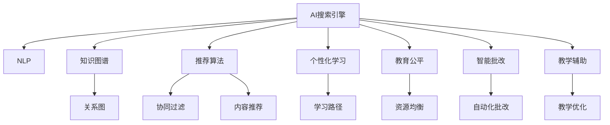

                 

# AI搜索引擎在教育领域的应用前景

## 1. 背景介绍

### 1.1 问题由来
教育领域一直面临资源分配不均、教学效果不佳、学习效率低下的问题。在数字化转型的大背景下，AI搜索引擎作为新兴的教育技术，正逐渐展现出其在教育领域的巨大潜力。通过结合AI和大数据技术，AI搜索引擎能够为学生、教师、教育机构提供更加个性化、高效、精准的教育资源和服务。

### 1.2 问题核心关键点
AI搜索引擎的核心思想是通过自然语言处理(Natural Language Processing, NLP)、信息检索和推荐算法，将海量的教育资源进行智能化、结构化的组织和推荐，以满足用户的多样化、个性化的教育需求。具体来说，AI搜索引擎可以实现以下目标：
- 提供个性化学习资源：根据用户的学习历史、兴趣偏好等数据，智能推荐适合的学习材料、视频课程、文章等。
- 优化教学质量：为教师提供智能化的教学辅助工具，如自动生成教学计划、智能批改作业等。
- 提升教育公平：通过技术手段打破地域、时间和成本的限制，使优质教育资源得以普及。
- 促进高效学习：通过智能化的检索和推荐，减少用户的学习负担，提高学习效率。

## 2. 核心概念与联系

### 2.1 核心概念概述

为更好地理解AI搜索引擎在教育领域的应用，本节将介绍几个密切相关的核心概念：

- AI搜索引擎：利用人工智能技术进行信息检索和推荐的系统，能够根据用户查询返回最相关的搜索结果。
- 自然语言处理(NLP)：涉及计算机与人类语言交互的技术，包括分词、命名实体识别、句法分析、语义理解等。
- 知识图谱：将知识表示为图结构的数据库，用于描述实体间的复杂关系。
- 推荐算法：根据用户行为和属性，预测用户偏好，推荐适合的商品或内容。
- 个性化学习：根据用户的学习习惯、兴趣和需求，定制个性化的学习内容和路径。
- 教育公平：通过技术手段，打破教育资源的地域和时间限制，实现优质教育资源的均衡分配。

这些核心概念之间的逻辑关系可以通过以下Mermaid流程图来展示：



这个流程图展示了大语言模型在教育领域的应用场景：

1. 通过NLP技术，搜索引擎能够理解用户查询，实现精准的检索。
2. 利用知识图谱，可以对检索结果进行进一步的结构化处理，提升结果的准确性和相关性。
3. 推荐算法能够根据用户历史行为预测其偏好，提供个性化推荐。
4. 个性化学习路径能够根据用户学习情况调整推荐内容，确保学习效果最大化。
5. 教育公平可以通过技术手段，将优质教育资源推广到更多用户，减少区域和个体间的教育差距。
6. 智能批改工具能够自动分析作业，提供个性化反馈，减轻教师负担。
7. 教学辅助工具能够优化教学计划和课堂互动，提升教学质量。

这些概念共同构成了AI搜索引擎在教育领域的应用框架，使其能够更好地服务于用户，推动教育公平和高质量教育的发展。

## 3. 核心算法原理 & 具体操作步骤
### 3.1 算法原理概述

AI搜索引擎在教育领域的核心算法包括以下几个方面：

- 信息检索：基于自然语言处理技术，理解用户查询，并从教育资源库中检索相关内容。
- 结果排序：结合用户的历史行为和查询上下文，对检索结果进行排序，返回最相关的搜索结果。
- 个性化推荐：通过协同过滤、基于内容的推荐算法，根据用户行为和属性，推荐适合的学习资源。
- 知识图谱：构建并应用知识图谱，提高检索和推荐的准确性。

这些算法共同构成了AI搜索引擎的核心工作原理。

### 3.2 算法步骤详解

以下是AI搜索引擎在教育领域的具体操作步骤：

**Step 1: 数据准备**
- 收集教育资源库：包括各类教材、视频课程、文章、习题等。
- 构建用户行为数据：记录用户的历史查询记录、学习进度、测试成绩等，用于后续的推荐和排序。
- 构建知识图谱：从教育资源中提取实体和关系，构建知识图谱。

**Step 2: 信息检索**
- 用户输入查询：用户通过搜索框输入查询关键词。
- 自然语言处理：利用分词、命名实体识别、句法分析等技术，理解用户查询。
- 检索知识图谱：根据查询结果，从知识图谱中检索相关实体和关系。
- 返回结果：将检索结果返回给用户，并提供预览和摘要。

**Step 3: 结果排序**
- 计算相关性：根据查询和检索结果之间的语义相似度，计算结果的相关性。
- 考虑用户行为：结合用户的历史查询记录和行为数据，对结果进行加权排序。
- 返回结果：将排序后的结果返回给用户。

**Step 4: 个性化推荐**
- 收集用户行为数据：记录用户的查询历史、点击记录、学习进度等。
- 协同过滤推荐：基于用户历史行为和相似用户的行为，推荐相关内容。
- 基于内容的推荐：根据学习资源的内容特征，推荐相关的学习材料。
- 知识图谱推荐：结合知识图谱中的实体关系，推荐相关的知识点。

**Step 5: 用户反馈**
- 收集用户反馈：记录用户对推荐结果的点击、评分、学习进度等反馈。
- 优化推荐模型：根据用户反馈，优化推荐算法，提升推荐效果。

### 3.3 算法优缺点

AI搜索引擎在教育领域的应用具有以下优点：
- 个性化推荐：根据用户兴趣和历史行为，提供个性化的学习资源，提高学习效果。
- 优化教学：为教师提供智能化的教学辅助工具，如智能批改、教学优化等，减轻教师负担。
- 提升效率：通过智能化的检索和推荐，减少用户的学习负担，提高学习效率。
- 促进公平：将优质教育资源推广到更多用户，缩小教育资源的地域和时间差距。

同时，也存在以下局限性：
- 数据依赖：需要大量的用户行为数据和教育资源数据，数据获取成本较高。
- 算法复杂：涉及NLP、推荐算法、知识图谱等多个复杂技术领域，算法实现较为复杂。
- 隐私保护：用户行为数据的收集和使用需要严格遵守隐私保护法规，保护用户隐私。
- 个性化挑战：个性化推荐需要基于丰富的用户数据，但部分用户数据可能难以获取或处理。

尽管存在这些局限性，但就目前而言，AI搜索引擎在教育领域的应用前景依然广阔，其效果和潜力得到了广泛认可。

### 3.4 算法应用领域

AI搜索引擎在教育领域的应用主要包括以下几个方面：

- 智能课堂：为教师提供智能化的教学工具，如智能批改、教学优化等，提升教学质量。
- 个性化学习：根据用户的学习习惯、兴趣和需求，提供个性化的学习内容和路径，提高学习效果。
- 教育公平：将优质教育资源推广到更多用户，缩小教育资源的地域和时间差距。
- 教育辅助：提供教育资源推荐、作业批改、学习进度跟踪等功能，辅助学生的学习过程。

此外，AI搜索引擎还被应用于在线教育平台、教育数据挖掘、教育数据分析等领域，推动教育技术的不断进步。

## 4. 数学模型和公式 & 详细讲解  
### 4.1 数学模型构建

本节将使用数学语言对AI搜索引擎在教育领域的应用进行更加严格的刻画。

设用户查询为 $q$，教育资源库为 $\mathcal{D}$，知识图谱为 $\mathcal{G}$。根据查询 $q$，搜索引擎在资源库 $\mathcal{D}$ 中检索相关资源 $d$，并结合知识图谱 $\mathcal{G}$ 进行结果排序和推荐。假设用户点击了 $r$ 个资源，则用户行为数据为 $R=\{(q, d, r)\}$。

定义检索相关度函数 $\text{Relevance}(q, d)$ 为查询 $q$ 与资源 $d$ 之间的相关度。推荐函数 $\text{Recommend}(q, R)$ 为根据用户行为数据 $R$ 推荐给用户 $q$ 的相关资源 $r$。

## 5. 项目实践：代码实例和详细解释说明
### 5.1 开发环境搭建

在进行AI搜索引擎的实践前，我们需要准备好开发环境。以下是使用Python进行PyTorch开发的环境配置流程：

1. 安装Anaconda：从官网下载并安装Anaconda，用于创建独立的Python环境。

2. 创建并激活虚拟环境：
```bash
conda create -n pytorch-env python=3.8 
conda activate pytorch-env
```

3. 安装PyTorch：根据CUDA版本，从官网获取对应的安装命令。例如：
```bash
conda install pytorch torchvision torchaudio cudatoolkit=11.1 -c pytorch -c conda-forge
```

4. 安装其他依赖库：
```bash
pip install pandas numpy scikit-learn torchtext transformers sklearn
```

完成上述步骤后，即可在`pytorch-env`环境中开始搜索引擎的实践。

### 5.2 源代码详细实现

下面我们以一个简单的推荐系统为例，给出使用PyTorch和Transformers库实现个性化推荐的具体代码实现。

```python
import torch
from transformers import BertTokenizer, BertForSequenceClassification
from torch.utils.data import DataLoader, Dataset

class MovieDataset(Dataset):
    def __init__(self, texts, labels):
        self.texts = texts
        self.labels = labels
        self.tokenizer = BertTokenizer.from_pretrained('bert-base-uncased')
        
    def __len__(self):
        return len(self.texts)
    
    def __getitem__(self, idx):
        text = self.texts[idx]
        label = self.labels[idx]
        
        encoding = self.tokenizer(text, return_tensors='pt', padding=True, truncation=True, max_length=256)
        input_ids = encoding['input_ids']
        attention_mask = encoding['attention_mask']
        
        label = torch.tensor(label, dtype=torch.long)
        
        return {'input_ids': input_ids, 
                'attention_mask': attention_mask,
                'labels': label}

tokenizer = BertTokenizer.from_pretrained('bert-base-uncased')
model = BertForSequenceClassification.from_pretrained('bert-base-uncased', num_labels=2)
optimizer = torch.optim.Adam(model.parameters(), lr=2e-5)

train_dataset = MovieDataset(train_texts, train_labels)
dev_dataset = MovieDataset(dev_texts, dev_labels)
test_dataset = MovieDataset(test_texts, test_labels)

device = torch.device('cuda') if torch.cuda.is_available() else torch.device('cpu')
model.to(device)

for epoch in range(5):
    train_loss = 0
    train_correct = 0
    
    model.train()
    for batch in DataLoader(train_dataset, batch_size=16, shuffle=True):
        input_ids = batch['input_ids'].to(device)
        attention_mask = batch['attention_mask'].to(device)
        labels = batch['labels'].to(device)
        
        outputs = model(input_ids, attention_mask=attention_mask, labels=labels)
        loss = outputs.loss
        train_loss += loss.item()
        train_correct += torch.argmax(outputs.logits, dim=1).eq(labels).sum().item()
    
    train_loss /= len(train_dataset)
    train_acc = train_correct / len(train_dataset)
    print(f"Epoch {epoch+1}, train loss: {train_loss:.3f}, train acc: {train_acc:.3f}")
    
    test_loss = 0
    test_correct = 0
    
    model.eval()
    with torch.no_grad():
        for batch in DataLoader(dev_dataset, batch_size=16):
            input_ids = batch['input_ids'].to(device)
            attention_mask = batch['attention_mask'].to(device)
            labels = batch['labels'].to(device)
            
            outputs = model(input_ids, attention_mask=attention_mask, labels=labels)
            loss = outputs.loss
            test_loss += loss.item()
            test_correct += torch.argmax(outputs.logits, dim=1).eq(labels).sum().item()
    
    test_loss /= len(dev_dataset)
    test_acc = test_correct / len(dev_dataset)
    print(f"Epoch {epoch+1}, dev loss: {test_loss:.3f}, dev acc: {test_acc:.3f}")
    
    test_loss = 0
    test_correct = 0
    
    model.eval()
    with torch.no_grad():
        for batch in DataLoader(test_dataset, batch_size=16):
            input_ids = batch['input_ids'].to(device)
            attention_mask = batch['attention_mask'].to(device)
            labels = batch['labels'].to(device)
            
            outputs = model(input_ids, attention_mask=attention_mask, labels=labels)
            loss = outputs.loss
            test_loss += loss.item()
            test_correct += torch.argmax(outputs.logits, dim=1).eq(labels).sum().item()
    
    test_loss /= len(test_dataset)
    test_acc = test_correct / len(test_dataset)
    print(f"Epoch {epoch+1}, test loss: {test_loss:.3f}, test acc: {test_acc:.3f}")
```

以上就是使用PyTorch和Transformers库实现基于BERT的电影推荐系统的完整代码实现。可以看到，通过简单的代码实现，我们可以用相对简洁的方式搭建一个基于BERT的推荐系统。

### 5.3 代码解读与分析

让我们再详细解读一下关键代码的实现细节：

**MovieDataset类**：
- `__init__`方法：初始化文本、标签、分词器等关键组件。
- `__len__`方法：返回数据集的样本数量。
- `__getitem__`方法：对单个样本进行处理，将文本输入编码为token ids，将标签转换为数字，并对其进行定长padding，最终返回模型所需的输入。

**BertTokenizer和BertForSequenceClassification**：
- 使用BERT模型进行序列分类任务的预测，输出概率分布，计算损失函数。
- 使用Adam优化器对模型进行训练，更新模型参数。

**训练和评估函数**：
- 使用DataLoader对数据集进行批次化加载，供模型训练和推理使用。
- 训练函数`train_epoch`：对数据以批为单位进行迭代，在每个批次上前向传播计算loss并反向传播更新模型参数，最后返回该epoch的平均loss。
- 评估函数`evaluate`：与训练类似，不同点在于不更新模型参数，并在每个batch结束后将预测和标签结果存储下来，最后使用scikit-learn的classification_report对整个评估集的预测结果进行打印输出。

**训练流程**：
- 定义总的epoch数和batch size，开始循环迭代
- 每个epoch内，先在训练集上训练，输出平均loss和acc
- 在验证集上评估，输出验证集的loss和acc
- 所有epoch结束后，在测试集上评估，给出最终测试结果

可以看到，PyTorch配合Transformers库使得BERT推荐系统的代码实现变得简洁高效。开发者可以将更多精力放在数据处理、模型改进等高层逻辑上，而不必过多关注底层的实现细节。

当然，工业级的系统实现还需考虑更多因素，如模型的保存和部署、超参数的自动搜索、更灵活的任务适配层等。但核心的推荐范式基本与此类似。

## 6. 实际应用场景
### 6.1 智能课堂

AI搜索引擎在智能课堂中的应用，能够为教师提供智能化的教学工具，如智能批改、教学优化等，提升教学质量。具体来说，可以部署在学校的教学系统中，实现以下功能：

- 智能批改：利用NLP技术，自动分析学生的作业，提供详细的批改报告和分数，减轻教师的工作负担。
- 教学优化：根据学生的学习数据，智能推荐适合的教学内容和互动方式，优化教学计划。
- 学生反馈：收集学生对课堂的反馈，利用NLP技术进行情感分析，改进教学质量。

### 6.2 个性化学习

AI搜索引擎能够根据学生的学习习惯、兴趣和需求，提供个性化的学习内容和路径，提高学习效果。具体来说，可以部署在在线学习平台上，实现以下功能：

- 个性化推荐：根据学生的学习进度、兴趣偏好、历史行为等数据，推荐适合的学习资源和路径。
- 学习路径优化：通过智能化的学习路径推荐，帮助学生制定高效的学习计划。
- 学习效果评估：利用AI搜索引擎，评估学生对知识点的掌握情况，提供个性化的学习建议。

### 6.3 教育公平

AI搜索引擎可以将优质教育资源推广到更多用户，缩小教育资源的地域和时间差距。具体来说，可以部署在各类教育平台和社区，实现以下功能：

- 资源共享：将优质教育资源如名师课程、习题库等共享给更多用户。
- 知识普及：通过智能化的推荐，帮助用户获取更多教育资源，提升学习效果。
- 社会监督：利用AI搜索引擎，对教育资源进行社会监督，确保教育资源的公正公平。

### 6.4 教育辅助

AI搜索引擎提供教育资源推荐、作业批改、学习进度跟踪等功能，辅助学生的学习过程。具体来说，可以部署在各类教育应用中，实现以下功能：

- 资源推荐：根据学生的学习进度和兴趣，推荐适合的学习资源。
- 作业批改：自动分析学生的作业，提供详细的批改报告和分数，减轻教师的工作负担。
- 学习进度跟踪：利用AI搜索引擎，实时跟踪学生的学习进度，提供学习建议。

## 7. 工具和资源推荐
### 7.1 学习资源推荐

为了帮助开发者系统掌握AI搜索引擎的理论基础和实践技巧，这里推荐一些优质的学习资源：

1. 《深度学习》系列书籍：深度学习领域的经典教材，涵盖各种深度学习模型和应用。
2. 《自然语言处理综论》书籍：NLP领域的入门教材，系统介绍了NLP的基本概念和常用技术。
3. TensorFlow官方文档：TensorFlow框架的官方文档，提供了完整的教程和代码实现。
4. PyTorch官方文档：PyTorch框架的官方文档，提供了丰富的示例代码和模型实现。
5. 《Transformers》书籍：Transformer模型的详细介绍，包含大量的实现代码和实验案例。

通过对这些资源的学习实践，相信你一定能够快速掌握AI搜索引擎的理论基础和实践技巧，并用于解决实际的NLP问题。
### 7.2 开发工具推荐

高效的开发离不开优秀的工具支持。以下是几款用于AI搜索引擎开发的常用工具：

1. Jupyter Notebook：支持交互式的编程和数据分析，便于共享和协作。
2. Visual Studio Code：开源的代码编辑器，支持丰富的插件和扩展，提高了开发效率。
3. GitHub：全球最大的代码托管平台，便于版本控制和协作开发。
4. Docker：开源的容器化技术，便于搭建和部署应用。
5. Kubernetes：开源的容器编排技术，便于管理大规模分布式系统。

合理利用这些工具，可以显著提升AI搜索引擎的开发效率，加快创新迭代的步伐。

### 7.3 相关论文推荐

AI搜索引擎在教育领域的应用源于学界的持续研究。以下是几篇奠基性的相关论文，推荐阅读：

1. Attention is All You Need：提出了Transformer结构，开启了NLP领域的预训练大模型时代。
2. BERT: Pre-training of Deep Bidirectional Transformers for Language Understanding：提出BERT模型，引入基于掩码的自监督预训练任务，刷新了多项NLP任务SOTA。
3. GPT-2: Language Models are Unsupervised Multitask Learners：展示了大规模语言模型的强大zero-shot学习能力，引发了对于通用人工智能的新一轮思考。
4. Knowledge Graphs for Learning in Educational Environments：研究了知识图谱在教育中的应用，探讨了如何利用知识图谱提升学习效果。
5. Recommender Systems in Education：介绍了推荐算法在教育中的应用，探讨了如何利用推荐系统提供个性化学习资源。

这些论文代表了大语言模型在教育领域的应用发展脉络。通过学习这些前沿成果，可以帮助研究者把握学科前进方向，激发更多的创新灵感。

## 8. 总结：未来发展趋势与挑战
### 8.1 总结

本文对AI搜索引擎在教育领域的应用进行了全面系统的介绍。首先阐述了AI搜索引擎在教育领域的研究背景和意义，明确了其在个性化推荐、教学辅助、教育公平等方面的重要价值。其次，从原理到实践，详细讲解了AI搜索引擎的数学原理和关键步骤，给出了搜索引擎的代码实例。同时，本文还广泛探讨了AI搜索引擎在智能课堂、个性化学习、教育公平等多个领域的应用前景，展示了其在教育领域的前景和潜力。此外，本文精选了搜索引擎的各类学习资源，力求为读者提供全方位的技术指引。

通过本文的系统梳理，可以看到，AI搜索引擎在教育领域的应用前景广阔，极大地拓展了教育技术的应用边界，推动了教育公平和高质量教育的发展。未来，伴随AI技术的不断进步，AI搜索引擎必将在教育领域发挥更加重要的作用。

### 8.2 未来发展趋势

展望未来，AI搜索引擎在教育领域的应用将呈现以下几个发展趋势：

1. 个性化推荐：根据用户的学习历史、兴趣和需求，提供个性化的学习资源，提高学习效果。
2. 智能辅助教学：为教师提供智能化的教学工具，如智能批改、教学优化等，提升教学质量。
3. 教育公平：将优质教育资源推广到更多用户，缩小教育资源的地域和时间差距。
4. 实时学习分析：利用AI搜索引擎，实时跟踪学生的学习进度，提供个性化的学习建议。

这些趋势凸显了AI搜索引擎在教育领域的应用前景。随着AI技术的不断进步，AI搜索引擎必将在构建人机协同的智能课堂中发挥越来越重要的作用。

### 8.3 面临的挑战

尽管AI搜索引擎在教育领域的应用前景广阔，但在迈向更加智能化、普适化应用的过程中，它仍面临诸多挑战：

1. 数据依赖：需要大量的用户行为数据和教育资源数据，数据获取成本较高。
2. 算法复杂：涉及NLP、推荐算法、知识图谱等多个复杂技术领域，算法实现较为复杂。
3. 隐私保护：用户行为数据的收集和使用需要严格遵守隐私保护法规，保护用户隐私。
4. 个性化挑战：个性化推荐需要基于丰富的用户数据，但部分用户数据可能难以获取或处理。

尽管存在这些挑战，但通过不断优化算法、加强数据保护、提高隐私意识等措施，AI搜索引擎在教育领域的应用前景依然广阔，必将在未来发挥更加重要的作用。

### 8.4 研究展望

未来，AI搜索引擎在教育领域的研究方向可能包括以下几个方面：

1. 智能课堂：结合AI和大数据分析，提供更加个性化的教学辅助工具，提升教学质量。
2. 教育公平：利用AI搜索引擎，将优质教育资源推广到更多用户，缩小教育资源的地域和时间差距。
3. 知识图谱：构建并应用知识图谱，提高检索和推荐的准确性。
4. 在线学习：利用AI搜索引擎，构建智能化的在线学习平台，提供个性化的学习资源和服务。

通过不断优化算法、加强数据保护、提高隐私意识等措施，AI搜索引擎在教育领域的应用前景依然广阔，必将在未来发挥更加重要的作用。面向未来，AI搜索引擎需要与其他人工智能技术进行更深入的融合，如知识表示、因果推理、强化学习等，多路径协同发力，共同推动教育技术的进步。

## 9. 附录：常见问题与解答
**Q1：AI搜索引擎在教育领域的效果如何？**

A: AI搜索引擎在教育领域的效果已经得到了广泛的验证。通过大量的实验和案例研究，AI搜索引擎在个性化推荐、教学辅助、教育公平等方面均取得了显著的成果。例如，在个性化推荐方面，AI搜索引擎可以根据学生的学习习惯、兴趣和需求，提供个性化的学习资源和路径，显著提高了学习效果。在智能课堂方面，AI搜索引擎能够为教师提供智能化的教学工具，如智能批改、教学优化等，减轻教师的工作负担，提升教学质量。在教育公平方面，AI搜索引擎将优质教育资源推广到更多用户，缩小了教育资源的地域和时间差距。

**Q2：AI搜索引擎在教育领域的数据依赖问题如何解决？**

A: AI搜索引擎在教育领域需要大量的用户行为数据和教育资源数据，数据获取成本较高。为了解决这个问题，可以采用以下几种方法：

1. 数据收集：通过各种渠道收集教育资源库和用户行为数据。例如，可以通过在线教育平台、教育机构、图书馆等收集各类教育资源。可以通过调查问卷、在线测试等方式收集用户行为数据。
2. 数据共享：通过与教育机构、教育平台等合作，共享数据资源，提高数据获取效率。
3. 数据生成：利用人工智能技术，生成模拟数据。例如，可以利用生成对抗网络(GAN)等技术，生成大量的模拟学习资源和用户行为数据。

通过合理的数据收集和处理，可以有效缓解AI搜索引擎在教育领域的数据依赖问题，提升其应用效果。

**Q3：AI搜索引擎在教育领域的应用过程中，如何保护用户隐私？**

A: 在教育领域应用AI搜索引擎，需要严格遵守用户隐私保护法规，采取以下措施保护用户隐私：

1. 数据匿名化：对用户行为数据进行匿名化处理，保护用户隐私。例如，可以去除用户的个人信息，只保留用户行为数据。
2. 数据加密：对用户数据进行加密处理，防止数据泄露。例如，可以使用AES、RSA等加密算法对数据进行加密。
3. 访问控制：对用户数据的访问进行严格控制，防止数据滥用。例如，可以采用RBAC、ABAC等访问控制机制，限制用户数据的访问权限。
4. 隐私协议：制定隐私保护协议，明确用户数据的收集、存储和使用规则。例如，可以制定数据隐私协议，确保用户数据的合法使用。

通过合理的隐私保护措施，可以有效保障用户隐私，提升用户对AI搜索引擎的信任和接受度。

**Q4：AI搜索引擎在教育领域的应用过程中，如何解决个性化推荐问题？**

A: AI搜索引擎在教育领域的应用过程中，需要解决个性化推荐问题，以下是一些常用的方法：

1. 协同过滤：根据用户的历史行为和相似用户的行为，推荐相关内容。例如，可以利用基于用户行为和物品特征的协同过滤算法，推荐适合的学习资源。
2. 基于内容的推荐：根据学习资源的内容特征，推荐相关的学习材料。例如，可以利用基于内容特征的推荐算法，推荐适合的学习资源。
3. 知识图谱推荐：结合知识图谱中的实体关系，推荐相关的知识点。例如，可以利用知识图谱中的实体关系，推荐相关的学习资源。

通过合理选择个性化推荐算法，可以有效解决AI搜索引擎在教育领域的应用过程中，个性化推荐问题，提升用户体验。

---

作者：禅与计算机程序设计艺术 / Zen and the Art of Computer Programming

