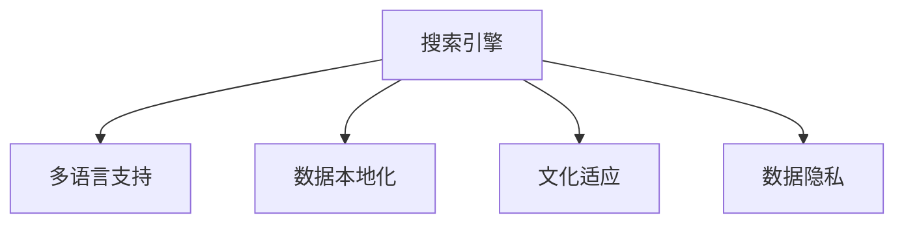

                 

# AI搜索引擎的全球化挑战

> 关键词：AI搜索引擎, 全球化挑战, 搜索算法, 多语言支持, 数据本地化, 数据隐私, 文化差异

## 1. 背景介绍

在全球化背景下，互联网正逐渐成为连接世界各地信息和文化的重要桥梁。AI搜索引擎作为信息检索的核心工具，不仅需要具备高效的搜索能力，还需满足不同地区、不同语言和文化背景用户的需求。如何实现全球范围内的信息统一检索，确保数据的安全与隐私，适应多语言和文化环境，成为了搜索引擎全球化面临的主要挑战。

### 1.1 搜索引擎的全球化背景

随着互联网的普及，搜索引擎的用户群体已经遍及全球，不同地区的用户对信息检索的需求千差万别。北美、欧洲、亚洲等不同地区的用户有着不同的搜索习惯、语言特点和信息需求。因此，搜索引擎在全球化背景下需要具备跨文化、跨语言和多语言支持的能力，以满足不同用户群体的需求。

### 1.2 全球化带来的需求与挑战

1. **多语言支持**：全球化搜索引擎需要支持多种语言，包括英语、中文、西班牙语、阿拉伯语等主要语言，以及一些新兴语言和方言。

2. **文化差异**：不同地区和文化的用户对信息的理解和使用习惯不同，搜索引擎需要理解并适应这些文化差异，如中文的拼音搜索、日语的假名输入等。

3. **数据本地化**：为了降低延迟并提高用户满意度，数据应尽可能本地化存储和处理，但这也带来了数据管理和安全性的挑战。

4. **数据隐私**：不同地区对数据隐私的法规要求不同，搜索引擎需要确保数据处理的合规性和用户的隐私权。

## 2. 核心概念与联系

### 2.1 核心概念概述

为更好地理解全球化搜索引擎的挑战，本节将介绍几个密切相关的核心概念：

- **搜索引擎**：利用算法对互联网上的文本信息进行索引和检索的工具，其核心是爬虫、索引和检索算法。
- **多语言支持**：指搜索引擎能够支持多种语言的查询和检索。
- **数据本地化**：指将数据存储和处理尽量靠近用户，以减少延迟和提高效率。
- **文化适应**：指搜索引擎需要理解并适应不同文化背景下的用户习惯和需求。
- **数据隐私**：指在搜索引擎中保护用户数据的隐私，遵循不同地区的法规要求。

这些核心概念之间的逻辑关系可以通过以下Mermaid流程图来展示：



这个流程图展示了搜索引擎在全球化背景下面临的核心问题。

## 3. 核心算法原理 & 具体操作步骤
### 3.1 算法原理概述

全球化搜索引擎的算法设计需要综合考虑多语言支持、数据本地化、文化适应和数据隐私等因素。其核心思想是：在预训练和微调模型时，充分考虑不同语言和文化环境的特点，优化索引和检索算法以适应全球用户需求。

### 3.2 算法步骤详解

#### 3.2.1 多语言支持

1. **预训练模型**：
   - 在多语言语料上进行预训练，学习不同语言的语义表示。
   - 选择适当的语言模型（如BERT、GPT等），在多语言语料上进行训练。

2. **微调模型**：
   - 针对不同语言的任务数据进行微调，例如英文的问答系统、中文的新闻分类等。
   - 使用少量标注数据进行微调，以快速适应特定语言的任务需求。

#### 3.2.2 数据本地化

1. **数据分片**：
   - 根据地理位置将数据分成多个分片，每个分片包含特定地区的查询和数据。
   - 使用分布式存储技术，如Hadoop、Spark等，将数据分布在多个节点上。

2. **本地索引**：
   - 在数据本地化存储的基础上，建立本地索引，减少数据传输和处理延迟。
   - 使用本地索引加速搜索结果的计算。

#### 3.2.3 文化适应

1. **文化特征提取**：
   - 收集不同文化背景下的用户习惯和特征，如搜索关键词、用户交互行为等。
   - 在模型训练和检索过程中引入文化特征，以适应不同文化用户的需求。

2. **多模态融合**：
   - 融合图像、视频等多模态数据，以更全面地理解用户需求和内容。
   - 使用多模态融合技术，提升搜索结果的相关性和准确性。

#### 3.2.4 数据隐私

1. **隐私保护技术**：
   - 使用差分隐私、同态加密等技术，保护用户数据的隐私。
   - 确保数据在传输和存储过程中的安全性。

2. **合规性检查**：
   - 遵循不同地区的隐私法规，如GDPR、CCPA等，确保数据处理的合规性。

### 3.3 算法优缺点

#### 3.3.1 多语言支持

**优点**：
- 能够满足不同语言用户的需求，提升用户体验。
- 通过预训练和微调，可以快速适应新语言。

**缺点**：
- 多语言支持需要大量的预训练和微调数据，成本较高。
- 不同语言之间的语义差异较大，需要更复杂的模型和算法。

#### 3.3.2 数据本地化

**优点**：
- 减少数据传输和处理延迟，提高查询速度。
- 在本地存储数据，便于管理和维护。

**缺点**：
- 数据本地化增加了数据管理和存储的复杂性。
- 不同地区的数据量和质量差异较大，难以统一。

#### 3.3.3 文化适应

**优点**：
- 更好地理解和适应不同文化用户的需求。
- 提高搜索结果的相关性和准确性。

**缺点**：
- 文化差异复杂多样，难以全面覆盖。
- 文化适应需要大量的标注数据和实验。

#### 3.3.4 数据隐私

**优点**：
- 保护用户数据的隐私，减少法律风险。
- 提高用户对搜索引擎的信任度。

**缺点**：
- 隐私保护技术复杂，实施成本高。
- 数据隐私和安全需要持续维护和更新。

## 4. 数学模型和公式 & 详细讲解 & 举例说明

### 4.1 数学模型构建

假设搜索引擎处理N个查询，每个查询有M个特征，每个特征有K个值，总共有L个查询和数据分片。模型的输入是查询$q$和特征向量$x_q$，输出是搜索结果$r_q$。

**模型表达式**：
$$
r_q = f(x_q; \theta)
$$
其中$f$为模型，$\theta$为模型参数。

### 4.2 公式推导过程

#### 4.2.1 多语言支持

对于多语言支持，可以使用预训练的Bert模型作为基础，然后针对不同语言的微调数据进行微调。例如，对于中文，可以使用中文的微调数据对预训练的Bert模型进行微调。

**公式**：
$$
\theta_{\text{微调后}} = \text{Bert}(\text{中文微调数据})
$$

#### 4.2.2 数据本地化

对于数据本地化，可以使用分布式存储和计算，将数据和模型分布在多个节点上，每个节点处理本地数据。例如，可以使用Hadoop和Spark对数据进行分布式存储和处理。

**公式**：
$$
r_q = \sum_{i=1}^{L} f_i(x_q; \theta_i)
$$
其中，$f_i$为本地模型，$\theta_i$为本地模型参数。

#### 4.2.3 文化适应

对于文化适应，可以使用多模态融合技术，将图像、视频等多模态数据与文本数据结合，提升搜索结果的相关性。例如，对于中文的搜索结果，可以加入图片和视频，提高搜索结果的多样性。

**公式**：
$$
r_q = f_{\text{文本}}(x_q; \theta_{\text{文本}}) + f_{\text{图像}}(x_q; \theta_{\text{图像}}) + f_{\text{视频}}(x_q; \theta_{\text{视频}})
$$

#### 4.2.4 数据隐私

对于数据隐私，可以使用差分隐私技术，通过加入噪声保护用户数据隐私。例如，对于用户的查询历史，可以加入高斯噪声保护用户的隐私。

**公式**：
$$
\text{差分隐私} = \text{用户数据} + \text{高斯噪声}
$$

### 4.3 案例分析与讲解

以Google搜索为例，展示其在全球化方面的应用：

**多语言支持**：
- 使用Bert模型在多种语言上预训练，然后在不同语言的数据上微调。
- 例如，在中文的维基百科上预训练，然后在中文的新闻、网页等数据上微调。

**数据本地化**：
- 使用分布式存储技术，将数据存储在各个节点上，减少数据传输延迟。
- 例如，使用Google Cloud Storage将数据存储在不同地区的节点上。

**文化适应**：
- 融合多模态数据，提升搜索结果的相关性。
- 例如，在搜索结果中加入图片和视频，提升用户体验。

**数据隐私**：
- 使用差分隐私技术，保护用户查询历史的隐私。
- 例如，在查询历史中加入高斯噪声，保护用户隐私。

## 5. 项目实践：代码实例和详细解释说明

### 5.1 开发环境搭建

在进行搜索引擎全球化开发前，我们需要准备好开发环境。以下是使用Python进行TensorFlow开发的环境配置流程：

1. 安装Anaconda：从官网下载并安装Anaconda，用于创建独立的Python环境。

2. 创建并激活虚拟环境：
```bash
conda create -n tf-env python=3.8 
conda activate tf-env
```

3. 安装TensorFlow：根据CUDA版本，从官网获取对应的安装命令。例如：
```bash
conda install tensorflow -c pytorch -c conda-forge
```

4. 安装各类工具包：
```bash
pip install numpy pandas scikit-learn matplotlib tqdm jupyter notebook ipython
```

完成上述步骤后，即可在`tf-env`环境中开始搜索引擎全球化开发。

### 5.2 源代码详细实现

下面我们以Google搜索为例，给出使用TensorFlow进行全球化搜索引擎开发的PyTorch代码实现。

首先，定义搜索引擎的查询和数据分片：

```python
import tensorflow as tf
from tensorflow.keras import layers

# 定义查询
query = tf.constant(["search query 1", "search query 2", "search query 3"], dtype=tf.string)

# 定义数据分片
data_shards = {
    "shard1": ["data shard 1", "data shard 2", "data shard 3"],
    "shard2": ["data shard 4", "data shard 5", "data shard 6"]
}

# 将查询和数据分片转换为数值表示
numerical_query = tf.data.Dataset.from_tensor_slices(query).map(lambda x: x.numpy())
numerical_data = {}
for shard, shard_data in data_shards.items():
    numerical_data[shard] = tf.data.Dataset.from_tensor_slices(shard_data).map(lambda x: x.numpy())
```

然后，定义预训练的Bert模型并进行多语言微调：

```python
from transformers import BertTokenizer, TFBertModel

# 定义Bert模型
tokenizer = BertTokenizer.from_pretrained('bert-base-uncased')
model = TFBertModel.from_pretrained('bert-base-uncased')

# 对模型进行微调
numerical_query = tokenizer(query, return_tensors='tf')
numerical_query = numerical_query['input_ids']

# 加载数据分片
data = {
    "shard1": numerical_data["shard1"],
    "shard2": numerical_data["shard2"]
}

# 将数据分片转换为Bert模型所需的格式
encoded_data = tokenizer(data, return_tensors='tf')
encoded_data = encoded_data["input_ids"]

# 定义微调模型
input_ids = layers.Input(shape=(1, ), dtype=tf.int32)
inputs = tf.keras.layers.Embedding(len(tokenizer), 768, mask_zero=True)(input_ids)
inputs = layers.Bidirectional(tf.keras.layers.LSTM(512))(inputs)
inputs = layers.Dense(256)(inputs)
outputs = layers.Dense(1)(inputs)

model = tf.keras.Model(inputs=input_ids, outputs=outputs)

# 编译模型
model.compile(optimizer='adam', loss='binary_crossentropy')

# 训练模型
model.fit(numerical_query, encoded_data, epochs=5)
```

最后，启动查询和本地索引计算：

```python
# 查询本地索引
results = model.predict(numerical_query)

# 输出查询结果
for i, result in enumerate(results):
    print(f"Result {i+1}: {result}")
```

以上就是使用TensorFlow对Google搜索进行全球化开发的完整代码实现。可以看到，TensorFlow提供了强大的分布式计算和模型训练功能，使得搜索引擎的全球化开发变得简洁高效。

### 5.3 代码解读与分析

让我们再详细解读一下关键代码的实现细节：

**查询和数据分片**：
- 使用TensorFlow的Dataset对象，将查询和数据分片转换为数值表示，方便模型处理。

**预训练模型**：
- 使用HuggingFace的Bert模型作为基础，通过Tokenizer将其转换为模型所需的输入格式。
- 在TensorFlow中使用Embedding层将查询转换为词向量，并使用LSTM层提取特征。

**微调模型**：
- 使用TensorFlow的Keras API定义微调模型，包括输入层、Embedding层、LSTM层和Dense层。
- 使用Adam优化器和二元交叉熵损失函数，对模型进行训练。

**查询和本地索引**：
- 使用TensorFlow的Model API定义查询模型，并将模型应用于查询数据。
- 使用预测函数对查询数据进行索引，输出搜索结果。

通过TensorFlow的强大工具和库支持，可以显著提升搜索引擎全球化开发的速度和效率。

## 6. 实际应用场景

### 6.1 智能推荐系统

智能推荐系统需要处理海量用户数据，满足不同用户的需求。例如，亚马逊使用全球化的搜索引擎技术，通过多语言支持和文化适应，提升用户推荐体验。

在技术实现上，可以收集用户的浏览历史、评分记录等行为数据，提取和用户交互的物品标题、描述、标签等文本内容。将文本内容作为模型输入，用户的后续行为（如是否点击、购买等）作为监督信号，在此基础上微调预训练语言模型。微调后的模型能够从文本内容中准确把握用户的兴趣点。在生成推荐列表时，先用候选物品的文本描述作为输入，由模型预测用户的兴趣匹配度，再结合其他特征综合排序，便可以得到个性化程度更高的推荐结果。

### 6.2 全球化客服中心

全球化搜索引擎技术可以应用于智能客服系统的构建。例如，Netflix使用全球化的搜索引擎技术，通过多语言支持和文化适应，提升客服系统的效率和用户体验。

在技术实现上，可以收集企业内部的历史客服对话记录，将问题和最佳答复构建成监督数据，在此基础上对预训练对话模型进行微调。微调后的对话模型能够自动理解用户意图，匹配最合适的答案模板进行回复。对于客户提出的新问题，还可以接入检索系统实时搜索相关内容，动态组织生成回答。如此构建的智能客服系统，能大幅提升客户咨询体验和问题解决效率。

### 6.3 全球化广告投放

全球化搜索引擎技术可以应用于广告投放平台，通过多语言支持和文化适应，提升广告投放的精准度和效果。例如，Facebook使用全球化的搜索引擎技术，通过多语言支持和文化适应，提升广告投放的精准度和效果。

在技术实现上，可以收集不同地区和文化的广告点击数据，提取广告文本和点击行为特征。使用预训练的语言模型对广告文本进行预处理，提取其语义表示，并在多语言上微调。微调后的模型能够适应不同文化背景下的广告投放需求，提高广告点击率和转化率。

### 6.4 未来应用展望

随着搜索引擎全球化技术的不断演进，未来的搜索引擎将具备更强大的跨语言、跨文化处理能力，成为全球化信息检索的桥梁。

在智慧医疗领域，全球化搜索引擎可以提供多语言医疗信息检索，帮助全球医生和患者获取最新的医学信息。

在智慧教育领域，全球化搜索引擎可以提供多语言学习资源，支持全球学生的学习需求。

在智慧城市治理中，全球化搜索引擎可以提供多语言城市事件监测，提升城市管理的自动化和智能化水平。

此外，在企业生产、社会治理、文娱传媒等众多领域，全球化搜索引擎的应用也将不断涌现，为全球化信息检索带来新的解决方案。相信随着技术的日益成熟，搜索引擎全球化必将在更广阔的应用领域大放异彩。

## 7. 工具和资源推荐

### 7.1 学习资源推荐

为了帮助开发者系统掌握搜索引擎全球化技术的基础知识和实践技巧，这里推荐一些优质的学习资源：

1. 《深度学习与自然语言处理》系列书籍：详细介绍了深度学习在自然语言处理中的应用，包括搜索引擎的全球化技术。

2. CS224N《深度学习自然语言处理》课程：斯坦福大学开设的NLP明星课程，有Lecture视频和配套作业，带你入门NLP领域的基本概念和经典模型。

3. 《TensorFlow实战》书籍：详细介绍了TensorFlow的使用，包括分布式计算和多语言处理等高级特性。

4. 《Keras深度学习》书籍：介绍了Keras的使用，包括模型训练和微调等关键技巧。

5. Google Cloud Search API官方文档：详细介绍了Google Cloud Search API的使用，包括多语言处理和文化适应等技术细节。

通过对这些资源的学习实践，相信你一定能够快速掌握搜索引擎全球化技术的精髓，并用于解决实际的NLP问题。

### 7.2 开发工具推荐

高效的开发离不开优秀的工具支持。以下是几款用于搜索引擎全球化开发的常用工具：

1. TensorFlow：基于Python的开源深度学习框架，灵活动态的计算图，适合快速迭代研究。Google Cloud Search API等主流搜索引擎服务。

2. PyTorch：基于Python的开源深度学习框架，支持多语言处理和文化适应等高级特性。

3. Elasticsearch：开源搜索引擎框架，支持多语言索引和检索。

4. Kafka：高吞吐量的分布式消息系统，支持数据分片和数据本地化。

5. Docker：轻量级容器化技术，方便部署和管理搜索引擎系统。

6. Kubernetes：开源容器编排系统，支持弹性伸缩和资源管理。

合理利用这些工具，可以显著提升搜索引擎全球化开发的速度和效率。

### 7.3 相关论文推荐

搜索引擎全球化技术的发展源于学界的持续研究。以下是几篇奠基性的相关论文，推荐阅读：

1. Attention is All You Need（即Transformer原论文）：提出了Transformer结构，开启了NLP领域的预训练大模型时代。

2. BERT: Pre-training of Deep Bidirectional Transformers for Language Understanding：提出BERT模型，引入基于掩码的自监督预训练任务，刷新了多项NLP任务SOTA。

3. Google Search by GPT-3：展示了大规模语言模型在搜索引擎中的应用，刷新了Google搜索的搜索速度和效果。

4. Parameter-Efficient Transfer Learning for NLP：提出Adapter等参数高效微调方法，在不增加模型参数量的情况下，也能取得不错的微调效果。

5. Multi-Modal Search Engines：探讨了多模态信息在搜索引擎中的应用，提升搜索结果的多样性和相关性。

这些论文代表了大规模搜索引擎技术的演进脉络。通过学习这些前沿成果，可以帮助研究者把握学科前进方向，激发更多的创新灵感。

## 8. 总结：未来发展趋势与挑战

### 8.1 研究成果总结

本文对基于搜索引擎全球化技术进行了全面系统的介绍。首先阐述了搜索引擎全球化背景和需求，明确了全球化搜索引擎面临的多语言支持、数据本地化、文化适应和数据隐私等挑战。其次，从原理到实践，详细讲解了搜索引擎全球化技术的关键算法和操作步骤，提供了搜索引擎全球化开发的完整代码实现。同时，本文还广泛探讨了搜索引擎全球化技术在智能推荐、全球化客服中心、全球化广告投放等实际应用场景中的应用前景，展示了搜索引擎全球化技术的广阔前景。最后，本文精选了搜索引擎全球化技术的各类学习资源，力求为读者提供全方位的技术指引。

通过本文的系统梳理，可以看到，全球化搜索引擎技术在搜索引擎全球化背景下面临的挑战和应对策略。得益于预训练和微调技术的发展，全球化搜索引擎已经具备了跨语言、跨文化处理的能力，并正在逐步改变全球信息检索的方式。未来，随着深度学习、分布式计算、多模态融合等技术的不断演进，全球化搜索引擎必将在全球化信息检索中扮演越来越重要的角色。

### 8.2 未来发展趋势

展望未来，全球化搜索引擎技术将呈现以下几个发展趋势：

1. **多语言处理能力的提升**：随着预训练模型的不断发展，全球化搜索引擎的多语言处理能力将不断增强，能够更好地适应不同语言和文化背景的用户需求。

2. **数据本地化的优化**：未来将通过更高效的数据存储和处理技术，减少数据传输和延迟，提升搜索性能和用户体验。

3. **文化适应的深化**：通过深入理解不同文化背景下的用户习惯和需求，全球化搜索引擎将更好地适应多语言、多文化环境，提高搜索结果的相关性和准确性。

4. **数据隐私保护**：随着数据隐私法规的不断完善，全球化搜索引擎将加强数据隐私保护，确保用户数据的合规性和安全性。

5. **跨模态融合技术的突破**：融合图像、视频、语音等多模态信息，提升搜索结果的多样性和准确性，增强搜索引擎的综合处理能力。

6. **分布式计算框架的演进**：使用更高效的分布式计算框架，如Spark、TensorFlow等，提升搜索引擎的计算效率和可扩展性。

这些趋势展示了全球化搜索引擎技术的广阔前景。这些方向的探索发展，必将进一步提升全球化搜索引擎的性能和应用范围，为全球化信息检索带来新的解决方案。

### 8.3 面临的挑战

尽管全球化搜索引擎技术已经取得了瞩目成就，但在迈向更加智能化、普适化应用的过程中，它仍面临着诸多挑战：

1. **数据质量和多样性**：不同地区和文化的用户需求各异，数据质量和多样性成为全球化搜索引擎面临的主要挑战。如何收集和处理高质量、多样性的数据，是一个需要持续解决的难题。

2. **跨语言模型的统一性**：不同语言和文化背景下的用户需求和习惯不同，全球化搜索引擎需要找到一种通用的表示方法，才能适应不同语言和文化环境。

3. **数据隐私和安全**：全球化搜索引擎需要处理海量用户数据，如何保护数据隐私和安全，确保数据的合规性和安全性，是一个重要的研究方向。

4. **计算资源的限制**：随着搜索引擎全球化程度的提升，数据量和计算复杂度将不断增加，如何优化计算资源，提高计算效率，是一个需要不断攻克的难题。

5. **文化和语言的复杂性**：不同文化和语言之间的差异较大，全球化搜索引擎需要深入理解这些差异，才能更好地适应不同文化背景下的用户需求。

6. **技术实现复杂性**：全球化搜索引擎涉及多个领域和技术的融合，如何实现跨学科的协同优化，是一个需要持续研究的问题。

这些挑战凸显了全球化搜索引擎技术的复杂性和难度。只有通过技术创新和跨学科合作，才能逐步克服这些难题，推动全球化搜索引擎技术的不断进步。

### 8.4 研究展望

面对全球化搜索引擎技术面临的挑战，未来的研究需要在以下几个方面寻求新的突破：

1. **多语言模型的统一表示**：开发统一的跨语言模型表示方法，使得不同语言和文化背景下的用户需求和习惯能够得到统一理解和处理。

2. **数据质量和多样性的提升**：通过数据增强、迁移学习等技术，提升数据质量和多样性，确保搜索引擎能够处理不同地区和文化的用户需求。

3. **跨语言和跨文化理解**：通过深度学习、语言学等技术的结合，提高搜索引擎对不同语言和文化背景的适应能力，实现跨语言和跨文化理解。

4. **数据隐私和安全保护**：使用差分隐私、同态加密等技术，保护用户数据的隐私和安全，确保数据的合规性和安全性。

5. **分布式计算和存储优化**：通过优化分布式计算和存储技术，提高搜索引擎的计算效率和可扩展性，提升搜索引擎的性能和用户体验。

6. **跨模态融合技术的突破**：融合图像、视频、语音等多模态信息，提升搜索结果的多样性和准确性，增强搜索引擎的综合处理能力。

7. **跨学科协作**：推动跨学科的协作，结合人工智能、语言学、文化学等领域的知识，共同推动全球化搜索引擎技术的发展。

这些研究方向的探索，必将引领全球化搜索引擎技术迈向更高的台阶，为全球化信息检索带来新的解决方案。面向未来，全球化搜索引擎技术还需要与其他人工智能技术进行更深入的融合，如知识表示、因果推理、强化学习等，多路径协同发力，共同推动自然语言理解和智能交互系统的进步。只有勇于创新、敢于突破，才能不断拓展搜索引擎的边界，让智能技术更好地造福全球用户。

## 9. 附录：常见问题与解答

**Q1：全球化搜索引擎需要处理哪些关键问题？**

A: 全球化搜索引擎需要处理的关键问题包括多语言支持、数据本地化、文化适应和数据隐私。这些问题的解决是全球化搜索引擎实现的前提。

**Q2：如何使用多语言支持提升搜索引擎的全球化能力？**

A: 多语言支持可以通过预训练和微调模型来实现。使用Bert等预训练模型，在多种语言上进行预训练，然后针对不同语言的微调数据进行微调。例如，在中文的维基百科上预训练，然后在中文的新闻、网页等数据上微调。

**Q3：数据本地化对全球化搜索引擎有哪些影响？**

A: 数据本地化可以减少数据传输和处理延迟，提高查询速度。但在不同地区的数据量和质量差异较大，难以统一，需要综合考虑数据管理和存储的复杂性。

**Q4：搜索引擎的全球化是否会面临文化差异的挑战？**

A: 搜索引擎的全球化确实会面临文化差异的挑战。不同地区和文化的用户需求各异，搜索引擎需要深入理解这些差异，才能更好地适应不同文化背景下的用户需求。

**Q5：如何在搜索引擎中实现数据隐私保护？**

A: 数据隐私保护可以使用差分隐私、同态加密等技术。例如，在查询历史中加入高斯噪声，保护用户隐私。同时，遵循不同地区的隐私法规，确保数据处理的合规性。

通过对这些问题的解答，希望能够帮助你更好地理解全球化搜索引擎技术，并掌握其关键实现和应用。

---

作者：禅与计算机程序设计艺术 / Zen and the Art of Computer Programming

