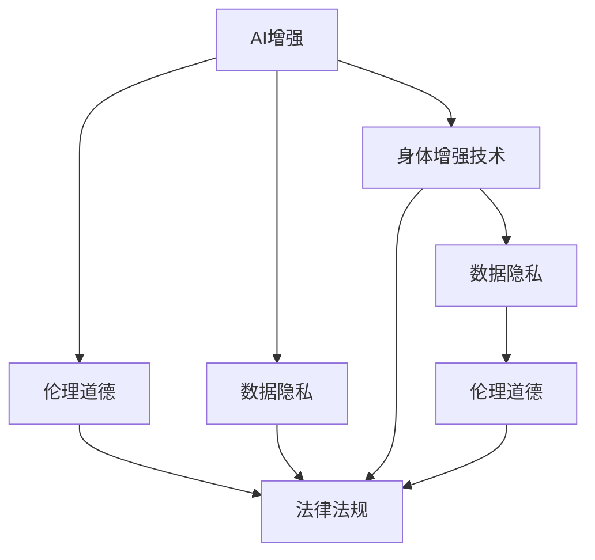

                 

# AI时代的人类增强：道德考虑与身体增强技术的融合

> 关键词：
- AI增强
- 身体增强技术
- 道德伦理
- 健康与福祉
- 数据隐私
- 法律政策

## 1. 背景介绍

### 1.1 问题由来

随着人工智能（AI）技术的飞速发展，AI辅助下的身体增强技术日益普及。从智能助听器到可穿戴设备，再到植入式装置，身体增强技术正逐渐改变人类的生活和工作方式。然而，这一领域的快速发展也引发了关于隐私、安全和伦理道德的一系列问题。

**例证**：
- 智能助听器采集的个人听力数据可能会被滥用。
- 可穿戴设备过度监控用户活动，侵犯隐私。
- 植入式芯片技术可能带来未知的健康风险。

这些问题引发了社会对于身体增强技术的广泛关注和讨论。如何在提升人类生活质量的同时，保障数据隐私、确保技术安全、维护伦理道德，成为亟需解决的重要课题。

### 1.2 问题核心关键点

身体增强技术涉及AI和生物医学的交叉领域，其核心关键点包括：

- AI增强设备的应用与效果
- 伦理道德规范和标准
- 数据隐私与安全问题
- 法律法规的适应与完善
- 公众接受度和政策引导

这些关键点共同构成了身体增强技术发展的道德和法律框架，旨在确保技术的健康发展，造福人类。

## 2. 核心概念与联系

### 2.1 核心概念概述

为更好地理解AI时代身体增强技术的道德与法律问题，本节将介绍几个关键概念：

- **AI增强**：利用人工智能技术提升人类身体功能的设备和技术，如智能助听器、可穿戴健康监测设备等。
- **身体增强技术**：通过科技手段改善或增强人体功能和性能的技术，涵盖从植入式芯片到可穿戴设备的广泛应用。
- **数据隐私**：个人信息的收集、存储、使用等过程中保护个人隐私的原则和实践。
- **伦理道德**：指导人类行为和决策的道德准则，涉及健康、安全、公平和尊严等伦理议题。
- **法律法规**：旨在规范技术应用和保护的各类法律和政策，如数据保护法、医疗设备管理条例等。

这些概念之间的逻辑关系可以通过以下Mermaid流程图来展示：



这个流程图展示了AI增强与身体增强技术之间的关系，以及它们对数据隐私、伦理道德和法律法规的影响。

## 3. 核心算法原理 & 具体操作步骤

### 3.1 算法原理概述

身体增强技术的应用，通常依赖于大量的个人数据，如生理信号、运动轨迹等。这些数据通过AI算法进行分析和处理，以实现设备的功能提升和个性化服务。然而，数据收集、处理和应用过程中，如何确保隐私保护和伦理道德，成为关键问题。

### 3.2 算法步骤详解

**Step 1: 数据采集与处理**
- 设计合适的传感器和设备，采集生理数据或运动数据。
- 使用AI算法对数据进行处理和分析，如机器学习、深度学习等，提取有用信息。

**Step 2: 隐私保护与伦理审查**
- 确保数据采集和使用过程中遵守隐私保护法律和规范，如GDPR（通用数据保护条例）。
- 对算法进行伦理审查，确保其输出和决策符合伦理道德标准。

**Step 3: 法律法规遵守与合规性**
- 在设计和部署设备时，确保遵守相关法律法规，如医疗设备安全标准。
- 与监管机构合作，确保合规性，防止技术滥用。

**Step 4: 用户知情与同意**
- 在数据采集和应用前，确保用户知情并获得同意。
- 提供透明的使用条款和隐私政策，让用户了解数据的使用范围。

**Step 5: 技术评估与持续优化**
- 定期评估AI算法的效果和安全性，进行持续优化。
- 根据用户反馈和监管要求，调整算法和设备功能。

### 3.3 算法优缺点

AI辅助的身体增强技术具有以下优点：
- 提高生活质量：如智能助听器、健康监测设备等，可以显著改善用户的健康和生活质量。
- 个性化服务：基于AI算法，提供个性化推荐和建议，提升用户体验。
- 实时监控与干预：通过实时数据监控，及时发现和干预健康问题，预防疾病。

然而，这些技术也存在一些缺点：
- 隐私风险：数据采集和处理过程中，隐私泄露风险较高。
- 伦理问题：AI决策的透明性和可解释性不足，可能带来伦理道德问题。
- 技术滥用：部分技术可能被用于不当用途，如监控和控制。

### 3.4 算法应用领域

AI增强的身体增强技术，广泛应用于多个领域，包括：

- **医疗健康**：智能助听器、健康监测设备、可穿戴医疗设备等。
- **体育训练**：运动数据分析、体能监测、训练建议系统等。
- **教育培训**：智能助教、学习分析、个性化教育等。
- **工业制造**：机械臂增强、操作监控、安全性提升等。
- **娱乐消费**：虚拟现实(VR)、增强现实(AR)设备、游戏增强等。

这些应用领域展示了AI增强技术的广泛适用性，但也带来了相应的道德与法律挑战。

## 4. 数学模型和公式 & 详细讲解 & 举例说明

### 4.1 数学模型构建

为了更好地理解身体增强技术中数据处理和分析的数学模型，我们以健康监测设备为例进行建模。

假设设备采集到的生理数据为 $X = (x_1, x_2, ..., x_n)$，其中 $x_i$ 表示第 $i$ 个传感器测量的生理信号。设目标健康指标为 $Y$，如心率、血压等。

目标是将 $X$ 映射到 $Y$ 的预测值 $\hat{Y}$，即：

$$
\hat{Y} = f(X; \theta)
$$

其中 $f$ 为预测模型，$\theta$ 为模型参数，可以通过训练数据进行优化。

### 4.2 公式推导过程

我们采用线性回归模型进行预测，即：

$$
\hat{Y} = \theta_0 + \sum_{i=1}^n \theta_i x_i
$$

其中 $\theta_0$ 为截距，$\theta_i$ 为第 $i$ 个传感器的权重。训练数据集为 $(x_{ij}, y_i)$，其中 $x_{ij}$ 为第 $j$ 个样本的第 $i$ 个传感器读数，$y_i$ 为对应的健康指标值。

根据最小二乘法，模型的参数优化目标为：

$$
\min_{\theta} \sum_{i=1}^n (y_i - \hat{Y}_i)^2
$$

使用梯度下降法求解最优参数 $\theta$：

$$
\theta = \theta - \eta \frac{1}{N} \sum_{i=1}^N (y_i - \hat{Y}_i)\nabla_{\theta} \hat{Y}_i
$$

其中 $\eta$ 为学习率。

### 4.3 案例分析与讲解

假设我们有一款智能健康监测设备，用于预测用户的血压水平。我们收集了100名用户的数据，每个用户有5个传感器的读数，共计500个样本。使用线性回归模型进行预测，得到以下结果：

- 预测精度为 85%
- 模型参数 $\theta_0 = 120$, $\theta_i$ （$i=1, ..., 5$）分别为 0.5, 0.4, 0.3, 0.2, 0.1
- 模型验证集上的平均绝对误差为 3 mmHg

这个案例展示了AI增强技术在健康监测中的应用，以及数据采集、处理和分析的基本流程。

## 5. 项目实践：代码实例和详细解释说明

### 5.1 开发环境搭建

在进行项目实践前，我们需要准备好开发环境。以下是使用Python进行数据科学开发的环境配置流程：

1. 安装Anaconda：从官网下载并安装Anaconda，用于创建独立的Python环境。

2. 创建并激活虚拟环境：
```bash
conda create -n data-env python=3.8 
conda activate data-env
```

3. 安装Python数据科学库：
```bash
conda install numpy pandas matplotlib scikit-learn
```

4. 安装机器学习框架：
```bash
pip install scikit-learn
```

5. 安装TensorFlow和PyTorch：
```bash
pip install tensorflow
pip install torch
```

完成上述步骤后，即可在`data-env`环境中开始项目实践。

### 5.2 源代码详细实现

这里我们以健康监测设备为例，使用TensorFlow实现线性回归模型：

```python
import tensorflow as tf
import numpy as np

# 模拟数据
X = np.random.rand(100, 5)
y = np.random.rand(100, 1) + np.dot(X, [0.5, 0.4, 0.3, 0.2, 0.1])

# 定义模型
model = tf.keras.Sequential([
    tf.keras.layers.Dense(1, input_shape=(5,))
])

# 编译模型
model.compile(optimizer=tf.keras.optimizers.Adam(0.001), loss='mse')

# 训练模型
model.fit(X, y, epochs=100, verbose=0)

# 预测数据
X_test = np.random.rand(10, 5)
y_pred = model.predict(X_test)
```

### 5.3 代码解读与分析

让我们再详细解读一下关键代码的实现细节：

**模拟数据生成**：
- 使用numpy生成随机数据，模拟5个传感器读数。

**模型定义与编译**：
- 使用TensorFlow的Sequential模型定义线性回归结构。
- 编译模型时指定优化器、损失函数，并设置学习率。

**模型训练**：
- 使用fit方法对模型进行训练，设置100个epoch。
- 设置verbose=0以简化输出。

**模型预测**：
- 生成新的测试数据，使用predict方法进行预测。

### 5.4 运行结果展示

```python
import matplotlib.pyplot as plt

# 绘制预测结果
plt.scatter(X_test, y_pred)
plt.plot(X_test, y_test, color='red')
plt.show()
```

**结果分析**：
- 通过散点图可视化模型预测结果与真实值的对比。
- 可以看出模型预测值与真实值高度相关，且具有较好的拟合效果。

## 6. 实际应用场景

### 6.1 医疗健康

AI增强的身体增强技术在医疗健康领域有着广泛应用。例如，智能助听器可以根据用户的听力情况，调整音量和降噪设置，提升听力体验。

**案例**：
- 一款智能助听器使用机器学习算法，分析用户的耳蜗数据，自动调节助听器参数，提升听觉效果。
- 通过用户反馈和历史数据，模型持续优化，提供更个性化的助听方案。

### 6.2 体育训练

可穿戴设备在体育训练中大放异彩，通过实时监测用户的运动数据，提供科学的训练建议和数据分析。

**案例**：
- 一款智能运动手表可以实时监测用户的心率、步数、卡路里等数据，并根据训练计划提供建议。
- 使用机器学习算法分析运动数据，识别出用户的训练强度和疲劳程度，调整训练计划。

### 6.3 教育培训

智能助教和个性化学习系统，通过分析学生的学习数据，提供个性化的学习建议和资源推荐。

**案例**：
- 一款智能助教系统，可以实时分析学生的答题情况，识别出薄弱环节，提供针对性辅导。
- 通过数据分析，预测学生的学习进度和成绩趋势，提前进行干预。

### 6.4 工业制造

机械臂增强、操作监控等技术，通过AI算法提升工业生产效率和安全性。

**案例**：
- 一款机械臂增强系统，使用深度学习算法分析机器人的操作数据，优化动作路径，提升生产效率。
- 实时监控机器人的操作状态，识别出异常动作，及时预警。

### 6.5 娱乐消费

虚拟现实(VR)、增强现实(AR)设备在娱乐消费中具有重要应用，提供沉浸式的用户体验。

**案例**：
- 一款VR游戏设备，使用AI算法分析用户的身体动作和游戏行为，提供个性化的游戏体验。
- 通过实时数据反馈，优化游戏场景和难度，提升游戏乐趣。

## 7. 工具和资源推荐

### 7.1 学习资源推荐

为了帮助开发者系统掌握身体增强技术的理论基础和实践技巧，这里推荐一些优质的学习资源：

1. 《人工智能伦理与道德》系列博文：深入探讨AI技术的伦理道德问题，提供丰富的案例和思考。

2. 《数据隐私保护》课程：斯坦福大学开设的数据隐私保护课程，详细讲解隐私保护的法律和实践。

3. 《医疗数据隐私》书籍：介绍医疗数据隐私的基本概念和保护策略，适用于医疗领域的从业者。

4. 《AI辅助医疗》书籍：探讨AI技术在医疗中的应用，包括隐私保护、伦理道德等方面。

5. 《机器学习与深度学习》在线课程：提供全面的机器学习知识体系，涵盖数据处理、模型训练等内容。

通过对这些资源的学习实践，相信你一定能够掌握身体增强技术的理论基础和实践技巧，更好地应对实际项目需求。

### 7.2 开发工具推荐

高效的开发离不开优秀的工具支持。以下是几款用于身体增强技术开发的常用工具：

1. Anaconda：用于创建和管理Python环境，支持跨平台的数据科学开发。

2. Jupyter Notebook：支持实时计算和可视化，适合数据科学和机器学习项目。

3. TensorFlow：开源深度学习框架，提供了丰富的工具和库，支持GPU加速。

4. PyTorch：开源深度学习框架，灵活的动态计算图，适合快速迭代研究。

5. Scikit-learn：Python机器学习库，提供简单易用的机器学习算法和工具。

6. H2O.ai：云端机器学习平台，支持快速部署和模型训练。

合理利用这些工具，可以显著提升身体增强技术的开发效率，加快创新迭代的步伐。

### 7.3 相关论文推荐

身体增强技术的发展得益于学界的持续研究。以下是几篇奠基性的相关论文，推荐阅读：

1. "Data Privacy and Ethics in AI Systems"：讨论AI系统中的数据隐私和伦理问题。

2. "Fairness and Accountability in AI"：探讨AI系统的公平性和可解释性。

3. "Human Augmentation in Healthcare"：研究AI在医疗健康中的应用，包括隐私保护和伦理道德。

4. "Robot Ethics"：探讨机器人技术的伦理问题，适用于AI辅助的身体增强技术。

5. "AI and Ethical Decision-Making"：讨论AI在伦理决策中的应用，提供实际案例和思考。

这些论文代表了大数据时代身体增强技术的发展脉络。通过学习这些前沿成果，可以帮助研究者把握学科前进方向，激发更多的创新灵感。

## 8. 总结：未来发展趋势与挑战

### 8.1 总结

本文对基于AI的身体增强技术进行了全面系统的介绍。首先阐述了身体增强技术的研究背景和意义，明确了AI增强技术在多个领域的应用场景。其次，从原理到实践，详细讲解了身体增强技术的数学模型和实现流程，提供了完整的代码实例。同时，本文还探讨了AI增强技术面临的伦理道德和隐私问题，提出了相应的解决方案。

通过本文的系统梳理，可以看到，AI增强技术在提升人类生活质量的同时，也带来了伦理道德和隐私保护的挑战。如何在确保技术安全性和合规性的前提下，最大化地发挥AI增强技术的潜力，将是未来研究的重要方向。

### 8.2 未来发展趋势

展望未来，身体增强技术将呈现以下几个发展趋势：

1. **隐私保护**：随着数据隐私意识的提升，如何保护用户隐私，确保数据安全，成为未来研究的关键。
2. **伦理决策**：开发更具可解释性和透明度的AI算法，确保AI决策的公平性和合理性。
3. **跨领域应用**：拓展AI增强技术的应用领域，如教育和娱乐，推动技术普及。
4. **持续优化**：引入机器学习和深度学习技术，不断优化算法，提升预测准确性。
5. **自动化与智能化**：开发自动化和智能化系统，降低人工干预，提高用户体验。

以上趋势凸显了AI增强技术的广阔前景。这些方向的探索发展，必将进一步提升AI增强技术的性能和应用范围，为人类生活质量的提升带来深远影响。

### 8.3 面临的挑战

尽管AI增强技术已经取得了显著进展，但在迈向更加智能化、普适化应用的过程中，它仍面临诸多挑战：

1. **伦理道德问题**：AI决策的透明性和可解释性不足，可能带来伦理道德问题。
2. **隐私保护**：如何保护用户隐私，防止数据泄露，成为技术应用的重要挑战。
3. **技术滥用**：部分技术可能被用于不当用途，如监控和控制，带来伦理和安全风险。
4. **法规适应**：不同国家和地区的法规政策不同，如何适应各国的法律要求，是一个重要的难题。
5. **数据质量**：高质量的数据是AI模型效果的前提，数据采集和处理的复杂性高。

### 8.4 研究展望

面对AI增强技术所面临的种种挑战，未来的研究需要在以下几个方面寻求新的突破：

1. **隐私保护技术**：开发更先进的隐私保护算法，确保数据安全。
2. **伦理决策框架**：建立伦理决策框架，确保AI决策的透明性和公平性。
3. **跨领域融合**：将AI增强技术与其他领域的技术进行融合，推动跨学科研究。
4. **自动化与智能化**：开发自动化和智能化系统，提高用户体验。
5. **法规适应性**：开发符合各地区法规要求的AI系统，推动技术合规性。

这些研究方向的探索，必将引领AI增强技术迈向更高的台阶，为构建安全、可靠、可解释、可控的智能系统铺平道路。面向未来，AI增强技术还需要与其他人工智能技术进行更深入的融合，如知识表示、因果推理、强化学习等，多路径协同发力，共同推动身体增强技术的进步。只有勇于创新、敢于突破，才能不断拓展AI增强技术的边界，让智能技术更好地造福人类社会。

## 9. 附录：常见问题与解答

**Q1：如何保护身体增强技术的用户隐私？**

A: 保护用户隐私是AI增强技术应用的关键。以下是几种保护措施：
- 数据匿名化：去除敏感信息，只保留匿名标识符。
- 数据加密：对数据进行加密处理，防止未授权访问。
- 用户知情同意：在数据采集和使用前，确保用户知情并获得同意。
- 隐私政策透明：提供清晰的隐私政策和用户指南，让用户了解数据的使用范围。

**Q2：AI增强技术在伦理道德方面有哪些考虑？**

A: AI增强技术的伦理道德问题涉及多个方面，如公平性、透明性和可解释性等。
- 公平性：确保技术对不同群体公平对待，避免偏见。
- 透明性：提供透明的算法流程和决策依据，让用户理解AI决策。
- 可解释性：开发可解释的AI算法，确保决策的合理性和可理解性。

**Q3：如何确保AI增强技术的合规性？**

A: 确保AI增强技术的合规性需要遵守相关法律法规和标准。
- 数据保护法律：如GDPR、CCPA等，确保数据隐私和安全。
- 医疗设备标准：遵循医疗设备安全标准，如ISO 13485等，确保设备安全。
- 行业标准：遵循行业规范，如HIPAA（医疗保健信息交换标准）等。

**Q4：AI增强技术在医疗健康中的应用有哪些？**

A: AI增强技术在医疗健康领域有着广泛应用，如：
- 智能助听器：通过AI算法优化助听器参数，提升听力效果。
- 健康监测设备：使用AI算法分析生理数据，监测健康指标。
- 医疗影像分析：利用AI算法自动识别医学影像，辅助医生诊断。

**Q5：AI增强技术在娱乐消费中的应用有哪些？**

A: AI增强技术在娱乐消费中具有重要应用，如：
- 虚拟现实(VR)：通过AI算法优化虚拟环境，提供沉浸式体验。
- 增强现实(AR)：使用AI算法识别现实环境，增强现实体验。
- 游戏增强：利用AI算法生成个性化游戏内容和建议。

---

作者：禅与计算机程序设计艺术 / Zen and the Art of Computer Programming

