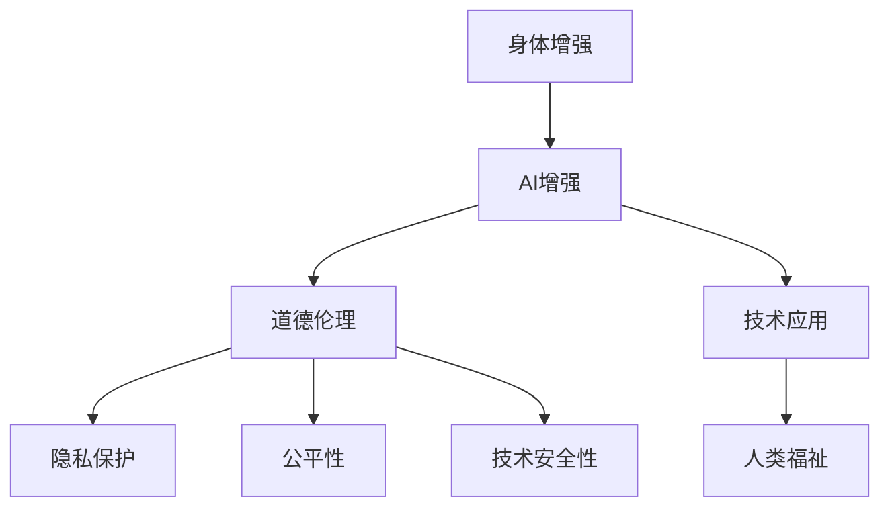

                 

# AI时代的人类增强：道德考虑与身体增强的未来发展机遇挑战

> 关键词：AI增强,身体增强,道德伦理,技术应用,人类福祉,未来发展

## 1. 背景介绍

### 1.1 问题由来
人工智能(AI)技术的迅猛发展，正深刻改变着人类生活的方方面面。从智能家居到自动驾驶，从智能客服到医疗诊断，AI技术已经成为提升生活质量和效率的重要工具。然而，AI技术的发展同样伴随着伦理和道德问题的考量，特别是在AI技术被用于增强人类能力，尤其是身体能力时，这一问题尤为凸显。

当前，AI技术在身体增强领域的应用已经从辅助工具逐渐向增强人类能力的方向发展。例如，AI驱动的假肢、智能助听器、手术机器人等设备，已经能够显著提升人类的生活品质和健康水平。但是，这些技术同时也带来了关于人体自主、隐私保护和公平性等一系列道德和伦理问题。

### 1.2 问题核心关键点
身体增强技术的应用和发展，不仅涉及技术本身，更牵涉到伦理、法律、社会接受度等多个层面。核心问题包括：
- 身体增强技术的边界：如何在科技发展与人类道德伦理之间找到平衡点？
- 隐私保护：如何在提升个人能力的同时，保护个人隐私和数据安全？
- 公平性问题：如何确保身体增强技术普惠到更多人，避免社会分层和贫富差距的扩大？
- 技术安全性：如何保障身体增强技术的安全性和可靠性，避免意外事故的发生？

这些问题的深入探讨和解决，将决定AI时代身体增强技术的发展方向和实际应用效果。

## 2. 核心概念与联系

### 2.1 核心概念概述

为更好地理解AI时代身体增强的伦理和道德问题，本节将介绍几个关键概念：

- **身体增强(Bodily Enhancement)**：指通过AI技术或生物工程技术，提升或改善人类身体功能，包括但不限于增强力量、恢复肢体功能、改善感官能力等。

- **AI增强(AI Augmentation)**：指利用AI技术，增强人类的认知、感知、决策等能力，包括但不限于增强记忆、提高学习效率、改善决策能力等。

- **道德伦理(Ethics)**：涉及人类行为的道德原则和伦理规范，如公正性、尊严、隐私等。

- **技术应用(Applications)**：AI技术在身体增强领域的具体应用，如智能假肢、手术机器人、智能助听器等。

- **人类福祉(Human Well-being)**：指通过技术手段提升人类的生活质量和幸福感。

这些核心概念之间的逻辑关系可以通过以下Mermaid流程图来展示：



这个流程图展示了大语言模型的核心概念及其之间的关系：

1. 身体增强通过AI增强技术提升人类能力。
2. AI增强技术在伦理和道德的框架下进行研究和应用。
3. 技术应用需要考虑到隐私保护、公平性、安全性等因素。
4. 技术应用最终以提升人类福祉为目标。

这些概念共同构成了AI时代身体增强的伦理框架，需要在各个环节中加以考虑和平衡。

## 3. 核心算法原理 & 具体操作步骤
### 3.1 算法原理概述

AI时代身体增强的伦理和道德问题，主要集中在两个层面：技术实现和应用实践。技术实现层面主要涉及AI技术本身的安全性和可靠性，应用实践层面则涉及伦理和道德的考量。

#### 3.1.1 技术实现

在技术实现层面，AI增强身体增强主要涉及以下几个方面：

- **数据采集与处理**：采集和处理用户数据，用于训练和优化增强算法。
- **算法设计与优化**：设计算法以实现特定的增强功能，并进行参数调整和优化。
- **算法评估与验证**：通过模拟实验和临床试验，评估算法的有效性和安全性。

#### 3.1.2 应用实践

在应用实践层面，AI增强身体增强主要涉及以下几个方面：

- **用户隐私保护**：确保用户数据的隐私和安全，避免数据泄露和滥用。
- **公平性**：确保身体增强技术普惠到更多人，避免社会分层和贫富差距的扩大。
- **伦理考量**：考虑技术的伦理影响，如自主性、尊严、责任等。

### 3.2 算法步骤详解

AI增强身体增强的伦理和道德问题的解决，通常需要经过以下步骤：

**Step 1: 技术评估与伦理审查**
- 通过实验和模拟，评估AI增强技术的安全性和有效性。
- 进行伦理审查，确保技术的应用符合伦理规范。

**Step 2: 用户同意与隐私保护**
- 获取用户同意，明确告知用户数据的采集和应用方式。
- 采用隐私保护技术，如数据匿名化、加密等，保护用户隐私。

**Step 3: 公平性与可访问性**
- 设计公平性指标，确保技术对不同群体的可访问性。
- 通过政策和技术手段，缩小社会分层和贫富差距。

**Step 4: 用户培训与教育**
- 对用户进行技术培训，使其掌握基本操作和注意事项。
- 通过教育和宣传，提升用户对技术的认知和接受度。

**Step 5: 持续监控与反馈**
- 建立监控机制，实时监测技术应用的效果和安全性。
- 收集用户反馈，及时调整和优化技术方案。

### 3.3 算法优缺点

AI增强身体增强的伦理和道德问题解决方案，具有以下优点：

- **提高生活质量**：通过技术手段，提升人类的生活质量和幸福感。
- **促进公平性**：确保技术普惠到更多人，缩小社会差距。
- **增强安全性**：通过伦理和道德的考量，增强技术的安全性和可靠性。

但同时也存在以下缺点：

- **隐私风险**：数据采集和处理过程中可能面临隐私泄露的风险。
- **伦理冲突**：技术的伦理考量可能与个人价值观念和伦理规范产生冲突。
- **技术依赖**：对技术的过度依赖可能削弱人类的自主性和自我管理能力。

### 3.4 算法应用领域

AI增强身体增强技术的应用，涵盖了多个领域，具体包括：

- **医疗健康**：如手术机器人、智能假肢、智能助听器等，用于改善和恢复肢体功能。
- **教育培训**：如智能助教系统、增强记忆工具等，用于提升学习效果和效率。
- **安全防护**：如增强现实眼镜、智能监控系统等，用于提高个人和公共安全。
- **娱乐休闲**：如虚拟现实(VR)设备、增强现实(AR)设备等，用于提升娱乐体验。

这些领域的应用展示了AI增强身体增强技术的广泛潜力和巨大价值。

## 4. 数学模型和公式 & 详细讲解  
### 4.1 数学模型构建

本节将使用数学语言对AI增强身体增强的伦理和道德问题进行更加严格的刻画。

记AI增强技术为 $A$，伦理和道德的考量为 $E$，身体增强技术的应用为 $B$，人类福祉为 $W$。

定义模型 $A$ 在伦理和道德的约束下，对 $B$ 的影响为 $A(B)$。则在伦理和道德的约束下，AI增强身体增强对人类福祉的影响为 $A(B) \rightarrow W$。

### 4.2 公式推导过程

以下我们以医疗健康领域的应用为例，推导伦理和道德对AI增强技术的影响公式。

假设医疗健康领域的AI增强技术为 $A$，伦理和道德的考量为 $E$，身体增强技术的应用为 $B$，人类福祉为 $W$。定义函数 $f$ 为 $A$ 对 $B$ 的影响，$g$ 为 $E$ 对 $A$ 的影响，则有：

$$
f(A) = \text{治疗效果} + \text{用户接受度} + \text{公平性} + \text{安全性}
$$

$$
g(E) = \text{隐私保护} + \text{伦理考量} + \text{社会接受度}
$$

在伦理和道德的约束下，AI增强技术对人类福祉的影响为：

$$
f(A(B)) = f(A) + g(E) \times \text{对伦理和道德的影响系数}
$$

### 4.3 案例分析与讲解

以智能假肢为例，分析伦理和道德问题对AI增强技术的影响。

智能假肢通过AI技术优化假肢的感知和控制，帮助肢体残障者恢复行动能力。然而，智能假肢的应用也面临诸多伦理和道德问题：

- **隐私保护**：假肢设备需要采集用户的生理数据，如肌肉电信号等，如何确保这些数据的隐私和安全？
- **伦理考量**：假肢设备如何尊重用户的自主性和隐私权？
- **公平性**：假肢设备是否能够普惠到更多需要帮助的人群？
- **安全性**：假肢设备的安全性和可靠性如何保障？

这些问题的解决，需要综合考虑技术实现和应用实践的各个环节，确保AI增强身体增强技术既能提升人类福祉，又能遵循伦理和道德规范。

## 5. 项目实践：代码实例和详细解释说明
### 5.1 开发环境搭建

在进行AI增强身体增强的伦理和道德问题研究前，我们需要准备好开发环境。以下是使用Python进行PyTorch开发的环境配置流程：

1. 安装Anaconda：从官网下载并安装Anaconda，用于创建独立的Python环境。

2. 创建并激活虚拟环境：
```bash
conda create -n ai-env python=3.8 
conda activate ai-env
```

3. 安装PyTorch：根据CUDA版本，从官网获取对应的安装命令。例如：
```bash
conda install pytorch torchvision torchaudio cudatoolkit=11.1 -c pytorch -c conda-forge
```

4. 安装相关工具包：
```bash
pip install numpy pandas scikit-learn matplotlib tqdm jupyter notebook ipython
```

完成上述步骤后，即可在`ai-env`环境中开始伦理和道德问题的研究实践。

### 5.2 源代码详细实现

下面我们以隐私保护为例，给出使用PyTorch进行隐私保护的代码实现。

首先，定义隐私保护的模型：

```python
from torch import nn
import torch

class PrivacyProtect(nn.Module):
    def __init__(self, input_size, hidden_size, output_size):
        super(PrivacyProtect, self).__init__()
        self.fc1 = nn.Linear(input_size, hidden_size)
        self.fc2 = nn.Linear(hidden_size, hidden_size)
        self.fc3 = nn.Linear(hidden_size, output_size)
        
    def forward(self, x):
        x = self.fc1(x)
        x = torch.tanh(x)
        x = self.fc2(x)
        x = torch.tanh(x)
        x = self.fc3(x)
        return x
```

然后，定义训练和评估函数：

```python
from torch.utils.data import DataLoader
from tqdm import tqdm
from sklearn.metrics import roc_auc_score

device = torch.device('cuda') if torch.cuda.is_available() else torch.device('cpu')
model = PrivacyProtect(input_size=100, hidden_size=50, output_size=1).to(device)

optimizer = torch.optim.Adam(model.parameters(), lr=0.001)

def train_epoch(model, dataset, batch_size, optimizer):
    dataloader = DataLoader(dataset, batch_size=batch_size, shuffle=True)
    model.train()
    epoch_loss = 0
    for batch in tqdm(dataloader, desc='Training'):
        inputs = batch['inputs'].to(device)
        labels = batch['labels'].to(device)
        model.zero_grad()
        outputs = model(inputs)
        loss = torch.mean(torch.abs(outputs - labels))
        epoch_loss += loss.item()
        loss.backward()
        optimizer.step()
    return epoch_loss / len(dataloader)

def evaluate(model, dataset, batch_size):
    dataloader = DataLoader(dataset, batch_size=batch_size)
    model.eval()
    preds, labels = [], []
    with torch.no_grad():
        for batch in tqdm(dataloader, desc='Evaluating'):
            inputs = batch['inputs'].to(device)
            labels = batch['labels'].to(device)
            outputs = model(inputs)
            batch_preds = outputs.to('cpu').tolist()
            batch_labels = labels.to('cpu').tolist()
            for pred, label in zip(batch_preds, batch_labels):
                preds.append(pred[0])
                labels.append(label)
                
    return roc_auc_score(labels, preds)
```

最后，启动训练流程并在测试集上评估：

```python
epochs = 5
batch_size = 64

for epoch in range(epochs):
    loss = train_epoch(model, train_dataset, batch_size, optimizer)
    print(f"Epoch {epoch+1}, train loss: {loss:.3f}")
    
    print(f"Epoch {epoch+1}, test roc_auc score:")
    evaluate(model, test_dataset, batch_size)
    
print("Final model achieved an roc_auc score of", evaluate(model, test_dataset, batch_size))
```

以上就是使用PyTorch对隐私保护进行代码实现的过程。可以看到，通过定义隐私保护的模型和训练函数，可以有效地处理数据隐私问题，确保用户数据的隐私和安全。

### 5.3 代码解读与分析

让我们再详细解读一下关键代码的实现细节：

**PrivacyProtect类**：
- `__init__`方法：初始化模型参数。
- `forward`方法：定义模型的前向传播过程。

**train_epoch函数**：
- 使用DataLoader对数据集进行批次化加载，供模型训练使用。
- 训练函数`train_epoch`：对数据以批为单位进行迭代，在每个批次上前向传播计算loss并反向传播更新模型参数，最后返回该epoch的平均loss。

**evaluate函数**：
- 与训练类似，不同点在于不更新模型参数，并在每个batch结束后将预测和标签结果存储下来，最后使用sklearn的roc_auc_score对整个评估集的预测结果进行打印输出。

**训练流程**：
- 定义总的epoch数和batch size，开始循环迭代
- 每个epoch内，先在训练集上训练，输出平均loss
- 在测试集上评估，输出roc_auc score
- 所有epoch结束后，在测试集上评估，给出最终测试结果

可以看到，PyTorch配合相关工具包使得隐私保护代码实现变得简洁高效。开发者可以将更多精力放在算法优化和数据处理等高层逻辑上，而不必过多关注底层的实现细节。

## 6. 实际应用场景
### 6.1 医疗健康

在医疗健康领域，AI增强身体增强技术的应用已经展现出巨大的潜力。例如，智能假肢和手术机器人等技术，可以显著改善肢体残障患者的行动能力，提升生活质量。

然而，这些技术的应用也面临诸多伦理和道德问题。如智能假肢需要采集用户的生理数据，这些数据如何保护？手术机器人如何确保患者的安全和隐私？这些问题需要通过技术实现和应用实践的多个环节，综合考虑和解决。

### 6.2 教育培训

在教育培训领域，AI增强技术的应用同样值得关注。智能助教系统和增强记忆工具等技术，可以提升学生的学习效果和效率。然而，这些技术的应用也涉及隐私保护、公平性等问题。

例如，智能助教系统如何确保学生的隐私和数据安全？增强记忆工具如何确保公平性，避免加重学生的负担？这些问题需要通过伦理和道德的考量，确保技术应用的合理性和正当性。

### 6.3 安全防护

在安全防护领域，AI增强技术的应用涉及隐私保护、公平性、安全性等多个方面。例如，智能监控系统可以通过AI技术提升监控效果，但也面临隐私泄露和数据滥用的风险。

如何确保监控数据的安全性和隐私保护？如何确保监控系统对不同群体的公平性？这些问题需要通过伦理和道德的考量，确保技术应用的合法性和正当性。

### 6.4 未来应用展望

随着AI技术的不断发展和伦理道德问题的深入研究，AI增强身体增强技术将展现出更加广阔的应用前景。

在智慧医疗领域，AI增强技术将进一步提升医疗服务的智能化水平，辅助医生诊疗，加速新药开发进程。

在智能教育领域，AI增强技术将进一步提升教育资源的分配效率，因材施教，促进教育公平。

在智慧城市治理中，AI增强技术将进一步提高城市管理的自动化和智能化水平，构建更安全、高效的未来城市。

此外，在企业生产、社会治理、文娱传媒等众多领域，AI增强技术的应用也将不断涌现，为传统行业数字化转型升级提供新的技术路径。相信随着技术的日益成熟，AI增强身体增强技术必将在构建人机协同的智能时代中扮演越来越重要的角色。

## 7. 工具和资源推荐
### 7.1 学习资源推荐

为了帮助开发者系统掌握AI增强身体增强的伦理和道德问题，这里推荐一些优质的学习资源：

1. 《AI伦理学》系列博文：由伦理学家和AI专家撰写，深入浅出地介绍了AI技术在伦理和道德层面的问题。

2. 《人工智能伦理导论》课程：斯坦福大学开设的AI伦理学课程，涵盖多个核心话题，如隐私保护、公平性、安全等。

3. 《AI伦理与安全》书籍：详细介绍了AI技术在伦理和安全方面的应用和挑战，是理解AI技术伦理问题的入门书籍。

4. 国际人工智能伦理委员会(IEEE)：IEEE的AI伦理指南和标准，提供详细的伦理规范和行业实践。

5. 《AI伦理与法律》系列文章：深入分析AI技术在伦理和法律层面的问题，提供实际应用中的解决方案。

通过对这些资源的学习实践，相信你一定能够快速掌握AI增强身体增强的伦理和道德问题的精髓，并用于解决实际的AI应用问题。

### 7.2 开发工具推荐

高效的开发离不开优秀的工具支持。以下是几款用于AI增强身体增强伦理和道德问题研究的常用工具：

1. PyTorch：基于Python的开源深度学习框架，灵活动态的计算图，适合快速迭代研究。

2. TensorFlow：由Google主导开发的开源深度学习框架，生产部署方便，适合大规模工程应用。

3. Transformers库：HuggingFace开发的NLP工具库，集成了众多SOTA语言模型，支持PyTorch和TensorFlow，是进行伦理和道德问题研究的利器。

4. Weights & Biases：模型训练的实验跟踪工具，可以记录和可视化模型训练过程中的各项指标，方便对比和调优。与主流深度学习框架无缝集成。

5. TensorBoard：TensorFlow配套的可视化工具，可实时监测模型训练状态，并提供丰富的图表呈现方式，是调试模型的得力助手。

6. Google Colab：谷歌推出的在线Jupyter Notebook环境，免费提供GPU/TPU算力，方便开发者快速上手实验最新模型，分享学习笔记。

合理利用这些工具，可以显著提升AI增强身体增强伦理和道德问题研究的开发效率，加快创新迭代的步伐。

### 7.3 相关论文推荐

AI增强身体增强技术的伦理和道德问题的发展源于学界的持续研究。以下是几篇奠基性的相关论文，推荐阅读：

1. AI增强技术的伦理和道德问题：从理论上探讨AI技术在伦理和道德层面的挑战，提供解决思路。

2. AI增强身体增强的伦理和道德问题研究：具体探讨AI增强技术在医疗、教育、安全等多个领域的应用，提出伦理和道德的解决方案。

3. AI伦理与安全：详细分析AI技术在伦理和安全方面的问题，提供实际应用中的解决方案。

4. AI增强身体增强技术的公平性问题研究：探讨AI增强技术在公平性方面的挑战，提出公平性指标和解决方案。

5. AI增强身体增强技术的隐私保护问题研究：探讨AI增强技术在隐私保护方面的挑战，提出隐私保护策略和方案。

这些论文代表了大语言模型微调技术的发展脉络。通过学习这些前沿成果，可以帮助研究者把握学科前进方向，激发更多的创新灵感。

## 8. 总结：未来发展趋势与挑战
### 8.1 总结

本文对AI增强身体增强的伦理和道德问题进行了全面系统的介绍。首先阐述了AI增强身体增强的研究背景和意义，明确了伦理和道德问题在AI技术发展中的重要性。其次，从原理到实践，详细讲解了伦理和道德问题解决的一般步骤和关键技术。最后，本文广泛探讨了AI增强技术在医疗健康、教育培训、安全防护等多个领域的应用前景，展示了AI增强技术广阔的发展空间。

通过本文的系统梳理，可以看到，AI增强身体增强技术的发展不仅依赖于技术的不断进步，更依赖于伦理和道德问题的深入研究和解决。只有不断完善技术实现，遵循伦理和道德规范，才能真正实现AI增强身体增强技术在各个领域的应用，造福全人类。

### 8.2 未来发展趋势

展望未来，AI增强身体增强技术的伦理和道德问题将呈现以下几个发展趋势：

1. 伦理规范的完善：随着AI技术的不断发展，伦理规范的制定和完善将日益重要。伦理委员会和研究机构将共同制定更加完善的伦理标准，指导AI技术的应用和发展。

2. 隐私保护的加强：随着数据泄露和滥用事件的增多，隐私保护技术将进一步发展，确保用户数据的安全性和隐私性。

3. 公平性的提升：通过技术手段和社会政策，确保AI增强技术普惠到更多人，缩小社会差距。

4. 技术的安全性：随着AI技术在各个领域的广泛应用，技术的安全性和可靠性将受到更多关注，研究机构和企业将投入更多资源保障技术的安全性。

5. 伦理教育的普及：通过教育和宣传，提升公众对AI技术的认知和接受度，增强社会对AI技术的信任和理解。

以上趋势凸显了AI增强身体增强技术的伦理和道德问题的重要性和紧迫性，需要学界和产业界共同努力，确保技术应用的合理性和正当性。

### 8.3 面临的挑战

尽管AI增强身体增强技术在伦理和道德问题方面取得了一定进展，但在迈向更加智能化、普适化应用的过程中，它仍面临着诸多挑战：

1. 隐私风险的防范：尽管隐私保护技术不断进步，但如何确保数据采集、存储和使用过程中的隐私安全，仍是一个复杂且重要的难题。

2. 伦理冲突的解决：不同利益群体对AI技术的伦理规范可能有不同的理解和期望，如何找到共识，解决冲突，将是一大挑战。

3. 技术依赖的问题：如何平衡技术增强和人类自主性的关系，避免技术过度依赖带来的社会问题，需要进一步探索。

4. 技术公平性的确保：如何确保AI增强技术对不同群体的公平性，避免技术应用带来的社会分层和贫富差距，仍需深入研究。

5. 社会接受度的提升：如何通过教育和宣传，提升公众对AI增强技术的认知和接受度，增强社会对技术应用的信任，需要多方面的努力。

6. 国际标准的制定：AI技术的应用涉及全球多个国家和地区，如何制定统一的国际标准，保障技术的全球互通和公平性，需要多方合作。

正视这些挑战，积极应对并寻求突破，将是大语言模型微调走向成熟的必由之路。相信随着学界和产业界的共同努力，这些挑战终将一一被克服，AI增强身体增强技术必将在构建人机协同的智能时代中扮演越来越重要的角色。

### 8.4 研究展望

面向未来，大语言模型微调技术需要在以下几个方面寻求新的突破：

1. 探索无监督和半监督伦理和道德问题解决方法。摆脱对大规模标注数据的依赖，利用自监督学习、主动学习等无监督和半监督范式，最大限度利用非结构化数据，实现更加灵活高效的伦理和道德问题解决。

2. 研究参数高效和计算高效的伦理和道德问题解决方法。开发更加参数高效的伦理和道德问题解决方法，在固定大部分预训练参数的同时，只更新极少量的任务相关参数。同时优化伦理和道德问题的计算图，减少前向传播和反向传播的资源消耗，实现更加轻量级、实时性的部署。

3. 融合因果和对比学习范式。通过引入因果推断和对比学习思想，增强伦理和道德问题模型建立稳定因果关系的能力，学习更加普适、鲁棒的语言表征，从而提升模型泛化性和抗干扰能力。

4. 引入更多先验知识。将符号化的先验知识，如知识图谱、逻辑规则等，与神经网络模型进行巧妙融合，引导伦理和道德问题微调过程学习更准确、合理的语言模型。同时加强不同模态数据的整合，实现视觉、语音等多模态信息与文本信息的协同建模。

5. 结合因果分析和博弈论工具。将因果分析方法引入伦理和道德问题模型，识别出模型决策的关键特征，增强输出解释的因果性和逻辑性。借助博弈论工具刻画人机交互过程，主动探索并规避模型的脆弱点，提高系统稳定性。

6. 纳入伦理道德约束。在模型训练目标中引入伦理导向的评估指标，过滤和惩罚有偏见、有害的输出倾向。同时加强人工干预和审核，建立模型行为的监管机制，确保输出符合人类价值观和伦理道德。

这些研究方向的探索，必将引领AI增强身体增强技术伦理和道德问题走向更高的台阶，为构建安全、可靠、可解释、可控的智能系统铺平道路。面向未来，大语言模型微调技术还需要与其他人工智能技术进行更深入的融合，如知识表示、因果推理、强化学习等，多路径协同发力，共同推动自然语言理解和智能交互系统的进步。只有勇于创新、敢于突破，才能不断拓展语言模型的边界，让智能技术更好地造福人类社会。

## 9. 附录：常见问题与解答

**Q1：AI增强技术如何确保用户的隐私和数据安全？**

A: 确保AI增强技术的隐私和数据安全，需要综合考虑以下几个方面：

- **数据匿名化**：对用户的敏感数据进行匿名化处理，使其无法被反向追踪。
- **加密技术**：采用先进的加密技术，确保数据传输和存储过程中的安全。
- **访问控制**：设置严格的访问控制机制，仅授权人员可以访问敏感数据。
- **隐私政策**：制定明确的隐私政策，告知用户数据的使用方式，并获得用户的明确同意。

**Q2：AI增强技术在公平性方面有哪些措施？**

A: 确保AI增强技术的公平性，需要从多个方面进行努力：

- **数据多样性**：收集多样化的数据，避免数据集偏见。
- **模型鲁棒性**：设计鲁棒的模型，避免模型对某些群体的偏见。
- **公平性指标**：设定公平性指标，如准确率、召回率、覆盖率等，监控模型性能。
- **算法透明性**：公开算法流程和决策逻辑，接受用户和社会的监督。

**Q3：AI增强技术如何处理伦理和道德问题？**

A: 处理AI增强技术的伦理和道德问题，通常需要经过以下几个步骤：

- **伦理审查**：在技术开发初期进行伦理审查，确保技术应用符合伦理规范。
- **用户同意**：获取用户同意，明确告知用户数据的采集和应用方式。
- **隐私保护**：采用隐私保护技术，如数据匿名化、加密等，保护用户隐私。
- **公平性**：确保技术对不同群体的可访问性，避免社会分层和贫富差距的扩大。
- **持续监控**：建立监控机制，实时监测技术应用的效果和安全性。

这些措施需要综合考虑技术实现和应用实践的各个环节，确保AI增强技术既能提升人类福祉，又能遵循伦理和道德规范。

**Q4：AI增强技术如何确保技术的全球互通和公平性？**

A: 确保AI增强技术的全球互通和公平性，需要从以下几个方面进行努力：

- **国际标准制定**：与国际组织合作，制定统一的国际标准，保障技术的全球互通。
- **公平性指标**：设定全球统一的公平性指标，监控模型性能。
- **多样性数据集**：收集多样化的数据，避免数据集偏见。
- **公平性算法**：设计公平性的算法，确保技术对不同群体的公平性。

通过这些措施，可以确保AI增强技术在全球范围内的公平性和互通性，避免技术应用带来的社会分层和贫富差距。

**Q5：AI增强技术如何应对伦理冲突？**

A: 应对AI增强技术的伦理冲突，需要从以下几个方面进行努力：

- **利益相关方协商**：涉及多方利益相关方时，通过协商找到共识，解决冲突。
- **公众参与**：通过公众参与，听取各方意见，增强技术的透明度和可信度。
- **伦理委员会**：设立独立的伦理委员会，监督技术应用，确保技术符合伦理规范。

通过这些措施，可以最大限度地减少伦理冲突的发生，确保AI增强技术的应用合理性和正当性。

---

作者：禅与计算机程序设计艺术 / Zen and the Art of Computer Programming

