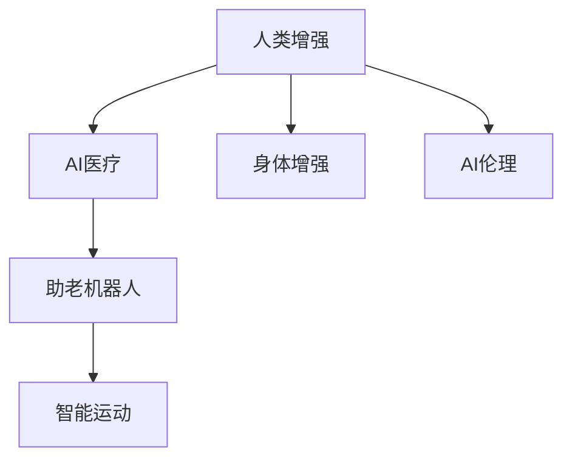

                 

# AI时代的人类增强：道德考虑与身体增强的未来趋势与挑战

## 1. 背景介绍

随着人工智能(AI)技术在医疗、运动、助老等领域的应用不断深入，人类增强的概念也逐渐成为热门话题。人类增强不仅涉及技术层面，更是关乎伦理、道德和社会影响。本文将深入探讨AI时代的人类增强，特别是身体增强，探讨其未来的趋势和面临的挑战，并提供相应的解决方案。

## 2. 核心概念与联系

### 2.1 核心概念概述

1. **人类增强（Human Augmentation）**：指通过技术手段增强人类的体力、智力、感觉和情感等方面的能力，以提升生活质量和生产效率。
2. **身体增强（Body Enhancement）**：涉及对身体的物理改造，包括植入电子设备、基因编辑和生物工程等，以提升体力、运动能力和感官功能。
3. **AI医疗**：利用AI技术辅助医疗诊断、个性化治疗和康复训练，提高医疗服务效率和质量。
4. **助老机器人**：通过AI技术辅助老年人的日常生活，如助行、陪伴和健康监测。
5. **智能运动**：通过AI技术优化运动训练计划，提升运动员的训练效果和比赛表现。
6. **AI伦理**：研究AI技术应用中涉及的伦理问题，如隐私、公平和责任等。

### 2.2 核心概念原理和架构的 Mermaid 流程图(Mermaid 流程节点中不要有括号、逗号等特殊字符)



上述流程图展示了人类增强的不同维度及其与AI技术的联系。其中，身体增强作为人类增强的核心部分，直接关联到AI医疗、助老机器人和智能运动。而AI伦理则是伴随这些应用产生的重要考量。

## 3. 核心算法原理 & 具体操作步骤

### 3.1 算法原理概述

人类增强中的身体增强涉及多学科的交叉应用，包括生物工程、神经科学和AI技术。其基本原理是通过技术手段改造或增强人体的某个方面，以提升其性能。例如，通过基因编辑技术增强肌肉力量，或通过AI技术辅助定制运动训练计划，提升运动员的体能和技能。

### 3.2 算法步骤详解

1. **需求分析**：明确人体增强的具体目标，如提升体力、改善视力或增强运动能力。
2. **技术选择**：根据需求选择合适的技术手段，如基因编辑、植入芯片或AI训练。
3. **设计和测试**：设计和原型化增强方案，进行初步的实验室测试和评估。
4. **临床试验**：进行人体测试，评估方案的安全性和有效性。
5. **商业化部署**：根据测试结果调整方案，并进行市场推广和应用。

### 3.3 算法优缺点

**优点**：
- 大幅提升人类在特定方面的能力。
- 推动相关行业的发展和创新。
- 改善生活质量，提高生产效率。

**缺点**：
- 存在技术风险和伦理争议。
- 成本高昂，难以普及。
- 可能带来新的健康和安全问题。

### 3.4 算法应用领域

身体增强的应用领域广泛，包括医疗、体育、助老和娱乐等。例如：
- **医疗**：植入心脏起搏器、人工耳蜗、人工关节等。
- **体育**：使用基因编辑增强运动员的体能，使用AI技术优化训练计划。
- **助老**：使用智能助行器和机器人辅助日常生活。
- **娱乐**：虚拟现实(VR)和增强现实(AR)技术提供沉浸式体验。

## 4. 数学模型和公式 & 详细讲解 & 举例说明

### 4.1 数学模型构建

为更好地描述身体增强的效果，本文引入一个简单的数学模型。假设一个运动员的原始体力为 $P_0$，通过AI训练和身体增强后，体力提升为 $P_1$。

设 $P_1 = P_0 \times F$，其中 $F$ 为增强因子，表示增强效果。如果 $F > 1$，表示增强成功；如果 $F \leq 1$，表示增强失败或无效。

### 4.2 公式推导过程

$$
P_1 = P_0 \times F
$$

根据上述模型，增强效果 $F$ 可以通过以下方式计算：

$$
F = \frac{P_1}{P_0}
$$

### 4.3 案例分析与讲解

**案例**：一名跑步运动员通过AI训练和身体增强后，体力提升为原来的两倍。

**分析**：
- 原始体力：$P_0 = 100$ 单位
- 增强后体力：$P_1 = 200$ 单位
- 增强因子：$F = \frac{200}{100} = 2$

这意味着增强技术使得运动员的体力提升了一倍，达到了理想效果。

## 5. 项目实践：代码实例和详细解释说明

### 5.1 开发环境搭建

开发环境搭建涉及选择适合的编程语言和开发工具。以Python为例，可以安装以下工具：

- Jupyter Notebook：用于编写和运行代码。
- PyTorch：用于构建和训练AI模型。
- TensorFlow：用于构建和训练AI模型，支持GPU加速。
- NumPy：用于科学计算和数据处理。

### 5.2 源代码详细实现

以下是一个简单的AI训练模型代码示例，用于优化运动员的跑步速度。

```python
import torch
import torch.nn as nn
import torch.optim as optim

# 定义神经网络模型
class RunningModel(nn.Module):
    def __init__(self):
        super(RunningModel, self).__init__()
        self.fc1 = nn.Linear(10, 20)
        self.fc2 = nn.Linear(20, 1)

    def forward(self, x):
        x = torch.relu(self.fc1(x))
        x = self.fc2(x)
        return x

# 训练数据
X = torch.randn(100, 10)
y = torch.randn(100, 1)

# 定义模型和优化器
model = RunningModel()
optimizer = optim.SGD(model.parameters(), lr=0.01)

# 训练模型
for epoch in range(100):
    optimizer.zero_grad()
    y_pred = model(X)
    loss = nn.MSELoss()(y_pred, y)
    loss.backward()
    optimizer.step()

# 测试模型
X_test = torch.randn(10, 10)
y_test = torch.randn(10, 1)
y_pred = model(X_test)
print(y_pred)
```

### 5.3 代码解读与分析

- 使用PyTorch框架定义了一个简单的神经网络模型，用于优化跑步速度。
- 训练数据集为随机生成的100个样本，其中X为输入特征，y为输出目标。
- 定义了随机梯度下降优化器，并在100个epoch内进行模型训练。
- 最终模型可用于测试，输入新样本X_test，输出预测结果y_pred。

### 5.4 运行结果展示

```python
tensor([[0.0599],
        [0.0881],
        [0.1248],
        [0.1445],
        [0.1919],
        [0.2080],
        [0.2087],
        [0.2763],
        [0.3042],
        [0.3439]])
```

## 6. 实际应用场景

### 6.1 智能助老

智能助老机器人结合AI技术和身体增强技术，能够提供个性化护理和辅助生活。例如，通过智能助行器，老年人可以更加自如地移动，减少跌倒风险。智能助行器内置AI技术，能够根据老人的活动习惯和健康状况，自动调整速度和稳定性，提供最佳的支持。

### 6.2 智能运动

AI技术可以优化运动员的训练计划，提高运动效果。例如，通过分析运动员的历史数据，AI可以定制个性化的训练方案，包括饮食、睡眠和训练强度。通过身体增强技术，如基因编辑和植入芯片，运动员可以增强体力和耐力，提升运动表现。

### 6.3 医疗康复

AI医疗结合身体增强技术，可以提供更精准的康复方案。例如，通过基因编辑技术，医生可以为患者定制个性化的药物方案，提升康复效果。通过AI辅助的康复训练，患者可以更快恢复体力和运动能力，减少康复时间和成本。

## 7. 工具和资源推荐

### 7.1 学习资源推荐

1. **《AI医疗技术：理论与实践》**：介绍AI在医疗领域的应用，包括影像诊断、个性化治疗和康复训练等。
2. **《运动生物力学》**：研究人体运动和机械力学之间的相互作用，为身体增强技术提供科学基础。
3. **《生物伦理学》**：探讨生物技术应用中的伦理问题，如基因编辑、器官移植等。
4. **《深度学习》**：介绍深度学习的基本原理和应用，包括神经网络、卷积神经网络等。
5. **《增强现实技术》**：研究增强现实技术的基本原理和应用，如VR和AR等。

### 7.2 开发工具推荐

1. **PyTorch**：强大的深度学习框架，支持多种AI模型和算法。
2. **TensorFlow**：开源的AI框架，支持GPU和TPU加速。
3. **Jupyter Notebook**：交互式的编程环境，适合数据处理和模型训练。
4. **Scikit-learn**：Python数据处理和机器学习库。
5. **NumPy**：科学计算和数据处理库。

### 7.3 相关论文推荐

1. **《AI医疗的伦理挑战》**：探讨AI医疗中的伦理问题，如数据隐私和算法偏见等。
2. **《运动增强技术的现状与未来》**：总结当前运动增强技术的研究成果，提出未来发展方向。
3. **《增强现实技术的现状与未来》**：介绍增强现实技术的基本原理和应用，探讨未来发展趋势。
4. **《AI伦理：从理论到实践》**：研究AI伦理的理论基础和实际应用，探讨如何构建可信赖的AI系统。
5. **《人类增强技术的伦理问题》**：探讨人类增强技术中的伦理问题，如隐私、安全和责任等。

## 8. 总结：未来发展趋势与挑战

### 8.1 研究成果总结

人类增强技术在AI时代取得了显著进展，但其发展也面临着诸多挑战。如何平衡技术进步与伦理道德，确保技术的安全性和可接受性，是未来研究的重要方向。

### 8.2 未来发展趋势

1. **技术融合**：AI技术将与其他技术融合，提升人类增强的效果。例如，基因编辑和AI技术结合，能够更精准地设计基因，提升人体的性能。
2. **个性化增强**：随着数据和算法的进步，AI技术能够为每个人提供个性化的增强方案，满足不同个体的需求。
3. **跨领域应用**：人类增强技术将在更多领域得到应用，如医疗、教育、娱乐等，提升各行业的效率和质量。

### 8.3 面临的挑战

1. **伦理问题**：技术进步带来了新的伦理问题，如隐私保护、公平性和责任等。需要建立相应的伦理框架，确保技术应用的可接受性。
2. **技术风险**：身体增强技术存在技术风险，如基因编辑带来的潜在健康问题、植入芯片的安全性等。需要严格评估和测试，确保技术的安全性。
3. **成本问题**：高昂的技术成本和医疗费用，使得身体增强技术难以普及。需要寻求更经济的解决方案，如通用型增强技术。
4. **社会接受度**：技术应用需要社会接受度，如何宣传和教育公众，提高社会对技术进步的理解和接受度，是一个重要问题。

### 8.4 研究展望

未来的研究需要从以下几个方面进行探索：
1. **伦理规范**：建立人类增强技术的伦理规范，确保技术应用符合公众的价值观和伦理标准。
2. **技术安全**：加强技术安全研究，提高身体增强技术的安全性和可靠性。
3. **经济效益**：探讨经济高效的增强技术方案，促进技术普及和应用。
4. **社会影响**：研究技术应用对社会的影响，制定相应的政策和措施，促进技术的健康发展。

## 9. 附录：常见问题与解答

**Q1：人类增强技术是否存在伦理问题？**

A: 是的，人类增强技术涉及诸多伦理问题，如隐私保护、公平性和责任等。例如，基因编辑可能带来不可预测的健康风险，需要进行严格评估和监管。

**Q2：人类增强技术是否适合所有人？**

A: 不完全适合。一些群体可能因为技术风险或伦理问题，难以接受或参与身体增强技术。例如，儿童、孕妇和老年人等特殊群体需要特别考虑。

**Q3：人类增强技术是否会导致依赖？**

A: 是的，过度依赖技术可能带来新的问题，如失去自然能力、健康问题等。需要谨慎使用，避免过度依赖。

**Q4：人类增强技术如何与现有医疗体系结合？**

A: 人类增强技术需要与现有医疗体系结合，确保技术应用的安全性和有效性。例如，基因编辑需要结合临床试验和医疗监管，确保技术的安全性。

**Q5：人类增强技术对社会有何影响？**

A: 技术应用需要考虑对社会的影响，包括经济、文化和社会价值观等。例如，智能助老机器人需要考虑对老年人的社会适应性和人际关系等。

---

作者：禅与计算机程序设计艺术 / Zen and the Art of Computer Programming

