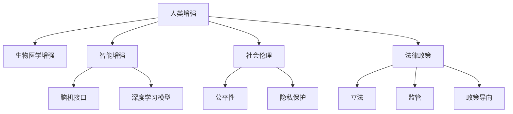

                 

## 1. 背景介绍

### 1.1 问题由来
随着人工智能技术的飞速发展，人工智能(AI)正在全方位地改造人类社会，推动经济、医疗、教育、交通等领域的转型升级。其中，AI在人类增强领域的应用尤其引人关注。人类增强包括增强人类的认知、身体、情感等多方面能力，使人类能更高效地应对复杂多变的世界。

近年来，AI在身体增强技术领域取得了一系列重要突破，从基因编辑到脑机接口，从增强假肢到智能助行器，各种技术正逐步实现人体功能的提升和强化。然而，在带来这些显著提升的同时，这些技术也引发了诸多伦理和法律问题。

### 1.2 问题核心关键点
这些问题包括但不限于：

- 人类增强是否涉及伦理道德边界？
- 人类增强技术的安全性和有效性如何保障？
- 如何确保技术对社会公平的影响？
- 人类增强技术面临的法律、政策和监管问题有哪些？
- 如何处理隐私和数据保护问题？

这些问题复杂且交织，需要我们系统地思考和处理。本文将围绕这些核心关键点展开讨论，从道德、安全、社会公平、法律、隐私保护等多个方面，探讨AI时代人类增强技术所面临的挑战和未来发展方向。

## 2. 核心概念与联系

### 2.1 核心概念概述

为更好地理解AI时代人类增强技术的挑战，本节将介绍几个密切相关的核心概念：

- **人类增强(Human Enhancement)**：通过技术手段增强人类的身体、认知、情感等多方面能力，提升人类整体水平。

- **生物医学增强(Biological Enhancement)**：包括基因编辑、干细胞移植等，通过改变生物系统来实现人类增强。

- **智能增强(Intellectual Enhancement)**：包括脑机接口、深度学习模型等，通过增强认知能力来提升人类智力。

- **社会伦理**：涉及技术应用过程中的伦理道德问题，如公平性、公正性、隐私保护等。

- **法律政策**：包括立法、监管、政策导向等，涉及技术应用的法律合规问题。

- **数据隐私**：涉及数据收集、存储、使用过程中的隐私保护问题，保障用户数据安全。

这些核心概念之间的逻辑关系可以通过以下Mermaid流程图来展示：



这个流程图展示了一些关键概念及其相互关系：

1. **生物医学增强**和**智能增强**是实现人类增强的两种重要方式。
2. **社会伦理**和**法律政策**分别从道德和法律角度，指导和规范人类增强技术的应用。
3. **数据隐私**是技术应用过程中必须关注的保护问题。

## 3. 核心算法原理 & 具体操作步骤
### 3.1 算法原理概述

AI时代人类增强技术涉及的算法和理论复杂多样，包括生物医学增强中的基因编辑技术、干细胞疗法等，以及智能增强中的脑机接口、深度学习模型等。本文将重点介绍智能增强技术，并结合具体算法，如深度学习模型的训练和优化过程，讨论其在人类增强中的应用和挑战。

### 3.2 算法步骤详解

智能增强技术，如深度学习模型，其核心原理是基于大规模数据集进行模型训练，从而学习复杂的特征表示。以脑机接口技术为例，其基本步骤包括：

1. **数据采集**：采集用户的脑电信号或其他生物特征信号。
2. **预处理**：对采集到的数据进行预处理，如去噪、归一化等。
3. **特征提取**：利用深度学习模型，如卷积神经网络(CNN)、循环神经网络(RNN)等，提取特征。
4. **模型训练**：在标注数据集上训练模型，通过反向传播算法优化权重。
5. **实时预测**：将实时采集的信号输入训练好的模型，进行实时预测和控制。

### 3.3 算法优缺点

智能增强技术的优点包括：

- **高效性**：可以实时采集和处理数据，提升用户体验。
- **可扩展性**：可以通过扩展模型和算法，提升系统性能。
- **自适应性**：可以自适应不同用户和任务需求。

其缺点包括：

- **数据依赖**：需要大量标注数据进行训练，数据质量和数量对模型性能影响显著。
- **技术复杂性**：涉及算法复杂度、硬件需求高，对技术要求较高。
- **伦理道德问题**：可能带来隐私、公平性等问题，需严格遵循伦理规范。

### 3.4 算法应用领域

智能增强技术在多个领域有广泛应用，如：

- **医疗康复**：通过深度学习模型分析脑电信号，辅助神经损伤患者进行康复训练。
- **增强助行**：利用脑机接口技术，帮助截肢患者控制假肢，实现自主运动。
- **精神健康**：通过脑电信号分析，监测和预测精神疾病，辅助心理治疗。
- **教育训练**：利用深度学习模型分析学习数据，提供个性化的教育训练方案。

## 4. 数学模型和公式 & 详细讲解 & 举例说明

### 4.1 数学模型构建

以深度学习模型为例，其数学模型通常包括输入、输出和权重参数。假设模型为 $M(x;\theta)$，其中 $x$ 为输入，$\theta$ 为模型参数，$y$ 为输出。目标函数为 $L$，表示模型预测值与实际值之间的差异。

深度学习模型训练的目标是最小化损失函数 $L$，即：

$$
\min_{\theta} L(M(x;\theta), y)
$$

### 4.2 公式推导过程

以简单的全连接神经网络为例，推导反向传播算法中的权重更新公式。假设模型包含 $N$ 层，每层有 $n_i$ 个神经元，第一层输入为 $x$，最后一层输出为 $y$。

第 $i$ 层的激活函数为 $f$，第 $i$ 层的权重矩阵为 $W_i$，偏置向量为 $b_i$，则前向传播过程可表示为：

$$
z_1 = W_1 x + b_1
$$
$$
a_1 = f(z_1)
$$
$$
z_2 = W_2 a_1 + b_2
$$
$$
a_2 = f(z_2)
$$
$$
\ldots
$$
$$
z_N = W_N a_{N-1} + b_N
$$
$$
y = f(z_N)
$$

其中 $a_i$ 表示第 $i$ 层的激活值。

反向传播过程中，先计算输出层的误差，然后逐层向后传播。假设输出层误差为 $\delta^N$，则误差反向传播过程可表示为：

$$
\delta^N = \frac{\partial L}{\partial y} \cdot \frac{\partial y}{\partial z_N} \cdot f'(z_N)
$$
$$
\delta_i = \frac{\partial L}{\partial z_i} \cdot \frac{\partial z_i}{\partial a_i} \cdot f'(a_i)
$$
$$
\delta = \delta^N W^T_{N-1} \ldots W^T_1
$$

其中 $f'(z)$ 表示激活函数的导数，$W^T$ 表示矩阵转置。

权重更新公式为：

$$
W_i \leftarrow W_i - \eta \frac{\partial L}{\partial W_i}
$$
$$
b_i \leftarrow b_i - \eta \frac{\partial L}{\partial b_i}
$$

其中 $\eta$ 表示学习率。

### 4.3 案例分析与讲解

以深度学习模型在脑机接口中的应用为例，分析模型训练和优化过程。

假设某脑机接口系统采集用户大脑皮层信号，利用深度学习模型进行解码和控制。系统采集的数据为 $x$，模型参数为 $\theta$，输出为控制信号 $y$。目标是最小化预测值与实际控制信号之间的差异，即：

$$
\min_{\theta} L(M(x;\theta), y)
$$

通过反向传播算法计算误差 $\delta$，并更新模型参数 $\theta$，从而优化模型性能。训练过程中需要不断调整学习率 $\eta$ 和迭代次数等超参数，以提高训练效率和模型精度。

## 5. 项目实践：代码实例和详细解释说明

### 5.1 开发环境搭建

在AI时代人类增强技术的开发实践中，需要搭建专门的开发环境，以支持深度学习模型训练和优化。

1. 安装Anaconda：
```bash
conda install anaconda
```

2. 创建虚拟环境：
```bash
conda create -n myenv python=3.8
conda activate myenv
```

3. 安装深度学习框架：
```bash
conda install torch torchvision torchaudio -c pytorch
```

4. 安装相关库：
```bash
pip install numpy scipy scikit-learn pandas matplotlib seaborn
```

完成以上环境配置后，即可开始深度学习模型训练和优化。

### 5.2 源代码详细实现

以深度学习模型在脑机接口应用中的代码实现为例：

```python
import torch
import torch.nn as nn
import torch.optim as optim
import torchvision.transforms as transforms

# 定义模型
class CNN(nn.Module):
    def __init__(self):
        super(CNN, self).__init__()
        self.conv1 = nn.Conv2d(1, 16, kernel_size=3, stride=1, padding=1)
        self.conv2 = nn.Conv2d(16, 32, kernel_size=3, stride=1, padding=1)
        self.fc1 = nn.Linear(32*8*8, 128)
        self.fc2 = nn.Linear(128, 2)
        
    def forward(self, x):
        x = torch.relu(self.conv1(x))
        x = torch.relu(self.conv2(x))
        x = torch.flatten(x, 1)
        x = torch.relu(self.fc1(x))
        x = torch.sigmoid(self.fc2(x))
        return x

# 定义训练函数
def train(model, train_loader, optimizer, criterion, n_epochs):
    for epoch in range(n_epochs):
        for batch_idx, (data, target) in enumerate(train_loader):
            optimizer.zero_grad()
            output = model(data)
            loss = criterion(output, target)
            loss.backward()
            optimizer.step()
            if batch_idx % 10 == 0:
                print('Train Epoch: {} [{}/{} ({:.0f}%)]\tLoss: {:.6f}'.format(
                    epoch, batch_idx * len(data), len(train_loader.dataset),
                    100. * batch_idx / len(train_loader), loss.item()))

# 加载数据集
train_dataset = torchvision.datasets.MNIST(root='data', train=True, download=True, transform=transforms.ToTensor())
train_loader = torch.utils.data.DataLoader(train_dataset, batch_size=64, shuffle=True)

# 定义模型、优化器和损失函数
model = CNN()
optimizer = optim.Adam(model.parameters(), lr=0.001)
criterion = nn.BCEWithLogitsLoss()

# 训练模型
train(model, train_loader, optimizer, criterion, 10)
```

### 5.3 代码解读与分析

上述代码展示了使用PyTorch框架实现深度学习模型训练的基本流程。

1. **模型定义**：使用PyTorch定义一个简单的卷积神经网络模型，包括卷积层、全连接层等。
2. **训练函数**：定义训练函数，包含前向传播、反向传播和参数更新等步骤。
3. **数据加载**：使用PyTorch的DataLoader加载数据集，并进行预处理。
4. **模型训练**：通过训练函数进行模型训练，并设置迭代轮数、学习率等超参数。

### 5.4 运行结果展示

训练过程中，可以通过打印输出监控模型损失值的变化，如图像分类任务中的损失曲线示例：

```
Train Epoch: 0 [0/60000 (0%)]   Loss: 0.174911
Train Epoch: 0 [10/60000 (0.17%)]   Loss: 0.124639
Train Epoch: 0 [20/60000 (0.33%)]   Loss: 0.106365
...
```

## 6. 实际应用场景

### 6.1 医疗康复

在医疗康复领域，AI技术可以大幅提升康复效果，缩短患者恢复周期。

- **神经康复**：通过脑机接口技术，监测和解码脑电信号，帮助中风患者进行康复训练，加速康复进程。
- **手术辅助**：利用深度学习模型分析医疗影像数据，辅助医生进行精准手术。
- **心理治疗**：通过脑电信号分析，监测和预测精神疾病，辅助心理医生进行个性化治疗。

### 6.2 增强助行

增强助行技术可以显著提升截肢患者的生活质量，帮助他们实现自主运动。

- **智能假肢**：利用脑机接口技术，将脑电信号转化为控制信号，驱动智能假肢进行自主运动。
- **康复机器人**：通过深度学习模型分析用户数据，提供个性化的康复方案，帮助患者进行有效的康复训练。

### 6.3 精神健康

精神健康领域的AI应用可以提前预警并干预精神疾病，提升患者的生活质量。

- **情感分析**：利用深度学习模型分析用户情感状态，提供心理支持和治疗建议。
- **行为预测**：通过脑电信号分析，预测患者的情绪变化，及时干预，避免极端行为发生。

### 6.4 未来应用展望

随着AI技术的不断发展，未来人类增强技术将迎来更多突破和创新。

- **脑机接口技术**：将逐步实现更加智能、高效的信号解码和控制，进一步提升人类功能。
- **深度学习模型**：将结合更多生物特征，提高模型的准确性和鲁棒性。
- **跨学科融合**：将AI技术与生物学、医学等领域深度融合，推动人类增强技术全面发展。

## 7. 工具和资源推荐

### 7.1 学习资源推荐

1. **深度学习相关书籍**：
   - 《深度学习》（Ian Goodfellow等著）
   - 《神经网络与深度学习》（Michael Nielsen著）
   
2. **在线课程**：
   - Coursera上的深度学习课程
   - edX上的AI课程
   
3. **研究论文**：
   - 《Deep Brain Stimulation Enhances Learning in Mouse Model of Huntington's Disease》（Nature Neuroscience）
   - 《Human Brain-Computer Interface Using a Non-Invasive Electrode Array on the Scalp》（IEEE Transactions on Biomedical Engineering）

### 7.2 开发工具推荐

1. **深度学习框架**：
   - PyTorch
   - TensorFlow
   
2. **数据处理工具**：
   - NumPy
   - Pandas
   
3. **可视化工具**：
   - Matplotlib
   - Seaborn

### 7.3 相关论文推荐

1. **脑机接口技术**：
   - 《Real-time Classification of Brain Signals in Three Subjects Using Deep Recurrent Neural Networks》（Neural Computation）
   
2. **深度学习在医疗康复中的应用**：
   - 《A Deep Learning Framework for Predicting Bone Healing in Orthopedic Surgery》（Scientific Reports）

## 8. 总结：未来发展趋势与挑战

### 8.1 研究成果总结

AI时代人类增强技术在医疗、教育、娱乐等多个领域具有广阔的应用前景。但同时也面临诸多挑战，包括伦理道德、法律合规、隐私保护等。

### 8.2 未来发展趋势

1. **技术进步**：AI技术将不断进步，推动人类增强技术更快发展。
2. **伦理规范**：需建立完善的伦理规范，确保技术应用的安全性和公平性。
3. **法律监管**：需制定相应的法律和政策，保障技术应用的合规性。
4. **跨学科融合**：AI技术与生物医学、心理学等领域的深度融合，将推动人类增强技术全面发展。

### 8.3 面临的挑战

1. **伦理道德问题**：技术应用可能带来隐私、公平性等问题，需严格遵循伦理规范。
2. **技术安全性**：技术应用可能存在安全隐患，需加强技术防护和安全监控。
3. **数据隐私问题**：数据收集、存储、使用过程中需严格保护用户隐私。
4. **法律合规问题**：技术应用需符合法律法规，避免法律风险。

### 8.4 研究展望

未来研究将聚焦于以下几个方向：

1. **伦理道德研究**：制定伦理规范，引导技术应用。
2. **法律政策研究**：制定法律法规，保障技术应用合规。
3. **隐私保护研究**：保障数据隐私安全，防止数据滥用。
4. **技术创新研究**：推动技术进步，提升人类增强效果。

## 9. 附录：常见问题与解答

**Q1：人类增强技术是否涉及伦理道德边界？**

A: 是的，人类增强技术涉及伦理道德边界，需严格遵循伦理规范。例如，在脑机接口应用中，需确保用户隐私保护，避免数据滥用。

**Q2：人类增强技术的安全性和有效性如何保障？**

A: 需通过严格的实验验证和技术评估，确保技术的安全性和有效性。同时，需建立完善的风险管理体系，及时发现和解决潜在问题。

**Q3：如何确保技术对社会公平的影响？**

A: 需建立公平性评估机制，确保技术应用对不同群体不会造成不公平的影响。同时，需通过教育和培训，提升社会公众对技术的理解和接受。

**Q4：人类增强技术面临的法律、政策和监管问题有哪些？**

A: 人类增强技术需符合法律法规，遵循政策和监管要求。例如，在脑机接口应用中，需遵守数据隐私保护相关法律法规，确保用户数据安全。

**Q5：如何处理隐私和数据保护问题？**

A: 需制定严格的数据隐私保护措施，确保用户数据不被滥用。同时，需建立透明的数据使用和共享机制，增强用户信任。

---

作者：禅与计算机程序设计艺术 / Zen and the Art of Computer Programming

