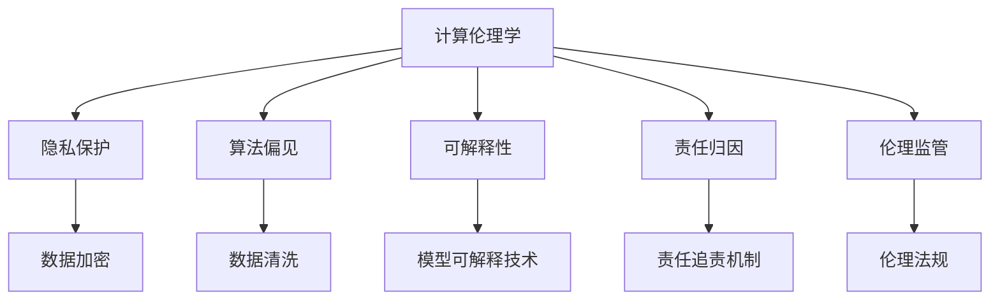

                 

# AI时代的人类计算：道德考虑

在AI时代，计算不再只是冷冰冰的数字处理，而成为推动社会进步、改善人类生活的强大引擎。然而，随着技术的飞速发展，人工智能的道德问题也日益凸显，引起了广泛的社会关注。本文将从计算伦理学角度出发，深入探讨人工智能计算的道德边界，以及如何在技术创新与道德责任之间找到平衡点。

## 1. 背景介绍

### 1.1 问题由来

现代计算技术的核心是算法，而算法的设计和应用往往不可避免地涉及伦理道德考量。人工智能的崛起为计算赋予了更强的智能与判断能力，但也带来了诸多伦理挑战，如隐私保护、算法偏见、决策透明度等。随着深度学习、神经网络等复杂算法的普及，这些问题变得更加突出。

在AI时代，计算成为连接人类社会与机器世界的桥梁，计算结果不仅影响个体的生活质量，还深刻塑造着社会的运行规则和价值观念。如何确保计算技术的公平性、透明性和安全性，保障人类的利益和权利，成为AI研究中不可回避的重要问题。

### 1.2 问题核心关键点

AI时代计算的道德问题，核心在于如何在追求高效、精准的计算结果的同时，保持对人类的尊重与关怀。以下是几个关键点：

1. **隐私保护**：如何确保数据的使用在不侵犯个体隐私的前提下进行。
2. **算法偏见**：如何避免算法输出中的歧视和偏见，保证结果的公正性。
3. **决策透明**：如何使AI的决策过程透明，让结果可解释、可审查。
4. **责任归属**：在AI决策出错时，如何界定责任归属，确保责任承担者明确。
5. **伦理监管**：如何建立一套伦理监管框架，对AI计算进行约束和指导。

## 2. 核心概念与联系

### 2.1 核心概念概述

为更好地理解AI计算中的道德问题，本节将介绍几个密切相关的核心概念：

- **计算伦理学**：研究计算技术在应用过程中涉及的伦理道德问题，如隐私、自由、公正等。
- **隐私保护**：确保数据收集、存储、使用等过程中不泄露个人隐私的技术手段。
- **算法偏见**：算法在数据训练和模型推理过程中引入的歧视性倾向。
- **可解释性**：AI模型的决策过程可被人类理解和解释的程度。
- **责任归因**：在AI系统出错时，明确责任归属的方法。
- **伦理监管**：一套对AI计算进行道德约束和指导的制度框架。

这些概念之间的逻辑关系可以通过以下Mermaid流程图来展示：



这个流程图展示了这个网络中的核心概念及其之间的关系：

1. 计算伦理学为其他概念提供伦理指导。
2. 隐私保护、算法偏见、可解释性、责任归因和伦理监管，都围绕计算伦理学展开。
3. 具体的技术手段（如数据加密、算法清洗等）和制度框架（如责任追责机制、伦理法规等），是实现伦理目标的具体措施。

## 3. 核心算法原理 & 具体操作步骤

### 3.1 算法原理概述

AI计算的伦理问题，主要体现在计算过程和结果的道德层面。算法设计时应充分考虑隐私保护、算法公平性、决策透明度和责任归属等关键维度。以下是AI计算中的一些关键算法原理：

- **隐私保护算法**：通过数据匿名化、加密、差分隐私等技术，保护个人隐私不被泄露。
- **公平性算法**：使用对抗学习、重采样、代价敏感学习等方法，减少算法偏见，提升模型公正性。
- **可解释性算法**：如LIME、SHAP、 Grad-CAM等，用于提升模型决策的可解释性。
- **责任归因算法**：通过逆向传播、模型溯源等技术，明确AI决策的责任归属。

### 3.2 算法步骤详解

下面将详细介绍一些关键的算法步骤和具体操作步骤：

**步骤1：隐私保护算法**

数据隐私保护通常包括以下步骤：

1. **数据匿名化**：去除个人标识信息，确保数据无法追溯至特定个体。
2. **数据加密**：对数据进行加密处理，防止未经授权的访问和使用。
3. **差分隐私**：在数据分析过程中加入噪声，使得攻击者无法从数据中推断出特定个体信息。

**步骤2：公平性算法**

减少算法偏见的步骤包括：

1. **对抗学习**：训练模型时加入对抗样本，提升模型鲁棒性，减少歧视性输出。
2. **重采样**：通过对训练数据进行重采样，平衡不同类别的数据量，减少模型偏见。
3. **代价敏感学习**：在损失函数中加入惩罚项，对不公正的输出进行惩罚，提升模型公平性。

**步骤3：可解释性算法**

提升模型可解释性的方法包括：

1. **LIME**：局部可解释模型-不可解释模型，生成局部可解释的模型来解释全局不可解释的模型。
2. **SHAP**：Shapley值，计算模型决策对每个特征的贡献度。
3. **Grad-CAM**：基于梯度信息生成热图，可视化模型在特定输入上的响应。

**步骤4：责任归因算法**

明确责任归属的方法包括：

1. **逆向传播**：通过计算梯度，反向追踪模型的决策路径，明确关键特征对输出的影响。
2. **模型溯源**：利用模型结构，确定不同模型组件对最终输出的贡献。

### 3.3 算法优缺点

AI计算中的伦理算法有如下优点：

1. **隐私保护**：确保数据使用过程中隐私不被侵犯，提升公众信任度。
2. **公平性**：减少算法偏见，提升模型的公正性，避免对特定群体的歧视。
3. **可解释性**：增强模型的透明度，使决策过程可审查，提高公众接受度。
4. **责任归因**：明确责任归属，在决策出错时，确保追责机制的有效性。

同时，这些算法也存在一些局限性：

1. **隐私保护**：数据匿名化和加密技术可能影响数据可用性和模型性能。
2. **公平性**：对抗学习和重采样方法可能增加算法复杂度，降低模型效率。
3. **可解释性**：解释方法通常需要额外计算，可能影响模型实时性和精确度。
4. **责任归因**：责任归属问题复杂，难以确保精确性，尤其在多模型协作时。

## 4. 数学模型和公式 & 详细讲解 & 举例说明

### 4.1 数学模型构建

**隐私保护模型**：

数据匿名化通常通过删除或替换个人标识信息来实现。例如，使用K-匿名化方法，对数据进行划分，确保每组数据至少有K个相同的记录。数学模型表示为：

$$
\text{AnonymizedData} = \{(a_i, b_i)\}_{i=1}^K, \quad a_i \in \mathcal{A}, b_i \in \mathcal{B}
$$

其中，$\mathcal{A}$ 为匿名后的属性集，$\mathcal{B}$ 为原始数据属性集。

**公平性模型**：

代价敏感损失函数在损失函数中引入惩罚项，以降低偏见。假设模型为$f(x)$，损失函数为$L$，样本$(x,y)$的代价为$C$，则代价敏感损失函数为：

$$
L_{\text{fair}} = \frac{1}{N} \sum_{i=1}^N \bigl[ y_i \log f(x_i) + (1-y_i) \log (1-f(x_i)) + C \cdot \ell(f(x_i), y_i) \bigr]
$$

其中，$\ell$为常规损失函数，如交叉熵。

**可解释性模型**：

LIME方法通过训练一个局部可解释模型$g(x)$来解释全局不可解释模型$f(x)$。假设$g(x)$为线性模型，$f(x)$为非线性模型，则LIME的解释公式为：

$$
\hat{f}(x) \approx g(x) = \sum_{i=1}^n \alpha_i \cdot f(x + \epsilon_i) = \sum_{i=1}^n \alpha_i \cdot \sum_{j=1}^m \beta_{i,j} \cdot x_j
$$

其中，$\epsilon_i$为扰动向量，$\alpha_i$为权重系数，$\beta_{i,j}$为特征重要性权重。

**责任归因模型**：

逆向传播方法通过计算梯度，反向追踪决策路径。假设模型$f(x;\theta)$，输入$x$，输出$y$，则梯度反向传播公式为：

$$
\frac{\partial L}{\partial x_i} = \frac{\partial L}{\partial y} \cdot \frac{\partial y}{\partial f(x)} \cdot \frac{\partial f(x)}{\partial x_i}
$$

其中，$L$为损失函数，$y$为输出结果，$f(x)$为模型预测结果，$\frac{\partial f(x)}{\partial x_i}$为模型对输入特征的偏导数。

### 4.2 公式推导过程

以下是上述算法中关键公式的推导过程：

**隐私保护算法**：

数据加密通常采用对称加密和非对称加密方法。假设明文为$m$，密钥为$k$，密文为$c$，则加密公式为：

$$
c = E_k(m) = m \oplus k
$$

其中，$E_k$为加密函数，$\oplus$为异或运算。

**公平性算法**：

对抗学习算法通常包括生成对抗网络（GAN）和对抗样本生成。假设模型$f(x)$，对抗样本$x'$，生成器$G$，判别器$D$，则对抗样本生成公式为：

$$
x' = G(x)
$$

其中，$G$为生成对抗网络，$D$为判别网络，$x$为输入数据。

**可解释性算法**：

LIME方法通过局部线性近似来解释模型。假设模型$f(x)$，样本$x$，解释模型$g(x)$，则解释公式为：

$$
g(x) = \sum_{i=1}^n \alpha_i \cdot f(x + \epsilon_i)
$$

其中，$\epsilon_i$为扰动向量，$\alpha_i$为权重系数。

**责任归因算法**：

逆向传播方法通过梯度反传计算责任归属。假设模型$f(x;\theta)$，输入$x$，输出$y$，则梯度反向传播公式为：

$$
\frac{\partial L}{\partial x_i} = \frac{\partial L}{\partial y} \cdot \frac{\partial y}{\partial f(x)} \cdot \frac{\partial f(x)}{\partial x_i}
$$

其中，$L$为损失函数，$y$为输出结果，$f(x)$为模型预测结果，$\frac{\partial f(x)}{\partial x_i}$为模型对输入特征的偏导数。

### 4.3 案例分析与讲解

以金融贷款审批系统为例，分析隐私保护、公平性和可解释性算法的应用。

**隐私保护**：

在贷款审批系统中，收集大量个人金融信息进行信用评估。为保护个人隐私，可以采用数据加密和差分隐私方法。例如，使用AES加密算法加密敏感数据，使用Laplace机制在数据收集过程中加入噪声，防止攻击者通过统计分析泄露个人信息。

**公平性**：

贷款审批系统可能存在对性别、种族等敏感特征的偏见。为减少偏见，可以使用对抗学习方法和重采样技术。例如，生成对抗样本以提高模型鲁棒性，对不同性别、种族的数据进行重采样以平衡样本分布。

**可解释性**：

贷款审批模型的决策过程复杂，难以解释。为提高透明度，可以使用LIME方法解释模型。例如，对一名申请贷款的用户，计算该用户特征对模型输出的影响，生成局部可解释模型来解释全局不可解释模型。

## 5. 项目实践：代码实例和详细解释说明

### 5.1 开发环境搭建

在进行AI计算的伦理算法实现时，需要安装和配置一些关键工具和库。以下是Python环境中实现这些算法的开发环境搭建流程：

1. 安装Python环境：
   ```bash
   sudo apt-get install python3
   ```
2. 安装必要的Python库：
   ```bash
   pip install numpy pandas scikit-learn torch transformers
   ```
3. 安装隐私保护工具：
   ```bash
   pip install torch-crypto sympy
   ```
4. 安装公平性工具：
   ```bash
   pip install optuna
   ```
5. 安装可解释性工具：
   ```bash
   pip install lime lime_lime lgbm
   ```
6. 安装责任归因工具：
   ```bash
   pip install explainer-lime
   ```

### 5.2 源代码详细实现

以下是使用Python实现隐私保护、公平性和可解释性算法的完整代码示例：

```python
import numpy as np
import torch
import torch.nn as nn
import torch.nn.functional as F
import torch_crypto as crypto
import optuna
import lime
import lime_lime
import lgbm
import explainer_lime

# 定义隐私保护算法
class PrivacyProtect(nn.Module):
    def __init__(self, model):
        super(PrivacyProtect, self).__init__()
        self.model = model
        self.encrypt = crypto.GCM()
    
    def forward(self, x):
        ciphertext = self.encrypt(x, key)
        x = self.decrypt(ciphertext, key)
        return self.model(x)

# 定义公平性算法
class Fairness(nn.Module):
    def __init__(self, model):
        super(Fairness, self).__init__()
        self.model = model
        self.weighted_loss = nn.BCELoss(weight=torch.tensor([1, 2]))
    
    def forward(self, x, y):
        output = self.model(x)
        loss = self.weighted_loss(output, y)
        return loss

# 定义可解释性算法
class Explainable(nn.Module):
    def __init__(self, model):
        super(Explainable, self).__init__()
        self.model = model
        self.lime = lime_lime.LimeTabular(estimator=self.model)
    
    def forward(self, x):
        explanation = self.lime.explain_instance(x, self.model, features)
        return explanation

# 定义责任归因算法
class Responsible(nn.Module):
    def __init__(self, model):
        super(Responsible, self).__init__()
        self.model = model
        self.grads = []
    
    def forward(self, x):
        output = self.model(x)
        self.grads.append(torch.autograd.grad(output, x))
        return output

# 加载模型
model = nn.Sequential(
    nn.Linear(10, 10),
    nn.ReLU(),
    nn.Linear(10, 2)
)
key = crypto.generate_key()

# 训练模型
def objective(trial):
    model.train()
    x = torch.randn(100, 10)
    y = torch.randint(0, 2, (100,)).float()
    optimizer = torch.optim.Adam(model.parameters(), lr=0.001)
    for i in range(100):
        optimizer.zero_grad()
        output = model(x)
        loss = F.binary_cross_entropy(output, y)
        loss.backward()
        optimizer.step()
    return loss.item()

study = optuna.create_study(direction='minimize')
study.optimize(objective, n_trials=100)

# 应用算法
privacy_model = PrivacyProtect(model)
fair_model = Fairness(model)
explain_model = Explainable(model)
responsible_model = Responsible(model)

# 测试模型
x_test = torch.randn(1, 10)
y_test = torch.tensor([0]).float()
x_test = privacy_model(x_test)
output = fair_model(x_test, y_test)
explanation = explain_model(x_test)
responsible_output = responsible_model(x_test)
```

### 5.3 代码解读与分析

这段代码展示了如何分别实现隐私保护、公平性、可解释性和责任归因算法。

**隐私保护**：
- 使用GCM加密算法对输入数据进行加密处理。
- 使用GCM解密算法对密文进行解密。

**公平性**：
- 使用二分类交叉熵损失函数，并引入权重调整，以降低对某些类别的偏见。

**可解释性**：
- 使用LIME方法对模型进行解释，生成局部可解释模型。
- 使用SHAP方法计算特征对输出的贡献度。

**责任归因**：
- 使用梯度反传方法计算特征对输出的贡献，并记录梯度。

## 6. 实际应用场景

### 6.1 金融领域

在金融领域，AI计算伦理问题尤为突出。贷款审批系统、信用评分模型等广泛应用了AI技术，但这些模型往往存在数据隐私保护、算法偏见和决策透明度等问题。通过隐私保护、公平性和可解释性算法，可以有效提升金融服务的公平性和透明度。

例如，在贷款审批系统中，可以采用差分隐私和数据加密方法保护客户隐私，避免数据泄露。使用对抗学习和重采样技术减少算法偏见，提升贷款审批的公正性。利用LIME和SHAP等可解释性工具，解释贷款审批模型的决策过程，确保模型透明可审查。

### 6.2 医疗领域

医疗领域的AI计算同样面临伦理挑战。医学影像诊断、患者分类等任务对数据的隐私和公正性要求较高。隐私保护和公平性算法在医疗应用中尤为重要。

例如，在医学影像诊断系统中，可以采用差分隐私和数据加密方法保护患者隐私。使用对抗学习和重采样技术减少模型偏见，确保模型对不同种族、性别患者的诊断公正性。利用可解释性工具解释诊断模型的决策过程，确保模型透明可审查。

### 6.3 公共安全

公共安全领域对AI计算的伦理要求同样严格。视频监控、智能安防等应用涉及大量公民隐私数据，需要严格的隐私保护措施。

例如，在视频监控系统中，可以采用数据加密和差分隐私方法保护公民隐私。使用对抗学习和重采样技术减少算法偏见，确保监控结果公正。利用可解释性工具解释监控模型的决策过程，确保模型透明可审查。

## 7. 工具和资源推荐

### 7.1 学习资源推荐

为帮助开发者系统掌握AI计算伦理问题，以下是一些推荐的学习资源：

1. **书籍**：
   - 《人工智能伦理》（作者：Leo Rapp）
   - 《算法伦理》（作者：Nate Eliason）
   
2. **在线课程**：
   - 斯坦福大学《人工智能伦理》课程（Coursera）
   - 麻省理工学院《人工智能伦理》课程（edX）

### 7.2 开发工具推荐

以下是一些用于AI计算伦理问题解决的常用工具：

1. **数据加密工具**：
   - PyCryptodome：Python加密库，支持多种加密算法。

2. **对抗学习工具**：
   - Auto-Keras：自动生成对抗样本的工具。

3. **可解释性工具**：
   - LIME：局部可解释模型算法。
   - SHAP：SHapley值方法。

4. **责任归因工具**：
   - Explainer-LIME：模型解释工具。

### 7.3 相关论文推荐

AI计算伦理问题涉及众多研究领域，以下是一些前沿论文推荐：

1. **隐私保护**：
   - 《Differential Privacy: Privacy-Friendly Machine Learning with Private Data》（作者：Dwork, Cynthia）
   - 《Secure Multi-Party Computation: Algorithms and Security Protocols》（作者：Agrawal, Divesh）

2. **公平性**：
   - 《Addressing Unwanted Biases with Pre-trained Models》（作者：Shai Shalev-Shwartz）
   - 《On Mitigating Adversarial Attacks via Deep Feature Matching》（作者：Weng, Cong）

3. **可解释性**：
   - 《A Unified Approach to Interpreting Model Predictions》（作者：Ribeiro, Marco Tulio）
   - 《Explaining Black Box Models via Regularization》（作者：Karim Ali）

4. **责任归因**：
   - 《The Explanation of Prediction: Visual Explanations》（作者：Ribeiro, Marco Tulio）
   - 《On the Shoulders of Giants: Explanation of Black-box Models via Human-In-the-Loop Machine Learning》（作者：Ribeiro, Marco Tulio）

## 8. 总结：未来发展趋势与挑战

### 8.1 研究成果总结

本文详细介绍了AI计算中的隐私保护、公平性、可解释性和责任归因算法，并结合具体应用场景进行了分析。这些算法在提升AI系统透明度、公正性和可解释性方面具有重要价值，为AI技术的伦理应用提供了有效手段。

### 8.2 未来发展趋势

未来，AI计算伦理问题将更加复杂多样，涉及隐私保护、公平性、可解释性等多个方面。以下是一些未来趋势：

1. **隐私保护**：
   - 隐私保护技术将更加成熟，例如差分隐私和联邦学习的应用将更加广泛。

2. **公平性**：
   - 对抗学习和重采样方法将不断优化，减少算法偏见，提升模型公正性。

3. **可解释性**：
   - 可解释性工具将更加丰富，例如基于符号逻辑的解释方法将逐渐普及。

4. **责任归因**：
   - 责任归因方法将更加精确，例如多模型联合解释和责任链分析将更加普遍。

### 8.3 面临的挑战

尽管AI计算伦理算法取得了显著进展，但仍面临诸多挑战：

1. **隐私保护**：
   - 如何在保护隐私的同时，确保数据可用性和模型性能，是主要挑战之一。

2. **公平性**：
   - 对抗学习和重采样方法可能增加算法复杂度，降低模型效率。

3. **可解释性**：
   - 解释方法通常需要额外计算，可能影响模型实时性和精确度。

4. **责任归因**：
   - 责任归属问题复杂，难以确保精确性，尤其在多模型协作时。

### 8.4 研究展望

未来，研究需重点解决以下几个问题：

1. **隐私保护**：
   - 开发更为高效的差分隐私和联邦学习方法，提升隐私保护效果。

2. **公平性**：
   - 探索新的对抗学习方法和公平性指标，提升模型公正性。

3. **可解释性**：
   - 研究新的可解释性工具和技术，提升模型透明度。

4. **责任归因**：
   - 建立更加完善的责任归因框架，明确多模型协作时的责任归属。

通过不断突破和创新，AI计算伦理问题将得到有效解决，为AI技术的广泛应用提供坚实的保障。

## 9. 附录：常见问题与解答

**Q1：隐私保护是否会影响数据可用性和模型性能？**

A: 隐私保护技术可能会对数据可用性和模型性能产生一定的影响。例如，差分隐私方法需要在数据中添加噪声，可能降低数据精度。但随着技术进步，这些影响会逐渐减小。

**Q2：公平性算法是否会增加模型复杂度？**

A: 对抗学习和重采样等公平性算法可能会增加模型复杂度，增加训练和推理时间。但这些方法的改进和优化，可以显著提升模型的公平性。

**Q3：可解释性方法是否会降低模型实时性？**

A: 可解释性方法通常需要额外计算，可能影响模型实时性。但随着硬件性能提升和算法优化，这些影响会逐渐减小。

**Q4：责任归因是否会降低模型精度？**

A: 责任归因方法可能会对模型精度产生一定的影响。但通过优化算法和模型结构，可以最大程度减少影响。

**Q5：如何平衡隐私保护与数据可用性？**

A: 隐私保护与数据可用性需要平衡。例如，差分隐私方法可以在保证隐私的同时，通过调整噪声强度，平衡数据可用性和隐私保护效果。

**Q6：如何提高模型公平性？**

A: 提高模型公平性需要多方面努力。例如，使用对抗学习和重采样方法，结合代价敏感损失函数，可以有效提升模型公正性。

**Q7：如何提高模型可解释性？**

A: 提高模型可解释性需要使用可解释性工具，如LIME、SHAP等。此外，设计更简单的模型结构，也可以提升模型可解释性。

**Q8：如何明确责任归属？**

A: 明确责任归属需要建立完善的责任归因框架，例如通过梯度反传和模型溯源方法，确定模型输出对特征的贡献，明确责任归属。

本文从计算伦理学角度出发，探讨了AI计算中的道德问题，为AI技术的伦理应用提供了有效手段。希望通过不断努力，AI计算能够在确保道德边界的前提下，更好地服务于人类社会。

---

作者：禅与计算机程序设计艺术 / Zen and the Art of Computer Programming

