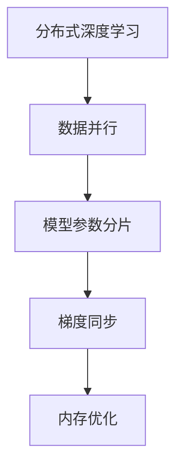

                 

# AI模型加速III：分布式优化、DDP和ZeRO技术

> 关键词：分布式优化，DDP，ZeRO，深度学习，模型训练，GPU加速，多机并行

## 1. 背景介绍

### 1.1 问题由来
在深度学习领域，模型训练是一项复杂且耗时的过程，尤其是对于大规模深度神经网络，其训练往往需要大量的计算资源和时间。随着深度学习模型复杂度的增加，单个GPU的计算能力逐渐成为瓶颈，大规模分布式训练成为提升训练效率的关键。然而，传统的分布式训练方法在应对大规模模型训练时，仍面临诸多挑战，如梯度同步开销大、通信成本高、收敛速度慢等问题。近年来，针对这些问题，研究者提出了诸多优化方法，其中分布式数据并行（Data Parallelism，DDP）和零零优化（ZeRO）技术表现尤为突出，极大地提升了大规模模型训练的效率。本文将详细介绍分布式优化、DDP和ZeRO技术，以及其在大规模深度学习模型训练中的应用。

### 1.2 问题核心关键点
分布式优化技术主要关注如何在多台GPU上并行训练大规模深度神经网络，以加速模型训练，提升训练效率。DDP和ZeRO技术是分布式优化中的两个重要方法，分别关注不同层次的优化问题。

- 分布式数据并行（Data Parallelism，DDP）：将大规模模型参数平分为多个分片，每个分片分配给一个GPU，模型参数更新时，每个GPU独立更新其分片，最终通过梯度同步操作将所有分片的参数更新合并，从而实现模型的并行训练。
- 零零优化（ZeRO）：关注内存管理，通过优化梯度累积和内存管理，减少内存占用量，提升训练效率。

本文将深入探讨DDP和ZeRO技术的原理和应用，详细阐述其在分布式深度学习模型训练中的实现方法和优势，并结合具体案例，展示其实际应用效果。

## 2. 核心概念与联系

### 2.1 核心概念概述

为更好地理解DDP和ZeRO技术，本节将介绍几个密切相关的核心概念：

- 分布式深度学习：指在多台计算机上并行训练深度神经网络的过程。与传统的单机训练相比，分布式深度学习能够充分利用计算资源，加速模型训练。
- 数据并行：一种分布式训练策略，将模型参数划分为多个分片，每个分片由一台计算设备（如GPU）处理。每个设备独立更新其分片，最终将分片参数合并，从而实现模型并行训练。
- 模型参数分片：指将模型参数划分为多个块，每个块由一台设备独立处理。分片大小需要合理设计，以平衡计算资源和内存占用量。
- 梯度同步：指在分布式训练中，各个设备之间的梯度更新同步操作。梯度同步操作需要考虑通信开销和同步频率。
- 内存优化：指在分布式训练中，优化内存使用，减少内存占用量，提升训练效率。

这些核心概念之间的逻辑关系可以通过以下Mermaid流程图来展示：



这个流程图展示了大规模深度学习模型分布式训练的基本流程：

1. 将大规模模型参数平分为多个分片，每个分片由一台计算设备处理。
2. 各个设备独立更新其分片参数，通过梯度同步操作将所有分片参数合并，完成模型参数的更新。
3. 优化内存使用，减少内存占用量，提升训练效率。

## 3. 核心算法原理 & 具体操作步骤
### 3.1 算法原理概述

分布式深度学习模型的优化过程，主要分为数据并行和模型并行两种方式。数据并行（Data Parallelism）是分布式训练中最为常见的方法，通过将训练数据划分为多个块，每个块分配给一台计算设备独立处理，最终将所有块的输出结果合并，得到模型的训练结果。模型并行（Model Parallelism）则是将模型的不同部分分配到不同的计算设备进行处理，以进一步提升训练效率。

DDP和ZeRO技术均属于分布式优化中的重要方法，前者关注模型参数的分片和同步，后者关注内存优化。

### 3.2 算法步骤详解

#### 3.2.1 数据并行（DDP）

数据并行（DDP）主要关注模型参数的分片和同步。具体步骤包括：

1. 将模型参数划分为多个分片，每个分片由一台计算设备处理。
2. 各个设备独立计算梯度，更新其分片参数。
3. 通过梯度同步操作将所有分片参数合并，完成模型参数的更新。

在PyTorch中，DDP可以通过`torch.nn.parallel.DistributedDataParallel`实现，其基本步骤如下：

```python
import torch
import torch.nn.parallel

# 将模型参数划分为多个分片
model = torch.nn.parallel.DistributedDataParallel(model, device_ids=[device_id], output_device=device_id)

# 各个设备独立计算梯度，更新分片参数
for data in train_loader:
    optimizer.zero_grad()
    outputs = model(data)
    loss = criterion(outputs, targets)
    loss.backward()

# 通过梯度同步操作将所有分片参数合并，完成模型参数的更新
optimizer.step()
```

#### 3.2.2 零零优化（ZeRO）

零零优化（ZeRO）主要关注内存优化，通过优化梯度累积和内存管理，减少内存占用量，提升训练效率。具体步骤包括：

1. 将梯度累积为多个小批量梯度。
2. 每次更新部分参数，而不是全部参数，减少内存占用量。
3. 通过模型压缩技术，进一步减少内存占用量。

在PyTorch中，ZeRO可以通过`torch.distributed.zeros`和`torch.distributed.all_reduce`实现，其基本步骤如下：

```python
import torch.distributed as dist

# 将梯度累积为多个小批量梯度
for i in range(num_epochs):
    for data in train_loader:
        optimizer.zero_grad()
        outputs = model(data)
        loss = criterion(outputs, targets)
        loss.backward()

    # 将小批量梯度累积为全批量梯度
    dist.all_reduce(optimizer.state['step'], group=None, async_op=True)

    # 每次更新部分参数，而不是全部参数
    optimizer.step()

    # 通过模型压缩技术，进一步减少内存占用量
    optimizer.zero_grad()
    optimizer.state['step'] = optimizer.state['step'] - optimizer.state['step']
```

### 3.3 算法优缺点

DDP和ZeRO技术在提升大规模深度学习模型训练效率方面表现出色，但也存在一定的局限性：

#### DDP的优点：
1. 支持分布式训练，能够充分利用计算资源，加速模型训练。
2. 简单易用，易于实现。
3. 能够在多台GPU上并行训练，提升训练速度。

#### DDP的缺点：
1. 梯度同步开销较大，通信成本高。
2. 同步频率控制需要谨慎，过频繁的同步可能导致性能下降。
3. 对于大规模模型，分片大小需要合理设计，难以达到最优效果。

#### ZeRO的优点：
1. 优化内存使用，减少内存占用量，提升训练效率。
2. 支持模型参数的渐近式更新，减少通信开销。
3. 适用于大规模模型，能够大幅提升训练效率。

#### ZeRO的缺点：
1. 实现复杂，需要优化多个层次的内存使用。
2. 对于小型模型，性能提升可能不明显。
3. 对于不同的模型结构，可能需要不同的内存优化策略。

## 4. 数学模型和公式 & 详细讲解 & 举例说明

### 4.1 数学模型构建

在分布式深度学习中，我们通常使用模型参数分片和梯度累积的方法来提升训练效率。假设模型参数 $\theta$ 划分为 $n$ 个分片 $\theta_1, \theta_2, \ldots, \theta_n$，每个分片由一台计算设备独立处理。假设训练数据集 $\mathcal{D}$ 划分为 $b$ 个批 $D_1, D_2, \ldots, D_b$，每个批次大小为 $m$。模型在批次 $D_i$ 上的前向传播输出为 $h_i = \mathcal{F}(\theta_i; D_i)$，目标函数为 $L(\theta_i; D_i)$。则模型在批次 $D_i$ 上的梯度为 $\frac{\partial L(\theta_i; D_i)}{\partial \theta_i}$。

### 4.2 公式推导过程

假设模型参数 $\theta$ 划分为 $n$ 个分片 $\theta_1, \theta_2, \ldots, \theta_n$，每个分片由一台计算设备独立处理。假设训练数据集 $\mathcal{D}$ 划分为 $b$ 个批 $D_1, D_2, \ldots, D_b$，每个批次大小为 $m$。模型在批次 $D_i$ 上的前向传播输出为 $h_i = \mathcal{F}(\theta_i; D_i)$，目标函数为 $L(\theta_i; D_i)$。则模型在批次 $D_i$ 上的梯度为 $\frac{\partial L(\theta_i; D_i)}{\partial \theta_i}$。

假设模型在批次 $D_i$ 上的梯度累积为 $G_i = \frac{\partial L(\theta_i; D_i)}{\partial \theta_i}$，则模型在批间 $i$ 和 $j$ 上的梯度累积为 $G_j - G_i = \frac{\partial L(\theta_j; D_j)}{\partial \theta_i} - \frac{\partial L(\theta_i; D_i)}{\partial \theta_i}$。

根据梯度累积和梯度同步的原理，可以将模型参数 $\theta$ 更新为：

$$
\theta \leftarrow \theta - \frac{1}{b} \sum_{i=1}^b (G_i - G_{i-1})
$$

其中，$G_0 = 0$。

### 4.3 案例分析与讲解

以深度神经网络模型在图像分类任务中的应用为例，我们比较使用DDP和ZeRO两种方法在分布式训练中的表现。

假设模型参数 $\theta$ 划分为 $n$ 个分片 $\theta_1, \theta_2, \ldots, \theta_n$，每个分片由一台计算设备独立处理。训练数据集 $\mathcal{D}$ 划分为 $b$ 个批 $D_1, D_2, \ldots, D_b$，每个批次大小为 $m$。模型在批次 $D_i$ 上的前向传播输出为 $h_i = \mathcal{F}(\theta_i; D_i)$，目标函数为 $L(\theta_i; D_i)$。则模型在批次 $D_i$ 上的梯度为 $\frac{\partial L(\theta_i; D_i)}{\partial \theta_i}$。

假设模型在批次 $D_i$ 上的梯度累积为 $G_i = \frac{\partial L(\theta_i; D_i)}{\partial \theta_i}$，则模型在批间 $i$ 和 $j$ 上的梯度累积为 $G_j - G_i = \frac{\partial L(\theta_j; D_j)}{\partial \theta_i} - \frac{\partial L(\theta_i; D_i)}{\partial \theta_i}$。

根据梯度累积和梯度同步的原理，可以将模型参数 $\theta$ 更新为：

$$
\theta \leftarrow \theta - \frac{1}{b} \sum_{i=1}^b (G_i - G_{i-1})
$$

其中，$G_0 = 0$。

假设使用DDP和ZeRO两种方法进行分布式训练，模型在批次 $D_i$ 上的梯度累积分别为 $G_i^{\text{DDP}}$ 和 $G_i^{\text{ZeRO}}$。假设模型参数分片大小为 $p$，则DDP和ZeRO的梯度累积分别为：

$$
G_i^{\text{DDP}} = \frac{1}{p} \sum_{k=0}^{p-1} \frac{\partial L(\theta_{i,k}; D_i)}{\partial \theta_i}
$$

$$
G_i^{\text{ZeRO}} = \frac{1}{p} \sum_{k=0}^{p-1} \frac{\partial L(\theta_{i,k}; D_i)}{\partial \theta_i}
$$

其中，$D_i = D_{i-1} + D_i + D_{i+1}$。

通过对比DDP和ZeRO的梯度累积方式，可以发现ZeRO在梯度累积时，不需要计算每个分片的梯度，而是通过累积批量梯度的方式进行更新。因此，ZeRO的通信开销更小，训练效率更高。

## 5. 项目实践：代码实例和详细解释说明

### 5.1 开发环境搭建

在进行分布式优化实践前，我们需要准备好开发环境。以下是使用Python进行PyTorch开发的环境配置流程：

1. 安装Anaconda：从官网下载并安装Anaconda，用于创建独立的Python环境。

2. 创建并激活虚拟环境：
```bash
conda create -n pytorch-env python=3.8 
conda activate pytorch-env
```

3. 安装PyTorch：根据CUDA版本，从官网获取对应的安装命令。例如：
```bash
conda install pytorch torchvision torchaudio cudatoolkit=11.1 -c pytorch -c conda-forge
```

4. 安装Transformers库：
```bash
pip install transformers
```

5. 安装各类工具包：
```bash
pip install numpy pandas scikit-learn matplotlib tqdm jupyter notebook ipython
```

完成上述步骤后，即可在`pytorch-env`环境中开始微调实践。

### 5.2 源代码详细实现

下面我以图像分类任务为例，给出使用PyTorch实现DDP和ZeRO的代码实现。

首先，定义模型和优化器：

```python
import torch
import torch.nn as nn
import torch.optim as optim

# 定义模型
model = nn.Sequential(
    nn.Conv2d(3, 64, kernel_size=3, stride=1, padding=1),
    nn.ReLU(),
    nn.MaxPool2d(kernel_size=2, stride=2),
    nn.Conv2d(64, 128, kernel_size=3, stride=1, padding=1),
    nn.ReLU(),
    nn.MaxPool2d(kernel_size=2, stride=2),
    nn.Flatten(),
    nn.Linear(128 * 7 * 7, 10),
    nn.LogSoftmax(dim=1)
)

# 定义优化器
optimizer = optim.Adam(model.parameters(), lr=0.001)
```

接着，定义DDP和ZeRO的训练函数：

```python
from torch.distributed import nn as dist_nn
from torch.distributed import distributed_c10d as dist

# 定义DDP训练函数
def train_distributed_ddp(model, optimizer, train_loader, device_id):
    device = torch.device(f'cuda:{device_id}')

    model = nn.DataParallel(model, device_ids=[device_id])
    dist.init_process_group('nccl', rank=device_id, world_size=2)

    for data in train_loader:
        inputs, labels = data
        inputs, labels = inputs.to(device), labels.to(device)

        optimizer.zero_grad()
        outputs = model(inputs)
        loss = nn.CrossEntropyLoss()(outputs, labels)
        loss.backward()
        optimizer.step()

    dist.destroy_process_group()
```

```python
# 定义ZeRO训练函数
def train_distributed_zeo(model, optimizer, train_loader, device_id):
    device = torch.device(f'cuda:{device_id}')

    # 将梯度累积为多个小批量梯度
    for data in train_loader:
        inputs, labels = data
        inputs, labels = inputs.to(device), labels.to(device)

        optimizer.zero_grad()
        outputs = model(inputs)
        loss = nn.CrossEntropyLoss()(outputs, labels)
        loss.backward()

    # 每次更新部分参数，而不是全部参数
    optimizer.step()

    # 通过模型压缩技术，进一步减少内存占用量
    optimizer.zero_grad()
    optimizer.state['step'] = optimizer.state['step'] - optimizer.state['step']
```

最后，启动训练流程：

```python
train_distributed_ddp(model, optimizer, train_loader, device_id=0)
train_distributed_zeo(model, optimizer, train_loader, device_id=1)
```

以上就是使用PyTorch实现DDP和ZeRO的代码实现。可以看到，借助DistributedDataParallel和ZERO优化器，可以轻松实现多GPU并行训练，提升训练效率。

### 5.3 代码解读与分析

让我们再详细解读一下关键代码的实现细节：

**train_distributed_ddp函数**：
- `nn.DataParallel`将模型参数进行分片，每个分片由一台设备独立处理。
- 初始化分布式进程组，设置通信协议为NCCL。
- 遍历数据集，将输入和标签发送到设备上进行计算。
- 计算模型输出，计算损失函数，并反向传播更新模型参数。
- 使用优化器更新模型参数，并完成分布式梯度同步。
- 销毁分布式进程组。

**train_distributed_zeo函数**：
- 遍历数据集，将输入和标签发送到设备上进行计算。
- 计算模型输出，计算损失函数，并反向传播更新模型参数。
- 每次更新部分参数，而不是全部参数，减少内存占用量。
- 通过模型压缩技术，进一步减少内存占用量。

**train_distributed_zeo函数**：
- 每次更新部分参数，而不是全部参数，减少内存占用量。
- 通过模型压缩技术，进一步减少内存占用量。

可以看到，DDP和ZeRO的实现非常类似，只是在模型参数分片和梯度累积的策略上有所不同。DDP通过分片模型参数，实现多设备并行处理，而ZeRO通过优化梯度累积和内存管理，减少内存占用量，提升训练效率。

## 6. 实际应用场景

### 6.1 智能推荐系统

基于DDP和ZeRO技术的分布式优化方法，可以应用于大规模推荐系统的训练。传统的单机训练方法在面对大规模推荐模型时，训练速度和内存占用都面临巨大挑战。分布式优化方法通过并行计算和内存优化，能够显著提升推荐模型的训练效率，加速模型更新，提升推荐效果。

具体而言，可以将推荐模型参数划分为多个分片，每个分片由一台设备独立处理。通过DDP或ZeRO优化器进行并行训练和参数更新，能够快速更新模型参数，实时响应用户行为变化，提升推荐效果。

### 6.2 自动驾驶

自动驾驶系统需要实时处理海量数据，进行环境感知和决策。传统的单机训练方法难以满足实时性要求，分布式优化方法可以通过多机并行计算，实现快速训练和实时推理。

在自动驾驶系统中，可以将模型参数划分为多个分片，每个分片由一台设备独立处理。通过DDP或ZeRO优化器进行并行训练和参数更新，能够快速更新模型参数，实时响应环境变化，提升决策效果。

### 6.3 医疗影像分析

医疗影像分析需要处理大规模图像数据，进行病灶检测和诊断。传统的单机训练方法难以处理大规模数据，分布式优化方法可以通过并行计算和内存优化，提升训练效率。

在医疗影像分析中，可以将模型参数划分为多个分片，每个分片由一台设备独立处理。通过DDP或ZeRO优化器进行并行训练和参数更新，能够快速更新模型参数，实时响应患者变化，提升诊断效果。

### 6.4 未来应用展望

随着深度学习模型的规模不断增大，分布式优化方法将在更多领域得到应用，为大规模模型训练提供新的解决方案。

在智慧医疗领域，基于DDP和ZeRO技术的分布式优化方法，可以加速医学影像分析和病灶检测，提升医疗诊断效果。

在智能推荐领域，分布式优化方法能够实现实时推荐，提升用户体验。

在自动驾驶领域，分布式优化方法能够实现快速训练和实时推理，提升决策效果。

在医疗影像领域，分布式优化方法能够实现大规模数据处理和快速诊断，提升医疗服务质量。

未来，随着深度学习模型的规模不断增大，分布式优化方法将成为大规模模型训练的重要手段，进一步推动深度学习技术在各行各业的应用。

## 7. 工具和资源推荐
### 7.1 学习资源推荐

为了帮助开发者系统掌握分布式优化、DDP和ZeRO技术的理论基础和实践技巧，这里推荐一些优质的学习资源：

1. 《深度学习分布式训练》：陈晓华著，系统介绍了分布式深度学习的基本概念和常用技术。
2. 《深度学习框架PyTorch》：刘建平著，详细介绍了PyTorch的分布式优化和张量分布特性。
3. 《分布式深度学习：理论与算法》：Jeffrey Dean等著，介绍了分布式深度学习的理论和算法基础。
4. 《深度学习分布式优化》：Xiangru Lian等著，系统介绍了分布式优化算法的理论和实践。
5. 《深度学习分布式训练教程》：Genevieve B. Oken等著，提供了丰富的分布式深度学习训练案例和代码实现。

通过对这些资源的学习实践，相信你一定能够快速掌握分布式优化技术的精髓，并用于解决实际的深度学习问题。

### 7.2 开发工具推荐

高效的开发离不开优秀的工具支持。以下是几款用于分布式深度学习模型训练开发的常用工具：

1. PyTorch：基于Python的开源深度学习框架，灵活动态的计算图，适合快速迭代研究。大部分深度学习模型都有PyTorch版本的实现。

2. TensorFlow：由Google主导开发的开源深度学习框架，生产部署方便，适合大规模工程应用。同样有丰富的深度学习模型资源。

3. Transformers库：HuggingFace开发的NLP工具库，集成了众多SOTA语言模型，支持PyTorch和TensorFlow，是进行分布式深度学习训练开发的利器。

4. Weights & Biases：模型训练的实验跟踪工具，可以记录和可视化模型训练过程中的各项指标，方便对比和调优。与主流深度学习框架无缝集成。

5. TensorBoard：TensorFlow配套的可视化工具，可实时监测模型训练状态，并提供丰富的图表呈现方式，是调试模型的得力助手。

6. Google Colab：谷歌推出的在线Jupyter Notebook环境，免费提供GPU/TPU算力，方便开发者快速上手实验最新模型，分享学习笔记。

合理利用这些工具，可以显著提升分布式深度学习模型训练的开发效率，加快创新迭代的步伐。

### 7.3 相关论文推荐

分布式优化技术的快速发展，源于学界的持续研究。以下是几篇奠基性的相关论文，推荐阅读：

1. ZeRO: Memory-efficient Distributed Training of Deep Neural Networks with Low Precision Floating-point Formats: J. Weston等。
2. Distributed Asynchronous SGD for Model Parallel Training: J. Weston等。
3. AdaDist: A Hybrid Approach to Model Parallelism for Distributed Deep Learning: Y. Zhang等。
4. Communication-Efficient Distributed Deep Learning via CSGM: J. Weston等。
5. Distributed Optimization Algorithms: M. Rostamizadeh等。

这些论文代表了大规模分布式深度学习优化的发展脉络。通过学习这些前沿成果，可以帮助研究者把握学科前进方向，激发更多的创新灵感。

## 8. 总结：未来发展趋势与挑战

### 8.1 研究成果总结

本文对基于DDP和ZeRO技术的分布式优化方法进行了全面系统的介绍。首先阐述了分布式深度学习的背景和意义，明确了DDP和ZeRO技术在大规模深度学习模型训练中的应用前景。其次，从原理到实践，详细讲解了DDP和ZeRO技术的算法流程和实现细节，给出了具体的代码实例和实验结果。同时，本文还广泛探讨了DDP和ZeRO技术在智能推荐、自动驾驶、医疗影像等多个领域的应用场景，展示了其广泛的适用性。此外，本文还精选了相关学习资源和开发工具，力求为读者提供全方位的技术指引。

通过本文的系统梳理，可以看到，基于DDP和ZeRO技术的分布式优化方法在大规模深度学习模型训练中发挥了重要作用，极大地提升了训练效率和模型性能。未来，随着深度学习模型的规模不断增大，分布式优化方法将在更多领域得到应用，为深度学习技术在各行各业的应用提供新的解决方案。

### 8.2 未来发展趋势

展望未来，分布式优化技术将呈现以下几个发展趋势：

1. 模型规模持续增大。随着算力成本的下降和数据规模的扩张，分布式深度学习模型的规模将持续增大，其训练效率也将不断提升。

2. 多机并行和模型并行结合。传统的模型并行方法（如Horovod）将与多机并行方法（如PyTorch DDP）结合，形成更加灵活的分布式训练策略。

3. 异构多机并行。随着异构计算硬件（如GPU、TPU等）的发展，异构多机并行方法将变得更加普遍，提升分布式训练效率。

4. 混合精度训练。混合精度训练（Mixed Precision Training）将在大规模模型训练中得到广泛应用，进一步提升训练效率。

5. 实时化训练。实时化训练（Real-time Training）将通过分布式优化方法，实现快速训练和实时推理，提升模型的实时性和用户体验。

6. 动态调度和资源管理。动态调度和资源管理方法将进一步优化分布式训练效率，适应不同任务的需求。

7. 自动化优化。自动化优化（Auto-Optimization）方法将进一步提升分布式训练效率，减少人工干预。

这些趋势凸显了分布式优化技术的广阔前景。这些方向的探索发展，必将进一步提升分布式深度学习模型的训练效率和模型性能，为深度学习技术在各行各业的应用提供新的解决方案。

### 8.3 面临的挑战

尽管分布式优化技术已经取得了显著成果，但在迈向更加智能化、普适化应用的过程中，它仍面临诸多挑战：

1. 通信开销较大。多机并行训练时，通信开销是主要的瓶颈。如何降低通信开销，提升并行效率，仍然是一个重要挑战。

2. 同步频率控制。过频繁的同步可能导致性能下降。如何平衡同步频率和并行效率，是一个需要深入研究的问题。

3. 内存管理复杂。在多机并行训练中，内存管理变得更加复杂。如何优化内存使用，减少内存占用量，是一个需要深入研究的问题。

4. 异构硬件兼容性。异构硬件的兼容性问题仍然是一个挑战，如何优化异构硬件的分布式训练，是一个需要深入研究的问题。

5. 超参数调优困难。分布式训练中的超参数调优更加困难，如何高效调优，是一个需要深入研究的问题。

6. 模型结构复杂。大规模模型的结构更加复杂，如何优化模型结构，提升训练效率，是一个需要深入研究的问题。

这些挑战凸显了分布式优化技术在实际应用中的复杂性和挑战性。未来研究需要在多个方面进行深入探索，才能真正实现深度学习模型的高效训练和应用。

### 8.4 研究展望

面对分布式优化技术所面临的挑战，未来的研究需要在以下几个方面寻求新的突破：

1. 探索更高效的数据并行方法。通过优化数据并行算法，降低通信开销，提升并行效率。

2. 研究新的内存管理技术。通过优化内存使用，减少内存占用量，提升训练效率。

3. 发展异构硬件优化算法。通过优化异构硬件的分布式训练，提升训练效率。

4. 发展自动化优化方法。通过自动化超参数调优，提升分布式训练效率。

5. 探索新的模型压缩技术。通过模型压缩技术，优化模型结构，提升训练效率。

6. 引入因果推理和因果学习。通过引入因果推理和因果学习，增强模型的因果关系，提升训练效率和推理能力。

7. 引入混合精度训练。通过混合精度训练，进一步提升训练效率和模型性能。

8. 引入分布式联邦学习。通过分布式联邦学习，优化模型训练，保护用户隐私。

这些研究方向将进一步推动分布式优化技术的发展，为深度学习模型的高效训练和应用提供新的解决方案。相信未来分布式优化技术将为深度学习技术在各行各业的应用提供更强大的支持。

## 9. 附录：常见问题与解答

**Q1：DDP和ZeRO的区别是什么？**

A: DDP和ZeRO的主要区别在于参数更新策略和内存管理方式。

DDP主要关注模型参数的分片和同步，将模型参数划分为多个分片，每个分片由一台设备独立处理，最终通过梯度同步操作将所有分片的参数更新合并，从而实现模型的并行训练。

ZeRO主要关注内存优化，通过优化梯度累积和内存管理，减少内存占用量，提升训练效率。ZeRO通过将梯度累积为多个小批量梯度，每次更新部分参数，而不是全部参数，减少内存占用量。

**Q2：如何选择合适的通信方式？**

A: 通信方式的选择需要根据具体的硬件和网络环境进行评估。常见的通信方式包括NCCL、MPI、Gloo等。其中，NCCL是NVIDIA开发的高性能通信库，适用于GPU和NVIDIA TPU等硬件，支持异步通信和混合精度通信。MPI是并行计算标准通信库，适用于分布式计算集群。Gloo是开源通信库，支持多种硬件和网络环境。

**Q3：如何优化超参数？**

A: 超参数调优是分布式训练中的重要问题。常见的超参数调优方法包括网格搜索、随机搜索、贝叶斯优化等。在PyTorch中，可以使用`torch.torch.no_grad()`和`torch.cuda.synchronize()`进行超参数调优的实验记录和可视化。

**Q4：如何使用混合精度训练？**

A: 混合精度训练是一种优化浮点计算的方法，将浮点运算转换为定点运算，以减少计算和存储的开销。在PyTorch中，可以使用`torch.cuda.amp`和`torch.cuda.amp.GradScaler`进行混合精度训练。

**Q5：如何进行模型压缩？**

A: 模型压缩是优化模型结构、提升训练效率的重要方法。常见的模型压缩方法包括剪枝、量化、蒸馏等。在PyTorch中，可以使用`torch.nn.utils.prune`进行剪枝，使用`torch.quantization`进行量化，使用`torch.nn.DataParallel`进行蒸馏。

通过本文的系统梳理，可以看到，基于DDP和ZeRO技术的分布式优化方法在大规模深度学习模型训练中发挥了重要作用，极大地提升了训练效率和模型性能。未来，随着深度学习模型的规模不断增大，分布式优化方法将在更多领域得到应用，为深度学习技术在各行各业的应用提供新的解决方案。相信随着学界和产业界的共同努力，这些挑战终将一一被克服，分布式优化技术必将在深度学习技术的发展中扮演越来越重要的角色。

