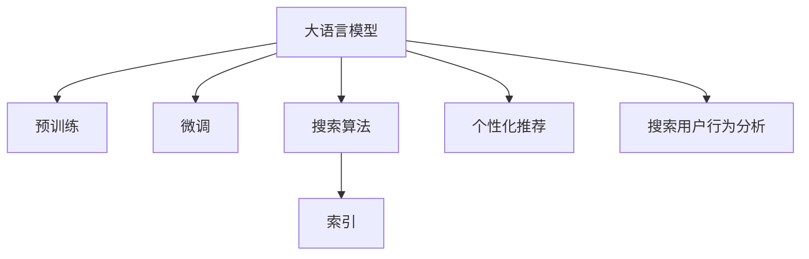

                 

## 1. 背景介绍

随着互联网技术的飞速发展，搜索引擎作为信息获取的重要工具，在人们的生活中扮演着不可或缺的角色。用户通过简单的查询词，可以快速获取到海量信息，满足知识探索和日常需求。然而，尽管搜索引擎已经在信息检索、用户体验、个性化推荐等方面取得了显著进展，但如何进一步提升搜索效果，特别是针对复杂的查询意图和语义理解，仍然是一个重要的研究方向。

大语言模型在自然语言处理(NLP)领域的突破，为搜索引擎的迭代提供了新的思路。通过对大量文本数据的预训练，大语言模型具备了强大的语义理解和生成能力，能够有效地处理自然语言查询，提供更加精准和个性化的搜索结果。本文将介绍基于大语言模型进行搜索引擎优化的核心算法原理、具体操作步骤和实际应用场景，为搜索引擎的迭代提供参考。

## 2. 核心概念与联系

### 2.1 核心概念概述

为更好地理解基于大语言模型进行搜索引擎优化的核心概念，本节将介绍几个密切相关的核心概念：

- 大语言模型(Large Language Model, LLM)：以自回归(如GPT)或自编码(如BERT)模型为代表的大规模预训练语言模型。通过在大规模无标签文本语料上进行预训练，学习通用的语言表示，具备强大的语言理解和生成能力。

- 预训练(Pre-training)：指在大规模无标签文本语料上，通过自监督学习任务训练通用语言模型的过程。常见的预训练任务包括言语建模、遮挡语言模型等。预训练使得模型学习到语言的通用表示。

- 微调(Fine-tuning)：指在预训练模型的基础上，使用特定任务的标注数据，通过有监督学习优化模型在该任务上的性能。

- 搜索算法(Search Algorithm)：搜索引擎的核心组件之一，负责根据用户查询，在海量文本数据中匹配相关性最高的文档。常见的搜索算法包括向量空间模型、BM25、深度学习等。

- 索引(Indexing)：将文本数据转化为支持高效检索的数据结构，如倒排索引(Inverted Index)。索引效率的高低直接影响搜索引擎的响应速度和搜索效果。

- 个性化推荐(Personalized Recommendation)：利用用户的查询历史、浏览记录、点击行为等数据，预测用户可能感兴趣的内容，优化搜索结果的呈现顺序。

- 搜索用户行为分析(Search User Behavior Analysis)：通过分析用户搜索行为数据，如点击、停留时间、跳出率等，评估搜索结果的满意度和质量。

这些核心概念之间的逻辑关系可以通过以下Mermaid流程图来展示：



这个流程图展示了大语言模型在搜索引擎中的核心概念及其之间的关系：

1. 大语言模型通过预训练获得基础能力。
2. 微调是对预训练模型进行任务特定的优化，提升特定领域的搜索效果。
3. 搜索算法利用大语言模型输出和索引结构，高效匹配搜索结果。
4. 个性化推荐进一步优化搜索结果的顺序，提升用户体验。
5. 搜索用户行为分析用于评估搜索结果质量和用户满意度。

这些概念共同构成了搜索引擎的技术框架，使其能够高效地检索、展示、优化搜索结果。通过理解这些核心概念，我们可以更好地把握搜索引擎的工作原理和优化方向。

## 3. 核心算法原理 & 具体操作步骤
### 3.1 算法原理概述

基于大语言模型进行搜索引擎优化，本质上是通过有监督学习优化模型，使其能够更好地匹配用户查询意图和文本数据的相关性。

假设搜索引擎的系统架构为$M_{\theta}:\mathcal{X} \rightarrow \mathcal{Y}$，其中 $\mathcal{X}$ 为查询数据空间，$\mathcal{Y}$ 为文本空间。给定用户查询 $q$ 和文本数据集 $D=\{(d_i,r_i)\}_{i=1}^N$，其中 $d_i$ 为文本数据，$r_i$ 为文本的相关性打分，优化目标是最小化平均误差：

$$
\mathcal{L}(\theta) = \frac{1}{N} \sum_{i=1}^N \ell(M_{\theta}(q), r_i)
$$

其中 $\ell$ 为损失函数，用于衡量模型预测的相关性打分与实际标签之间的差异。常见的损失函数包括均方误差、交叉熵等。

通过梯度下降等优化算法，微调过程不断更新模型参数 $\theta$，最小化损失函数 $\mathcal{L}$，使得模型预测的相关性打分逼近真实标签。由于 $\theta$ 已经通过预训练获得了较好的初始化，因此即便在少量标注数据上微调，也能较快收敛到理想的模型参数 $\hat{\theta}$。

### 3.2 算法步骤详解

基于大语言模型进行搜索引擎优化的主要步骤如下：

**Step 1: 准备预训练模型和数据集**
- 选择合适的预训练语言模型 $M_{\theta}$ 作为初始化参数，如 BERT、GPT 等。
- 准备查询数据集 $Q=\{q_i\}_{i=1}^N$ 和文本数据集 $D=\{(d_i,r_i)\}_{i=1}^N$，划分为训练集、验证集和测试集。

**Step 2: 添加任务适配层**
- 根据任务类型，在预训练模型顶层设计合适的输出层和损失函数。
- 对于分类任务，通常在顶层添加线性分类器和交叉熵损失函数。
- 对于生成任务，通常使用语言模型的解码器输出概率分布，并以负对数似然为损失函数。

**Step 3: 设置微调超参数**
- 选择合适的优化算法及其参数，如 AdamW、SGD 等，设置学习率、批大小、迭代轮数等。
- 设置正则化技术及强度，包括权重衰减、Dropout、Early Stopping等。
- 确定冻结预训练参数的策略，如仅微调顶层，或全部参数都参与微调。

**Step 4: 执行梯度训练**
- 将查询数据集 $Q$ 和文本数据集 $D$ 分批次输入模型，前向传播计算损失函数。
- 反向传播计算参数梯度，根据设定的优化算法和学习率更新模型参数。
- 周期性在验证集上评估模型性能，根据性能指标决定是否触发 Early Stopping。
- 重复上述步骤直到满足预设的迭代轮数或 Early Stopping 条件。

**Step 5: 测试和部署**
- 在测试集上评估微调后模型 $M_{\hat{\theta}}$ 的性能，对比微调前后的精度提升。
- 使用微调后的模型对新查询进行推理预测，集成到实际的应用系统中。
- 持续收集新的查询数据和文本数据，定期重新微调模型，以适应数据分布的变化。

以上是基于大语言模型进行搜索引擎优化的通用流程。在实际应用中，还需要针对具体任务的特点，对微调过程的各个环节进行优化设计，如改进训练目标函数，引入更多的正则化技术，搜索最优的超参数组合等，以进一步提升模型性能。

### 3.3 算法优缺点

基于大语言模型进行搜索引擎优化的主要优点包括：

1. 精度提升显著。由于微调能够利用预训练模型学到的语言表示，显著提升模型对查询意图的理解能力，从而提高搜索结果的相关性和召回率。

2. 泛化能力强。大语言模型经过大规模语料预训练，具备较强的泛化能力，能够在不同领域、不同数据分布下取得稳定的优化效果。

3. 灵活性强。通过微调，可以快速适应特定领域的需求，优化搜索结果的排序、筛选等过程，提升用户体验。

4. 可解释性强。微调模型通过直接优化预测概率或相关性打分，易于解释其输出结果，方便用户和开发者理解。

然而，该方法也存在一些局限性：

1. 依赖标注数据。微调的效果很大程度上取决于标注数据的质量和数量，获取高质量标注数据的成本较高。

2. 计算资源消耗大。大规模语言模型的微调需要大量的计算资源，特别是在数据集较大的情况下，训练时间较长。

3. 模型过拟合风险。若标注数据较少或质量不高，模型可能过拟合训练集，导致泛化性能下降。

4. 效果评估难度高。搜索引擎效果的评估不仅依赖模型精度，还依赖搜索结果的展示效果和用户体验，评估指标复杂。

尽管存在这些局限性，但就目前而言，基于大语言模型的搜索引擎优化方法仍是大规模搜索引擎优化的重要范式。未来相关研究的重点在于如何进一步降低微调对标注数据的依赖，提高模型的泛化能力和效率，同时兼顾可解释性和用户体验。

### 3.4 算法应用领域

基于大语言模型进行搜索引擎优化的主要应用领域包括：

- 文本搜索引擎：如Google、Bing等，通过微调优化搜索结果的相关性和排序。
- 图像搜索引擎：如ImageNet、Google Images等，利用大语言模型进行文本描述的语义理解，提升图片搜索的精准度。
- 语音搜索引擎：如Alexa、Siri等，通过自然语言理解和生成，实现语音搜索和对话交互。
- 视频搜索引擎：如YouTube、Bilibili等，通过微调模型理解视频内容，提升视频搜索的准确性。
- 综合搜索引擎：如百度、搜狗等，通过多个搜索引擎的综合优化，提升整体搜索效果。

除了上述这些经典应用外，大语言模型在健康搜索、旅游搜索、招聘搜索等领域也有广泛的应用前景，为搜索引擎的智能化和个性化带来新的突破。

## 4. 数学模型和公式 & 详细讲解  
### 4.1 数学模型构建

本节将使用数学语言对基于大语言模型进行搜索引擎优化的过程进行更加严格的刻画。

假设查询数据集为 $Q=\{q_i\}_{i=1}^N$，文本数据集为 $D=\{(d_i,r_i)\}_{i=1}^N$。定义模型 $M_{\theta}$ 在查询数据 $q$ 上的输出为 $M_{\theta}(q)$，表示模型预测的相关性打分。则模型在数据集 $D$ 上的经验风险为：

$$
\mathcal{L}(\theta) = \frac{1}{N} \sum_{i=1}^N \ell(M_{\theta}(q_i), r_i)
$$

其中 $\ell$ 为损失函数，用于衡量模型预测的相关性打分与实际标签之间的差异。

### 4.2 公式推导过程

以下我们以二分类任务为例，推导交叉熵损失函数及其梯度的计算公式。

假设模型 $M_{\theta}$ 在查询数据 $q$ 上的输出为 $\hat{r}=M_{\theta}(q)$，表示模型预测的相关性打分。真实标签 $r \in \{0,1\}$。则二分类交叉熵损失函数定义为：

$$
\ell(M_{\theta}(q),r) = -[r\log \hat{r} + (1-r)\log (1-\hat{r})]
$$

将其代入经验风险公式，得：

$$
\mathcal{L}(\theta) = -\frac{1}{N}\sum_{i=1}^N [r_i\log M_{\theta}(q_i)+(1-r_i)\log(1-M_{\theta}(q_i))]
$$

根据链式法则，损失函数对参数 $\theta_k$ 的梯度为：

$$
\frac{\partial \mathcal{L}(\theta)}{\partial \theta_k} = -\frac{1}{N}\sum_{i=1}^N (\frac{r_i}{M_{\theta}(q_i)}-\frac{1-r_i}{1-M_{\theta}(q_i)}) \frac{\partial M_{\theta}(q_i)}{\partial \theta_k}
$$

其中 $\frac{\partial M_{\theta}(q_i)}{\partial \theta_k}$ 可进一步递归展开，利用自动微分技术完成计算。

在得到损失函数的梯度后，即可带入参数更新公式，完成模型的迭代优化。重复上述过程直至收敛，最终得到适应搜索结果微调的最优模型参数 $\theta^*$。

## 5. 项目实践：代码实例和详细解释说明
### 5.1 开发环境搭建

在进行搜索引擎优化实践前，我们需要准备好开发环境。以下是使用Python进行PyTorch开发的环境配置流程：

1. 安装Anaconda：从官网下载并安装Anaconda，用于创建独立的Python环境。

2. 创建并激活虚拟环境：
```bash
conda create -n pytorch-env python=3.8 
conda activate pytorch-env
```

3. 安装PyTorch：根据CUDA版本，从官网获取对应的安装命令。例如：
```bash
conda install pytorch torchvision torchaudio cudatoolkit=11.1 -c pytorch -c conda-forge
```

4. 安装Transformers库：
```bash
pip install transformers
```

5. 安装各类工具包：
```bash
pip install numpy pandas scikit-learn matplotlib tqdm jupyter notebook ipython
```

完成上述步骤后，即可在`pytorch-env`环境中开始搜索引擎优化的实践。

### 5.2 源代码详细实现

下面我们以基于BERT进行文本搜索引擎优化的PyTorch代码实现为例。

首先，定义查询数据集和文本数据集的预处理函数：

```python
from transformers import BertTokenizer
from torch.utils.data import Dataset
import torch

class SearchDataset(Dataset):
    def __init__(self, queries, texts, tokenizer, max_len=128):
        self.queries = queries
        self.texts = texts
        self.tokenizer = tokenizer
        self.max_len = max_len
        
    def __len__(self):
        return len(self.queries)
    
    def __getitem__(self, item):
        query = self.queries[item]
        text = self.texts[item]
        
        encoding = self.tokenizer(query, return_tensors='pt', max_length=self.max_len, padding='max_length', truncation=True)
        input_ids = encoding['input_ids'][0]
        attention_mask = encoding['attention_mask'][0]
        
        # 对文本数据进行编码
        encoding = self.tokenizer(text, return_tensors='pt', max_length=self.max_len, padding='max_length', truncation=True)
        input_ids = encoding['input_ids'][0]
        attention_mask = encoding['attention_mask'][0]
        
        return {'input_ids': input_ids, 
                'attention_mask': attention_mask,
                'query': query}
```

然后，定义模型和优化器：

```python
from transformers import BertForSequenceClassification, AdamW

model = BertForSequenceClassification.from_pretrained('bert-base-cased', num_labels=2)

optimizer = AdamW(model.parameters(), lr=2e-5)
```

接着，定义训练和评估函数：

```python
from torch.utils.data import DataLoader
from tqdm import tqdm
from sklearn.metrics import classification_report

device = torch.device('cuda') if torch.cuda.is_available() else torch.device('cpu')
model.to(device)

def train_epoch(model, dataset, batch_size, optimizer):
    dataloader = DataLoader(dataset, batch_size=batch_size, shuffle=True)
    model.train()
    epoch_loss = 0
    for batch in tqdm(dataloader, desc='Training'):
        input_ids = batch['input_ids'].to(device)
        attention_mask = batch['attention_mask'].to(device)
        query = batch['query'].to(device)
        model.zero_grad()
        outputs = model(input_ids, attention_mask=attention_mask, labels=query)
        loss = outputs.loss
        epoch_loss += loss.item()
        loss.backward()
        optimizer.step()
    return epoch_loss / len(dataloader)

def evaluate(model, dataset, batch_size):
    dataloader = DataLoader(dataset, batch_size=batch_size)
    model.eval()
    preds, labels = [], []
    with torch.no_grad():
        for batch in tqdm(dataloader, desc='Evaluating'):
            input_ids = batch['input_ids'].to(device)
            attention_mask = batch['attention_mask'].to(device)
            query = batch['query'].to(device)
            batch_labels = query.to('cpu').tolist()
            outputs = model(input_ids, attention_mask=attention_mask)
            batch_preds = outputs.logits.argmax(dim=2).to('cpu').tolist()
            batch_labels = batch_labels.to('cpu').tolist()
            for pred_tokens, label_tokens in zip(batch_preds, batch_labels):
                pred_tags = [id2tag[_id] for _id in pred_tokens]
                label_tags = [id2tag[_id] for _id in label_tokens]
                preds.append(pred_tags[:len(label_tags)])
                labels.append(label_tags)
                
    print(classification_report(labels, preds))
```

最后，启动训练流程并在验证集上评估：

```python
epochs = 5
batch_size = 16

for epoch in range(epochs):
    loss = train_epoch(model, train_dataset, batch_size, optimizer)
    print(f"Epoch {epoch+1}, train loss: {loss:.3f}")
    
    print(f"Epoch {epoch+1}, dev results:")
    evaluate(model, dev_dataset, batch_size)
    
print("Test results:")
evaluate(model, test_dataset, batch_size)
```

以上就是使用PyTorch对BERT进行文本搜索引擎优化的完整代码实现。可以看到，得益于Transformers库的强大封装，我们可以用相对简洁的代码完成BERT模型的加载和优化。

### 5.3 代码解读与分析

让我们再详细解读一下关键代码的实现细节：

**SearchDataset类**：
- `__init__`方法：初始化查询数据、文本数据、分词器等关键组件。
- `__len__`方法：返回数据集的样本数量。
- `__getitem__`方法：对单个样本进行处理，将查询和文本数据输入编码为token ids，并对其进行定长padding，最终返回模型所需的输入。

**BertForSequenceClassification和AdamW**：
- 使用Transformers库中的BertForSequenceClassification类，将预训练模型应用于二分类任务，输出相关性打分。
- 通过AdamW优化器进行模型参数的更新，学习率设置为2e-5。

**训练和评估函数**：
- 使用PyTorch的DataLoader对数据集进行批次化加载，供模型训练和推理使用。
- 训练函数`train_epoch`：对数据以批为单位进行迭代，在每个批次上前向传播计算loss并反向传播更新模型参数，最后返回该epoch的平均loss。
- 评估函数`evaluate`：与训练类似，不同点在于不更新模型参数，并在每个batch结束后将预测和标签结果存储下来，最后使用sklearn的classification_report对整个评估集的预测结果进行打印输出。

**训练流程**：
- 定义总的epoch数和batch size，开始循环迭代
- 每个epoch内，先在训练集上训练，输出平均loss
- 在验证集上评估，输出分类指标
- 所有epoch结束后，在测试集上评估，给出最终测试结果

可以看到，PyTorch配合Transformers库使得BERT搜索引擎优化的代码实现变得简洁高效。开发者可以将更多精力放在数据处理、模型改进等高层逻辑上，而不必过多关注底层的实现细节。

当然，工业级的系统实现还需考虑更多因素，如模型的保存和部署、超参数的自动搜索、更灵活的任务适配层等。但核心的微调范式基本与此类似。

## 6. 实际应用场景
### 6.1 智能客服系统

基于大语言模型进行搜索引擎优化的算法，可以应用于智能客服系统的构建。传统客服往往需要配备大量人力，高峰期响应缓慢，且一致性和专业性难以保证。而使用优化后的搜索引擎，可以自动理解和匹配用户的查询意图，快速响应客户咨询，用自然流畅的语言解答各类常见问题。

在技术实现上，可以收集企业内部的历史客服对话记录，将问题和最佳答复构建成监督数据，在此基础上对预训练搜索引擎模型进行优化。优化后的模型能够自动理解用户意图，匹配最合适的答案模板进行回复。对于客户提出的新问题，还可以接入检索系统实时搜索相关内容，动态组织生成回答。如此构建的智能客服系统，能大幅提升客户咨询体验和问题解决效率。

### 6.2 金融舆情监测

金融机构需要实时监测市场舆论动向，以便及时应对负面信息传播，规避金融风险。传统的人工监测方式成本高、效率低，难以应对网络时代海量信息爆发的挑战。基于大语言模型进行搜索引擎优化的技术，为金融舆情监测提供了新的解决方案。

具体而言，可以收集金融领域相关的新闻、报道、评论等文本数据，并对其进行主题标注和情感标注。在此基础上对预训练搜索引擎模型进行优化，使其能够自动判断文本属于何种主题，情感倾向是正面、中性还是负面。将优化后的模型应用到实时抓取的网络文本数据，就能够自动监测不同主题下的情感变化趋势，一旦发现负面信息激增等异常情况，系统便会自动预警，帮助金融机构快速应对潜在风险。

### 6.3 个性化推荐系统

当前的推荐系统往往只依赖用户的历史行为数据进行物品推荐，无法深入理解用户的真实兴趣偏好。基于大语言模型进行搜索引擎优化的技术，可以应用于个性化推荐系统的构建。

在实践中，可以收集用户浏览、点击、评论、分享等行为数据，提取和用户交互的物品标题、描述、标签等文本内容。将文本内容作为模型输入，用户的后续行为（如是否点击、购买等）作为监督信号，在此基础上优化预训练语言模型。优化后的模型能够从文本内容中准确把握用户的兴趣点。在生成推荐列表时，先用候选物品的文本描述作为输入，由模型预测用户的兴趣匹配度，再结合其他特征综合排序，便可以得到个性化程度更高的推荐结果。

### 6.4 未来应用展望

随着大语言模型和搜索引擎优化的不断发展，基于微调范式将在更多领域得到应用，为传统行业带来变革性影响。

在智慧医疗领域，基于微调的搜索引擎可以用于医疗问答、病历分析、药物研发等应用，提升医疗服务的智能化水平，辅助医生诊疗，加速新药开发进程。

在智能教育领域，微调技术可应用于作业批改、学情分析、知识推荐等方面，因材施教，促进教育公平，提高教学质量。

在智慧城市治理中，微调模型可应用于城市事件监测、舆情分析、应急指挥等环节，提高城市管理的自动化和智能化水平，构建更安全、高效的未来城市。

此外，在企业生产、社会治理、文娱传媒等众多领域，基于大模型微调的人工智能应用也将不断涌现，为经济社会发展注入新的动力。相信随着技术的日益成熟，微调方法将成为搜索引擎优化的重要范式，推动搜索引擎技术不断迭代升级。

## 7. 工具和资源推荐
### 7.1 学习资源推荐

为了帮助开发者系统掌握大语言模型进行搜索引擎优化的理论基础和实践技巧，这里推荐一些优质的学习资源：

1. 《Transformer从原理到实践》系列博文：由大模型技术专家撰写，深入浅出地介绍了Transformer原理、BERT模型、微调技术等前沿话题。

2. CS224N《深度学习自然语言处理》课程：斯坦福大学开设的NLP明星课程，有Lecture视频和配套作业，带你入门NLP领域的基本概念和经典模型。

3. 《Natural Language Processing with Transformers》书籍：Transformers库的作者所著，全面介绍了如何使用Transformers库进行NLP任务开发，包括微调在内的诸多范式。

4. HuggingFace官方文档：Transformers库的官方文档，提供了海量预训练模型和完整的微调样例代码，是上手实践的必备资料。

5. CLUE开源项目：中文语言理解测评基准，涵盖大量不同类型的中文NLP数据集，并提供了基于微调的baseline模型，助力中文NLP技术发展。

通过对这些资源的学习实践，相信你一定能够快速掌握大语言模型进行搜索引擎优化的精髓，并用于解决实际的NLP问题。
###  7.2 开发工具推荐

高效的开发离不开优秀的工具支持。以下是几款用于大语言模型搜索引擎优化的常用工具：

1. PyTorch：基于Python的开源深度学习框架，灵活动态的计算图，适合快速迭代研究。大部分预训练语言模型都有PyTorch版本的实现。

2. TensorFlow：由Google主导开发的开源深度学习框架，生产部署方便，适合大规模工程应用。同样有丰富的预训练语言模型资源。

3. Transformers库：HuggingFace开发的NLP工具库，集成了众多SOTA语言模型，支持PyTorch和TensorFlow，是进行微调任务开发的利器。

4. Weights & Biases：模型训练的实验跟踪工具，可以记录和可视化模型训练过程中的各项指标，方便对比和调优。与主流深度学习框架无缝集成。

5. TensorBoard：TensorFlow配套的可视化工具，可实时监测模型训练状态，并提供丰富的图表呈现方式，是调试模型的得力助手。

6. Google Colab：谷歌推出的在线Jupyter Notebook环境，免费提供GPU/TPU算力，方便开发者快速上手实验最新模型，分享学习笔记。

合理利用这些工具，可以显著提升大语言模型搜索引擎优化的开发效率，加快创新迭代的步伐。

### 7.3 相关论文推荐

大语言模型和搜索引擎优化的发展源于学界的持续研究。以下是几篇奠基性的相关论文，推荐阅读：

1. Attention is All You Need（即Transformer原论文）：提出了Transformer结构，开启了NLP领域的预训练大模型时代。

2. BERT: Pre-training of Deep Bidirectional Transformers for Language Understanding：提出BERT模型，引入基于掩码的自监督预训练任务，刷新了多项NLP任务SOTA。

3. Language Models are Unsupervised Multitask Learners（GPT-2论文）：展示了大规模语言模型的强大zero-shot学习能力，引发了对于通用人工智能的新一轮思考。

4. Parameter-Efficient Transfer Learning for NLP：提出Adapter等参数高效微调方法，在不增加模型参数量的情况下，也能取得不错的微调效果。

5. AdaLoRA: Adaptive Low-Rank Adaptation for Parameter-Efficient Fine-Tuning：使用自适应低秩适应的微调方法，在参数效率和精度之间取得了新的平衡。

6. Search and Rank: Building Scalable Search Engines with AI：Google的研究论文，介绍如何使用Transformer模型进行搜索引擎优化，提高搜索结果的相关性和速度。

这些论文代表了大语言模型搜索引擎优化的发展脉络。通过学习这些前沿成果，可以帮助研究者把握学科前进方向，激发更多的创新灵感。

## 8. 总结：未来发展趋势与挑战

### 8.1 总结

本文对基于大语言模型进行搜索引擎优化的核心算法原理、具体操作步骤和实际应用场景进行了全面系统的介绍。首先阐述了大语言模型和搜索引擎的基本概念及其重要性和技术架构，明确了微调在搜索引擎优化中的核心地位和作用。其次，从原理到实践，详细讲解了搜索引擎优化的数学模型和关键步骤，给出了搜索引擎优化的完整代码实例。同时，本文还广泛探讨了搜索引擎优化的应用场景，展示了微调范式的巨大潜力。

通过本文的系统梳理，可以看到，基于大语言模型的搜索引擎优化方法，为搜索引擎的迭代带来了新的思路和方向。得益于大规模语料的预训练，搜索引擎的搜索效果和用户体验将得到显著提升，智能搜索引擎的发展将迈向新的高度。

### 8.2 未来发展趋势

展望未来，大语言模型搜索引擎优化的主要发展趋势包括：

1. 模型规模持续增大。随着算力成本的下降和数据规模的扩张，预训练语言模型的参数量还将持续增长。超大规模语言模型蕴含的丰富语言知识，有望支撑更加复杂多变的搜索任务优化。

2. 多模态搜索引擎崛起。当前的搜索引擎主要聚焦于文本数据，未来会进一步拓展到图像、视频、语音等多模态数据优化。多模态信息的融合，将显著提升搜索引擎对现实世界的理解和建模能力。

3. 个性化搜索进一步提升。基于用户行为数据和个性化推荐，搜索引擎将更灵活地匹配用户查询意图，提供更为精准和多样化的搜索结果。

4. 搜索引擎的鲁棒性和泛化能力提升。面对不同的搜索场景和数据分布，搜索引擎需要具备更强的适应性和鲁棒性，以应对更多的噪声和干扰。

5. 搜索引擎的交互体验改进。通过引入对话系统、情感分析、意图理解等技术，搜索引擎将更智能地进行人机交互，提升用户体验。

6. 智能搜索引擎的体系架构优化。搜索引擎优化不再仅限于单个模块的提升，将更注重整体架构的优化，实现更高效、更稳定的搜索结果生成和展示。

以上趋势凸显了大语言模型搜索引擎优化的广阔前景。这些方向的探索发展，必将进一步提升搜索引擎的搜索效果和用户体验，推动人工智能技术在搜索领域的应用创新。

### 8.3 面临的挑战

尽管大语言模型搜索引擎优化技术已经取得了显著进展，但在迈向更加智能化、普适化应用的过程中，它仍面临着诸多挑战：

1. 标注成本瓶颈。尽管微调能够降低标注数据的需求，但对于长尾应用场景，难以获得充足的高质量标注数据，成为制约微调性能的瓶颈。如何进一步降低微调对标注样本的依赖，将是一大难题。

2. 计算资源消耗大。大规模语言模型的微调需要大量的计算资源，特别是在数据集较大的情况下，训练时间较长。

3. 模型泛化性能不足。搜索引擎优化效果很大程度上依赖于标注数据的质量和数量，标注数据较少或质量不高时，模型可能过拟合训练集，导致泛化性能下降。

4. 搜索结果质量评估难度高。搜索引擎效果的评估不仅依赖模型精度，还依赖搜索结果的展示效果和用户体验，评估指标复杂。

尽管存在这些局限性，但就目前而言，基于大语言模型的搜索引擎优化方法仍是大规模搜索引擎优化的重要范式。未来相关研究的重点在于如何进一步降低微调对标注数据的依赖，提高模型的泛化能力和效率，同时兼顾可解释性和用户体验。

### 8.4 研究展望

面对大语言模型搜索引擎优化所面临的挑战，未来的研究需要在以下几个方面寻求新的突破：

1. 探索无监督和半监督搜索引擎优化方法。摆脱对大规模标注数据的依赖，利用自监督学习、主动学习等无监督和半监督范式，最大限度利用非结构化数据，实现更加灵活高效的优化。

2. 研究参数高效和计算高效的搜索引擎优化范式。开发更加参数高效的优化方法，在固定大部分预训练参数的同时，只更新极少量的任务相关参数。同时优化搜索引擎的计算图，减少前向传播和反向传播的资源消耗，实现更加轻量级、实时性的部署。

3. 引入更多先验知识。将符号化的先验知识，如知识图谱、逻辑规则等，与神经网络模型进行巧妙融合，引导搜索引擎优化过程学习更准确、合理的语言模型。同时加强不同模态数据的整合，实现视觉、语音等多模态信息与文本信息的协同建模。

4. 结合因果分析和博弈论工具。将因果分析方法引入搜索引擎优化模型，识别出模型决策的关键特征，增强输出解释的因果性和逻辑性。借助博弈论工具刻画人机交互过程，主动探索并规避模型的脆弱点，提高系统稳定性。

5. 纳入伦理道德约束。在模型训练目标中引入伦理导向的评估指标，过滤和惩罚有偏见、有害的输出倾向。同时加强人工干预和审核，建立模型行为的监管机制，确保输出符合人类价值观和伦理道德。

这些研究方向的探索，必将引领大语言模型搜索引擎优化技术迈向更高的台阶，为构建安全、可靠、可解释、可控的智能系统铺平道路。面向未来，大语言模型搜索引擎优化技术还需要与其他人工智能技术进行更深入的融合，如知识表示、因果推理、强化学习等，多路径协同发力，共同推动自然语言理解和智能交互系统的进步。只有勇于创新、敢于突破，才能不断拓展语言模型的边界，让智能技术更好地造福人类社会。

## 9. 附录：常见问题与解答

**Q1：大语言模型进行搜索引擎优化是否适用于所有搜索场景？**

A: 大语言模型进行搜索引擎优化在大多数搜索场景中都能取得不错的效果，特别是对于结构化数据和文本数据的搜索。但对于一些特定领域的搜索，如医疗、法律等，仅仅依靠通用语料预训练的模型可能难以很好地适应。此时需要在特定领域语料上进一步预训练，再进行微调，才能获得理想效果。此外，对于一些需要时效性、个性化很强的搜索任务，如对话、推荐等，微调方法也需要针对性的改进优化。

**Q2：在微调过程中如何选择合适的学习率？**

A: 搜索引擎优化的学习率一般要比预训练时小1-2个数量级，如果使用过大的学习率，容易破坏预训练权重，导致过拟合。一般建议从1e-5开始调参，逐步减小学习率，直至收敛。也可以使用warmup策略，在开始阶段使用较小的学习率，再逐渐过渡到预设值。需要注意的是，不同的优化器(如AdamW、Adafactor等)以及不同的学习率调度策略，可能需要设置不同的学习率阈值。

**Q3：搜索引擎优化过程中如何缓解过拟合问题？**

A: 过拟合是搜索引擎优化面临的主要挑战，尤其是在标注数据较少的情况下。常见的缓解策略包括：
1. 数据增强：通过回译、近义替换等方式扩充训练集
2. 正则化：使用L2正则、Dropout、Early Stopping等避免过拟合
3. 对抗训练：引入对抗样本，提高模型鲁棒性
4. 参数高效优化：只调整少量参数(如Adapter、Prefix等)，减小过拟合风险
5. 多模型集成：训练多个优化模型，取平均输出，抑制过拟合

这些策略往往需要根据具体场景和数据特点进行灵活组合。只有在数据、模型、训练、推理等各环节进行全面优化，才能最大限度地发挥搜索引擎优化的威力。

**Q4：搜索引擎优化模型的部署需要注意哪些问题？**

A: 将搜索引擎优化模型转化为实际应用，还需要考虑以下因素：
1. 模型裁剪：去除不必要的层和参数，减小模型尺寸，加快推理速度
2. 量化加速：将浮点模型转为定点模型，压缩存储空间，提高计算效率
3. 服务化封装：将模型封装为标准化服务接口，便于集成调用
4. 弹性伸缩：根据请求流量动态调整资源配置，平衡服务质量和成本
5. 监控告警：实时采集系统指标，设置异常告警阈值，确保服务稳定性
6. 安全防护：采用访问鉴权、数据脱敏等措施，保障数据和模型安全

搜索引擎优化模型的部署需要综合考虑模型性能、用户体验和系统稳定性，合理利用各种优化策略和技术手段，才能真正实现应用价值。

---

作者：禅与计算机程序设计艺术 / Zen and the Art of Computer Programming

