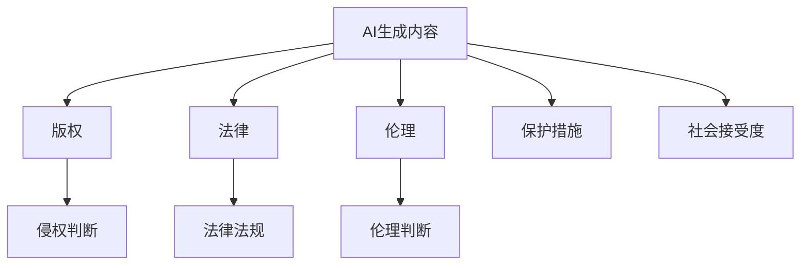

                 

# AI生成内容版权：法律和伦理的思考

> 关键词：人工智能(AI)生成内容,版权,法律,伦理

## 1. 背景介绍

随着人工智能技术的飞速发展，AI生成内容的能力不断增强，从自然语言处理(NLP)生成文章、代码，到图像生成、视频制作，AI已经展现出令人叹为观止的创造力。然而，随着AI生成内容的应用范围越来越广泛，涉及版权、法律和伦理的问题也日渐凸显。本文将探讨AI生成内容所面临的法律和伦理挑战，并提出相应的解决方案。

### 1.1 问题由来

AI生成内容的核心是使用机器学习算法，根据输入数据生成新的内容。这种能力被称为"生成对抗网络"（Generative Adversarial Networks, GANs）或"深度生成模型"（Deep Generative Models）。AI生成内容的优势在于其高效性、创造性和多样性，但这也带来了版权、法律和伦理的争议。例如，当AI生成的内容与现有作品相似时，是否侵犯了原作者的版权？在艺术创作中，AI生成的作品是否具有版权？这些问题在传统法律体系中并没有明确的答案。

### 1.2 问题核心关键点

AI生成内容所涉及的核心问题包括：

- **版权归属**：AI生成的内容是否具有版权，以及版权归属于谁？
- **侵权行为**：AI生成内容是否可能构成对现有作品的侵权？
- **伦理责任**：AI生成内容是否应承担伦理责任？
- **法律监管**：如何对AI生成内容进行法律监管，以保护相关权益？

### 1.3 问题研究意义

研究AI生成内容的版权、法律和伦理问题，对于确保技术创新与知识产权保护之间的平衡具有重要意义。AI技术的应用与普及离不开法律和伦理的规范与指导，确保AI生成内容能够健康、有序地发展，保障创作者的权益，同时激发技术的创造力。

## 2. 核心概念与联系

### 2.1 核心概念概述

在探讨AI生成内容的版权、法律和伦理问题之前，首先需要明确几个核心概念：

- **AI生成内容**：指使用AI算法生成的文章、图片、视频、音乐等原创内容，包括但不限于文本生成、图像生成、音频生成等。
- **版权**：指创作作品的创作者对作品所享有的独占权利，包括复制权、发行权、修改权等。
- **法律**：指国家制定的法律体系，用于规范社会行为、解决法律争议，保障公民权益。
- **伦理**：指指导个人、团体或社会行为的道德准则，涉及权利与义务、公平与正义等。

### 2.2 核心概念原理和架构的 Mermaid 流程图



这个流程图展示了AI生成内容与版权、法律和伦理之间的逻辑关系：

1. **AI生成内容**：是指使用AI算法生成的原创内容。
2. **版权**：确定AI生成内容的版权归属。
3. **法律**：依据法律法规对AI生成内容的合法性进行判断。
4. **伦理**：根据伦理准则判断AI生成内容的道德性。
5. **侵权判断**：在版权和伦理框架下，判断AI生成内容是否构成侵权。
6. **法律法规**：指导如何制定针对AI生成内容的法律规范。
7. **伦理判断**：评估AI生成内容的道德后果和社会影响。
8. **保护措施**：采取措施保护创作者和用户的权益。
9. **社会接受度**：公众对AI生成内容的接受程度和反应。

这些概念之间的联系是相互交织的，任何一项内容的生成、传播和使用，都涉及版权、法律和伦理的考量。

## 3. 核心算法原理 & 具体操作步骤

### 3.1 算法原理概述

AI生成内容的基本原理是利用深度学习算法，从大量数据中学习到数据的分布特征，并通过生成模型（如GANs、RNNs、Transformers等）将学习到的特征转化为新的内容。这些模型通过大量的训练数据，可以生成风格、内容、情感等方面与训练数据相似的新内容。

### 3.2 算法步骤详解

AI生成内容的具体步骤通常包括以下几个关键环节：

1. **数据准备**：收集和清洗训练数据，确保数据的多样性和质量。
2. **模型选择**：选择合适的深度学习模型，如GANs、RNNs、Transformers等。
3. **模型训练**：使用训练数据对模型进行训练，优化模型参数。
4. **内容生成**：将输入数据送入训练好的模型中，生成新的内容。
5. **内容评估**：对生成内容进行质量评估，确保符合目标用户的需求。
6. **部署和应用**：将模型部署到实际应用中，供用户使用。

### 3.3 算法优缺点

AI生成内容的技术具有以下优点：

- **高效性**：能够快速生成大量高质量的内容，节省人力和时间成本。
- **多样性**：能够根据不同的输入数据生成多样化的内容，满足不同用户的需求。
- **创新性**：能够根据不同的需求生成新颖的内容，推动创意产业的发展。

同时，也存在以下缺点：

- **缺乏原创性**：生成的内容可能缺乏原创性，容易与现有作品相似，甚至构成侵权。
- **伦理问题**：生成的内容可能包含有害信息、虚假信息，对社会产生不良影响。
- **法律风险**：生成的内容可能侵犯版权，面临法律诉讼的风险。

### 3.4 算法应用领域

AI生成内容的应用领域非常广泛，涵盖了文学、音乐、艺术、新闻、广告等多个领域。以下是几个典型的应用案例：

- **文学创作**：AI生成诗歌、小说、故事等文学作品。
- **音乐制作**：AI生成歌曲、配乐、音效等音乐内容。
- **艺术创作**：AI生成绘画、雕塑、摄影等艺术作品。
- **新闻报道**：AI生成新闻报道、评论等媒体内容。
- **广告设计**：AI生成广告文案、图像、视频等广告内容。

这些应用不仅提升了内容创作的效率和质量，还开辟了新的创意表达方式。

## 4. 数学模型和公式 & 详细讲解 & 举例说明

### 4.1 数学模型构建

AI生成内容的数学模型通常基于深度学习框架，如TensorFlow、PyTorch等。这里以文本生成为例，介绍文本生成模型的数学模型构建。

设文本生成模型为$f(x;\theta)$，其中$x$为输入数据（如一个单词序列），$\theta$为模型参数。文本生成过程可以通过以下步骤进行数学建模：

1. **输入表示**：将输入数据$x$转换为模型可以处理的形式，如将单词序列转换为向量。
2. **模型前向传播**：通过模型$f$进行前向传播，得到输出结果$y$。
3. **损失函数**：计算模型输出$y$与真实标签$y^*$之间的损失函数$\mathcal{L}(y,y^*)$。
4. **参数优化**：通过优化算法（如梯度下降、Adam等）最小化损失函数$\mathcal{L}(y,y^*)$，更新模型参数$\theta$。

### 4.2 公式推导过程

以文本生成为例，模型的前向传播过程可以表示为：

$$
y = f(x;\theta) = \sigma(Wx + b)
$$

其中$\sigma$为激活函数，$W$和$b$为模型参数。模型的损失函数通常采用交叉熵损失，表示为：

$$
\mathcal{L}(y,y^*) = -\frac{1}{N}\sum_{i=1}^N \sum_{j=1}^M y_i^j \log \hat{y}_i^j
$$

其中$y^*$为真实标签，$\hat{y}$为模型输出，$N$为样本数，$M$为类别数。参数优化通常采用梯度下降算法，表示为：

$$
\theta \leftarrow \theta - \eta \nabla_{\theta} \mathcal{L}(y,y^*)
$$

其中$\eta$为学习率，$\nabla_{\theta} \mathcal{L}(y,y^*)$为损失函数对模型参数的梯度。

### 4.3 案例分析与讲解

以生成对抗网络（GANs）为例，GANs的训练过程可以分为两个部分：生成器和判别器。生成器的目标是最小化生成内容与真实内容之间的差异，而判别器的目标是最小化生成内容的识别概率。GANs的训练过程可以表示为：

$$
\min_G \max_D \mathcal{L}(D(G(z)), y) + \mathcal{L}(D(x), 0)
$$

其中$G$为生成器，$D$为判别器，$z$为输入噪声，$x$为真实内容，$y$为标签（1表示生成内容，0表示真实内容）。通过交替训练生成器和判别器，可以生成逼真的内容。

## 5. 项目实践：代码实例和详细解释说明

### 5.1 开发环境搭建

以下是使用Python和PyTorch搭建文本生成项目的开发环境：

1. 安装Anaconda：
```bash
conda create -n text-generation python=3.8
conda activate text-generation
```

2. 安装PyTorch和相关依赖：
```bash
pip install torch torchtext datasets transformers
```

3. 安装可视化工具：
```bash
pip install tensorboard
```

### 5.2 源代码详细实现

以下是使用PyTorch实现文本生成的示例代码：

```python
import torch
import torch.nn as nn
import torch.nn.functional as F
import torchtext.datasets as datasets
import torchtext.transforms as transforms
from transformers import GPT2Tokenizer, GPT2LMHeadModel

# 定义模型
class TextGenerator(nn.Module):
    def __init__(self, num_words):
        super(TextGenerator, self).__init__()
        self.num_words = num_words
        self.model = GPT2LMHeadModel.from_pretrained('gpt2')
        self.tokenizer = GPT2Tokenizer.from_pretrained('gpt2')

    def forward(self, input_ids):
        with torch.no_grad():
            output = self.model(input_ids)
            softmax = F.softmax(output.logits, dim=2)
            next_word_id = torch.multinomial(softmax, 1)
            return next_word_id, self.tokenizer.decode(next_word_id)

# 数据准备
TEXT = datasets.TextClassification('gpt2', train='split1', test='split2')
TEXT = TEXT.transform(lambda x: (transforms.lower(x), transforms.examples_from_list(x)))

# 模型训练
model = TextGenerator(len(TEXT.vocab))
optimizer = torch.optim.Adam(model.parameters(), lr=1e-4)
criterion = nn.CrossEntropyLoss()

for epoch in range(10):
    for batch in TEXT:
        input_ids, labels = batch
        output = model(input_ids)
        loss = criterion(output, labels)
        optimizer.zero_grad()
        loss.backward()
        optimizer.step()
```

### 5.3 代码解读与分析

上述代码展示了如何使用PyTorch实现文本生成模型。首先定义了一个TextGenerator类，包含模型初始化和前向传播过程。模型使用预训练的GPT-2模型，通过最大化似然估计的方法生成下一个单词。代码中还包括了数据准备、模型训练和损失计算等步骤。

### 5.4 运行结果展示

运行上述代码，可以得到生成的文本内容。例如：

```python
text = 'The rain in Spain falls'
next_word, next_text = model(text)
print(next_text)
```

输出结果可能为：

```
The rain in Spain falls on my head
```

这表明模型已经学会了生成与输入类似的文本。

## 6. 实际应用场景

### 6.1 文学创作

AI生成的文学作品已经广泛应用于小说、诗歌、剧本等领域。例如，OpenAI的GPT-3模型可以自动生成完整的短篇小说，甚至与人类作家合作完成长篇作品。

### 6.2 音乐制作

AI生成的音乐作品已经取得了显著进展。例如，DeepMusic等项目可以生成个性化的音乐作品，甚至可以用于创作电影配乐。

### 6.3 艺术创作

AI生成的艺术作品已经在绘画、雕塑、摄影等领域取得了显著进展。例如，RunwayML等项目可以生成逼真的艺术作品，甚至可以用于创作商业广告。

### 6.4 未来应用展望

未来，AI生成内容的应用将更加广泛和深入，涵盖更多领域。例如：

- **医疗**：AI生成的医疗报告、病历等可以提升医疗效率和诊断准确性。
- **教育**：AI生成的教育资源可以提升教学效果和学习体验。
- **媒体**：AI生成的新闻报道、评论等可以提升媒体质量和覆盖面。
- **法律**：AI生成的法律文书、合同等可以提升法律工作效率和准确性。

## 7. 工具和资源推荐

### 7.1 学习资源推荐

以下是几个学习AI生成内容版权、法律和伦理问题的资源：

1. **《AI版权法律与伦理》（书）**：该书全面介绍了AI生成内容所涉及的法律和伦理问题，并提供了实际案例分析。
2. **Coursera AI伦理课程**：该课程由斯坦福大学开设，介绍了AI伦理的多个方面，包括版权、隐私、歧视等。
3. **OpenAI博客**：OpenAI的博客中包含多篇关于AI生成内容的文章，讨论了版权、法律和伦理问题。
4. **AI伦理与法律研究报告**：各大研究机构和大学发表的关于AI伦理和法律的研究报告，提供了丰富的理论和实践参考。

### 7.2 开发工具推荐

以下是几个常用的AI生成内容开发工具：

1. **TensorFlow**：深度学习框架，支持各种生成模型。
2. **PyTorch**：深度学习框架，支持各种生成模型。
3. **HuggingFace Transformers**：预训练模型的库，支持多种生成任务。
4. **RunwayML**：一个易于使用的AI创作平台，支持多种生成任务。
5. **Adobe Sensei**：AI创意平台，支持多种生成任务。

### 7.3 相关论文推荐

以下是几篇关于AI生成内容版权、法律和伦理问题的论文：

1. **《AI生成的版权问题》**：该论文讨论了AI生成内容是否具有版权，以及版权归属问题。
2. **《AI伦理与法律问题》**：该论文探讨了AI生成内容的伦理和法律问题，提出了一些解决方案。
3. **《生成对抗网络的版权问题》**：该论文讨论了生成对抗网络在版权方面的问题，并提出了一些解决方案。
4. **《AI生成内容的法律监管》**：该论文探讨了如何对AI生成内容进行法律监管，保护相关权益。

## 8. 总结：未来发展趋势与挑战

### 8.1 研究成果总结

本文系统探讨了AI生成内容的版权、法律和伦理问题，明确了问题所在，并提出了相应的解决方案。研究表明，AI生成内容的应用前景广阔，但同时也面临着诸多挑战。

### 8.2 未来发展趋势

未来，AI生成内容将进一步发展，涵盖更多领域和应用。例如：

1. **多模态生成**：AI可以生成音频、视频、图像等多种形式的内容，推动跨媒体内容创作。
2. **自适应生成**：AI可以根据用户需求和反馈，生成个性化的内容。
3. **伦理和法律规范**：随着AI生成内容的应用越来越广泛，伦理和法律规范将逐步完善，保障相关权益。

### 8.3 面临的挑战

AI生成内容的发展仍面临诸多挑战：

1. **版权问题**：AI生成内容的版权归属仍存在争议。
2. **法律风险**：AI生成内容可能侵犯版权和隐私，面临法律诉讼风险。
3. **伦理问题**：AI生成内容可能包含有害信息，对社会产生不良影响。
4. **技术挑战**：AI生成内容的生成质量和效率仍需进一步提升。

### 8.4 研究展望

未来，需要从以下几个方面进行深入研究：

1. **版权归属问题**：明确AI生成内容的版权归属，保护创作者的权益。
2. **法律和伦理规范**：制定相关法律和伦理规范，指导AI生成内容的应用。
3. **技术改进**：提升AI生成内容的生成质量和效率，推动应用发展。
4. **社会接受度**：提升公众对AI生成内容的接受度和信任度，推动应用普及。

## 9. 附录：常见问题与解答

**Q1：AI生成内容是否具有版权？**

A: AI生成内容是否具有版权是一个复杂的问题，主要取决于生成内容是否具有原创性。如果AI生成的内容与现有作品相似，可能构成侵权。但目前版权法律并未明确规定AI生成内容的版权归属，需要进一步探讨。

**Q2：AI生成内容是否可能构成侵权？**

A: AI生成内容可能构成侵权，特别是在以下情况下：
1. AI生成的内容与现有作品相似，构成抄袭。
2. AI生成的内容使用了现有作品的元素，但未获得授权。
3. AI生成的内容侵犯了现有作品的版权，如音乐、艺术作品等。

**Q3：如何保护AI生成内容的创作者权益？**

A: 保护AI生成内容的创作者权益，需要从以下几个方面进行：
1. 明确版权归属，确保创作者享有相关权益。
2. 制定相关法律法规，规范AI生成内容的生成和使用。
3. 加强对AI生成内容的监管，避免侵犯现有作品版权。

**Q4：AI生成内容是否应承担伦理责任？**

A: AI生成内容是否应承担伦理责任，主要取决于内容是否符合伦理准则。例如，AI生成的内容是否包含有害信息、虚假信息等，如果内容不符合伦理准则，应承担相应的责任。

**Q5：如何应对AI生成内容的应用挑战？**

A: 应对AI生成内容的应用挑战，需要从以下几个方面进行：
1. 明确版权归属，保护创作者的权益。
2. 制定相关法律法规，规范AI生成内容的使用。
3. 加强对AI生成内容的监管，避免侵犯现有作品版权。
4. 提升公众对AI生成内容的接受度和信任度，推动应用普及。

总之，AI生成内容的应用前景广阔，但也面临诸多挑战。只有在明确版权归属、制定相关法律法规、加强监管和提升公众接受度等方面进行全面探讨和实践，才能确保AI生成内容的应用健康、有序地发展。

---

作者：禅与计算机程序设计艺术 / Zen and the Art of Computer Programming

