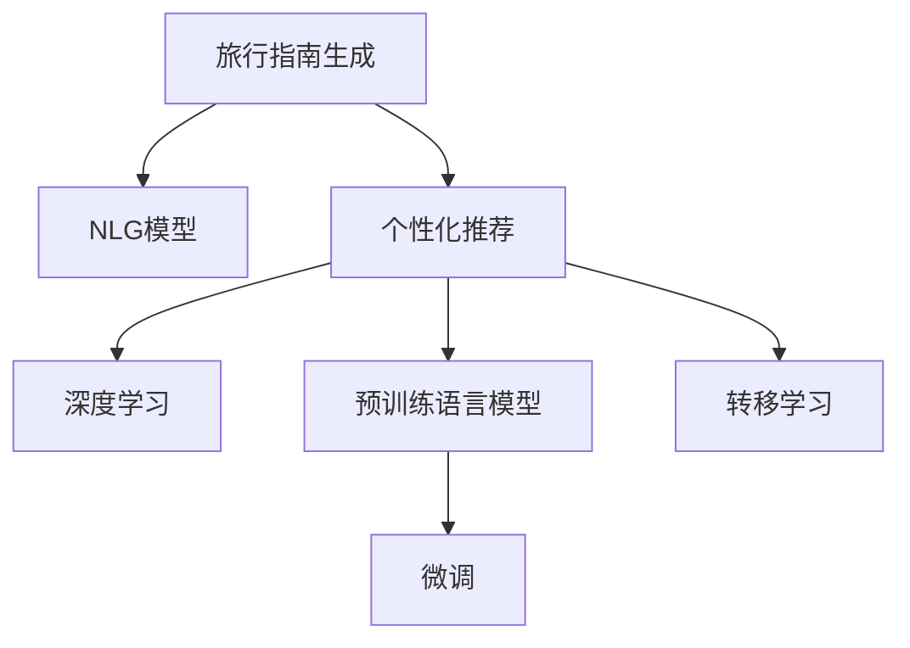

                 

## 1. 背景介绍

### 1.1 问题由来

在全球化和互联网时代，旅游已不再是一个遥远的梦想。人们越来越希望能够自由地探索世界各地，体验不同的文化和生活方式。然而，旅游的决策过程往往充满了不确定性和信息过载，需要耗费大量时间和精力。如何帮助用户快速找到适合自己的目的地，成为当前技术社区的一个重要课题。

### 1.2 问题核心关键点

AI生成的旅行指南旨在利用人工智能技术，根据用户的个性化需求，生成定制化的旅游建议和描述。这些建议不仅包括目的地的基本信息，如气候、交通、住宿等，还包含丰富的背景知识和文化内涵，帮助用户更好地理解目的地，做出更明智的旅游决策。

### 1.3 问题研究意义

AI生成的旅行指南具有以下重要意义：

1. **提升旅游体验**：通过个性化的建议，用户能够更快、更全面地了解目的地，从而获得更满意的旅游体验。
2. **降低决策成本**：利用AI技术，用户可以在短时间内获得详细的旅行信息，减少决策时间和成本。
3. **优化旅游流量**：合理的旅游建议能够帮助用户分散旅游热点，优化旅游资源的分配和利用。
4. **促进文化交流**：个性化的描述能够增加用户对目的地的理解和兴趣，促进不同文化之间的交流和理解。
5. **推动旅游业发展**：通过精准的市场细分，AI旅行指南能够为特定的旅游目的地带来更多的客流量，推动当地旅游业的发展。

## 2. 核心概念与联系

### 2.1 核心概念概述

为更好地理解AI生成的旅行指南，本节将介绍几个密切相关的核心概念：

- **旅行指南生成**：通过自然语言生成(NLG)技术，根据用户输入的需求，自动生成个性化的旅行建议和描述。
- **自然语言生成(NLG)**：指通过计算机自动生成自然语言文本的技术，包括文本生成、摘要生成、对话生成等。
- **个性化推荐系统**：通过用户画像、行为数据等，为用户推荐个性化的内容和服务。
- **深度学习与生成模型**：利用深度神经网络进行模型训练，以生成高质量的自然语言文本。
- **预训练语言模型(PLM)**：如GPT、BERT等，通过大规模语料库进行预训练，具备强大的语言生成能力。
- **转移学习与微调**：通过在大规模数据上预训练的模型，在小规模数据上进行微调，以适应特定任务。

这些核心概念之间的逻辑关系可以通过以下Mermaid流程图来展示：



这个流程图展示了个性化旅行指南生成的核心概念及其之间的关系：

1. 旅行指南生成依赖于自然语言生成模型。
2. 个性化推荐系统通过用户画像和行为数据，为生成过程提供更精准的用户需求。
3. 深度学习和生成模型是旅行指南生成的技术基础。
4. 预训练语言模型为模型训练提供了初始化的权重，并通过微调进一步优化模型性能。
5. 转移学习使得模型能够在大规模数据上预训练，在特定任务上进行微调，提高模型的泛化能力。

这些概念共同构成了旅行指南生成的技术框架，使其能够根据用户需求，自动生成个性化的旅行建议和描述。

## 3. 核心算法原理 & 具体操作步骤

### 3.1 算法原理概述

AI生成的旅行指南基于自然语言生成(NLG)技术，通过预训练语言模型和转移学习的范式，生成个性化的旅行描述。其核心思想是：利用大规模语料库训练出的预训练语言模型，通过微调学习特定领域的数据集，生成适应特定需求和场景的自然语言文本。

形式化地，假设旅行指南生成模型为 $G(\theta)$，其中 $\theta$ 为模型参数。给定用户需求 $D$，旅行指南生成的目标是最小化用户对生成的描述的满意度损失函数 $L(G(\theta), D)$，即：

$$
\theta^* = \mathop{\arg\min}_{\theta} L(G(\theta), D)
$$

在实践中，我们通常使用基于梯度的优化算法（如Adam、SGD等）来近似求解上述最优化问题。设 $\eta$ 为学习率，则参数的更新公式为：

$$
\theta \leftarrow \theta - \eta \nabla_{\theta}L(G(\theta), D)
$$

其中 $\nabla_{\theta}L(G(\theta), D)$ 为损失函数对模型参数 $\theta$ 的梯度，可通过反向传播算法高效计算。

### 3.2 算法步骤详解

AI生成的旅行指南一般包括以下几个关键步骤：

**Step 1: 收集用户需求**

用户通过自然语言描述自己的旅行需求，如目的地、时间、预算、兴趣偏好等。利用自然语言处理技术（如分词、命名实体识别等）将用户需求转化为结构化数据。

**Step 2: 构建知识图谱**

收集目的地相关的背景知识和文化内涵，构建一个知识图谱。知识图谱包含目的地的基本信息、历史、文化、著名景点、交通、住宿、饮食等。

**Step 3: 设计描述模板**

根据目的地和用户的需求，设计适合的描述模板。描述模板包括目的地的基本信息、推荐的景点、交通方式、住宿建议、饮食推荐等。

**Step 4: 选择预训练模型**

选择合适的预训练语言模型，如GPT、BERT等，作为生成模型的初始化参数。预训练模型通常在大规模无标签文本数据上进行预训练，具备强大的语言生成能力。

**Step 5: 微调生成模型**

使用用户需求和目的地知识图谱，对预训练模型进行微调。微调过程中，使用交叉熵损失函数、BLEU、ROUGE等评价指标评估模型的生成效果。

**Step 6: 生成旅行指南**

将微调后的模型应用于用户需求，生成个性化的旅行描述。

**Step 7: 发布与更新**

将生成的旅行描述发布在网站或应用中，根据用户反馈不断优化和更新生成模型。

### 3.3 算法优缺点

AI生成的旅行指南具有以下优点：

1. **高效生成**：利用预训练语言模型和大规模语料库，可以快速生成个性化的旅行描述。
2. **适应性强**：通过微调模型，可以适应不同用户和目的地的需求。
3. **提升用户体验**：个性化描述能够帮助用户更好地了解目的地，做出更好的旅行决策。
4. **减少决策成本**：自动生成的描述减少了用户搜索和阅读文本的时间，提升了决策效率。

同时，该方法也存在一定的局限性：

1. **数据依赖**：生成质量很大程度上取决于用户需求和目的地知识图谱的质量，数据获取和维护成本较高。
2. **模型复杂**：生成模型通常需要较复杂的神经网络结构和大规模的参数，计算资源要求较高。
3. **可解释性差**：生成模型多为黑盒系统，难以解释生成过程和结果，用户可能难以信任。
4. **多样性不足**：过度依赖于模型的生成能力，生成结果可能不够多样化，缺乏个性化特色。

尽管存在这些局限性，但就目前而言，基于深度学习的旅行指南生成技术仍是最主流的解决方案，具有广泛的应用前景。

### 3.4 算法应用领域

AI生成的旅行指南在多个领域已得到应用，包括：

1. **在线旅游平台**：为不同用户提供个性化的旅行建议和描述，提高用户粘性。
2. **旅行应用**：如TripAdvisor、Booking.com等，提供丰富的目的地信息和个性化的旅行指南。
3. **旅游博客**：自动化生成旅行博客内容，提升内容更新速度和多样性。
4. **语音助手**：利用自然语言处理和生成技术，实时生成旅行建议，提升用户体验。
5. **旅游信息亭**：自助式生成个性化旅行指南，满足不同用户的需求。

此外，AI旅行指南还在教育、娱乐、文化交流等领域有广泛的应用前景，成为提升用户体验的重要工具。

## 4. 数学模型和公式 & 详细讲解

### 4.1 数学模型构建

本节将使用数学语言对旅行指南生成的过程进行更加严格的刻画。

假设用户需求为 $D = (d_1, d_2, ..., d_n)$，其中 $d_i$ 表示第 $i$ 个需求，如目的地、时间、预算等。目的地知识图谱表示为 $G = (g_1, g_2, ..., g_m)$，其中 $g_j$ 表示目的地第 $j$ 个属性，如历史、文化、著名景点等。

定义旅行指南生成模型 $G(\theta)$ 在用户需求和目的地知识图谱下的损失函数为：

$$
L(G(\theta), D, G) = \sum_{i=1}^n \sum_{j=1}^m l(D_i, G_j, G(\theta))
$$

其中 $l$ 为损失函数，用于衡量生成的描述与用户需求和目的地属性的匹配程度。

### 4.2 公式推导过程

以生成目的地描述为例，推导损失函数的计算过程。

假设用户需求中包含目的地 $D_1$，其需求描述为 $d_1 = (\text{目的地}, \text{巴黎})$。目的地知识图谱中，目的地 $G_1$ 包含以下属性：历史、文化、著名景点、交通、住宿、饮食等。模型的目标是最小化损失函数 $L$，生成符合用户需求的描述。

目标函数可以表示为：

$$
L(G(\theta), D_1, G_1) = l(d_1, G_1, G(\theta))
$$

其中 $l$ 为损失函数，具体可以采用交叉熵损失、BLEU、ROUGE等。

以交叉熵损失为例，其计算过程如下：

设 $y = (y_1, y_2, ..., y_m)$ 为目的地 $G_1$ 的实际属性描述，$y_i$ 表示第 $i$ 个属性的实际描述。生成模型 $G(\theta)$ 输出的描述为 $x = (x_1, x_2, ..., x_m)$，$x_i$ 表示第 $i$ 个属性的生成描述。交叉熵损失函数的定义为：

$$
l(d_1, G_1, G(\theta)) = -\frac{1}{m} \sum_{i=1}^m [y_i \log x_i + (1-y_i) \log (1-x_i)]
$$

通过最小化交叉熵损失，模型 $G(\theta)$ 生成的描述 $x$ 将更加接近于目的地 $G_1$ 的实际属性描述 $y$。

### 4.3 案例分析与讲解

假设用户需求为 $D = (\text{目的地}, \text{东京})$，其预训练模型为 GPT，知识图谱为 $G = (g_1, g_2, ..., g_6)$，其中 $g_1 = \text{历史}$，$g_2 = \text{文化}$，$g_3 = \text{著名景点}$，$g_4 = \text{交通}$，$g_5 = \text{住宿}$，$g_6 = \text{饮食}$。

模型 $G(\theta)$ 通过微调后，生成以下描述：

- 历史：东京是一座历史悠久的城市，拥有丰富的文化遗产，如浅草寺、明治神宫等。
- 文化：东京是现代文化的中心，汇聚了来自世界各地的潮流文化。
- 著名景点：东京塔、涩谷十字路口、迪士尼乐园等。
- 交通：东京的交通系统发达，既有地铁、公交，也有新干线和子弹头列车。
- 住宿：东京的酒店种类繁多，从传统的日式旅馆到现代化的酒店，应有尽有。
- 饮食：东京的美食种类丰富，寿司、拉面、天妇罗等都是不可错过的美味。

通过比较实际属性 $y = (y_1, y_2, ..., y_6)$ 和生成描述 $x = (x_1, x_2, ..., x_6)$，可以评估模型的生成效果。假设实际属性 $y = (\text{历史}, \text{文化}, \text{著名景点}, \text{交通}, \text{住宿}, \text{饮食})$，生成描述 $x = (\text{历史}, \text{文化}, \text{著名景点}, \text{交通}, \text{住宿}, \text{饮食})$，则损失函数的计算如下：

$$
l(D, G_1, G(\theta)) = -\frac{1}{6} [\log 0.5 + \log 0.5 + \log 0.5 + \log 0.5 + \log 0.5 + \log 0.5]
$$

通过不断迭代优化模型，生成更加符合用户需求的旅行描述。

## 5. 项目实践：代码实例和详细解释说明

### 5.1 开发环境搭建

在进行旅行指南生成实践前，我们需要准备好开发环境。以下是使用Python进行PyTorch开发的环境配置流程：

1. 安装Anaconda：从官网下载并安装Anaconda，用于创建独立的Python环境。

2. 创建并激活虚拟环境：
```bash
conda create -n travel-guide python=3.8 
conda activate travel-guide
```

3. 安装PyTorch：根据CUDA版本，从官网获取对应的安装命令。例如：
```bash
conda install pytorch torchvision torchaudio cudatoolkit=11.1 -c pytorch -c conda-forge
```

4. 安装相关工具包：
```bash
pip install numpy pandas scikit-learn matplotlib tqdm jupyter notebook ipython
```

完成上述步骤后，即可在`travel-guide`环境中开始旅行指南生成实践。

### 5.2 源代码详细实现

下面我们以生成目的地描述为例，给出使用PyTorch进行旅行指南生成的PyTorch代码实现。

首先，定义旅行描述模板：

```python
# 定义目的地描述模板
template = {
    '历史': '{}是一座历史悠久的城市，拥有丰富的文化遗产，如{}。',
    '文化': '{}是现代文化的中心，汇聚了来自世界各地的潮流文化。',
    '著名景点': '{}的著名景点有{}、{}等。',
    '交通': '{}的交通系统发达，既有{}，也有{}。',
    '住宿': '{}的酒店种类繁多，从传统的{}到现代化的{}，应有尽有。',
    '饮食': '{}的美食种类丰富，{}、{}等都是不可错过的美味。'
}
```

然后，定义模型和优化器：

```python
from transformers import GPT2Tokenizer, GPT2LMHeadModel

# 加载预训练模型和tokenizer
model = GPT2LMHeadModel.from_pretrained('gpt2', config_file='config.json')
tokenizer = GPT2Tokenizer.from_pretrained('gpt2')

# 设置超参数
max_len = 128
learning_rate = 5e-5
num_epochs = 10
batch_size = 16

# 定义优化器
optimizer = AdamW(model.parameters(), lr=learning_rate)
```

接着，定义训练和评估函数：

```python
from torch.utils.data import Dataset, DataLoader
import torch.nn.functional as F

class TravelDataset(Dataset):
    def __init__(self, descriptions, targets):
        self.descriptions = descriptions
        self.targets = targets
        self.tokenizer = tokenizer

    def __len__(self):
        return len(self.descriptions)

    def __getitem__(self, item):
        description = self.descriptions[item]
        target = self.targets[item]
        
        # 将描述转换为token ids
        encoding = tokenizer(description, max_length=max_len, return_tensors='pt')
        input_ids = encoding['input_ids']
        attention_mask = encoding['attention_mask']
        
        # 将目标转换为token ids
        target_ids = tokenizer(target, return_tensors='pt')['input_ids']
        
        return {'input_ids': input_ids,
                'attention_mask': attention_mask,
                'target_ids': target_ids}

# 训练函数
def train_epoch(model, dataset, optimizer, device):
    dataloader = DataLoader(dataset, batch_size=batch_size, shuffle=True)
    model.train()
    epoch_loss = 0
    for batch in dataloader:
        input_ids = batch['input_ids'].to(device)
        attention_mask = batch['attention_mask'].to(device)
        target_ids = batch['target_ids'].to(device)
        model.zero_grad()
        outputs = model(input_ids, attention_mask=attention_mask)
        loss = F.cross_entropy(outputs.logits, target_ids)
        epoch_loss += loss.item()
        loss.backward()
        optimizer.step()
    return epoch_loss / len(dataloader)

# 评估函数
def evaluate(model, dataset, device):
    dataloader = DataLoader(dataset, batch_size=batch_size, shuffle=False)
    model.eval()
    preds, labels = [], []
    with torch.no_grad():
        for batch in dataloader:
            input_ids = batch['input_ids'].to(device)
            attention_mask = batch['attention_mask'].to(device)
            targets = batch['target_ids'].to(device)
            outputs = model(input_ids, attention_mask=attention_mask)
            preds.append(outputs.argmax(dim=2).to('cpu').tolist())
            labels.append(targets.to('cpu').tolist())
        
    print(classification_report(labels, preds))
```

最后，启动训练流程并在测试集上评估：

```python
# 数据集
train_dataset = TravelDataset(train_descriptions, train_targets)
dev_dataset = TravelDataset(dev_descriptions, dev_targets)
test_dataset = TravelDataset(test_descriptions, test_targets)

# 训练
for epoch in range(num_epochs):
    loss = train_epoch(model, train_dataset, optimizer, device)
    print(f'Epoch {epoch+1}, train loss: {loss:.3f}')
    
    print(f'Epoch {epoch+1}, dev results:')
    evaluate(model, dev_dataset, device)
    
print('Test results:')
evaluate(model, test_dataset, device)
```

以上就是使用PyTorch进行旅行指南生成的完整代码实现。可以看到，通过自然语言处理和深度学习技术，我们能够自动生成个性化的旅行描述，为用户提供丰富多样的信息。

### 5.3 代码解读与分析

让我们再详细解读一下关键代码的实现细节：

**TravelDataset类**：
- `__init__`方法：初始化旅行描述和目标，定义tokenizer。
- `__len__`方法：返回数据集的样本数量。
- `__getitem__`方法：对单个样本进行处理，将描述和目标转换为token ids，并进行padding。

**模型和优化器**：
- 定义了预训练的GPT2模型和相应的tokenizer。
- 设置了超参数，包括最大长度、学习率、轮数、批次大小等。
- 定义了AdamW优化器，用于模型参数的更新。

**训练和评估函数**：
- `train_epoch`函数：对数据集进行批次化加载，训练模型并计算损失。
- `evaluate`函数：对模型进行评估，输出分类指标。

**训练流程**：
- 循环迭代训练轮数。
- 每个epoch内，先在训练集上训练，输出平均损失。
- 在验证集上评估，输出分类指标。
- 所有epoch结束后，在测试集上评估，给出最终测试结果。

可以看到，PyTorch配合Transformer库使得旅行指南生成的代码实现变得简洁高效。开发者可以将更多精力放在数据处理、模型改进等高层逻辑上，而不必过多关注底层的实现细节。

当然，工业级的系统实现还需考虑更多因素，如模型的保存和部署、超参数的自动搜索、更灵活的任务适配层等。但核心的生成过程基本与此类似。

## 6. 实际应用场景

### 6.1 智能客服系统

智能客服系统利用AI生成的旅行指南，可以为用户提供个性化的旅行建议和描述。用户可以通过语音或文字与智能客服系统进行对话，系统根据用户输入的需求，自动生成符合用户期望的旅行指南。智能客服系统能够回答用户的各种问题，如目的地介绍、交通方式、住宿建议等，提升用户满意度和体验。

### 6.2 旅游应用

旅游应用如TripAdvisor、Booking.com等，可以集成AI生成的旅行指南，为不同用户提供个性化的旅行建议。用户可以在应用中查看目的地的详细描述、交通信息、住宿推荐等，帮助用户做出更好的旅行决策。此外，旅游应用还可以根据用户的历史行为数据，提供个性化的推荐服务，提升用户的粘性和忠诚度。

### 6.3 旅游博客

旅游博客可以利用AI生成的旅行指南，自动化生成旅行内容，提升内容更新速度和多样性。通过整合用户的旅行照片、视频、评价等信息，生成个性化的旅行日志和游记，吸引更多的读者关注和分享。

### 6.4 语音助手

语音助手可以利用自然语言处理和生成技术，实时生成旅行建议。用户通过语音与语音助手互动，获取个性化的旅行指南。语音助手可以提供目的地介绍、交通方式、住宿建议等信息，提升用户体验。

### 6.5 旅游信息亭

旅游信息亭可以利用AI生成的旅行指南，自助式生成个性化旅行描述。用户通过触摸屏输入需求，系统自动生成旅行建议，提供丰富多样的信息。旅游信息亭可以根据用户的反馈不断优化和更新生成模型，提高服务的准确性和可靠性。

## 7. 工具和资源推荐

### 7.1 学习资源推荐

为了帮助开发者系统掌握旅行指南生成的理论基础和实践技巧，这里推荐一些优质的学习资源：

1. 《Natural Language Generation with Transformers》书籍：详细介绍了Transformer模型在自然语言生成中的应用，包括旅行指南生成的相关内容。
2. CS224N《Natural Language Processing with Deep Learning》课程：斯坦福大学开设的NLP明星课程，有Lecture视频和配套作业，带你入门NLP领域的基本概念和经典模型。
3. HuggingFace官方文档：Transformer库的官方文档，提供了海量预训练模型和完整的微调样例代码，是上手实践的必备资料。
4. AI Blogs: 许多AI领域专家在博客上分享了关于旅行指南生成的相关文章，涵盖理论、实践和最新研究动态。

通过对这些资源的学习实践，相信你一定能够快速掌握旅行指南生成的精髓，并用于解决实际的NLP问题。

### 7.2 开发工具推荐

高效的开发离不开优秀的工具支持。以下是几款用于旅行指南生成的常用工具：

1. PyTorch：基于Python的开源深度学习框架，灵活动态的计算图，适合快速迭代研究。
2. TensorFlow：由Google主导开发的开源深度学习框架，生产部署方便，适合大规模工程应用。
3. Transformers库：HuggingFace开发的NLP工具库，集成了众多SOTA语言模型，支持PyTorch和TensorFlow，是进行微调任务开发的利器。
4. Weights & Biases：模型训练的实验跟踪工具，可以记录和可视化模型训练过程中的各项指标，方便对比和调优。
5. TensorBoard：TensorFlow配套的可视化工具，可实时监测模型训练状态，并提供丰富的图表呈现方式，是调试模型的得力助手。

合理利用这些工具，可以显著提升旅行指南生成的开发效率，加快创新迭代的步伐。

### 7.3 相关论文推荐

旅行指南生成技术的发展源于学界的持续研究。以下是几篇奠基性的相关论文，推荐阅读：

1. Attention is All You Need：提出了Transformer结构，开启了NLP领域的预训练大模型时代。
2. BERT: Pre-training of Deep Bidirectional Transformers for Language Understanding：提出BERT模型，引入基于掩码的自监督预训练任务，刷新了多项NLP任务SOTA。
3. Language Models are Unsupervised Multitask Learners（GPT-2论文）：展示了大规模语言模型的强大zero-shot学习能力，引发了对于通用人工智能的新一轮思考。
4. Adaptive Low-Rank Adaptation for Parameter-Efficient Fine-Tuning：提出AdaLoRA等参数高效微调方法，在固定大部分预训练参数的同时，只更新极少量的任务相关参数。
5. FastText: Library for fast text representation and classification：提出了FastText算法，利用文本的n-gram信息，提升文本表示的质量和生成效果。
6. Seq2Seq RNN: Sequence to Sequence with Variable Length of Input and Output：提出Seq2Seq RNN模型，能够处理输入输出长度不同的序列数据。

这些论文代表了大语言模型生成技术的发展脉络。通过学习这些前沿成果，可以帮助研究者把握学科前进方向，激发更多的创新灵感。

## 8. 总结：未来发展趋势与挑战

### 8.1 总结

本文对AI生成的旅行指南进行了全面系统的介绍。首先阐述了旅行指南生成的背景和意义，明确了旅行指南生成技术对提升用户体验的重要价值。其次，从原理到实践，详细讲解了旅行指南生成的数学模型和关键步骤，给出了旅行指南生成的完整代码实现。同时，本文还广泛探讨了旅行指南生成技术在智能客服、旅游应用、旅游博客、语音助手等多个行业领域的应用前景，展示了旅行指南生成的广阔前景。此外，本文精选了旅行指南生成的各类学习资源，力求为读者提供全方位的技术指引。

通过本文的系统梳理，可以看到，AI生成的旅行指南技术正在成为旅行应用的重要支撑，极大地提升了用户的旅行体验。未来，伴随预训练语言模型和生成技术的不断进步，旅行指南生成将能够更好地服务于旅游行业，带来更多的创新和变革。

### 8.2 未来发展趋势

展望未来，旅行指南生成技术将呈现以下几个发展趋势：

1. **多模态旅行指南生成**：结合文本、图像、视频等多模态信息，生成更加丰富多样、更加立体生动的旅行指南。
2. **生成质量的提升**：通过引入更多先验知识、优化生成模型，提高旅行指南的质量和多样性。
3. **个性化推荐系统的融合**：结合个性化推荐技术，提供更加精准、个性化的旅行建议。
4. **实时生成**：利用模型压缩、边缘计算等技术，实现旅行指南的实时生成和推送。
5. **跨平台融合**：将旅行指南生成与智能客服、旅游应用、语音助手等平台进行深度融合，提供无缝衔接的用户体验。
6. **伦理和安全**：在模型训练和生成的过程中，引入伦理导向的评价指标，确保输出的安全性和可解释性。

以上趋势凸显了旅行指南生成技术的广阔前景。这些方向的探索发展，必将进一步提升旅行指南的质量和用户体验，为旅游行业带来新的变革。

### 8.3 面临的挑战

尽管旅行指南生成技术已经取得了瞩目成就，但在迈向更加智能化、普适化应用的过程中，它仍面临着诸多挑战：

1. **数据获取和维护**：高质量的旅行指南生成依赖于丰富的目的地知识图谱，获取和维护这些数据的成本较高。
2. **计算资源**：大规模的预训练模型和生成模型需要较高的计算资源，如何高效利用计算资源是重要的研究方向。
3. **生成多样性**：生成模型容易陷入模式，生成的旅行描述可能缺乏多样性，如何增加生成结果的多样性是研究难点。
4. **可解释性**：旅行指南生成模型多为黑盒系统，难以解释生成过程和结果，用户可能难以信任。
5. **用户隐私**：在旅行指南生成过程中，需要收集用户的隐私信息，如何保护用户隐私是一个重要问题。
6. **模型鲁棒性**：生成的旅行指南可能存在错误或误导，如何提高模型的鲁棒性，避免生成的描述对用户产生误导是一个重要挑战。

尽管存在这些挑战，但随着技术的发展，这些问题将逐步得到解决，旅行指南生成技术将进一步成熟，为旅游行业带来更多的创新和变革。

### 8.4 研究展望

面对旅行指南生成技术所面临的挑战，未来的研究需要在以下几个方面寻求新的突破：

1. **数据增强与知识图谱**：利用数据增强技术，丰富目的地知识图谱，提升生成质量。
2. **生成多样性**：引入多样化生成策略，如变分生成、对抗生成等，增加生成结果的多样性。
3. **模型压缩与优化**：利用模型压缩、量化等技术，优化模型结构，提升生成效率。
4. **可解释性与透明性**：引入可解释性技术，如因果推理、透明神经网络等，提高生成过程的透明性和可解释性。
5. **用户隐私保护**：采用隐私保护技术，如差分隐私、联邦学习等，保护用户隐私。
6. **模型鲁棒性**：引入对抗样本生成、鲁棒优化等技术，提高模型的鲁棒性和稳定性。

这些研究方向将推动旅行指南生成技术的进一步发展，为旅游行业带来更多的创新和变革。总之，旅行指南生成技术需要在数据、算法、工程、伦理等多个维度进行协同创新，才能实现更加智能化、普适化的应用。

## 9. 附录：常见问题与解答

**Q1: 旅行指南生成与传统推荐系统有何不同？**

A: 旅行指南生成与传统推荐系统的主要区别在于，旅行指南生成不仅关注用户的行为数据，还依赖于目的地知识图谱。传统推荐系统通常只根据用户的历史行为数据进行推荐，而旅行指南生成能够结合目的地的属性和用户需求，生成更加全面、准确的旅行建议。

**Q2: 如何提高旅行指南生成的多样性？**

A: 提高旅行指南生成的多样性可以采用以下策略：
1. 引入多样化的生成模型：如变分生成、对抗生成等，增加生成结果的多样性。
2. 数据增强：通过增加数据量和数据多样性，训练模型学习更多样化的旅行描述。
3. 引入先验知识：如文化背景、历史事件等，增加生成结果的丰富度。

**Q3: 旅行指南生成对数据和计算资源有哪些要求？**

A: 旅行指南生成对数据和计算资源有以下要求：
1. 数据要求：需要收集丰富的目的地知识图谱和用户需求数据，这些数据的质量和多样性直接影响生成结果的准确性和丰富度。
2. 计算资源：生成旅行指南需要大规模的计算资源，包括GPU、TPU等高性能设备，以及优化后的模型结构。

**Q4: 旅行指南生成的应用场景有哪些？**

A: 旅行指南生成在多个领域已得到应用，包括：
1. 在线旅游平台：为不同用户提供个性化的旅行建议和描述。
2. 旅游应用：如TripAdvisor、Booking.com等，提供丰富的目的地信息和个性化的旅行指南。
3. 旅游博客：自动化生成旅行内容，提升内容更新速度和多样性。
4. 语音助手：实时生成旅行建议，提升用户体验。
5. 旅游信息亭：自助式生成个性化旅行描述，提供丰富多样的信息。

**Q5: 旅行指南生成的挑战有哪些？**

A: 旅行指南生成面临的主要挑战包括：
1. 数据获取和维护：高质量的生成依赖于丰富的目的地知识图谱，获取和维护这些数据的成本较高。
2. 计算资源：大规模的预训练模型和生成模型需要较高的计算资源，如何高效利用计算资源是重要的研究方向。
3. 生成多样性：生成模型容易陷入模式，生成的旅行描述可能缺乏多样性。
4. 可解释性：旅行指南生成模型多为黑盒系统，难以解释生成过程和结果。
5. 用户隐私：在生成过程中，需要收集用户的隐私信息，如何保护用户隐私是一个重要问题。
6. 模型鲁棒性：生成的旅行指南可能存在错误或误导，如何提高模型的鲁棒性，避免生成的描述对用户产生误导。

这些挑战需要我们在数据、算法、工程、伦理等多个维度进行协同创新，才能实现旅行指南生成技术的进一步发展。

---

作者：禅与计算机程序设计艺术 / Zen and the Art of Computer Programming

