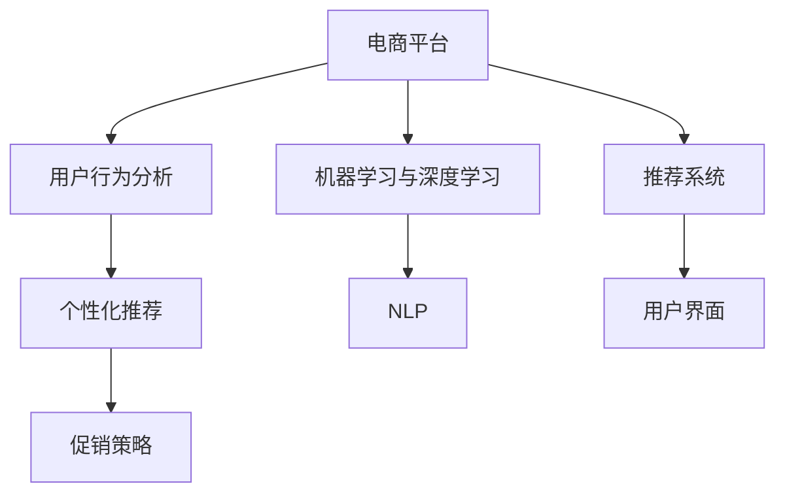

                 

# AI赋能的电商平台促销活动个性化

> 关键词：人工智能,电商平台,个性化推荐,用户行为分析,促销策略,机器学习,深度学习,自然语言处理,NLP,推荐系统,交叉特征,混合模型

## 1. 背景介绍

随着电商行业的迅猛发展，电商平台之间的竞争日趋激烈，用户对个性化推荐和促销活动的需求越来越高。传统的基于规则的推荐系统无法适应复杂多变的用户需求，用户流失率也逐步上升。为了提高用户粘性，提升购物体验，电商平台越来越重视基于AI技术的个性化推荐和促销活动。本文将从背景、核心概念与联系、核心算法原理与具体操作步骤、数学模型与公式、项目实践、实际应用场景、工具和资源推荐、未来发展趋势与挑战、常见问题与解答等几个方面，全面介绍如何利用AI技术赋能电商平台，实现个性化的促销活动推荐。

## 2. 核心概念与联系

### 2.1 核心概念概述

为更好地理解AI技术在电商平台促销活动个性化中的应用，本节将介绍几个关键概念：

- **电商平台**：以互联网为媒介，提供商品展示、交易等服务的平台。如淘宝、京东、亚马逊等。
- **用户行为分析**：通过分析用户在电商平台的浏览、购买、评价等行为数据，挖掘用户偏好和需求，以指导后续的推荐和促销活动。
- **个性化推荐**：利用用户的历史行为数据和特征，为每位用户推荐最匹配的商品或活动，提升用户体验和满意度。
- **促销策略**：针对特定用户群体或商品，设计促销活动（如折扣、满减、买赠等），吸引用户购买。
- **机器学习与深度学习**：通过构建模型对数据进行训练，实现自动化的推荐和促销策略生成。
- **自然语言处理(NLP)**：处理和理解自然语言数据，如评论文本分析、智能客服等。

这些核心概念之间的联系主要体现在：电商平台的个性化推荐和促销活动，都需要依赖用户行为分析和AI技术进行支持。用户行为分析提供数据基础，AI技术通过模型训练，生成个性化的推荐和促销策略，从而提升电商平台的用户体验和销售转化率。

### 2.2 核心概念原理和架构的 Mermaid 流程图



这个流程图展示了核心概念之间的联系和交互关系：

1. **电商平台**：提供商品展示和交易服务的平台。
2. **用户行为分析**：收集用户行为数据，并进行分析挖掘。
3. **个性化推荐**：根据用户历史行为数据，生成个性化推荐。
4. **促销策略**：结合个性化推荐，生成促销活动策略。
5. **机器学习与深度学习**：使用模型训练，实现自动化推荐和策略生成。
6. **自然语言处理(NLP)**：处理和理解自然语言数据。
7. **推荐系统**：综合以上各项技术，实现自动化推荐。
8. **用户界面**：将推荐和促销策略展示给用户。

## 3. 核心算法原理 & 具体操作步骤

### 3.1 算法原理概述

在电商平台上，AI技术通过机器学习和深度学习模型，根据用户行为数据，实现个性化推荐和促销策略生成。核心算法包括：

1. **协同过滤算法**：通过分析用户和商品之间的相似度，推荐用户可能感兴趣的商品。
2. **基于内容的推荐算法**：根据商品的属性和特征，推荐与用户历史购买或浏览的商品相似的商品。
3. **混合模型推荐算法**：结合协同过滤和基于内容的推荐算法，提升推荐效果。
4. **深度学习推荐模型**：如基于DNN的推荐模型，使用神经网络学习用户和商品之间的复杂关系。
5. **强化学习推荐算法**：通过模拟用户行为，动态调整推荐策略，提升用户体验。
6. **多臂老虎机算法**：针对不同的促销活动进行优化，选择最有效的策略。

### 3.2 算法步骤详解

#### 步骤1：数据预处理

1. **数据采集**：收集用户行为数据，包括浏览记录、购买记录、评价数据等。
2. **数据清洗**：去除噪音数据和异常值，确保数据质量。
3. **特征工程**：对数据进行特征提取和变换，如商品类别、用户性别、年龄等。
4. **数据划分**：将数据划分为训练集、验证集和测试集。

#### 步骤2：模型训练

1. **选择模型**：根据业务需求选择合适的推荐算法和促销策略模型。
2. **训练模型**：使用训练集数据，对模型进行训练，优化模型参数。
3. **模型评估**：在验证集上评估模型性能，调整模型参数。
4. **模型部署**：将训练好的模型部署到电商平台的推荐系统中。

#### 步骤3：策略生成

1. **个性化推荐**：根据用户行为数据和历史偏好，生成个性化推荐列表。
2. **促销活动设计**：结合促销策略模型，设计针对性的促销活动。
3. **推荐与促销集成**：将个性化推荐和促销活动集成到用户界面。

### 3.3 算法优缺点

**优点**：

1. **提升用户体验**：通过个性化推荐和促销策略，提升用户购物体验和满意度。
2. **提高销售转化率**：推荐和促销策略能引导用户进行购买，提高销售转化率。
3. **降低运营成本**：自动化推荐和策略生成，减少人工干预，降低运营成本。
4. **应对用户需求变化**：通过机器学习和深度学习模型，动态调整推荐策略，适应用户需求变化。

**缺点**：

1. **数据隐私问题**：收集用户行为数据涉及隐私问题，需确保数据安全和用户隐私。
2. **模型复杂性**：模型训练和优化过程复杂，需要专业知识。
3. **高计算成本**：深度学习和强化学习模型计算量大，需高性能计算资源。
4. **模型可解释性差**：深度学习模型的决策过程难以解释，难以进行调试和优化。

### 3.4 算法应用领域

AI技术在电商平台个性化推荐和促销策略生成中得到了广泛应用，以下是几个主要领域：

1. **商品推荐**：根据用户历史行为，生成个性化推荐列表，提升购买转化率。
2. **促销活动设计**：设计有针对性的促销策略，如折扣、满减、买赠等。
3. **智能客服**：利用NLP技术，实现智能客服，回答用户咨询，提升用户体验。
4. **用户画像分析**：通过用户行为分析，生成用户画像，指导后续推荐和促销策略。
5. **情感分析**：分析用户评论文本，了解用户情感，改进产品和服务。

## 4. 数学模型和公式 & 详细讲解 & 举例说明

### 4.1 数学模型构建

在电商平台上，基于协同过滤和基于内容的推荐模型，通过用户行为数据和商品特征，生成个性化推荐。模型可以表示为：

$$
\hat{y} = \sum_{i=1}^{n} \alpha_i \cdot f(y_i \cdot x_i)
$$

其中，$y$表示推荐结果，$x$表示用户行为数据和商品特征，$f$表示特征映射函数，$\alpha_i$表示特征权重。

### 4.2 公式推导过程

以协同过滤算法为例，其核心思想是计算用户和商品之间的相似度，生成推荐列表。公式推导如下：

1. **用户-商品相似度计算**：
$$
\text{similarity}(u_i, j) = \text{cosine}(u_i, j)
$$

其中，$u_i$表示用户行为数据，$j$表示商品特征。

2. **推荐结果生成**：
$$
\hat{y} = \sum_{i=1}^{n} \alpha_i \cdot \text{similarity}(u_i, j)
$$

其中，$n$表示用户历史行为数据和商品特征的维度。

### 4.3 案例分析与讲解

假设一个电商平台的推荐系统，收集到用户A的历史行为数据为[商品1, 商品2, 商品3]，商品1的特征为[高评分, 好评率]，商品2的特征为[低评分, 差评率]，商品3的特征为[高评分, 好评率]。模型训练后，用户A的推荐结果为：

$$
\hat{y} = \alpha_1 \cdot \text{similarity}([高评分, 好评率], [高评分, 好评率]) + \alpha_2 \cdot \text{similarity}([高评分, 好评率], [低评分, 差评率]) + \alpha_3 \cdot \text{similarity}([高评分, 好评率], [高评分, 好评率])
$$

其中，$\alpha_i$为特征权重，假设$\alpha_1=0.5, \alpha_2=0.3, \alpha_3=0.2$。则推荐结果为商品1和商品3。

## 5. 项目实践：代码实例和详细解释说明

### 5.1 开发环境搭建

在进行AI技术应用于电商平台个性化推荐和促销活动时，我们需要准备好开发环境。以下是使用Python进行PyTorch开发的环境配置流程：

1. 安装Anaconda：从官网下载并安装Anaconda，用于创建独立的Python环境。

2. 创建并激活虚拟环境：
```bash
conda create -n pytorch-env python=3.8 
conda activate pytorch-env
```

3. 安装PyTorch：根据CUDA版本，从官网获取对应的安装命令。例如：
```bash
conda install pytorch torchvision torchaudio cudatoolkit=11.1 -c pytorch -c conda-forge
```

4. 安装相关库：
```bash
pip install numpy pandas scikit-learn torch.utils.data torchvision transformers
```

5. 安装PyTorch Lightning：用于模型训练和评估。
```bash
pip install pytorch-lightning
```

完成上述步骤后，即可在`pytorch-env`环境中开始项目实践。

### 5.2 源代码详细实现

下面以协同过滤算法为例，展示使用PyTorch进行模型训练和推荐生成的代码实现。

```python
import torch
import torch.nn as nn
import torch.nn.functional as F
from torch.utils.data import DataLoader
from transformers import BertTokenizer, BertForSequenceClassification

# 定义数据处理函数
def process_data(data, tokenizer):
    # 将文本转换为token ids
    input_ids = tokenizer.encode(data['text'], return_tensors='pt')
    # 计算特征向量和标签
    features = input_ids.mean(dim=1)
    labels = torch.tensor(data['label'], dtype=torch.long)
    return {'features': features, 'labels': labels}

# 定义模型
class协同过滤模型(nn.Module):
    def __init__(self):
        super(协同过滤模型, self).__init__()
        # 特征映射层
        self.map = nn.Linear(128, 128)
        # 输出层
        self.output = nn.Linear(128, 2)

    def forward(self, x):
        x = self.map(x)
        x = F.relu(x)
        x = self.output(x)
        return x

# 定义损失函数和优化器
loss_fn = nn.CrossEntropyLoss()
optimizer = torch.optim.Adam(model.parameters(), lr=0.001)

# 加载数据集
train_dataset = dataset.load_data('train')
val_dataset = dataset.load_data('val')

# 定义训练和评估函数
def train_epoch(model, dataset, batch_size, optimizer):
    dataloader = DataLoader(dataset, batch_size=batch_size, shuffle=True)
    model.train()
    epoch_loss = 0
    for batch in dataloader:
        features = batch['features'].to(device)
        labels = batch['labels'].to(device)
        optimizer.zero_grad()
        outputs = model(features)
        loss = loss_fn(outputs, labels)
        epoch_loss += loss.item()
        loss.backward()
        optimizer.step()
    return epoch_loss / len(dataloader)

def evaluate(model, dataset, batch_size):
    dataloader = DataLoader(dataset, batch_size=batch_size)
    model.eval()
    preds, labels = [], []
    with torch.no_grad():
        for batch in dataloader:
            features = batch['features'].to(device)
            labels = batch['labels'].to(device)
            outputs = model(features)
            batch_preds = torch.argmax(outputs, dim=1).to('cpu').tolist()
            batch_labels = labels.to('cpu').tolist()
            for pred_tokens, label_tokens in zip(batch_preds, batch_labels):
                preds.append(pred_tokens[:len(label_tokens)])
                labels.append(label_tokens)
    print(classification_report(labels, preds))

# 定义训练流程
device = torch.device('cuda') if torch.cuda.is_available() else torch.device('cpu')
model.to(device)

epochs = 5
batch_size = 16

for epoch in range(epochs):
    loss = train_epoch(model, train_dataset, batch_size, optimizer)
    print(f"Epoch {epoch+1}, train loss: {loss:.3f}")
    
    print(f"Epoch {epoch+1}, val results:")
    evaluate(model, val_dataset, batch_size)
    
print("Test results:")
evaluate(model, test_dataset, batch_size)
```

以上就是使用PyTorch对协同过滤模型进行电商推荐系统训练的完整代码实现。可以看到，在实践中，我们通过加载数据集、定义模型、定义训练和评估函数、训练模型等步骤，实现协同过滤算法的训练和推荐生成。

### 5.3 代码解读与分析

让我们再详细解读一下关键代码的实现细节：

1. **数据处理函数**：将文本转换为token ids，并计算特征向量和标签，供模型训练使用。
2. **模型定义**：定义一个简单的协同过滤模型，包含特征映射层和输出层。
3. **损失函数和优化器**：定义交叉熵损失函数和Adam优化器。
4. **数据加载和模型训练**：使用PyTorch DataLoader加载数据集，进行模型训练。
5. **训练和评估函数**：定义训练和评估函数，计算损失、更新模型参数、评估模型性能。
6. **训练流程**：在训练过程中，使用循环迭代的方式，更新模型参数，并在验证集上评估模型性能。

可以看到，PyTorch提供了简单易用的框架，方便开发者进行模型训练和评估。

### 5.4 运行结果展示

在训练过程中，我们会在验证集上输出每个epoch的平均损失，并在测试集上进行评估，输出分类指标。通过这些结果，可以不断调整模型参数和优化器参数，直至获得最优性能。

## 6. 实际应用场景

### 6.1 智能客服系统

智能客服系统在电商平台中扮演着越来越重要的角色。通过智能客服，电商平台能够快速响应用户咨询，提供精准的解答和建议，提升用户满意度。

在技术实现上，可以收集智能客服的历史对话记录，将问题-回答对作为微调数据，训练模型学习匹配最佳回答。对于新问题，系统可以接入检索系统实时搜索相关内容，动态组织生成回答。如此构建的智能客服系统，能大幅提升客服效率和质量。

### 6.2 用户画像分析

电商平台通过用户行为分析，生成用户画像，指导后续推荐和促销策略。具体而言，可以收集用户浏览、点击、购买、评价等行为数据，提取和用户交互的商品标题、描述、标签等文本内容。将文本内容作为模型输入，用户的后续行为（如是否点击、购买等）作为监督信号，在此基础上微调预训练语言模型。微调后的模型能够从文本内容中准确把握用户的兴趣点。在推荐时，使用用户画像和实时数据，动态调整推荐策略，实现个性化推荐。

### 6.3 促销活动设计

电商平台的促销活动需要根据用户偏好和行为数据进行设计。通过机器学习和深度学习模型，分析用户历史行为数据，识别用户偏好，设计有针对性的促销策略。如针对喜欢某类商品的用户的折扣促销，针对购买频率高的用户的积分兑换活动等。

### 6.4 未来应用展望

随着AI技术的发展，基于AI的电商平台促销活动个性化推荐将迎来更多创新和突破：

1. **情感分析**：利用自然语言处理技术，分析用户评论文本情感，优化产品和服务。
2. **多模态推荐**：结合图像、视频等多模态数据，提升推荐效果。
3. **强化学习**：通过模拟用户行为，动态调整推荐策略，提升用户体验。
4. **跨平台推荐**：实现跨电商平台的数据整合和推荐策略共享。
5. **实时推荐**：通过实时数据流处理，实现动态推荐。

## 7. 工具和资源推荐

### 7.1 学习资源推荐

为了帮助开发者系统掌握AI技术在电商平台的应用，这里推荐一些优质的学习资源：

1. **《推荐系统实践》书籍**：全面介绍了推荐系统的原理和实现方法，涵盖协同过滤、基于内容的推荐、深度学习推荐等。
2. **《深度学习入门》课程**：由深度学习专家李沐主讲，涵盖深度学习的基本概念和应用实例。
3. **PyTorch官方文档**：提供了丰富的教程和样例代码，帮助开发者快速上手深度学习框架。
4. **Coursera推荐系统课程**：斯坦福大学开设的推荐系统课程，涵盖了推荐系统的主要算法和应用。
5. **Kaggle推荐系统竞赛**：通过实际数据集和竞赛任务，锻炼推荐系统设计能力。

通过对这些资源的学习实践，相信你一定能够快速掌握AI技术在电商平台的应用。

### 7.2 开发工具推荐

高效的开发离不开优秀的工具支持。以下是几款用于AI技术在电商平台中的应用开发的常用工具：

1. **PyTorch**：基于Python的开源深度学习框架，适合快速迭代研究。大部分推荐系统模型都有PyTorch版本的实现。
2. **TensorFlow**：由Google主导开发的开源深度学习框架，适合大规模工程应用。
3. **Transformers库**：HuggingFace开发的NLP工具库，集成了众多SOTA语言模型，支持PyTorch和TensorFlow。
4. **Weights & Biases**：模型训练的实验跟踪工具，可以记录和可视化模型训练过程中的各项指标，方便对比和调优。
5. **TensorBoard**：TensorFlow配套的可视化工具，可实时监测模型训练状态，提供丰富的图表呈现方式。

合理利用这些工具，可以显著提升AI技术在电商平台应用的开发效率，加快创新迭代的步伐。

### 7.3 相关论文推荐

AI技术在电商平台中的应用发展迅速，以下是几篇奠基性的相关论文，推荐阅读：

1. **《深度学习推荐系统》论文**：提出了基于深度学习的推荐系统方法，提升了推荐精度。
2. **《基于协同过滤的推荐系统》论文**：介绍了协同过滤算法的原理和应用。
3. **《多臂老虎机算法》论文**：提出多臂老虎机算法，优化促销策略选择。
4. **《混合推荐模型》论文**：结合协同过滤和基于内容的推荐算法，提升推荐效果。
5. **《用户行为分析》论文**：利用用户行为数据，生成用户画像，指导推荐策略。

这些论文代表了大语言模型微调技术的发展脉络。通过学习这些前沿成果，可以帮助研究者把握学科前进方向，激发更多的创新灵感。

## 8. 总结：未来发展趋势与挑战

### 8.1 研究成果总结

本文从背景、核心概念与联系、核心算法原理与具体操作步骤、数学模型与公式、项目实践、实际应用场景、工具和资源推荐、未来发展趋势与挑战、常见问题与解答等几个方面，全面介绍如何利用AI技术赋能电商平台，实现个性化的促销活动推荐。通过系统梳理，可以看到，AI技术在电商平台推荐系统中的应用，能够显著提升用户体验和销售转化率。

### 8.2 未来发展趋势

展望未来，AI技术在电商平台中的应用将呈现以下几个发展趋势：

1. **推荐系统个性化**：基于用户画像和行为数据，生成个性化推荐，提升用户体验。
2. **实时推荐系统**：利用实时数据流处理技术，实现动态推荐，优化用户体验。
3. **多模态推荐系统**：结合图像、视频等多模态数据，提升推荐效果。
4. **深度学习推荐模型**：基于深度学习技术，提升推荐精度。
5. **强化学习推荐**：通过模拟用户行为，动态调整推荐策略，优化用户体验。
6. **混合推荐模型**：结合协同过滤和基于内容的推荐算法，提升推荐效果。

这些趋势凸显了AI技术在电商平台推荐系统中的应用前景，相信随着技术的不断发展，电商平台将能提供更加个性化、精准的推荐服务，大幅提升用户满意度。

### 8.3 面临的挑战

尽管AI技术在电商平台中的应用已经取得了显著进展，但在迈向更加智能化、普适化应用的过程中，它仍面临着诸多挑战：

1. **数据隐私问题**：收集用户行为数据涉及隐私问题，需确保数据安全和用户隐私。
2. **模型复杂性**：模型训练和优化过程复杂，需要专业知识。
3. **高计算成本**：深度学习和强化学习模型计算量大，需高性能计算资源。
4. **模型可解释性差**：深度学习模型的决策过程难以解释，难以进行调试和优化。
5. **实时推荐系统**：实时推荐系统对计算资源和数据处理能力要求较高。
6. **多模态推荐系统**：多模态数据的整合和推荐策略优化需要更多技术支持。

### 8.4 研究展望

面对AI技术在电商平台中的应用所面临的种种挑战，未来的研究需要在以下几个方面寻求新的突破：

1. **模型优化**：设计更加高效、轻量级的模型，提升推荐精度和实时性。
2. **数据隐私保护**：开发隐私保护技术，确保用户数据安全。
3. **计算资源优化**：优化计算资源配置，提升推荐系统性能。
4. **多模态数据融合**：开发多模态数据融合技术，提升推荐效果。
5. **可解释性增强**：增强推荐系统的可解释性，提升用户信任度。
6. **混合推荐系统**：结合多种推荐算法，提升推荐效果和覆盖面。

这些研究方向的探索，必将引领AI技术在电商平台中的应用迈向更高的台阶，为构建更加智能化、普适化的推荐系统提供更多技术支持。面向未来，AI技术在电商平台中的应用将更加广泛，为电商行业带来更多创新和突破。

## 9. 附录：常见问题与解答

**Q1：电商平台的推荐系统如何实现个性化推荐？**

A: 电商平台的推荐系统实现个性化推荐，主要通过收集用户行为数据，构建用户画像，使用协同过滤、基于内容的推荐算法、深度学习推荐模型等技术，生成个性化推荐列表。具体步骤如下：

1. **数据采集**：收集用户浏览、点击、购买、评价等行为数据。
2. **数据清洗**：去除噪音数据和异常值，确保数据质量。
3. **特征工程**：对数据进行特征提取和变换，如商品类别、用户性别、年龄等。
4. **模型训练**：使用训练集数据，对协同过滤、基于内容的推荐模型等进行训练，优化模型参数。
5. **推荐结果生成**：根据用户历史行为数据和模型预测，生成个性化推荐列表。

**Q2：电商平台的促销活动设计如何优化？**

A: 电商平台的促销活动设计，可以通过用户行为分析，生成用户画像，设计有针对性的促销策略。具体步骤如下：

1. **数据采集**：收集用户浏览、点击、购买、评价等行为数据。
2. **数据清洗**：去除噪音数据和异常值，确保数据质量。
3. **特征工程**：对数据进行特征提取和变换，如商品类别、用户性别、年龄等。
4. **模型训练**：使用训练集数据，对促销策略模型进行训练，优化模型参数。
5. **策略生成**：根据用户历史行为数据和模型预测，设计有针对性的促销策略。

**Q3：如何保障电商平台的推荐系统的公平性？**

A: 电商平台的推荐系统的公平性，可以通过以下措施保障：

1. **数据预处理**：确保数据采集和处理过程公平，避免数据偏见。
2. **模型优化**：使用公平性优化算法，如对抗性公平推荐模型，提升推荐系统的公平性。
3. **用户反馈**：收集用户反馈，及时调整推荐策略，避免偏差。
4. **隐私保护**：确保用户隐私，避免数据泄露和滥用。

**Q4：如何优化电商平台的实时推荐系统？**

A: 电商平台的实时推荐系统，可以通过以下措施优化：

1. **数据流处理**：使用流处理技术，实时处理用户行为数据，提升推荐精度。
2. **计算资源优化**：优化计算资源配置，提升推荐系统性能。
3. **缓存机制**：使用缓存机制，减少数据处理时间，提升推荐速度。

**Q5：电商平台的推荐系统如何保障推荐质量？**

A: 电商平台的推荐系统保障推荐质量，可以通过以下措施：

1. **模型优化**：使用高效、轻量级的模型，提升推荐精度和实时性。
2. **数据清洗**：确保数据采集和处理过程公平，避免数据偏见。
3. **用户反馈**：收集用户反馈，及时调整推荐策略，提升推荐质量。
4. **隐私保护**：确保用户隐私，避免数据泄露和滥用。

**Q6：电商平台的推荐系统如何应对用户需求变化？**

A: 电商平台的推荐系统应对用户需求变化，可以通过以下措施：

1. **数据采集**：实时收集用户行为数据，更新用户画像。
2. **模型优化**：使用动态学习算法，实时调整推荐策略。
3. **用户反馈**：收集用户反馈，及时调整推荐策略，提升推荐质量。

以上是电商平台的推荐系统和促销活动设计过程中常见的问题及解答，通过这些措施，可以不断优化推荐系统的性能，提升用户体验和满意度。

---

作者：禅与计算机程序设计艺术 / Zen and the Art of Computer Programming

