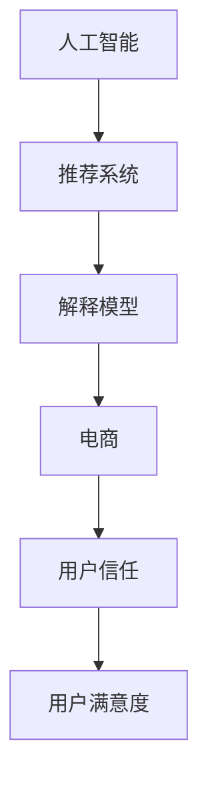
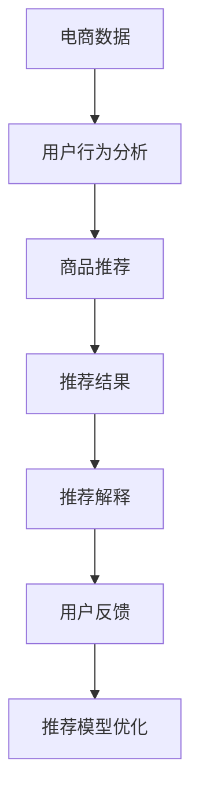

                 

# AI赋能的电商推荐解释系统：提升用户信任

> 关键词：人工智能,推荐系统,解释模型,电商,用户信任,用户满意度

## 1. 背景介绍

随着电商平台的快速发展，推荐系统已经成为提升用户购物体验的重要手段。然而，推荐算法的"黑箱"性质，使得用户难以理解推荐结果背后的逻辑和原因。这种"不透明"的推荐方式，不仅降低了用户的信任感，也限制了推荐系统的进一步优化和迭代。

针对这一问题，AI赋能的电商推荐解释系统应运而生。该系统通过自然语言生成等技术，将复杂的推荐决策过程，用易于理解的方式呈现给用户，帮助用户理解推荐理由，从而提升用户信任感，提高用户满意度。本文将详细阐述基于人工智能的电商推荐解释系统的工作原理、核心技术，并探讨其应用场景和未来发展趋势。

## 2. 核心概念与联系

### 2.1 核心概念概述

为更好地理解基于人工智能的电商推荐解释系统，本节将介绍几个密切相关的核心概念：

- 人工智能(Artificial Intelligence, AI)：通过计算机模拟人的智能行为，包括感知、理解、推理、学习等能力。
- 推荐系统(Recommender System)：通过分析用户行为数据，为用户推荐感兴趣的内容或商品的系统。
- 解释模型(Explainable Model)：通过自然语言生成等技术，将模型决策过程解释给用户，提升用户信任感的模型。
- 电商(E-Commerce)：在线销售商品或服务的模式，推荐系统在电商领域具有重要应用。
- 用户信任(User Trust)：用户对推荐系统的信任度，直接影响用户满意度和转化率。
- 用户满意度(User Satisfaction)：用户在使用推荐系统后的满意度，反映系统的推荐效果和用户体验。

这些核心概念之间的逻辑关系可以通过以下Mermaid流程图来展示：



这个流程图展示了一系列关键概念及其之间的关系：

1. 人工智能通过推荐系统为用户推荐商品，解释模型将推荐过程解释给用户。
2. 电商平台借助推荐系统提升用户满意度，解释模型增强用户信任感。
3. 用户信任感和满意度共同影响用户转化率和电商平台的成功。

这些概念共同构成了AI赋能的电商推荐解释系统的工作原理和价值所在。

### 2.2 核心概念原理和架构的 Mermaid 流程图



这个流程图详细展示了电商推荐解释系统的数据流和处理流程：

1. 电商数据经过用户行为分析，生成推荐结果。
2. 推荐结果通过推荐解释模型生成自然语言解释。
3. 用户反馈进入推荐模型优化，不断提升推荐准确性和可解释性。

## 3. 核心算法原理 & 具体操作步骤

### 3.1 算法原理概述

基于人工智能的电商推荐解释系统，通过以下步骤实现：

1. **用户行为分析**：收集用户的历史浏览、点击、购买等行为数据，构建用户兴趣模型。
2. **商品推荐**：利用用户兴趣模型和商品特征，生成推荐结果。
3. **推荐解释**：使用自然语言生成等技术，将推荐结果解释为易于理解的自然语言。
4. **用户反馈循环**：收集用户对推荐结果的反馈，不断优化推荐模型和解释模型，提升用户体验和信任感。

### 3.2 算法步骤详解

#### 3.2.1 用户行为分析

用户行为分析是推荐系统的基础。通过分析用户的历史数据，可以生成用户兴趣模型，用于指导后续的推荐决策。

1. **数据收集**：收集用户的历史浏览、点击、购买、评价等行为数据。
2. **特征提取**：将行为数据转化为特征向量，包括点击率、停留时间、购买转化率等。
3. **模型训练**：使用协同过滤、内容推荐、混合推荐等算法，训练用户兴趣模型。

#### 3.2.2 商品推荐

基于用户兴趣模型和商品特征，生成推荐结果。

1. **商品特征提取**：从商品描述、价格、品牌、评价等维度提取商品特征向量。
2. **相似度计算**：计算用户兴趣模型与商品特征向量之间的相似度。
3. **推荐排序**：根据相似度排序，生成推荐结果。

#### 3.2.3 推荐解释

推荐解释是解释模型的关键步骤，通过自然语言生成等技术，将推荐结果转化为易于理解的语言。

1. **自然语言生成**：使用自然语言生成模型，如GPT-3、BERT等，生成推荐结果的解释。
2. **解释模型优化**：通过用户反馈，不断优化自然语言生成模型，提升生成质量。

#### 3.2.4 用户反馈循环

用户反馈是推荐系统优化的重要依据，通过收集和分析用户反馈，可以持续改进推荐模型和解释模型。

1. **反馈收集**：通过用户评分、评论等形式，收集用户对推荐结果的反馈。
2. **反馈分析**：分析用户反馈，识别推荐模型和解释模型的缺陷。
3. **模型优化**：基于反馈分析结果，优化推荐模型和解释模型。

### 3.3 算法优缺点

基于人工智能的电商推荐解释系统具有以下优点：

1. **提升用户信任**：通过解释推荐结果，使用户能够理解推荐逻辑，增强信任感。
2. **优化推荐效果**：用户反馈可以指导模型优化，提升推荐准确性和相关性。
3. **增强用户体验**：推荐解释使购物过程更加透明，提升用户满意度。

然而，该系统也存在一些局限：

1. **解释复杂性**：复杂的推荐过程难以用简单语言解释清楚。
2. **用户理解能力**：用户对推荐解释的接受程度不同，可能仍感到困惑。
3. **数据隐私问题**：解释模型需要大量用户数据，可能涉及隐私问题。
4. **计算资源消耗**：自然语言生成等技术需要大量计算资源，可能影响系统效率。

尽管存在这些局限，但总体而言，AI赋能的电商推荐解释系统已经展现出巨大的潜力和价值，正逐渐成为电商推荐系统的重要组成部分。

### 3.4 算法应用领域

基于人工智能的电商推荐解释系统在以下领域中有着广泛的应用：

1. **电商推荐**：在电商平台上，为用户推荐商品，并解释推荐原因，提升用户信任。
2. **金融推荐**：在金融平台，为用户推荐理财产品，解释推荐依据，增强用户信心。
3. **医疗推荐**：在医疗平台，为用户推荐药品，解释推荐理由，提升用户信任感。
4. **旅游推荐**：在旅游平台，为用户推荐景点，解释推荐依据，提升用户满意度。
5. **教育推荐**：在教育平台，为用户推荐课程，解释推荐依据，提升用户满意度。

这些领域的应用，不仅提升了推荐的透明度和可理解性，也显著提高了用户信任度和满意度。

## 4. 数学模型和公式 & 详细讲解

### 4.1 数学模型构建

假设电商平台的推荐系统采用基于协同过滤的推荐模型，即通过用户-商品矩阵和商品-商品矩阵计算用户对商品的评分预测。设用户集合为 $U=\{u_1, u_2, ..., u_n\}$，商品集合为 $I=\{i_1, i_2, ..., i_m\}$，用户对商品的评分矩阵为 $R \in \mathbb{R}^{n \times m}$，其中 $R_{ui}$ 表示用户 $u_i$ 对商品 $i_j$ 的评分。

### 4.2 公式推导过程

推荐系统的目标是最小化预测评分与实际评分之间的平方误差，即：

$$
\min_{\theta} \sum_{u=1}^{n} \sum_{i=1}^{m} (R_{ui} - \hat{R}_{ui})^2
$$

其中 $\hat{R}_{ui}$ 为模型预测的用户 $u_i$ 对商品 $i_j$ 的评分。

常见的推荐模型包括协同过滤、基于内容的推荐、混合推荐等，它们的公式推导过程各不相同，但基本目标都是最小化预测评分与实际评分之间的误差。

### 4.3 案例分析与讲解

以协同过滤模型为例，其基本思想是通过计算用户和商品的相似度，预测用户对商品的评分。设用户 $u_i$ 和商品 $i_j$ 的相似度为 $S_{i,j}$，则推荐模型可以表示为：

$$
\hat{R}_{ui} = \sum_{j=1}^{m} S_{i,j} R_{uj}
$$

其中 $R_{uj}$ 为与商品 $i_j$ 相似的商品 $j$ 的评分。通过优化相似度矩阵 $S$，可以得到更好的推荐效果。

## 5. 项目实践：代码实例和详细解释说明

### 5.1 开发环境搭建

在进行电商推荐解释系统的开发前，我们需要准备好开发环境。以下是使用Python进行TensorFlow开发的环境配置流程：

1. 安装Anaconda：从官网下载并安装Anaconda，用于创建独立的Python环境。

2. 创建并激活虚拟环境：
```bash
conda create -n tf-env python=3.8 
conda activate tf-env
```

3. 安装TensorFlow：根据CUDA版本，从官网获取对应的安装命令。例如：
```bash
conda install tensorflow tensorflow-gpu=cuda11.1 -c conda-forge
```

4. 安装各类工具包：
```bash
pip install numpy pandas scikit-learn matplotlib tqdm jupyter notebook ipython
```

完成上述步骤后，即可在`tf-env`环境中开始推荐解释系统的开发。

### 5.2 源代码详细实现

下面我们以基于协同过滤的电商推荐系统为例，给出使用TensorFlow实现推荐模型的代码实现。

首先，定义协同过滤模型的输入和输出：

```python
import tensorflow as tf
from tensorflow.keras.layers import Input, Dense, Embedding, Dot, Add
from tensorflow.keras.models import Model

# 输入层
user_input = Input(shape=(num_users,), name='user')
item_input = Input(shape=(num_items,), name='item')
# 嵌入层
user_embed = Embedding(input_dim=num_users, output_dim=embedding_size)(user_input)
item_embed = Embedding(input_dim=num_items, output_dim=embedding_size)(item_input)
# 相似度计算层
dot_product = Dot(axes=(1, 1))([user_embed, item_embed])
# 输出层
output = Dense(1, activation='sigmoid')(dot_product)
# 构建模型
model = Model(inputs=[user_input, item_input], outputs=output)
```

然后，定义模型的优化器和损失函数：

```python
# 定义损失函数
def loss_function(y_true, y_pred):
    return tf.keras.losses.binary_crossentropy(y_true, y_pred)
    
# 定义优化器
optimizer = tf.keras.optimizers.Adam(learning_rate=0.001)
```

接着，定义训练和评估函数：

```python
# 训练函数
def train_epoch(model, train_data, optimizer):
    for batch in train_data:
        user_input = batch[0]
        item_input = batch[1]
        labels = batch[2]
        with tf.GradientTape() as tape:
            y_pred = model([user_input, item_input])
            loss = loss_function(labels, y_pred)
        grads = tape.gradient(loss, model.trainable_variables)
        optimizer.apply_gradients(zip(grads, model.trainable_variables))
    
# 评估函数
def evaluate(model, test_data):
    total_loss = 0
    for batch in test_data:
        user_input = batch[0]
        item_input = batch[1]
        labels = batch[2]
        y_pred = model([user_input, item_input])
        loss = loss_function(labels, y_pred)
        total_loss += loss
    return total_loss / len(test_data)
```

最后，启动训练流程并在测试集上评估：

```python
epochs = 10
batch_size = 32

# 加载数据
train_data = load_data('train.csv')
test_data = load_data('test.csv')

# 模型优化
model.compile(optimizer=optimizer, loss=loss_function)

# 模型训练
for epoch in range(epochs):
    train_epoch(model, train_data, optimizer)
    test_loss = evaluate(model, test_data)
    print(f'Epoch {epoch+1}, test loss: {test_loss:.4f}')
    
# 模型保存
model.save('recommender_model.h5')
```

以上就是使用TensorFlow实现基于协同过滤的电商推荐系统的完整代码实现。可以看到，TensorFlow的高级API使得推荐模型的搭建和训练变得非常简单。

### 5.3 代码解读与分析

让我们再详细解读一下关键代码的实现细节：

**协同过滤模型**：
- `user_input`和`item_input`分别为用户和商品的输入，使用`Embedding`层将稠密向量转化为稀疏表示。
- `Dot`层计算用户和商品的相似度，得到用户对商品的预测评分。
- `Dense`层将相似度转化为0-1之间的评分概率。
- 使用`Model`将输入层、嵌入层、相似度层、输出层串联起来，构建完整的推荐模型。

**优化器和损失函数**：
- 使用`Adam`优化器，设置学习率为0.001。
- 定义损失函数为二元交叉熵，用于计算预测评分与实际评分之间的误差。

**训练和评估函数**：
- `train_epoch`函数对数据集进行批次化迭代，使用`GradientTape`记录梯度，使用优化器更新模型参数。
- `evaluate`函数在测试集上评估模型性能，计算平均损失。

**训练流程**：
- 定义训练轮数和批次大小。
- 加载训练集和测试集数据。
- 使用`compile`函数将模型编译为可以训练的模型，并设置损失函数。
- 循环迭代训练轮数，每个轮次在训练集上训练，在测试集上评估。
- 保存训练好的模型。

可以看到，TensorFlow的深度学习模型搭建和训练功能强大，为推荐系统的开发提供了便利。

## 6. 实际应用场景

### 6.1 智能推荐广告

基于电商推荐解释系统的智能推荐广告，是广告主的强需求。广告主希望通过推荐系统，将商品广告精准地推送给目标用户，提升广告的点击率和转化率。

在技术实现上，可以将用户的搜索历史、浏览行为、评价等信息作为训练数据，通过协同过滤模型进行用户兴趣建模，并使用推荐解释模型生成广告的解释信息。广告平台可以基于解释信息，向用户推送精准的广告，提升广告效果和用户满意度。

### 6.2 个性化定制推荐

个性化推荐是电商平台的另一重要应用场景。电商平台希望通过推荐系统，为每个用户定制个性化的商品推荐，提升用户购物体验和平台留存率。

在推荐模型中，可以通过协同过滤、内容推荐等算法，构建用户兴趣模型，生成推荐结果。在解释模型中，可以使用自然语言生成技术，生成推荐商品的解释信息，让用户了解推荐的依据和原因，从而提升信任感和满意度。

### 6.3 推荐系统集成

推荐系统集成是将多个推荐模型和解释模型集成在一起，形成一个综合的推荐系统。通过集成多个模型，可以提高推荐系统的准确性和鲁棒性，提升用户体验。

在实际应用中，可以使用不同的推荐算法，如协同过滤、基于内容的推荐、混合推荐等，构建多个推荐模型。在解释模型中，可以使用自然语言生成等技术，为每个推荐模型生成解释信息。用户可以根据解释信息，选择最符合自己需求的推荐结果，提升用户满意度。

## 7. 工具和资源推荐

### 7.1 学习资源推荐

为了帮助开发者系统掌握电商推荐解释系统的理论基础和实践技巧，这里推荐一些优质的学习资源：

1. 《深度学习推荐系统》书籍：介绍了深度学习在推荐系统中的应用，包含协同过滤、基于内容的推荐、混合推荐等算法，适合系统学习推荐系统原理。
2. 《自然语言处理与深度学习》课程：介绍了自然语言处理中的推荐系统，包含推荐系统理论、算法实现、模型评估等，适合学习自然语言处理与深度学习的结合。
3. 《Recommender Systems with TensorFlow》文档：介绍了TensorFlow在推荐系统中的应用，包含模型搭建、训练、评估等，适合学习TensorFlow的推荐系统实现。
4. Kaggle推荐系统竞赛：Kaggle上有许多推荐系统竞赛，可以通过参加竞赛，学习和实践推荐系统的实际应用。
5. GitHub开源项目：许多开源推荐系统项目提供了详细的代码和文档，适合学习和参考。

通过对这些资源的学习实践，相信你一定能够快速掌握电商推荐解释系统的精髓，并用于解决实际的推荐问题。

### 7.2 开发工具推荐

高效的开发离不开优秀的工具支持。以下是几款用于电商推荐解释系统开发的常用工具：

1. TensorFlow：基于Python的开源深度学习框架，生产部署方便，适合大规模工程应用。
2. PyTorch：基于Python的开源深度学习框架，灵活度较高，适合快速迭代研究。
3. Scikit-learn：Python的机器学习库，适合处理小规模数据和简单模型。
4. Apache Spark：分布式计算框架，适合大规模数据处理和机器学习。
5. Jupyter Notebook：交互式开发环境，适合快速实验和分享学习笔记。

合理利用这些工具，可以显著提升电商推荐解释系统的开发效率，加快创新迭代的步伐。

### 7.3 相关论文推荐

电商推荐解释系统的研究源于学界的持续研究。以下是几篇奠基性的相关论文，推荐阅读：

1. A Unified Approach to Adaptive Recommendation with Neural Networks and Data Augmentation：提出一种基于深度学习的推荐系统框架，使用数据增强技术提升模型泛化能力。
2. A Review of Recent Advances in Recommendation Systems with Deep Learning：综述了深度学习在推荐系统中的应用，包含协同过滤、内容推荐、混合推荐等算法。
3. Deep Neural Networks for Recommender Systems：介绍了深度学习在推荐系统中的应用，包含模型结构、训练优化、评估等。
4. Explainable AI: Interpreting and Explaining Machine Learning Models and Predictions：介绍了可解释AI技术，包含自然语言生成、规则解释等方法，适合学习推荐系统的解释技术。
5. Automated Generation of Explanations for Recommendation Engines：提出一种自动生成推荐解释的方法，使用NLP技术生成自然语言解释。

这些论文代表了大语言模型微调技术的发展脉络。通过学习这些前沿成果，可以帮助研究者把握学科前进方向，激发更多的创新灵感。

## 8. 总结：未来发展趋势与挑战

### 8.1 总结

本文对基于人工智能的电商推荐解释系统进行了全面系统的介绍。首先阐述了推荐系统、解释模型、电商、用户信任等核心概念，明确了电商推荐解释系统的工作原理和价值所在。其次，从原理到实践，详细讲解了推荐系统的数学模型和算法实现，给出了推荐系统的完整代码实例。同时，本文还广泛探讨了推荐系统在广告、个性化推荐、系统集成等诸多场景中的应用，展示了电商推荐解释系统的广阔前景。

通过本文的系统梳理，可以看到，基于人工智能的电商推荐解释系统已经展现出巨大的潜力和价值，正在成为电商推荐系统的重要组成部分。未来，伴随技术的不断进步和应用的持续扩展，相信电商推荐解释系统必将在更多场景中发挥重要作用，为电商行业带来新的突破。

### 8.2 未来发展趋势

展望未来，电商推荐解释系统将呈现以下几个发展趋势：

1. 算法模型多样化：除了协同过滤、基于内容的推荐，未来还会涌现更多高效的推荐算法，如基于序列推荐、基于图模型的推荐等，提升推荐系统的多样性和鲁棒性。
2. 数据来源多样化：推荐系统将不再局限于用户行为数据，可以引入更多数据来源，如社交网络、用户评论、知识图谱等，丰富推荐依据。
3. 推荐结果个性化：推荐系统将根据用户偏好和行为，生成个性化的推荐结果，提升用户体验。
4. 解释模型多样化：自然语言生成等技术将不断进步，推荐系统的解释模型将更加多样化和细致化，提升用户的信任感和满意度。
5. 系统集成化：推荐系统将与其他系统进行深度集成，如搜索、支付、客服等，形成一体化的购物体验。

以上趋势凸显了电商推荐解释系统的广阔前景。这些方向的探索发展，必将进一步提升推荐系统的性能和用户满意度，为电商行业带来新的变革。

### 8.3 面临的挑战

尽管电商推荐解释系统已经取得了显著进展，但在迈向更加智能化、普适化应用的过程中，它仍面临诸多挑战：

1. 数据隐私问题：推荐系统需要大量用户数据，可能涉及隐私保护问题，如何在保护用户隐私的同时，提升推荐效果。
2. 计算资源消耗：推荐系统的计算复杂度较高，如何降低计算资源消耗，提升系统效率。
3. 模型鲁棒性不足：推荐系统面对异常数据和噪音，泛化性能往往大打折扣，如何提高推荐系统的鲁棒性。
4. 用户理解能力：不同用户对推荐解释的接受程度不同，可能仍感到困惑，如何设计更易理解的推荐解释。
5. 模型复杂度增加：复杂的推荐模型和解释模型需要更多的计算资源和时间，如何平衡模型复杂度和系统效率。

尽管存在这些挑战，但总体而言，电商推荐解释系统已经展现出巨大的潜力和价值，正逐渐成为电商推荐系统的重要组成部分。相信随着技术的不断进步和应用的持续扩展，这些挑战终将一一被克服，电商推荐解释系统必将在更多场景中发挥重要作用，为电商行业带来新的突破。

### 8.4 研究展望

面对电商推荐解释系统所面临的挑战，未来的研究需要在以下几个方面寻求新的突破：

1. 探索更高效的数据采集和处理技术：引入更多数据来源，如社交网络、知识图谱等，丰富推荐依据。
2. 研究更高效的模型训练和优化方法：开发更高效的推荐算法，降低计算资源消耗。
3. 引入更多的先验知识和规则：将符号化的先验知识与神经网络模型进行融合，提升推荐系统的稳定性和可解释性。
4. 研究自动化的推荐解释生成技术：使用更智能的自然语言生成技术，提升推荐解释的质量和用户满意度。
5. 结合因果分析和博弈论工具：将因果分析方法引入推荐系统，识别推荐结果的关键特征，增强系统稳定性。

这些研究方向的探索，必将引领电商推荐解释系统迈向更高的台阶，为电商行业带来新的变革。面向未来，电商推荐解释系统还需要与其他人工智能技术进行更深入的融合，如知识表示、因果推理、强化学习等，多路径协同发力，共同推动电商推荐系统的进步。只有勇于创新、敢于突破，才能不断拓展推荐系统的边界，让电商行业进入更加智能化的新时代。

## 9. 附录：常见问题与解答

**Q1：推荐系统如何处理新用户和冷启动问题？**

A: 推荐系统通常使用用户历史行为数据进行推荐。对于新用户和冷启动问题，可以采用以下方法：

1. 随机推荐：为新用户或新商品推荐随机商品，增加用户探索性。
2. 用户画像构建：通过问卷调查、社交网络等手段，构建用户画像，丰富推荐依据。
3. 相似用户推荐：根据相似用户的推荐结果，为当前用户推荐相似用户的推荐。
4. 基于内容的推荐：利用商品描述、标签等属性，为用户推荐相似的商品。

这些方法可以帮助推荐系统在新用户和冷启动场景下，快速推荐相关商品，提升用户体验。

**Q2：推荐系统如何避免推荐同质化问题？**

A: 推荐同质化是推荐系统面临的重要问题。为避免推荐同质化，可以采用以下方法：

1. 多样性推荐：在推荐结果中引入多样性约束，控制同一商品或相似商品的推荐数量。
2. 跨域推荐：引入跨域推荐策略，推荐不同类别的商品，增加推荐多样性。
3. 用户兴趣探索：通过探索用户的兴趣边界，推荐更多样化的商品，提升用户满意度。
4. 用户反馈调整：根据用户反馈，不断调整推荐策略，提升推荐效果。

这些方法可以帮助推荐系统避免推荐同质化问题，提升推荐多样性和用户满意度。

**Q3：推荐系统如何提升用户信任感？**

A: 提升用户信任感是推荐系统的关键目标。为提升用户信任感，可以采用以下方法：

1. 推荐解释：使用自然语言生成技术，生成推荐结果的解释信息，让用户了解推荐依据和原因。
2. 用户反馈：根据用户反馈，不断优化推荐模型和解释模型，提升推荐效果和可解释性。
3. 透明化推荐过程：将推荐过程透明化，让用户能够了解推荐算法的运作方式，增加信任感。
4. 用户参与：鼓励用户参与推荐过程，如参与推荐评价、提供反馈等，提升用户满意度。

这些方法可以帮助推荐系统提升用户信任感，增强用户粘性和满意度。

**Q4：推荐系统如何处理用户历史行为数据缺失问题？**

A: 用户历史行为数据缺失是推荐系统面临的常见问题。为处理数据缺失问题，可以采用以下方法：

1. 数据补全：使用数据补全技术，如均值填充、随机填充等，填补缺失数据。
2. 协同过滤：利用用户-用户或商品-商品的相似性，填补缺失数据。
3. 混合推荐：结合用户行为数据和推荐结果，进行混合推荐，提升推荐效果。
4. 多模态推荐：引入多模态数据，如图片、音频等，填补用户行为数据缺失。

这些方法可以帮助推荐系统处理数据缺失问题，提升推荐效果和用户满意度。

**Q5：推荐系统如何实现个性化推荐？**

A: 个性化推荐是推荐系统的核心目标。为实现个性化推荐，可以采用以下方法：

1. 用户兴趣建模：使用协同过滤、基于内容的推荐等算法，构建用户兴趣模型，生成个性化推荐。
2. 推荐结果调整：根据用户反馈，不断调整推荐结果，提升推荐效果。
3. 用户行为分析：分析用户历史行为数据，了解用户兴趣和行为规律，生成个性化推荐。
4. 用户画像构建：通过用户画像，了解用户的多维度信息，生成个性化推荐。

这些方法可以帮助推荐系统实现个性化推荐，提升用户满意度。

---

作者：禅与计算机程序设计艺术 / Zen and the Art of Computer Programming

