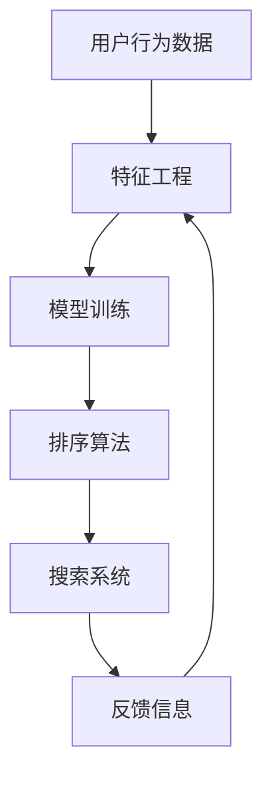

                 

# AI赋能的电商搜索个性化排序算法

> 关键词：个性化推荐, 电商搜索, 排序算法, 机器学习, 深度学习, 模型优化

## 1. 背景介绍

### 1.1 问题由来

在电商平台上，搜索引擎已经成为了用户获取信息、发现商品的重要工具。通过搜索，用户能够快速定位到所需的商品，从而提升购物体验。然而，传统的搜索结果排序算法大多基于关键词匹配度进行排序，无法满足用户的多样化需求，导致用户体验不佳，流失率增加。因此，如何构建一个能够体现用户个性化偏好的电商搜索排序算法，成为了电商平台亟需解决的问题。

### 1.2 问题核心关键点

本问题的核心关键点在于：
1. 如何利用用户历史行为数据，学习用户个性化偏好，以指导搜索结果排序。
2. 如何构建高效、可解释的推荐算法，在电商搜索场景下高效实现个性化排序。
3. 如何平衡搜索速度和排序精度，构建实时响应、准确度高的电商搜索系统。

### 1.3 问题研究意义

构建一个能够体现用户个性化偏好的电商搜索排序算法，对于提升用户购物体验、增加平台收益具有重要意义：

1. 提升用户满意度：个性化推荐算法能够根据用户的历史行为和偏好，提供更贴合用户需求的搜索结果，增加用户粘性。
2. 提高平台收益：个性化排序算法能够精准匹配用户的搜索意图，提升广告点击率，增加销售额。
3. 降低运营成本：通过个性化排序算法，能够减少用户搜索无果的频率，降低平台的搜索成本。

## 2. 核心概念与联系

### 2.1 核心概念概述

为更好地理解电商搜索个性化排序算法，本节将介绍几个密切相关的核心概念：

- **个性化推荐**：根据用户历史行为和偏好，推荐用户可能感兴趣的商品。
- **电商搜索**：用户通过搜索关键词获取商品信息的过程。
- **排序算法**：通过一定的规则，对搜索结果进行排序，使得最相关的商品排在最前面。
- **模型优化**：通过机器学习算法，训练推荐模型，优化排序算法，以提升用户体验和平台收益。

### 2.2 核心概念原理和架构的 Mermaid 流程图(Mermaid 流程节点中不要有括号、逗号等特殊字符)



这个流程图展示了个性化推荐电商搜索排序算法的核心概念及其之间的关系：

1. 用户行为数据：收集用户在平台上的浏览、点击、购买等行为数据，提取有价值的用户特征。
2. 特征工程：对用户行为数据进行清洗、预处理、特征提取等，为模型训练做准备。
3. 模型训练：通过机器学习算法，训练推荐模型，学习用户个性化偏好。
4. 排序算法：根据训练好的推荐模型，对搜索结果进行排序。
5. 搜索系统：将排序算法应用于电商搜索系统，实时响应用户搜索请求。
6. 反馈信息：收集用户对搜索结果的反馈信息，回传至模型训练，优化模型效果。

这些核心概念共同构成了电商搜索个性化排序算法的框架，使得平台能够根据用户行为动态调整搜索结果，提升用户体验。

## 3. 核心算法原理 & 具体操作步骤

### 3.1 算法原理概述

电商搜索个性化排序算法的核心思想是通过机器学习算法，构建用户画像，学习用户的个性化偏好，以指导搜索结果排序。算法的基本流程如下：

1. **数据收集与预处理**：收集用户行为数据，并进行特征提取和预处理，得到用户特征向量。
2. **模型训练**：使用用户特征向量作为输入，以点击率、转化率等指标为输出，训练推荐模型。
3. **排序算法**：根据训练好的推荐模型，对搜索结果进行排序，提升排序精度。
4. **模型优化**：定期更新模型，根据用户反馈调整算法参数，优化模型效果。

### 3.2 算法步骤详解

#### 3.2.1 数据收集与预处理

电商平台上，用户行为数据来源丰富，包括浏览记录、点击记录、购买记录、评分记录等。这些数据包含了用户在平台上的所有操作行为。

1. **数据收集**：通过API接口，从电商平台的各个模块（如搜索、商品详情页、购物车等）收集用户行为数据。
2. **数据清洗**：对收集到的数据进行去重、缺失值处理、异常值处理等，保证数据质量。
3. **特征提取**：对清洗后的数据进行特征提取，生成用户特征向量。
   - 常见特征包括用户ID、商品ID、浏览时长、点击率、购买金额等。
   - 对于连续型特征（如浏览时长），可以将其离散化或归一化处理。
   - 对于离散型特征（如商品类别），可以采用独热编码等方式处理。

#### 3.2.2 模型训练

电商搜索排序算法通常采用基于协同过滤、深度学习等技术的推荐模型。这里以深度学习为例，介绍模型训练的详细步骤：

1. **数据划分**：将用户行为数据划分为训练集、验证集和测试集。
2. **模型选择**：选择适合的深度学习模型，如DNN、RNN、CNN等。
3. **超参数设置**：设置模型的超参数，如学习率、批大小、迭代轮数等。
4. **模型训练**：使用训练集进行模型训练，以损失函数为优化目标，通过反向传播算法更新模型参数。
   - 损失函数可以采用交叉熵损失、均方误差损失等。
   - 优化算法可以采用随机梯度下降(SGD)、Adam、Adagrad等。
5. **模型评估**：在验证集上评估模型效果，调整超参数，优化模型性能。
6. **模型测试**：在测试集上测试模型效果，对比不同模型的表现。

#### 3.2.3 排序算法

电商搜索排序算法通常采用基于评分预测的排序方法，以提升用户体验。具体步骤如下：

1. **评分预测**：使用训练好的推荐模型，对每个商品给用户打分，预测用户对商品的兴趣度。
2. **排序规则**：根据用户兴趣度，对搜索结果进行排序，通常采用倒序排列，将用户可能感兴趣的商品排在最前面。
3. **页面展示**：将排序后的搜索结果展示给用户，供用户浏览选择。
4. **反馈信息收集**：收集用户对搜索结果的反馈信息，如点击率、购买率等，用于后续模型优化。

### 3.3 算法优缺点

#### 3.3.1 算法优点

1. **个性化度高**：基于用户历史行为数据的推荐模型，能够精确地学习用户的个性化偏好，提供更贴合用户需求的搜索结果。
2. **适应性强**：推荐模型可以根据用户的搜索行为动态调整，适应用户的多样化需求。
3. **精度高**：通过深度学习算法训练，推荐模型能够高效地预测用户兴趣度，排序结果准确度较高。
4. **可解释性强**：推荐模型可以提供用户兴趣的解释，帮助用户理解推荐逻辑，提升信任感。

#### 3.3.2 算法缺点

1. **数据依赖性强**：推荐模型依赖于用户历史行为数据，当用户行为数据不足或分布不均时，模型效果会受到影响。
2. **模型复杂度高**：深度学习模型结构复杂，训练和推理时间较长，对计算资源要求较高。
3. **动态平衡难**：电商搜索场景下，用户需求变化较快，推荐模型需要动态调整，难以兼顾搜索速度和排序精度。
4. **隐私风险**：用户行为数据涉及个人隐私，如何保护用户隐私，防止数据泄露，是模型应用中的重要问题。

### 3.4 算法应用领域

基于电商搜索个性化排序算法，已经在各大电商平台得到了广泛应用，覆盖了商品推荐、搜索排序、广告投放等多个领域，提升了用户购物体验和平台收益：

1. **商品推荐**：根据用户历史浏览和购买记录，推荐用户可能感兴趣的商品，提升转化率。
2. **搜索排序**：根据用户搜索关键词，对搜索结果进行排序，提升搜索结果的准确性和相关性。
3. **广告投放**：根据用户兴趣度，优化广告投放策略，提升广告点击率，增加平台收益。
4. **用户画像构建**：通过用户行为数据，构建用户画像，为个性化服务提供依据。

## 4. 数学模型和公式 & 详细讲解 & 举例说明

### 4.1 数学模型构建

本节将使用数学语言对电商搜索个性化排序算法进行更加严格的刻画。

设用户行为数据集为 $D=\{(x_i,y_i)\}_{i=1}^N$，其中 $x_i$ 为行为特征向量， $y_i$ 为点击率或购买率。假设模型为 $F_{\theta}(x)$，其中 $\theta$ 为模型参数。电商搜索排序算法的目标为最大化预测点击率或购买率的准确性。

定义模型的预测点击率为 $\hat{y_i}=F_{\theta}(x_i)$，则模型的交叉熵损失函数为：

$$
L(\theta) = -\frac{1}{N}\sum_{i=1}^N y_i \log \hat{y_i} + (1-y_i) \log (1-\hat{y_i})
$$

通过梯度下降等优化算法，最小化损失函数，更新模型参数 $\theta$，得到最优模型 $F^*$：

$$
\theta^* = \mathop{\arg\min}_{\theta} L(\theta)
$$

### 4.2 公式推导过程

以下我们以点击率预测为例，推导交叉熵损失函数及其梯度的计算公式。

假设模型 $F_{\theta}$ 在输入 $x$ 上的预测点击率为 $\hat{y}=F_{\theta}(x)$，真实标签 $y \in \{0,1\}$。则二分类交叉熵损失函数定义为：

$$
L(y,\hat{y}) = -[y\log \hat{y} + (1-y)\log (1-\hat{y})]
$$

将其代入损失函数公式，得：

$$
L(\theta) = -\frac{1}{N}\sum_{i=1}^N [y_i\log \hat{y_i}+(1-y_i)\log(1-\hat{y_i})]
$$

根据链式法则，损失函数对参数 $\theta_k$ 的梯度为：

$$
\frac{\partial L(\theta)}{\partial \theta_k} = -\frac{1}{N}\sum_{i=1}^N (\frac{y_i}{\hat{y_i}}-\frac{1-y_i}{1-\hat{y_i}});
$$

其中 $\frac{\partial \hat{y_i}}{\partial \theta_k}$ 为反向传播算法计算得到的导数。

在得到损失函数的梯度后，即可带入梯度下降算法更新模型参数。重复上述过程直至收敛，最终得到最优模型 $F^*$。

### 4.3 案例分析与讲解

以某电商平台的推荐系统为例，展示电商搜索排序算法的实际应用。

该电商平台通过深度学习模型对用户行为数据进行训练，构建用户画像。模型的输入特征包括用户ID、商品ID、浏览时长、点击率、购买金额等。训练后的模型用于预测用户对商品的兴趣度，并对搜索结果进行排序。

在实际应用中，平台收集用户对搜索结果的反馈信息，如点击率、购买率等，用于模型优化。通过不断迭代模型，平台能够实现实时动态调整，提升用户体验和平台收益。

## 5. 项目实践：代码实例和详细解释说明

### 5.1 开发环境搭建

在进行电商搜索个性化排序算法开发前，我们需要准备好开发环境。以下是使用Python进行TensorFlow开发的环境配置流程：

1. 安装Anaconda：从官网下载并安装Anaconda，用于创建独立的Python环境。

2. 创建并激活虚拟环境：
```bash
conda create -n tf-env python=3.8 
conda activate tf-env
```

3. 安装TensorFlow：根据CUDA版本，从官网获取对应的安装命令。例如：
```bash
pip install tensorflow==2.7
```

4. 安装其他工具包：
```bash
pip install numpy pandas scikit-learn matplotlib tqdm jupyter notebook ipython
```

完成上述步骤后，即可在`tf-env`环境中开始电商搜索排序算法的开发。

### 5.2 源代码详细实现

我们以某电商平台的推荐系统为例，给出使用TensorFlow对用户行为数据进行训练的PyTorch代码实现。

首先，定义数据处理函数：

```python
import tensorflow as tf
from tensorflow.keras.layers import Input, Dense
from tensorflow.keras.models import Model

# 定义特征输入层
input_layer = Input(shape=(n_features,), name='input_layer')

# 定义多层感知机模型
dense_layer_1 = Dense(64, activation='relu', name='dense_layer_1')(input_layer)
dense_layer_2 = Dense(32, activation='relu', name='dense_layer_2')(dense_layer_1)
output_layer = Dense(1, activation='sigmoid', name='output_layer')(dense_layer_2)

# 定义模型
model = Model(inputs=input_layer, outputs=output_layer)

# 定义交叉熵损失函数
loss_function = tf.keras.losses.BinaryCrossentropy(from_logits=True)

# 定义优化器
optimizer = tf.keras.optimizers.Adam(learning_rate=0.001)

# 定义模型评估指标
evaluation_metrics = [tf.keras.metrics.BinaryAccuracy(name='accuracy')]
```

然后，定义模型训练和评估函数：

```python
# 定义训练函数
def train_epoch(model, dataset, batch_size, epochs):
    model.compile(optimizer=optimizer, loss=loss_function, metrics=evaluation_metrics)
    model.fit(dataset, epochs=epochs, batch_size=batch_size, validation_split=0.2)

# 定义评估函数
def evaluate_model(model, dataset, batch_size):
    model.evaluate(dataset, batch_size=batch_size, verbose=1)
```

接着，启动训练流程并在测试集上评估：

```python
# 加载数据集
train_dataset = tf.data.Dataset.from_tensor_slices((train_x, train_y))
test_dataset = tf.data.Dataset.from_tensor_slices((test_x, test_y))

# 定义超参数
batch_size = 64
epochs = 10

# 训练模型
train_epoch(model, train_dataset, batch_size, epochs)

# 评估模型
evaluate_model(model, test_dataset, batch_size)
```

以上就是使用TensorFlow对电商搜索个性化排序算法进行开发的完整代码实现。可以看到，TensorFlow的高级API使得模型训练和评估变得简单高效。

### 5.3 代码解读与分析

让我们再详细解读一下关键代码的实现细节：

**Data Layer**：
- 使用`Input`层定义输入特征，支持任意形状的输入数据。
- 使用`Dense`层定义多层感知机，可以自定义隐藏层数目和激活函数。
- 使用`Model`类构建模型，指定输入和输出层。

**Loss Function**：
- 使用`BinaryCrossentropy`定义交叉熵损失函数，适用于二分类任务。
- 使用`from_logits=True`参数，将模型输出视为未归一化的对数概率。

**Optimizer**：
- 使用`Adam`优化器，学习率可以自定义。

**Model Evaluation**：
- 使用`BinaryAccuracy`评估指标，计算预测结果与真实标签的一致性。
- 在训练过程中，使用`validation_split`参数将数据集划分为训练集和验证集，并在验证集上评估模型效果。
- 在模型评估过程中，使用`evaluate`方法，计算模型在测试集上的性能指标。

## 6. 实际应用场景

### 6.1 智能推荐

电商平台的推荐系统是电商搜索排序算法的典型应用场景。通过收集用户行为数据，训练推荐模型，电商系统能够精准推荐用户可能感兴趣的商品，提升用户满意度和平台收益。

以某电商平台为例，该平台通过深度学习模型对用户行为数据进行训练，构建用户画像。模型的输入特征包括用户ID、商品ID、浏览时长、点击率、购买金额等。训练后的模型用于预测用户对商品的兴趣度，并对搜索结果进行排序。

在实际应用中，平台收集用户对搜索结果的反馈信息，如点击率、购买率等，用于模型优化。通过不断迭代模型，平台能够实现实时动态调整，提升用户体验和平台收益。

### 6.2 广告投放优化

电商平台的广告投放系统也受益于电商搜索排序算法。通过用户行为数据，广告系统能够精准投放广告，提升广告点击率和转化率，增加平台收益。

以某电商平台的广告投放系统为例，该系统通过深度学习模型对用户行为数据进行训练，构建用户画像。模型的输入特征包括用户ID、广告ID、点击率、购买率等。训练后的模型用于预测用户对广告的兴趣度，并对广告进行排序。

在实际应用中，广告系统根据用户兴趣度，优化广告投放策略，提升广告点击率和转化率。同时，平台收集用户对广告的反馈信息，用于模型优化。通过不断迭代模型，广告系统能够实现实时动态调整，提升广告投放效果。

### 6.3 用户画像构建

用户画像构建是电商搜索排序算法的另一个重要应用场景。通过收集用户行为数据，电商系统能够构建详细的用户画像，为个性化服务和推荐提供依据。

以某电商平台的个性化服务系统为例，该系统通过深度学习模型对用户行为数据进行训练，构建用户画像。模型的输入特征包括用户ID、商品ID、浏览时长、点击率、购买金额等。训练后的模型用于预测用户对商品的兴趣度，并生成用户画像。

在实际应用中，平台根据用户画像，提供个性化服务，如个性化推荐、个性化搜索排序等。通过不断迭代模型，平台能够实时更新用户画像，提升个性化服务的效果。

## 7. 工具和资源推荐

### 7.1 学习资源推荐

为了帮助开发者系统掌握电商搜索排序算法的理论基础和实践技巧，这里推荐一些优质的学习资源：

1. 《深度学习》（Deep Learning）：Ian Goodfellow等人所著的经典书籍，系统介绍了深度学习的基础理论和常用算法。

2. 《TensorFlow官方文档》：TensorFlow的官方文档，提供了详细的API介绍和使用示例，适合初学者学习。

3. 《Keras官方文档》：Keras的官方文档，提供了简单易用的API，适合快速搭建和调试模型。

4. 《机器学习实战》：Peter Harrington等人所著的实践指南，通过大量实例，帮助读者快速上手机器学习算法。

5. Kaggle在线竞赛：Kaggle平台提供了大量数据集和竞赛，适合通过实际项目提升算法实践能力。

通过对这些资源的学习实践，相信你一定能够快速掌握电商搜索排序算法的精髓，并用于解决实际的电商推荐问题。

### 7.2 开发工具推荐

高效的开发离不开优秀的工具支持。以下是几款用于电商搜索排序算法开发的常用工具：

1. TensorFlow：由Google主导开发的开源深度学习框架，生产部署方便，适合大规模工程应用。

2. Keras：Keras是一个高级API，基于TensorFlow等后端，可以快速构建和训练深度学习模型。

3. Jupyter Notebook：Jupyter Notebook是一个开源的交互式笔记本，支持Python代码的执行和可视化展示，方便开发者进行算法迭代和调试。

4. GitHub：GitHub是一个全球最大的开源社区，提供了丰富的电商推荐算法开源项目和代码示例。

5. Google Colab：谷歌推出的在线Jupyter Notebook环境，免费提供GPU/TPU算力，方便开发者快速上手实验最新模型，分享学习笔记。

合理利用这些工具，可以显著提升电商搜索排序算法的开发效率，加快创新迭代的步伐。

### 7.3 相关论文推荐

电商搜索排序算法的发展源于学界的持续研究。以下是几篇奠基性的相关论文，推荐阅读：

1. Click-Through Prediction with Deep Learning：使用深度学习模型预测用户点击率，显著提升电商推荐系统的准确性。

2. Factorization Machines for Recommender Systems：提出因子分解机模型，用于电商推荐系统，实现了较高的点击率和转化率。

3. Deep Neural Network for Click-Through Rate Prediction：使用深度神经网络模型预测用户点击率，提升电商推荐系统的效果。

4. Attention-based Recommender Systems：引入注意力机制，提升电商推荐系统的推荐效果。

5. LightGBM: A Highly Efficient Gradient Boosting Decision Tree：介绍了一种高效梯度提升决策树算法，用于电商推荐系统中的特征工程。

这些论文代表了大规模推荐算法的研究进展，通过学习这些前沿成果，可以帮助研究者把握学科前进方向，激发更多的创新灵感。

## 8. 总结：未来发展趋势与挑战

### 8.1 总结

本文对电商搜索个性化排序算法进行了全面系统的介绍。首先阐述了电商搜索排序算法的研究背景和意义，明确了算法在提升用户体验和平台收益方面的独特价值。其次，从原理到实践，详细讲解了电商搜索排序算法的数学模型和关键步骤，给出了电商搜索排序算法的完整代码实现。同时，本文还广泛探讨了算法在智能推荐、广告投放、用户画像构建等多个电商场景中的应用前景，展示了算法的巨大潜力。此外，本文精选了电商搜索排序算法的各类学习资源，力求为读者提供全方位的技术指引。

通过本文的系统梳理，可以看到，电商搜索个性化排序算法在电商推荐系统中扮演了至关重要的角色，极大地提升了用户购物体验和平台收益。未来，伴随算法的持续演进和优化，电商搜索排序算法必将在电商推荐系统领域大放异彩。

### 8.2 未来发展趋势

展望未来，电商搜索排序算法将呈现以下几个发展趋势：

1. 实时性增强：随着用户需求的变化，电商搜索排序算法需要实时动态调整，提高实时响应速度。
2. 模型复杂度降低：电商搜索排序算法需要兼顾搜索速度和排序精度，未来的模型设计将更加注重计算效率和实时性。
3. 多模态融合：未来的电商搜索排序算法将更多地引入多模态信息，如文本、图片、语音等，提升推荐效果。
4. 用户行为深度挖掘：未来的算法将更多地关注用户行为数据，挖掘用户深层次的偏好和需求。
5. 隐私保护强化：电商搜索排序算法将更加注重用户隐私保护，采用差分隐私等技术，防止用户数据泄露。

以上趋势凸显了电商搜索排序算法的广阔前景。这些方向的探索发展，必将进一步提升电商搜索排序算法的性能，为电商推荐系统带来更高的用户满意度和平台收益。

### 8.3 面临的挑战

尽管电商搜索排序算法已经取得了瞩目成就，但在迈向更加智能化、普适化应用的过程中，它仍面临着诸多挑战：

1. 数据依赖性强：推荐模型依赖于用户行为数据，当用户行为数据不足或分布不均时，模型效果会受到影响。
2. 模型复杂度高：深度学习模型结构复杂，训练和推理时间较长，对计算资源要求较高。
3. 动态平衡难：电商搜索场景下，用户需求变化较快，推荐模型需要动态调整，难以兼顾搜索速度和排序精度。
4. 隐私风险：用户行为数据涉及个人隐私，如何保护用户隐私，防止数据泄露，是模型应用中的重要问题。
5. 泛化能力不足：模型对新数据的泛化能力较弱，当用户行为发生较大变化时，推荐效果可能下降。

正视电商搜索排序算法面临的这些挑战，积极应对并寻求突破，将是大规模推荐算法走向成熟的必由之路。相信随着学界和产业界的共同努力，这些挑战终将一一被克服，电商搜索排序算法必将在电商推荐系统领域大放异彩。

### 8.4 研究展望

面对电商搜索排序算法所面临的种种挑战，未来的研究需要在以下几个方面寻求新的突破：

1. 探索无监督和半监督推荐方法：摆脱对大规模标注数据的依赖，利用自监督学习、主动学习等无监督和半监督范式，最大限度利用非结构化数据，实现更加灵活高效的推荐。
2. 研究参数高效和计算高效的推荐范式：开发更加参数高效的推荐方法，在固定大部分预训练参数的同时，只更新极少量的任务相关参数。同时优化推荐模型的计算图，减少前向传播和反向传播的资源消耗，实现更加轻量级、实时性的部署。
3. 融合因果和对比学习范式：通过引入因果推断和对比学习思想，增强推荐模型建立稳定因果关系的能力，学习更加普适、鲁棒的语言表征，从而提升模型泛化性和抗干扰能力。
4. 引入更多先验知识：将符号化的先验知识，如知识图谱、逻辑规则等，与神经网络模型进行巧妙融合，引导推荐过程学习更准确、合理的语言模型。同时加强不同模态数据的整合，实现视觉、语音等多模态信息与文本信息的协同建模。
5. 结合因果分析和博弈论工具：将因果分析方法引入推荐模型，识别出模型决策的关键特征，增强推荐逻辑的因果性和逻辑性。借助博弈论工具刻画人机交互过程，主动探索并规避推荐模型的脆弱点，提高系统稳定性。

这些研究方向的探索，必将引领电商搜索排序算法迈向更高的台阶，为电商推荐系统带来更高的用户满意度和平台收益。面向未来，电商搜索排序算法还需要与其他人工智能技术进行更深入的融合，如知识表示、因果推理、强化学习等，多路径协同发力，共同推动电商推荐系统的进步。只有勇于创新、敢于突破，才能不断拓展电商搜索排序算法的边界，让推荐系统更好地造福电商用户。

## 9. 附录：常见问题与解答

**Q1：电商搜索排序算法是否适用于所有电商场景？**

A: 电商搜索排序算法在大多数电商场景下都能取得不错的效果，特别是对于用户行为数据较为丰富的场景。但对于一些低频电商平台或特定领域电商，可能由于用户行为数据不足，导致模型效果欠佳。此时需要在特定领域电商中，收集更多的用户行为数据，或结合其他数据源进行推荐。

**Q2：电商搜索排序算法如何处理新用户？**

A: 对于新用户，由于缺乏足够的行为数据，电商搜索排序算法的效果会较差。此时可以采用推荐模型与基线模型（如随机推荐）结合的方式，先用基线模型进行推荐，再逐步引入推荐模型，实现平滑过渡。

**Q3：电商搜索排序算法如何优化模型参数？**

A: 电商搜索排序算法的模型参数优化通常通过交叉验证、超参数调优等方式进行。在模型训练过程中，可以使用网格搜索、随机搜索等方法，寻找最优的模型参数组合。同时，也可以使用贝叶斯优化等高级调优方法，加速模型训练和优化。

**Q4：电商搜索排序算法如何平衡搜索速度和排序精度？**

A: 电商搜索排序算法需要兼顾搜索速度和排序精度，通常采用分层推荐的方式，先用基线模型进行快速推荐，再逐步引入推荐模型进行精排序。同时，可以采用异步训练、模型剪枝、量化加速等方法，优化模型结构，提高搜索速度。

**Q5：电商搜索排序算法如何应对用户需求变化？**

A: 电商搜索排序算法需要实时动态调整，以应对用户需求变化。可以使用在线学习、增量学习等方法，实时更新推荐模型，提升推荐效果。同时，可以定期对推荐模型进行重训，确保模型能够适应新的用户行为和需求。

**Q6：电商搜索排序算法如何保护用户隐私？**

A: 电商搜索排序算法需要注重用户隐私保护，采用差分隐私、联邦学习等技术，防止用户数据泄露。在数据收集和处理过程中，需要严格遵守法律法规，保护用户隐私权益。

通过本文的系统梳理，可以看到，电商搜索个性化排序算法在电商推荐系统中扮演了至关重要的角色，极大地提升了用户购物体验和平台收益。未来，伴随算法的持续演进和优化，电商搜索排序算法必将在电商推荐系统领域大放异彩。

