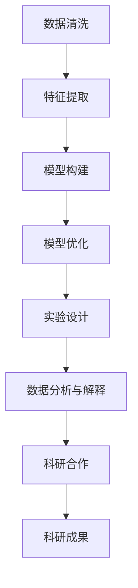

                 

# AI辅助科研：加速科学发现的新范式

> 关键词：人工智能,机器学习,科学发现,加速科研,数据处理,分析建模,优化算法,科学仪器,科学合作,科学实验,文献分析,数据可视化

## 1. 背景介绍

### 1.1 问题由来

随着科学研究的不断深入，人类对未知世界的探索越来越依赖于大规模、复杂的数据分析和模拟计算。传统的研究方法面临着数据处理能力有限、计算效率低下、实验成本昂贵等诸多挑战，严重阻碍了科研进程。因此，如何借助新兴技术手段，提升科学研究的效率和质量，成为科研界关注的焦点。

近年来，随着人工智能（AI）技术的迅猛发展，AI在科学领域的应用也越来越广泛。AI技术以其强大的数据处理能力、快速分析建模的优点，正在逐步改变传统的科研范式，为科学发现开辟了新的道路。AI辅助科研，不仅能够大幅提升数据处理和分析的效率，还能在科研决策、实验设计、数据分析等各个环节提供智能支持，加速科学发现的进程。

### 1.2 问题核心关键点

AI辅助科研的核心在于利用AI技术高效地处理和分析大规模数据，加速科学发现过程。具体来说，AI在科学发现中的应用主要体现在以下几个方面：

- **数据处理与清洗**：利用机器学习算法对科研数据进行清洗和预处理，提取有价值的信息。
- **模型构建与优化**：构建合适的机器学习模型，利用优化算法提升模型性能。
- **实验设计**：根据已有数据和模型，智能设计实验方案，优化实验参数。
- **数据分析与解释**：利用数据可视化、自然语言处理等技术，对科研结果进行深入分析与解释。
- **科研合作与共享**：利用AI技术提升科研数据和知识的共享与协作效率，促进科研合作。

这些应用，使得AI成为科研工作的有力助手，不仅降低了科研成本，提升了科研效率，还开拓了新的研究方向，推动了科学发现的发展。

### 1.3 问题研究意义

AI辅助科研的研究意义在于：

1. **加速科研进程**：AI技术能够快速处理和分析大量数据，加速科学发现过程，缩短科研周期。
2. **提高科研质量**：AI技术能够帮助科研人员识别数据中的关键信息，提高研究的深度和广度。
3. **降低科研成本**：AI技术可以自动化处理数据和模型训练，减少人力和时间成本。
4. **推动学科交叉**：AI技术的引入，使得不同领域的知识可以更便捷地整合和利用，促进学科交叉和创新。
5. **提升科研影响力**：AI技术能够提供更深入的分析和解释，提升科研成果的可视化和可解释性，增加其影响力。

通过AI辅助科研的研究，我们可以更好地理解AI技术在科学发现中的作用和潜力，推动AI技术与科学的深度融合。

## 2. 核心概念与联系

### 2.1 核心概念概述

为了深入理解AI辅助科研的技术原理和应用方法，本节将介绍几个核心概念：

- **人工智能（AI）**：以机器学习、深度学习等为代表的技术手段，通过自动学习和推理，实现对数据的智能处理和分析。
- **机器学习（ML）**：利用数据和算法，让计算机通过学习自动提升性能的一种技术。
- **深度学习（DL）**：一种特殊的机器学习算法，通过多层神经网络实现对复杂数据的高级分析。
- **数据处理**：对原始数据进行清洗、预处理、特征提取等步骤，以便于后续分析和建模。
- **模型构建**：利用机器学习算法构建适合的模型，用于数据预测、分类、聚类等任务。
- **实验设计**：根据已有数据和模型，智能设计实验方案，优化实验参数，提高实验效率。
- **数据分析与解释**：利用数据可视化、自然语言处理等技术，对科研结果进行深入分析与解释。
- **科研合作**：利用AI技术提升科研数据和知识的共享与协作效率，促进科研合作。

这些核心概念之间的逻辑关系可以通过以下Mermaid流程图来展示：



这个流程图展示了AI辅助科研的主要步骤和关键环节：

1. 原始数据经过清洗和特征提取，为后续分析奠定基础。
2. 构建合适的机器学习模型，并进行优化。
3. 根据模型结果，设计高效的实验方案。
4. 利用数据可视化和自然语言处理等技术，深入分析实验结果。
5. 通过科研合作平台，促进知识的共享与协作。
6. 最终产出科学研究成果。

## 3. 核心算法原理 & 具体操作步骤
### 3.1 算法原理概述

AI辅助科研的核心算法原理主要基于机器学习和深度学习技术，通过构建和优化模型，实现对科研数据的智能处理和分析。具体来说，AI辅助科研可以分为以下几个关键步骤：

1. **数据预处理**：对科研数据进行清洗、去噪、归一化等预处理步骤。
2. **特征提取**：从数据中提取出有意义的特征，为后续模型构建提供支持。
3. **模型选择与训练**：选择合适的机器学习模型，利用训练数据对其进行训练。
4. **模型评估与优化**：评估模型的性能，利用优化算法提升模型精度和泛化能力。
5. **实验设计**：根据模型结果，智能设计实验方案，优化实验参数。
6. **数据分析与解释**：利用数据可视化、自然语言处理等技术，对科研结果进行深入分析与解释。

这些步骤构成了一个完整的AI辅助科研流程，各环节之间相互依赖，共同推动科学发现的进程。

### 3.2 算法步骤详解

以下是一个基于机器学习算法的AI辅助科研的详细步骤：

**Step 1: 数据预处理**

数据预处理是AI辅助科研的首要步骤，主要包括以下操作：

- **数据清洗**：去除数据中的噪声和异常值，确保数据的准确性。
- **数据归一化**：对数据进行归一化处理，使其满足模型输入的要求。
- **特征选择**：从原始数据中提取出最相关的特征，减少冗余信息。

**Step 2: 特征提取**

特征提取是数据预处理的重要组成部分，主要任务是从原始数据中提取出有意义的特征，为后续模型构建提供支持。常用的特征提取方法包括：

- **主成分分析（PCA）**：通过降维技术，提取数据中的主要特征。
- **独立成分分析（ICA）**：将数据分解成独立成分，揭示数据中的潜在结构。
- **特征选择算法**：如L1正则化、信息增益等，从原始特征中筛选出最相关的特征。

**Step 3: 模型选择与训练**

选择合适的机器学习模型，利用训练数据对其进行训练。常用的机器学习模型包括：

- **线性回归**：用于预测连续型数值变量。
- **逻辑回归**：用于分类任务，输出0或1的概率。
- **支持向量机（SVM）**：用于分类和回归任务，具有高泛化能力。
- **决策树**：用于分类和回归任务，能够处理非线性关系。
- **随机森林**：多个决策树的集成，提高模型的鲁棒性和泛化能力。

模型训练的过程通常包括以下步骤：

- **模型初始化**：设置模型的参数和超参数。
- **前向传播**：将输入数据通过模型计算输出。
- **损失函数计算**：计算模型输出与真实标签之间的误差。
- **反向传播**：利用梯度下降等优化算法，更新模型参数。
- **重复迭代**：多次迭代，直到模型收敛。

**Step 4: 模型评估与优化**

模型评估与优化是模型训练的重要环节，主要任务是评估模型的性能，利用优化算法提升模型精度和泛化能力。常用的评估指标包括：

- **均方误差（MSE）**：用于回归任务，评估预测值与真实值之间的差距。
- **准确率（Accuracy）**：用于分类任务，评估模型预测的准确性。
- **F1分数（F1 Score）**：综合考虑精度和召回率，评估模型分类性能。
- **AUC-ROC曲线**：用于评估分类模型的性能，ROC曲线越接近左上角，性能越好。

常用的优化算法包括：

- **梯度下降**：通过不断更新模型参数，最小化损失函数。
- **随机梯度下降（SGD）**：每次更新使用一个样本的梯度，加快训练速度。
- **Adam优化器**：结合梯度下降和动量法的优点，加速模型收敛。
- **正则化**：如L2正则、Dropout等，防止模型过拟合。

**Step 5: 实验设计**

实验设计是科研工作的重要环节，主要任务是根据已有数据和模型，智能设计实验方案，优化实验参数。常用的实验设计方法包括：

- **拉丁超立方抽样**：利用多维空间中的均匀分布，优化实验设计。
- **响应面分析（Response Surface Methodology）**：通过建立模型，预测实验结果，优化实验参数。
- **设计空间优化（Design Space Optimization）**：利用数学优化算法，优化实验设计。

**Step 6: 数据分析与解释**

数据分析与解释是科研工作的关键环节，主要任务是利用数据可视化、自然语言处理等技术，对科研结果进行深入分析与解释。常用的数据分析与解释方法包括：

- **数据可视化**：利用图表、热力图等工具，直观展示数据分析结果。
- **聚类分析**：将数据分成若干组，发现数据中的潜在模式。
- **主题建模**：利用自然语言处理技术，提取文本中的主题信息。
- **关联规则挖掘**：利用算法，发现数据中的关联关系。

### 3.3 算法优缺点

AI辅助科研的算法具有以下优点：

1. **高效性**：利用机器学习和深度学习技术，可以快速处理和分析大量数据，加速科学发现过程。
2. **准确性**：通过构建和优化模型，提高数据处理的准确性和精度，减少人为误差。
3. **可扩展性**：利用分布式计算和云平台技术，扩展数据处理和计算能力，适应大规模科研任务。
4. **灵活性**：根据科研任务的特点，灵活选择和调整算法，提升模型性能。

同时，AI辅助科研的算法也存在一些局限性：

1. **数据质量要求高**：对数据质量要求较高，需要处理的数据量大、结构复杂。
2. **算法复杂度高**：部分算法需要大量的计算资源和专业知识，实施难度较大。
3. **模型解释性不足**：部分AI模型缺乏可解释性，难以理解其内部决策逻辑。
4. **结果可靠性依赖数据**：模型结果的可靠性依赖于数据质量和算法选择，存在一定的风险。

尽管存在这些局限性，但AI辅助科研的算法在科学发现中的应用已经展现出巨大的潜力，为科研工作带来了新的机遇和挑战。

### 3.4 算法应用领域

AI辅助科研的算法在多个领域得到了广泛应用，以下是几个典型的应用场景：

- **生物医学**：利用AI技术分析基因组数据、临床数据等，加速疾病诊断和治疗。
- **天文学**：利用AI技术处理和分析天文观测数据，发现新的天体和物理规律。
- **物理化学**：利用AI技术模拟和预测分子结构和化学反应，推动新材料的发现。
- **环境科学**：利用AI技术处理和分析环境监测数据，评估污染源和环境风险。
- **社会科学**：利用AI技术分析社会调查数据，预测社会行为和政策效果。

这些应用场景展示了AI辅助科研的广泛应用，展示了AI技术在科学研究中的巨大潜力。

## 4. 数学模型和公式 & 详细讲解  
### 4.1 数学模型构建

在AI辅助科研中，常用的数学模型包括线性回归、逻辑回归、支持向量机、随机森林等。以下以线性回归模型为例，详细讲解其构建和优化过程。

**线性回归模型**

线性回归模型假设数据之间存在线性关系，用于预测连续型数值变量。其数学模型可以表示为：

$$ y = \beta_0 + \sum_{i=1}^{n} \beta_i x_i + \epsilon $$

其中，$y$为预测变量，$\beta_0$为截距，$\beta_i$为回归系数，$x_i$为自变量，$\epsilon$为误差项。

线性回归模型的目标是最小化预测值与真实值之间的平方误差，即：

$$ \min_{\beta_0, \beta_i} \frac{1}{2N} \sum_{i=1}^{N} (y_i - (\beta_0 + \sum_{i=1}^{n} \beta_i x_{i,i})^2 $$

其中，$N$为样本数量。

**优化算法**

常用的优化算法包括梯度下降（Gradient Descent）、随机梯度下降（SGD）和Adam优化器。以下以梯度下降算法为例，讲解其优化过程。

梯度下降算法的目标是最小化损失函数，具体过程如下：

1. 初始化模型参数$\theta$。
2. 计算损失函数对$\theta$的梯度$\nabla_{\theta} L$。
3. 更新参数$\theta$：$\theta = \theta - \eta \nabla_{\theta} L$。
4. 重复步骤2和3，直到损失函数收敛。

其中，$\eta$为学习率，控制每次更新的步长。

### 4.2 公式推导过程

以线性回归模型为例，以下是其推导过程：

假设训练数据集为$D = \{(x_i, y_i)\}_{i=1}^{N}$，其中$x_i$为自变量，$y_i$为因变量。

线性回归模型的目标是最小化预测值与真实值之间的平方误差：

$$ \min_{\beta_0, \beta_i} \frac{1}{2N} \sum_{i=1}^{N} (y_i - (\beta_0 + \sum_{i=1}^{n} \beta_i x_{i,i})^2 $$

对损失函数对$\beta_0$和$\beta_i$求偏导数，得到：

$$ \frac{\partial L}{\partial \beta_0} = -\frac{1}{N} \sum_{i=1}^{N} (y_i - \hat{y}_i) $$
$$ \frac{\partial L}{\partial \beta_i} = -\frac{1}{N} \sum_{i=1}^{N} x_{i,i}(y_i - \hat{y}_i) $$

其中，$\hat{y}_i = \beta_0 + \sum_{i=1}^{n} \beta_i x_{i,i}$为预测值。

将偏导数代入梯度下降算法中，得到：

$$ \beta_0 = \beta_0 - \eta \frac{1}{N} \sum_{i=1}^{N} (y_i - \hat{y}_i) $$
$$ \beta_i = \beta_i - \eta \frac{1}{N} \sum_{i=1}^{N} x_{i,i}(y_i - \hat{y}_i) $$

通过不断迭代，直到损失函数收敛。

### 4.3 案例分析与讲解

以预测房价为例，讲解线性回归模型的构建和优化过程。

假设有一组房屋特征数据$D = \{(x_i, y_i)\}_{i=1}^{N}$，其中$x_i$包括房屋面积、地理位置、房间数量等特征，$y_i$为房屋价格。

首先，对数据进行清洗和归一化处理，确保数据质量。然后，选择线性回归模型作为预测模型。

利用训练数据集$D$，求解模型的回归系数$\beta_0$和$\beta_i$，使其最小化预测值与真实值之间的平方误差。

通过梯度下降算法，不断更新模型参数，直到损失函数收敛。最终得到的模型可以用于预测新房的房价。

## 5. 项目实践：代码实例和详细解释说明
### 5.1 开发环境搭建

在进行AI辅助科研的开发实践前，需要先准备好开发环境。以下是使用Python进行Scikit-Learn开发的环境配置流程：

1. 安装Anaconda：从官网下载并安装Anaconda，用于创建独立的Python环境。

2. 创建并激活虚拟环境：
```bash
conda create -n sklearn-env python=3.8 
conda activate sklearn-env
```

3. 安装Scikit-Learn和其他常用工具包：
```bash
conda install scikit-learn matplotlib numpy pandas seaborn
```

4. 安装必要的依赖包：
```bash
pip install statsmodels pandas_profiling
```

5. 安装Jupyter Notebook：
```bash
conda install jupyterlab
```

完成上述步骤后，即可在`sklearn-env`环境中开始AI辅助科研的开发实践。

### 5.2 源代码详细实现

以下是一个使用Scikit-Learn进行线性回归模型构建的Python代码实现。

```python
import numpy as np
from sklearn.linear_model import LinearRegression
from sklearn.model_selection import train_test_split
from sklearn.metrics import mean_squared_error, r2_score

# 假设数据集为X和y
X = np.array([[1, 2, 3], [4, 5, 6], [7, 8, 9]])
y = np.array([2, 4, 6])

# 划分训练集和测试集
X_train, X_test, y_train, y_test = train_test_split(X, y, test_size=0.2, random_state=0)

# 构建线性回归模型
model = LinearRegression()

# 拟合模型
model.fit(X_train, y_train)

# 预测结果
y_pred = model.predict(X_test)

# 评估模型
mse = mean_squared_error(y_test, y_pred)
rmse = np.sqrt(mse)
r2 = r2_score(y_test, y_pred)

print("Mean Squared Error:", mse)
print("Root Mean Squared Error:", rmse)
print("R2 Score:", r2)
```

通过这段代码，可以看到Scikit-Learn的线性回归模型构建和评估过程。

### 5.3 代码解读与分析

以下是代码的详细解读：

**数据准备**

- `np.array([[1, 2, 3], [4, 5, 6], [7, 8, 9]])`：创建数据集X，包含三个特征。
- `np.array([2, 4, 6])`：创建目标变量y，表示房屋价格。

**模型构建**

- `LinearRegression()`：创建线性回归模型。

**模型拟合**

- `model.fit(X_train, y_train)`：在训练集上拟合模型。

**模型预测**

- `y_pred = model.predict(X_test)`：在测试集上预测房屋价格。

**模型评估**

- `mean_squared_error(y_test, y_pred)`：计算预测值与真实值之间的均方误差。
- `np.sqrt(mse)`：计算均方根误差（RMSE）。
- `r2_score(y_test, y_pred)`：计算决定系数R²，评估模型性能。

**结果输出**

通过上述代码，输出模型在测试集上的均方误差、均方根误差和决定系数R²。

## 6. 实际应用场景
### 6.1 科学研究

AI辅助科研已经在科学研究中得到了广泛应用。例如，在天文学领域，利用AI技术处理和分析天文观测数据，可以发现新的天体和物理规律。在生物医学领域，利用AI技术分析基因组数据和临床数据，可以加速疾病诊断和治疗。

具体应用场景包括：

- **天文学**：利用AI技术处理和分析天文观测数据，发现新的天体和物理规律。
- **生物医学**：利用AI技术分析基因组数据和临床数据，加速疾病诊断和治疗。
- **物理化学**：利用AI技术模拟和预测分子结构和化学反应，推动新材料的发现。
- **环境科学**：利用AI技术处理和分析环境监测数据，评估污染源和环境风险。
- **社会科学**：利用AI技术分析社会调查数据，预测社会行为和政策效果。

### 6.2 医疗诊断

AI辅助科研在医疗诊断中的应用非常广泛，例如利用AI技术分析医学影像数据，可以辅助医生进行疾病诊断和治疗。

具体应用场景包括：

- **医学影像分析**：利用AI技术分析医学影像数据，辅助医生进行疾病诊断。
- **基因组分析**：利用AI技术分析基因组数据，识别遗传疾病基因。
- **病历数据分析**：利用AI技术分析病历数据，优化治疗方案。

### 6.3 环境保护

AI辅助科研在环境保护中的应用也非常重要，例如利用AI技术处理和分析环境监测数据，可以评估污染源和环境风险。

具体应用场景包括：

- **环境监测数据处理**：利用AI技术处理和分析环境监测数据，评估污染源和环境风险。
- **生态系统分析**：利用AI技术分析生态系统数据，预测生态变化趋势。
- **气候变化预测**：利用AI技术分析气候数据，预测气候变化趋势。

### 6.4 未来应用展望

未来，AI辅助科研的应用将更加广泛，涉及更多领域和场景。

- **智能实验设计**：利用AI技术优化实验设计，提高实验效率和精度。
- **科学数据共享**：利用AI技术促进科研数据的共享和协作，提升科研效率。
- **科学知识图谱**：利用AI技术构建科学知识图谱，加速知识传播和创新。

## 7. 工具和资源推荐
### 7.1 学习资源推荐

为了帮助开发者系统掌握AI辅助科研的理论基础和实践技巧，这里推荐一些优质的学习资源：

1. **《机器学习》（周志华）**：机器学习领域的经典教材，涵盖了机器学习的基础理论和应用实例。

2. **《深度学习》（Ian Goodfellow）**：深度学习领域的经典教材，详细介绍了深度学习的理论基础和实践方法。

3. **《Python机器学习》（Sebastian Raschka）**：介绍使用Python进行机器学习的实战技巧和案例。

4. **《Scikit-Learn实战》（Gael Varoquaux）**：介绍Scikit-Learn库的使用方法和应用实例。

5. **Coursera的《机器学习》课程**：斯坦福大学开设的机器学习课程，系统讲解机器学习的基本概念和算法。

6. **Kaggle竞赛平台**：提供大量数据集和算法竞赛，提升数据处理和模型构建的能力。

通过对这些资源的学习实践，相信你一定能够快速掌握AI辅助科研的理论基础和实践技巧，并用于解决实际的科研问题。

### 7.2 开发工具推荐

高效的开发离不开优秀的工具支持。以下是几款用于AI辅助科研开发的常用工具：

1. **Jupyter Notebook**：交互式编程工具，支持Python、R等多种编程语言，非常适合数据处理和模型构建。

2. **PyTorch**：深度学习框架，支持动态计算图，灵活高效，适合复杂模型构建。

3. **TensorFlow**：深度学习框架，支持静态计算图，高效稳定，适合大规模工程应用。

4. **Scikit-Learn**：机器学习库，提供了丰富的机器学习算法和工具，适合数据处理和模型构建。

5. **Weights & Biases**：模型训练的实验跟踪工具，可以记录和可视化模型训练过程中的各项指标，方便对比和调优。

6. **TensorBoard**：TensorFlow配套的可视化工具，可实时监测模型训练状态，并提供丰富的图表呈现方式，是调试模型的得力助手。

合理利用这些工具，可以显著提升AI辅助科研的开发效率，加快创新迭代的步伐。

### 7.3 相关论文推荐

AI辅助科研的研究源于学界的持续研究。以下是几篇奠基性的相关论文，推荐阅读：

1. **《机器学习》（Tom Mitchell）**：介绍机器学习的基本概念和算法，奠定了机器学习理论基础。

2. **《深度学习》（Goodfellow et al.）**：深度学习领域的奠基性论文，介绍了深度学习的理论和应用。

3. **《Scikit-Learn库的全面指南》（Joel Nothman）**：详细介绍Scikit-Learn库的使用方法和应用实例。

4. **《AI辅助科研的挑战与机遇》（Scholkopf et al.）**：介绍AI辅助科研的挑战与机遇，展望未来发展方向。

5. **《机器学习在科学研究中的应用》（Berkhout et al.）**：介绍机器学习在科学研究中的应用实例，展示机器学习技术在科研中的广泛应用。

这些论文代表了大规模科研领域的最新进展，通过学习这些前沿成果，可以帮助研究者把握学科前进方向，激发更多的创新灵感。

## 8. 总结：未来发展趋势与挑战
### 8.1 研究成果总结

AI辅助科研的研究已经取得了丰硕的成果，主要体现在以下几个方面：

1. **数据处理能力提升**：利用机器学习和深度学习技术，大幅提升数据处理和分析的效率。
2. **模型性能优化**：构建和优化多种机器学习模型，提高模型精度和泛化能力。
3. **实验设计优化**：利用AI技术优化实验设计，提高实验效率和精度。
4. **数据可视化改进**：利用数据可视化技术，深入分析科研结果，提升科研决策质量。

### 8.2 未来发展趋势

展望未来，AI辅助科研的发展趋势如下：

1. **算法多样化**：将更多前沿算法引入科研领域，如因果推理、强化学习等，提升科研效率和质量。
2. **模型可解释性增强**：通过可解释性技术，提升AI模型的透明性和可理解性，增强科研数据的可信度。
3. **多模态融合**：将不同模态的数据和知识进行融合，提升科研数据的完整性和准确性。
4. **自动化和智能化**：利用自动化技术，优化科研流程，提升科研工作的智能化水平。
5. **跨领域融合**：将AI技术与不同学科的知识进行融合，拓展科研应用的范围和深度。

### 8.3 面临的挑战

尽管AI辅助科研已经取得了显著进展，但在实际应用中仍面临一些挑战：

1. **数据质量问题**：部分科研数据质量不高，存在噪声和异常值，影响模型性能。
2. **算法复杂度高**：部分AI算法实施难度较大，需要较高的计算资源和专业知识。
3. **模型可解释性不足**：部分AI模型缺乏可解释性，难以理解其内部决策逻辑。
4. **结果可靠性依赖数据**：模型结果的可靠性依赖于数据质量和算法选择，存在一定的风险。

尽管存在这些挑战，但随着技术的不断进步和应用实践的积累，相信这些挑战终将一一被克服，AI辅助科研必将在科学研究中发挥更大的作用。

### 8.4 研究展望

未来，AI辅助科研的研究方向包括：

1. **无监督学习和半监督学习**：利用无监督和半监督学习技术，降低对标注数据的依赖，提升数据处理和分析的效率。
2. **跨学科融合**：将AI技术与不同学科的知识进行融合，拓展科研应用的范围和深度。
3. **数据和知识共享**：利用AI技术促进科研数据和知识的共享与协作，提升科研效率。
4. **自动化和智能化**：利用自动化技术，优化科研流程，提升科研工作的智能化水平。
5. **伦理和社会影响**：研究AI技术在科学研究中的伦理和社会影响，确保技术的公平性和可信度。

总之，AI辅助科研的研究方向包括算法多样化、模型可解释性增强、多模态融合、自动化和智能化以及跨学科融合等多个方面。相信随着技术的不断进步和应用实践的积累，AI辅助科研必将在科学研究中发挥更大的作用。

## 9. 附录：常见问题与解答
### Q1: 什么是AI辅助科研？

A: AI辅助科研是指利用AI技术，提升科研数据的处理和分析效率，加速科学发现的进程。主要包括数据预处理、模型构建与优化、实验设计、数据分析与解释等多个环节。

### Q2: AI辅助科研的主要优势是什么？

A: AI辅助科研的主要优势包括：

1. 提升数据处理和分析效率，加速科学发现过程。
2. 构建和优化多种机器学习模型，提高模型精度和泛化能力。
3. 利用AI技术优化实验设计，提高实验效率和精度。
4. 利用数据可视化技术，深入分析科研结果，提升科研决策质量。

### Q3: AI辅助科研面临的主要挑战是什么？

A: AI辅助科研面临的主要挑战包括：

1. 部分科研数据质量不高，存在噪声和异常值，影响模型性能。
2. 部分AI算法实施难度较大，需要较高的计算资源和专业知识。
3. 部分AI模型缺乏可解释性，难以理解其内部决策逻辑。
4. 模型结果的可靠性依赖于数据质量和算法选择，存在一定的风险。

尽管存在这些挑战，但随着技术的不断进步和应用实践的积累，相信这些挑战终将一一被克服，AI辅助科研必将在科学研究中发挥更大的作用。

### Q4: AI辅助科研的应用场景有哪些？

A: AI辅助科研的应用场景包括：

1. 科学研究：在天文学、生物医学、物理化学、环境科学和社会科学等多个领域得到广泛应用。
2. 医疗诊断：利用AI技术分析医学影像数据，辅助医生进行疾病诊断。
3. 环境保护：利用AI技术处理和分析环境监测数据，评估污染源和环境风险。
4. 智能实验设计：利用AI技术优化实验设计，提高实验效率和精度。
5. 科学数据共享：利用AI技术促进科研数据的共享和协作，提升科研效率。

通过AI辅助科研，科研人员可以更高效地处理和分析大量数据，加速科学发现的进程，推动科学研究的发展。

---

作者：禅与计算机程序设计艺术 / Zen and the Art of Computer Programming

