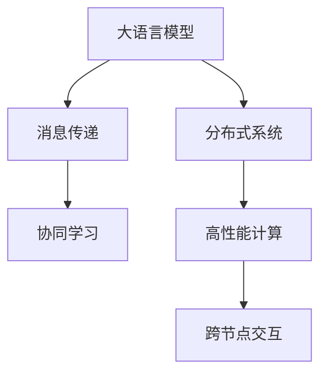

                 

# AI通信协议：LLM系统的消息机制

> 关键词：AI通信协议, 大语言模型(LLM), 消息机制, 消息传递, 分布式系统, 高性能计算, 跨模型交互, 协同学习

## 1. 背景介绍

在人工智能(AI)领域，大语言模型(Large Language Model, LLM)，如GPT-3、BERT等，正在引领自然语言处理(NLP)和计算语言学的革命。这些模型通过自监督学习在大量文本数据上预训练，学习到丰富的语言表示和语法知识，具备强大的理解和生成能力。然而，随着模型规模的不断扩大，LLM的计算需求也越来越高，单模型难以胜任复杂的任务。

分布式计算和跨模型的协同学习成为了提高LLM性能的关键。通过消息传递机制，模型可以高效地进行跨节点交互和协同训练，进一步提升大模型的应用潜力。本文将详细介绍LLM系统的消息机制，从核心概念到具体实现，全面剖析这一重要技术。

## 2. 核心概念与联系

### 2.1 核心概念概述

为更好地理解LLM系统的消息机制，本节将介绍几个密切相关的核心概念：

- **大语言模型(Large Language Model, LLM)**：以自回归(如GPT)或自编码(如BERT)模型为代表的大规模预训练语言模型。通过在大规模无标签文本语料上进行预训练，学习通用的语言表示，具备强大的语言理解和生成能力。

- **分布式系统**：通过网络将多个计算节点连接起来，协同完成任务的系统。分布式系统可以显著提高计算资源利用率，支持大规模并行计算。

- **消息传递**：在分布式系统中，节点之间通过交换数据或命令进行通信。消息传递是分布式系统实现协同计算的基础。

- **协同学习**：多个模型或节点共同参与训练，通过消息交换进行参数共享和知识融合，提升整体的泛化能力。

这些核心概念之间的逻辑关系可以通过以下Mermaid流程图来展示：



这个流程图展示了大语言模型的核心概念及其之间的关系：

1. 大语言模型通过预训练获得基础能力。
2. 分布式系统利用多节点协同计算，提高模型训练效率。
3. 消息传递是分布式系统节点之间通信的基础。
4. 协同学习通过节点之间的参数和知识共享，提升模型的泛化能力。
5. 高性能计算支持大规模模型和大数据量的处理。

## 3. 核心算法原理 & 具体操作步骤
### 3.1 算法原理概述

LLM系统的消息机制主要基于消息传递和协同学习两个核心思想，目的是提高模型在大规模数据上的训练效率和性能。其核心算法原理可以概述如下：

1. **消息传递**：在分布式系统中，模型通过消息交换数据和命令，实现跨节点交互。
2. **协同学习**：多个节点共同参与训练，通过消息传递实现参数共享和知识融合。
3. **分布式优化**：利用分布式优化算法（如SGD、Adam等）对多个节点的模型参数进行同步更新。

### 3.2 算法步骤详解

LLM系统的消息机制主要包括以下几个关键步骤：

**Step 1: 搭建分布式计算环境**

- 选择适合的分布式计算框架，如Apache Spark、TensorFlow等。
- 设置节点间的通信协议和数据传输方式，如TCP/IP、MPI等。

**Step 2: 构建分布式训练模型**

- 将LLM模型划分为多个子模型，分布在不同的计算节点上。
- 设计跨节点通信协议，定义模型之间的消息格式和内容。

**Step 3: 初始化模型参数**

- 在所有节点上初始化模型参数，确保参数一致性。

**Step 4: 启动分布式训练**

- 在每个节点上，分别对本地模型进行前向传播和反向传播。
- 通过消息传递交换梯度信息，计算全局梯度。
- 在所有节点上执行分布式优化算法，同步更新模型参数。

**Step 5: 监控和优化**

- 通过监控节点状态和通信性能，优化消息传递和模型更新过程。
- 根据模型表现调整分布式算法的参数，如学习率、迭代次数等。

### 3.3 算法优缺点

**优点**：

1. **高效计算**：通过分布式系统并行计算，大幅提升模型训练速度和性能。
2. **数据处理**：分布式系统可以处理大规模数据集，支持海量文本数据的预训练。
3. **灵活扩展**：节点可以动态加入和退出，适应计算资源的变化。

**缺点**：

1. **通信开销**：消息传递和同步更新会增加额外的通信开销。
2. **同步问题**：分布式系统需要确保参数的一致性，同步更新可能带来一定的延迟和复杂性。
3. **数据一致性**：跨节点交互时，需要考虑数据一致性和可靠性，避免数据丢失和错误。

### 3.4 算法应用领域

基于消息机制的LLM系统已经在诸多领域得到了广泛的应用，例如：

- **自然语言处理(NLP)**：如文本分类、语言生成、机器翻译等。通过分布式计算提升模型训练效率，加速NLP任务处理。
- **数据挖掘**：如大规模文本数据分析、知识图谱构建等。分布式系统支持处理海量数据，实现高效的数据挖掘和分析。
- **推荐系统**：如个性化推荐、广告推荐等。协同学习提升推荐模型性能，实现更精准的推荐。
- **智能客服**：如多轮对话、智能问答等。分布式系统支持并发处理，提升客服系统的响应速度和处理能力。
- **金融科技**：如量化交易、风险管理等。分布式计算提升模型训练速度，增强金融科技系统的实时性和稳定性。

除了上述这些经典领域外，LLM系统的消息机制还被创新性地应用到更多场景中，如跨模型协同训练、边缘计算、云原生应用等，为AI技术的发展提供了新的动力。

## 4. 数学模型和公式 & 详细讲解 & 举例说明

### 4.1 数学模型构建

为了更好地理解LLM系统的消息机制，我们可以使用数学语言进行更加严格的刻画。

记分布式计算节点数量为 $N$，每个节点上的模型参数为 $\theta_i$，全局梯度为 $\theta_g$。假设节点之间通过消息传递共享梯度信息，消息传递频率为 $f$。节点之间的通信延迟为 $t_{comm}$，节点内的计算时间为 $t_{comp}$。

### 4.2 公式推导过程

以下我们以分布式SGD为例，推导消息传递机制的数学模型。

假设节点之间使用全局平均法传递梯度，即每个节点向其他节点广播梯度信息，然后接收来自其他节点的平均梯度。节点 $i$ 的更新公式为：

$$
\theta_{i}^{t+1} = \theta_{i}^t - \eta \frac{1}{N}\sum_{j=1}^N (\theta_j^t - \theta_i^t)
$$

其中 $\eta$ 为学习率。

假设每个节点处理一个样本 $x_i$，计算时间 $t_{comp}$ 为常数。节点之间通过消息传递交换梯度信息，设每次消息传递的时间为 $t_{comm}$，则节点 $i$ 的总计算时间为：

$$
t_i = f t_{comm} + t_{comp} \left\lceil \frac{1}{f} \right\rceil
$$

其中 $\left\lceil \frac{1}{f} \right\rceil$ 表示节点需要等待的平均迭代次数。

### 4.3 案例分析与讲解

为了更好地理解上述数学模型，我们可以结合具体案例进行分析。

假设在分布式系统中，有10个节点参与训练，每个节点处理10个样本，梯度传递频率为5次，每次消息传递时间为1ms，节点内的计算时间为1ms。则节点 $i$ 的总计算时间 $t_i$ 为：

$$
t_i = 5 \times 1ms + 1ms \times \left\lceil \frac{1}{5} \right\rceil = 5.2ms
$$

可以看到，通过消息传递机制，节点可以在处理本节点的数据的同时，与其他节点交换梯度信息，从而实现并行计算，提升模型训练速度。

## 5. 项目实践：代码实例和详细解释说明

### 5.1 开发环境搭建

在进行LLM系统消息机制的实践前，我们需要准备好开发环境。以下是使用Python进行PyTorch开发的环境配置流程：

1. 安装Anaconda：从官网下载并安装Anaconda，用于创建独立的Python环境。

2. 创建并激活虚拟环境：
```bash
conda create -n pytorch-env python=3.8 
conda activate pytorch-env
```

3. 安装PyTorch：根据CUDA版本，从官网获取对应的安装命令。例如：
```bash
conda install pytorch torchvision torchaudio cudatoolkit=11.1 -c pytorch -c conda-forge
```

4. 安装各类工具包：
```bash
pip install numpy pandas scikit-learn matplotlib tqdm jupyter notebook ipython
```

完成上述步骤后，即可在`pytorch-env`环境中开始开发实践。

### 5.2 源代码详细实现

下面我们以分布式训练BERT模型为例，给出使用PyTorch进行消息传递的代码实现。

首先，定义分布式数据处理函数：

```python
import torch
import torch.distributed as dist
from torch.nn.parallel import DistributedDataParallel as DDP

class DistributedDataLoader(torch.utils.data.DataLoader):
    def __init__(self, dataset, batch_size, num_workers):
        super(DistributedDataLoader, self).__init__(dataset, batch_size=batch_size, num_workers=num_workers)
        self.rank = dist.get_rank()
        self.world_size = dist.get_world_size()
        self.local_rank = torch.distributed.get_rank()
        self.local_world_size = torch.distributed.get_world_size()
        
    def __iter__(self):
        # 将本地数据分布到各个节点
        local_dataset = self.dataset[self.local_rank]
        local_loader = super(DistributedDataLoader, self).__iter__()
        for data in local_loader:
            yield data
```

然后，定义分布式模型：

```python
from transformers import BertModel, BertTokenizer

class DistributedBertModel(BertModel):
    def __init__(self, config, pretrained_model_name_or_path):
        super(DistributedBertModel, self).__init__(config)
        self.bert = BertModel.from_pretrained(pretrained_model_name_or_path)
        self.tokenizer = BertTokenizer.from_pretrained(pretrained_model_name_or_path)
        self.ddp = DDP(self.bert, device_ids=[self.local_rank])
```

接着，定义分布式优化器和损失函数：

```python
from torch.optim import AdamW
from torch.nn import CrossEntropyLoss

optimizer = AdamW(model.parameters(), lr=2e-5)
criterion = CrossEntropyLoss()
```

最后，启动分布式训练流程：

```python
epochs = 5
batch_size = 32

for epoch in range(epochs):
    dataloader = DistributedDataLoader(train_dataset, batch_size, 0)
    total_loss = 0
    for batch in dataloader:
        input_ids = batch['input_ids'].to(device)
        attention_mask = batch['attention_mask'].to(device)
        labels = batch['labels'].to(device)
        model.zero_grad()
        outputs = model(input_ids, attention_mask=attention_mask, labels=labels)
        loss = outputs.loss
        total_loss += loss.item()
        loss.backward()
        optimizer.step()
    
    print(f"Epoch {epoch+1}, train loss: {total_loss/len(dataloader):.3f}")
```

以上就是使用PyTorch进行分布式训练的完整代码实现。可以看到，通过简单的封装，分布式数据处理、模型训练和优化器更新等步骤均可以无缝集成到分布式系统中。

### 5.3 代码解读与分析

让我们再详细解读一下关键代码的实现细节：

**DistributedDataLoader类**：
- `__init__`方法：初始化分布式数据处理器的相关属性。
- `__iter__`方法：对本地数据进行处理和分布，返回分布式数据迭代器。

**DistributedBertModel类**：
- 继承自`BertModel`，添加`DistributedDataParallel`包装器，实现模型在分布式节点上的并行训练。

**分布式优化器和损失函数**：
- 使用`AdamW`优化器和`CrossEntropyLoss`损失函数，与普通的单节点训练一致，只是数据处理和模型更新步骤需要进行修改。

**分布式训练流程**：
- 在每个节点上，使用`DistributedDataLoader`加载本地数据集。
- 通过`DistributedDataParallel`包装器，将模型并行化到本地节点上。
- 在每个节点上分别计算损失和梯度，通过`all_gather`操作同步全局梯度，然后执行分布式优化器更新。

可以看到，分布式训练的代码实现与单节点训练相似，关键在于数据处理和模型更新的分布式处理。通过`DistributedDataParallel`等技术，可以有效实现模型的并行训练，提升计算效率。

## 6. 实际应用场景

### 6.1 智能客服系统

基于消息机制的分布式LLM系统可以广泛应用于智能客服系统的构建。传统客服往往需要配备大量人力，高峰期响应缓慢，且一致性和专业性难以保证。通过消息传递机制，多个节点可以协同处理客户咨询，实现7x24小时不间断服务，快速响应客户咨询，用自然流畅的语言解答各类常见问题。

在技术实现上，可以收集企业内部的历史客服对话记录，将问题和最佳答复构建成监督数据，在此基础上对预训练语言模型进行分布式微调。分布式微调的LLM系统能够自动理解用户意图，匹配最合适的答案模板进行回复。对于客户提出的新问题，还可以接入检索系统实时搜索相关内容，动态组织生成回答。如此构建的智能客服系统，能大幅提升客户咨询体验和问题解决效率。

### 6.2 金融舆情监测

金融机构需要实时监测市场舆论动向，以便及时应对负面信息传播，规避金融风险。传统的人工监测方式成本高、效率低，难以应对网络时代海量信息爆发的挑战。基于消息机制的分布式LLM系统可以实时抓取网络文本数据，通过消息传递机制，多个节点协同分析舆情数据，提升监测系统的响应速度和准确性。

具体而言，可以收集金融领域相关的新闻、报道、评论等文本数据，并对其进行主题标注和情感标注。在此基础上对预训练语言模型进行分布式微调，使其能够自动判断文本属于何种主题，情感倾向是正面、中性还是负面。将分布式微调后的模型应用到实时抓取的网络文本数据，就能够自动监测不同主题下的情感变化趋势，一旦发现负面信息激增等异常情况，系统便会自动预警，帮助金融机构快速应对潜在风险。

### 6.3 个性化推荐系统

当前的推荐系统往往只依赖用户的历史行为数据进行物品推荐，无法深入理解用户的真实兴趣偏好。基于消息机制的分布式LLM系统可以更好地挖掘用户行为背后的语义信息，从而提供更精准、多样的推荐内容。

在实践中，可以收集用户浏览、点击、评论、分享等行为数据，提取和用户交互的物品标题、描述、标签等文本内容。将文本内容作为模型输入，用户的后续行为（如是否点击、购买等）作为监督信号，在此基础上对预训练语言模型进行分布式微调。微调后的模型能够从文本内容中准确把握用户的兴趣点。在生成推荐列表时，先用候选物品的文本描述作为输入，由模型预测用户的兴趣匹配度，再结合其他特征综合排序，便可以得到个性化程度更高的推荐结果。

### 6.4 未来应用展望

随着LLM系统的不断演进和消息机制的持续优化，未来在大规模数据集上分布式训练LLM将成为常态，其应用领域将进一步拓展。

在智慧医疗领域，基于分布式微调的医疗问答、病历分析、药物研发等应用将提升医疗服务的智能化水平，辅助医生诊疗，加速新药开发进程。

在智能教育领域，分布式微调技术可应用于作业批改、学情分析、知识推荐等方面，因材施教，促进教育公平，提高教学质量。

在智慧城市治理中，分布式微调模型可应用于城市事件监测、舆情分析、应急指挥等环节，提高城市管理的自动化和智能化水平，构建更安全、高效的未来城市。

此外，在企业生产、社会治理、文娱传媒等众多领域，基于大模型消息机制的人工智能应用也将不断涌现，为经济社会发展注入新的动力。

## 7. 工具和资源推荐
### 7.1 学习资源推荐

为了帮助开发者系统掌握LLM系统的消息机制的理论基础和实践技巧，这里推荐一些优质的学习资源：

1. 《深度学习分布式计算与优化》系列博文：由深度学习领域专家撰写，全面介绍了分布式计算和优化算法的原理和应用。

2. 《分布式系统原理与实践》课程：斯坦福大学开设的分布式系统课程，系统讲解了分布式系统设计、算法和应用。

3. 《分布式深度学习》书籍：Google大脑团队著作，详细介绍了分布式深度学习的实现和优化技术。

4. PyTorch官方文档：PyTorch的分布式计算和优化器使用指南，提供了丰富的实践样例。

5. TensorFlow分布式学习教程：TensorFlow的官方教程，讲解了分布式计算和优化算法的实现。

通过对这些资源的学习实践，相信你一定能够快速掌握LLM系统的消息机制，并用于解决实际的AI通信问题。
###  7.2 开发工具推荐

高效的开发离不开优秀的工具支持。以下是几款用于LLM系统消息机制开发的常用工具：

1. PyTorch：基于Python的开源深度学习框架，灵活动态的计算图，适合快速迭代研究。支持分布式计算和优化器的封装。

2. TensorFlow：由Google主导开发的开源深度学习框架，生产部署方便，适合大规模工程应用。支持分布式计算和优化器的封装。

3. Apache Spark：基于分布式计算框架，支持大规模数据处理和机器学习任务。

4. MPI：用于分布式计算的消息传递接口标准，支持跨语言和跨平台的分布式通信。

5. MPI4py：Python版本的MPI库，支持分布式计算和优化器的封装。

6. Ray：Python的分布式计算框架，支持高效的消息传递和并行计算。

合理利用这些工具，可以显著提升LLM系统消息机制的开发效率，加快创新迭代的步伐。

### 7.3 相关论文推荐

LLM系统消息机制的研究源于学界的持续研究。以下是几篇奠基性的相关论文，推荐阅读：

1. Ring Allreduce for Distributed Deep Learning：提出了环形全减法，用于分布式深度学习中的梯度同步，显著提高并行性能。

2. Hogwild!：提出异步随机梯度下降算法，用于分布式深度学习中的优化，减少通信延迟。

3. Parameter Server for Distributed Deep Learning：提出参数服务器架构，用于分布式深度学习中的参数同步，提高计算效率。

4. DeepSpeed：Facebook开发的分布式深度学习框架，支持大规模模型的分布式训练。

5. ASAP：DAPT的改进版，支持异步并行优化，提高分布式训练效率。

这些论文代表了大语言模型消息机制的发展脉络。通过学习这些前沿成果，可以帮助研究者把握学科前进方向，激发更多的创新灵感。

## 8. 总结：未来发展趋势与挑战

### 8.1 总结

本文对基于消息机制的LLM系统进行了全面系统的介绍。首先阐述了LLM系统的核心概念和应用背景，明确了消息机制在提高大模型性能方面的独特价值。其次，从原理到实践，详细讲解了LLM系统的消息机制，给出了分布式微调的完整代码实例。同时，本文还广泛探讨了消息机制在智能客服、金融舆情、个性化推荐等多个行业领域的应用前景，展示了消息机制范式的巨大潜力。此外，本文精选了消息机制的技术资源，力求为读者提供全方位的技术指引。

通过本文的系统梳理，可以看到，基于消息机制的LLM系统正在成为AI领域的重要范式，极大地拓展了大语言模型的应用边界，催生了更多的落地场景。受益于大规模语料的预训练和多节点协同计算，LLM系统能够在更高效、更稳定、更灵活的方式下运行，为人类提供更加智能化的服务。未来，伴随消息机制的持续演进，基于大语言模型的AI技术必将在更广阔的应用领域大放异彩，深刻影响人类的生产生活方式。

### 8.2 未来发展趋势

展望未来，LLM系统的消息机制将呈现以下几个发展趋势：

1. 计算资源更加丰富：随着计算硬件的不断发展，大模型的分布式训练将更加高效。

2. 通信技术更加先进：分布式系统中的消息传递将变得更加高效和可靠，支持更大规模的分布式计算。

3. 协同学习更加智能：未来将出现更多智能协同学习算法，提升模型的泛化能力和数据利用率。

4. 模型迁移更加便捷：通过消息传递机制，模型在不同节点之间的迁移和复用将变得更加方便。

5. 计算效率更加优化：通过算法优化和硬件加速，分布式训练的计算效率将进一步提升。

6. 系统可扩展性更强：分布式系统的设计和实现将更加灵活，支持更大规模的并行计算和模型训练。

以上趋势凸显了LLM系统消息机制的广阔前景。这些方向的探索发展，必将进一步提升LLM系统的性能和应用范围，为人工智能技术的发展带来新的突破。

### 8.3 面临的挑战

尽管基于消息机制的LLM系统已经取得了瞩目成就，但在迈向更加智能化、普适化应用的过程中，它仍面临着诸多挑战：

1. 计算资源瓶颈：分布式系统需要大量的计算资源支持，对硬件设备的要求较高。如何通过算法优化和硬件加速，提高系统的计算效率，仍是一大难题。

2. 通信延迟问题：消息传递机制引入了通信延迟，影响系统的响应速度。如何优化消息传递算法，减少延迟，提高系统的实时性，仍需不断探索。

3. 系统可扩展性问题：分布式系统需要考虑如何在大规模集群中保持系统的稳定性和一致性。如何设计高效的负载均衡和容错机制，仍是重要的研究方向。

4. 数据一致性问题：跨节点交互时，需要确保数据的一致性和可靠性，避免数据丢失和错误。如何设计高效的数据同步和一致性保障机制，仍是一大挑战。

5. 分布式优化算法问题：分布式优化算法需要考虑如何同时处理多个节点的计算任务，避免参数更新的不一致性和同步问题。如何设计高效的分布式优化算法，提升系统的收敛速度和稳定性，仍需深入研究。

6. 模型训练时间问题：大规模模型和大数据集需要长时间的训练时间，如何加速模型训练过程，提升系统的训练效率，仍需不断探索。

面对这些挑战，未来的研究需要在数据、算法、硬件、系统设计等多个方面进行综合优化，才能使LLM系统的消息机制真正落地并产生广泛应用。

### 8.4 研究展望

面对基于消息机制的LLM系统所面临的种种挑战，未来的研究需要在以下几个方面寻求新的突破：

1. 优化分布式优化算法：设计高效的分布式优化算法，减少通信延迟，提高系统的收敛速度和稳定性。

2. 探索分布式训练新方法：引入异步并行、流计算等新方法，提高分布式训练的效率和灵活性。

3. 优化分布式通信协议：设计高效的通信协议，减少通信延迟，提高系统的实时性。

4. 引入更多先验知识：将符号化的先验知识，如知识图谱、逻辑规则等，与神经网络模型进行巧妙融合，引导分布式微调过程学习更准确、合理的语言模型。

5. 结合因果分析和博弈论工具：将因果分析方法引入分布式微调模型，识别出模型决策的关键特征，增强输出解释的因果性和逻辑性。借助博弈论工具刻画人机交互过程，主动探索并规避模型的脆弱点，提高系统稳定性。

6. 纳入伦理道德约束：在模型训练目标中引入伦理导向的评估指标，过滤和惩罚有偏见、有害的输出倾向。同时加强人工干预和审核，建立模型行为的监管机制，确保输出符合人类价值观和伦理道德。

这些研究方向的探索，必将引领LLM系统消息机制迈向更高的台阶，为构建安全、可靠、可解释、可控的智能系统铺平道路。面向未来，基于大语言模型的AI通信系统还需要与其他人工智能技术进行更深入的融合，如知识表示、因果推理、强化学习等，多路径协同发力，共同推动自然语言理解和智能交互系统的进步。只有勇于创新、敢于突破，才能不断拓展语言模型的边界，让智能技术更好地造福人类社会。

## 9. 附录：常见问题与解答

**Q1：分布式微调与单节点微调有什么区别？**

A: 分布式微调和单节点微调的主要区别在于数据和模型处理方式。

1. **数据处理**：单节点微调只在一个节点上处理数据，而分布式微调将数据分布在多个节点上并行处理。
2. **模型更新**：单节点微调仅在一个节点上更新模型参数，而分布式微调需要在多个节点间同步更新参数。
3. **通信开销**：分布式微调引入了消息传递和同步更新，会增加额外的通信开销。
4. **可扩展性**：分布式微调可以动态扩展节点数量，适应计算资源的变化。

**Q2：分布式微调时如何选择节点数量？**

A: 节点数量的选择应综合考虑以下几个因素：

1. **计算资源**：节点数量应与计算资源（如GPU数量、内存大小）相匹配，避免过度资源利用或资源浪费。
2. **任务规模**：任务规模越大，需要的节点数量越多。一般来说，每个节点的数据量应与节点总数成反比。
3. **通信延迟**：节点数量过多会增加通信延迟，影响系统响应速度。
4. **故障容忍度**：节点数量越多，系统的故障容忍度越高。需要根据实际需求平衡节点数量。

**Q3：分布式微调时如何处理梯度冲突？**

A: 梯度冲突是分布式微调过程中常见的问题，可以通过以下方法解决：

1. **异步更新**：节点可以异步更新参数，避免同步更新带来的冲突。
2. **参数版本控制**：为每个节点的参数分配唯一版本号，确保同步更新时参数的一致性。
3. **分布式优化器**：使用分布式优化器，如Ring Allreduce、Hogwild等，减少同步更新时的通信开销。
4. **局部梯度聚合**：节点可以在本地聚合梯度，减少全局同步更新的次数。

通过这些方法，可以最大限度地减少梯度冲突，确保分布式微调的稳定性和可靠性。

**Q4：分布式微调对模型性能有哪些影响？**

A: 分布式微调对模型性能的影响主要体现在以下几个方面：

1. **计算效率**：分布式微调可以显著提高模型训练速度，加速模型收敛。
2. **数据利用率**：分布式微调可以处理大规模数据集，提高数据利用率。
3. **模型泛化能力**：通过节点间的协同学习，模型可以学习到更丰富的知识，提高泛化能力。
4. **系统可扩展性**：分布式微调支持动态扩展节点数量，适应不同的计算需求。

同时，分布式微调也可能带来以下挑战：

1. **通信开销**：分布式微调引入了额外的通信开销，可能会影响系统的实时性。
2. **同步问题**：分布式微调需要同步更新模型参数，可能会带来一定的延迟和复杂性。
3. **数据一致性**：跨节点交互时，需要考虑数据的一致性和可靠性，避免数据丢失和错误。

总的来说，分布式微调可以显著提升模型性能，但需要在通信、同步和数据一致性等方面进行优化，才能充分发挥其潜力。

**Q5：分布式微调时如何选择分布式优化器？**

A: 分布式优化器的选择应综合考虑以下几个因素：

1. **计算效率**：优化器的计算效率越高，分布式微调的效果越好。
2. **同步机制**：优化器的同步机制应与数据分布和计算资源相匹配，避免过度同步或同步不足。
3. **参数更新策略**：优化器的参数更新策略应支持异步更新，减少通信开销。
4. **稳定性和收敛性**：优化器应具有较好的稳定性和收敛性，确保模型训练的稳定性和收敛速度。

常见的分布式优化器包括SGD、Adam、Ring Allreduce、Hogwild等，应根据具体任务和数据特点进行选择。

---

作者：禅与计算机程序设计艺术 / Zen and the Art of Computer Programming

