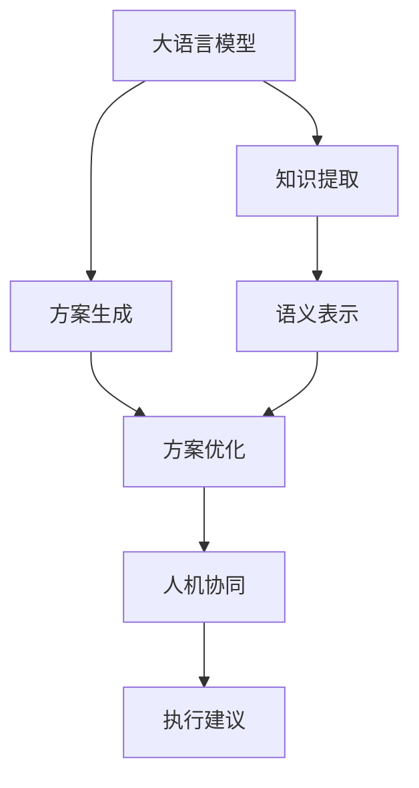

                 

## 1. 背景介绍

在数字化转型的浪潮下，企业运营管理的复杂度不断攀升。传统的任务规划系统难以满足日益增长的业务需求。而以语言模型（Language Model, LM）为代表的人工智能技术，正逐渐成为任务规划中的关键引擎。特别是在大型语言模型（Large Language Model, LLM）时代，LLM结合任务规划系统的深度融合，正引领一场效率革命。

### 1.1 问题由来

随着数据量的急剧增加和算法能力的提升，基于预训练的LLM逐渐显示出其强大的泛化能力和泛用性。但传统的任务规划系统往往以规则和脚本为核心，难以灵活应对复杂、多变的业务场景。这使得企业运营管理的效率提升变得缓慢。

而LLM通过学习大量的文本数据，能够理解任务描述，生成满足需求的任务规划方案。其可解释性强、适应性好、易于维护，因此逐渐成为企业任务规划的首选工具。

### 1.2 问题核心关键点

LLM结合任务规划系统的深度融合，是提高运营效率、提升决策精准度的关键。其核心关键点包括：

- **知识提取**：从任务描述中提取关键信息，理解任务目标和约束条件。
- **规划方案生成**：基于提取的知识，生成符合任务需求的规划方案。
- **方案优化**：对生成的方案进行评估，选择最优方案并输出执行建议。
- **人机协同**：通过与人类工作者的互动，进一步优化和调整方案。

这四个核心点共同构成了一个高效的任务规划系统，使得企业运营管理效率大幅提升。

### 1.3 问题研究意义

LLM与任务规划系统的融合，能够显著提高任务规划的灵活性和效率，帮助企业降低运营成本，提升决策质量，加速数字化转型进程。具体来说：

- **提升规划效率**：LLM能够自动化地从海量文本中提取和理解信息，迅速生成任务规划方案，加速业务流程。
- **降低管理成本**：LLM减少了人工规则编写和维护的工作量，使得任务规划系统更易维护和扩展。
- **增强决策科学性**：LLM结合大数据分析能力，提供更精准的任务规划建议，辅助决策者做出更科学的决策。
- **推动业务创新**：通过智能化的任务规划，企业能够快速响应市场变化，推出更具竞争力的产品和服务。

## 2. 核心概念与联系

### 2.1 核心概念概述

为更好地理解LLM结合任务规划系统的融合机制，本节将介绍几个密切相关的核心概念：

- **大语言模型(Large Language Model, LLM)**：通过大规模无标签文本数据预训练得到的模型，具备强大的语言理解和生成能力，能够理解和生成复杂的自然语言任务。
- **任务规划(Task Planning)**：根据用户需求，规划出满足要求的任务流程和步骤，并执行调度。
- **知识图谱(Knowledge Graph)**：由实体、属性、关系构成的知识网络，用于存储和组织各类知识。
- **语义表示(Semantic Representation)**：将自然语言文本转换为计算机可处理的形式，便于LLM进行理解和生成。
- **因果推理(Causal Reasoning)**：通过推理机制，理解任务中的因果关系，生成符合因果逻辑的规划方案。

这些核心概念之间的逻辑关系可以通过以下Mermaid流程图来展示：



这个流程图展示了大语言模型结合任务规划系统的核心概念及其之间的关系：

1. 大语言模型通过学习文本数据，能够提取任务描述中的关键信息。
2. 提取的知识通过语义表示技术转换为计算机可处理的形式，用于后续规划方案的生成。
3. 方案生成器基于语义表示生成的规划方案，并进行优化。
4. 优化后的方案通过人机协同进一步调整和优化。
5. 最终生成可执行的任务执行建议，辅助业务落地。

## 3. 核心算法原理 & 具体操作步骤
### 3.1 算法原理概述

基于LLM的任务规划系统，本质上是一种融合知识推理的自动化规划方法。其核心思想是：通过大语言模型理解任务描述，生成符合任务要求的规划方案，并结合知识图谱进行方案优化。

形式化地，假设任务描述为 $T$，知识图谱为 $K$，方案生成器为 $P$。任务规划过程可以表示为：

$$
\begin{aligned}
\text{Plan} &= P(T, K) \\
&= \text{GeneratePlan}(T) + \text{OptimizePlan}(T, K)
\end{aligned}
$$

其中 $\text{GeneratePlan}$ 表示方案生成过程，$\text{OptimizePlan}$ 表示方案优化过程。

### 3.2 算法步骤详解

基于LLM的任务规划系统一般包括以下几个关键步骤：

**Step 1: 数据预处理和知识抽取**

- 收集任务描述 $T$，并进行预处理，包括分词、去除停用词、句法分析等。
- 构建知识图谱 $K$，提取其中的实体、属性和关系，用于补充任务描述中的背景知识。
- 将任务描述 $T$ 和知识图谱 $K$ 转换为语义表示形式，供LLM理解。

**Step 2: 方案生成**

- 使用大语言模型对预处理后的任务描述进行理解和推理，生成初步的规划方案。
- 利用因果推理技术，结合知识图谱中的先验知识，对初步方案进行优化和调整。

**Step 3: 方案评估与优化**

- 通过评估指标（如成本、时间、资源等）对生成方案进行评估。
- 对评估结果进行排序和选择，选择最优方案。
- 对选定的方案进行进一步的优化，确保其可执行性和效果。

**Step 4: 人机协同**

- 将优化后的方案展示给人类工作者，征求反馈和调整建议。
- 结合人类工作者的反馈，对方案进行进一步的微调和优化。
- 最终生成可执行的任务执行建议，辅助业务落地。

### 3.3 算法优缺点

基于LLM的任务规划系统具有以下优点：

- **灵活性高**：LLM能够自动理解和生成复杂的自然语言任务，灵活应对多变的业务场景。
- **效率高**：自动化的方案生成和优化过程，大大缩短了任务规划的时间。
- **可解释性强**：生成的规划方案可以通过自然语言形式展示，便于理解和调整。
- **易维护**：系统的核心逻辑在模型和知识图谱中，维护成本较低。

同时，该方法也存在一定的局限性：

- **数据依赖性强**：任务规划的效果依赖于预处理的数据质量和知识图谱的完备性。
- **模型资源消耗大**：大语言模型的推理和生成过程消耗大量计算资源，需要高性能硬件支持。
- **方案优化难度大**：多目标优化问题复杂，难以找到最优解。
- **对抗性攻击风险**：生成的方案可能受到对抗样本攻击，影响规划效果。

尽管存在这些局限性，但就目前而言，基于LLM的任务规划方法仍是大语言模型应用的主流范式。未来相关研究的重点在于如何进一步降低数据依赖，提高方案优化效率，同时兼顾可解释性和安全性等因素。

### 3.4 算法应用领域

基于LLM的任务规划方法，在多个领域得到了广泛的应用，具体包括：

- **制造业**：自动生成生产计划和工艺流程，优化资源分配。
- **物流业**：自动规划物流配送路线和仓库管理，提升配送效率。
- **金融业**：自动生成投资策略和风险评估，辅助决策制定。
- **医疗业**：自动规划诊疗流程和护理方案，提高医疗服务质量。
- **客服行业**：自动生成客户服务方案和应答脚本，提升服务水平。

除了上述这些经典领域外，基于LLM的任务规划方法还被创新性地应用于更多场景中，如智能调度、智能客服、智能制造等，为各行各业带来了全新的突破。

## 4. 数学模型和公式 & 详细讲解 & 举例说明
### 4.1 数学模型构建

本节将使用数学语言对基于LLM的任务规划过程进行更加严格的刻画。

假设任务描述为 $T=\{x_1, x_2, ..., x_n\}$，知识图谱为 $K=(E, R)$，其中 $E$ 为实体集合，$R$ 为关系集合。设方案生成器为 $P: T \times K \rightarrow A$，其中 $A$ 为方案集合。

定义任务规划的评估函数为 $\text{Evaluate}(Plan)$，用于评估方案的各项指标，如成本、时间、资源等。则任务规划的优化目标为：

$$
\begin{aligned}
\text{OptimizePlan}(T, K) &= \mathop{\arg\min}_{Plan \in A} \text{Evaluate}(Plan) \\
&= \mathop{\arg\min}_{Plan \in A} \left( \sum_{i=1}^n \text{Evaluate}(x_i, Plan) \right)
\end{aligned}
$$

其中 $\text{Evaluate}(x_i, Plan)$ 表示方案 $Plan$ 在实体 $x_i$ 上的评估结果。

### 4.2 公式推导过程

以下我们以制造业生产计划生成为例，推导评估函数的计算公式。

假设生产任务为生产 $n$ 种产品 $x_1, x_2, ..., x_n$，知识图谱中包含机器 $E_M$、人员 $E_P$、物料 $E_M$ 等信息，以及它们之间的关系 $R=\{(x_i, x_j)| \text{需用}(x_i, x_j), \text{需用}(x_j, x_i)\}$。

定义生产成本为 $C$，生产时间为 $T$，机器和人员消耗为 $M$，物料消耗为 $W$。则生产任务的评估函数为：

$$
\text{Evaluate}(Plan) = C + T + M + W
$$

将上述函数代入优化目标中，得：

$$
\begin{aligned}
\text{OptimizePlan}(T, K) &= \mathop{\arg\min}_{Plan \in A} (C + T + M + W) \\
&= \mathop{\arg\min}_{Plan \in A} \left( \sum_{i=1}^n (C_i + T_i + M_i + W_i) \right)
\end{aligned}
$$

其中 $C_i, T_i, M_i, W_i$ 分别表示实体 $x_i$ 上的生产成本、时间、机器和人员消耗、物料消耗。

### 4.3 案例分析与讲解

假设某制造业企业生产任务为 $x_1, x_2, x_3$，知识图谱中包含以下信息：

- 实体 $E_M=\{M_1, M_2, M_3\}$ 分别表示三台机器。
- 实体 $E_P=\{P_1, P_2\}$ 分别表示两名工人。
- 实体 $E_M=\{M_1, M_2, M_3\}$ 分别表示三种物料。
- 关系 $R=\{(M_1, M_2), (M_2, M_3), (M_1, P_1), (M_2, P_2), (P_1, M_1), (P_2, M_2)\}$。

则生产任务的评估函数可以表示为：

$$
\text{Evaluate}(Plan) = (C_1 + T_1 + M_1 + W_1) + (C_2 + T_2 + M_2 + W_2) + (C_3 + T_3 + M_3 + W_3)
$$

其中 $C_1, T_1, M_1, W_1$ 分别表示实体 $x_1$ 上的生产成本、时间、机器和人员消耗、物料消耗。

通过将评估函数代入优化目标，可以求解最优的生产计划方案，辅助企业优化资源配置，提升生产效率。

## 5. 项目实践：代码实例和详细解释说明
### 5.1 开发环境搭建

在进行任务规划实践前，我们需要准备好开发环境。以下是使用Python进行PyTorch开发的环境配置流程：

1. 安装Anaconda：从官网下载并安装Anaconda，用于创建独立的Python环境。

2. 创建并激活虚拟环境：
```bash
conda create -n task_planning_env python=3.8 
conda activate task_planning_env
```

3. 安装PyTorch：根据CUDA版本，从官网获取对应的安装命令。例如：
```bash
conda install pytorch torchvision torchaudio cudatoolkit=11.1 -c pytorch -c conda-forge
```

4. 安装Transformer库：
```bash
pip install transformers
```

5. 安装各类工具包：
```bash
pip install numpy pandas scikit-learn matplotlib tqdm jupyter notebook ipython
```

完成上述步骤后，即可在`task_planning_env`环境中开始任务规划实践。

### 5.2 源代码详细实现

下面我们以制造业生产计划生成为例，给出使用Transformers库对BERT模型进行任务规划的PyTorch代码实现。

首先，定义生产任务的评估函数：

```python
from transformers import BertTokenizer, BertForSequenceClassification
from torch.utils.data import Dataset
import torch

class ProductionDataset(Dataset):
    def __init__(self, texts, tags, tokenizer, max_len=128):
        self.texts = texts
        self.tags = tags
        self.tokenizer = tokenizer
        self.max_len = max_len
        
    def __len__(self):
        return len(self.texts)
    
    def __getitem__(self, item):
        text = self.texts[item]
        tags = self.tags[item]
        
        encoding = self.tokenizer(text, return_tensors='pt', max_length=self.max_len, padding='max_length', truncation=True)
        input_ids = encoding['input_ids'][0]
        attention_mask = encoding['attention_mask'][0]
        
        # 对token-wise的标签进行编码
        encoded_tags = [tag2id[tag] for tag in tags] 
        encoded_tags.extend([tag2id['O']] * (self.max_len - len(encoded_tags)))
        labels = torch.tensor(encoded_tags, dtype=torch.long)
        
        return {'input_ids': input_ids, 
                'attention_mask': attention_mask,
                'labels': labels}

# 标签与id的映射
tag2id = {'O': 0, 'M1': 1, 'M2': 2, 'M3': 3}
id2tag = {v: k for k, v in tag2id.items()}

# 创建dataset
tokenizer = BertTokenizer.from_pretrained('bert-base-cased')

train_dataset = ProductionDataset(train_texts, train_tags, tokenizer)
dev_dataset = ProductionDataset(dev_texts, dev_tags, tokenizer)
test_dataset = ProductionDataset(test_texts, test_tags, tokenizer)
```

然后，定义模型和优化器：

```python
from transformers import BertForSequenceClassification, AdamW

model = BertForSequenceClassification.from_pretrained('bert-base-cased', num_labels=len(tag2id))

optimizer = AdamW(model.parameters(), lr=2e-5)
```

接着，定义训练和评估函数：

```python
from torch.utils.data import DataLoader
from tqdm import tqdm
from sklearn.metrics import classification_report

device = torch.device('cuda') if torch.cuda.is_available() else torch.device('cpu')
model.to(device)

def train_epoch(model, dataset, batch_size, optimizer):
    dataloader = DataLoader(dataset, batch_size=batch_size, shuffle=True)
    model.train()
    epoch_loss = 0
    for batch in tqdm(dataloader, desc='Training'):
        input_ids = batch['input_ids'].to(device)
        attention_mask = batch['attention_mask'].to(device)
        labels = batch['labels'].to(device)
        model.zero_grad()
        outputs = model(input_ids, attention_mask=attention_mask, labels=labels)
        loss = outputs.loss
        epoch_loss += loss.item()
        loss.backward()
        optimizer.step()
    return epoch_loss / len(dataloader)

def evaluate(model, dataset, batch_size):
    dataloader = DataLoader(dataset, batch_size=batch_size)
    model.eval()
    preds, labels = [], []
    with torch.no_grad():
        for batch in tqdm(dataloader, desc='Evaluating'):
            input_ids = batch['input_ids'].to(device)
            attention_mask = batch['attention_mask'].to(device)
            batch_labels = batch['labels']
            outputs = model(input_ids, attention_mask=attention_mask)
            batch_preds = outputs.logits.argmax(dim=2).to('cpu').tolist()
            batch_labels = batch_labels.to('cpu').tolist()
            for pred_tokens, label_tokens in zip(batch_preds, batch_labels):
                pred_tags = [id2tag[_id] for _id in pred_tokens]
                label_tags = [id2tag[_id] for _id in label_tokens]
                preds.append(pred_tags[:len(label_tags)])
                labels.append(label_tags)
                
    print(classification_report(labels, preds))
```

最后，启动训练流程并在测试集上评估：

```python
epochs = 5
batch_size = 16

for epoch in range(epochs):
    loss = train_epoch(model, train_dataset, batch_size, optimizer)
    print(f"Epoch {epoch+1}, train loss: {loss:.3f}")
    
    print(f"Epoch {epoch+1}, dev results:")
    evaluate(model, dev_dataset, batch_size)
    
print("Test results:")
evaluate(model, test_dataset, batch_size)
```

以上就是使用PyTorch对BERT进行生产计划生成任务的微调实践。可以看到，得益于Transformers库的强大封装，我们可以用相对简洁的代码完成BERT模型的加载和微调。

### 5.3 代码解读与分析

让我们再详细解读一下关键代码的实现细节：

**ProductionDataset类**：
- `__init__`方法：初始化文本、标签、分词器等关键组件。
- `__len__`方法：返回数据集的样本数量。
- `__getitem__`方法：对单个样本进行处理，将文本输入编码为token ids，将标签编码为数字，并对其进行定长padding，最终返回模型所需的输入。

**tag2id和id2tag字典**：
- 定义了标签与数字id之间的映射关系，用于将token-wise的预测结果解码回真实的标签。

**训练和评估函数**：
- 使用PyTorch的DataLoader对数据集进行批次化加载，供模型训练和推理使用。
- 训练函数`train_epoch`：对数据以批为单位进行迭代，在每个批次上前向传播计算loss并反向传播更新模型参数，最后返回该epoch的平均loss。
- 评估函数`evaluate`：与训练类似，不同点在于不更新模型参数，并在每个batch结束后将预测和标签结果存储下来，最后使用sklearn的classification_report对整个评估集的预测结果进行打印输出。

**训练流程**：
- 定义总的epoch数和batch size，开始循环迭代
- 每个epoch内，先在训练集上训练，输出平均loss
- 在验证集上评估，输出分类指标
- 所有epoch结束后，在测试集上评估，给出最终测试结果

可以看到，PyTorch配合Transformers库使得BERT微调的代码实现变得简洁高效。开发者可以将更多精力放在数据处理、模型改进等高层逻辑上，而不必过多关注底层的实现细节。

当然，工业级的系统实现还需考虑更多因素，如模型的保存和部署、超参数的自动搜索、更灵活的任务适配层等。但核心的微调范式基本与此类似。

## 6. 实际应用场景
### 6.1 智能制造

基于大语言模型的任务规划技术，在智能制造领域具有广阔的应用前景。传统的制造业规划需要大量的人力物力，且难以实现精准的资源优化。而使用微调后的任务规划系统，可以自动生成高效的生产计划，优化资源分配，提高生产效率。

具体而言，可以收集企业的历史生产数据，结合知识图谱中的机器、物料、人员等实体信息，自动生成符合企业需求的生产计划。微调后的系统能够根据实时监控数据，动态调整生产计划，保证生产效率和质量。

### 6.2 智能物流

物流行业具有高度动态性和复杂性，传统的物流规划需要大量的人力手工操作，容易出错且效率低下。而基于大语言模型的任务规划系统，能够自动生成最优的物流配送路线和仓库管理方案，提高物流效率。

具体而言，可以收集物流历史数据，结合知识图谱中的运输路线、仓库位置、物品属性等实体信息，自动生成最优的配送路线和仓库管理方案。微调后的系统能够根据实时监控数据，动态调整配送路线和仓库管理策略，优化物流效率。

### 6.3 智能客服

智能客服系统需要高效的任务规划和调度，以快速响应客户咨询，提供精准的服务。传统的客服系统依赖人工规则和脚本，难以灵活应对复杂场景。而使用微调后的任务规划系统，能够自动生成符合客户需求的服务方案，提高客服效率和质量。

具体而言，可以收集客服历史数据，结合知识图谱中的客户信息、常见问题、应答脚本等实体信息，自动生成最优的服务方案。微调后的系统能够根据实时客户咨询，动态调整服务方案，提供精准的服务。

### 6.4 未来应用展望

随着大语言模型和任务规划方法的不断发展，基于微调范式将在更多领域得到应用，为各行各业带来变革性影响。

在智慧医疗领域，基于微调的任务规划技术，能够自动生成医疗诊疗方案，辅助医生进行精准诊疗，提升医疗服务质量。

在智能教育领域，微调技术可应用于作业批改、学情分析、知识推荐等方面，因材施教，促进教育公平，提高教学质量。

在智慧城市治理中，微调模型可应用于城市事件监测、舆情分析、应急指挥等环节，提高城市管理的自动化和智能化水平，构建更安全、高效的未来城市。

此外，在企业生产、社会治理、文娱传媒等众多领域，基于大模型微调的任务规划技术也将不断涌现，为经济社会发展注入新的动力。相信随着技术的日益成熟，微调方法将成为任务规划的重要范式，推动人工智能技术在垂直行业的规模化落地。

## 7. 工具和资源推荐
### 7.1 学习资源推荐

为了帮助开发者系统掌握大语言模型任务规划的理论基础和实践技巧，这里推荐一些优质的学习资源：

1. 《自然语言处理综论》系列博文：由大模型技术专家撰写，深入浅出地介绍了自然语言处理中的任务规划技术。

2. 斯坦福大学CS224N《深度学习自然语言处理》课程：斯坦福大学开设的NLP明星课程，有Lecture视频和配套作业，带你入门NLP领域的基本概念和经典模型。

3. 《Python任务规划：从理论到实践》书籍：详细介绍了任务规划的基本概念、方法论和实际案例，适合初学者和进阶者阅读。

4. Google AI博客：Google AI团队定期发布最新研究论文和代码实现，涵盖任务规划、自然语言处理等前沿话题，值得关注和学习。

5. Kaggle竞赛：参加Kaggle的机器学习竞赛，通过实际案例训练任务规划技术，积累实践经验。

通过对这些资源的学习实践，相信你一定能够快速掌握大语言模型任务规划的精髓，并用于解决实际的NLP问题。
###  7.2 开发工具推荐

高效的开发离不开优秀的工具支持。以下是几款用于大语言模型任务规划开发的常用工具：

1. PyTorch：基于Python的开源深度学习框架，灵活动态的计算图，适合快速迭代研究。大部分预训练语言模型都有PyTorch版本的实现。

2. TensorFlow：由Google主导开发的开源深度学习框架，生产部署方便，适合大规模工程应用。同样有丰富的预训练语言模型资源。

3. Transformers库：HuggingFace开发的NLP工具库，集成了众多SOTA语言模型，支持PyTorch和TensorFlow，是进行任务规划开发的利器。

4. Weights & Biases：模型训练的实验跟踪工具，可以记录和可视化模型训练过程中的各项指标，方便对比和调优。与主流深度学习框架无缝集成。

5. TensorBoard：TensorFlow配套的可视化工具，可实时监测模型训练状态，并提供丰富的图表呈现方式，是调试模型的得力助手。

6. Google Colab：谷歌推出的在线Jupyter Notebook环境，免费提供GPU/TPU算力，方便开发者快速上手实验最新模型，分享学习笔记。

合理利用这些工具，可以显著提升大语言模型任务规划的开发效率，加快创新迭代的步伐。

### 7.3 相关论文推荐

大语言模型和任务规划技术的发展源于学界的持续研究。以下是几篇奠基性的相关论文，推荐阅读：

1. Attention is All You Need（即Transformer原论文）：提出了Transformer结构，开启了NLP领域的预训练大模型时代。

2. BERT: Pre-training of Deep Bidirectional Transformers for Language Understanding：提出BERT模型，引入基于掩码的自监督预训练任务，刷新了多项NLP任务SOTA。

3. Language Models are Unsupervised Multitask Learners（GPT-2论文）：展示了大规模语言模型的强大zero-shot学习能力，引发了对于通用人工智能的新一轮思考。

4. Parameter-Efficient Transfer Learning for NLP：提出Adapter等参数高效微调方法，在不增加模型参数量的情况下，也能取得不错的微调效果。

5. Adaptation with Adapter Training for Transfer Learning：提出Adapter层，实现在不重新训练的情况下，将预训练模型迁移到新任务中。

这些论文代表了大语言模型任务规划技术的发展脉络。通过学习这些前沿成果，可以帮助研究者把握学科前进方向，激发更多的创新灵感。

## 8. 总结：未来发展趋势与挑战

### 8.1 总结

本文对基于大语言模型的任务规划方法进行了全面系统的介绍。首先阐述了大语言模型和任务规划系统的研究背景和意义，明确了任务规划在提高运营效率、提升决策精准度方面的独特价值。其次，从原理到实践，详细讲解了基于大语言模型的任务规划过程，给出了任务规划任务开发的完整代码实例。同时，本文还广泛探讨了任务规划方法在智能制造、智能物流、智能客服等多个领域的应用前景，展示了任务规划范式的巨大潜力。此外，本文精选了任务规划技术的各类学习资源，力求为读者提供全方位的技术指引。

通过本文的系统梳理，可以看到，基于大语言模型的任务规划方法正在成为智能制造、智能物流、智能客服等领域的核心技术，大幅提升了企业运营管理效率，促进了数字化转型进程。未来，伴随大语言模型和任务规划方法的持续演进，相信人工智能技术将在更广阔的应用领域发挥更大的作用，深刻影响人类的生产生活方式。

### 8.2 未来发展趋势

展望未来，基于大语言模型的任务规划技术将呈现以下几个发展趋势：

1. **模型规模持续增大**：随着算力成本的下降和数据规模的扩张，大语言模型的参数量还将持续增长。超大规模语言模型蕴含的丰富语言知识，有望支撑更加复杂多变的任务规划任务。

2. **任务规划的通用性增强**：任务规划系统将具备更强的跨领域迁移能力，能够适应更多行业的应用需求。

3. **知识图谱的重要性提升**：知识图谱作为先验知识的载体，将在任务规划中扮演更加重要的角色。未来的任务规划系统将更加依赖于知识图谱的完备性和准确性。

4. **多模态融合深化**：未来的任务规划系统将更多地融合视觉、听觉等多种模态信息，实现更加全面、精确的规划方案生成。

5. **强化学习与优化算法结合**：结合强化学习技术，任务规划系统能够更加灵活地优化资源配置和规划方案。

6. **持续学习和动态调整**：未来的任务规划系统将具备持续学习的能力，能够根据实时数据动态调整规划方案，确保规划结果的实时性和准确性。

以上趋势凸显了大语言模型任务规划技术的广阔前景。这些方向的探索发展，必将进一步提升任务规划的灵活性、效率和智能性，为各行各业带来新的突破。

### 8.3 面临的挑战

尽管大语言模型任务规划技术已经取得了瞩目成就，但在迈向更加智能化、普适化应用的过程中，它仍面临着诸多挑战：

1. **数据依赖性强**：任务规划的效果依赖于预处理的数据质量和知识图谱的完备性。如何降低数据依赖，提高模型的泛化能力，将是重要的研究方向。

2. **模型资源消耗大**：大语言模型的推理和生成过程消耗大量计算资源，需要高性能硬件支持。如何优化模型结构，减少资源消耗，提高推理效率，将是重要的优化方向。

3. **方案优化难度大**：多目标优化问题复杂，难以找到最优解。如何设计更高效的优化算法，提高方案生成的质量和效率，将是重要的研究方向。

4. **对抗性攻击风险**：生成的方案可能受到对抗样本攻击，影响规划效果。如何增强模型的鲁棒性和安全性，将是重要的研究方向。

5. **模型的可解释性和透明度**：任务规划系统中的决策过程通常缺乏可解释性，难以对其推理逻辑进行分析和调试。如何提高模型的可解释性和透明度，将是重要的研究方向。

6. **模型的伦理和道德约束**：预训练模型难免会学习到有偏见、有害的信息，通过任务规划传递到实际应用中，可能产生误导性、歧视性的输出。如何确保模型的伦理和道德性，将是重要的研究方向。

这些挑战需要跨学科的协同攻关，才能推动大语言模型任务规划技术迈向成熟。相信随着研究的深入和技术的进步，这些挑战终将一一被克服，大语言模型任务规划技术必将在构建智能制造、智能物流、智能客服等领域中扮演越来越重要的角色。

### 8.4 研究展望

面对大语言模型任务规划技术所面临的诸多挑战，未来的研究需要在以下几个方面寻求新的突破：

1. **探索无监督和半监督任务规划方法**：摆脱对大规模标注数据的依赖，利用自监督学习、主动学习等无监督和半监督范式，最大限度利用非结构化数据，实现更加灵活高效的任务规划。

2. **研究参数高效和计算高效的微调范式**：开发更加参数高效的微调方法，在固定大部分预训练参数的情况下，只更新极少量的任务相关参数。同时优化微调模型的计算图，减少前向传播和反向传播的资源消耗，实现更加轻量级、实时性的部署。

3. **融合因果和对比学习范式**：通过引入因果推断和对比学习思想，增强任务规划模型建立稳定因果关系的能力，学习更加普适、鲁棒的语言表征，从而提升模型泛化性和抗干扰能力。

4. **引入更多先验知识**：将符号化的先验知识，如知识图谱、逻辑规则等，与神经网络模型进行巧妙融合，引导任务规划过程学习更准确、合理的语言模型。同时加强不同模态数据的整合，实现视觉、语音等多模态信息与文本信息的协同建模。

5. **结合因果分析和博弈论工具**：将因果分析方法引入任务规划模型，识别出模型决策的关键特征，增强输出解释的因果性和逻辑性。借助博弈论工具刻画人机交互过程，主动探索并规避模型的脆弱点，提高系统稳定性。

6. **纳入伦理道德约束**：在任务规划模型训练目标中引入伦理导向的评估指标，过滤和惩罚有偏见、有害的输出倾向。同时加强人工干预和审核，建立模型行为的监管机制，确保输出符合人类价值观和伦理道德。

这些研究方向的探索，必将引领大语言模型任务规划技术迈向更高的台阶，为构建安全、可靠、可解释、可控的智能系统铺平道路。面向未来，大语言模型任务规划技术还需要与其他人工智能技术进行更深入的融合，如知识表示、因果推理、强化学习等，多路径协同发力，共同推动自然语言理解和智能交互系统的进步。只有勇于创新、敢于突破，才能不断拓展语言模型的边界，让智能技术更好地造福人类社会。

## 9. 附录：常见问题与解答

**Q1：任务规划系统中的知识图谱是如何构建的？**

A: 知识图谱的构建通常分为以下几个步骤：

1. **数据收集**：收集领域内的各类实体、属性和关系数据，如制造领域的机器、物料、人员等。

2. **数据清洗**：对数据进行清洗，去除冗余、噪音和错误信息。

3. **知识提取**：使用NLP技术从文本数据中提取实体、属性和关系信息。

4. **知识建模**：将提取的知识构建为知识图谱，如使用RDF或Ontology表示。

5. **知识融合**：将不同来源的知识进行融合，构建更全面、准确的知识图谱。

6. **知识更新**：定期更新知识图谱，保持其时效性和准确性。

通过以上步骤，可以构建一个结构化、准确、全面的知识图谱，辅助任务规划系统生成符合需求的规划方案。

**Q2：任务规划系统中的实体识别和关系抽取是如何进行的？**

A: 实体识别和关系抽取是任务规划中的核心任务，通常使用自然语言处理技术实现。

1. **实体识别**：通过分词、词性标注、命名实体识别等技术，从任务描述中提取实体信息。如使用Bert-For-Token-Classification模型进行实体识别。

2. **关系抽取**：通过依存句法分析、信息抽取等技术，从任务描述中提取实体之间的关系。如使用StructBERT模型进行关系抽取。

通过实体识别和关系抽取，任务规划系统能够理解任务描述中的关键信息，生成符合需求的规划方案。

**Q3：任务规划系统中的因果推理是如何实现的？**

A: 因果推理是任务规划中的重要技术，用于理解任务描述中的因果关系，生成符合因果逻辑的规划方案。

1. **因果建模**：使用因果图、因果模型等方法，对任务描述中的因果关系进行建模。

2. **因果推理**：使用因果推理算法，如因果一致性推理、因果链推理等，从因果模型中推导出最优规划方案。

3. **因果验证**：通过实验和数据分析，验证因果推理模型的效果，进行模型优化。

通过因果推理，任务规划系统能够理解任务描述中的因果关系，生成符合因果逻辑的规划方案，提高方案生成的质量和效率。

**Q4：任务规划系统中的方案优化是如何进行的？**

A: 方案优化是任务规划中的关键步骤，用于从多个备选方案中筛选最优方案。

1. **评估指标**：定义方案的评估指标，如成本、时间、资源等。

2. **方案排序**：根据评估指标对备选方案进行排序，选择最优方案。

3. **方案调整**：根据实时数据和反馈，调整方案，提高方案的适应性和准确性。

4. **方案验证**：通过实验和数据分析，验证方案的可行性和效果，进行方案优化。

通过方案优化，任务规划系统能够从多个备选方案中筛选最优方案，提高方案生成的质量和效率。

**Q5：任务规划系统中的人机协同是如何实现的？**

A: 人机协同是任务规划中的重要技术，用于将自动生成的规划方案与人类工作者进行互动，进一步优化和调整方案。

1. **交互界面**：设计友好的交互界面，供人类工作者查看、修改和调整方案。

2. **用户反馈**：通过自然语言处理技术，将人类工作者的反馈转换为可处理的形式，供任务规划系统进行处理。

3. **方案调整**：根据人类工作者的反馈，调整方案，提高方案的适应性和准确性。

4. **协同优化**：通过协同优化算法，将自动生成的规划方案与人类工作者的反馈结合，生成更优的方案。

通过人机协同，任务规划系统能够将自动生成的规划方案与人类工作者进行互动，进一步优化和调整方案，提高方案生成的质量和效率。

**Q6：任务规划系统中的对抗样本攻击是如何防范的？**

A: 对抗样本攻击是任务规划中的重要风险，防范对策如下：

1. **数据增强**：通过数据增强技术，如回译、近义替换等方式，扩充训练集，增强模型的鲁棒性。

2. **对抗训练**：在训练过程中加入对抗样本，提高模型的鲁棒性和鲁棒性。

3. **模型蒸馏**：通过模型蒸馏技术，生成鲁棒性更强的子模型，提高系统的安全性。

4. **异常检测**：使用异常检测技术，识别和防范对抗样本攻击，提高系统的安全性。

通过以上防范对策，可以有效防范对抗样本攻击，提高任务规划系统的鲁棒性和安全性。

**Q7：任务规划系统中的可解释性是如何实现的？**

A: 可解释性是任务规划中的重要要求，通常使用自然语言处理技术实现。

1. **方案生成解释**：在生成方案的过程中，记录每个步骤和决策逻辑，生成可解释的方案生成过程。

2. **方案评估解释**：在评估方案的过程中，记录评估指标的计算方法和权重，生成可解释的方案评估过程。

3. **方案优化解释**：在优化方案的过程中，记录优化算法的步骤和优化参数，生成可解释的方案优化过程。

4. **用户交互解释**：在与人机协同的过程中，记录用户反馈和调整建议，生成可解释的方案调整过程。

通过以上方法，可以实现任务规划系统的可解释性，提高方案生成的透明度和可信度。

**Q8：任务规划系统中的知识图谱是如何更新的？**

A: 知识图谱的更新通常包括以下几个步骤：

1. **数据收集**：收集领域内的各类实体、属性和关系数据，如制造领域的机器、物料、人员等。

2. **数据清洗**：对数据进行清洗，去除冗余、噪音和错误信息。

3. **知识提取**：使用NLP技术从文本数据中提取实体、属性和关系信息。

4. **知识建模**：将提取的知识构建为知识图谱，如使用RDF或Ontology表示。

5. **知识融合**：将不同来源的知识进行融合，构建更全面、准确的知识图谱。

6. **知识验证**：通过实验和数据分析，验证知识图谱的准确性和完备性，进行知识图谱更新。

7. **知识应用**：将更新后的知识图谱应用于任务规划系统，提高任务规划的准确性和效率。

通过以上步骤，可以构建一个结构化、准确、全面的知识图谱，并定期更新，保持其时效性和准确性，辅助任务规划系统生成符合需求的规划方案。

---
作者：禅与计算机程序设计艺术 / Zen and the Art of Computer Programming

