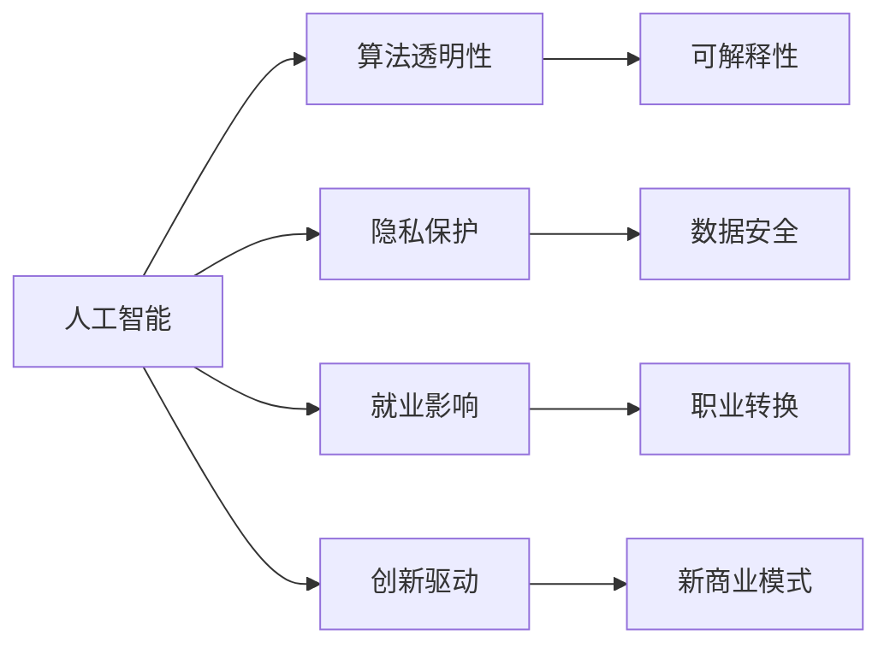

                 

# AI驱动的创新：人类计算在商业中的道德考虑因素与应用前景预测分析

> 关键词：人工智能,商业应用,道德考量,算法透明,隐私保护,就业影响,创新驱动

## 1. 背景介绍

### 1.1 问题由来

随着人工智能技术的迅猛发展，其在商业中的应用日益广泛。从自动驾驶、智能客服到推荐系统，AI正全面渗透到各行各业，提升效率、优化体验，驱动商业模式创新。然而，AI技术的商业化也带来了一系列亟待解决的伦理问题。如何在追求商业利益的同时，平衡技术发展与道德伦理的关系，成为当前一个重要的课题。

### 1.2 问题核心关键点

人工智能在商业中的伦理问题主要集中在算法透明性、隐私保护、就业影响等方面：

1. **算法透明性**：AI决策过程的"黑箱"特性，使得其决策逻辑难以解释，可能对用户、开发者甚至监管机构带来困扰。
2. **隐私保护**：AI模型训练过程中涉及大量用户数据，如何在数据收集和使用过程中保障用户隐私，防止数据滥用。
3. **就业影响**：AI自动化可能导致部分岗位被替代，引发对就业市场平衡的担忧。
4. **创新驱动**：AI如何被有效利用，驱动新业务模式、产品和服务的创新，提升商业竞争力。

解决这些问题不仅需要技术创新，还需要政策规范和伦理指导，以确保AI技术在商业应用中的道德规范和可持续发展。

## 2. 核心概念与联系

### 2.1 核心概念概述

在探讨AI在商业中的道德考量时，以下概念至关重要：

- **人工智能(AI)**：以计算机算法为基础，模仿人类智能的技术，包括机器学习、深度学习、自然语言处理等。
- **算法透明性(Algorithm Transparency)**：要求AI决策过程可解释、可理解，确保公平性和可信度。
- **隐私保护(Privacy Protection)**：通过技术和管理手段，保护用户数据不被滥用，维护用户隐私权。
- **就业影响(Employment Impact)**：AI自动化对就业市场、就业结构的影响及其应对策略。
- **创新驱动(Innovation Driver)**：AI技术如何推动商业创新，提升商业竞争力和创新活力。

这些概念间的关系可以通过以下Mermaid流程图表示：



该图展示了AI与算法透明性、隐私保护、就业影响和创新驱动之间的关系及其内在联系。

## 3. 核心算法原理 & 具体操作步骤
### 3.1 算法原理概述

AI在商业中的应用通常涉及算法模型训练和优化。模型训练需要大量标注数据和计算资源，优化则依赖于各种算法（如梯度下降、随机梯度下降等）。而AI的商业应用，无论是自动驾驶、智能客服还是推荐系统，都需遵循一定的道德原则和规范，确保其应用的公平性和透明度。

### 3.2 算法步骤详解

1. **数据准备**：收集和预处理数据，确保数据质量，避免偏见和歧视。
2. **模型训练**：选择合适的算法和模型，训练模型以适应商业需求。
3. **模型优化**：通过超参数调优和正则化等技术，提高模型性能。
4. **部署与监控**：将训练好的模型部署到生产环境，并持续监控模型表现和公平性。
5. **伦理审查**：定期进行伦理审查，确保模型应用的道德合规性。

### 3.3 算法优缺点

AI在商业应用中的优点包括：

- **效率提升**：自动化和智能化操作大大提升了运营效率，降低了人力成本。
- **精准决策**：数据分析和模型优化帮助企业做出更精准的商业决策。
- **新业务模式**：AI驱动的新业务模式创新，开辟了新的增长点。

缺点则主要集中在：

- **算法不透明**：AI模型特别是深度学习模型，其决策过程难以理解，可能带来不透明的问题。
- **数据隐私风险**：数据收集和处理过程中可能涉及隐私泄露和滥用。
- **就业冲击**：AI自动化可能引发某些岗位的消失，影响就业市场。

### 3.4 算法应用领域

AI在商业中的应用领域广泛，包括但不限于：

- **自动驾驶**：提升交通安全和运输效率。
- **智能客服**：提升客户体验，减少人工成本。
- **推荐系统**：个性化推荐，增加用户粘性。
- **供应链优化**：预测需求，优化库存管理。
- **医疗健康**：精准诊断和治疗，提升医疗服务质量。

## 4. 数学模型和公式 & 详细讲解 & 举例说明

### 4.1 数学模型构建

AI模型的构建通常基于以下数学模型：

- **线性回归模型**：用于预测连续型变量，如销售预测。
- **逻辑回归模型**：用于分类任务，如客户流失预测。
- **决策树模型**：基于树形结构进行决策，易于解释和理解。
- **随机森林模型**：结合多个决策树，提升模型泛化能力。
- **深度学习模型**：通过多层神经网络进行特征提取和决策，如卷积神经网络（CNN）、循环神经网络（RNN）和变分自编码器（VAE）等。

### 4.2 公式推导过程

以线性回归模型为例，其基本公式为：

$$
y = \beta_0 + \beta_1 x_1 + \beta_2 x_2 + ... + \beta_n x_n + \epsilon
$$

其中 $y$ 为预测值，$x_i$ 为输入变量，$\beta_i$ 为回归系数，$\epsilon$ 为误差项。

线性回归模型的训练目标是最小化预测值和实际值之间的误差平方和，即：

$$
\min_{\beta_0, \beta_1, ..., \beta_n} \sum_{i=1}^N (y_i - (\beta_0 + \beta_1 x_{1i} + \beta_2 x_{2i} + ... + \beta_n x_{ni}))^2
$$

训练过程通过梯度下降等优化算法，不断调整系数 $\beta_i$，使得预测值与实际值尽可能接近。

### 4.3 案例分析与讲解

假设某电子商务平台希望预测用户的购买行为，并根据预测结果进行个性化推荐。平台收集了用户的浏览记录、购买历史、年龄、性别等信息，利用线性回归模型进行训练，从而构建推荐系统。

模型训练过程包括：

- **数据预处理**：清洗数据，处理缺失值和异常值。
- **特征选择**：选择对预测效果影响显著的特征。
- **模型训练**：使用梯度下降算法，最小化预测误差。
- **模型评估**：在测试集上评估模型性能，如均方误差（MSE）。

实际应用中，模型会根据用户的浏览记录生成推荐商品列表，并在用户浏览商品时动态更新推荐结果，提升用户满意度。

## 5. 项目实践：代码实例和详细解释说明

### 5.1 开发环境搭建

AI商业应用开发通常使用Python语言，并依赖以下库：

- **NumPy**：科学计算库，用于数据处理和运算。
- **Pandas**：数据处理库，用于数据清洗和预处理。
- **Scikit-learn**：机器学习库，提供各类经典模型和工具。
- **TensorFlow** 或 **PyTorch**：深度学习库，用于构建和训练复杂模型。
- **Flask** 或 **Django**：Web框架，用于部署模型和构建API。

### 5.2 源代码详细实现

以下是使用Scikit-learn库进行线性回归模型训练的代码示例：

```python
import numpy as np
from sklearn.linear_model import LinearRegression
from sklearn.metrics import mean_squared_error

# 准备数据
X = np.array([[1, 2, 3], [4, 5, 6], [7, 8, 9]])
y = np.array([2, 4, 6])

# 创建模型并拟合
model = LinearRegression()
model.fit(X, y)

# 预测新数据
new_data = np.array([[10, 11, 12]])
prediction = model.predict(new_data)

# 计算均方误差
mse = mean_squared_error(y, prediction)

print("均方误差：", mse)
```

### 5.3 代码解读与分析

上述代码展示了线性回归模型的基本流程：

1. **数据准备**：定义输入数据 $X$ 和目标变量 $y$。
2. **模型训练**：创建线性回归模型，并使用 `fit` 方法进行训练。
3. **模型预测**：使用训练好的模型进行新数据的预测。
4. **模型评估**：计算预测值与实际值之间的均方误差。

### 5.4 运行结果展示

运行代码后，输出均方误差（MSE），用于评估模型预测的准确性。

## 6. 实际应用场景

### 6.1 智能客服系统

智能客服系统通过自然语言处理（NLP）技术，理解用户问题并提供智能回答。AI技术可以24小时在线，减少人工客服的响应时间，提升用户体验。例如，电商平台利用AI客服解决用户退货、配送等问题，显著提高了客户满意度。

### 6.2 推荐系统

推荐系统通过分析用户行为数据，为用户推荐个性化商品。AI技术可以实时更新推荐策略，提供更加符合用户偏好的商品列表，提升用户购买转化率。例如，Netflix和Amazon等平台利用AI推荐系统，实现了精准的商品推荐。

### 6.3 供应链优化

AI技术可以实时分析供应链数据，预测需求、优化库存管理，提升供应链效率。例如，沃尔玛利用AI预测市场需求，优化物流和库存管理，减少了商品缺货和库存积压。

### 6.4 未来应用展望

未来，AI在商业中的应用将更加广泛和深入，主要发展方向包括：

1. **自动驾驶**：AI在自动驾驶领域的应用将提升交通安全和运输效率，带来出行方式的革命性变化。
2. **医疗健康**：AI在医疗诊断、治疗方案推荐、药物研发等方面具有巨大潜力，有望显著提升医疗服务质量。
3. **智能制造**：AI在生产制造中的智能优化和质量控制，将提升制造效率和产品质量。
4. **金融科技**：AI在风险控制、欺诈检测、个性化金融服务等方面，将带来金融服务模式的变革。

## 7. 工具和资源推荐

### 7.1 学习资源推荐

- **《Python机器学习》**：由Sebastian Raschka和Vahid Mirjalili合著，介绍了机器学习在Python中的实现。
- **《深度学习》（Ian Goodfellow等著）**：深度学习领域的经典教材，涵盖深度学习的理论基础和实践技术。
- **Coursera和edX**：在线学习平台，提供大量AI和机器学习课程，适合各类学习者。
- **Kaggle**：数据科学竞赛平台，提供丰富的数据集和挑战题目，帮助开发者提升实战能力。

### 7.2 开发工具推荐

- **Jupyter Notebook**：交互式编程环境，便于数据处理和模型训练。
- **Git**：版本控制工具，方便代码管理和协同开发。
- **Docker**：容器化技术，提升应用部署和运维效率。
- **Kubernetes**：容器编排工具，支持大规模分布式应用管理。

### 7.3 相关论文推荐

- **《人工智能在商业中的伦理考量》**：探讨AI技术在商业应用中的伦理问题及其应对策略。
- **《机器学习中的数据隐私保护》**：研究机器学习过程中数据隐私保护的技术和方法。
- **《人工智能对就业市场的影响》**：分析AI自动化对就业市场的影响和应对措施。

## 8. 总结：未来发展趋势与挑战

### 8.1 研究成果总结

AI技术在商业应用中取得了显著成效，但也面临一系列伦理挑战。解决这些挑战，不仅需要技术创新，还需要政策规范和伦理指导。未来，AI技术将更多地融入商业决策，推动企业创新和转型。

### 8.2 未来发展趋势

未来AI技术在商业中的应用将更加广泛，主要趋势包括：

1. **跨领域应用**：AI将跨行业应用，提升各行业的效率和竞争力。
2. **智能化协同**：AI将实现各系统间的智能化协同，提升整体运营效率。
3. **伦理治理**：AI技术在商业应用中需要遵循伦理规范，确保公平透明。
4. **可持续发展**：AI技术应注重可持续发展，避免对环境和社会造成负面影响。

### 8.3 面临的挑战

AI在商业应用中面临的挑战包括：

1. **伦理规范**：AI决策的透明性和公平性仍需进一步探索和规范。
2. **隐私保护**：数据隐私和安全问题需持续关注和加强。
3. **就业影响**：AI自动化可能引发就业市场失衡，需采取措施缓解冲击。
4. **技术壁垒**：AI技术的复杂性和高门槛可能阻碍企业应用。

### 8.4 研究展望

未来的研究应从以下几个方向着手：

1. **算法透明性**：研究可解释AI算法，提升模型透明性。
2. **隐私保护**：开发隐私保护技术，保障数据安全。
3. **就业影响**：研究AI自动化对就业市场的影响，制定应对策略。
4. **伦理治理**：建立AI伦理规范和治理机制，确保AI应用合规。

## 9. 附录：常见问题与解答

**Q1：AI算法是否易于解释和理解？**

A: 目前的AI算法特别是深度学习模型，其决策过程较为复杂，难以直接解释。需要结合模型复杂性和可解释性的权衡，选择合适的算法和技术手段。

**Q2：如何保护用户数据隐私？**

A: 数据隐私保护需采取数据最小化原则、加密技术、匿名化处理等措施，严格控制数据使用权限，防止数据滥用。

**Q3：AI自动化会引发哪些就业冲击？**

A: AI自动化可能替代部分低技能岗位，但对高技能岗位需求增加。需通过职业培训和再就业指导，缓解就业冲击。

**Q4：AI如何驱动商业创新？**

A: AI可以通过数据分析和模型优化，提升决策精准度，推动新业务模式和产品创新，增加市场竞争力。

**Q5：AI的商业应用前景如何？**

A: AI在商业中的应用前景广阔，包括自动驾驶、智能客服、推荐系统等，未来将进一步深入到医疗、金融、制造等多个领域，带来深远影响。

---

作者：禅与计算机程序设计艺术 / Zen and the Art of Computer Programming

