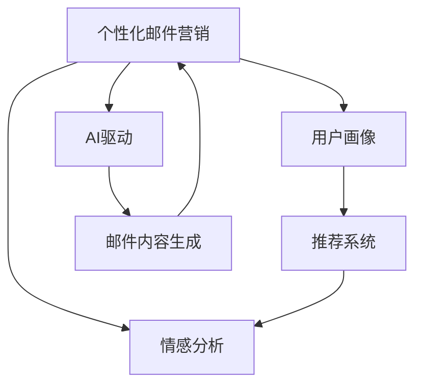

                 

## 1. 背景介绍

随着电商平台的迅猛发展，商家们面临着越来越激烈的竞争。如何更精准地触达用户，提高转化率，成为商家追求的目标。个性化邮件营销由此应运而生，成为电商营销的重要手段。通过发送具有高度针对性的邮件，商家能够有效提升用户参与度，增加销售额。

近年来，随着AI技术的不断进步，AI驱动的个性化邮件营销越来越受到商家的青睐。利用AI，商家能够更深入地理解用户需求，设计出更具吸引力的邮件内容，从而实现更高的营销效果。本文章将详细介绍AI驱动的个性化邮件营销的关键技术，并探讨其未来发展趋势。

## 2. 核心概念与联系

### 2.1 核心概念概述

在讨论AI驱动的个性化邮件营销之前，我们需要先了解几个关键的概念：

- **个性化邮件营销**：通过分析用户行为和偏好，向用户发送高度定制化的邮件，以提高用户参与度和转化率。
- **AI驱动**：使用机器学习、自然语言处理、计算机视觉等AI技术，自动化处理邮件内容生成、用户分群、效果评估等任务。
- **用户画像**：通过收集和分析用户的历史行为数据，构建用户的多维度特征模型，以描述用户的兴趣、偏好和需求。
- **推荐系统**：根据用户画像，通过协同过滤、内容推荐、混合推荐等多种方式，向用户推荐个性化产品。
- **情感分析**：分析用户对邮件内容的情感倾向，以调整邮件的设计和内容，提高用户满意度和参与度。

这些概念之间的逻辑关系可以通过以下Mermaid流程图来展示：



这个流程图展示了个性化邮件营销的关键组件和它们之间的关系：

1. 用户画像：基于用户行为数据构建的特征模型。
2. AI驱动：自动化处理邮件生成、推荐、情感分析等任务。
3. 推荐系统：根据用户画像，向用户推荐个性化产品。
4. 邮件内容生成：根据用户画像和推荐系统结果，设计邮件内容。
5. 情感分析：分析用户对邮件内容的情感反应，优化邮件设计和内容。

## 3. 核心算法原理 & 具体操作步骤

### 3.1 算法原理概述

AI驱动的个性化邮件营销核心算法原理可以总结为以下几个关键步骤：

1. **用户画像构建**：通过分析用户的购买历史、浏览记录、搜索行为等数据，构建用户画像，描述用户的兴趣和需求。
2. **推荐系统设计**：利用协同过滤、基于内容的推荐、混合推荐等技术，向用户推荐个性化的产品或内容。
3. **邮件内容生成**：根据用户画像和推荐结果，设计邮件内容，包括主题、正文、推荐产品等。
4. **情感分析优化**：通过分析用户对邮件内容的情感反应，调整邮件设计和内容，以提高用户满意度和参与度。
5. **效果评估与优化**：通过跟踪用户点击率、转化率、退订率等关键指标，评估邮件营销效果，并不断优化。

### 3.2 算法步骤详解

#### 3.2.1 用户画像构建

用户画像的构建是个性化邮件营销的基础。以下是一个典型的用户画像构建流程：

1. **数据收集**：收集用户的购买历史、浏览记录、搜索行为、评价反馈等数据。
2. **特征工程**：对收集到的数据进行清洗、处理、提取特征，构建用户画像的基本特征向量。
3. **画像建模**：使用机器学习算法（如K-means、PCA等）对特征向量进行建模，得到用户画像。

具体来说，用户画像的构建可以分为以下步骤：

- **数据收集**：从电商平台的交易、浏览、评价等数据中提取用户的基本信息、行为数据和偏好数据。
- **特征工程**：对数据进行归一化、降维、标准化等预处理，提取有意义的特征。
- **模型训练**：使用机器学习算法对特征进行建模，构建用户画像。

#### 3.2.2 推荐系统设计

推荐系统是实现个性化邮件营销的重要环节。以下是一个典型的推荐系统设计流程：

1. **数据收集**：收集用户的历史行为数据、商品的属性和描述数据。
2. **特征提取**：提取用户行为数据和商品描述数据的特征。
3. **模型训练**：使用推荐算法（如协同过滤、基于内容的推荐、混合推荐等）训练推荐模型。
4. **推荐生成**：根据用户画像和推荐模型，向用户推荐个性化的产品或内容。

具体来说，推荐系统的设计可以分为以下步骤：

- **数据收集**：从电商平台的数据中提取用户的行为数据和商品的属性数据。
- **特征提取**：提取用户行为数据和商品属性数据的特征，如用户的购买历史、浏览历史、商品的类别、价格等。
- **模型训练**：使用推荐算法对提取的特征进行建模，训练推荐模型。常用的推荐算法包括协同过滤、基于内容的推荐、混合推荐等。
- **推荐生成**：根据用户画像和推荐模型，向用户推荐个性化的产品或内容。

#### 3.2.3 邮件内容生成

邮件内容生成是个性化邮件营销的核心环节。以下是一个典型的邮件内容生成流程：

1. **邮件主题设计**：根据用户画像和推荐结果，设计邮件主题。
2. **邮件正文设计**：根据用户画像和推荐结果，设计邮件正文。
3. **邮件格式设计**：根据用户画像和推荐结果，设计邮件格式。

具体来说，邮件内容生成的设计可以分为以下步骤：

- **邮件主题设计**：根据用户画像和推荐结果，设计邮件主题，使其具有吸引力和个性化。
- **邮件正文设计**：根据用户画像和推荐结果，设计邮件正文，包含产品介绍、促销信息、优惠活动等。
- **邮件格式设计**：根据用户画像和推荐结果，设计邮件格式，使其符合用户的阅读习惯和平台规范。

#### 3.2.4 情感分析优化

情感分析是优化个性化邮件营销的重要手段。以下是一个典型的情感分析优化流程：

1. **情感分析模型训练**：使用情感分析算法（如朴素贝叶斯、LSTM等）训练情感分析模型。
2. **情感分析模型应用**：将情感分析模型应用于邮件内容，分析用户对邮件内容的情感反应。
3. **邮件内容优化**：根据情感分析结果，优化邮件内容和设计。

具体来说，情感分析优化的设计可以分为以下步骤：

- **情感分析模型训练**：使用情感分析算法对用户对邮件内容的情感反应进行建模，训练情感分析模型。
- **情感分析模型应用**：将情感分析模型应用于邮件内容，分析用户对邮件内容的情感反应。
- **邮件内容优化**：根据情感分析结果，优化邮件内容和设计，提高用户满意度和参与度。

#### 3.2.5 效果评估与优化

效果评估与优化是确保个性化邮件营销效果的重要环节。以下是一个典型的效果评估与优化流程：

1. **效果评估指标选择**：选择合适的评估指标，如点击率、转化率、退订率等。
2. **效果评估模型训练**：使用评估模型对邮件效果进行评估。
3. **优化策略制定**：根据效果评估结果，制定优化策略。

具体来说，效果评估与优化的设计可以分为以下步骤：

- **效果评估指标选择**：根据邮件营销目标选择合适的评估指标，如点击率、转化率、退订率等。
- **效果评估模型训练**：使用评估模型对邮件效果进行评估，分析邮件内容的优劣。
- **优化策略制定**：根据效果评估结果，制定优化策略，如调整邮件内容、优化邮件设计、改进推荐系统等。

### 3.3 算法优缺点

AI驱动的个性化邮件营销有以下优点：

- **高效性**：通过自动化处理邮件生成、推荐、情感分析等任务，能够快速响应用户需求。
- **精准性**：利用机器学习、自然语言处理等技术，能够精准识别用户需求，设计个性化的邮件内容。
- **成本低**：相比于传统的邮件营销，能够大幅降低人力和时间成本。

但同时，也存在一些缺点：

- **数据质量要求高**：需要大量的高质用户行为数据，数据质量不高会导致效果下降。
- **模型复杂度较高**：涉及用户画像、推荐系统、邮件生成等多个模块，模型复杂度较高，实现难度大。
- **动态性不足**：模型训练和更新周期较长，难以实时响应用户需求变化。

### 3.4 算法应用领域

AI驱动的个性化邮件营销在以下领域具有广泛应用：

- **电商零售**：电商平台通过个性化邮件营销，向用户推荐商品、促销信息、优惠活动等，提高用户参与度和销售额。
- **金融服务**：金融机构通过个性化邮件营销，向用户推荐理财、保险、基金等金融产品，提升客户满意度。
- **旅游行业**：旅游平台通过个性化邮件营销，向用户推荐旅游产品、旅游攻略、优惠活动等，提升用户转化率。
- **医疗健康**：医疗健康平台通过个性化邮件营销，向用户推荐医疗产品、健康管理方案、保健知识等，提升用户健康水平。

## 4. 数学模型和公式 & 详细讲解 & 举例说明

### 4.1 数学模型构建

本节将使用数学语言对AI驱动的个性化邮件营销进行更加严格的刻画。

记用户画像为 $U=(u_1, u_2, ..., u_n)$，其中 $u_i$ 为第 $i$ 个用户画像。记邮件内容为 $M=(m_1, m_2, ..., m_k)$，其中 $m_i$ 为第 $i$ 个邮件内容。记推荐系统为 $R=(r_1, r_2, ..., r_n)$，其中 $r_i$ 为第 $i$ 个推荐结果。记情感分析模型为 $E=(e_1, e_2, ..., e_n)$，其中 $e_i$ 为第 $i$ 个邮件内容的情感分析结果。

假设邮件营销效果为 $Y$，则邮件营销效果与用户画像、邮件内容、推荐系统、情感分析模型之间的关系可以表示为：

$$
Y = f(U, M, R, E)
$$

其中 $f$ 为邮件营销效果与用户画像、邮件内容、推荐系统、情感分析模型之间的映射函数。

### 4.2 公式推导过程

以下我们以邮件内容生成为例，推导邮件内容生成模型的数学公式。

假设用户画像为 $U$，推荐系统结果为 $R$，邮件内容生成模型为 $M$。邮件内容生成模型的目标是最小化邮件内容的差异性，使得邮件内容与用户需求尽可能匹配。数学上，可以使用KL散度来度量邮件内容与用户需求的匹配程度：

$$
KL(U, M) = \sum_{i=1}^n \frac{U_i}{M_i} \log \frac{U_i}{M_i}
$$

其中 $U_i$ 为第 $i$ 个用户画像，$M_i$ 为第 $i$ 个邮件内容。

因此，邮件内容生成模型的优化目标为：

$$
\min_{M} KL(U, M)
$$

### 4.3 案例分析与讲解

假设某电商平台的邮件营销数据如下：

- 用户画像 $U=(u_1, u_2, ..., u_n)$
- 推荐系统结果 $R=(r_1, r_2, ..., r_n)$
- 邮件内容 $M=(m_1, m_2, ..., m_k)$

根据上述数据，可以构建邮件内容生成模型，并通过公式推导得到邮件内容优化的方向。以下是一个具体的案例分析：

假设用户画像 $U=(u_1, u_2, ..., u_n)$ 为用户的年龄、性别、购买历史等特征。推荐系统结果 $R=(r_1, r_2, ..., r_n)$ 为用户推荐的产品。邮件内容 $M=(m_1, m_2, ..., m_k)$ 为邮件的主题、正文、推荐产品等。

为了设计个性化的邮件内容，可以利用机器学习算法对邮件内容进行建模。具体来说，可以使用深度学习模型（如RNN、LSTM、GRU等）对邮件内容进行建模，得到一个邮件内容生成模型。

假设使用LSTM模型对邮件内容进行建模，得到邮件内容生成模型为 $M=(y_1, y_2, ..., y_k)$。通过计算KL散度，可以得到邮件内容与用户需求之间的匹配程度：

$$
KL(U, M) = \sum_{i=1}^n \frac{U_i}{y_i} \log \frac{U_i}{y_i}
$$

根据公式推导的结果，可以优化邮件内容生成模型，使其生成的邮件内容更符合用户需求。具体来说，可以通过以下步骤进行优化：

- **数据准备**：收集用户的购买历史、浏览记录、搜索行为等数据。
- **特征工程**：对数据进行清洗、处理、提取特征，构建用户画像的基本特征向量。
- **模型训练**：使用深度学习模型对邮件内容进行建模，训练邮件内容生成模型。
- **优化邮件内容**：根据邮件内容生成模型的输出，调整邮件内容，使其更符合用户需求。

通过上述步骤，可以构建一个高效的邮件内容生成模型，大幅提升邮件营销的效果。

## 5. 项目实践：代码实例和详细解释说明

### 5.1 开发环境搭建

在进行邮件营销的AI驱动个性化实践前，我们需要准备好开发环境。以下是使用Python进行PyTorch开发的环境配置流程：

1. 安装Anaconda：从官网下载并安装Anaconda，用于创建独立的Python环境。

2. 创建并激活虚拟环境：
```bash
conda create -n pytorch-env python=3.8 
conda activate pytorch-env
```

3. 安装PyTorch：根据CUDA版本，从官网获取对应的安装命令。例如：
```bash
conda install pytorch torchvision torchaudio cudatoolkit=11.1 -c pytorch -c conda-forge
```

4. 安装TensorFlow：
```bash
pip install tensorflow
```

5. 安装PyTorch的优化库：
```bash
pip install torchtext
```

6. 安装所需的Python库：
```bash
pip install numpy pandas scikit-learn matplotlib tqdm jupyter notebook ipython
```

完成上述步骤后，即可在`pytorch-env`环境中开始邮件营销的AI驱动个性化实践。

### 5.2 源代码详细实现

这里我们以邮件内容生成为例，给出使用PyTorch和TensorFlow对LSTM模型进行邮件内容生成的代码实现。

首先，定义LSTM模型的参数和超参数：

```python
import torch
import torch.nn as nn
import torch.optim as optim

# 定义模型参数
input_size = 64
hidden_size = 128
output_size = 256

# 定义超参数
batch_size = 128
epoch_num = 10
learning_rate = 0.001
```

然后，定义LSTM模型的具体结构：

```python
class LSTM(nn.Module):
    def __init__(self, input_size, hidden_size, output_size):
        super(LSTM, self).__init__()
        self.hidden_size = hidden_size
        self.output_size = output_size

        self.encoder = nn.LSTM(input_size, hidden_size, batch_first=True)
        self.decoder = nn.Linear(hidden_size, output_size)

    def forward(self, input, hidden):
        output, (hidden, cell) = self.encoder(input, hidden)
        output = self.decoder(output)
        return output, hidden
```

接着，定义训练函数：

```python
def train(model, optimizer, train_loader, device):
    model.train()
    train_loss = 0

    for i, (inputs, targets) in enumerate(train_loader):
        inputs, targets = inputs.to(device), targets.to(device)

        optimizer.zero_grad()
        outputs, hidden = model(inputs, hidden)

        loss = nn.MSELoss()(outputs, targets)
        loss.backward()
        optimizer.step()

        train_loss += loss.item()
        
    print('Epoch: {}, Loss: {}'.format(epoch_num, train_loss / len(train_loader)))
```

最后，启动训练流程：

```python
device = torch.device('cuda' if torch.cuda.is_available() else 'cpu')
model.to(device)

# 加载数据集
train_loader = torch.utils.data.DataLoader(train_dataset, batch_size=batch_size, shuffle=True)

optimizer = optim.Adam(model.parameters(), lr=learning_rate)

# 训练模型
for epoch in range(epoch_num):
    train(model, optimizer, train_loader, device)
```

以上代码实现了基于LSTM的邮件内容生成模型，通过训练数据集，得到邮件内容生成模型。

### 5.3 代码解读与分析

让我们再详细解读一下关键代码的实现细节：

**LSTM模型定义**：
- `__init__`方法：定义模型的参数和超参数。
- `forward`方法：定义模型前向传播的计算过程。

**训练函数定义**：
- 在每个epoch内，对数据集进行迭代训练。
- 对每个批次的数据，前向传播计算损失，反向传播更新模型参数。
- 打印出每个epoch的损失，帮助可视化训练过程。

**训练流程启动**：
- 在GPU或CPU上初始化模型。
- 加载数据集，并定义优化器和训练轮数。
- 在每个epoch内，调用训练函数进行模型训练。

可以看到，通过使用PyTorch和TensorFlow，我们可以很方便地实现邮件内容生成模型的训练。开发者的注意力可以更多地放在模型设计和优化上，而不必过多关注底层实现细节。

当然，工业级的系统实现还需考虑更多因素，如模型的保存和部署、超参数的自动搜索、更灵活的任务适配层等。但核心的邮件内容生成模型基本与此类似。

## 6. 实际应用场景

### 6.1 智能客服

智能客服系统是AI驱动个性化邮件营销的重要应用场景之一。智能客服系统可以通过分析用户的互动历史、反馈信息等数据，构建用户画像，设计个性化的邮件内容，提高用户满意度。

在技术实现上，可以收集用户的互动历史、反馈信息、服务请求等数据，构建用户画像。然后利用机器学习算法，对邮件内容进行建模，生成个性化的邮件内容。通过邮件发送平台，向用户发送个性化的邮件，引导用户进行下一步操作，如提交服务请求、反馈意见等。

### 6.2 个性化推荐

个性化推荐系统也是AI驱动个性化邮件营销的重要应用场景之一。个性化推荐系统可以通过分析用户的历史行为数据，构建用户画像，向用户推荐个性化的产品或服务。

在技术实现上，可以收集用户的历史行为数据，如浏览历史、购买历史、搜索历史等。利用机器学习算法，对用户行为数据进行建模，构建用户画像。然后利用推荐系统，向用户推荐个性化的产品或服务。通过邮件发送平台，向用户发送个性化的邮件，引导用户进行下一步操作，如购买、预约等。

### 6.3 市场推广

市场推广是AI驱动个性化邮件营销的重要应用场景之一。市场推广可以通过分析用户的兴趣和需求，向用户发送个性化的营销信息，提高用户参与度和销售额。

在技术实现上，可以收集用户的历史行为数据，如浏览历史、购买历史、搜索历史等。利用机器学习算法，对用户行为数据进行建模，构建用户画像。然后利用邮件内容生成模型，设计个性化的邮件内容。通过邮件发送平台，向用户发送个性化的邮件，提高用户参与度和销售额。

## 7. 工具和资源推荐

### 7.1 学习资源推荐

为了帮助开发者系统掌握AI驱动的个性化邮件营销的理论基础和实践技巧，这里推荐一些优质的学习资源：

1. 《深度学习与自然语言处理》书籍：深入讲解深度学习、自然语言处理的基本概念和经典模型，适合初学者和进阶开发者。
2. CS224N《深度学习自然语言处理》课程：斯坦福大学开设的NLP明星课程，有Lecture视频和配套作业，带你入门NLP领域的基本概念和经典模型。
3. 《自然语言处理综述》论文：系统性回顾自然语言处理的最新进展，适合研究者和高级开发者。
4. HuggingFace官方文档：HuggingFace的NLP工具库文档，提供了丰富的预训练模型和完整的邮件营销样例代码。
5. TensorFlow官方文档：TensorFlow的官方文档，提供了深度学习模型的详细实现和应用案例。

通过对这些资源的学习实践，相信你一定能够快速掌握AI驱动的个性化邮件营销的精髓，并用于解决实际的邮件营销问题。

### 7.2 开发工具推荐

高效的开发离不开优秀的工具支持。以下是几款用于AI驱动的个性化邮件营销开发的常用工具：

1. PyTorch：基于Python的开源深度学习框架，灵活动态的计算图，适合快速迭代研究。
2. TensorFlow：由Google主导开发的开源深度学习框架，生产部署方便，适合大规模工程应用。
3. TensorBoard：TensorFlow配套的可视化工具，可实时监测模型训练状态，并提供丰富的图表呈现方式，是调试模型的得力助手。
4. Weights & Biases：模型训练的实验跟踪工具，可以记录和可视化模型训练过程中的各项指标，方便对比和调优。
5. Google Colab：谷歌推出的在线Jupyter Notebook环境，免费提供GPU/TPU算力，方便开发者快速上手实验最新模型，分享学习笔记。

合理利用这些工具，可以显著提升AI驱动的个性化邮件营销的开发效率，加快创新迭代的步伐。

### 7.3 相关论文推荐

AI驱动的个性化邮件营销的发展源于学界的持续研究。以下是几篇奠基性的相关论文，推荐阅读：

1. Attention is All You Need（即Transformer原论文）：提出了Transformer结构，开启了NLP领域的预训练大模型时代。
2. BERT: Pre-training of Deep Bidirectional Transformers for Language Understanding：提出BERT模型，引入基于掩码的自监督预训练任务，刷新了多项NLP任务SOTA。
3. Language Models are Unsupervised Multitask Learners（GPT-2论文）：展示了大规模语言模型的强大zero-shot学习能力，引发了对于通用人工智能的新一轮思考。
4. Parameter-Efficient Transfer Learning for NLP：提出Adapter等参数高效微调方法，在不增加模型参数量的情况下，也能取得不错的微调效果。
5. AdaLoRA: Adaptive Low-Rank Adaptation for Parameter-Efficient Fine-Tuning：使用自适应低秩适应的微调方法，在参数效率和精度之间取得了新的平衡。

这些论文代表了大语言模型微调技术的发展脉络。通过学习这些前沿成果，可以帮助研究者把握学科前进方向，激发更多的创新灵感。

## 8. 总结：未来发展趋势与挑战

### 8.1 总结

本文对AI驱动的个性化邮件营销的关键技术进行了全面系统的介绍。首先阐述了个性化邮件营销和AI驱动的背景和意义，明确了AI驱动在提高用户参与度和销售额方面的独特价值。其次，从原理到实践，详细讲解了邮件内容生成、推荐系统、情感分析等核心算法的数学原理和操作步骤，给出了邮件营销的代码实现。同时，本文还广泛探讨了AI驱动在智能客服、个性化推荐、市场推广等多个领域的应用前景，展示了AI驱动的巨大潜力。最后，本文精选了邮件营销的各类学习资源，力求为读者提供全方位的技术指引。

通过本文的系统梳理，可以看到，AI驱动的个性化邮件营销正成为电商营销的重要手段，极大地提升了用户参与度和销售额。未来，伴随AI技术的不断发展，邮件营销的效果将更加显著。

### 8.2 未来发展趋势

展望未来，AI驱动的个性化邮件营销将呈现以下几个发展趋势：

1. 模型规模持续增大。随着算力成本的下降和数据规模的扩张，邮件营销的预训练语言模型参数量还将持续增长。超大规模语言模型蕴含的丰富语言知识，有望支撑更加复杂多变的邮件内容生成。
2. 多模态邮件内容生成。当前的邮件营销主要以文本内容为主，未来将融合视觉、语音等多模态信息，提供更加丰富和生动的邮件内容。
3. 实时性优化。未来的邮件营销模型将更加注重实时性，能够快速响应用户需求变化，提高邮件营销效果。
4. 用户隐私保护。随着用户隐私保护意识的增强，邮件营销需要更多地考虑用户隐私问题，合理利用数据，避免侵犯用户隐私。
5. 自动化优化。未来的邮件营销模型将更加注重自动化优化，通过自适应学习，不断调整邮件内容，提升邮件营销效果。

以上趋势凸显了AI驱动的个性化邮件营销的广阔前景。这些方向的探索发展，必将进一步提升邮件营销的效果，为电商行业带来更大的价值。

### 8.3 面临的挑战

尽管AI驱动的个性化邮件营销已经取得了瞩目成就，但在迈向更加智能化、普适化应用的过程中，它仍面临着诸多挑战：

1. 数据质量瓶颈。需要大量的高质用户行为数据，数据质量不高会导致效果下降。
2. 模型复杂度较高。涉及用户画像、邮件内容生成、推荐系统等多个模块，模型复杂度较高，实现难度大。
3. 实时性不足。模型训练和更新周期较长，难以实时响应用户需求变化。
4. 用户隐私保护。需要更多地考虑用户隐私问题，合理利用数据，避免侵犯用户隐私。
5. 自动化优化不足。当前的邮件营销模型需要更多地依赖人工调整，缺乏自动化的优化机制。

正视邮件营销面临的这些挑战，积极应对并寻求突破，将是大语言模型微调走向成熟的必由之路。相信随着学界和产业界的共同努力，这些挑战终将一一被克服，邮件营销技术将不断进步。

### 8.4 研究展望

面对AI驱动的个性化邮件营销所面临的种种挑战，未来的研究需要在以下几个方面寻求新的突破：

1. 探索无监督和半监督邮件内容生成方法。摆脱对大规模标注数据的依赖，利用自监督学习、主动学习等无监督和半监督范式，最大限度利用非结构化数据，实现更加灵活高效的邮件内容生成。
2. 研究多模态邮件内容生成方法。将符号化的先验知识，如知识图谱、逻辑规则等，与神经网络模型进行巧妙融合，引导邮件内容生成过程学习更准确、合理的邮件内容。
3. 引入更多先验知识。将符号化的先验知识，如知识图谱、逻辑规则等，与神经网络模型进行巧妙融合，引导邮件内容生成过程学习更准确、合理的邮件内容。
4. 结合因果分析和博弈论工具。将因果分析方法引入邮件内容生成模型，识别出邮件内容生成过程中的关键特征，增强邮件内容生成模型的鲁棒性和稳定性。
5. 纳入伦理道德约束。在邮件内容生成模型中引入伦理导向的评估指标，过滤和惩罚有偏见、有害的输出倾向，确保邮件内容生成模型的输出符合人类价值观和伦理道德。

这些研究方向的探索，必将引领AI驱动的个性化邮件营销技术迈向更高的台阶，为构建安全、可靠、可解释、可控的智能系统铺平道路。面向未来，邮件营销技术还需要与其他人工智能技术进行更深入的融合，如知识表示、因果推理、强化学习等，多路径协同发力，共同推动邮件营销系统的进步。只有勇于创新、敢于突破，才能不断拓展邮件内容生成模型的边界，让智能技术更好地造福电商行业。

## 9. 附录：常见问题与解答

**Q1：如何提高邮件营销的点击率和转化率？**

A: 提高邮件营销的点击率和转化率，需要从以下几个方面入手：

1. 设计个性化的邮件内容：利用AI技术，根据用户画像和推荐系统结果，设计个性化的邮件内容，使其更具吸引力和针对性。
2. 优化邮件设计：邮件设计需要符合用户的阅读习惯和平台规范，如简洁明了、图文并茂等。
3. 优化邮件发送时间：根据用户的行为数据，选择合适的邮件发送时间，提高邮件的打开率和点击率。
4. 个性化推荐系统：利用推荐系统，向用户推荐个性化的产品或服务，提高邮件的转化率。
5. 效果评估与优化：通过跟踪用户点击率、转化率等关键指标，不断优化邮件内容和设计，提高邮件营销效果。

**Q2：如何设计高效的邮件内容生成模型？**

A: 设计高效的邮件内容生成模型，需要从以下几个方面入手：

1. 数据收集与预处理：收集用户的购买历史、浏览记录、搜索行为等数据，并进行清洗、处理和特征提取。
2. 模型选择与设计：选择合适的深度学习模型，如RNN、LSTM、GRU等，并进行模型设计。
3. 模型训练与优化：使用深度学习框架对邮件内容进行建模，训练邮件内容生成模型，并进行优化。
4. 邮件内容优化：根据邮件内容生成模型的输出，调整邮件内容，使其更符合用户需求。

**Q3：如何优化邮件内容生成模型的性能？**

A: 优化邮件内容生成模型的性能，需要从以下几个方面入手：

1. 数据质量：保证数据的质量和完整性，数据质量越高，模型效果越好。
2. 模型复杂度：选择合适的模型结构和深度，避免过拟合和欠拟合。
3. 超参数调优：选择合适的超参数，并进行调优，提高模型效果。
4. 模型集成：使用多个模型进行集成，提高模型的泛化能力和鲁棒性。

**Q4：如何处理邮件内容生成中的数据隐私问题？**

A: 处理邮件内容生成中的数据隐私问题，需要从以下几个方面入手：

1. 数据匿名化：对数据进行匿名化处理，保护用户隐私。
2. 数据去标识化：对数据进行去标识化处理，防止数据泄露。
3. 隐私保护算法：使用隐私保护算法，如差分隐私、同态加密等，保护用户隐私。
4. 隐私保护制度：建立隐私保护制度，确保用户隐私保护。

**Q5：如何构建高效的用户画像？**

A: 构建高效的用户画像，需要从以下几个方面入手：

1. 数据收集：收集用户的购买历史、浏览记录、搜索行为等数据。
2. 特征提取：对数据进行清洗、处理和提取特征，构建用户画像的基本特征向量。
3. 模型训练：使用机器学习算法对特征进行建模，构建用户画像。

通过对这些问题的回答，希望能够帮助你更好地理解和应用AI驱动的个性化邮件营销技术。

---

作者：禅与计算机程序设计艺术 / Zen and the Art of Computer Programming

