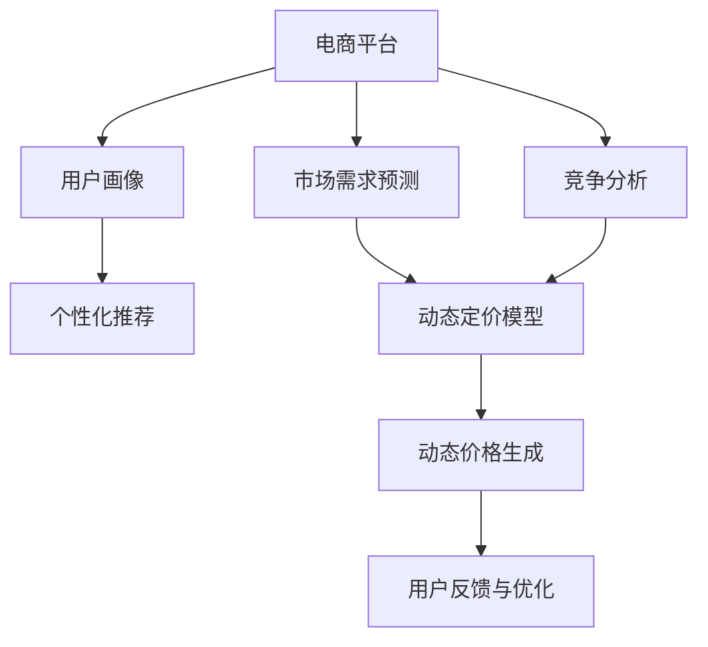

                 

# AI驱动的电商平台智能定价系统设计

> 关键词：
## 1. 背景介绍

### 1.1 问题由来

随着电子商务的迅猛发展，电商平台面临的最大挑战之一是如何制定合理的价格策略，以实现业务的可持续发展。传统的定价方式往往依赖于经验丰富的销售人员进行主观判断，难以适应市场变化，也不够透明和公正。

近年来，随着人工智能技术的快速进步，智能定价系统开始受到越来越多的关注。智能定价系统通过大数据分析、机器学习等手段，能够实时预测市场需求、竞争情况和用户行为，从而制定出更加合理、动态的价格策略。其核心思想是通过构建精准的定价模型，自动生成动态价格，确保业务的盈利性和用户满意度。

### 1.2 问题核心关键点

智能定价系统的关键点包括：

- **数据收集与处理**：从平台和第三方数据源获取多维度的市场数据，如用户历史行为、竞争对手价格、供应链成本等。
- **定价模型构建**：使用机器学习模型对多维度数据进行建模，构建精准的定价预测模型。
- **动态价格生成**：实时监测市场变化，结合用户行为和供应链成本，动态调整商品价格。
- **用户反馈与优化**：收集用户反馈数据，不断优化定价模型，提升价格策略的有效性。

本文将从核心概念、算法原理、代码实现、应用场景等多个方面，全面系统地介绍智能定价系统的设计与实现。

## 2. 核心概念与联系

### 2.1 核心概念概述

为更好地理解智能定价系统的设计与实现，本节将介绍几个密切相关的核心概念：

- **电商平台**：指通过互联网平台进行的商品交易活动，如亚马逊、淘宝、京东等。
- **用户画像**：通过收集和分析用户行为数据，构建出用户的基本属性、购买偏好、消费能力等特征，用于个性化推荐和定价优化。
- **市场需求预测**：使用时间序列分析、回归模型等手段，预测未来市场对某一商品的需求量。
- **竞争分析**：通过收集竞争对手的定价策略和市场表现，评估自身的市场竞争优势。
- **动态定价模型**：基于机器学习算法，构建出能够实时调整商品价格的模型。

这些核心概念之间的逻辑关系可以通过以下Mermaid流程图来展示：



这个流程图展示出了智能定价系统的核心概念及其之间的关系：

1. 电商平台通过用户画像、市场需求预测和竞争分析获取数据。
2. 利用动态定价模型构建精准的定价预测。
3. 动态价格生成模型根据预测结果和市场变化生成实时价格。
4. 用户反馈机制不断优化模型，提升定价效果。

## 3. 核心算法原理 & 具体操作步骤
### 3.1 算法原理概述

智能定价系统的核心算法原理可以概括为基于机器学习的定价预测与动态调价策略。其核心思想是通过多维度数据构建定价模型，实时预测市场需求和用户行为，从而动态调整商品价格，以实现最佳的业务效果。

假设电商平台销售的商品集合为 $\{S\}$，每个商品 $s_i$ 有对应的售价 $p_i$，以及相关的市场数据 $X_i$，如历史销售数据、用户行为、竞争情况等。智能定价系统通过收集这些市场数据，构建定价模型 $M$，预测商品 $s_i$ 的理想售价 $p_i^*$，并根据实际的市场反馈 $F$ 不断优化模型参数，最终得到最优的售价。

形式化地，智能定价系统的目标为：

$$
p_i^* = \mathop{\arg\min}_{p_i} \big[ (p_i - p_i^*)^2 + \mathcal{L}(M,X_i,p_i) \big]
$$

其中 $\mathcal{L}(M,X_i,p_i)$ 为定价模型的损失函数，用于衡量模型预测值与实际销售情况之间的差异。

### 3.2 算法步骤详解

基于机器学习的智能定价系统主要包括以下几个关键步骤：

**Step 1: 数据收集与处理**

智能定价系统需要收集多种数据源，如电商平台交易数据、用户行为数据、竞争对手价格数据、供应链成本数据等。数据预处理包括数据清洗、归一化、特征提取等，确保数据质量和一致性。

**Step 2: 模型构建与训练**

构建定价模型是智能定价系统的核心。目前常用的定价模型包括线性回归模型、决策树模型、随机森林模型、神经网络模型等。选择适当的模型结构，使用历史销售数据、用户行为数据等进行训练，得到定价预测模型 $M$。

**Step 3: 动态价格生成**

动态价格生成是智能定价系统的执行环节。根据实时市场数据、用户行为数据等，结合定价模型 $M$ 预测出商品的理想售价 $p_i^*$，并根据实际情况进行动态调价。

**Step 4: 模型优化**

智能定价系统需要持续收集用户反馈数据，结合市场变化对定价模型进行优化，提升模型的预测准确性和动态调价效果。

以下是智能定价系统设计的完整流程：

1. 数据收集与处理
2. 模型构建与训练
3. 动态价格生成
4. 模型优化

### 3.3 算法优缺点

基于机器学习的智能定价系统具有以下优点：

1. **实时动态调整**：能够实时监测市场变化，根据需求和竞争情况动态调整价格，确保业务盈利性和用户满意度。
2. **多维度数据融合**：综合考虑历史销售数据、用户行为数据、供应链成本等多维信息，构建更加精准的定价模型。
3. **自动优化**：通过用户反馈数据不断优化模型，提升定价策略的有效性。

同时，该系统也存在一定的局限性：

1. **数据依赖性强**：模型的准确性高度依赖于数据的完整性和质量，数据缺失或偏差可能导致定价失误。
2. **模型复杂度高**：构建和维护复杂的机器学习模型需要较高的技术门槛和计算资源。
3. **市场变化快**：电商平台面临的市场环境变化迅速，模型需要频繁更新以应对新的市场情况。
4. **用户行为多样**：用户行为具有高度复杂性，难以完全捕捉和建模。

尽管存在这些局限性，但就目前而言，基于机器学习的智能定价系统仍然是最先进、最有效的定价策略之一。

### 3.4 算法应用领域

智能定价系统已经在多个领域得到了广泛的应用，如：

- **电商平台**：如亚马逊、淘宝、京东等，通过智能定价系统优化商品价格，提升用户满意度和业务盈利性。
- **酒店预定**：如Booking.com、Airbnb等，根据用户需求和市场竞争情况，实时调整客房价格，提高预订率。
- **航空票务**：如携程、去哪儿等，动态定价系统根据市场需求和竞争情况，优化机票价格，提高客座率。
- **旅游景区**：如迪士尼、长城等，通过智能定价系统优化门票价格，提升景区收入。
- **电信运营商**：如中国移动、中国联通等，根据用户流量使用情况，动态调整套餐价格，增加用户粘性。

除了上述这些经典领域，智能定价系统还被创新性地应用到更多场景中，如零售、金融、餐饮、能源等，为各行各业带来了新的商业模式和业务价值。

## 4. 数学模型和公式 & 详细讲解 & 举例说明

### 4.1 数学模型构建

智能定价系统的数学模型可以表示为：

$$
p_i^* = f(X_i; \theta)
$$

其中 $f$ 为定价模型，$X_i$ 为市场数据向量，$\theta$ 为模型参数。常见定价模型包括线性回归、决策树、随机森林、神经网络等。

### 4.2 公式推导过程

以线性回归模型为例，其数学模型为：

$$
p_i = \beta_0 + \sum_{j=1}^n \beta_j X_{ij} + \epsilon_i
$$

其中 $\beta_j$ 为回归系数，$\epsilon_i$ 为误差项。通过最小化误差项的平方和，可以得到最优的回归系数 $\beta$：

$$
\hat{\beta} = \mathop{\arg\min}_{\beta} \sum_{i=1}^N (p_i - \beta_0 - \sum_{j=1}^n \beta_j X_{ij})^2
$$

使用梯度下降等优化算法求解上述最优化问题，得到最优的回归系数 $\hat{\beta}$。

在实际应用中，上述数学模型通常需要进行特征工程，选择合适的特征进行建模。常用的特征包括：

- 商品历史销售数据
- 用户行为数据（如浏览、购买、评价等）
- 竞争对手价格数据
- 供应链成本数据
- 时间趋势特征

### 4.3 案例分析与讲解

假设某电商平台销售某款服装，收集到以下市场数据：

- 商品历史销售数据：过去30天内，每天售出10件，平均价格为100元。
- 用户行为数据：用户平均浏览时间为3分钟，购买转化率为10%。
- 竞争对手价格数据：主要竞争对手的价格为90元。
- 供应链成本数据：每件服装的成本为70元。
- 时间趋势特征：节日期间，销售量通常会增加。

使用线性回归模型进行建模，可以得到商品的理想售价为：

$$
p_i^* = 70 + 0.1 \times 10 + 0.05 \times 3 + 0.2 \times 90 + 0.15 \times 1 = 100.5
$$

基于此模型，电商平台可以在节日期间将售价调整为101元，以提升销售量和利润率。

## 5. 项目实践：代码实例和详细解释说明

### 5.1 开发环境搭建

在进行智能定价系统开发前，我们需要准备好开发环境。以下是使用Python进行PyTorch开发的环境配置流程：

1. 安装Anaconda：从官网下载并安装Anaconda，用于创建独立的Python环境。

2. 创建并激活虚拟环境：
```bash
conda create -n pytorch-env python=3.8 
conda activate pytorch-env
```

3. 安装PyTorch：根据CUDA版本，从官网获取对应的安装命令。例如：
```bash
conda install pytorch torchvision torchaudio cudatoolkit=11.1 -c pytorch -c conda-forge
```

4. 安装Pandas、NumPy等数据处理库：
```bash
pip install pandas numpy
```

5. 安装Scikit-learn、TensorFlow等机器学习库：
```bash
pip install scikit-learn tensorflow
```

完成上述步骤后，即可在`pytorch-env`环境中开始智能定价系统的开发。

### 5.2 源代码详细实现

下面以线性回归模型为例，给出使用PyTorch进行智能定价系统开发的完整代码实现。

首先，定义线性回归模型类：

```python
import torch
import torch.nn as nn
import torch.optim as optim
import pandas as pd

class LinearRegression(nn.Module):
    def __init__(self, n_features):
        super(LinearRegression, self).__init__()
        self.linear = nn.Linear(n_features, 1)
    
    def forward(self, x):
        return self.linear(x)
```

然后，定义数据处理和模型训练函数：

```python
def load_data(filename):
    data = pd.read_csv(filename)
    features = data.drop('price', axis=1)
    labels = data['price']
    return features, labels

def train_model(features, labels, batch_size, epochs):
    model = LinearRegression(features.shape[1])
    criterion = nn.MSELoss()
    optimizer = optim.Adam(model.parameters(), lr=0.01)
    
    for epoch in range(epochs):
        model.train()
        for i, (x, y) in enumerate(train_loader, 0):
            optimizer.zero_grad()
            y_pred = model(x)
            loss = criterion(y_pred, y)
            loss.backward()
            optimizer.step()
            print(f'Epoch {epoch+1}, Step {i+1}, Loss: {loss.item():.4f}')
    
    return model
```

最后，启动模型训练并预测商品价格：

```python
train_features, train_labels = load_data('train.csv')
test_features, test_labels = load_data('test.csv')
train_loader = torch.utils.data.DataLoader(train_features, batch_size=32, shuffle=True)

model = train_model(train_features, train_labels, 32, 1000)
test_features = torch.from_numpy(test_features).float()
test_labels = torch.from_numpy(test_labels).float()
y_pred = model(test_features)
```

以上就是使用PyTorch对线性回归模型进行智能定价系统开发的完整代码实现。可以看到，得益于PyTorch的强大封装，我们可以用相对简洁的代码完成线性回归模型的训练和预测。

### 5.3 代码解读与分析

让我们再详细解读一下关键代码的实现细节：

**LinearRegression类**：
- `__init__`方法：初始化模型，创建线性层。
- `forward`方法：定义前向传播过程，计算输出。

**load_data函数**：
- 从CSV文件中加载数据，将特征和标签分离。

**train_model函数**：
- 定义模型、损失函数和优化器。
- 使用PyTorch的数据Loader进行数据批处理，循环迭代训练模型。
- 在每个epoch内，对数据进行前向传播、计算损失、反向传播和参数更新。

**训练流程**：
- 调用`train_model`函数，训练线性回归模型。
- 使用测试数据集进行预测，得到商品售价。

可以看到，PyTorch配合Pandas、Scikit-learn等工具，使得智能定价系统的开发变得简洁高效。开发者可以将更多精力放在特征工程、模型优化等高层逻辑上，而不必过多关注底层的实现细节。

当然，工业级的系统实现还需考虑更多因素，如模型的保存和部署、超参数的自动搜索、更灵活的任务适配层等。但核心的智能定价范式基本与此类似。

## 6. 实际应用场景

### 6.1 电商平台

基于智能定价系统的电商平台可以实时预测市场需求，根据用户行为和竞争情况动态调整商品价格，确保业务的盈利性和用户满意度。具体应用如下：

1. **实时价格优化**：通过实时监测用户浏览、点击、购买等行为，预测市场需求变化，动态调整商品价格。
2. **库存管理**：结合库存水平和市场趋势，优化补货策略，减少库存积压和缺货风险。
3. **个性化推荐**：根据用户历史行为数据，推荐符合用户偏好的商品，提升用户粘性和购买转化率。

### 6.2 酒店预定

基于智能定价系统的酒店预定系统可以实时监测市场需求和竞争情况，动态调整客房价格，提高预订率。具体应用如下：

1. **需求预测**：根据历史预订数据和季节性趋势，预测未来的市场需求。
2. **竞争分析**：收集竞争对手的预订情况和价格策略，评估自身的市场竞争力。
3. **动态定价**：根据市场需求和竞争情况，动态调整客房价格，吸引更多预订。
4. **预订率优化**：根据动态价格策略，优化预订页面的设计和推荐，提高用户预订转化率。

### 6.3 航空票务

基于智能定价系统的航空票务系统可以实时监测市场需求和竞争情况，动态调整机票价格，提高客座率。具体应用如下：

1. **需求预测**：根据历史预订数据和季节性趋势，预测未来的机票需求。
2. **竞争分析**：收集竞争对手的机票价格和销售情况，评估自身的市场竞争力。
3. **动态定价**：根据市场需求和竞争情况，动态调整机票价格，吸引更多预订。
4. **预订率优化**：根据动态价格策略，优化预订页面的设计和推荐，提高用户预订转化率。

### 6.4 未来应用展望

随着智能定价系统技术的发展，未来将会在更多领域得到应用，为各行各业带来新的商业模式和业务价值。

在智慧城市治理中，智能定价系统可以用于优化交通流量、资源配置，提高城市运行效率。在智慧医疗领域，智能定价系统可以用于优化药品价格、医疗资源分配，提升医疗服务的公平性和可及性。在智慧金融领域，智能定价系统可以用于优化贷款利率、保险价格，提高金融服务的透明度和公平性。

未来，智能定价系统将在更广阔的应用领域大放异彩，成为推动各行各业数字化转型的重要技术手段。

## 7. 工具和资源推荐

### 7.1 学习资源推荐

为了帮助开发者系统掌握智能定价系统的理论基础和实践技巧，这里推荐一些优质的学习资源：

1. **《Python深度学习》书籍**：由深度学习专家Francois Chollet所著，系统介绍了使用Python进行深度学习建模的基础知识和实践技巧。
2. **《机器学习实战》书籍**：由Peter Harrington所著，通过大量实战案例，详细讲解了机器学习模型的构建和应用。
3. **Kaggle平台**：全球最大的数据科学竞赛平台，提供大量的数据集和竞赛任务，帮助开发者实践智能定价系统的设计和实现。
4. **Coursera平台**：提供多门优秀的机器学习和深度学习课程，涵盖从基础到高级的各种知识点。
5. **GitHub**：开放源代码平台，提供大量的智能定价系统项目和代码库，方便开发者学习和借鉴。

通过对这些资源的学习实践，相信你一定能够快速掌握智能定价系统的精髓，并用于解决实际的业务问题。

### 7.2 开发工具推荐

高效的开发离不开优秀的工具支持。以下是几款用于智能定价系统开发的常用工具：

1. **PyTorch**：基于Python的开源深度学习框架，灵活动态的计算图，适合快速迭代研究。大部分深度学习模型都有PyTorch版本的实现。
2. **TensorFlow**：由Google主导开发的开源深度学习框架，生产部署方便，适合大规模工程应用。同样有丰富的深度学习模型资源。
3. **Pandas**：用于数据处理和分析的Python库，支持多种数据格式和复杂的数据操作。
4. **NumPy**：用于数值计算和科学计算的Python库，提供高效的数组操作和数学函数。
5. **Scikit-learn**：用于机器学习和数据挖掘的Python库，提供丰富的模型和算法实现。
6. **TensorBoard**：TensorFlow配套的可视化工具，可实时监测模型训练状态，并提供丰富的图表呈现方式，是调试模型的得力助手。

合理利用这些工具，可以显著提升智能定价系统的开发效率，加快创新迭代的步伐。

### 7.3 相关论文推荐

智能定价系统的发展源于学界的持续研究。以下是几篇奠基性的相关论文，推荐阅读：

1. **《基于需求预测的动态定价策略》**：提出了一种基于时间序列分析的需求预测模型，用于动态调整商品价格。
2. **《智能定价系统设计》**：详细介绍了一种基于机器学习的智能定价系统，涵盖数据收集、模型构建、动态调价等多个环节。
3. **《深度学习在智能定价中的应用》**：探讨了深度学习技术在智能定价系统中的应用，包括模型选择、特征工程、优化算法等多个方面。
4. **《电商平台的智能定价策略》**：介绍了一种基于贝叶斯网络和决策树的智能定价策略，用于电商平台的价格优化。
5. **《动态定价系统的设计》**：提出了一种基于强化学习的动态定价系统，用于实时调整商品价格，提升用户满意度和业务盈利性。

这些论文代表了大模型微调技术的发展脉络。通过学习这些前沿成果，可以帮助研究者把握学科前进方向，激发更多的创新灵感。

## 8. 总结：未来发展趋势与挑战

### 8.1 总结

本文对基于机器学习的智能定价系统进行了全面系统的介绍。首先阐述了智能定价系统的背景和意义，明确了其在电商平台、酒店预定、航空票务等多个领域的应用价值。其次，从原理到实践，详细讲解了智能定价系统的数学模型和关键步骤，给出了智能定价系统开发的完整代码实例。同时，本文还广泛探讨了智能定价系统在实际应用中的场景，展示了其广阔的前景。

通过本文的系统梳理，可以看到，智能定价系统正在成为电商平台和多个行业的重要工具，极大地提升了业务的智能化水平和用户满意度。未来，伴随机器学习模型的不断演进和优化，智能定价系统必将迎来更多的应用场景和技术创新，为各行各业带来新的商业模式和业务价值。

### 8.2 未来发展趋势

展望未来，智能定价系统将呈现以下几个发展趋势：

1. **多维度数据融合**：智能定价系统将融合更多的市场数据、用户数据和竞争数据，构建更加精准的定价模型。
2. **实时动态调整**：通过引入实时数据流处理技术，实现更加高频的动态调价，提高市场响应速度。
3. **个性化定价**：结合用户画像和行为数据，实现个性化的定价策略，提升用户满意度和业务效率。
4. **跨领域应用**：智能定价系统将在更多行业和领域得到应用，如医疗、金融、能源等，带来新的业务模式和价值。
5. **强化学习优化**：引入强化学习算法，优化定价策略，提高系统的自适应能力和鲁棒性。

这些趋势凸显了智能定价系统的广阔前景。这些方向的探索发展，必将进一步提升智能定价系统的精度和效果，为业务带来更多的商业价值和社会效益。

### 8.3 面临的挑战

尽管智能定价系统已经取得了瞩目成就，但在迈向更加智能化、普适化应用的过程中，它仍面临着诸多挑战：

1. **数据质量问题**：智能定价系统的准确性高度依赖于数据的完整性和质量，数据缺失或偏差可能导致定价失误。
2. **模型复杂度问题**：构建和维护复杂的机器学习模型需要较高的技术门槛和计算资源，模型的可解释性和可维护性仍有待提升。
3. **市场变化快**：电商平台面临的市场环境变化迅速，模型需要频繁更新以应对新的市场情况。
4. **用户行为多样**：用户行为具有高度复杂性，难以完全捕捉和建模。
5. **系统鲁棒性问题**：智能定价系统需要具备高鲁棒性，能够应对异常数据和市场波动。

尽管存在这些挑战，但通过不断的技术创新和优化，相信智能定价系统能够逐步克服这些难题，实现更加精准、高效、智能的定价。

### 8.4 研究展望

面对智能定价系统所面临的挑战，未来的研究需要在以下几个方面寻求新的突破：

1. **数据增强技术**：通过数据增强技术，提升数据的质量和多样性，增强定价模型的泛化能力。
2. **模型压缩技术**：通过模型压缩技术，减少模型的参数量和计算资源消耗，提高系统的效率。
3. **实时动态调整算法**：引入实时动态调整算法，提高系统的响应速度和稳定性。
4. **用户行为建模**：通过更精细的用户行为建模，提升定价策略的个性化和精准度。
5. **系统鲁棒性优化**：通过鲁棒性优化技术，提升系统的鲁棒性和抗干扰能力。

这些研究方向的研究进展，将进一步推动智能定价系统的发展，为各行各业带来更多的商业价值和社会效益。总之，智能定价系统需要从数据、模型、算法等多个维度协同发力，才能实现更加精准、高效、智能的定价。只有勇于创新、敢于突破，才能不断拓展智能定价系统的边界，让智能技术更好地造福人类社会。

## 9. 附录：常见问题与解答

**Q1：智能定价系统是否适用于所有电商平台？**

A: 智能定价系统在大多数电商平台上都能取得不错的效果，特别是对于数据量较大的平台。但对于一些小型或新兴的电商平台，由于数据量不足，智能定价系统的表现可能不如预期。

**Q2：智能定价系统需要哪些数据源？**

A: 智能定价系统需要收集多种数据源，包括历史销售数据、用户行为数据、竞争对手价格数据、供应链成本数据等。这些数据源可以从电商平台的数据库、第三方数据接口、供应链系统等处获取。

**Q3：智能定价系统的数据处理流程是怎样的？**

A: 智能定价系统的数据处理流程包括数据收集、数据清洗、特征提取、特征选择等步骤。数据清洗主要去除缺失值、异常值等噪声数据；特征提取将原始数据转换为适合模型输入的格式；特征选择从所有可用特征中筛选出最相关、最有用的特征。

**Q4：智能定价系统的模型选择和训练有哪些注意事项？**

A: 模型选择和训练是智能定价系统的核心环节。在选择模型时，需要考虑模型的复杂度、泛化能力、可解释性等因素。在模型训练时，需要选择合适的优化算法、损失函数、学习率等超参数，并进行交叉验证和参数调优。

**Q5：智能定价系统的动态调价策略有哪些？**

A: 动态调价策略包括基于时间序列分析的定价模型、基于市场需求的定价模型、基于竞争对手的定价模型等。在实际应用中，可以根据具体场景选择合适的策略，实现实时动态调价。

以上问题及解答，可以帮助开发者更好地理解智能定价系统的实现细节和应用场景，进一步提升系统的性能和应用效果。

---

作者：禅与计算机程序设计艺术 / Zen and the Art of Computer Programming

