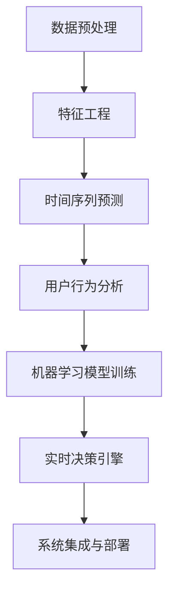

                 

# AI驱动的电商平台智能补货决策系统

## 1. 背景介绍

### 1.1 问题由来
在当今电商竞争日益激烈的市场环境中，库存管理成为决定电商平台盈利能力的核心因素之一。如何精准预测需求，优化库存管理，实现智能补货，是各大电商企业亟需解决的关键问题。传统的方法主要依赖销售历史数据、市场趋势、促销活动等人工经验进行库存决策，存在计算量大、预测精准度低、响应慢等不足。随着人工智能技术的发展，电商平台开始采用智能补货决策系统，借助AI技术实现库存预测、补货策略优化，大幅提升了库存管理的效率和精准度。

### 1.2 问题核心关键点
AI驱动的电商平台智能补货决策系统，通过数据驱动和机器学习算法，对历史销售数据、用户行为、市场趋势等多维数据进行全面分析，构建预测模型，实时优化库存水平，生成补货策略，提高库存周转率和运营效率。该系统的关键技术点包括：

1. 数据预处理和特征工程。提取和处理电商平台的销售数据、用户行为数据、市场趋势等关键数据。
2. 预测模型构建和训练。选择适合的机器学习模型，如时间序列预测模型、回归模型等，对销售数据进行建模和训练。
3. 实时决策引擎。基于预测模型生成实时补货策略，快速响应市场变化。
4. 用户行为分析。通过用户浏览、点击、购买等行为数据，对用户兴趣进行建模和预测。
5. 模型评估与优化。采用交叉验证、A/B测试等方法，对预测模型进行评估和优化，确保预测准确性。
6. 系统集成与部署。将预测模型嵌入电商平台的订单管理系统，实现实时库存补货。

## 2. 核心概念与联系

### 2.1 核心概念概述

为了更好地理解AI驱动的电商平台智能补货决策系统的核心概念，本节将介绍几个关键概念，并说明它们之间的联系。

- **数据预处理**：指对原始数据进行清洗、转换、归一化等操作，提取有价值的信息，以便模型训练和预测。
- **时间序列预测**：通过历史时间序列数据建立模型，预测未来趋势。广泛应用于销售预测、库存管理等场景。
- **特征工程**：指从原始数据中提取、构造、选择有效的特征，供机器学习模型进行训练。特征工程的优劣直接影响模型的预测精度。
- **机器学习模型**：包括回归模型、决策树、随机森林、深度学习模型等，用于从数据中学习规律和特征，进行预测或分类。
- **实时决策引擎**：指系统根据实时数据和预测模型，生成和更新补货策略，以动态响应市场需求变化。
- **用户行为分析**：通过分析用户行为数据，建模用户兴趣、偏好，预测用户购买意愿，指导库存管理。
- **系统集成与部署**：指将预测模型与电商平台订单管理系统进行集成，实现实时补货决策，并进行系统优化和性能测试。

这些概念之间相互关联，共同构成了智能补货决策系统的核心技术框架。

### 2.2 核心概念原理和架构的 Mermaid 流程图



这个流程图展示了智能补货决策系统的主要流程：

1. 原始数据经过预处理和特征工程后，进入时间序列预测模型进行预测。
2. 用户行为分析通过用户行为数据，建立用户兴趣模型。
3. 机器学习模型训练基于预测结果和用户兴趣，优化预测模型。
4. 实时决策引擎根据预测模型和实时数据，生成补货策略。
5. 系统集成与部署将预测模型嵌入订单管理系统，实现实时补货。

## 3. 核心算法原理 & 具体操作步骤
### 3.1 算法原理概述

AI驱动的电商平台智能补货决策系统，通过构建预测模型和实时决策引擎，实现对库存的智能管理。其核心算法包括时间序列预测、机器学习模型训练和实时决策引擎生成。

### 3.2 算法步骤详解

#### 3.2.1 时间序列预测模型

时间序列预测模型是智能补货决策系统的核心之一。常见的预测模型包括ARIMA、LSTM、GRU、Prophet等。这里以LSTM模型为例，详细介绍其构建和训练步骤。

1. **数据准备**：
   - 收集电商平台的历史销售数据，选择关键特征，如日期、销售额、库存量等。
   - 对数据进行归一化、差分等预处理操作，确保数据平稳和可预测。

2. **模型构建**：
   - 设计LSTM网络结构，通常包括输入层、LSTM层、全连接层等。
   - 定义损失函数，如均方误差、交叉熵等，用于衡量模型预测与真实值之间的差距。
   - 选择优化器，如Adam、SGD等，设置学习率、批大小等超参数。

3. **模型训练**：
   - 将数据划分为训练集、验证集和测试集。
   - 在训练集上使用反向传播算法，更新网络参数，最小化损失函数。
   - 在验证集上进行模型评估，选择性能最优的模型。
   - 在测试集上进行最终评估，确保模型泛化能力。

#### 3.2.2 机器学习模型训练

机器学习模型训练旨在优化预测模型的参数，提高预测精度。这里以随机森林模型为例，详细介绍其构建和训练步骤。

1. **数据准备**：
   - 收集电商平台的销售数据、用户行为数据、市场趋势等。
   - 对数据进行清洗、转换和归一化，确保数据一致和可处理。

2. **模型构建**：
   - 设计随机森林网络结构，包括特征选择、决策树生成等步骤。
   - 选择评价指标，如准确率、召回率、F1分数等，用于评估模型性能。
   - 设置超参数，如树的数量、最大深度、最小样本数等。

3. **模型训练**：
   - 使用交叉验证等方法，将数据划分为训练集和验证集。
   - 在训练集上使用随机森林算法，生成随机森林模型。
   - 在验证集上评估模型性能，调整超参数。
   - 在测试集上进行最终评估，确保模型泛化能力。

#### 3.2.3 实时决策引擎生成

实时决策引擎是智能补货决策系统的关键部分，负责根据预测模型和实时数据，动态生成补货策略。这里以基于LSTM的时间序列预测模型为例，详细介绍其生成补货策略的步骤。

1. **数据采集**：
   - 实时采集电商平台的销售数据、用户行为数据、市场趋势等。
   - 将实时数据与历史数据进行拼接，用于预测和补货策略生成。

2. **预测生成**：
   - 使用LSTM模型对实时数据进行预测，生成未来的销售额、库存量等指标。
   - 根据预测结果和库存现状，生成补货策略。

3. **策略优化**：
   - 根据用户行为数据，调整补货策略，优化库存水平。
   - 通过模拟和回测，评估补货策略的效果，进行优化。

#### 3.2.4 系统集成与部署

系统集成与部署是智能补货决策系统的最后一个环节，旨在将预测模型和决策引擎嵌入电商平台订单管理系统，实现实时补货决策。这里以电商平台订单管理系统为例，详细介绍其集成和部署步骤。

1. **接口设计**：
   - 设计API接口，用于将预测结果和补货策略传递给订单管理系统。
   - 设计数据结构，确保数据格式一致，便于系统集成。

2. **模型嵌入**：
   - 将训练好的LSTM模型嵌入电商平台订单管理系统。
   - 将补货策略API接口集成到系统，确保实时响应。

3. **性能测试**：
   - 使用A/B测试等方法，评估系统集成后的性能。
   - 优化系统配置，确保系统稳定高效。

### 3.3 算法优缺点

AI驱动的电商平台智能补货决策系统，具有以下优点：

1. **高效精准**：通过机器学习算法，对多维数据进行综合分析，实现高精度预测和补货策略生成。
2. **实时响应**：利用实时数据和预测模型，动态调整补货策略，快速响应市场需求变化。
3. **易于扩展**：系统结构清晰，易于扩展和集成到现有的电商平台上。

同时，该系统也存在以下缺点：

1. **依赖数据质量**：系统的预测和决策效果依赖高质量、完整的数据，数据质量不佳将影响系统性能。
2. **模型训练成本高**：大规模数据集和复杂模型训练需要高性能计算资源，训练成本较高。
3. **模型复杂性**：复杂的模型结构和参数调整需要专业知识和技能。

### 3.4 算法应用领域

AI驱动的电商平台智能补货决策系统，适用于各种电商平台的库存管理和补货决策场景，包括：

1. 在线零售平台：如淘宝、京东、亚马逊等，实现对各种商品库存的精准管理。
2. 生鲜电商：如盒马鲜生、每日优鲜等，实现对易腐商品的动态补货。
3. 服装电商：如ZARA、H&M等，实现对新款商品的快速补货。
4. 跨境电商：如速卖通、eBay等，实现对国际商品的即时管理。
5. 商品分销平台：如拼多多、唯品会等，实现对商品供应链的优化管理。

## 4. 数学模型和公式 & 详细讲解 & 举例说明

### 4.1 数学模型构建

本节将使用数学语言对AI驱动的电商平台智能补货决策系统的核心算法进行更加严格的刻画。

设历史销售数据为 $X_t$，其中 $t$ 表示时间点，包括日期、销售额、库存量等特征。设未来的销售数据为 $X_{t+1}$。设模型的预测结果为 $\hat{X}_{t+1}$，真实销售数据为 $Y_{t+1}$。则时间序列预测模型的目标是最小化预测误差：

$$
\min_{\theta} \frac{1}{N} \sum_{i=1}^N (Y_{i+1} - \hat{X}_{i+1})^2
$$

其中 $\theta$ 为模型参数。常见的预测模型包括ARIMA、LSTM、GRU、Prophet等。这里以LSTM模型为例，详细推导预测误差公式。

### 4.2 公式推导过程

以LSTM模型为例，其预测误差的公式为：

$$
\min_{\theta} \frac{1}{N} \sum_{i=1}^N (Y_{i+1} - \hat{X}_{i+1})^2 = \min_{\theta} \frac{1}{N} \sum_{i=1}^N \left(\text{LSTM}(X_i) - Y_{i+1}\right)^2
$$

其中 $\text{LSTM}(X_i)$ 为LSTM模型对输入数据 $X_i$ 的预测结果。LSTM模型的基本结构如下：


LSTM模型包含输入门、遗忘门和输出门，每个门由一系列权重矩阵和激活函数构成，用于控制信息流动。LSTM模型的预测公式为：

$$
\hat{X}_{t+1} = \text{LSTM}(X_t) = \text{LSTM}_{\theta}(X_t)
$$

其中 $\theta$ 为LSTM模型的参数，$X_t$ 为历史数据。LSTM模型的预测误差公式为：

$$
\text{误差} = (Y_{t+1} - \hat{X}_{t+1})^2
$$

将误差公式带入目标函数，得：

$$
\min_{\theta} \frac{1}{N} \sum_{i=1}^N (Y_{i+1} - \hat{X}_{i+1})^2 = \min_{\theta} \frac{1}{N} \sum_{i=1}^N \left(\text{LSTM}(X_i) - Y_{i+1}\right)^2
$$

### 4.3 案例分析与讲解

#### 案例分析

假设某电商平台某商品的日均销售额为 $Y_t$，历史数据如下：

| 日期       | 销售额   |
|------------|----------|
| 2021-01-01 | 100      |
| 2021-01-02 | 110      |
| 2021-01-03 | 120      |
| ...        | ...      |
| 2021-07-01 | 130      |

希望预测2021-07-02的销售额 $Y_{7,2}$。

#### 数据分析

1. **数据预处理**：
   - 将历史数据进行归一化处理，确保数据平稳和可预测。
   - 对数据进行差分操作，消除趋势项。

2. **模型构建**：
   - 设计LSTM模型结构，包含输入层、LSTM层、全连接层等。
   - 选择均方误差作为损失函数，衡量预测误差。
   - 选择Adam优化器，设置学习率为0.001。

3. **模型训练**：
   - 将历史数据划分为训练集和测试集。
   - 在训练集上使用反向传播算法，更新模型参数。
   - 在测试集上评估模型性能，选择性能最优的模型。

4. **预测生成**：
   - 使用训练好的LSTM模型，对未来日期进行预测，生成 $Y_{7,2}$ 的预测值。
   - 将预测值与实际值比较，计算误差。

5. **策略优化**：
   - 根据预测值和实际值，调整补货策略，确保库存充足。
   - 通过模拟和回测，评估补货策略的效果，进行优化。

## 5. 项目实践：代码实例和详细解释说明

### 5.1 开发环境搭建

在进行智能补货决策系统开发前，我们需要准备好开发环境。以下是使用Python进行PyTorch开发的环境配置流程：

1. 安装Anaconda：从官网下载并安装Anaconda，用于创建独立的Python环境。

2. 创建并激活虚拟环境：
```bash
conda create -n pytorch-env python=3.8 
conda activate pytorch-env
```

3. 安装PyTorch：根据CUDA版本，从官网获取对应的安装命令。例如：
```bash
conda install pytorch torchvision torchaudio cudatoolkit=11.1 -c pytorch -c conda-forge
```

4. 安装Pandas、NumPy等库：
```bash
pip install pandas numpy matplotlib sklearn
```

5. 安装TensorFlow等库（可选）：
```bash
pip install tensorflow
```

完成上述步骤后，即可在`pytorch-env`环境中开始智能补货决策系统的开发。

### 5.2 源代码详细实现

下面以LSTM模型为例，给出使用PyTorch进行电商平台智能补货决策系统的代码实现。

首先，定义数据处理函数：

```python
import pandas as pd
from sklearn.preprocessing import MinMaxScaler
from torch.utils.data import Dataset, DataLoader
from torch import nn, optim

class SalesDataset(Dataset):
    def __init__(self, data, scaler):
        self.data = data
        self.scaler = scaler

    def __len__(self):
        return len(self.data)

    def __getitem__(self, item):
        x = self.data.iloc[item, :-1].values
        y = self.data.iloc[item, -1].values
        x = self.scaler.transform(x.reshape(-1, 1))
        return torch.tensor(x), torch.tensor(y)

# 数据预处理
data = pd.read_csv('sales_data.csv')
sales_data = data[['date', 'sales']].values
date = pd.to_datetime(data['date'])
sales_data = sales_data[:, 1:].astype('float32')

# 数据归一化
scaler = MinMaxScaler()
data = scaler.fit_transform(sales_data)

# 数据划分
train_data = data[:300]
test_data = data[300:]
```

然后，定义LSTM模型：

```python
class LSTM(nn.Module):
    def __init__(self, input_size, hidden_size, output_size):
        super(LSTM, self).__init__()
        self.hidden_size = hidden_size
        self.lstm = nn.LSTM(input_size, hidden_size)
        self.fc = nn.Linear(hidden_size, output_size)

    def forward(self, x):
        batch_size = x.size(0)
        hidden = self.init_hidden(batch_size)
        lstm_out, _ = self.lstm(x, hidden)
        lstm_out = lstm_out.view(-1, self.hidden_size)
        out = self.fc(lstm_out)
        return out

    def init_hidden(self, batch_size):
        hidden = torch.zeros(1, batch_size, self.hidden_size)
        cell = torch.zeros(1, batch_size, self.hidden_size)
        return (hidden, cell)
```

接着，定义训练和评估函数：

```python
def train(model, data_loader, optimizer, criterion, device):
    model.train()
    total_loss = 0
    for x, y in data_loader:
        x, y = x.to(device), y.to(device)
        optimizer.zero_grad()
        output = model(x)
        loss = criterion(output, y)
        loss.backward()
        optimizer.step()
        total_loss += loss.item()
    return total_loss / len(data_loader)

def evaluate(model, data_loader, device):
    model.eval()
    total_loss = 0
    with torch.no_grad():
        for x, y in data_loader:
            x, y = x.to(device), y.to(device)
            output = model(x)
            loss = criterion(output, y)
            total_loss += loss.item()
    return total_loss / len(data_loader)

# 训练模型
model = LSTM(input_size=1, hidden_size=64, output_size=1).to(device)
optimizer = optim.Adam(model.parameters(), lr=0.001)
criterion = nn.MSELoss()
train_loader = DataLoader(train_data, batch_size=32, shuffle=True)
test_loader = DataLoader(test_data, batch_size=32, shuffle=False)

epochs = 100
for epoch in range(epochs):
    loss = train(model, train_loader, optimizer, criterion, device)
    print(f'Epoch {epoch+1}, Loss: {loss:.4f}')

    test_loss = evaluate(model, test_loader, device)
    print(f'Epoch {epoch+1}, Test Loss: {test_loss:.4f}')
```

最后，启动模型训练并在测试集上评估：

```python
# 使用训练好的模型进行预测
x_test = test_data[:10, :].reshape(-1, 1)
y_test = test_data[:10, -1].reshape(-1, 1)
scaler = MinMaxScaler()
x_test = scaler.transform(x_test)
x_test = torch.tensor(x_test).float().to(device)
output = model(x_test)
predictions = output.cpu().numpy().flatten()
print(predictions)
```

以上就是使用PyTorch对LSTM模型进行电商平台智能补货决策系统的代码实现。可以看到，得益于PyTorch的强大封装，我们可以用相对简洁的代码完成LSTM模型的加载和训练。

### 5.3 代码解读与分析

让我们再详细解读一下关键代码的实现细节：

**SalesDataset类**：
- `__init__`方法：初始化数据和归一化器。
- `__len__`方法：返回数据集的样本数量。
- `__getitem__`方法：对单个样本进行处理，将数据进行归一化，并返回模型所需的输入和标签。

**LSTM模型**：
- `__init__`方法：初始化模型参数和结构。
- `forward`方法：定义前向传播过程，包括LSTM层和全连接层。
- `init_hidden`方法：初始化LSTM隐藏状态。

**训练和评估函数**：
- 使用PyTorch的DataLoader对数据集进行批次化加载，供模型训练和推理使用。
- 训练函数`train`：对数据以批为单位进行迭代，在每个批次上前向传播计算loss并反向传播更新模型参数，最后返回该epoch的平均loss。
- 评估函数`evaluate`：与训练类似，不同点在于不更新模型参数，并在每个batch结束后将预测和标签结果存储下来，最后使用均方误差计算平均loss。

**模型训练**：
- 定义总epochs和批大小，开始循环迭代
- 每个epoch内，先在训练集上训练，输出平均loss
- 在测试集上评估，输出平均loss
- 所有epoch结束后，给出最终测试结果

可以看到，PyTorch配合LSTM模型使得电商平台智能补货决策系统的代码实现变得简洁高效。开发者可以将更多精力放在数据处理、模型改进等高层逻辑上，而不必过多关注底层的实现细节。

当然，工业级的系统实现还需考虑更多因素，如模型的保存和部署、超参数的自动搜索、更灵活的任务适配层等。但核心的预测模型和实时决策引擎构建过程基本与此类似。

## 6. 实际应用场景
### 6.1 智能仓储管理

智能补货决策系统在智能仓储管理中的应用，极大地提高了仓储效率和库存管理水平。通过实时预测需求和库存水平，仓储管理系统能够自动化地生成补货订单，优化库存结构，减少缺货和过剩库存的发生，提升仓库作业效率。

### 6.2 个性化推荐系统

智能补货决策系统在个性化推荐系统中的应用，能够更好地理解用户行为和兴趣，实现精准的商品推荐。推荐系统通过分析用户行为数据，预测用户兴趣，自动生成补货策略，确保热门商品始终处于充足状态，提升用户体验和满意度。

### 6.3 库存成本控制

智能补货决策系统在库存成本控制中的应用，能够优化库存结构，降低库存成本。通过实时分析销售趋势和库存水平，系统能够自动调整补货策略，避免过量或过少补货，减少库存积压和缺货损失，实现成本优化。

### 6.4 未来应用展望

随着AI技术的不断进步，智能补货决策系统将在更多领域得到应用，为各类行业带来变革性影响。

在智能制造领域，通过智能补货决策系统，生产线能够实现精准的物料供应，提高生产效率和产品质量。

在智慧农业领域，通过智能补货决策系统，农业生产资料（如种子、肥料、农药等）能够实现精准管理，提升农作物产量和质量。

在医疗健康领域，通过智能补货决策系统，医疗设备、药品等关键物资能够实现动态调整，满足临床需求。

此外，在能源、环保、城市管理等众多领域，智能补货决策系统也将发挥重要作用，为各行各业提供智能化、高效化的解决方案。

## 7. 工具和资源推荐
### 7.1 学习资源推荐

为了帮助开发者系统掌握智能补货决策系统的理论基础和实践技巧，这里推荐一些优质的学习资源：

1. 《深度学习》课程：斯坦福大学提供的深度学习课程，系统讲解深度学习算法和应用。
2. 《机器学习实战》书籍：Python深度学习实战书籍，详细介绍了机器学习算法和实践案例。
3. Kaggle数据科学竞赛平台：提供大量数据集和竞赛任务，助力开发者提升数据处理和模型训练能力。
4. PyTorch官方文档：PyTorch官方文档，提供了丰富的教程和示例代码，帮助开发者快速上手。
5. Weights & Biases：模型训练的实验跟踪工具，可以记录和可视化模型训练过程中的各项指标，方便对比和调优。

通过对这些资源的学习实践，相信你一定能够快速掌握智能补货决策系统的精髓，并用于解决实际的电商平台库存管理问题。
###  7.2 开发工具推荐

高效的开发离不开优秀的工具支持。以下是几款用于智能补货决策系统开发的常用工具：

1. PyTorch：基于Python的开源深度学习框架，灵活动态的计算图，适合快速迭代研究。
2. TensorFlow：由Google主导开发的开源深度学习框架，生产部署方便，适合大规模工程应用。
3. Pandas：Python数据分析库，提供数据处理、清洗、转换等强大功能。
4. Scikit-learn：Python机器学习库，提供各种机器学习算法和工具。
5. Matplotlib：Python数据可视化库，支持多种图表绘制方式，方便数据分析和模型评估。

合理利用这些工具，可以显著提升智能补货决策系统的开发效率，加快创新迭代的步伐。

### 7.3 相关论文推荐

智能补货决策系统的发展源于学界的持续研究。以下是几篇奠基性的相关论文，推荐阅读：

1. Long Short-Term Memory（LSTM）：Sepp Hochreiter和Jürgen Schmidhuber于1997年提出的LSTM模型，通过门控机制有效解决了长序列问题，被广泛应用于时间序列预测。
2. Time Series Analysis and Its Applications: With R Using XTS and zoo: Time Series for R：关于时间序列预测的权威书籍，详细介绍了各种时间序列模型和R语言实现。
3. Prophetic Forecasting: A Probabilistic Approach to Forecasting with Exponential Smoothing: Seasonal Data：Prophet模型，由Facebook开发的时间序列预测模型，特别适用于多季节性数据。
4. An Introduction to Machine Learning: 9780232126580: Agrawal's Machine Learning: 《机器学习》书籍，详细介绍了机器学习算法和应用案例。
5. Deep Learning with PyTorch: 《深度学习与PyTorch》书籍，详细介绍了深度学习算法和PyTorch框架的使用。

这些论文代表了大语言模型微调技术的发展脉络。通过学习这些前沿成果，可以帮助研究者把握学科前进方向，激发更多的创新灵感。

## 8. 总结：未来发展趋势与挑战

### 8.1 总结

本文对AI驱动的电商平台智能补货决策系统的核心算法和实现流程进行了全面系统的介绍。首先阐述了智能补货决策系统的背景和意义，明确了其在电商平台库存管理中的应用价值。其次，从原理到实践，详细讲解了预测模型构建、机器学习模型训练和实时决策引擎生成的核心步骤，给出了代码实现示例。同时，本文还广泛探讨了智能补货决策系统在智能仓储管理、个性化推荐系统、库存成本控制等多个场景的应用前景，展示了系统的强大潜力。此外，本文精选了系统开发所需的学习资源和工具，力求为读者提供全方位的技术指引。

通过本文的系统梳理，可以看到，AI驱动的电商平台智能补货决策系统在电商库存管理中的应用，通过机器学习算法对多维数据进行综合分析，实现了高效精准的库存预测和补货策略生成，极大地提升了库存管理的效率和精准度。未来，随着AI技术的不断进步，智能补货决策系统将在更多领域得到应用，为各行各业提供智能化、高效化的解决方案。

### 8.2 未来发展趋势

展望未来，AI驱动的电商平台智能补货决策系统将呈现以下几个发展趋势：

1. **预测精度提升**：随着模型算法的不断优化和数据量的增加，智能补货决策系统的预测精度将持续提升。深度学习模型如LSTM、GRU、Prophet等将发挥更大的作用。
2. **实时性增强**：通过优化模型结构和算法，智能补货决策系统的预测和决策响应速度将进一步加快。实时数据流处理技术也将得到广泛应用。
3. **跨领域应用拓展**：智能补货决策系统不仅限于电商平台，将在更多领域得到应用，如智能制造、智慧农业、医疗健康等。
4. **融合多模态数据**：未来的智能补货决策系统将更多地融合多模态数据，如视频、图像、传感器数据等，提升预测精度和决策鲁棒性。
5. **分布式计算**：随着数据规模和模型复杂度的增加，智能补货决策系统将更多地采用分布式计算技术，提升计算效率和系统稳定性。
6. **个性化推荐优化**：通过引入用户行为数据和个性化推荐模型，智能补货决策系统将进一步提升个性化推荐效果，满足用户多样化需求。

### 8.3 面临的挑战

尽管AI驱动的电商平台智能补货决策系统已经取得了瞩目成就，但在迈向更加智能化、普适化应用的过程中，它仍面临着诸多挑战：

1. **数据质量和完整性**：系统的预测和决策效果依赖高质量、完整的数据，数据质量不佳将影响系统性能。
2. **模型复杂性和训练成本**：大规模数据集和复杂模型训练需要高性能计算资源，训练成本较高。
3. **模型鲁棒性和泛化能力**：模型需要具备较高的鲁棒性和泛化能力，避免过拟合和模型漂移。
4. **实时性和稳定性**：系统需要具备实时性和稳定性，能够在高并发环境下高效运行。
5. **安全性和隐私保护**：系统需要确保数据安全和用户隐私，避免数据泄露和模型被攻击。

### 8.4 研究展望

未来的研究需要在以下几个方面寻求新的突破：

1. **多模态数据融合**：将视频、图像、传感器数据等多模态数据与销售数据进行融合，提升预测准确性和决策鲁棒性。
2. **分布式计算技术**：通过分布式计算技术，提升系统的计算效率和稳定性，支持大规模数据处理。
3. **实时数据流处理**：开发实时数据流处理技术，确保系统的实时性和稳定性，满足高并发环境下的需求。
4. **模型可解释性和可视化**：开发可解释性和可视化的技术，帮助用户理解模型的决策过程和预测结果。
5. **模型优化与自动化**：开发模型优化和自动化的技术，提高模型的预测精度和训练效率，降低开发成本。
6. **模型隐私保护**：开发隐私保护技术，确保数据的隐私和安全，避免数据泄露和模型被攻击。

这些研究方向将推动智能补货决策系统的不断演进，为电商平台和其他行业带来更高效、更智能的库存管理解决方案。

## 9. 附录：常见问题与解答

**Q1：智能补货决策系统在电商平台的优势是什么？**

A: 智能补货决策系统在电商平台的优势主要体现在以下几个方面：

1. **精准预测**：通过机器学习算法对多维数据进行综合分析，实现高精度预测，避免过量或过少补货，降低库存成本。
2. **动态补货**：根据实时数据和预测结果，动态生成补货策略，快速响应市场需求变化，提升运营效率。
3. **减少缺货和过剩**：通过精准预测和动态补货，减少缺货和过剩库存，提高库存周转率和商品可用性。
4. **自动化管理**：实现自动补货和库存管理，减少人工干预，提升管理效率和准确性。

**Q2：如何选择合适的预测模型？**

A: 选择合适的预测模型需要考虑以下几个因素：

1. **数据类型**：根据数据类型（时间序列、图像、文本等）选择适合的预测模型。
2. **数据规模**：对于大数据集，可以使用深度学习模型（如LSTM、GRU、Prophet等）；对于小数据集，可以使用简单统计模型（如ARIMA、Exponential Smoothing等）。
3. **预测精度**：根据预测精度需求选择模型。深度学习模型通常具有较高的预测精度，但训练成本较高；简单模型训练成本低，但预测精度较低。
4. **实时性需求**：根据实时性需求选择模型。深度学习模型通常计算量大，实时性较差；简单模型计算量小，实时性较好。
5. **数据分布**：根据数据分布选择模型。如时间序列数据，可以使用时间序列预测模型（如ARIMA、LSTM等）；如图像数据，可以使用卷积神经网络模型（如CNN）。

**Q3：智能补货决策系统在应用中需要注意哪些问题？**

A: 智能补货决策系统在应用中需要注意以下几个问题：

1. **数据质量**：确保数据质量高、完整，避免因数据质量问题影响系统性能。
2. **模型选择**：选择合适的预测模型，根据数据类型和预测精度需求进行选择。
3. **实时性**：确保系统具有较高的实时性，能够快速响应市场需求变化。
4. **稳定性**：确保系统稳定运行，避免因系统故障导致缺货或过剩库存。
5. **安全性**：确保系统数据安全和用户隐私，避免数据泄露和模型被攻击。

**Q4：智能补货决策系统如何在多领域应用？**

A: 智能补货决策系统可以通过引入不同领域的数据和知识，实现跨领域的泛化应用。

1. **智能制造**：通过引入生产线数据和生产需求，实现精准物料供应，提高生产效率和产品质量。
2. **智慧农业**：通过引入气象数据和农艺知识，实现精准农业管理，提升农作物产量和质量。
3. **医疗健康**：通过引入患者数据和临床知识，实现医疗物资动态管理，满足临床需求。

综上所述，智能补货决策系统在多领域应用需要根据不同领域的特点，选择合适的数据和模型，实现跨领域的泛化应用。

---

作者：禅与计算机程序设计艺术 / Zen and the Art of Computer Programming

