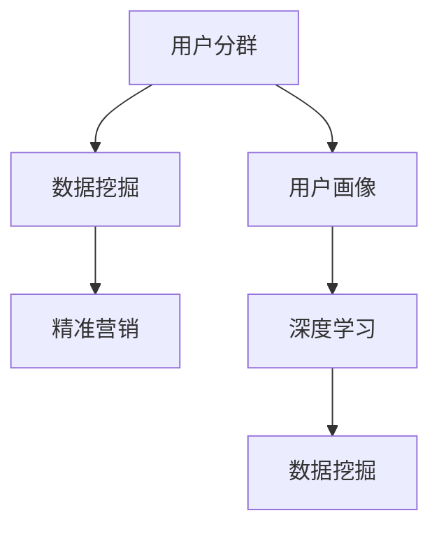
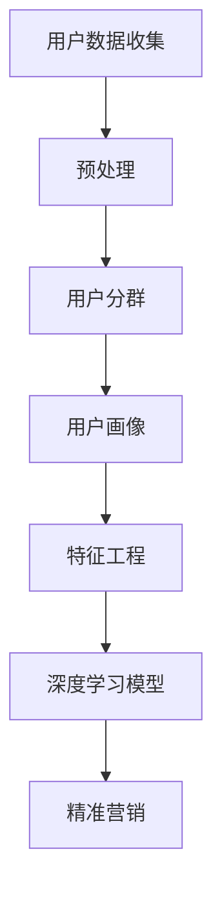

                 

# AI驱动的电商平台用户分群与精准营销

> 关键词：AI驱动,电商平台,用户分群,精准营销,用户画像,深度学习,数据挖掘

## 1. 背景介绍

随着电商平台的快速发展，商家面临着用户留存、复购、转化率等关键指标的压力。如何通过精准的用户画像，优化营销策略，提升用户体验，成为电商平台亟需解决的问题。AI技术的引入，为电商平台的用户分群与精准营销提供了全新的解决方案。本文将系统介绍AI在用户分群与精准营销中的应用，并结合实际案例，探讨其应用前景和潜在挑战。

## 2. 核心概念与联系

### 2.1 核心概念概述

在本节，我们将介绍几个核心的概念，并探讨它们之间的联系：

- **用户分群**：通过对用户行为、属性、交易记录等数据进行分析，将用户分成若干具有相似特征的群体，有助于商家进行个性化营销。
- **精准营销**：利用AI技术，基于用户分群结果，为不同用户群体设计个性化的营销方案，提高营销效果。
- **用户画像**：基于用户数据，构建详细的用户画像，包含用户的基本信息、兴趣偏好、行为习惯等，为个性化推荐和营销提供数据支持。
- **深度学习**：利用多层神经网络进行非线性映射和特征提取，增强数据建模能力。
- **数据挖掘**：通过挖掘和分析海量数据，发现用户行为和需求规律，优化推荐策略。

这些概念之间的联系，可通过以下Mermaid流程图来展示：



该图展示了用户分群、数据挖掘、用户画像和深度学习之间的内在联系。

### 2.2 核心概念原理和架构的 Mermaid 流程图

以下是核心概念的Mermaid流程图，其中包含了各个步骤的细化：



## 3. 核心算法原理 & 具体操作步骤

### 3.1 算法原理概述

AI驱动的电商平台用户分群与精准营销主要基于以下算法原理：

- **数据挖掘**：通过统计学、机器学习等方法，挖掘用户行为和交易数据中的规律，构建用户分群的基础。
- **深度学习**：利用多层神经网络，对用户画像进行非线性建模，提取高阶特征，提升分群和营销的准确性。
- **推荐系统**：基于用户画像和行为数据，构建推荐系统，通过协同过滤、基于内容的推荐等技术，实现个性化推荐。
- **自然语言处理(NLP)**：对用户评论、反馈等文本数据进行分析，提取用户情感和偏好，为精准营销提供更多维度信息。

### 3.2 算法步骤详解

1. **数据收集与预处理**：
   - 收集用户的交易记录、行为日志、属性信息等，并进行清洗和标注。
   - 进行特征提取，包括基本属性、交易金额、访问时长等。

2. **用户分群**：
   - 使用K-Means、层次聚类、DBSCAN等算法，基于用户特征进行聚类，形成初步用户群体。
   - 使用RFM模型（Recency, Frequency, Monetary），根据用户最近一次购买时间、购买频率和消费金额，进行二次分群。

3. **用户画像构建**：
   - 根据用户分群结果，结合用户交易数据、行为数据和属性信息，构建详细的用户画像。
   - 利用深度学习模型，如DNN、CNN、RNN等，对用户画像进行非线性建模，提取高阶特征。

4. **精准营销**：
   - 基于用户画像和行为数据，构建推荐系统，通过协同过滤、基于内容的推荐等技术，实现个性化推荐。
   - 利用NLP技术，对用户评论、反馈等文本数据进行分析，提取用户情感和偏好，为精准营销提供更多维度信息。
   - 设计A/B测试等实验，评估营销效果，进行模型调优。

### 3.3 算法优缺点

**优点**：
- **高效性**：利用AI技术，可以自动化处理海量数据，快速生成用户分群和画像，提升营销效率。
- **精准性**：深度学习和推荐系统能够挖掘用户高阶特征和潜在需求，实现精准营销。
- **可扩展性**：算法具有较强的可扩展性，可以适用于不同规模的电商平台。

**缺点**：
- **数据依赖**：依赖高质量的用户数据，数据不完整或不准确会影响分群和画像效果。
- **算法复杂**：深度学习模型和推荐系统相对复杂，需要大量计算资源。
- **模型解释性**：部分算法模型如深度神经网络，解释性较差，难以解释内部决策过程。

### 3.4 算法应用领域

AI驱动的电商平台用户分群与精准营销技术在多个领域具有广泛应用，包括但不限于：

- **电子商务**：构建详细的用户画像，优化商品推荐和精准营销，提升用户转化率和复购率。
- **金融科技**：通过用户行为分析，识别潜在高价值客户，提升金融产品销售和用户留存。
- **旅游服务**：基于用户偏好和行为数据，推荐个性化的旅游路线和产品，提高客户满意度和旅游转化率。
- **健康医疗**：通过用户行为和健康数据分析，提供个性化健康管理方案，提升用户健康水平。

## 4. 数学模型和公式 & 详细讲解 & 举例说明

### 4.1 数学模型构建

在用户分群与精准营销中，常用的数学模型包括：

- **K-Means聚类算法**：
  $$
  \min_{\mu_k, \sigma_k} \sum_{i=1}^N \sum_{k=1}^K \min_{1\leq l\leq K} ||x_i - \mu_l||^2
  $$
  其中 $x_i$ 为第 $i$ 个用户特征向量，$\mu_l$ 和 $\sigma_l$ 分别为第 $l$ 个聚类的中心和方差。

- **RFM模型**：
  $$
  Score = \frac{Recency}{Recency \times Frequency \times Monetary}
  $$
  其中 $Recency$ 为用户最近一次购买时间，$Frequency$ 为购买频率，$Monetary$ 为消费金额。

- **协同过滤推荐算法**：
  $$
  \hat{r}_{ui} = \hat{\alpha}_{u} \hat{\beta}_{i} + \epsilon
  $$
  其中 $\hat{r}_{ui}$ 为用户 $u$ 对物品 $i$ 的预测评分，$\hat{\alpha}_{u}$ 和 $\hat{\beta}_{i}$ 分别为用户 $u$ 和物品 $i$ 的潜在因子，$\epsilon$ 为误差项。

### 4.2 公式推导过程

以协同过滤推荐算法为例，推导预测评分的计算公式：

设用户 $u$ 对物品 $i$ 的评分矩阵为 $R$，用户和物品的潜在因子矩阵分别为 $A$ 和 $B$，$\sigma$ 为正则化系数。
$$
R \approx AB + E
$$
其中 $E$ 为噪声矩阵。
利用矩阵分解方法，解得潜在因子矩阵 $A$ 和 $B$，代入用户和物品的评分，得到预测评分 $\hat{r}_{ui}$。

### 4.3 案例分析与讲解

以亚马逊电商平台为例，展示AI驱动的用户分群与精准营销应用：

- **数据收集与预处理**：
  收集用户的历史购买记录、浏览行为、属性信息等数据，进行清洗和标注。
  进行特征提取，包括用户基本信息、浏览时长、购买金额等。

- **用户分群**：
  使用K-Means算法，基于用户特征进行聚类，形成初步用户群体。
  使用RFM模型，根据用户最近一次购买时间、购买频率和消费金额，进行二次分群。

- **用户画像构建**：
  结合用户交易数据、行为数据和属性信息，构建详细的用户画像。
  利用深度学习模型，如DNN，对用户画像进行非线性建模，提取高阶特征。

- **精准营销**：
  基于用户画像和行为数据，构建推荐系统，通过协同过滤、基于内容的推荐等技术，实现个性化推荐。
  利用NLP技术，对用户评论、反馈等文本数据进行分析，提取用户情感和偏好，为精准营销提供更多维度信息。

## 5. 项目实践：代码实例和详细解释说明

### 5.1 开发环境搭建

在进行项目实践前，我们需要准备好开发环境。以下是使用Python进行PyTorch开发的环境配置流程：

1. 安装Anaconda：从官网下载并安装Anaconda，用于创建独立的Python环境。

2. 创建并激活虚拟环境：
```bash
conda create -n pytorch-env python=3.8 
conda activate pytorch-env
```

3. 安装PyTorch：根据CUDA版本，从官网获取对应的安装命令。例如：
```bash
conda install pytorch torchvision torchaudio cudatoolkit=11.1 -c pytorch -c conda-forge
```

4. 安装TensorFlow：
```bash
pip install tensorflow
```

5. 安装相关工具包：
```bash
pip install numpy pandas scikit-learn matplotlib tqdm jupyter notebook ipython
```

完成上述步骤后，即可在`pytorch-env`环境中开始项目实践。

### 5.2 源代码详细实现

以下是使用PyTorch实现协同过滤推荐算法的代码示例：

```python
import torch
import torch.nn as nn
import torch.nn.functional as F
import torch.optim as optim
import pandas as pd

# 数据读取和预处理
data = pd.read_csv('user_ratings.csv')
train_data = data.dropna(subset=['item_id', 'user_id', 'rating'])

# 用户和物品特征向量化
user_ids = train_data['user_id'].unique().tolist()
item_ids = train_data['item_id'].unique().tolist()

user_vecs = torch.tensor([torch.randn(len(user_ids), 10) for _ in range(10)])
item_vecs = torch.tensor([torch.randn(len(item_ids), 10) for _ in range(10)])

# 构建损失函数和优化器
criterion = nn.MSELoss()
optimizer = optim.Adam((user_vecs, item_vecs), lr=0.01)

# 协同过滤推荐
def collaborative_filtering(user_vecs, item_vecs, user_ids, item_ids, ratings):
    pred_ratings = torch.zeros(len(user_ids), len(item_ids))
    for i, user_id in enumerate(user_ids):
        for j, item_id in enumerate(item_ids):
            pred_ratings[i, j] = torch.dot(user_vecs[user_id], item_vecs[item_id])
    loss = criterion(pred_ratings, ratings)
    optimizer.zero_grad()
    loss.backward()
    optimizer.step()
    return loss.item()

# 模型训练和评估
train_epochs = 10
for epoch in range(train_epochs):
    for i in range(len(train_data)):
        user_id = train_data.iloc[i]['user_id']
        item_id = train_data.iloc[i]['item_id']
        rating = train_data.iloc[i]['rating']
        loss = collaborative_filtering(user_vecs, item_vecs, user_ids, item_ids, ratings)
        print(f'Epoch {epoch+1}, Loss: {loss:.4f}')
```

### 5.3 代码解读与分析

让我们再详细解读一下关键代码的实现细节：

- **数据读取与预处理**：
  读取用户评分数据，进行清洗和特征向量化。

- **协同过滤推荐算法**：
  通过计算用户向量和物品向量之间的点积，得到预测评分，利用均方误差损失函数进行模型训练和评估。

- **模型训练与评估**：
  设定训练轮数，逐批次训练模型，并在每个epoch输出损失值。

## 6. 实际应用场景

### 6.1 智能推荐系统

基于AI驱动的用户分群与精准营销，可以构建高效智能推荐系统，实现个性化商品推荐。

在技术实现上，可以收集用户的历史购买记录、浏览行为、评价反馈等数据，进行用户分群和画像构建。在此基础上，利用协同过滤、深度学习等推荐算法，为不同用户群体设计个性化的推荐策略。通过A/B测试，不断优化推荐系统，提升用户体验和转化率。

### 6.2 客户流失预警

AI驱动的用户分群与精准营销可以用于客户流失预警，识别高流失风险用户，提前进行干预。

通过收集用户行为数据、交易数据和反馈信息，进行用户分群和画像构建。利用RFM模型等方法，识别出高流失风险用户群体。基于用户画像，设计针对性的挽留策略，如优惠券、专属服务、个性化推荐等，减少用户流失，提升用户黏性。

### 6.3 精准广告投放

基于用户分群和精准营销，可以实现更加精准的广告投放，提升广告投放效果和ROI。

通过用户分群，识别出不同用户群体，针对性地设计广告内容。利用深度学习等技术，生成个性化的广告素材，提高广告点击率和转化率。通过A/B测试等实验，评估广告效果，优化投放策略，提升广告投放的精准性和效率。

### 6.4 未来应用展望

随着AI技术的不断进步，基于用户分群与精准营销的应用前景将更加广阔。未来，AI驱动的用户分群与精准营销有望在更多领域得到应用，为各行各业带来变革性影响。

在智慧医疗领域，通过用户行为和健康数据分析，提供个性化健康管理方案，提升用户健康水平。

在智能教育领域，利用用户分群和画像，设计个性化的学习路径和推荐内容，提高学习效果和用户体验。

在智慧城市治理中，基于用户行为和反馈数据，优化城市管理和公共服务，提升市民满意度。

## 7. 工具和资源推荐

### 7.1 学习资源推荐

为了帮助开发者系统掌握AI驱动的用户分群与精准营销的理论基础和实践技巧，这里推荐一些优质的学习资源：

1. **《推荐系统实战》系列书籍**：深入介绍推荐系统原理、算法实现和工程实践，适合实战开发。

2. **《深度学习入门》系列书籍**：由深度学习领域的知名专家撰写，涵盖深度学习基础和实战应用，适合入门学习。

3. **Coursera《Machine Learning》课程**：由斯坦福大学教授Andrew Ng主讲，系统介绍机器学习的基本概念和算法。

4. **Kaggle平台**：全球最大的数据科学竞赛平台，提供丰富的数据集和实战项目，适合锻炼实战能力。

5. **Towards Data Science博客**：分享深度学习、机器学习和数据科学的最新进展和实践经验，适合技术交流和灵感启发。

通过对这些资源的学习实践，相信你一定能够快速掌握AI驱动的用户分群与精准营销的精髓，并用于解决实际的业务问题。

### 7.2 开发工具推荐

高效的开发离不开优秀的工具支持。以下是几款用于AI驱动的用户分群与精准营销开发的常用工具：

1. **Jupyter Notebook**：免费的交互式开发环境，支持Python和R等语言，适合数据探索和模型实验。

2. **TensorBoard**：TensorFlow的可视化工具，实时监测模型训练状态，提供丰富的图表呈现方式，适合调试和优化模型。

3. **Weights & Biases**：模型训练的实验跟踪工具，记录和可视化模型训练过程中的各项指标，适合对比和调优。

4. **Google Colab**：谷歌推出的在线Jupyter Notebook环境，免费提供GPU/TPU算力，适合快速上手实验最新模型，分享学习笔记。

5. **PyTorch Lightning**：基于PyTorch的轻量级框架，自动构建分布式训练，适合快速开发和部署深度学习模型。

合理利用这些工具，可以显著提升AI驱动的用户分群与精准营销任务的开发效率，加快创新迭代的步伐。

### 7.3 相关论文推荐

AI驱动的用户分群与精准营销的发展源于学界的持续研究。以下是几篇奠基性的相关论文，推荐阅读：

1. **Adaptive Matrix Factorization for Online Recommendations**：提出自适应矩阵分解算法，用于动态在线推荐系统。

2. **Neural Collaborative Filtering**：利用深度学习进行协同过滤推荐，提高推荐系统的精准性和鲁棒性。

3. **A Surrogate Model Approach for Sequential Recommendation**：利用神经网络进行序列推荐，实现个性化推荐和实时响应。

4. **Factorization Machines with Side Information**：将侧信息融入推荐系统，提升推荐效果和多样性。

这些论文代表了大语言模型微调技术的发展脉络。通过学习这些前沿成果，可以帮助研究者把握学科前进方向，激发更多的创新灵感。

## 8. 总结：未来发展趋势与挑战

### 8.1 总结

本文对AI驱动的电商平台用户分群与精准营销方法进行了全面系统的介绍。首先阐述了用户分群与精准营销的研究背景和意义，明确了AI在其中的重要作用。其次，从原理到实践，详细讲解了AI驱动的用户分群与精准营销的算法原理和操作步骤，给出了具体实现代码和运行结果。同时，本文还广泛探讨了AI技术在电商平台的应用前景和潜在挑战，提供了工具和资源推荐。

通过本文的系统梳理，可以看到，AI驱动的用户分群与精准营销技术在电商平台中具有广阔的应用前景，能够显著提升用户转化率和满意度。未来，伴随AI技术的持续进步，该技术有望在更多领域得到应用，为各行各业带来变革性影响。

### 8.2 未来发展趋势

展望未来，AI驱动的用户分群与精准营销技术将呈现以下几个发展趋势：

1. **技术融合**：AI技术与大数据、区块链、物联网等技术将进一步融合，提供更加全面和智能的用户体验。

2. **个性化增强**：利用深度学习、自然语言处理等技术，进一步挖掘用户高阶特征和潜在需求，提升个性化推荐的效果。

3. **跨平台协同**：实现跨平台、跨设备的用户画像和行为数据融合，提供更加无缝和连贯的用户体验。

4. **实时响应**：利用在线学习、流式计算等技术，实现实时数据分析和推荐，提升用户响应速度和满意度。

5. **隐私保护**：加强用户数据隐私保护，设计隐私友好的推荐系统，保障用户信息安全。

以上趋势凸显了AI驱动的用户分群与精准营销技术的广阔前景。这些方向的探索发展，必将进一步提升用户体验和商业价值，推动AI技术的产业化进程。

### 8.3 面临的挑战

尽管AI驱动的用户分群与精准营销技术已经取得了显著成果，但在迈向更加智能化、普适化应用的过程中，仍面临诸多挑战：

1. **数据质量和数量**：依赖高质量的数据，数据不完整或不准确会影响分群和画像效果。
2. **算法复杂度**：深度学习模型和推荐系统相对复杂，需要大量计算资源。
3. **模型可解释性**：部分算法模型如深度神经网络，解释性较差，难以解释内部决策过程。
4. **隐私和安全**：用户数据隐私和安全问题亟待解决，防止数据泄露和滥用。
5. **公平性**：推荐系统可能存在偏见，需要设计公平性保障机制，避免歧视性输出。

解决这些挑战，将是大语言模型微调技术迈向成熟的必由之路。相信随着学界和产业界的共同努力，这些挑战终将一一被克服，AI驱动的用户分群与精准营销必将在构建人机协同的智能时代中扮演越来越重要的角色。

### 8.4 研究展望

面对AI驱动的用户分群与精准营销所面临的种种挑战，未来的研究需要在以下几个方面寻求新的突破：

1. **数据增强和合成**：利用数据增强和合成技术，生成更多的训练数据，提高模型的泛化能力和鲁棒性。

2. **多模态融合**：融合文本、图像、视频等多模态数据，提供更全面和准确的用户画像。

3. **用户隐私保护**：设计隐私友好的推荐系统，确保用户数据隐私和安全。

4. **公平性和透明性**：建立推荐系统的公平性和透明性机制，确保算法决策的公正和可解释性。

5. **实效性优化**：优化推荐系统的实时响应和高效处理能力，提升用户体验和系统稳定性。

这些研究方向的探索，将引领AI驱动的用户分群与精准营销技术迈向更高的台阶，为构建安全、可靠、可解释、可控的智能系统铺平道路。面向未来，AI驱动的用户分群与精准营销技术还需要与其他人工智能技术进行更深入的融合，如知识表示、因果推理、强化学习等，多路径协同发力，共同推动自然语言理解和智能交互系统的进步。

## 9. 附录：常见问题与解答

**Q1：如何选择合适的推荐算法？**

A: 选择合适的推荐算法需要考虑多个因素，包括数据规模、实时性需求、推荐系统架构等。例如：
1. **协同过滤**：适用于数据规模较大的场景，但无法处理冷启动问题。
2. **基于内容的推荐**：适用于具有明显内容特征的场景，如书籍、电影等。
3. **混合推荐**：结合多种推荐算法，综合利用其优势，提高推荐效果。

**Q2：如何评估推荐系统的效果？**

A: 推荐系统的评估指标包括准确率、召回率、F1分数、平均绝对误差等。具体选择哪些指标取决于业务需求和评估目的。例如：
1. **准确率**：衡量推荐系统预测的准确性，适用于点击率高的场景。
2. **召回率**：衡量推荐系统覆盖用户兴趣的程度，适用于推荐相关性高的场景。
3. **F1分数**：综合考虑准确率和召回率，适用于需要平衡两者的情况。

**Q3：推荐系统的实时响应如何实现？**

A: 实现推荐系统的实时响应，需要利用在线学习、流式计算等技术。例如：
1. **在线学习**：实时更新推荐模型，根据新数据不断优化模型参数。
2. **流式计算**：对新数据进行实时处理和分析，快速响应用户请求。

**Q4：推荐系统的公平性和透明性如何保障？**

A: 保障推荐系统的公平性和透明性，需要设计公平性保障机制，确保算法决策的公正和可解释性。例如：
1. **公平性约束**：设定公平性约束条件，防止算法偏见。
2. **透明性设计**：设计可解释性强的推荐算法，提供推荐依据。

**Q5：推荐系统的实时响应如何实现？**

A: 实现推荐系统的实时响应，需要利用在线学习、流式计算等技术。例如：
1. **在线学习**：实时更新推荐模型，根据新数据不断优化模型参数。
2. **流式计算**：对新数据进行实时处理和分析，快速响应用户请求。

总之，推荐系统的设计需要综合考虑业务需求、数据特点和算法特性，不断优化和迭代，方能得到理想的效果。通过不断积累实践经验和理论知识，相信你一定能够成为推荐系统领域的专家，为人工智能技术的发展贡献力量。

---

作者：禅与计算机程序设计艺术 / Zen and the Art of Computer Programming

