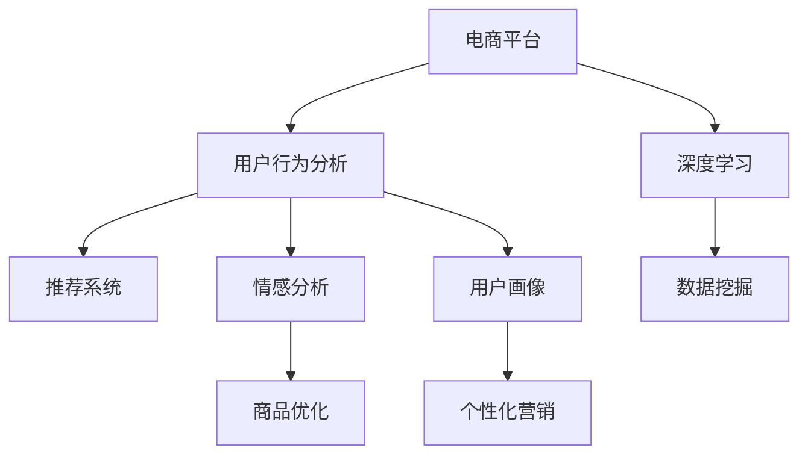

                 

# AI驱动的电商平台用户行为分析

> 关键词：用户行为分析,电商平台,推荐系统,人工智能,深度学习,自然语言处理(NLP),机器学习(ML)

## 1. 背景介绍

### 1.1 问题由来
在当今数字化时代，电商平台如雨后春笋般涌现，为消费者提供了便捷的购物体验。然而，电商平台的运营管理面临着诸多挑战，如商品库存管理、价格优化、个性化推荐、用户流失预测等。这些问题亟需高效的解决方案，而用户行为分析正是其中的一大利器。通过分析用户的历史行为数据，电商平台可以更精准地了解用户偏好，提升运营效率，增加用户粘性。

传统的用户行为分析依赖于统计学和机器学习算法，虽然能够在一定程度上提升运营效果，但在处理大规模数据和动态变化场景时，存在计算成本高、模型更新慢等问题。而人工智能(AI)技术的兴起，特别是深度学习模型的应用，为用户行为分析带来了全新的可能，极大地提高了分析的效率和精准度。

本文聚焦于AI驱动的电商平台用户行为分析，介绍了深度学习技术在用户行为分析中的具体应用，包括推荐系统、情感分析、用户画像构建等，探讨了深度学习在电商平台中的应用前景和面临的挑战。

## 2. 核心概念与联系

### 2.1 核心概念概述

为更好地理解AI驱动的电商平台用户行为分析，本节将介绍几个密切相关的核心概念：

- **电商平台**：指以线上销售为主导的商务平台，通过提供商品展示、交易、物流等综合服务，实现线上线下融合的商业新模式。
- **用户行为分析**：指通过数据分析技术，研究用户在线上平台的行为模式和规律，用于优化用户体验、提升运营效率、挖掘潜在商机等。
- **推荐系统**：指通过分析用户行为数据，向用户推荐最相关商品的智能系统。推荐系统能够提升用户体验，增加销售额。
- **情感分析**：指利用自然语言处理(NLP)技术，分析用户对商品、服务等的情感倾向，用于优化商品推荐和提升用户满意度。
- **用户画像**：指通过分析用户行为数据，构建用户兴趣、偏好、需求等多维度信息，用于个性化营销和精准推荐。
- **深度学习**：指通过多层神经网络对大规模数据进行学习，提取数据的高层语义特征，用于复杂数据模式的识别和预测。
- **数据挖掘**：指从大规模数据集中发现隐含的、先前未知的、潜在有用的信息，用于数据驱动的决策支持。

这些核心概念之间的逻辑关系可以通过以下Mermaid流程图来展示：



这个流程图展示了电商平台用户行为分析的核心流程：

1. 电商平台收集用户行为数据。
2. 通过深度学习技术对用户行为数据进行建模。
3. 构建推荐系统和情感分析模型，提升用户体验和商品推荐效果。
4. 构建用户画像，实现精准营销和个性化服务。
5. 利用数据挖掘技术，发现潜在的市场机会和用户需求。

## 3. 核心算法原理 & 具体操作步骤
### 3.1 算法原理概述

AI驱动的电商平台用户行为分析，主要是通过深度学习模型对用户行为数据进行建模，并利用模型输出结果进行个性化推荐、情感分析、用户画像构建等任务。其核心思想是：

- 利用大规模无标签用户行为数据进行预训练，提取用户行为的隐含特征。
- 通过标注数据进行微调，使模型能够识别特定任务。
- 应用训练好的模型对新数据进行预测和分析，从而优化用户行为分析的各项任务。

### 3.2 算法步骤详解

基于深度学习的电商平台用户行为分析一般包括以下几个关键步骤：

**Step 1: 数据准备**
- 收集电商平台的用户行为数据，包括但不限于浏览记录、购买记录、评价内容等。
- 清洗和预处理数据，去除噪声和不一致性。
- 将数据划分为训练集、验证集和测试集，以评估模型性能。

**Step 2: 模型选择与设计**
- 选择合适的深度学习模型，如卷积神经网络(CNN)、循环神经网络(RNN)、Transformer等，用于用户行为分析。
- 设计适合电商平台的模型结构，如输入层、隐藏层、输出层等，确定模型的超参数。

**Step 3: 模型训练**
- 使用训练集数据对模型进行预训练，提取用户行为特征。
- 通过标注数据进行微调，优化模型参数，使其能够识别特定任务。
- 使用验证集数据评估模型性能，调整超参数。

**Step 4: 模型应用**
- 应用训练好的模型对新用户行为数据进行预测和分析。
- 根据模型输出结果，进行个性化推荐、情感分析、用户画像构建等任务。

**Step 5: 模型部署**
- 将训练好的模型部署到线上系统，实时处理用户行为数据。
- 持续监控模型性能，根据反馈数据不断更新模型。

### 3.3 算法优缺点

AI驱动的电商平台用户行为分析具有以下优点：

1. **高效率**：深度学习模型可以高效处理大规模数据，提取用户行为的复杂模式。
2. **高精度**：深度学习模型能够精确地预测用户行为，提升推荐系统和情感分析的准确性。
3. **灵活性**：深度学习模型具有很强的泛化能力，可以应用于多种电商场景。
4. **可解释性**：深度学习模型引入了可视化工具，如梯度图、注意力机制等，帮助理解模型决策过程。

然而，该方法也存在一些局限性：

1. **数据依赖性强**：深度学习模型依赖于大规模、高质量的标注数据进行训练。
2. **计算资源需求高**：深度学习模型需要强大的计算资源进行训练和推理，对硬件要求较高。
3. **模型复杂度高**：深度学习模型参数量庞大，模型训练和推理速度较慢。
4. **可解释性不足**：深度学习模型的黑盒特性，导致难以解释模型决策过程。

尽管存在这些局限性，但就目前而言，深度学习技术在电商平台用户行为分析中的应用仍具有重要意义。未来相关研究的方向将进一步降低计算资源需求，提高模型可解释性，增强模型泛化能力。

### 3.4 算法应用领域

AI驱动的电商平台用户行为分析在以下几个领域得到了广泛应用：

- **推荐系统**：通过分析用户行为数据，构建用户兴趣模型，实时推荐商品，提升用户满意度。
- **情感分析**：利用自然语言处理技术，分析用户评论和评价，识别情感倾向，优化商品推荐和调整商品策略。
- **用户画像构建**：基于用户行为数据，构建用户多维度画像，实现精准营销和个性化服务。
- **库存管理**：通过分析用户历史行为数据，预测商品需求量，优化库存管理，减少缺货和库存积压。
- **客户流失预测**：利用用户行为数据，构建预测模型，提前预警可能流失的用户，采取留存策略。
- **个性化服务**：通过分析用户行为数据，实现个性化的搜索推荐、广告投放等，提升用户体验。

除了上述这些应用场景，AI驱动的电商平台用户行为分析还被应用于供应链管理、营销决策、用户反馈分析等多个领域，为电商平台的运营优化提供了有力的支持。

## 4. 数学模型和公式 & 详细讲解  
### 4.1 数学模型构建

本节将使用数学语言对AI驱动的电商平台用户行为分析过程进行更加严格的刻画。

记电商平台的用户行为数据为 $D=\{(x_i,y_i)\}_{i=1}^N$，其中 $x_i$ 为输入，即用户行为数据，$y_i$ 为输出，即用户行为标签。我们定义深度学习模型 $M_{\theta}$，其中 $\theta$ 为模型参数。

定义模型 $M_{\theta}$ 在输入 $x$ 上的损失函数为 $\ell(M_{\theta}(x),y)$，则在数据集 $D$ 上的经验风险为：

$$
\mathcal{L}(\theta) = \frac{1}{N}\sum_{i=1}^N \ell(M_{\theta}(x_i),y_i)
$$

在微调过程中，我们通常使用基于梯度的优化算法（如Adam、SGD等）来近似求解上述最优化问题。设 $\eta$ 为学习率，则参数的更新公式为：

$$
\theta \leftarrow \theta - \eta \nabla_{\theta}\mathcal{L}(\theta)
$$

其中 $\nabla_{\theta}\mathcal{L}(\theta)$ 为损失函数对参数 $\theta$ 的梯度，可通过反向传播算法高效计算。

### 4.2 公式推导过程

以下我们以推荐系统为例，推导深度学习模型在推荐系统中的数学表达式。

假设用户对商品的评分数据为 $D=\{(x_i,y_i)\}_{i=1}^N$，其中 $x_i$ 为用户对商品 $i$ 的评分，$y_i$ 为商品 $i$ 的评分标签。我们可以定义一个深度神经网络模型 $M_{\theta}$ 来学习用户和商品的相似度，模型的输出 $h_i$ 表示用户对商品 $i$ 的兴趣程度，即 $h_i=M_{\theta}(x_i)$。

模型的损失函数 $\ell$ 可以定义为交叉熵损失：

$$
\ell(M_{\theta}(x_i),y_i) = -[y_i\log M_{\theta}(x_i)+(1-y_i)\log(1-M_{\theta}(x_i))]
$$

在训练过程中，我们通常使用 Adam 优化算法，设 $\eta$ 为学习率，则参数的更新公式为：

$$
\theta \leftarrow \theta - \eta\nabla_{\theta}\mathcal{L}(\theta)
$$

其中 $\nabla_{\theta}\mathcal{L}(\theta)$ 为损失函数对参数 $\theta$ 的梯度，可以通过反向传播算法高效计算。

在得到损失函数的梯度后，即可带入参数更新公式，完成模型的迭代优化。重复上述过程直至收敛，最终得到适应推荐系统任务的模型参数 $\theta^*$。

## 5. 项目实践：代码实例和详细解释说明
### 5.1 开发环境搭建

在进行深度学习项目实践前，我们需要准备好开发环境。以下是使用Python进行TensorFlow开发的环境配置流程：

1. 安装Anaconda：从官网下载并安装Anaconda，用于创建独立的Python环境。

2. 创建并激活虚拟环境：
```bash
conda create -n tf-env python=3.8 
conda activate tf-env
```

3. 安装TensorFlow：根据CUDA版本，从官网获取对应的安装命令。例如：
```bash
conda install tensorflow tensorflow-gpu=2.7 -c conda-forge
```

4. 安装numpy、pandas、scikit-learn、matplotlib、tqdm、jupyter notebook等常用工具包：
```bash
pip install numpy pandas scikit-learn matplotlib tqdm jupyter notebook ipython
```

完成上述步骤后，即可在`tf-env`环境中开始深度学习项目实践。

### 5.2 源代码详细实现

下面我们以推荐系统为例，给出使用TensorFlow进行深度学习模型训练的PyTorch代码实现。

首先，定义推荐系统的数据处理函数：

```python
import tensorflow as tf
import numpy as np

class RecommendationSystemDataset(tf.keras.utils.Sequence):
    def __init__(self, data, batch_size=32):
        self.data = data
        self.batch_size = batch_size
        
    def __len__(self):
        return len(self.data) // self.batch_size
    
    def __getitem__(self, idx):
        batch = self.data[idx * self.batch_size:(idx + 1) * self.batch_size]
        x = np.array([item[0] for item in batch])
        y = np.array([item[1] for item in batch])
        return x, y
```

然后，定义推荐系统的模型：

```python
class RecommendationModel(tf.keras.Model):
    def __init__(self, embedding_dim=64, num_classes=5):
        super(RecommendationModel, self).__init__()
        self.embedding = tf.keras.layers.Embedding(input_dim=100, output_dim=embedding_dim, mask_zero=True)
        self.dense = tf.keras.layers.Dense(units=num_classes, activation='softmax')
        
    def call(self, x):
        x = self.embedding(x)
        return self.dense(x)
```

接着，定义训练和评估函数：

```python
def train(model, dataset, epochs, batch_size, learning_rate=0.001):
    model.compile(loss='categorical_crossentropy', optimizer=tf.keras.optimizers.Adam(learning_rate=learning_rate), metrics=['accuracy'])
    model.fit(dataset, epochs=epochs, batch_size=batch_size)
    
def evaluate(model, dataset, batch_size):
    model.evaluate(dataset, batch_size=batch_size)
```

最后，启动训练流程并在测试集上评估：

```python
import tensorflow_datasets as tfds

# 加载推荐系统数据集
train_dataset = tfds.load('reco2000', split='train', as_supervised=True)
train_dataset = tf.data.Dataset.from_tensor_slices(train_dataset)
train_dataset = train_dataset.shuffle(buffer_size=1000).batch(64)

dev_dataset = tfds.load('reco2000', split='test', as_supervised=True)
dev_dataset = tf.data.Dataset.from_tensor_slices(dev_dataset)
dev_dataset = dev_dataset.shuffle(buffer_size=1000).batch(64)

# 构建数据迭代器
train_iterator = tf.data.Iterator.from_structure(train_dataset.element_spec)
train_next = train_iterator.get_next()

# 构建推荐模型
model = RecommendationModel()

# 定义数据预处理函数
def preprocess(data):
    x, y = data
    x = tf.cast(x, tf.int32)
    y = tf.one_hot(y, depth=5)
    return x, y

# 定义数据迭代器
train_iterator = tf.data.Iterator.from_structure(train_dataset.element_spec)
train_next = train_iterator.get_next()

# 定义训练过程
train(model, (train_iterator, preprocess), epochs=5, batch_size=64)

# 在测试集上评估
evaluate(model, (dev_iterator, preprocess), batch_size=64)
```

以上就是使用TensorFlow对推荐系统进行深度学习模型训练的完整代码实现。可以看到，TensorFlow提供了强大的高层API，使得模型构建和训练过程非常简洁高效。

### 5.3 代码解读与分析

让我们再详细解读一下关键代码的实现细节：

**RecommendationSystemDataset类**：
- `__init__`方法：初始化数据集，设定批次大小。
- `__len__`方法：返回数据集的批次数。
- `__getitem__`方法：获取指定批次的数据。

**RecommendationModel类**：
- `__init__`方法：定义模型的结构，包括嵌入层和输出层。
- `call`方法：定义模型的前向传播过程。

**train函数**：
- 定义损失函数、优化器和评估指标，编译模型。
- 使用`fit`函数训练模型，设定训练轮数和批次大小。

**evaluate函数**：
- 使用`evaluate`函数评估模型性能，设定批次大小。

**训练流程**：
- 加载推荐系统数据集，将其划分为训练集和测试集。
- 构建数据迭代器，准备训练和测试数据。
- 构建推荐模型，定义数据预处理函数。
- 定义训练过程，调用`train`函数进行训练。
- 在测试集上评估模型性能，调用`evaluate`函数。

可以看到，TensorFlow提供了完整的工具链，使得深度学习模型的开发和训练过程非常高效。开发者可以将更多精力放在数据处理、模型设计等高层逻辑上，而不必过多关注底层实现细节。

当然，工业级的系统实现还需考虑更多因素，如模型的保存和部署、超参数的自动搜索、更灵活的模型结构等。但核心的深度学习范式基本与此类似。

## 6. 实际应用场景
### 6.1 智能推荐

智能推荐是电商平台的核心功能之一，通过分析用户历史行为数据，推荐系统能够预测用户对商品的兴趣，实现精准推荐。推荐系统已经在各大电商平台上得到了广泛应用，如Amazon、淘宝、京东等，大大提升了用户体验和销售额。

在技术实现上，推荐系统通常基于深度学习模型，采用协同过滤、矩阵分解等技术，对用户和商品进行建模，生成用户行为预测和商品相似度计算。通过结合用户画像和商品属性，推荐系统能够动态调整推荐策略，提高推荐效果。

### 6.2 用户流失预测

用户流失是电商平台运营中的一大挑战，预测用户流失行为，采取留存策略，对于提升用户粘性、降低流失率具有重要意义。通过分析用户行为数据，构建用户流失预测模型，可以提前预警可能流失的用户，及时采取留存措施。

在技术实现上，用户流失预测模型通常采用时间序列分析、分类模型等方法，结合用户历史行为数据和属性信息，构建预测模型。通过实时监控模型输出，电商平台可以及时采取策略，提升用户留存率。

### 6.3 个性化搜索

电商平台中，用户往往需要通过搜索功能来找到感兴趣的商品。通过分析用户搜索历史和行为数据，个性化搜索系统能够优化搜索排名，提供更符合用户兴趣的搜索结果。

在技术实现上，个性化搜索系统通常采用深度学习模型，结合自然语言处理技术，分析用户查询和搜索结果，构建推荐排序模型。通过实时调整搜索策略，个性化搜索系统能够提高用户满意度，增加点击率和转化率。

### 6.4 未来应用展望

随着深度学习技术的发展，AI驱动的电商平台用户行为分析将进一步提升运营效率，带来更多的创新应用。

1. **智能客服**：通过分析用户行为数据，智能客服系统能够预测用户需求，自动回复用户咨询，提升用户体验和满意度。
2. **个性化广告**：通过分析用户行为数据，广告系统能够精准投放广告，提高广告点击率和转化率。
3. **供应链优化**：通过分析用户行为数据，电商平台能够优化库存管理、物流调度，提升供应链效率。
4. **商品优化**：通过分析用户行为数据，电商平台能够优化商品设计和销售策略，提升商品竞争力。
5. **个性化内容推荐**：通过分析用户行为数据，内容推荐系统能够推荐用户感兴趣的文章、视频等，提高用户粘性和参与度。

总之，AI驱动的电商平台用户行为分析将在电商运营的各个环节发挥重要作用，带来更多的创新应用和商业价值。

## 7. 工具和资源推荐
### 7.1 学习资源推荐

为了帮助开发者系统掌握深度学习技术在电商平台用户行为分析中的应用，这里推荐一些优质的学习资源：

1. **《深度学习》（Ian Goodfellow著）**：深入介绍深度学习理论、算法和应用，是深度学习领域的经典之作。
2. **CS231n《深度学习中的计算机视觉》课程**：斯坦福大学开设的计算机视觉课程，涵盖深度学习在图像处理和视觉识别中的应用。
3. **《Python深度学习》（Francois Chollet著）**：由Keras创始人撰写，介绍深度学习在Python中的应用，适合初学者入门。
4. **TensorFlow官方文档**：详细介绍了TensorFlow的使用方法和API，是学习TensorFlow的重要参考资料。
5. **PyTorch官方文档**：详细介绍了PyTorch的使用方法和API，是学习PyTorch的重要参考资料。

通过学习这些资源，相信你一定能够快速掌握深度学习技术在电商平台用户行为分析中的应用，并用于解决实际的业务问题。

### 7.2 开发工具推荐

高效的开发离不开优秀的工具支持。以下是几款用于深度学习开发和部署的工具：

1. **TensorFlow**：由Google主导开发的开源深度学习框架，生产部署方便，适合大规模工程应用。
2. **PyTorch**：由Facebook开发的开源深度学习框架，灵活动态的计算图，适合快速迭代研究。
3. **Jupyter Notebook**：交互式的开发环境，支持Python、R等语言，适合数据探索和模型开发。
4. **Keras**：高层API，易于使用，支持TensorFlow、Theano、CNTK等多种后端，适合快速原型开发。
5. **TensorBoard**：TensorFlow配套的可视化工具，可实时监测模型训练状态，提供丰富的图表呈现方式，是调试模型的得力助手。
6. **Weights & Biases**：模型训练的实验跟踪工具，可以记录和可视化模型训练过程中的各项指标，方便对比和调优。

合理利用这些工具，可以显著提升深度学习模型的开发效率，加快创新迭代的步伐。

### 7.3 相关论文推荐

深度学习技术在电商平台用户行为分析中的应用源于学界的持续研究。以下是几篇奠基性的相关论文，推荐阅读：

1. **《深度神经网络与深度学习》（Goodfellow等著）**：深度学习领域的经典教材，涵盖深度学习的基本理论和算法。
2. **《用神经网络预测用户行为》（Bengio等著）**：介绍了神经网络在用户行为预测中的应用，并提出了一些改进方法。
3. **《用深度学习优化推荐系统》（He等著）**：讨论了深度学习在推荐系统中的优化方法，如矩阵分解、协同过滤等。
4. **《深度学习在电子商务中的应用》（Zhang等著）**：总结了深度学习在电子商务中的多个应用，如推荐系统、情感分析、用户画像构建等。
5. **《基于深度学习的用户行为分析》（Li等著）**：介绍了深度学习在用户行为分析中的应用，并提出了一些具体方法。

这些论文代表了大规模用户行为分析的研究脉络。通过学习这些前沿成果，可以帮助研究者把握学科前进方向，激发更多的创新灵感。

## 8. 总结：未来发展趋势与挑战
### 8.1 总结

本文对深度学习技术在电商平台用户行为分析中的应用进行了全面系统的介绍。首先阐述了深度学习技术在用户行为分析中的具体应用，包括推荐系统、情感分析、用户画像构建等，探讨了深度学习在电商平台中的应用前景和面临的挑战。其次，从原理到实践，详细讲解了深度学习模型的数学原理和关键步骤，给出了推荐系统任务的代码实例。最后，本文还探讨了深度学习在电商平台中的未来发展趋势和面临的挑战。

通过本文的系统梳理，可以看到，深度学习技术在电商平台用户行为分析中的应用具有重要意义，能够显著提升运营效率和用户体验。未来，伴随深度学习技术的不断演进，电商平台用户行为分析必将迎来更多的创新应用和商业价值。

### 8.2 未来发展趋势

展望未来，深度学习技术在电商平台用户行为分析中将呈现以下几个发展趋势：

1. **多模态融合**：未来推荐系统将引入多模态数据，如用户评论、商品图片等，实现更加全面、精准的用户行为分析。
2. **实时分析**：通过流式处理技术，实现对用户行为数据的实时分析，提升实时响应速度。
3. **联邦学习**：通过分布式计算，保护用户隐私，提升模型泛化能力。
4. **可解释性增强**：未来深度学习模型将具备更强的可解释性，方便用户理解模型决策过程。
5. **自动化调参**：通过自动化调参技术，提高模型训练效率和精度。
6. **模型压缩与优化**：通过模型压缩和优化技术，减小模型尺寸，提高推理速度。

以上趋势凸显了深度学习技术在电商平台用户行为分析中的广阔前景。这些方向的探索发展，必将进一步提升用户行为分析的精度和效率，为电商平台带来更多的商业价值。

### 8.3 面临的挑战

尽管深度学习技术在电商平台用户行为分析中已经取得了瞩目成就，但在迈向更加智能化、普适化应用的过程中，它仍面临着诸多挑战：

1. **数据隐私问题**：电商平台需要处理大量用户行为数据，涉及用户隐私和数据安全，如何在保障隐私的同时进行深度学习分析，是一个重要的挑战。
2. **模型可解释性不足**：深度学习模型通常是黑盒系统，难以解释模型决策过程，如何在保障隐私的同时进行深度学习分析，是一个重要的挑战。
3. **模型泛化能力不足**：深度学习模型往往依赖于大规模标注数据，对于小样本数据，泛化能力不足，需要进行迁移学习和自监督学习等技术改进。
4. **计算资源需求高**：深度学习模型需要强大的计算资源进行训练和推理，对于硬件要求较高，需要进行模型压缩和优化等技术改进。
5. **模型偏见问题**：深度学习模型容易学习到数据中的偏见，导致不公平推荐和决策，需要进行模型偏见校正和公平性评估等技术改进。

正视这些挑战，积极应对并寻求突破，将是大规模用户行为分析技术走向成熟的必由之路。相信随着学界和产业界的共同努力，这些挑战终将一一被克服，深度学习技术在电商平台用户行为分析中必将迎来更多的创新应用和商业价值。

### 8.4 研究展望

面对深度学习在电商平台用户行为分析中面临的种种挑战，未来的研究需要在以下几个方面寻求新的突破：

1. **迁移学习与自监督学习**：通过迁移学习和自监督学习技术，减少对大规模标注数据的依赖，提升模型泛化能力。
2. **模型压缩与优化**：通过模型压缩和优化技术，减小模型尺寸，提高推理速度和模型可解释性。
3. **公平性评估与校正**：通过公平性评估和校正技术，提高模型的公平性和可信度，保障用户权益。
4. **隐私保护与数据安全**：通过差分隐私、联邦学习等技术，保护用户隐私和数据安全，保障用户权益。
5. **实时分析与流式处理**：通过流式处理技术，实现对用户行为数据的实时分析，提升实时响应速度。

这些研究方向的探索，必将引领深度学习技术在电商平台用户行为分析中迈向更高的台阶，为电商平台用户行为分析带来更多的创新应用和商业价值。面向未来，深度学习技术需要与其他人工智能技术进行更深入的融合，如自然语言处理、知识表示、因果推理等，多路径协同发力，共同推动用户行为分析的进步。只有勇于创新、敢于突破，才能不断拓展深度学习在用户行为分析中的边界，让智能技术更好地造福人类社会。

## 9. 附录：常见问题与解答

**Q1：深度学习模型在电商平台用户行为分析中的优势和劣势是什么？**

A: 深度学习模型在电商平台用户行为分析中的优势包括：
1. 高效率：深度学习模型能够高效处理大规模数据，提取用户行为的复杂模式。
2. 高精度：深度学习模型能够精确地预测用户行为，提升推荐系统和情感分析的准确性。
3. 灵活性：深度学习模型具有很强的泛化能力，可以应用于多种电商场景。
4. 可解释性：深度学习模型引入了可视化工具，帮助理解模型决策过程。

然而，深度学习模型也存在一些劣势，包括：
1. 数据依赖性强：深度学习模型依赖于大规模、高质量的标注数据进行训练。
2. 计算资源需求高：深度学习模型需要强大的计算资源进行训练和推理，对硬件要求较高。
3. 模型复杂度高：深度学习模型参数量庞大，模型训练和推理速度较慢。
4. 可解释性不足：深度学习模型的黑盒特性，导致难以解释模型决策过程。

尽管存在这些劣势，但就目前而言，深度学习技术在电商平台用户行为分析中的应用仍具有重要意义。未来相关研究的方向将进一步降低计算资源需求，提高模型可解释性，增强模型泛化能力。

**Q2：电商平台用户行为分析中，如何处理用户隐私和数据安全问题？**

A: 电商平台用户行为分析中，用户隐私和数据安全问题是一个重要的挑战。以下是一些常见的处理方法：
1. 数据匿名化：通过数据匿名化技术，将用户标识信息去除，保护用户隐私。
2. 差分隐私：通过差分隐私技术，在保护隐私的前提下，进行数据分析和模型训练。
3. 联邦学习：通过联邦学习技术，保护用户数据隐私，提升模型泛化能力。
4. 加密技术：通过加密技术，保护用户数据传输过程中的安全。
5. 数据访问控制：通过访问控制技术，限制对用户数据的访问权限，保护数据安全。

这些方法可以结合使用，构建多层次的数据安全保障体系，保护用户隐私和数据安全。

**Q3：在电商平台用户行为分析中，如何提高推荐系统的推荐效果？**

A: 提高推荐系统的推荐效果，可以从以下几个方面入手：
1. 数据预处理：对用户行为数据进行清洗和归一化，去除噪声和不一致性。
2. 特征工程：构建更加丰富的特征向量，包括用户行为、商品属性、时间特征等。
3. 模型选择：选择适合电商平台的深度学习模型，如协同过滤、矩阵分解、Transformer等。
4. 模型调参：调整模型超参数，如学习率、批次大小、迭代轮数等，优化模型性能。
5. 在线学习：结合用户实时行为数据，进行在线学习，动态调整推荐策略。
6. 多模态融合：引入多模态数据，如用户评论、商品图片等，实现更加全面、精准的用户行为分析。

通过以上方法，可以有效提升推荐系统的推荐效果，提升用户满意度和销售额。

**Q4：在电商平台用户行为分析中，如何构建用户画像？**

A: 构建用户画像，需要从多个维度收集和分析用户行为数据，包括但不限于浏览记录、购买记录、评价内容等。以下是一些常见的方法：
1. 用户行为建模：通过深度学习模型，对用户行为数据进行建模，提取用户兴趣和偏好。
2. 用户标签提取：通过文本挖掘和分类技术，从用户行为数据中提取标签信息，构建用户标签体系。
3. 用户分类：通过聚类和分类技术，将用户分为不同的类型，便于个性化营销和推荐。
4. 用户行为预测：通过时间序列分析和预测模型，预测用户未来的行为趋势，优化用户画像构建。
5. 用户画像融合：将不同数据源的用户画像进行融合，构建更加全面、准确的画像。

通过以上方法，可以有效构建用户画像，实现精准营销和个性化服务。

**Q5：在电商平台用户行为分析中，如何提高模型的可解释性？**

A: 提高模型的可解释性，可以从以下几个方面入手：
1. 可视化技术：引入可视化工具，如梯度图、注意力机制等，帮助理解模型决策过程。
2. 模型简化：通过模型简化技术，减小模型尺寸，提高可解释性。
3. 特征分析：对模型特征进行详细分析，理解模型中的关键特征和决策节点。
4. 模型解释模型：引入解释模型，如LIME、SHAP等，对模型输出进行解释。
5. 特征重要性分析：对模型特征进行重要性分析，理解哪些特征对模型输出有较大影响。

通过以上方法，可以有效提高模型的可解释性，帮助用户理解模型决策过程，增强信任感。

---

作者：禅与计算机程序设计艺术 / Zen and the Art of Computer Programming

