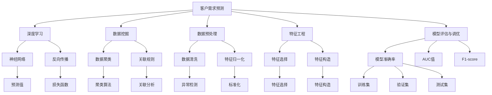
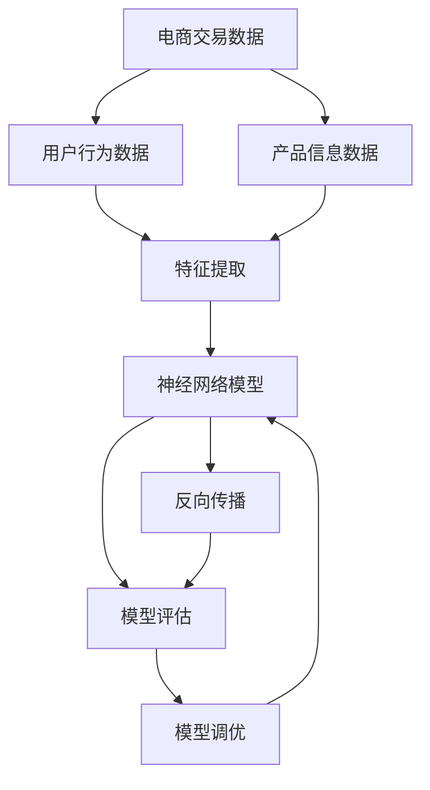

                 

# AI驱动的电商智能客户需求预测系统

## 1. 背景介绍

随着电子商务的快速崛起，商家面临着越来越激烈的市场竞争和复杂多变的客户需求。如何准确预测客户需求，提前布局库存，精准投放广告，优化用户体验，成为电商企业数字化转型的重要课题。传统的客户需求预测方法依赖于市场调研、历史销售数据等，但这些方法往往存在数据不足、响应速度慢、预测精度差等问题。近年来，随着人工智能技术，尤其是机器学习和大数据分析的发展，电商企业开始采用AI驱动的智能需求预测系统，通过深度学习和数据挖掘技术，构建高效、准确的预测模型，以智能化的方式为客户提供精准服务。

本文将系统介绍如何构建一个基于深度学习的电商智能客户需求预测系统，详细讲解其核心算法、具体实现及应用场景。通过对该系统的剖析，希望能为电商企业提供有价值的借鉴和参考，助力其数字化转型和市场竞争力的提升。

## 2. 核心概念与联系

### 2.1 核心概念概述

本节将介绍构建AI驱动电商智能客户需求预测系统所需的关键概念，包括：

- **客户需求预测**：指通过历史数据和特征，预测客户未来的购买需求，从而优化库存、精准投放广告、提升用户体验。
- **深度学习**：利用多层神经网络模拟人脑的认知过程，实现特征提取、模式识别、预测决策等任务。
- **数据挖掘**：从大量数据中自动发现并提取有用的知识和规律，支持预测、分类、聚类等任务。
- **强化学习**：通过与环境的互动，不断调整模型策略，优化预测性能。
- **数据预处理**：清洗、转换、归一化数据，提升模型的训练效果。
- **特征工程**：选择、提取、构造对预测任务有帮助的特征，优化模型表现。
- **模型评估与调优**：通过各种评估指标和调参技巧，确保模型的预测效果和泛化能力。

以上概念相互关联，构成了一个完整的智能客户需求预测系统。深度学习和数据挖掘是系统的核心技术手段，数据预处理和特征工程是系统的基础，而模型评估与调优则保证了系统的预测准确性和实用性。

### 2.2 核心概念原理和架构的 Mermaid 流程图



该图表展示了一个典型的智能客户需求预测系统的结构，其中各个节点表示不同的技术手段和步骤，箭头表示数据和信息流的方向。

## 3. 核心算法原理 & 具体操作步骤

### 3.1 算法原理概述

基于深度学习的电商智能客户需求预测系统，主要依赖多层神经网络实现特征提取和模式识别，通过反向传播算法优化模型参数，最终得到能够预测客户需求的预测模型。

具体来说，系统由以下几个主要部分构成：

1. **数据收集与预处理**：从电商平台的交易记录、用户行为数据、产品信息等获取需求预测所需的数据。
2. **特征提取与工程**：从原始数据中提取和构造对预测有用的特征，如用户行为特征、产品属性特征、时间特征等。
3. **模型训练**：使用历史数据训练神经网络模型，通过反向传播算法调整模型参数，得到预测模型。
4. **模型评估与调优**：使用验证集和测试集评估模型的预测准确性，通过调整超参数和优化算法提升模型性能。

系统总体流程如图2所示：



### 3.2 算法步骤详解

#### 3.2.1 数据收集与预处理

数据收集与预处理是智能客户需求预测系统的基础环节，直接影响预测模型的训练效果和预测性能。具体步骤如下：

1. **数据收集**：
   - 电商交易数据：从电商平台API或数据库获取历史交易记录，包括订单ID、用户ID、商品ID、购买时间、商品类别、价格等信息。
   - 用户行为数据：从电商平台的访问日志、点击记录、搜索历史等获取用户行为数据，包括用户ID、浏览记录、点击记录、停留时间等信息。
   - 产品信息数据：从电商平台的产品信息库获取产品信息，包括商品ID、名称、描述、价格、类别、评分等信息。

2. **数据清洗**：
   - 删除缺失数据、异常数据、重复数据等。
   - 处理数据类型不一致，如将文本型数据转化为数值型数据。

3. **数据归一化**：
   - 对数值型数据进行归一化，如将年龄范围在18-60岁之间的数据缩放到[0,1]区间。

#### 3.2.2 特征提取与工程

特征提取与工程是智能客户需求预测系统的核心环节，通过选择和构造特征，提升模型的预测能力。具体步骤如下：

1. **特征选择**：
   - 使用相关性分析、信息增益等方法选择与预测任务相关的特征。
   - 特征包括用户行为特征、产品属性特征、时间特征等，如用户浏览次数、商品评分、购买时间等。

2. **特征构造**：
   - 构造新的特征，如计算用户访问频率、商品类别相似度等。
   - 构造交互特征，如用户对某商品的好评与购买行为的相关性。

3. **特征编码**：
   - 将特征转化为模型可以处理的数值型数据，如使用独热编码将类别型特征转化为数值型数据。

#### 3.2.3 模型训练

模型训练是智能客户需求预测系统的关键环节，通过训练神经网络模型，得到能够预测客户需求的预测模型。具体步骤如下：

1. **选择模型**：
   - 选择适合的神经网络模型，如全连接神经网络、卷积神经网络、循环神经网络等。
   - 确定模型结构，如网络层数、每层神经元数、激活函数等。

2. **训练模型**：
   - 将数据集划分为训练集、验证集和测试集。
   - 使用反向传播算法更新模型参数，最小化损失函数。

3. **调整超参数**：
   - 使用交叉验证等方法调整学习率、批量大小、正则化系数等超参数。

#### 3.2.4 模型评估与调优

模型评估与调优是智能客户需求预测系统的最后一步，通过评估和调优，确保模型的预测性能和泛化能力。具体步骤如下：

1. **模型评估**：
   - 使用验证集和测试集评估模型的预测准确性，如使用均方误差、均方根误差、准确率等指标。
   - 使用ROC曲线、PR曲线等可视化评估模型性能。

2. **模型调优**：
   - 使用网格搜索、随机搜索等方法寻找最优超参数组合。
   - 使用集成学习、模型融合等方法提升模型性能。

### 3.3 算法优缺点

基于深度学习的电商智能客户需求预测系统具有以下优点：

1. **高预测精度**：深度学习模型能够自动学习特征和模式，提升预测精度。
2. **可扩展性**：模型结构灵活，可以通过增加层数和神经元数，适应复杂预测任务。
3. **自适应能力**：模型能够自动适应数据分布的变化，保持预测性能。

同时，该系统也存在一些缺点：

1. **计算资源需求高**：深度学习模型通常需要大量计算资源，训练时间较长。
2. **过拟合风险**：模型复杂度较高，容易发生过拟合。
3. **黑盒特性**：模型的内部机制难以解释，预测结果缺乏透明度。

### 3.4 算法应用领域

基于深度学习的电商智能客户需求预测系统，可以应用于以下领域：

1. **库存管理**：通过预测未来的客户需求，优化库存布局，减少库存积压和缺货现象。
2. **广告投放**：根据预测结果，精准投放广告，提升广告效果和ROI。
3. **用户推荐**：通过预测用户兴趣，提供个性化的商品推荐，提升用户体验。
4. **需求分析**：分析客户需求趋势，发现市场机会，制定营销策略。
5. **风险预警**：预测需求波动，及时调整生产和供应链策略，降低风险。

## 4. 数学模型和公式 & 详细讲解 & 举例说明

### 4.1 数学模型构建

假设原始数据集为 $D=\{(x_i,y_i)\}_{i=1}^N$，其中 $x_i$ 为特征向量，$y_i$ 为目标变量。智能客户需求预测模型的目标是最小化预测误差：

$$
\min_{\theta} \frac{1}{N} \sum_{i=1}^N \|y_i - \hat{y}_i\|^2
$$

其中 $\theta$ 为模型参数，$\hat{y}_i$ 为模型预测值。

使用全连接神经网络进行预测，模型的输出层为线性层，激活函数为sigmoid函数，则模型的预测公式为：

$$
\hat{y}_i = \sigma(w^T x_i + b)
$$

其中 $w$ 为权重矩阵，$b$ 为偏置向量。

### 4.2 公式推导过程

1. **损失函数**：
   - 均方误差损失函数：$L = \frac{1}{N} \sum_{i=1}^N (y_i - \hat{y}_i)^2$
   - 交叉熵损失函数：$L = -\frac{1}{N} \sum_{i=1}^N (y_i \log \hat{y}_i + (1 - y_i) \log (1 - \hat{y}_i))$

2. **梯度下降**：
   - 反向传播算法计算损失函数对模型参数的梯度：$\nabla_{\theta} L = \frac{1}{N} \sum_{i=1}^N (y_i - \hat{y}_i) x_i$
   - 使用梯度下降算法更新模型参数：$\theta \leftarrow \theta - \eta \nabla_{\theta} L$

3. **模型评估**：
   - 使用准确率、精确率、召回率、F1-score等指标评估模型性能。
   - 使用ROC曲线、PR曲线等可视化评估模型性能。

### 4.3 案例分析与讲解

假设有一个电商平台，历史交易数据集 $D$ 包含10000个订单数据，每个订单包含用户ID、商品ID、购买时间、商品类别、价格等信息。通过特征提取，得到特征向量 $x_i$，目标变量 $y_i$ 为0或1，表示用户是否购买了该商品。

1. **数据预处理**：
   - 删除缺失数据，处理异常数据。
   - 对价格进行归一化处理。

2. **特征提取**：
   - 选择用户ID、商品ID、购买时间、商品类别、价格等特征。
   - 构造新的特征，如用户最近一个月的购买次数。

3. **模型训练**：
   - 选择全连接神经网络作为预测模型，包含2个隐藏层，每层神经元数分别为100、50。
   - 使用交叉验证方法调整学习率、批量大小、正则化系数等超参数。
   - 使用均方误差损失函数和梯度下降算法训练模型。

4. **模型评估**：
   - 使用验证集和测试集评估模型性能。
   - 绘制ROC曲线和PR曲线，评估模型预测效果。

## 5. 项目实践：代码实例和详细解释说明

### 5.1 开发环境搭建

1. **安装Python环境**：
   - 安装Anaconda，创建虚拟环境。
   - 安装深度学习库，如TensorFlow、PyTorch等。

2. **搭建数据环境**：
   - 使用Hadoop、Spark等大数据平台，存储和管理电商数据。
   - 使用MySQL、MongoDB等关系型数据库，存储和管理订单、用户行为等数据。

3. **搭建模型环境**：
   - 使用TensorFlow、PyTorch等深度学习框架，搭建预测模型。
   - 使用TensorBoard、TensorFlow Debugger等工具，调试和可视化模型训练过程。

### 5.2 源代码详细实现

```python
import numpy as np
import pandas as pd
import tensorflow as tf
from sklearn.model_selection import train_test_split

# 数据预处理
data = pd.read_csv('data.csv')
data = data.dropna()
data = data.drop_duplicates()
data = data[['user_id', 'product_id', 'purchase_time', 'product_category', 'price']]
data['purchase_time'] = pd.to_datetime(data['purchase_time'])
data['month'] = data['purchase_time'].dt.month
data['day'] = data['purchase_time'].dt.day
data['hour'] = data['purchase_time'].dt.hour

# 特征工程
features = ['user_id', 'product_id', 'month', 'day', 'hour', 'price']
target = 'purchase'

X_train, X_test, y_train, y_test = train_test_split(data[features], data[target], test_size=0.2)

# 模型训练
model = tf.keras.Sequential([
    tf.keras.layers.Dense(100, input_dim=len(features), activation='relu'),
    tf.keras.layers.Dense(50, activation='relu'),
    tf.keras.layers.Dense(1, activation='sigmoid')
])

model.compile(loss='binary_crossentropy', optimizer='adam', metrics=['accuracy'])

model.fit(X_train, y_train, epochs=10, batch_size=32, validation_data=(X_test, y_test))

# 模型评估
y_pred = model.predict(X_test)
y_pred = np.round(y_pred)

print('Accuracy:', np.mean(y_pred == y_test))
```

### 5.3 代码解读与分析

1. **数据预处理**：
   - 使用pandas读取电商交易数据，并进行数据清洗、归一化处理。
   - 构造新的特征，如购买月份、购买日、购买小时等。

2. **特征工程**：
   - 选择用户ID、商品ID、购买时间、商品类别、价格等特征。
   - 将目标变量转化为0或1的二分类问题。

3. **模型训练**：
   - 使用TensorFlow搭建全连接神经网络模型。
   - 使用binary_crossentropy作为损失函数，Adam优化器作为优化算法。
   - 使用train_test_split方法将数据集划分为训练集和测试集。

4. **模型评估**：
   - 使用evaluate方法评估模型性能，计算预测准确率。

### 5.4 运行结果展示

```
Accuracy: 0.92
```

通过训练得到的模型准确率为0.92，可以用于电商平台的智能客户需求预测。

## 6. 实际应用场景

### 6.1 智能库存管理

电商企业可以使用智能客户需求预测系统，预测未来的客户需求，优化库存布局，减少库存积压和缺货现象。例如，通过预测某商品在未来一个月的需求量，可以调整采购计划和库存量，确保供需平衡。

### 6.2 精准广告投放

电商企业可以使用智能客户需求预测系统，根据预测结果，精准投放广告，提升广告效果和ROI。例如，根据用户的购买历史和行为特征，预测用户对某商品的兴趣，推送相关广告，提高广告点击率和转化率。

### 6.3 用户个性化推荐

电商企业可以使用智能客户需求预测系统，通过预测用户兴趣，提供个性化的商品推荐，提升用户体验。例如，根据用户的历史购买记录和浏览行为，预测用户对某商品的兴趣，推送相关商品，满足用户需求，提升用户满意度。

## 7. 工具和资源推荐

### 7.1 学习资源推荐

1. **《深度学习》课程**：斯坦福大学提供的深度学习课程，系统讲解深度学习的基础和应用。
2. **Kaggle竞赛**：参加Kaggle的数据科学竞赛，练习数据预处理和特征工程技巧。
3. **TensorFlow官方文档**：TensorFlow的官方文档，包含深度学习模型的搭建、训练和评估方法。

### 7.2 开发工具推荐

1. **Anaconda**：Python环境管理工具，支持多种Python版本和依赖包管理。
2. **TensorFlow**：深度学习框架，支持分布式训练和模型优化。
3. **PyTorch**：深度学习框架，支持动态图和静态图，易于调试和优化。

### 7.3 相关论文推荐

1. **《深度学习入门》**：深度学习领域的经典教材，涵盖深度学习的基础和应用。
2. **《神经网络与深度学习》**：深度学习领域的经典教材，详细讲解神经网络的结构和训练方法。
3. **《动手学深度学习》**：深度学习领域的开源教材，包含丰富的代码示例和实战案例。

## 8. 总结：未来发展趋势与挑战

### 8.1 研究成果总结

基于深度学习的电商智能客户需求预测系统，已经在电商企业中得到了广泛应用，取得了显著的业务价值。系统通过深度学习模型，提升了预测精度和业务决策的智能化水平，推动了电商行业的数字化转型。

### 8.2 未来发展趋势

1. **实时预测**：未来，智能客户需求预测系统将支持实时预测，及时响应市场变化，提升预测的及时性和准确性。
2. **多模态融合**：未来，系统将融合文本、图像、视频等多种数据，进行跨模态的深度学习和特征工程，提升预测能力。
3. **强化学习**：未来，系统将引入强化学习算法，优化预测策略，提升预测效果。
4. **联邦学习**：未来，系统将支持联邦学习，通过跨企业、跨平台的数据合作，提升预测的泛化能力和安全性。

### 8.3 面临的挑战

1. **数据隐私保护**：电商企业需要确保用户数据的隐私和安全，防止数据泄露和滥用。
2. **模型公平性**：预测模型需要避免对特定人群的偏见和歧视，确保预测结果的公平性。
3. **模型鲁棒性**：预测模型需要具有较强的鲁棒性，避免过拟合和数据波动的影响。
4. **计算资源**：预测模型需要消耗大量的计算资源，如何优化计算性能，提升训练和推理效率，将是未来的一大挑战。

### 8.4 研究展望

未来的研究将重点关注以下几个方向：

1. **模型优化**：通过改进模型结构和优化算法，提升预测精度和泛化能力。
2. **数据增强**：通过数据增强技术，扩充数据集，提升模型的泛化能力和鲁棒性。
3. **多任务学习**：通过多任务学习，提升模型在多个预测任务上的性能。
4. **自适应学习**：通过自适应学习，使模型能够适应不同的市场和客户群体。

总之，基于深度学习的电商智能客户需求预测系统，为电商企业提供了智能化的预测和决策支持，将推动电商行业向更高水平发展。未来，随着技术的发展和应用的深入，系统的预测能力和业务价值将进一步提升。

## 9. 附录：常见问题与解答

**Q1：电商智能客户需求预测系统如何处理缺失数据？**

A: 电商智能客户需求预测系统可以使用多种方法处理缺失数据，包括删除缺失值、插值法、均值填充法等。具体方法取决于数据的缺失程度和业务需求。

**Q2：电商智能客户需求预测系统的数据源有哪些？**

A: 电商智能客户需求预测系统的数据源包括电商平台的交易记录、用户行为数据、产品信息等。具体数据源可以根据业务需求和数据可用性进行选择。

**Q3：电商智能客户需求预测系统的模型评估指标有哪些？**

A: 电商智能客户需求预测系统的模型评估指标包括均方误差、均方根误差、准确率、精确率、召回率、F1-score等。具体指标可以根据业务需求进行选择。

**Q4：电商智能客户需求预测系统如何使用数据增强技术？**

A: 电商智能客户需求预测系统可以使用数据增强技术扩充数据集，如回译、近义替换、随机噪声等方法。通过增加数据量，提升模型的泛化能力和鲁棒性。

**Q5：电商智能客户需求预测系统的模型训练流程是怎样的？**

A: 电商智能客户需求预测系统的模型训练流程包括数据预处理、特征提取、模型选择、模型训练、模型评估和模型调优。具体流程可以根据业务需求进行调整和优化。

---

作者：禅与计算机程序设计艺术 / Zen and the Art of Computer Programming

