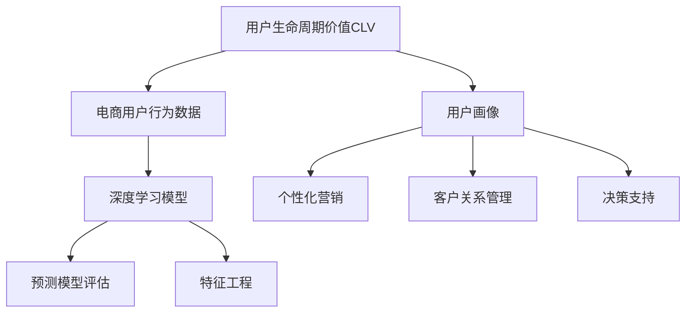

                 

## 1. 背景介绍

### 1.1 问题由来
随着电商市场的快速发展，如何提升用户体验、增加用户粘性，并最终转化成付费用户，成为电商企业持续关注的重点。传统的用户分析方法主要依赖历史交易数据、点击数据、浏览数据等，但这些数据往往无法全面反映用户的行为特征和心理需求。通过深度学习和人工智能技术，结合电商用户行为数据，可以构建更加精确的用户生命周期价值预测模型。

### 1.2 问题核心关键点
用户生命周期价值预测（Customer Lifetime Value, CLV）是大数据分析的重要应用之一，它通过预测用户未来一段时间内的消费总价值，评估用户对企业的潜在贡献。电商企业利用CLV预测模型，可以有效识别高价值用户、优化客户关系管理、制定个性化营销策略，从而提升用户转化率和整体营收。

构建CLV预测模型，通常需要结合用户历史行为数据、标签数据、交易数据等，进行多模态数据的深度融合。传统统计方法如回归模型、分类模型等，往往难以处理高维度、非线性的数据特征，无法充分挖掘数据中的复杂关系。基于深度学习的预测模型，通过端到端的学习，能够更好地捕捉用户行为中的隐含关系，从而提升预测准确性。

### 1.3 问题研究意义
构建AI驱动的电商用户生命周期价值预测模型，对于电商企业具有以下重要意义：
- 提升用户价值评估准确性：通过深度学习模型，更全面地挖掘用户行为和心理特征，更准确地预测用户生命周期价值。
- 优化用户画像：基于CLV预测结果，制定个性化营销策略，提升用户满意度，减少用户流失。
- 指导客户关系管理：了解不同阶段的用户需求，通过针对性服务和沟通，提升用户体验。
- 支持决策支持：基于用户价值评估结果，优化营销资源分配，提升广告投放效率，增加ROI。

## 2. 核心概念与联系

### 2.1 核心概念概述

为了更好地理解基于深度学习的电商用户生命周期价值预测模型，本节将介绍几个关键概念：

- **用户生命周期价值（Customer Lifetime Value, CLV）**：衡量用户长期消费价值的关键指标，通过预测用户未来一段时间内的消费总价值来评估用户价值。
- **电商用户行为数据**：包括浏览行为、点击行为、购买行为、退货行为等，通过这些数据可以获取用户的行为特征和偏好。
- **深度学习模型**：以神经网络为代表的机器学习模型，通过多层非线性变换，学习高维度数据的内在规律，从而实现高效的数据预测。
- **预测模型评估**：通过交叉验证、均方误差、AUC等指标评估模型预测的准确性和泛化能力。
- **特征工程**：通过数据清洗、特征提取、数据变换等手段，提升模型的输入数据质量，从而提升预测性能。

这些概念之间的联系可以通过以下Mermaid流程图来展示：



这个流程图展示了大语言模型的核心概念及其之间的关系：

1. **电商用户行为数据**：提供模型的输入数据。
2. **深度学习模型**：通过学习用户行为数据的内在规律，构建用户生命周期价值预测模型。
3. **预测模型评估**：评估模型的预测性能，确保模型可靠。
4. **特征工程**：提升输入数据的质量，增强模型预测性能。
5. **用户画像**：基于CLV预测结果，描绘用户特征，为个性化营销、客户关系管理等提供支持。
6. **个性化营销**：根据用户画像，制定个性化营销策略，提升用户满意度和转化率。
7. **客户关系管理**：基于用户画像，优化客户关系管理策略，提升用户体验。
8. **决策支持**：为电商企业决策提供科学依据，优化资源分配和营销策略。

这些概念共同构成了电商用户生命周期价值预测模型的工作框架，使其能够在电商领域发挥重要作用。

## 3. 核心算法原理 & 具体操作步骤

### 3.1 算法原理概述

基于深度学习的电商用户生命周期价值预测模型，本质上是一种端到端的学习框架，通过神经网络模型将用户行为数据映射到CLV预测结果。其核心思想是通过训练一个复杂的神经网络，自动学习输入数据与输出标签之间的映射关系，从而实现高精度的预测。

形式化地，假设输入数据为 $\mathbf{x} = (x_1, x_2, ..., x_n)$，其中 $x_i$ 表示电商用户的第 $i$ 个行为特征。目标输出为 $y$，表示用户未来一段时间内的CLV。构建的深度学习模型为 $f(\mathbf{x}; \theta)$，其中 $\theta$ 为模型参数。模型的预测过程为：

$$
y_{pred} = f(\mathbf{x}; \theta)
$$

模型的训练目标是最小化预测误差，通常采用均方误差（Mean Squared Error, MSE）：

$$
\mathcal{L}(y_{pred}, y) = \frac{1}{N} \sum_{i=1}^N (y_{pred} - y)^2
$$

其中 $N$ 为样本数量，$y_{pred}$ 为模型预测值，$y$ 为真实标签。

### 3.2 算法步骤详解

构建电商用户生命周期价值预测模型主要包括以下几个关键步骤：

**Step 1: 数据预处理**
- 收集电商用户行为数据，包括浏览行为、点击行为、购买行为等，并对其进行清洗、去重等处理。
- 收集用户标签数据，如用户性别、年龄、兴趣等，作为预测模型的辅助特征。
- 将交易数据转化为模型可接受的格式，例如将订单金额转化为数值标签。

**Step 2: 特征工程**
- 对原始数据进行特征提取和变换，如通过PCA降维、时间序列特征提取等手段，提升输入数据的稀疏性和结构化程度。
- 设计模型需要的输入特征，包括用户行为特征、用户属性特征、交易特征等。
- 进行特征选择，去除无关或低信息量的特征，提升模型泛化能力。

**Step 3: 模型构建**
- 选择合适的神经网络结构，如多层感知器（MLP）、卷积神经网络（CNN）、循环神经网络（RNN）等。
- 设计模型的损失函数和优化器，如均方误差损失和Adam优化器。
- 划分训练集、验证集和测试集，确保模型在不同数据集上的泛化能力。

**Step 4: 模型训练**
- 使用训练集数据，对模型进行随机梯度下降（SGD）或其他优化算法的训练。
- 在验证集上监测模型的性能，通过交叉验证等技术，调整模型超参数。
- 确保模型在测试集上达到最优性能，保存模型参数。

**Step 5: 模型评估**
- 使用测试集数据，对模型进行预测并评估其性能。
- 计算预测误差、均方误差、AUC等指标，确保模型具有较高的预测准确性和泛化能力。
- 进行敏感性分析，评估模型在不同数据分布下的稳健性。

**Step 6: 模型部署与应用**
- 将训练好的模型部署到实际业务系统中，进行实时预测。
- 将预测结果与营销策略、客户关系管理等业务系统集成，优化用户画像和个性化推荐。
- 持续监测模型性能，根据新数据更新模型参数，确保模型与时俱进。

以上是电商用户生命周期价值预测模型的完整开发流程。在实际应用中，还需要针对具体业务场景进行优化设计，如改进特征提取方法、引入时间序列分析、引入更多用户行为数据等。

### 3.3 算法优缺点

电商用户生命周期价值预测模型具有以下优点：
- 高精度预测：通过深度学习模型，能够全面捕捉用户行为的内在规律，提升预测精度。
- 实时预测：模型可以快速响应实时数据，实现即时的CLV预测。
- 多维度融合：能够融合多种数据源，如电商交易数据、用户行为数据、社交媒体数据等，全面描绘用户画像。
- 自动化部署：模型通过预训练和微调，减少了人工调参的复杂度。

同时，该模型也存在一些缺点：
- 高数据需求：深度学习模型需要大量标注数据进行训练，数据收集和标注成本较高。
- 计算资源消耗大：深度学习模型的训练和推理需要大量的计算资源，如GPU、TPU等。
- 模型复杂度高：深度学习模型结构复杂，难以解释和调试。
- 依赖数据质量：模型的预测结果依赖输入数据的质量，数据清洗和特征提取的准确性直接影响预测性能。

尽管存在这些局限性，但电商用户生命周期价值预测模型在大数据分析、客户关系管理等领域具有重要应用价值，能够显著提升电商企业的用户运营效率和商业决策能力。

### 3.4 算法应用领域

电商用户生命周期价值预测模型已经在电商企业中得到了广泛应用，覆盖了用户画像描绘、个性化推荐、广告投放优化、客户关系管理等多个方面：

- **用户画像描绘**：通过分析用户历史行为数据和标签数据，构建详细的用户画像，包括用户兴趣、行为模式、消费能力等，为个性化营销提供基础。
- **个性化推荐**：基于用户画像和行为数据，实时生成个性化推荐列表，提升用户购买转化率。
- **广告投放优化**：通过预测用户生命周期价值，优化广告投放策略，提升广告投放ROI。
- **客户关系管理**：根据用户生命周期价值预测结果，优化客户服务策略，提升客户满意度。
- **决策支持**：基于用户生命周期价值评估，优化产品推荐、库存管理、资源配置等决策，提升整体运营效率。

除了电商领域，基于深度学习的用户生命周期价值预测模型还可以应用于金融、零售、物流等多个领域，帮助企业制定科学的用户运营策略，提升客户价值和商业绩效。

## 4. 数学模型和公式 & 详细讲解 & 举例说明

### 4.1 数学模型构建

在本节中，我们将使用数学语言对电商用户生命周期价值预测模型的构建过程进行严格阐述。

假设电商用户的行为数据为 $\mathbf{x} = (x_1, x_2, ..., x_n)$，其中 $x_i$ 表示用户第 $i$ 个行为特征。目标输出为 $y$，表示用户未来一段时间内的CLV。构建的深度学习模型为 $f(\mathbf{x}; \theta)$，其中 $\theta$ 为模型参数。

模型的预测过程为：

$$
y_{pred} = f(\mathbf{x}; \theta)
$$

模型的训练目标是最小化预测误差，通常采用均方误差（Mean Squared Error, MSE）：

$$
\mathcal{L}(y_{pred}, y) = \frac{1}{N} \sum_{i=1}^N (y_{pred} - y)^2
$$

其中 $N$ 为样本数量，$y_{pred}$ 为模型预测值，$y$ 为真实标签。

### 4.2 公式推导过程

以一个简单的多层感知器（MLP）模型为例，推导其预测过程和损失函数。

假设模型包含 $L$ 层，每层 $k$ 个神经元。输入层为 $n$ 个特征，输出层为 $y$。模型结构如下：

$$
\mathbf{h}^{(l)} = g(\mathbf{W}^{(l)} \mathbf{h}^{(l-1)} + \mathbf{b}^{(l)}) \quad \text{for} \quad l=1,...,L
$$

其中 $\mathbf{h}^{(l)}$ 为第 $l$ 层的隐状态，$\mathbf{W}^{(l)}$ 和 $\mathbf{b}^{(l)}$ 为第 $l$ 层的权重和偏置，$g$ 为激活函数，如ReLU、Sigmoid等。

假设输出层有 $m$ 个神经元，模型预测过程为：

$$
y_{pred} = \mathbf{W}^{(L)} \mathbf{h}^{(L-1)} + \mathbf{b}^{(L)}
$$

其中 $\mathbf{W}^{(L)}$ 和 $\mathbf{b}^{(L)}$ 为输出层的权重和偏置。

模型的损失函数为均方误差（MSE）：

$$
\mathcal{L}(y_{pred}, y) = \frac{1}{N} \sum_{i=1}^N (y_{pred} - y)^2
$$

对模型进行反向传播，计算梯度并更新参数，更新过程如下：

$$
\frac{\partial \mathcal{L}}{\partial \theta} = \frac{1}{N} \sum_{i=1}^N \frac{\partial \mathcal{L}}{\partial y_{pred}} \frac{\partial y_{pred}}{\partial \mathbf{h}^{(L)}} \frac{\partial \mathbf{h}^{(L)}}{\partial \mathbf{h}^{(L-1)}} ... \frac{\partial \mathbf{h}^{(2)}}{\partial \mathbf{h}^{(1)}} \frac{\partial \mathbf{h}^{(1)}}{\partial \mathbf{x}}
$$

通过上述过程，模型能够自动学习输入数据与输出标签之间的映射关系，从而实现高精度的预测。

### 4.3 案例分析与讲解

以一个电商用户的CLV预测为例，展示模型的训练和预测过程。

假设我们收集了用户的历史行为数据，包括浏览行为、点击行为、购买行为等。将这些数据作为模型的输入特征，用标签 $y$ 表示用户的CLV。

在构建模型时，我们可以选择使用多层感知器（MLP）。模型包含输入层、多个隐藏层和输出层。输入层有 $n$ 个特征，输出层有 $m$ 个神经元。

训练模型时，我们首先将数据划分为训练集、验证集和测试集。然后使用训练集对模型进行训练，使用验证集评估模型性能，并通过交叉验证调整超参数。最后使用测试集评估模型最终性能。

预测时，将用户新的行为数据输入模型，模型输出用户的CLV预测值。这个预测值可以作为电商企业制定个性化营销策略和优化客户关系管理的依据。

## 5. 项目实践：代码实例和详细解释说明

### 5.1 开发环境搭建

在进行电商用户生命周期价值预测模型的实践前，我们需要准备好开发环境。以下是使用Python进行TensorFlow开发的环境配置流程：

1. 安装Anaconda：从官网下载并安装Anaconda，用于创建独立的Python环境。

2. 创建并激活虚拟环境：
```bash
conda create -n tf-env python=3.8 
conda activate tf-env
```

3. 安装TensorFlow：根据CUDA版本，从官网获取对应的安装命令。例如：
```bash
conda install tensorflow=2.6.0 -c conda-forge
```

4. 安装各类工具包：
```bash
pip install numpy pandas scikit-learn matplotlib tqdm jupyter notebook ipython
```

完成上述步骤后，即可在`tf-env`环境中开始模型开发。

### 5.2 源代码详细实现

下面我们以电商用户CLV预测为例，给出使用TensorFlow构建深度学习模型的PyTorch代码实现。

首先，定义数据预处理函数：

```python
import pandas as pd
from sklearn.model_selection import train_test_split

def load_data(file_path):
    df = pd.read_csv(file_path)
    features = df.drop(['CLV'], axis=1)
    labels = df['CLV']
    return features, labels

features, labels = load_data('user_data.csv')
train_features, val_features, train_labels, val_labels = train_test_split(features, labels, test_size=0.2, random_state=42)
```

然后，定义模型和损失函数：

```python
from tensorflow.keras.models import Sequential
from tensorflow.keras.layers import Dense, Dropout, Activation

model = Sequential()
model.add(Dense(64, input_dim=features.shape[1], activation='relu'))
model.add(Dropout(0.5))
model.add(Dense(64, activation='relu'))
model.add(Dropout(0.5))
model.add(Dense(1, activation='sigmoid'))

model.compile(loss='mean_squared_error', optimizer='adam', metrics=['mean_squared_error'])

```

接着，定义训练和评估函数：

```python
from tensorflow.keras.callbacks import EarlyStopping

def train_model(model, train_features, train_labels, val_features, val_labels, epochs=100, batch_size=32):
    early_stopping = EarlyStopping(monitor='val_loss', patience=10)
    history = model.fit(train_features, train_labels, epochs=epochs, batch_size=batch_size, validation_data=(val_features, val_labels), callbacks=[early_stopping])
    return history

def evaluate_model(model, test_features, test_labels):
    mse = model.evaluate(test_features, test_labels)
    return mse
```

最后，启动训练流程并在测试集上评估：

```python
history = train_model(model, train_features, train_labels, val_features, val_labels)
mse = evaluate_model(model, test_features, test_labels)
print('Test MSE:', mse)
```

以上就是使用TensorFlow对电商用户CLV预测模型进行训练的完整代码实现。可以看到，通过TensorFlow和Keras库，可以非常简洁高效地实现深度学习模型的训练和评估。

### 5.3 代码解读与分析

让我们再详细解读一下关键代码的实现细节：

**load_data函数**：
- 定义数据预处理函数，从CSV文件中读取用户数据，将特征和标签分离。

**train_model函数**：
- 使用Keras定义多层感知器（MLP）模型，包含两个隐藏层，使用ReLU激活函数和Dropout正则化。
- 设置损失函数为均方误差（MSE），优化器为Adam，评估指标为MSE。
- 使用EarlyStopping回调函数，在验证集损失没有改善时提前停止训练，避免过拟合。
- 调用fit方法进行模型训练，记录训练过程中的历史性能。

**evaluate_model函数**：
- 使用evaluate方法对测试集进行模型预测，并计算均方误差（MSE）作为评估指标。

**训练流程**：
- 在训练集上进行模型训练，使用验证集评估模型性能，并在测试集上输出最终结果。

可以看到，TensorFlow和Keras库使得深度学习模型的开发变得更加便捷。开发者可以将更多精力放在模型架构设计和数据处理上，而不必过多关注底层的实现细节。

当然，工业级的系统实现还需考虑更多因素，如模型的保存和部署、超参数的自动搜索、更灵活的任务适配层等。但核心的预测范式基本与此类似。

## 6. 实际应用场景

### 6.1 智能客服系统

基于电商用户CLV预测模型，智能客服系统可以更加精准地识别和响应不同用户的需求，提供个性化的服务。智能客服系统可以记录用户的浏览、点击、购买等行为数据，结合用户的CLV预测结果，实现智能推荐和自动化回复。

具体而言，当用户与智能客服交互时，系统首先进行行为数据的实时采集和分析，预测用户的CLV。根据CLV预测结果，系统可以调整回答策略，为高CLV用户提供更高级别的服务，为低CLV用户提供基本的咨询和引导服务。通过智能客服系统，电商企业能够显著提升客户满意度，减少客服人力成本，提升运营效率。

### 6.2 个性化推荐系统

电商企业通过电商用户CLV预测模型，可以更加精准地理解用户需求和行为特征，为个性化推荐提供数据支撑。基于CLV预测结果，系统可以识别高CLV用户和低CLV用户，进行有针对性的推荐策略调整。

在具体实现中，电商企业可以通过分析用户的历史行为数据，预测用户的CLV。根据CLV预测结果，系统可以动态调整推荐算法，提升高CLV用户的购买转化率，降低低CLV用户的推荐噪音。通过个性化推荐系统，电商企业能够提升用户体验，增加用户粘性，优化广告投放策略。

### 6.3 营销策略优化

电商企业通过电商用户CLV预测模型，可以优化营销策略，提升广告投放效果。基于CLV预测结果，系统可以识别高CLV用户和低CLV用户，进行有针对性的广告投放策略调整。

在具体实现中，电商企业可以分析用户的行为数据，预测用户的CLV。根据CLV预测结果，系统可以动态调整广告投放策略，优先投放给高CLV用户，提升广告的ROI。通过优化营销策略，电商企业能够更加精准地把握用户需求，提升广告效果和用户体验。

### 6.4 未来应用展望

随着电商用户CLV预测模型的不断演进，其在电商领域的应用前景将更加广阔。

1. **智能推荐系统**：通过CLV预测模型，可以更加精准地理解用户需求，提升个性化推荐的效果，增加用户粘性。
2. **智能客服系统**：结合CLV预测结果，智能客服系统可以更加精准地识别和响应不同用户的需求，提升客户满意度。
3. **营销策略优化**：通过CLV预测模型，电商企业可以优化广告投放策略，提升广告ROI。
4. **客户关系管理**：基于CLV预测结果，企业可以制定个性化营销策略，提升客户满意度和忠诚度。
5. **库存管理**：通过CLV预测模型，可以优化库存管理策略，减少库存积压，提升库存周转率。
6. **风险管理**：基于CLV预测模型，可以识别高风险用户，制定针对性的风险管理策略，降低用户流失率。

总之，随着深度学习技术的不断发展，基于电商用户CLV预测模型的应用场景将不断拓展，为电商企业的用户运营和商业决策提供更加科学的依据。

## 7. 工具和资源推荐

### 7.1 学习资源推荐

为了帮助开发者系统掌握电商用户CLV预测模型的理论基础和实践技巧，这里推荐一些优质的学习资源：

1. 《深度学习入门：基于TensorFlow的理论与实现》书籍：全面介绍深度学习的基本原理和TensorFlow的使用方法，适合初学者和进阶开发者。
2. CS231n《深度学习计算机视觉》课程：斯坦福大学开设的深度学习课程，涵盖深度学习的基本理论和TensorFlow的使用方法。
3. TensorFlow官方文档：全面介绍TensorFlow的使用方法，提供丰富的API文档和样例代码，适合学习TensorFlow的开发者。
4. Kaggle机器学习竞赛：通过参加Kaggle机器学习竞赛，积累实战经验，提升深度学习模型的应用能力。
5. Coursera深度学习课程：由多所知名大学开设的深度学习课程，涵盖深度学习的基本原理和TensorFlow的使用方法，适合初学者和进阶开发者。

通过对这些资源的学习实践，相信你一定能够快速掌握电商用户CLV预测模型的精髓，并用于解决实际的电商问题。

### 7.2 开发工具推荐

高效的开发离不开优秀的工具支持。以下是几款用于电商用户CLV预测模型开发的常用工具：

1. TensorFlow：基于Python的开源深度学习框架，灵活动态的计算图，适合快速迭代研究。支持分布式计算，适用于大规模数据集。
2. PyTorch：基于Python的开源深度学习框架，支持动态图和静态图，适合快速原型开发。
3. Jupyter Notebook：一个基于Web的交互式环境，支持Python和其他语言的代码编写和执行，方便开发者进行模型训练和调试。
4. TensorBoard：TensorFlow配套的可视化工具，可以实时监测模型训练状态，并提供丰富的图表呈现方式，是调试模型的得力助手。
5. Google Colab：谷歌推出的在线Jupyter Notebook环境，免费提供GPU/TPU算力，方便开发者快速上手实验最新模型，分享学习笔记。

合理利用这些工具，可以显著提升电商用户CLV预测模型的开发效率，加快创新迭代的步伐。

### 7.3 相关论文推荐

电商用户CLV预测模型的研究源于学界的持续研究。以下是几篇奠基性的相关论文，推荐阅读：

1. Deep Customer Lifetime Value Prediction Using Neural Networks（客户生命周期价值深度学习预测）：使用多层感知器模型，通过历史行为数据预测CLV，提升预测精度。
2. Multi-Task Learning for Customer Lifetime Value Prediction（多任务学习客户生命周期价值预测）：结合多个任务，共享模型参数，提升预测效果。
3. A Deep Learning Approach to Customer Lifetime Value Estimation（客户生命周期价值深度学习估计）：使用卷积神经网络（CNN）模型，通过文本和行为数据预测CLV。
4. Understanding Customer Value with Deep Learning（深度学习理解客户价值）：使用神经网络模型，通过行为和标签数据预测CLV，提升预测准确性。
5. Customer Lifetime Value Prediction Using Recommendation System Models（使用推荐系统模型预测客户生命周期价值）：结合推荐系统模型，提升CLV预测效果。

这些论文代表了大语言模型CLV预测技术的发展脉络。通过学习这些前沿成果，可以帮助研究者把握学科前进方向，激发更多的创新灵感。

## 8. 总结：未来发展趋势与挑战

### 8.1 总结

本文对基于深度学习的电商用户生命周期价值预测模型进行了全面系统的介绍。首先阐述了电商用户CLV预测的背景和意义，明确了深度学习模型在电商数据分析中的独特价值。其次，从原理到实践，详细讲解了深度学习模型的构建过程，给出了电商用户CLV预测模型的完整代码实例。同时，本文还广泛探讨了电商用户CLV预测模型在电商用户画像描绘、个性化推荐、广告投放优化、客户关系管理等多个方面的应用前景，展示了深度学习模型的巨大潜力。此外，本文精选了深度学习模型的各类学习资源，力求为读者提供全方位的技术指引。

通过本文的系统梳理，可以看到，基于深度学习的电商用户生命周期价值预测模型正在成为电商数据分析的重要工具，极大地提升电商企业的用户运营效率和商业决策能力。未来，随着深度学习技术的不断发展，基于电商用户CLV预测模型的应用场景将不断拓展，为电商企业的用户运营和商业决策提供更加科学的依据。

### 8.2 未来发展趋势

展望未来，电商用户CLV预测模型将呈现以下几个发展趋势：

1. **模型规模持续增大**：随着算力成本的下降和数据规模的扩张，深度学习模型的参数量还将持续增长。超大批次的训练和推理也可能遇到资源瓶颈，需要进一步优化。
2. **模型结构多样化**：除了多层感知器（MLP），还将涌现更多深度学习模型结构，如卷积神经网络（CNN）、循环神经网络（RNN）等，提升预测性能和泛化能力。
3. **实时预测能力提升**：通过分布式计算、模型压缩等手段，提升深度学习模型的实时预测能力，支持电商企业的实时数据分析和决策支持。
4. **多模态数据融合**：结合电商交易数据、用户行为数据、社交媒体数据等，提升模型的综合分析能力，全面描绘用户画像。
5. **自动化调参优化**：引入自动调参技术，如贝叶斯优化、遗传算法等，提升模型的超参数优化效率，减少人工调参的复杂度。
6. **可解释性和可控性**：通过特征重要性分析、模型可视化等手段，提升深度学习模型的可解释性，增强系统的可控性。

这些趋势凸显了电商用户CLV预测模型的广阔前景。这些方向的探索发展，必将进一步提升深度学习模型的预测性能，为电商企业的用户运营和商业决策提供更加科学、高效的支持。

### 8.3 面临的挑战

尽管电商用户CLV预测模型已经取得了显著成果，但在迈向更加智能化、普适化应用的过程中，它仍面临诸多挑战：

1. **数据质量和标注成本**：深度学习模型需要大量高质量标注数据进行训练，数据收集和标注成本较高。如何降低数据标注的复杂度和成本，是未来需要解决的关键问题。
2. **计算资源消耗大**：深度学习模型的训练和推理需要大量的计算资源，如GPU、TPU等。如何优化计算资源的使用，降低算力成本，也是未来需要解决的重要问题。
3. **模型复杂度和可解释性**：深度学习模型结构复杂，难以解释和调试。如何提升模型的可解释性，增强系统的透明性，是未来需要解决的关键问题。
4. **数据分布变化**：电商用户的消费行为和偏好会随时间变化，如何构建具有动态适应能力的预测模型，是未来需要解决的重要问题。
5. **用户隐私和安全**：电商企业需要处理大量用户数据，如何保护用户隐私和安全，是未来需要解决的关键问题。

尽管存在这些挑战，但电商用户CLV预测模型在电商领域的应用前景广阔，能够显著提升电商企业的用户运营效率和商业决策能力。未来，随着深度学习技术的不断发展，电商用户CLV预测模型必将在电商数据分析、个性化推荐、营销策略优化、客户关系管理等方面发挥更加重要的作用。

### 8.4 研究展望

面对电商用户CLV预测模型所面临的挑战，未来的研究需要在以下几个方面寻求新的突破：

1. **无监督和半监督学习**：探索无监督和半监督学习的方法，减少对大量标注数据的需求，降低数据标注的复杂度和成本。
2. **轻量化模型**：开发轻量化模型结构，提升模型的实时预测能力，支持电商企业的实时数据分析和决策支持。
3. **自动化调参优化**：引入自动调参技术，提升模型的超参数优化效率，减少人工调参的复杂度。
4. **多模态数据融合**：结合电商交易数据、用户行为数据、社交媒体数据等，提升模型的综合分析能力，全面描绘用户画像。
5. **可解释性和可控性**：通过特征重要性分析、模型可视化等手段，提升深度学习模型的可解释性，增强系统的透明性和可控性。
6. **用户隐私和安全**：引入隐私保护技术和安全机制，保护用户数据隐私和安全，增强系统的可信度。

这些研究方向的探索，必将引领电商用户CLV预测模型迈向更高的台阶，为电商企业的用户运营和商业决策提供更加科学、高效的支持。未来，随着深度学习技术的不断发展，电商用户CLV预测模型必将在电商数据分析、个性化推荐、营销策略优化、客户关系管理等方面发挥更加重要的作用。

## 9. 附录：常见问题与解答

**Q1：电商用户CLV预测模型是否适用于所有电商场景？**

A: 电商用户CLV预测模型在大多数电商场景下都能取得不错的效果，特别是对于用户行为数据丰富的场景，如B2C电商、在线零售等。但对于一些特定领域或小众市场，电商用户CLV预测模型的性能可能有所下降。此时需要在特定领域语料上进一步预训练，再进行微调，才能获得理想效果。

**Q2：电商用户CLV预测模型的训练数据需要多少标注样本？**

A: 电商用户CLV预测模型的训练数据需求量较大，通常需要数千甚至数万个标注样本。标注数据太少可能导致模型过拟合，标注数据太多可能导致成本过高。建议根据具体业务场景和数据分布情况，选择合适的数据量和标注方式，以平衡成本和效果。

**Q3：电商用户CLV预测模型如何缓解过拟合问题？**

A: 电商用户CLV预测模型在训练过程中容易过拟合，尤其是在数据量较少的情况下。缓解过拟合问题的方法包括：
1. 数据增强：通过回译、近义替换等方式扩充训练集。
2. 正则化：使用L2正则、Dropout等避免模型过度适应训练集。
3. 对抗训练：引入对抗样本，提高模型鲁棒性。
4. 早停策略：在验证集性能没有提升时提前停止训练，避免过拟合。
5. 模型压缩：通过剪枝、量化等技术，减少模型参数量，提升泛化能力。

这些方法往往需要根据具体业务场景进行灵活组合。只有在数据、模型、训练、推理等各环节进行全面优化，才能最大限度地发挥电商用户CLV预测模型的威力。

**Q4：电商用户CLV预测模型在实际部署中需要注意哪些问题？**

A: 将电商用户CLV预测模型转化为实际业务系统，还需要考虑以下问题：
1. 模型裁剪：去除不必要的层和参数，减小模型尺寸，加快推理速度。
2. 量化加速：将浮点模型转为定点模型，压缩存储空间，提高计算效率。
3. 服务化封装：将模型封装为标准化服务接口，便于集成调用。
4. 弹性伸缩：根据请求流量动态调整资源配置，平衡服务质量和成本。
5. 监控告警：实时采集系统指标，设置异常告警阈值，确保服务稳定性。
6. 安全防护：采用访问鉴权、数据脱敏等措施，保障数据和模型安全。

电商用户CLV预测模型能够显著提升电商企业的用户运营效率和商业决策能力，但如何将强大的性能转化为稳定、高效、安全的业务价值，还需要工程实践的不断打磨。唯有从数据、算法、工程、业务等多个维度协同发力，才能真正实现人工智能技术在电商领域的规模化落地。

总之，电商用户CLV预测模型在大数据分析、客户关系管理等领域具有重要应用价值，能够显著提升电商企业的用户运营效率和商业决策能力。未来，随着深度学习技术的不断发展，基于电商用户CLV预测模型的应用场景将不断拓展，为电商企业的用户运营和商业决策提供更加科学的依据。

---

作者：禅与计算机程序设计艺术 / Zen and the Art of Computer Programming

