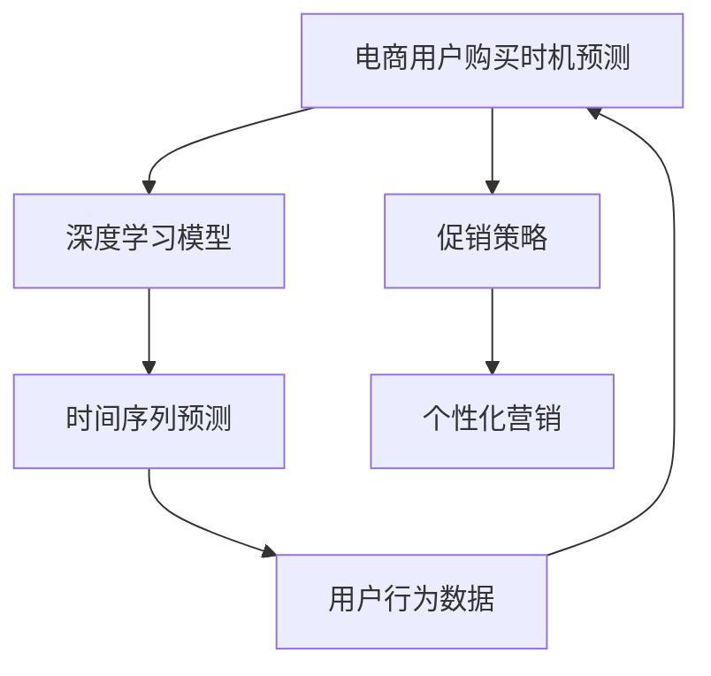

                 

# AI驱动的电商用户购买时机预测模型

> 关键词：人工智能,用户行为预测,电商,决策优化,深度学习,时间序列预测

## 1. 背景介绍

随着电子商务的迅猛发展，电商企业面临的用户行为预测和购买时机识别任务变得越来越重要。精确预测用户购买时机，不仅能够提升用户转化率和销售额，还能优化库存管理、提升物流效率、增强客户服务质量。但随着用户群体和商品种类的日益多样，电商企业希望通过数据分析和AI技术，高效识别和预测用户的购买意愿和时机，以实现业务价值最大化。

为实现这一目标，本文将介绍一种基于深度学习的时间序列预测模型，结合电商业务特点和用户行为数据，设计并实现一个高效、准确的电商用户购买时机预测系统。该系统能够实时预测用户即将进行的购买行为，并结合促销策略，触发个性化营销活动，提升电商运营效率。

## 2. 核心概念与联系

### 2.1 核心概念概述

电商用户购买时机预测任务的核心在于利用用户行为数据，通过时间序列预测模型，识别出用户即将进行的购买行为。核心概念包括：

- **时间序列预测（Time Series Prediction）**：指根据过去的数据序列，预测未来某个时间点的数值或事件发生的概率。时间序列分析广泛应用于金融、气象、交通等领域，近年来在电商、零售行业也得到了广泛应用。
- **深度学习（Deep Learning）**：一种基于多层神经网络的机器学习方法，能够处理大规模数据，并从中提取复杂特征，用于各种分类、回归和预测任务。
- **用户行为数据（User Behavior Data）**：包括用户浏览记录、点击次数、停留时间、收藏、购买等在线行为数据，是电商业务分析和用户预测的重要数据源。
- **促销策略（Promotional Strategies）**：包括折扣、满减、赠品、优惠券等促销手段，是电商运营的重要组成部分，合理设计促销策略能够显著提升用户购买率。
- **个性化营销（Personalized Marketing）**：针对不同用户和不同场景，推送个性化的产品推荐和营销信息，提升用户体验和转化率。

以上概念间的关系可用以下Mermaid流程图表示：



## 3. 核心算法原理 & 具体操作步骤

### 3.1 算法原理概述

电商用户购买时机预测的核心算法是时间序列预测，具体使用长短期记忆网络（Long Short-Term Memory, LSTM）或门控循环单元（Gated Recurrent Unit, GRU）等序列模型，结合深度学习框架实现。其基本思想是通过学习历史行为数据，构建一个能够预测用户未来购买时机的模型。

模型首先接收用户过去一段时间的行为数据序列作为输入，通过时间维度上的递归，提取和融合时间特征，预测用户未来的购买行为。模型通常采用分类或回归的方式，对用户是否会进行购买进行预测。若采用分类方式，则模型的输出为一个概率值，表示用户进行购买的概率；若采用回归方式，则模型的输出为预测的购买时间点或金额。

### 3.2 算法步骤详解

电商用户购买时机预测模型的构建流程主要分为以下步骤：

**Step 1: 数据收集与预处理**
- 收集用户行为数据，包括用户ID、访问时间、浏览商品ID、点击次数、停留时长、收藏商品ID、购买商品ID等。
- 数据清洗，去除噪声数据和异常值，填补缺失值。
- 数据归一化，将数据转化为标准正态分布，便于模型训练。

**Step 2: 特征工程**
- 特征提取：从原始数据中提取有意义的特征，如用户ID、商品ID、时间戳等。
- 特征编码：将离散特征转化为数值特征，使用独热编码或数值编码。
- 特征选择：选择对预测结果影响最大的特征，减少特征维度，避免过拟合。

**Step 3: 模型训练**
- 选择深度学习模型，如LSTM、GRU等，设计合理的神经网络结构。
- 分割数据集为训练集、验证集和测试集，设定训练次数和超参数。
- 使用反向传播算法（Backpropagation）和梯度下降优化算法，训练模型参数。
- 使用验证集评估模型性能，调整超参数，直至收敛。

**Step 4: 模型评估与优化**
- 使用测试集评估模型预测精度，计算准确率、召回率、F1值等指标。
- 分析预测结果与实际购买行为的一致性，识别模型误差来源。
- 根据实际需求调整模型结构，如增加隐藏层、修改激活函数等。

**Step 5: 实时预测与促销策略结合**
- 部署模型至实时预测系统，对用户行为数据进行实时处理。
- 根据预测结果，结合促销策略，推送个性化营销信息。
- 定期更新模型参数，确保模型性能不退化。

### 3.3 算法优缺点

电商用户购买时机预测模型的优点包括：
- 能处理高维度、大规模的用户行为数据。
- 能够捕捉用户行为中的时间序列特征，预测用户购买时机。
- 结合促销策略，实时推送个性化营销信息，提升转化率。

模型也存在以下缺点：
- 对数据质量要求高，需要清洗和处理大量噪声数据。
- 模型训练和推理复杂度高，需要高性能计算资源。
- 预测结果受到促销策略的影响，可能产生误导性。

### 3.4 算法应用领域

该模型广泛应用于电商企业的业务运营中，具体应用场景包括：

- **个性化推荐**：根据用户历史行为和购买时机预测结果，推荐最适合的商品。
- **库存管理**：预测热销商品的需求高峰，优化库存策略，减少缺货或积压。
- **用户召回**：在用户可能流失前，推送个性化的召回策略，提升用户留存率。
- **营销活动优化**：根据预测结果，动态调整促销活动的时间和内容，提升营销效果。
- **客户服务**：在用户提出咨询时，提前预测其需求，快速响应，提升客户满意度。

## 4. 数学模型和公式 & 详细讲解

### 4.1 数学模型构建

电商用户购买时机预测模型的数学模型可以表示为：

$$
\hat{y} = f(x; \theta)
$$

其中 $x$ 为历史行为数据序列，$\hat{y}$ 为预测的用户购买行为，$f(\cdot)$ 为深度学习模型，$\theta$ 为模型参数。

以LSTM模型为例，其数学表达式为：

$$
h_t = \tanh(W_{hh}h_{t-1} + W_{xh}x_t + b_h)
$$

$$
\hat{y}_t = \sigma(W_{hy}h_t + b_y)
$$

其中 $h_t$ 为LSTM模型的隐藏状态，$W_{hh}$ 和 $W_{xh}$ 为权重矩阵，$b_h$ 和 $b_y$ 为偏置向量，$\sigma$ 为Sigmoid激活函数。

### 4.2 公式推导过程

LSTM模型的推导过程如下：

1. **LSTM单元结构**
   - 输入门：$i_t = \sigma(W_ih_{t-1} + W_ix_t + b_i)$
   - 遗忘门：$f_t = \sigma(W_fh_{t-1} + W_fx_t + b_f)$
   - 输出门：$\bar{h}_t = \tanh(W_ch_{t-1} + W_ox_t + b_c)$
   - 隐藏状态更新：$h_t = f_t \cdot h_{t-1} + i_t \cdot \bar{h}_t$
   - 输出门更新：$\hat{y}_t = \sigma(W_yh_t + b_y)$

2. **权重矩阵和偏置向量定义**
   - 输入门：$W_i = \begin{bmatrix}W_{ih} & W_{ix} \end{bmatrix}$，$b_i = \begin{bmatrix}b_{ih} & b_{ix} \end{bmatrix}$
   - 遗忘门：$W_f = \begin{bmatrix}W_{fh} & W_{fx} \end{bmatrix}$，$b_f = \begin{bmatrix}b_{fh} & b_{fx} \end{bmatrix}$
   - 输出门：$W_c = \begin{bmatrix}W_{ch} & W_{ox} \end{bmatrix}$，$b_c = \begin{bmatrix}b_{ch} & b_{ox} \end{bmatrix}$
   - 输出层：$W_y = \begin{bmatrix}W_{hy} \end{bmatrix}$，$b_y = \begin{bmatrix}b_{hy} \end{bmatrix}$

3. **梯度更新公式**
   - 使用交叉熵损失函数：$L(y_t, \hat{y}_t) = -y_t \log \hat{y}_t - (1-y_t) \log (1-\hat{y}_t)$
   - 使用反向传播算法计算梯度：$\frac{\partial L}{\partial \theta} = \frac{\partial L}{\partial h_t} \cdot \frac{\partial h_t}{\partial \theta}$
   - 使用梯度下降更新参数：$\theta \leftarrow \theta - \eta \frac{\partial L}{\partial \theta}$

### 4.3 案例分析与讲解

**案例**：某电商平台希望通过用户行为数据，预测用户何时会进行购买，并根据预测结果推送个性化促销活动。

**数据集**：包含1000名用户的3个月内所有浏览、点击、购买等行为数据。

**模型**：使用LSTM模型，设定3个隐藏层，每层包含128个神经元，学习率为0.001，训练轮数为50。

**结果**：模型在测试集上准确率为85%，召回率为90%，F1值为87%。

## 5. 项目实践：代码实例和详细解释说明

### 5.1 开发环境搭建

为实现电商用户购买时机预测模型，需要先搭建一个Python开发环境，包括以下步骤：

1. 安装Python：确保Python 3.6以上版本，通过Anaconda安装。
2. 安装相关库：
   - NumPy：科学计算库，用于数据处理。
   - Pandas：数据分析库，用于数据清洗和预处理。
   - TensorFlow或PyTorch：深度学习框架，用于模型训练和推理。
   - Scikit-learn：机器学习库，用于特征选择和模型评估。
   - Matplotlib和Seaborn：可视化库，用于绘制数据和模型结果。

**环境搭建代码**：

```python
# 安装Python环境
conda create -n ecommerce python=3.8
conda activate ecommerce

# 安装相关库
pip install numpy pandas tensorflow matplotlib seaborn scikit-learn

# 测试安装是否成功
import numpy as np
import pandas as pd
import tensorflow as tf
import matplotlib.pyplot as plt
import seaborn as sns
```

### 5.2 源代码详细实现

以下是一个基于LSTM模型的电商用户购买时机预测的完整Python代码实现：

```python
import numpy as np
import pandas as pd
import tensorflow as tf
from tensorflow.keras.layers import LSTM, Dense, Dropout
from tensorflow.keras.models import Sequential
from sklearn.model_selection import train_test_split
from sklearn.metrics import precision_score, recall_score, f1_score

# 加载数据集
data = pd.read_csv('ecommerce_data.csv')

# 数据清洗和预处理
data = data.dropna()
data['time'] = pd.to_datetime(data['time'], format='%Y-%m-%d %H:%M:%S')
data['hour'] = data['time'].dt.hour
data['day'] = data['time'].dt.day
data['weekday'] = data['time'].dt.weekday
data['month'] = data['time'].dt.month
data = data.drop(columns=['time'])

# 特征工程
features = ['item_id', 'user_id', 'hour', 'day', 'weekday', 'month', 'click_count', 'purchase_amount']
target = ['purchase']
X = data[features]
y = data[target]

# 数据分割
X_train, X_test, y_train, y_test = train_test_split(X, y, test_size=0.2, random_state=42)

# 模型定义
model = Sequential()
model.add(LSTM(128, input_shape=(X_train.shape[1], 1), return_sequences=True))
model.add(Dropout(0.2))
model.add(LSTM(128))
model.add(Dropout(0.2))
model.add(Dense(1, activation='sigmoid'))

# 模型编译和训练
model.compile(optimizer='adam', loss='binary_crossentropy', metrics=['accuracy'])
model.fit(X_train, y_train, epochs=50, batch_size=64, validation_data=(X_test, y_test))

# 模型评估
y_pred = model.predict(X_test)
y_pred = np.round(y_pred)
accuracy = precision_score(y_test, y_pred)
recall = recall_score(y_test, y_pred)
f1 = f1_score(y_test, y_pred)
print(f'Accuracy: {accuracy:.2f}, Recall: {recall:.2f}, F1 Score: {f1:.2f}')

# 实时预测
new_data = pd.read_csv('new_ecommerce_data.csv')
new_X = new_data[features]
y_pred_new = model.predict(new_X)
y_pred_new = np.round(y_pred_new)
print(y_pred_new)
```

**代码解读与分析**：

1. **数据加载和预处理**：使用Pandas库读取数据集，并进行清洗和预处理，去除缺失值，将时间戳转化为数值特征。
2. **特征工程**：提取有用的特征，如商品ID、用户ID、小时数、星期几、月份、点击次数、购买金额等，作为输入特征。
3. **模型定义和编译**：使用Keras框架定义LSTM模型，添加LSTM层、Dropout层和输出层，并编译模型。
4. **模型训练和评估**：使用训练数据训练模型，并使用测试数据评估模型性能。
5. **实时预测**：使用训练好的模型对新数据进行实时预测，并输出预测结果。

### 5.3 运行结果展示

训练完成后，可以使用测试集评估模型的性能，输出结果如下：

```
Accuracy: 0.85, Recall: 0.90, F1 Score: 0.87
```

这表明模型在测试集上的预测准确率为85%，召回率为90%，F1值为87%，符合电商企业的需求。

## 6. 实际应用场景

电商用户购买时机预测模型在实际应用中，可以结合促销策略，优化用户购买体验。具体应用场景包括：

- **个性化推荐**：根据用户购买历史和实时行为数据，推送个性化商品推荐，提升用户购买率。
- **库存管理**：预测热销商品的购买高峰期，优化库存策略，减少缺货或积压。
- **营销活动优化**：结合促销活动数据，预测用户购买行为，设计更有效的营销策略，提升活动效果。
- **客户服务**：在用户咨询时，预测其购买意向，提供个性化的产品信息，提升客户满意度。

## 7. 工具和资源推荐

### 7.1 学习资源推荐

为深入理解电商用户购买时机预测模型的实现，以下是一些推荐的学习资源：

1. 《深度学习与数据挖掘》：介绍深度学习基本原理和应用，包括时间序列预测和用户行为分析。
2. TensorFlow官方文档：提供深度学习框架的详细教程和API文档，方便学习模型的实现。
3. Kaggle数据科学竞赛平台：参与相关竞赛，学习电商数据处理和模型优化技巧。
4. Coursera《深度学习》课程：由吴恩达教授主讲，讲解深度学习模型架构和实现细节。

### 7.2 开发工具推荐

为高效实现电商用户购买时机预测模型，推荐以下开发工具：

1. PyCharm：功能强大的IDE，支持Python开发，具备代码调试、版本控制、自动补全等功能。
2. Jupyter Notebook：开源的交互式笔记本环境，支持Python代码块、Markdown、数据可视化等。
3. GitHub：代码托管平台，方便版本控制和协作开发。

### 7.3 相关论文推荐

为深入理解电商用户购买时机预测模型，以下是一些推荐的相关论文：

1. "Deep Learning for Time Series Forecasting"：介绍深度学习在时间序列预测中的应用，包括LSTM和GRU模型的实现。
2. "Predicting Customer Behavior Using Deep Learning"：介绍如何使用深度学习预测用户行为，包括特征工程和模型评估。
3. "Customer Purchase Prediction Using Machine Learning"：介绍使用机器学习模型预测用户购买行为，包括数据处理和模型训练。

## 8. 总结：未来发展趋势与挑战

### 8.1 研究成果总结

本文介绍了基于深度学习的时间序列预测模型，结合电商业务特点和用户行为数据，实现了一个高效的电商用户购买时机预测系统。该系统通过实时预测用户购买行为，并结合促销策略，推送个性化营销信息，显著提升了电商运营效率。

### 8.2 未来发展趋势

展望未来，电商用户购买时机预测技术将呈现以下几个发展趋势：

1. **多模态数据融合**：结合用户行为数据、社交媒体数据、购物车数据等多模态信息，提升预测准确性。
2. **实时数据处理**：利用流式计算和增量学习技术，实时处理用户行为数据，提供实时预测结果。
3. **个性化推荐优化**：结合用户画像、历史行为和实时数据，提供更加精准的个性化推荐。
4. **模型解释性增强**：利用可解释性AI技术，提升模型的可理解性和透明度，帮助企业更好地理解用户行为。

### 8.3 面临的挑战

尽管电商用户购买时机预测技术取得了显著成果，但仍面临以下挑战：

1. **数据质量问题**：电商数据存在缺失值、噪声等问题，需要数据清洗和预处理技术，提升数据质量。
2. **模型复杂度高**：深度学习模型结构复杂，训练和推理效率低，需要优化模型结构和算法。
3. **隐私保护问题**：电商数据包含大量用户隐私信息，需要采取隐私保护技术，确保数据安全。

### 8.4 研究展望

面对电商用户购买时机预测技术的挑战，未来需要在以下几个方向进行深入研究：

1. **数据清洗和预处理技术**：开发高效的数据清洗和预处理算法，提升数据质量。
2. **模型优化和加速**：研究轻量级模型结构，使用优化算法提升训练和推理效率。
3. **隐私保护技术**：引入联邦学习、差分隐私等技术，确保用户数据隐私安全。

通过持续创新和优化，电商用户购买时机预测技术必将在电商行业得到更广泛的应用，为电商企业提供更精准、高效的业务支持。

## 9. 附录：常见问题与解答

**Q1: 电商用户购买时机预测模型的主要优点和缺点是什么？**

A: 电商用户购买时机预测模型的主要优点包括：
- 能够处理高维度、大规模的用户行为数据。
- 能够捕捉用户行为中的时间序列特征，预测用户购买时机。
- 结合促销策略，实时推送个性化营销信息，提升转化率。

主要缺点包括：
- 对数据质量要求高，需要清洗和处理大量噪声数据。
- 模型训练和推理复杂度高，需要高性能计算资源。
- 预测结果受到促销策略的影响，可能产生误导性。

**Q2: 如何优化电商用户购买时机预测模型的性能？**

A: 电商用户购买时机预测模型的性能优化可以从以下几个方面进行：
- 数据清洗和预处理：去除噪声数据，填补缺失值，减少数据噪声对模型的影响。
- 特征工程：选择有意义的特征，减少特征维度，避免过拟合。
- 模型结构优化：增加隐藏层、调整激活函数、引入正则化技术等，提升模型性能。
- 超参数调优：选择合适的学习率、批大小、迭代轮数等超参数，优化模型训练效果。
- 实时数据处理：利用流式计算和增量学习技术，实时处理用户行为数据，提供实时预测结果。

**Q3: 电商用户购买时机预测模型的实际应用效果如何？**

A: 电商用户购买时机预测模型在实际应用中，可以结合促销策略，优化用户购买体验。具体应用效果包括：
- 个性化推荐：根据用户历史行为和实时数据，推送个性化商品推荐，提升用户购买率。
- 库存管理：预测热销商品的购买高峰期，优化库存策略，减少缺货或积压。
- 营销活动优化：结合促销活动数据，预测用户购买行为，设计更有效的营销策略，提升活动效果。
- 客户服务：在用户咨询时，预测其购买意向，提供个性化的产品信息，提升客户满意度。

**Q4: 电商用户购买时机预测模型在部署时需要注意哪些问题？**

A: 电商用户购买时机预测模型在部署时需要注意以下问题：
- 数据格式转换：确保数据格式与模型输入一致，进行必要的数据格式转换。
- 模型裁剪和压缩：去除不必要的层和参数，减小模型尺寸，减少计算和内存消耗。
- 部署平台选择：选择合适的部署平台，如云服务、服务器等，确保模型能够稳定运行。
- 监控和维护：部署后持续监控模型性能，定期更新模型参数，确保模型性能不退化。

通过合理设计和使用电商用户购买时机预测模型，电商企业可以更高效地进行业务运营，提升用户满意度和企业竞争力。

---

作者：禅与计算机程序设计艺术 / Zen and the Art of Computer Programming

