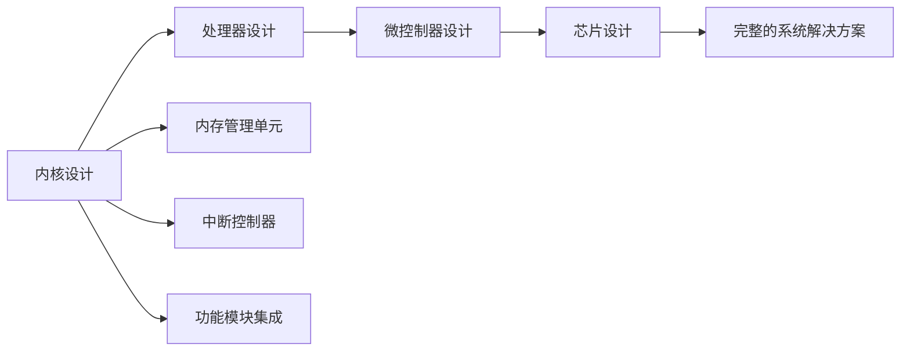

                 

# ARM 架构：嵌入式系统设计

> 关键词：ARM 架构,嵌入式系统,处理器设计,微处理器,内核设计,微控制器,芯片设计

## 1. 背景介绍

### 1.1 问题由来

嵌入式系统（Embedded Systems）是计算机技术在各行各业中的深度融合，它们一般具有资源受限、实时性要求高等特点。在嵌入式领域，处理器设计是系统设计的核心，对整个系统的性能、功耗、成本和可靠性有着决定性的影响。ARM（Advanced RISC Machines）架构是当今市场上最为广泛采用的处理器架构之一，广泛应用于智能手机、物联网、车载电子、工业控制、智能家居等多个领域。

ARM架构的强大优势在于其高效的能耗管理和卓越的性能表现。本文将从ARM架构的核心理念、发展历程、应用场景等方面进行详细介绍，并探讨其未来发展趋势和面临的挑战。

### 1.2 问题核心关键点

ARM架构的设计理念主要包括以下几个核心要点：

1. **高效能设计**：ARM处理器强调高时钟频率和高指令集效率，提供优异的性能。
2. **低功耗设计**：通过优化电源管理、节能架构等技术，实现超低功耗。
3. **灵活性与可扩展性**：ARM架构支持多种应用领域，从简单的微控制器到复杂的系统级芯片，具有高度灵活性。
4. **软件生态系统**：ARM拥有成熟的嵌入式操作系统、中间件和开发工具，降低了开发门槛。

基于这些核心点，ARM架构在嵌入式系统设计中占据了重要地位，并在高性能和低功耗方面不断突破。

## 2. 核心概念与联系

### 2.1 核心概念概述

ARM架构采用RISC（Reduced Instruction Set Computing）指令集，与常见的CISC架构不同，RISC架构通过减少指令集复杂度来提升执行效率。ARM架构进一步优化了RISC指令集，使其在功耗、性能和成本方面均具备优势。

ARM架构涉及多个层次的设计，包括内核设计、处理器设计、微控制器设计以及芯片设计等。以下是这些设计层次的概述：

- **内核设计**：ARM架构的核心是内核设计，包括处理器内核、内存管理单元、中断控制器等。内核设计直接影响处理器的性能和功耗。
- **处理器设计**：基于内核设计，ARM架构支持多种处理器类型，如Cortex-A、Cortex-R、Cortex-M等，适应不同的应用场景。
- **微控制器设计**：ARM微控制器通常集成了硬件加速器、模拟数字转换器（ADC）、通用异步收发器（UART）等功能模块。
- **芯片设计**：ARM芯片设计将微处理器、存储器、外设集成在一个封装中，提供完整的系统解决方案。

这些层次之间互相配合，共同构成了一个完整的ARM架构系统。

### 2.2 核心概念原理和架构的 Mermaid 流程图



通过这个图表，我们可以清晰地看到ARM架构的各设计层次和它们之间的联系。

## 3. 核心算法原理 & 具体操作步骤

### 3.1 算法原理概述

ARM架构的设计原理主要围绕高效能、低功耗和可扩展性展开。核心算法包括指令集优化、多核设计、缓存优化等。

**指令集优化**：ARM架构的指令集经过精心设计，包括条件分支、浮点运算、向量运算等，使得指令执行更加高效。

**多核设计**：通过多核设计，ARM架构可以在功耗保持较低的同时提供更高的性能。常见的多核设计包括大核和小核、同构核和异构核等。

**缓存优化**：缓存是影响处理器性能的重要因素，ARM架构通过优化缓存大小和结构，提高数据访问效率，减少内存访问延迟。

### 3.2 算法步骤详解

ARM架构的设计步骤主要包括：

1. **内核设计**：
   - 确定处理器类型（Cortex-A、Cortex-R、Cortex-M）。
   - 选择内核大小（如Cortex-A57、Cortex-A75）。
   - 设计内存管理单元和中断控制器。

2. **处理器设计**：
   - 选择合适的处理器类型和内核大小。
   - 集成Cache、DSP、AMBA接口等硬件加速器。
   - 优化功耗管理策略，如动态电压频率调整（DVFS）。

3. **微控制器设计**：
   - 选择合适的微控制器型号。
   - 设计必要的模拟数字转换器、通用异步收发器等外设接口。
   - 确保微控制器尺寸和功耗符合应用要求。

4. **芯片设计**：
   - 将微处理器、存储器、外设集成在同一个封装中。
   - 优化芯片尺寸和功耗。
   - 确保芯片具有高可靠性和稳定性。

### 3.3 算法优缺点

ARM架构的设计具有以下优点：

- **高效能**：通过RISC指令集和高效的微架构设计，ARM处理器能够在低功耗条件下提供高性能。
- **低功耗**：ARM架构采用多种节能技术，如动态电压频率调整、轻量级缓存设计等，有效降低功耗。
- **灵活性**：ARM架构支持多种处理器类型和内核大小，适用于各种应用场景。
- **成熟的软件生态**：ARM拥有丰富的嵌入式操作系统和开发工具，便于开发和部署。

同时，ARM架构也存在一些缺点：

- **指令集复杂性**：与CISC架构相比，ARM指令集相对简单，但有些复杂功能需要额外的扩展指令。
- **安全性问题**：随着物联网和工业控制等应用领域的扩展，ARM架构的安全性问题也逐渐凸显。

### 3.4 算法应用领域

ARM架构广泛应用在以下几个领域：

- **智能手机**：ARM架构是智能手机市场的主流选择，如苹果的A系列芯片、高通的Snapdragon系列。
- **物联网**：ARM架构在物联网设备中占有重要地位，如树莓派、NVIDIA Jetson等。
- **工业控制**：ARM处理器广泛应用于工业自动化领域，如运动控制系统、智能传感器等。
- **车载电子**：在车载电子系统中，ARM架构的处理器用于信息娱乐、导航、智能驾驶等多个方面。

## 4. 数学模型和公式 & 详细讲解 & 举例说明

### 4.1 数学模型构建

ARM架构的设计主要涉及硬件电路和逻辑设计，而数学模型和公式主要用于软硬件接口的设计和优化。以下是一些常见的数学模型和公式：

- **动态电压频率调整（DVFS）**：DVFS通过调整电压和频率来优化功耗。公式为：

  $$
  V_{out} = V_{ref} \times (1 + k \times (\frac{F_{in}}{F_{out}})^n
  $$

  其中 $V_{out}$ 为输出电压，$V_{ref}$ 为参考电压，$F_{in}$ 为输入频率，$F_{out}$ 为输出频率，$k$ 和 $n$ 为参数。

- **Cache优化**：Cache的命中率直接影响处理器性能，优化公式为：

  $$
  Hit\_Rate = \frac{Hit\_Count}{Total\_Reference\_Count}
  $$

  其中 $Hit\_Count$ 为命中次数，$Total\_Reference\_Count$ 为参考次数。

### 4.2 公式推导过程

在DVFS公式中，通过调整输入和输出频率的比例关系，可以动态调整输出电压，从而在不同负载下保持最优的功耗和性能平衡。

Cache优化公式中，命中率越高，说明处理器访问Cache的成功率越高，从而提高了性能。

### 4.3 案例分析与讲解

以ARM Cortex-A57为例，这是一个高性能处理器内核。

- **架构特点**：Cortex-A57采用8核设计，每个核心包括4个指令单元和4个浮点单元，支持双通道Cache。
- **功耗管理**：Cortex-A57采用DVFS技术，根据负载动态调整电压和频率，优化功耗。
- **性能表现**：Cortex-A57在多任务处理和高性能应用中表现出色，广泛应用于智能手机和平板电脑等设备。

## 5. 项目实践：代码实例和详细解释说明

### 5.1 开发环境搭建

ARM架构设计开发环境搭建包括硬件设计和软件开发的集成。

**硬件设计**：
- 使用EDA工具（如Synopsys Design Compiler、cadence Virtuoso）进行电路设计和仿真。
- 使用FPGA或ASIC进行芯片原型验证。

**软件开发**：
- 使用嵌入式操作系统（如Linux、uC/OS）和中间件进行软件实现。
- 使用IDE（如Keil MDK、IAR Embedded Workbench）进行程序调试和测试。

### 5.2 源代码详细实现

以下是使用Keil MDK对Cortex-M0处理器进行开发的示例代码：

```c
#include "stm32f429xx.h"

int main(void)
{
    RCC->AHB1ENR |= RCC_AHB1ENR_SDMMC1EN; // 开启SDMMC1时钟
    SDMMC_InitTypeDef SDMMC_Init;

    // 初始化SDMMC参数
    SDMMC_Init.DMAEn = SDMMC_DMA_EN;
    SDMMC_Init.Freq = SDMMC_FREQ_50MHz;
    SDMMC_Init.BusWidth = SDMMC_BUS_1;
    SDMMC_Init.ClockDivision = SDMMC_CLK_DIV_2;
    SDMMC_Init.Partition = SDMMC_PARTITION_ALL;
    SDMMC_Init.ProbeSlave = SDMMC_PROBE,o;
    SDMMC_Init.MemoryType = SDMMC_MEM_4BIT;
    SDMMC_Init.BusTiming = SDMMC_BUS_TIMING_1;
    SDMMC_Init.SysTiming = SDMMC_SYS_TIMING_1;
    SDMMC_Init.ClockTiming = SDMMC_CLK_TIMING_1;
    SDMMC_Init.WrDelay = SDMMC_WR_DELAY_3;
    SDMMC_Init.ReadDelay = SDMMC_RD_DELAY_3;
    SDMMC_Init.CardDatarate = SDMMC_CARD_DATARATE_50MHz;
    SDMMC_Init.ResponseTime = SDMMC_RESP_TIME_MIN;
    SDMMC_Init.TheftDetection = SDMMC_THEFT_DETECT;
    SDMMC_Init.EraseModulation = SDMMC_ERASE_MOD;
    SDMMC_Init.WrInhibit = SDMMC_WR_INHIBIT;
    SDMMC_Init.HOSTCtrl = SDMMC_HOST_CTRL;
    SDMMC_Init.HOSTCMD = SDMMC_HOST_CMD;

    // 初始化SDMMC
    SDMMC_InitTypeDef SDMMC_Init;
    SDMMC_Init(DMAEn, Frequency, BusWidth, ClockDivision, Partition, ProbeSlave,
               MemoryType, BusTiming, SysTiming, ClockTiming, WrDelay, ReadDelay,
               CardDatarate, ResponseTime, TheftDetection, EraseModulation,
               WrInhibit, HostCtrl, HostCMD);
    
    // 初始化寄存器
    RCC_AHB1ENR |= RCC_AHB1ENR_SDMMC1EN;
    RCC_AHB1ENR |= RCC_AHB1ENR_SDMMC2EN;
    
    // 设置SDMMC寄存器
    SDMMC_InitTypeDef SDMMC_Init;

    // 初始化SDMMC参数
    SDMMC_Init.DMAEn = SDMMC_DMA_EN;
    SDMMC_Init.Freq = SDMMC_FREQ_50MHz;
    SDMMC_Init.BusWidth = SDMMC_BUS_1;
    SDMMC_Init.ClockDivision = SDMMC_CLK_DIV_2;
    SDMMC_Init.Partition = SDMMC_PARTITION_ALL;
    SDMMC_Init.ProbeSlave = SDMMC_PROBE,o;
    SDMMC_Init.MemoryType = SDMMC_MEM_4BIT;
    SDMMC_Init.BusTiming = SDMMC_BUS_TIMING_1;
    SDMMC_Init.SysTiming = SDMMC_SYS_TIMING_1;
    SDMMC_Init.ClockTiming = SDMMC_CLK_TIMING_1;
    SDMMC_Init.WrDelay = SDMMC_WR_DELAY_3;
    SDMMC_Init.ReadDelay = SDMMC_RD_DELAY_3;
    SDMMC_Init.CardDatarate = SDMMC_CARD_DATARATE_50MHz;
    SDMMC_Init.ResponseTime = SDMMC_RESP_TIME_MIN;
    SDMMC_Init.TheftDetection = SDMMC_THEFT_DETECT;
    SDMMC_Init.EraseModulation = SDMMC_ERASE_MOD;
    SDMMC_Init.WrInhibit = SDMMC_WR_INHIBIT;
    SDMMC_Init.HostCtrl = SDMMC_HOST_CTRL;
    SDMMC_Init.HostCMD = SDMMC_HOST_CMD;
}
```

### 5.3 代码解读与分析

在上述示例代码中，首先初始化了SDMMC1的时钟、频率、总线宽度等参数。然后通过调用`SDMMC_InitTypeDef`结构体初始化SDMMC的寄存器，完成了SDMMC1的初始化。

### 5.4 运行结果展示

运行上述代码，可以通过Keil MDK的仿真器在F429ZI处理器上验证SDMMC1的初始化效果。

## 6. 实际应用场景

### 6.1 智能家居

在智能家居领域，ARM架构被广泛用于智能设备和系统。通过ARM处理器，可以实现智能音箱、智能安防、智能照明等多个应用场景。

**智能音箱**：ARM处理器可以处理音频编码、解码、信号处理等任务，实现语音识别、文本转语音等功能。

**智能安防**：ARM处理器可以与摄像头、传感器等设备配合，实现实时视频监控、人脸识别等功能，提升家庭安全性。

**智能照明**：ARM处理器可以控制灯光亮度、颜色、场景等，实现智能照明系统。

### 6.2 工业控制

在工业控制领域，ARM架构的处理器被用于运动控制系统、智能传感器、工业机器人等设备。

**运动控制系统**：ARM处理器可以处理高精度位置控制、速度控制等任务，实现机器人、机床等设备的精确控制。

**智能传感器**：ARM处理器可以处理传感器数据，实现实时监控和数据采集，提升工业自动化水平。

**工业机器人**：ARM处理器可以控制机器人手臂、腿部等动作，实现复杂作业任务，提高生产效率。

### 6.3 车载电子

在车载电子领域，ARM架构的处理器被用于信息娱乐、导航、智能驾驶等多个方面。

**信息娱乐**：ARM处理器可以处理视频、音频、游戏等娱乐内容，提升车载用户体验。

**导航系统**：ARM处理器可以处理GPS、地图、路径规划等任务，实现精准导航。

**智能驾驶**：ARM处理器可以处理传感器数据、图像识别等任务，实现自动驾驶、辅助驾驶等功能。

### 6.4 未来应用展望

随着5G、物联网等技术的不断发展，ARM架构的应用领域将进一步扩展。

**物联网**：未来物联网设备将更加普及，ARM处理器将发挥重要作用，实现设备的互联互通。

**智能交通**：自动驾驶、智能交通管理系统等新兴应用，需要高性能、低功耗的处理器，ARM架构有望成为主要选择。

**智能医疗**：ARM处理器可以处理医疗设备的数据，实现远程医疗、健康监测等功能，提升医疗服务水平。

**智能城市**：ARM处理器可以处理城市数据，实现智能交通管理、环境监测等功能，提升城市管理效率。

## 7. 工具和资源推荐

### 7.1 学习资源推荐

为了帮助开发者深入理解ARM架构的设计，以下是一些推荐的学习资源：

1. **《ARM处理器设计原理与应用》**：该书详细介绍了ARM架构的设计原理、硬件实现和应用场景。
2. **《嵌入式系统设计》**：该书介绍了嵌入式系统设计的基本概念、硬件架构和开发流程。
3. **ARM官方文档**：ARM官方提供了丰富的文档和指南，涵盖了从处理器到系统设计的各个方面。
4. **Keil MDK**：Keil MDK是一款功能强大的IDE，支持ARM处理器开发和调试。
5. **uC/OS**：uC/OS是一个轻量级嵌入式操作系统，适用于ARM处理器应用开发。

### 7.2 开发工具推荐

以下是一些常用的开发工具：

1. **Keil MDK**：Keil MDK是一款功能强大的IDE，支持ARM处理器开发和调试。
2. **IAR Embedded Workbench**：IAR Embedded Workbench是一款高效的IDE，支持ARM处理器开发和调试。
3. **RT-Thread**：RT-Thread是一个开源的嵌入式操作系统，适用于ARM处理器应用开发。
4. **MDK/MDK-MDK**：MDK/MDK-MDK是一个集成开发环境，支持ARM处理器开发和调试。
5. **GCC工具链**：GCC工具链是一个开源的编译器，支持ARM处理器开发。

### 7.3 相关论文推荐

以下是一些相关领域的经典论文，推荐阅读：

1. **"AMBA Interface: A Decoupled Approach to Communication Between Hierarchical Blocks"**：描述了AMBA总线的设计原理和应用。
2. **"Cortex-A Series Technical Reference Manual"**：详细介绍了Cortex-A系列处理器的架构和设计。
3. **"The Next Decade of the Arm Architecture"**：讨论了ARM架构的未来发展方向和技术趋势。

## 8. 总结：未来发展趋势与挑战

### 8.1 研究成果总结

本文详细介绍了ARM架构的设计原理、应用场景和未来发展趋势。ARM架构在高效能、低功耗和可扩展性方面具备显著优势，广泛应用于多个领域。通过多核设计、DVFS技术、缓存优化等技术，ARM架构不断提升性能和能效比。

### 8.2 未来发展趋势

未来的ARM架构将继续朝着高效能、低功耗和可扩展性方向发展。

**高效能**：随着超大规模集成电路（VLSI）技术的发展，ARM架构将不断提升处理器性能，支持更多的高性能应用。

**低功耗**：随着节能技术的不断进步，ARM架构将进一步优化功耗管理，支持更多低功耗设备。

**可扩展性**：ARM架构将继续支持多种处理器类型和内核大小，满足不同应用场景的需求。

### 8.3 面临的挑战

尽管ARM架构在嵌入式系统设计中占据重要地位，但仍面临一些挑战：

1. **高性能与低功耗的平衡**：如何平衡处理器的高性能和低功耗是一个重要问题。
2. **安全性问题**：随着物联网和工业控制等应用领域的扩展，ARM架构的安全性问题也逐渐凸显。
3. **设计和开发的复杂性**：ARM架构的设计和开发涉及多个层次，需要多学科知识。

### 8.4 研究展望

未来的ARM架构研究需要在以下几个方面寻求新的突破：

1. **多核异构设计**：通过多核异构设计，实现不同类型处理器的协同工作，提高系统性能和能效比。
2. **新型计算架构**：研究新型计算架构，如神经网络处理器（NPU）、专用加速器等，提升处理器的处理能力。
3. **嵌入式AI**：将AI技术融入ARM架构中，实现更智能的嵌入式系统。

总之，ARM架构将在嵌入式系统设计中继续发挥重要作用，通过不断优化和创新，满足更多应用场景的需求，推动嵌入式系统的进步和发展。

## 9. 附录：常见问题与解答

**Q1：ARM架构与其他处理器架构有何区别？**

A: ARM架构采用RISC指令集，与常见的CISC架构不同。RISC指令集通过减少指令集复杂度来提升执行效率。相比CISC架构，ARM架构的指令集更加简洁，能够更好地支持硬件优化和软件加速。

**Q2：ARM架构的功耗管理技术有哪些？**

A: ARM架构的功耗管理技术包括DVFS、轻量级缓存设计、动态调频调压等。这些技术能够根据系统负载动态调整电压和频率，优化功耗。

**Q3：ARM架构的应用领域有哪些？**

A: ARM架构广泛应用于智能手机、物联网、工业控制、车载电子、智能家居等多个领域。

**Q4：ARM架构的微控制器设计有哪些关键点？**

A: ARM微控制器设计需要考虑芯片尺寸、功耗、性能等因素。通常包括选择适合的微控制器型号、设计必要的模拟数字转换器、通用异步收发器等外设接口。

**Q5：ARM架构的未来发展方向有哪些？**

A: ARM架构将继续朝着高效能、低功耗和可扩展性方向发展。未来的ARM架构将支持更多的高性能应用，优化功耗管理，支持多种处理器类型和内核大小，满足不同应用场景的需求。

以上是关于ARM架构在嵌入式系统设计中的全面介绍，希望本文能为ARM架构的学习和实践提供有价值的参考。

---

作者：禅与计算机程序设计艺术 / Zen and the Art of Computer Programming

