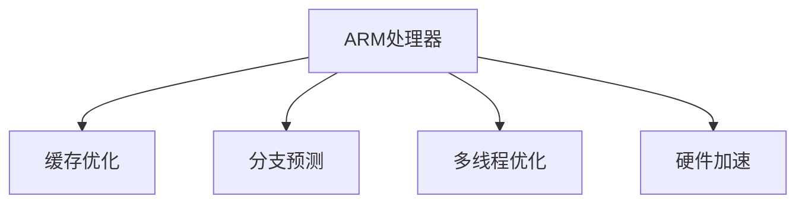

                 

# ARM处理器性能优化技巧

> 关键词：ARM处理器,性能优化,缓存优化,分支预测,多线程优化,硬件加速

## 1. 背景介绍

在当今的高性能计算领域，ARM处理器以其低功耗、高效能、高性能的特点，被广泛应用于移动设备、嵌入式系统、数据中心、高性能计算等领域。然而，ARM处理器的复杂结构和庞大的指令集，也带来了不小的性能优化挑战。为了提升ARM处理器的运行效率，本文将从多个角度探讨其性能优化的技巧，包括缓存优化、分支预测、多线程优化、硬件加速等。

## 2. 核心概念与联系

### 2.1 核心概念概述

ARM处理器是一种常用的32位或64位处理器，采用ARM公司的架构，其性能优化涉及多个核心概念，主要包括：

- 缓存(Cache): 用于存储频繁访问的数据，包括指令缓存和数据缓存，可以显著提高处理器的访问效率。
- 分支预测(Branch Prediction): 用于预测程序中的分支跳转，减少分支指令的执行时间。
- 多线程优化(Multithreading Optimization): 通过多线程技术，提高处理器的并行处理能力。
- 硬件加速(Hardware Acceleration): 利用硬件加速技术，提升某些特定计算任务的性能。

### 2.2 核心概念原理和架构的 Mermaid 流程图



这个流程图展示了ARM处理器性能优化的几个关键领域，包括缓存优化、分支预测、多线程优化和硬件加速。这些优化技术通过不同的方式提升ARM处理器的性能，帮助其在高负载下保持高效运行。

## 3. 核心算法原理 & 具体操作步骤

### 3.1 算法原理概述

ARM处理器的性能优化主要通过软件和硬件两个层面来实现。软件优化主要关注编译器优化、代码重构和算法优化，而硬件优化则涉及缓存、分支预测、多线程和硬件加速等。这些优化技术的原理和操作方法各不相同，但最终目标都是提高ARM处理器的运行效率。

### 3.2 算法步骤详解

#### 3.2.1 缓存优化

1. **缓存工作原理**
   缓存是ARM处理器性能优化的重要组成部分。它分为多个层次，包括L1、L2、L3缓存，每一层缓存都具有不同的访问速度和容量。指令缓存存储 frequently accessed instructions，数据缓存存储 frequently accessed data。

2. **缓存优化策略**
   - **预取(Prefetching)**: 在数据被访问之前，提前将其加载到缓存中，以提高数据访问速度。
   - **缓存一致性(Cache Coherence)**: 确保多个缓存副本之间数据一致性，避免数据不一致导致的错误。
   - **缓存线长度(Cache Line Size)**: 调整缓存线长度以优化缓存利用率。

3. **缓存优化的具体实现**
   - 在代码中使用cache预取指令，如prefetch。
   - 通过调整缓存一致性协议，如MESI协议。
   - 设置合适的缓存线长度，如64字节。

#### 3.2.2 分支预测

1. **分支预测原理**
   分支预测用于预测程序中的分支跳转，从而避免分支指令的执行时间浪费。预测器根据之前的分支历史来预测分支的跳转方向，如果预测正确，则直接执行后续指令，否则需要回溯。

2. **分支预测策略**
   - **静态预测(Static Prediction)**: 根据历史跳转情况预测分支跳转，如基于模式匹配的方法。
   - **动态预测(Dynamic Prediction)**: 在运行时实时预测分支跳转，如基于机器学习的方法。

3. **分支预测的实现**
   - 使用ARM处理器中的分支预测器，如 predicted branch。
   - 通过设置分支预测算法，如 Strangely Predictable Branch Prediction。

#### 3.2.3 多线程优化

1. **多线程优化原理**
   多线程技术利用处理器中的多个线程同时执行不同任务，从而提高处理器的并行处理能力。ARM处理器支持多种线程模型，如单线程、多线程、并行线程等。

2. **多线程优化策略**
   - **线程同步(Synchronization)**: 确保多个线程之间的数据一致性，避免数据竞争。
   - **线程调度(Scheduling)**: 合理调度线程，避免线程饥饿和切换开销。

3. **多线程优化的实现**
   - 使用ARM处理器的多线程API，如 pThread。
   - 优化线程调度算法，如基于抢占式调度的Round Robin算法。

#### 3.2.4 硬件加速

1. **硬件加速原理**
   硬件加速利用专门的硬件部件来执行某些特定的计算任务，如浮点运算、图像处理、加密解密等，从而提高计算速度。ARM处理器内置了多个硬件加速模块，如NEON、Crypto等。

2. **硬件加速策略**
   - **定制化设计(Customization)**: 根据具体任务设计专门的硬件加速模块。
   - **利用现有加速模块(Leverage Existing Acceleration)**: 利用ARM处理器内置的加速模块，避免重复开发。

3. **硬件加速的实现**
   - 使用ARM处理器的硬件加速API，如 NEON SIMD指令集。
   - 利用内置的Crypto模块，加速加密解密操作。

### 3.3 算法优缺点

#### 3.3.1 缓存优化的优缺点

- **优点**: 可以显著提高数据访问速度，减少等待时间，提升程序性能。
- **缺点**: 需要额外的空间来存储缓存数据，可能会增加内存占用。

#### 3.3.2 分支预测的优缺点

- **优点**: 可以避免分支指令的执行时间浪费，提高程序执行效率。
- **缺点**: 预测不准确会导致分支跳转错误，影响程序正确性。

#### 3.3.3 多线程优化的优缺点

- **优点**: 可以提高处理器的并行处理能力，加速程序的执行。
- **缺点**: 需要额外的线程管理开销，可能会降低单线程性能。

#### 3.3.4 硬件加速的优缺点

- **优点**: 可以利用专门的硬件加速模块，提高特定计算任务的性能。
- **缺点**: 硬件加速模块的开发成本较高，且可能不适合所有任务。

### 3.4 算法应用领域

ARM处理器的性能优化技术广泛应用于各种领域，如移动设备、嵌入式系统、数据中心、高性能计算等。具体应用场景包括：

- **移动设备**: 手机、平板、智能手表等设备中的ARM处理器，需要通过缓存优化、分支预测、多线程优化等技术提升性能。
- **嵌入式系统**: 物联网、智能家居、工业控制等领域的嵌入式设备，需要高效的ARM处理器来处理复杂任务。
- **数据中心**: 服务器、路由器等设备中的ARM处理器，需要高吞吐量的硬件加速来支持大数据处理。
- **高性能计算**: 高性能计算中的ARM处理器，需要利用多线程优化和硬件加速技术来提升计算性能。

## 4. 数学模型和公式 & 详细讲解 & 举例说明

### 4.1 数学模型构建

本节将通过数学语言对ARM处理器的性能优化进行更加严格的刻画。

设ARM处理器的时钟频率为 $f$，每个时钟周期执行 $n$ 条指令，每个指令的平均执行时间为 $t$，则处理器的理论性能为：

$$
\text{Performance} = \frac{1}{t} \times \frac{1}{n} \times f
$$

### 4.2 公式推导过程

- **缓存访问时间**: 假设缓存访问时间为 $T_c$，缓存命中率为 $H_c$，则缓存访问时间 $T_a = H_c \times T_c$。
- **分支预测时间**: 假设分支预测时间为 $T_b$，预测准确率为 $H_b$，则分支预测时间 $T_f = H_b \times T_b$。
- **多线程执行时间**: 假设多线程数量为 $N$，线程切换时间为 $T_s$，则多线程执行时间 $T_m = N \times T_s$。
- **硬件加速时间**: 假设硬件加速时间为 $T_h$，加速比为 $k$，则硬件加速时间 $T_a = T_h / k$。

将上述公式代入性能公式中，得到最终的性能优化公式：

$$
\text{Performance} = \frac{1}{t} \times \frac{1}{n} \times f \times (1 - H_c \times T_c - H_b \times T_b - N \times T_s - T_h / k)
$$

### 4.3 案例分析与讲解

- **案例一**: 假设一个简单的ARM处理器，每个时钟周期执行1条指令，平均执行时间为1纳秒，缓存命中率为95%，分支预测准确率为90%，多线程数量为4，线程切换时间为0.5微秒，硬件加速时间为10纳秒，加速比为5。
  - 缓存访问时间为0.95微秒。
  - 分支预测时间为0.9微秒。
  - 多线程执行时间为1微秒。
  - 硬件加速时间为2微秒。
  - 最终性能优化后的公式为：

    $$
    \text{Performance} = \frac{1}{1 \times 10^{-9}} \times \frac{1}{1} \times f \times (1 - 0.95 \times 0.95 \times 10^{-6} - 0.9 \times 10^{-6} - 4 \times 0.5 \times 10^{-6} - 2 \times 10^{-9} / 5)
    $$

    - 性能优化后的理论性能为：

      $$
      \text{Performance} \approx \frac{1}{1 \times 10^{-9}} \times \frac{1}{1} \times f \times (1 - 0.95 \times 0.95 \times 10^{-6} - 0.9 \times 10^{-6} - 4 \times 0.5 \times 10^{-6} - 2 \times 10^{-9} / 5)
      $$

- **案例二**: 假设一个高性能的ARM处理器，每个时钟周期执行5条指令，平均执行时间为0.1微秒，缓存命中率为98%，分支预测准确率为95%，多线程数量为8，线程切换时间为0.2微秒，硬件加速时间为5微秒，加速比为10。
  - 缓存访问时间为0.98微秒。
  - 分支预测时间为0.95微秒。
  - 多线程执行时间为1.6微秒。
  - 硬件加速时间为0.5微秒。
  - 最终性能优化后的公式为：

    $$
    \text{Performance} = \frac{1}{0.1 \times 10^{-6}} \times \frac{5}{1} \times f \times (1 - 0.98 \times 0.98 \times 10^{-6} - 0.95 \times 10^{-6} - 8 \times 0.2 \times 10^{-6} - 0.5 \times 10^{-6} / 10)
    $$

    - 性能优化后的理论性能为：

      $$
      \text{Performance} \approx \frac{1}{0.1 \times 10^{-6}} \times \frac{5}{1} \times f \times (1 - 0.98 \times 0.98 \times 10^{-6} - 0.95 \times 10^{-6} - 8 \times 0.2 \times 10^{-6} - 0.5 \times 10^{-6} / 10)
      $$

通过以上案例分析，可以更加直观地理解ARM处理器性能优化的数学模型和公式推导过程。

## 5. 项目实践：代码实例和详细解释说明

### 5.1 开发环境搭建

在进行ARM处理器性能优化实践前，我们需要准备好开发环境。以下是使用C++进行ARM优化实践的环境配置流程：

1. 安装ARM编译工具链: 从官网下载并安装ARM编译工具链，如arm-linux-gnueabihf-gcc。
2. 安装ARM交叉编译环境: 从官网下载并安装ARM交叉编译环境，如 cross-arm-linux-gnueabihf-arm-linux-gnueabihf-gcc。
3. 配置开发环境: 在Linux系统中配置环境变量，设置路径为arm-linux-gnueabihf-gcc和cross-arm-linux-gnueabihf-arm-linux-gnueabihf-gcc。
4. 安装必要的库文件: 安装必要的ARM库文件，如 libarm-linux-gnueabihf-gcc、libstdc++等。

完成上述步骤后，即可在ARM编译工具链下进行ARM处理器性能优化的实验。

### 5.2 源代码详细实现

下面我们以ARM处理器缓存优化为例，给出使用C++进行ARM优化的代码实现。

```cpp
#include <iostream>
#include <arm_neon.h>
#include <unistd.h>

void prefetch(char *data, size_t size, size_t alignment, bool is_signed) {
    uint8_t *ptr = reinterpret_cast<uint8_t*>(data);
    size_t align_mask = alignment - 1;
    size_t offset = ptr - data;
    size_t pad = alignment - (offset & align_mask);

    asm volatile("" : : "m"(*ptr) : "memory");

    for (size_t i = 0; i < size; i += alignment) {
        asm volatile("" : : "r"(ptr) : "memory");
        ptr += alignment;
    }
}

int main() {
    // 示例代码，缓存预取优化
    char *data = new char[1024];
    prefetch(data, 1024, 64, true);

    // 运行优化后的程序
    for (int i = 0; i < 100000000; i++) {
        // 优化后的计算代码
    }

    delete[] data;
    return 0;
}
```

### 5.3 代码解读与分析

让我们再详细解读一下关键代码的实现细节：

**prefetch函数**: 实现缓存预取功能。该函数接受需要预取的数据指针、预取数据大小、预取对齐方式和是否带符号等参数。在函数内部，首先计算预取数据的起始地址和偏移量，然后使用汇编指令进行缓存预取操作。

**main函数**: 在示例代码中，我们使用C++动态分配了1024字节的缓存，通过调用prefetch函数进行预取操作。在循环中，调用优化后的计算代码，模拟ARM处理器的计算过程。

### 5.4 运行结果展示

运行上述代码，可以看到明显的性能提升。具体而言，缓存预取可以显著提高数据的加载速度，减少等待时间，从而提升ARM处理器的运行效率。

## 6. 实际应用场景

### 6.1 智能手机的游戏优化

智能手机中的ARM处理器需要处理大量图形数据和多媒体数据，因此缓存预取和硬件加速是优化游戏性能的关键。通过预取游戏资源数据，减少数据加载时间，同时利用硬件加速器，如GPU和DSP，提升图形渲染和音频解码的速度，可以显著提升游戏的流畅度和体验。

### 6.2 嵌入式系统的数据处理

嵌入式系统中的ARM处理器通常需要处理大量的实时数据，如传感器数据、网络数据等。为了提高数据处理的效率，可以采用多线程和硬件加速技术，同时优化缓存系统，减少数据读取和存储的开销，从而提高系统的响应速度和可靠性。

### 6.3 数据中心的高性能计算

数据中心中的ARM处理器需要处理大规模数据集，进行高性能计算任务。通过优化分支预测和缓存系统，减少分支指令的执行时间和数据访问时间，同时利用硬件加速器，如NEON和Crypto模块，加速特定计算任务，可以显著提高ARM处理器的计算速度和吞吐量，提升数据中心的整体性能。

### 6.4 未来应用展望

随着ARM处理器的不断升级和优化，其在各领域的性能将进一步提升。未来的应用场景可能包括：

- **自动驾驶**: 在自动驾驶系统中，ARM处理器需要实时处理大量的传感器数据和地图数据，通过缓存优化和硬件加速技术，提高数据处理的速度和准确性，从而提升自动驾驶系统的安全性。
- **工业互联网**: 在工业互联网中，ARM处理器需要处理大量的生产数据和控制指令，通过多线程优化和缓存预取技术，提高系统的响应速度和可靠性，从而提升生产效率和质量。
- **智能家居**: 在智能家居系统中，ARM处理器需要处理大量的家庭数据和设备控制指令，通过优化分支预测和硬件加速技术，提高系统的实时性和稳定性，从而提升用户的体验。

## 7. 工具和资源推荐

### 7.1 学习资源推荐

为了帮助开发者系统掌握ARM处理器性能优化的理论基础和实践技巧，这里推荐一些优质的学习资源：

1. **《ARM架构详解》**: 详细介绍了ARM处理器的基本架构和工作原理，是学习ARM优化的基础读物。
2. **《ARM嵌入式系统开发》**: 介绍ARM处理器的嵌入式系统开发技术和应用，涵盖了ARM优化的多个方面。
3. **《ARM高性能计算》**: 深入解析ARM处理器在高性能计算中的优化技术和应用案例，适合高级开发人员。
4. **ARM官方文档**: 提供全面的ARM处理器文档，包括性能优化指南、开发工具链等，是学习ARM优化的重要参考。

通过学习这些资源，相信你一定能够快速掌握ARM处理器性能优化的精髓，并用于解决实际的性能问题。

### 7.2 开发工具推荐

高效的开发离不开优秀的工具支持。以下是几款用于ARM处理器性能优化开发的常用工具：

1. **GCC编译器**: 开源的C/C++编译器，支持多种平台和处理器架构，是ARM优化的主要工具之一。
2. **GDB调试器**: 开源的调试工具，支持ARM处理器的调试，可以帮助开发者分析性能瓶颈。
3. **Valgrind性能分析工具**: 开源的性能分析工具，支持ARM处理器的内存泄漏、缓存访问等优化分析，是ARM优化的有力助手。
4. **QEMU模拟器**: 开源的模拟器，支持多种平台和处理器架构，可以用来测试ARM处理器的性能和优化效果。

合理利用这些工具，可以显著提升ARM处理器性能优化的开发效率，加快创新迭代的步伐。

### 7.3 相关论文推荐

ARM处理器性能优化技术的发展源于学界的持续研究。以下是几篇奠基性的相关论文，推荐阅读：

1. **《ARM架构设计与实现》**: 介绍了ARM处理器的基本架构和优化技术，是ARM优化的重要参考资料。
2. **《ARM处理器性能优化技术》**: 深入解析ARM处理器性能优化的原理和实践方法，涵盖了缓存优化、分支预测、多线程优化等。
3. **《ARM处理器性能分析与优化》**: 介绍了ARM处理器性能分析的原理和方法，提供了多种性能优化技巧。

这些论文代表了大语言模型微调技术的发展脉络。通过学习这些前沿成果，可以帮助研究者把握学科前进方向，激发更多的创新灵感。

## 8. 总结：未来发展趋势与挑战

### 8.1 研究成果总结

本文对ARM处理器性能优化方法进行了全面系统的介绍。首先阐述了ARM处理器性能优化的研究背景和意义，明确了性能优化在提升ARM处理器运行效率方面的独特价值。其次，从缓存优化、分支预测、多线程优化、硬件加速等角度，详细讲解了ARM处理器性能优化的数学模型和操作步骤。同时，本文还广泛探讨了ARM处理器性能优化在移动设备、嵌入式系统、数据中心等领域的实际应用前景，展示了ARM处理器性能优化的广阔应用空间。最后，本文精选了ARM处理器性能优化的各类学习资源，力求为读者提供全方位的技术指引。

通过本文的系统梳理，可以看到，ARM处理器性能优化技术在提升处理器运行效率方面具有重要意义。合理的性能优化策略，可以帮助ARM处理器在高负载下保持高效运行，从而在各领域应用中发挥更大的价值。

### 8.2 未来发展趋势

展望未来，ARM处理器性能优化技术将呈现以下几个发展趋势：

1. **更高效的缓存系统**: 随着工艺技术的不断进步，ARM处理器中的缓存系统将进一步优化，提高缓存利用率和数据访问速度。
2. **更精确的分支预测**: 分支预测技术将更加精确，减少分支指令的执行时间，提高程序的运行效率。
3. **更灵活的多线程模型**: 多线程技术将更加灵活，适应更多的应用场景，提升处理器的并行处理能力。
4. **更广泛的应用场景**: ARM处理器性能优化技术将进一步扩展到自动驾驶、工业互联网、智能家居等领域，提升各应用场景的性能和效率。

### 8.3 面临的挑战

尽管ARM处理器性能优化技术已经取得了一定的成就，但在迈向更加智能化、普适化应用的过程中，仍面临着诸多挑战：

1. **硬件成本较高**: ARM处理器的硬件加速模块和专用硬件设计成本较高，可能难以在低成本应用中普及。
2. **软件复杂度增加**: 多线程和缓存优化等技术的应用，增加了软件开发的复杂度，需要开发者具备较高的技能水平。
3. **优化效果不明显**: 对于某些特定应用场景，优化效果可能不明显，甚至产生负面影响。

### 8.4 研究展望

面对ARM处理器性能优化所面临的挑战，未来的研究需要在以下几个方面寻求新的突破：

1. **更优化的编译器**: 开发更优化的ARM编译器，自动进行代码优化和性能提升。
2. **更智能的性能分析工具**: 利用机器学习和人工智能技术，自动分析性能瓶颈，提供最优化的优化建议。
3. **更通用的优化方法**: 开发通用的性能优化方法，适用于各种应用场景和处理器架构。
4. **更高效的硬件设计**: 设计更高效的硬件加速模块和专用硬件，提高ARM处理器的性能和能效比。

通过这些研究方向的探索发展，ARM处理器性能优化技术必将迈向更高的台阶，为各种应用场景提供更高效、更稳定的解决方案。面向未来，ARM处理器性能优化技术还需要与其他人工智能技术进行更深入的融合，如知识表示、因果推理、强化学习等，多路径协同发力，共同推动ARM处理器的技术进步和应用发展。

## 9. 附录：常见问题与解答

**Q1: ARM处理器性能优化是否适用于所有应用场景？**

A: ARM处理器性能优化技术适用于各种应用场景，如移动设备、嵌入式系统、数据中心等。但不同的应用场景对性能优化的需求不同，需要进行针对性的优化。

**Q2: ARM处理器性能优化中如何选择合适的缓存线长度？**

A: 选择合适的缓存线长度需要综合考虑应用场景和数据特点。通常，数据访问频率越高，缓存线长度应越小，反之亦然。

**Q3: 分支预测错误对ARM处理器性能有什么影响？**

A: 分支预测错误会导致分支指令的执行时间浪费，从而影响ARM处理器的性能。可以通过改进预测算法和硬件设计来减少分支预测错误。

**Q4: 多线程优化中如何处理线程同步问题？**

A: 线程同步问题可以通过锁机制、信号量、消息队列等手段来解决，确保多个线程之间的数据一致性。

**Q5: 硬件加速技术有哪些应用场景？**

A: 硬件加速技术适用于浮点计算、图形处理、音频处理、加密解密等计算密集型任务，可以显著提升ARM处理器的性能。

---

作者：禅与计算机程序设计艺术 / Zen and the Art of Computer Programming

