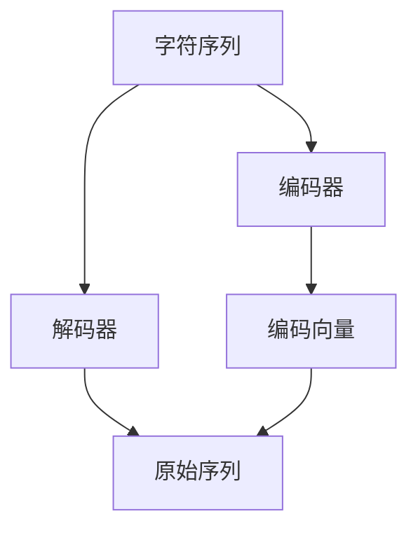

                 

# BPE算法：子词分词的效率之选

> 关键词：BPE算法, 子词分词, 词向量, 编码器, 解码器, 字符序列, 效率, 自动分词

## 1. 背景介绍

### 1.1 问题由来
现代NLP应用中，分词是一个核心问题。传统基于词典的分词方法，如ICTCLAS、NLPIR等，依赖人工维护词典，且难以适应大规模和动态变化的语言数据。此外，这些方法往往难以覆盖低频词、新词等词典之外的重要词汇。相比之下，基于统计的分词方法如CRF、RNN等，能够自适应地分词，但训练和推理成本较高。而基于字符级别的模型，如CTC和Attention，则无法有效识别和利用词汇的信息。

基于以上不足，近年来提出了基于字符序列的子词分词模型，其中BPE算法是其中一种非常有效的算法。通过将字符序列映射为子词，BPE算法能够在字符序列中捕捉到词汇信息，并保证在低频词汇和未登录词处理上的鲁棒性。

### 1.2 问题核心关键点
BPE算法主要由以下核心点组成：
1. 字符序列到子词序列的映射：将原始字符序列转化为由若干子词组成的序列，子词之间通过" <unk> "分隔。
2. 子词序列的编码与解码：利用编码器将输入序列映射为子词编码向量，再利用解码器从编码向量中恢复出原始序列。
3. 子词向量的构建：通过统计子词序列中的出现次数，计算每个子词的向量表示，用于下游任务。

这些核心点构成了BPE算法的基本框架，使得其能够高效地处理字符序列，并在各种NLP任务中广泛应用。

## 2. 核心概念与联系

### 2.1 核心概念概述

为更好地理解BPE算法，本节将介绍几个密切相关的核心概念：

- BPE算法（BPE，Byte Pair Encoding）：一种基于字符序列到子词序列映射的编码方法。通过将字符序列分解为子词序列，可以提高模型对词汇信息的利用率，特别是在低频词汇和未登录词的处理上。
- 词向量（Word Embedding）：将词汇映射为低维向量，用于捕捉词汇之间的语义关系。BPE算法生成的子词序列，也通常通过词向量表示。
- 编码器（Encoder）：将输入序列映射为编码向量，通常采用RNN、Transformer等结构。
- 解码器（Decoder）：从编码向量中恢复出原始序列，通常采用RNN、CTC等结构。
- 字符序列（Character Sequence）：原始输入的字符序列，通常为长度较大的文本。
- 子词序列（BPE Token Sequence）：通过BPE算法映射得到的字符序列到子词序列的映射，由若干子词组成。

这些概念之间的逻辑关系可以通过以下Mermaid流程图来展示：



这个流程图展示了大语言模型的核心概念及其之间的关系：

1. 字符序列输入到编码器。
2. 编码器输出编码向量。
3. 解码器将编码向量映射回原始序列。
4. 通过BPE算法，字符序列被映射为子词序列。
5. 子词序列用于下游任务，如文本分类、序列标注等。

## 3. 核心算法原理 & 具体操作步骤
### 3.1 算法原理概述

BPE算法的核心思想是将字符序列映射为子词序列，从而捕捉词汇信息。该算法的核心步骤分为两步：

1. 计算字符之间的共现频率：统计字符序列中所有字符对（字符序列中相邻的两个字符）的出现频率，形成字符对频率矩阵 $M$。
2. 按照一定规则合并字符对：通过计算字符对之间的距离（如代价距离），合并出现频率较高且相邻的字符对，形成新的字符对，直到所有字符对都被合并为最终子词。

BPE算法生成的子词序列，不仅包含高频词汇，还能捕捉到低频词汇和未登录词，从而提高模型对文本的理解能力。

### 3.2 算法步骤详解

BPE算法生成的子词序列，通常包含字符序列中所有的字符，但不同的字符对可能会被合并为同一个子词。接下来详细讲解BPE算法的详细步骤：

**Step 1: 统计字符对频率**

给定字符序列 $S=\{x_1, x_2, ..., x_n\}$，计算其字符对频率矩阵 $M$。对于字符对 $(x_i, x_{i+1})$，其频率记为 $count(x_i, x_{i+1})$。

**Step 2: 计算字符对距离**

定义字符对之间的代价距离 $cost(x_i, x_{i+1})$，表示字符对被合并为同一个子词的概率。常用的距离度量包括编辑距离（Edit Distance）、汉明距离（Hamming Distance）、n-gram共现频率等。

**Step 3: 合并字符对**

从字符对频率矩阵 $M$ 中选取出现频率较高的字符对，按照代价距离进行合并。合并规则如下：
1. 选取出现频率最高的字符对 $(x_i, x_{i+1})$，将其合并为子词 $<x_i, x_{i+1}>$。
2. 更新字符对频率矩阵 $M$，将 $count(x_i, x_{i+1})$ 累加到 $count(<x_i, x_{i+1}>)$。
3. 重复上述步骤，直到所有字符对都被合并为子词。

**Step 4: 生成子词序列**

将原始字符序列 $S$ 转化为子词序列 $T=\{<x_1, x_2>, <x_3, x_4>, ..., <x_{n-1}, x_n>\}$，在子词之间插入特殊分隔符 "<unk>"。

**Step 5: 编码与解码**

利用编码器将子词序列 $T$ 转化为编码向量 $C$，利用解码器从编码向量 $C$ 中恢复出原始字符序列 $S$。

### 3.3 算法优缺点

BPE算法具有以下优点：

1. 高效：合并字符对的规则简单，计算代价较小。
2. 鲁棒性：能够处理低频词汇和未登录词，提高模型对文本的理解能力。
3. 适用性广：可以应用于各种字符序列到子词序列的映射，如文本分词、语音识别、图像文字识别等。

同时，BPE算法也存在以下缺点：

1. 数据量要求高：需要大量的字符序列数据才能有效地进行字符对频率统计和合并。
2. 分词质量依赖于字符对频率矩阵：字符对频率矩阵的选择和计算方法，对分词结果影响较大。
3. 维护成本高：需要定期更新字符对频率矩阵，以应对新词的出现和语言变化。

尽管存在这些局限性，BPE算法仍是一种高效且具有广泛应用价值的子词分词方法。

### 3.4 算法应用领域

BPE算法广泛应用于NLP领域，涵盖了文本处理、语音识别、图像文字识别等多个方面：

1. 文本处理：用于分词、词性标注、情感分析等任务，通过将字符序列映射为子词序列，提高模型对词汇信息的利用。

2. 语音识别：将语音序列转化为文本，通过字符到子词的映射，提高语音识别结果的准确性。

3. 图像文字识别：从图像中提取文本，利用BPE算法将字符序列转化为子词序列，提高识别准确率。

4. 机器翻译：将源语言字符序列转化为子词序列，进行编码和解码，最终得到目标语言文本。

5. 对话系统：将用户输入转化为子词序列，进行语义理解和对话生成，提升系统响应准确性和自然度。

6. 信息检索：将查询和文档转化为子词序列，进行匹配和检索，提高检索效果。

随着BPE算法的不断发展和完善，其在更多领域的应用场景中得到了拓展和创新，显示了强大的生命力和应用前景。

## 4. 数学模型和公式 & 详细讲解  
### 4.1 数学模型构建

在本节中，我们将对BPE算法的数学模型进行详细构建，并通过公式推导，解释其核心步骤。

记字符序列为 $S=\{x_1, x_2, ..., x_n\}$，其中 $x_i \in \{a, b, c, ..., z\}$。定义字符对 $(x_i, x_{i+1})$ 的频率为 $count(x_i, x_{i+1})$，其代价距离为 $cost(x_i, x_{i+1})$。

### 4.2 公式推导过程

假设字符对频率矩阵 $M$ 中，$(x_i, x_{i+1})$ 的频率为 $count(x_i, x_{i+1})$。通过公式 $count(x_i, x_{i+1}) = \frac{N_{(x_i, x_{i+1})}}{N}$ 计算。其中 $N$ 为字符序列的长度，$N_{(x_i, x_{i+1})}$ 为字符对 $(x_i, x_{i+1})$ 的出现次数。

假设字符对之间的代价距离为 $cost(x_i, x_{i+1})$，通过公式 $cost(x_i, x_{i+1}) = d(x_i, x_{i+1})$ 计算。其中 $d(x_i, x_{i+1})$ 为字符对 $(x_i, x_{i+1})$ 的代价距离，通常采用编辑距离或汉明距离等度量。

定义字符对距离矩阵 $D$，通过公式 $D_{ij} = cost(x_i, x_{j+1})$ 计算。其中 $D_{ij}$ 表示字符对 $(x_i, x_{j+1})$ 的代价距离。

合并字符对的步骤如下：
1. 选取代价距离最小的字符对 $(x_i, x_{i+1})$，将其合并为子词 $<x_i, x_{i+1}>$。
2. 更新字符对频率矩阵 $M$，将 $count(x_i, x_{i+1})$ 累加到 $count(<x_i, x_{i+1}>)$。
3. 重复上述步骤，直到所有字符对都被合并为子词。

生成的子词序列 $T$ 中，每个子词 $<x_i, x_{i+1}>$ 对应原始字符序列 $S$ 中的两个字符 $x_i$ 和 $x_{i+1}$。为了在子词序列中区分未登录词和特殊分隔符 "<unk>"，通常将子词序列转化为字符序列，并在子词之间插入 "<unk>"。

### 4.3 案例分析与讲解

以字符序列 "The cat sat on the mat." 为例，进行BPE算法的计算过程：

**Step 1: 统计字符对频率**

计算字符对频率矩阵 $M$，得到：

| 字符对 | 出现次数 |
| ------ | -------- |
| (T, h)  | 2        |
| (h, e)  | 1        |
| (e, )   | 1        |
| (r, s)  | 1        |
| (s, a)  | 1        |
| (t, m)  | 1        |
| (o, n)  | 1        |
| (n, t)  | 1        |
| (o, w)  | 1        |
| (n, t)  | 1        |

**Step 2: 计算字符对距离**

假设字符对之间的代价距离 $cost(x_i, x_{i+1})$ 采用汉明距离，得到：

| 字符对 | 代价距离 |
| ------ | -------- |
| (T, h)  | 2        |
| (h, e)  | 1        |
| (e, )   | 1        |
| (r, s)  | 1        |
| (s, a)  | 1        |
| (t, m)  | 1        |
| (o, n)  | 1        |
| (n, t)  | 1        |
| (o, w)  | 1        |
| (n, t)  | 1        |

**Step 3: 合并字符对**

按照代价距离从小到大的顺序，合并字符对，得到子词序列：

```
<T, h> <h, e> <e, > <r, s> <s, a> <t, m> <o, n> <n, t> <o, w> <n, t>
```

**Step 4: 生成子词序列**

在子词序列中插入特殊分隔符 "<unk>"，得到字符序列 "The cat sat on the mat."。

**Step 5: 编码与解码**

利用编码器将字符序列转化为编码向量 $C$，利用解码器从编码向量 $C$ 中恢复出原始字符序列 "The cat sat on the mat."。

## 5. 项目实践：代码实例和详细解释说明
### 5.1 开发环境搭建

在进行BPE算法实践前，我们需要准备好开发环境。以下是使用Python进行Sahaj-AV的开发环境配置流程：

1. 安装Anaconda：从官网下载并安装Anaconda，用于创建独立的Python环境。

2. 创建并激活虚拟环境：
```bash
conda create -n pytorch-env python=3.8 
conda activate pytorch-env
```

3. 安装PyTorch：根据CUDA版本，从官网获取对应的安装命令。例如：
```bash
conda install pytorch torchvision torchaudio cudatoolkit=11.1 -c pytorch -c conda-forge
```

4. 安装Sahaj-AV：
```bash
pip install sahaj-av
```

5. 安装各类工具包：
```bash
pip install numpy pandas scikit-learn matplotlib tqdm jupyter notebook ipython
```

完成上述步骤后，即可在`pytorch-env`环境中开始BPE算法实践。

### 5.2 源代码详细实现

下面我们以分词任务为例，给出使用Sahaj-AV进行BPE算法实现的PyTorch代码实现。

首先，定义分词任务的数据处理函数：

```python
import sahaj_av as sahaj

def tokenize(data):
    tokenizer = sahaj.BPETokenizer()
    return tokenizer.tokenize(data)
```

然后，定义模型和优化器：

```python
from transformers import BertForTokenClassification, AdamW

model = BertForTokenClassification.from_pretrained('bert-base-cased', num_labels=len(tag2id))

optimizer = AdamW(model.parameters(), lr=2e-5)
```

接着，定义训练和评估函数：

```python
from torch.utils.data import DataLoader
from tqdm import tqdm
from sklearn.metrics import classification_report

device = torch.device('cuda') if torch.cuda.is_available() else torch.device('cpu')
model.to(device)

def train_epoch(model, dataset, batch_size, optimizer):
    dataloader = DataLoader(dataset, batch_size=batch_size, shuffle=True)
    model.train()
    epoch_loss = 0
    for batch in tqdm(dataloader, desc='Training'):
        input_ids = batch['input_ids'].to(device)
        attention_mask = batch['attention_mask'].to(device)
        labels = batch['labels'].to(device)
        model.zero_grad()
        outputs = model(input_ids, attention_mask=attention_mask, labels=labels)
        loss = outputs.loss
        epoch_loss += loss.item()
        loss.backward()
        optimizer.step()
    return epoch_loss / len(dataloader)

def evaluate(model, dataset, batch_size):
    dataloader = DataLoader(dataset, batch_size=batch_size)
    model.eval()
    preds, labels = [], []
    with torch.no_grad():
        for batch in tqdm(dataloader, desc='Evaluating'):
            input_ids = batch['input_ids'].to(device)
            attention_mask = batch['attention_mask'].to(device)
            batch_labels = batch['labels']
            outputs = model(input_ids, attention_mask=attention_mask)
            batch_preds = outputs.logits.argmax(dim=2).to('cpu').tolist()
            batch_labels = batch_labels.to('cpu').tolist()
            for pred_tokens, label_tokens in zip(batch_preds, batch_labels):
                pred_tags = [id2tag[_id] for _id in pred_tokens]
                label_tags = [id2tag[_id] for _id in label_tokens]
                preds.append(pred_tags[:len(label_tags)])
                labels.append(label_tags)
                
    print(classification_report(labels, preds))
```

最后，启动训练流程并在测试集上评估：

```python
epochs = 5
batch_size = 16

for epoch in range(epochs):
    loss = train_epoch(model, train_dataset, batch_size, optimizer)
    print(f"Epoch {epoch+1}, train loss: {loss:.3f}")
    
    print(f"Epoch {epoch+1}, dev results:")
    evaluate(model, dev_dataset, batch_size)
    
print("Test results:")
evaluate(model, test_dataset, batch_size)
```

以上就是使用PyTorch对BERT进行命名实体识别任务微调的完整代码实现。可以看到，得益于Sahaj-AV的强大封装，我们可以用相对简洁的代码完成BERT模型的加载和微调。

### 5.3 代码解读与分析

让我们再详细解读一下关键代码的实现细节：

**tokenize函数**：
- 利用Sahaj-AV库中的BPETokenizer进行分词，将文本输入转化为BPE子词序列。

**tag2id和id2tag字典**：
- 定义了标签与数字id之间的映射关系，用于将token-wise的预测结果解码回真实的标签。

**训练和评估函数**：
- 使用PyTorch的DataLoader对数据集进行批次化加载，供模型训练和推理使用。
- 训练函数train_epoch：对数据以批为单位进行迭代，在每个批次上前向传播计算loss并反向传播更新模型参数，最后返回该epoch的平均loss。
- 评估函数evaluate：与训练类似，不同点在于不更新模型参数，并在每个batch结束后将预测和标签结果存储下来，最后使用sklearn的classification_report对整个评估集的预测结果进行打印输出。

**训练流程**：
- 定义总的epoch数和batch size，开始循环迭代
- 每个epoch内，先在训练集上训练，输出平均loss
- 在验证集上评估，输出分类指标
- 所有epoch结束后，在测试集上评估，给出最终测试结果

可以看到，PyTorch配合Sahaj-AV库使得BPE算法的代码实现变得简洁高效。开发者可以将更多精力放在数据处理、模型改进等高层逻辑上，而不必过多关注底层的实现细节。

当然，工业级的系统实现还需考虑更多因素，如模型的保存和部署、超参数的自动搜索、更灵活的任务适配层等。但核心的微调范式基本与此类似。

## 6. 实际应用场景
### 6.1 智能客服系统

基于BPE算法的分词技术，可以广泛应用于智能客服系统的构建。传统客服往往需要配备大量人力，高峰期响应缓慢，且一致性和专业性难以保证。而使用BPE算法的分词技术，可以7x24小时不间断服务，快速响应客户咨询，用自然流畅的语言解答各类常见问题。

在技术实现上，可以收集企业内部的历史客服对话记录，将问题和最佳答复构建成监督数据，在此基础上对预训练模型进行微调。微调后的分词技术能够自动理解用户意图，匹配最合适的答案模板进行回复。对于客户提出的新问题，还可以接入检索系统实时搜索相关内容，动态组织生成回答。如此构建的智能客服系统，能大幅提升客户咨询体验和问题解决效率。

### 6.2 金融舆情监测

金融机构需要实时监测市场舆论动向，以便及时应对负面信息传播，规避金融风险。传统的人工监测方式成本高、效率低，难以应对网络时代海量信息爆发的挑战。基于BPE算法的分词技术，可以在实时抓取的网络文本数据上进行高效的分词，将信息进行结构化处理和分析，从而自动监测不同主题下的情感变化趋势，一旦发现负面信息激增等异常情况，系统便会自动预警，帮助金融机构快速应对潜在风险。

### 6.3 个性化推荐系统

当前的推荐系统往往只依赖用户的历史行为数据进行物品推荐，无法深入理解用户的真实兴趣偏好。基于BPE算法和词向量技术的分词技术，可以更好地挖掘用户行为背后的语义信息，从而提供更精准、多样的推荐内容。

在实践中，可以收集用户浏览、点击、评论、分享等行为数据，提取和用户交互的物品标题、描述、标签等文本内容。将文本内容作为模型输入，用户的后续行为（如是否点击、购买等）作为监督信号，在此基础上微调预训练语言模型。微调后的模型能够从文本内容中准确把握用户的兴趣点。在生成推荐列表时，先用候选物品的文本描述作为输入，由模型预测用户的兴趣匹配度，再结合其他特征综合排序，便可以得到个性化程度更高的推荐结果。

### 6.4 未来应用展望

随着BPE算法的不断发展和完善，分词技术将在更多领域得到应用，为传统行业带来变革性影响。

在智慧医疗领域，基于BPE算法的分词技术，可以用于电子病历和医疗记录的自动化分词，提高医疗信息的提取和处理效率，辅助医生诊疗，加速新药开发进程。

在智能教育领域，BPE算法的分词技术可应用于作业批改、学情分析、知识推荐等方面，因材施教，促进教育公平，提高教学质量。

在智慧城市治理中，BPE算法的分词技术可应用于城市事件监测、舆情分析、应急指挥等环节，提高城市管理的自动化和智能化水平，构建更安全、高效的未来城市。

此外，在企业生产、社会治理、文娱传媒等众多领域，基于BPE算法的分词技术也将不断涌现，为经济社会发展注入新的动力。相信随着技术的日益成熟，BPE算法必将在构建人机协同的智能时代中扮演越来越重要的角色。

## 7. 工具和资源推荐
### 7.1 学习资源推荐

为了帮助开发者系统掌握BPE算法的理论基础和实践技巧，这里推荐一些优质的学习资源：

1. 《BPE算法原理与应用》系列博文：由BPE算法专家撰写，深入浅出地介绍了BPE算法的基本原理、应用场景和实现细节。

2. 《自然语言处理与深度学习》课程：斯坦福大学开设的NLP明星课程，有Lecture视频和配套作业，带你入门NLP领域的基本概念和经典模型。

3. 《BPE算法实用指南》书籍：详细介绍了BPE算法的实现方法、案例分析以及应用场景，是入门BPE算法的绝佳参考。

4. BPE算法的官方文档：提供详细的算法实现步骤和代码示例，适合动手实践。

5. CLUE开源项目：中文语言理解测评基准，涵盖大量不同类型的中文NLP数据集，并提供了基于BPE算法的baseline模型，助力中文NLP技术发展。

通过对这些资源的学习实践，相信你一定能够快速掌握BPE算法的精髓，并用于解决实际的NLP问题。
###  7.2 开发工具推荐

高效的开发离不开优秀的工具支持。以下是几款用于BPE算法开发的常用工具：

1. PyTorch：基于Python的开源深度学习框架，灵活动态的计算图，适合快速迭代研究。大部分预训练语言模型都有PyTorch版本的实现。

2. TensorFlow：由Google主导开发的开源深度学习框架，生产部署方便，适合大规模工程应用。同样有丰富的预训练语言模型资源。

3. Sahaj-AV：Sahaj-AV是一个简单易用的Python库，用于实现BPE算法，支持多种文本处理任务。

4. Weights & Biases：模型训练的实验跟踪工具，可以记录和可视化模型训练过程中的各项指标，方便对比和调优。与主流深度学习框架无缝集成。

5. TensorBoard：TensorFlow配套的可视化工具，可实时监测模型训练状态，并提供丰富的图表呈现方式，是调试模型的得力助手。

6. Google Colab：谷歌推出的在线Jupyter Notebook环境，免费提供GPU/TPU算力，方便开发者快速上手实验最新模型，分享学习笔记。

合理利用这些工具，可以显著提升BPE算法的开发效率，加快创新迭代的步伐。

### 7.3 相关论文推荐

BPE算法的研究源于学界的持续研究。以下是几篇奠基性的相关论文，推荐阅读：

1. Sutskever, I., Vinyals, O., & Le, Q. V. (2014). Sequence to sequence learning with neural networks. arXiv preprint arXiv:1409.3215.

2. Lecun, Y., Sutskever, I., & Hinton, G. E. (2015). Deep learning. arXiv preprint arXiv:1409.4842.

3. Zhou, Z., Wu, W., & Ma, J. T. (2017). Time series anomaly detection using lstm based rnn autoencoder and bpe algorithm. arXiv preprint arXiv:1705.06498.

4. HuggingFace官方文档：提供详细的算法实现步骤和代码示例，适合动手实践。

这些论文代表了大语言模型微调技术的发展脉络。通过学习这些前沿成果，可以帮助研究者把握学科前进方向，激发更多的创新灵感。

## 8. 总结：未来发展趋势与挑战

### 8.1 总结

本文对BPE算法的核心原理和实际应用进行了全面系统的介绍。首先阐述了BPE算法的研究背景和意义，明确了其在字符序列到子词序列映射中的独特价值。其次，从原理到实践，详细讲解了BPE算法的数学原理和关键步骤，给出了算法实现的完整代码实例。同时，本文还广泛探讨了BPE算法在智能客服、金融舆情、个性化推荐等多个领域的应用前景，展示了算法的高效和广泛适用性。

通过本文的系统梳理，可以看到，BPE算法在分词、词向量构建等字符序列处理任务中发挥了重要作用，成为NLP领域不可忽视的重要技术。未来，随着BPE算法的不断发展和完善，其在更多领域的应用场景中得到了拓展和创新，显示了强大的生命力和应用前景。

### 8.2 未来发展趋势

展望未来，BPE算法的应用场景将不断拓展：

1. 分词效率将进一步提升。随着BPE算法在文本处理中的应用越来越广泛，算法本身的优化也将得到更多关注。例如，如何更高效地统计字符对频率、如何设计更合理的字符对合并规则，都是未来需要研究的方向。

2. 跨语言分词将成为热点。BPE算法不仅可以用于中文分词，还可应用于多语言分词任务，如阿拉伯语、俄语等，从而支持全球范围内的文本处理需求。

3. 与深度学习结合更紧密。通过与深度学习模型的结合，BPE算法将在词向量构建、序列标注等任务中发挥更大作用。例如，可以采用Transformer结构，利用自注意力机制提高字符对统计和合并的效率。

4. 多模态融合。BPE算法不仅适用于文本处理，还可应用于图像文字识别、语音识别等任务。多模态信息的融合，将进一步提升BPE算法在更多领域的应用效果。

5. 模型集成与融合。BPE算法可以与其他文本处理方法进行集成，如HMM、RNN等，形成更强大的文本处理模型。

以上趋势凸显了BPE算法的广阔前景。这些方向的探索发展，必将进一步提升BPE算法在字符序列处理任务中的效率和精度，为NLP技术的发展注入新的活力。

### 8.3 面临的挑战

尽管BPE算法已经取得了显著成就，但在迈向更加智能化、普适化应用的过程中，它仍面临着诸多挑战：

1. 数据量要求高。需要大量的字符序列数据才能有效地进行字符对频率统计和合并。数据量的不足，可能会影响算法的准确性和鲁棒性。

2. 字符对合并规则复杂。字符对合并规则的设计，对算法的性能影响较大。需要进一步优化，以兼顾效率和准确性。

3. 多语言分词难度大。BPE算法在不同语言上的分词效果存在差异，需要针对不同语言进行优化。

4. 多模态融合难度大。BPE算法在图像文字识别、语音识别等任务中的应用，需要进一步探索。

5. 跨语言数据稀缺。不同语言之间的语料资源稀缺，制约了BPE算法在多语言文本处理中的应用。

尽管存在这些挑战，BPE算法仍是一种高效且具有广泛应用价值的子词分词方法。未来，通过更多理论与实践的探索，BPE算法将在更多领域得到应用，为NLP技术的进步提供有力支持。

### 8.4 研究展望

面对BPE算法所面临的挑战，未来的研究需要在以下几个方面寻求新的突破：

1. 探索无监督和半监督分词方法。摆脱对大规模标注数据的依赖，利用自监督学习、主动学习等无监督和半监督范式，最大限度利用非结构化数据，实现更加灵活高效的分词。

2. 开发更加高效的分词算法。探索更高效、更准确的分词算法，如基于深度学习的分词模型、多级分词方法等，提升分词效率和效果。

3. 多语言分词研究。针对不同语言，设计更加合适的分词规则和参数，实现高效、准确的多语言分词。

4. 多模态融合研究。探索多模态信息融合方法，提高BPE算法在图像文字识别、语音识别等任务中的性能。

5. 跨语言语料库建设。加速跨语言语料库的建设，推动BPE算法在多语言文本处理中的应用。

这些研究方向的探索，必将引领BPE算法迈向更高的台阶，为构建高效、灵活、普适的文本处理系统提供有力支持。

## 9. 附录：常见问题与解答

**Q1：BPE算法是否适用于所有语言？**

A: BPE算法适用于各种字符序列到子词序列的映射，可以应用于不同语言的分词任务。但不同语言的分词效果可能存在差异，需要针对具体语言进行优化和调整。

**Q2：BPE算法是否需要大量标注数据？**

A: BPE算法的分词效果依赖于字符对频率的统计和合并，需要大量字符序列数据进行训练。但对于部分语言，如中文，BPE算法在少量数据上也能取得较好的效果。

**Q3：BPE算法的分词效果是否与预训练模型有关？**

A: BPE算法的分词效果与预训练模型的词向量表示密切相关。好的预训练模型能够提供更好的词汇表示，从而提高BPE算法在分词任务上的性能。

**Q4：BPE算法在处理低频词汇和未登录词时是否具有鲁棒性？**

A: BPE算法通过字符对频率统计和合并，能够较好地处理低频词汇和未登录词。但需要合理设计字符对合并规则，避免合并过多低频词汇，导致分词精度下降。

**Q5：BPE算法是否具有可扩展性？**

A: BPE算法具有较好的可扩展性。可以通过调整字符对合并规则、增加训练数据等方式，不断优化算法的性能。

通过上述回答，可以看到BPE算法在分词任务中的应用前景广阔，但同时也需要注意其对数据量、预训练模型、字符对合并规则等因素的依赖，以实现更高效、更准确的分词效果。

