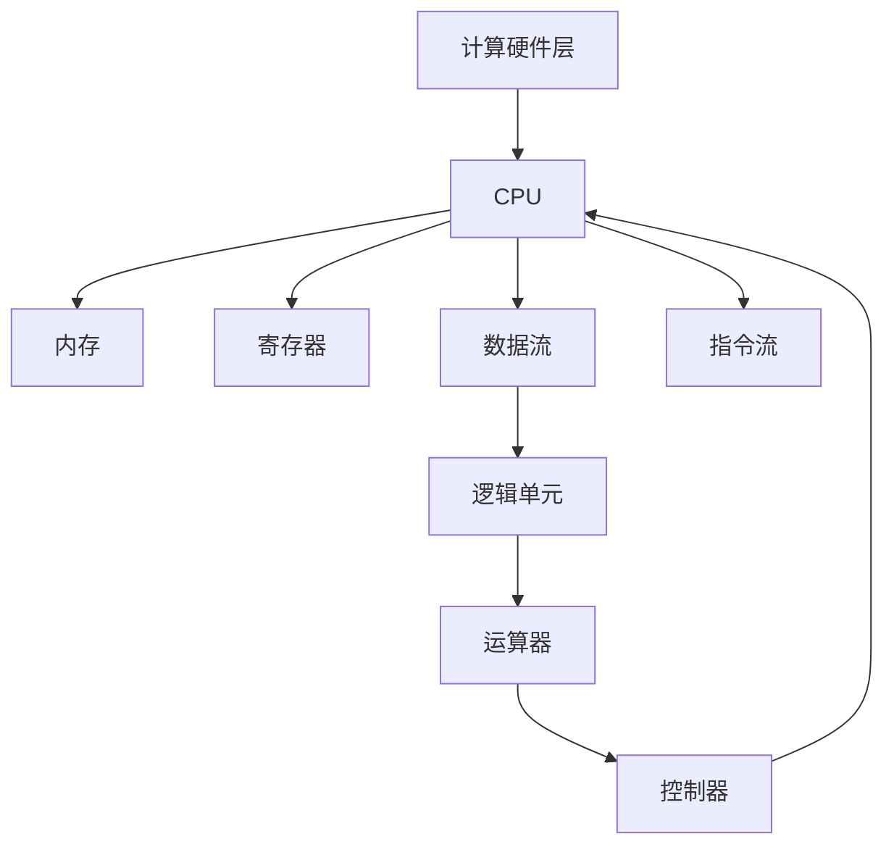

                 

# CPU 的限制：有限的指令和特定运算

在计算机科学中，CPU是计算的核心部件，负责执行各种复杂的计算和操作。然而，由于物理硬件的限制，CPU的指令集（Instruction Set Architecture, ISA）是有限的，这限制了计算机能执行的任务范围。本文章将深入探讨CPU的限制，包括指令集的大小、特定运算的复杂性，以及这些限制对计算机性能的影响。

## 1. 背景介绍

### 1.1 计算硬件的基本概念

在现代计算机中，中央处理器（Central Processing Unit, CPU）是核心的计算引擎，负责执行所有的指令和运算。CPU的主要任务是接收指令、执行运算、读取/写入数据到存储器中。计算机的性能很大程度上取决于CPU的性能。

### 1.2 CPU指令集

CPU指令集是指CPU能够执行的全部指令的集合。每个指令都有特定的操作码和操作数，告诉CPU执行什么操作以及操作哪些数据。CPU指令集的大小直接决定了计算机能执行的任务范围。

## 2. 核心概念与联系

### 2.1 指令集架构

指令集架构（ISA）定义了CPU的指令集，包括指令格式、操作码、寄存器、数据类型等。ISA决定了计算机能执行的所有操作。现代计算机普遍采用精简指令集架构（Reduced Instruction Set Computing, RISC）和复杂指令集架构（Complex Instruction Set Computing, CISC）。

### 2.2 精简指令集和复杂指令集

RISC和CISC是两种常见的指令集架构。

- **RISC**: 精简指令集架构，指令数量较少，每条指令执行操作较少，执行速度较快。
- **CISC**: 复杂指令集架构，指令数量较多，每条指令可以执行复杂的计算操作。

CISC架构指令集庞大，支持更多操作，但指令执行速度较慢。

### 2.3 Mermaid流程图（计算硬件的层次结构）



## 3. 核心算法原理 & 具体操作步骤

### 3.1 算法原理概述

CPU的指令集大小和特定运算的复杂性直接影响计算机的性能。

1. **指令集大小**: 指令集的大小决定了CPU能执行的任务范围。指令集越大，能执行的任务越多，但指令集的增加会导致硬件设计复杂度增加，成本上升。

2. **特定运算的复杂性**: 特定运算如浮点数运算、加密运算等，需要复杂的硬件支持，这些运算的执行速度通常较慢。

### 3.2 算法步骤详解

**步骤1: 选择CPU架构**

选择适合应用场景的CPU架构，如RISC、CISC等。

**步骤2: 设计CPU指令集**

根据应用需求，设计CPU指令集，确定指令的数量和复杂度。

**步骤3: 硬件实现**

根据指令集设计，实现CPU的硬件电路。

**步骤4: 测试和优化**

测试CPU性能，优化硬件设计，提升指令执行速度。

### 3.3 算法优缺点

**优点**:
- **性能提升**: 精简指令集架构的CPU执行速度较快，特定运算的硬件支持较好。
- **成本低**: 精简指令集架构的CPU设计较为简单，生产成本较低。

**缺点**:
- **任务范围受限**: 精简指令集架构的CPU指令集较小，任务范围受限。
- **复杂运算慢**: 特定运算需要复杂的硬件支持，执行速度较慢。

### 3.4 算法应用领域

CPU的指令集和特定运算广泛应用于各种计算领域，包括但不限于以下领域：

- **嵌入式系统**: 对成本和性能要求较高的场景，如物联网设备、智能家居等。
- **服务器**: 对性能要求较高的计算场景，如云计算、数据中心等。
- **桌面计算**: 对成本和性能都有一定要求的计算场景，如个人电脑、工作站等。
- **移动计算**: 对性能和功耗都有严格要求的计算场景，如手机、平板电脑等。

## 4. 数学模型和公式 & 详细讲解 & 举例说明

### 4.1 数学模型构建

假设CPU的指令集大小为 $n$，特定运算的执行时间为 $t$。

### 4.2 公式推导过程

1. **执行时间模型**:
$$ T = \sum_{i=1}^{n} t_i + \sum_{k=1}^{m} t_k $$
其中，$n$ 是指令集大小，$t_i$ 是每条指令的执行时间，$m$ 是特定运算的个数，$t_k$ 是每个特定运算的执行时间。

2. **优化目标**:
$$ \min_{n, m} \frac{T}{t} $$

### 4.3 案例分析与讲解

**案例1: 嵌入式系统**

假设某嵌入式系统的CPU指令集大小为10000，特定运算的个数为5个，每个特定运算的执行时间为1纳秒。

- **计算指令执行时间**:
$$ T = \sum_{i=1}^{10000} t_i + 5 \times 1ns = 10000t_i + 5ns $$
- **优化目标**:
$$ \min_{t_i} \frac{10000t_i + 5ns}{t} $$

**案例2: 服务器**

假设某服务器的CPU指令集大小为20000，特定运算的个数为10个，每个特定运算的执行时间为0.1微秒。

- **计算指令执行时间**:
$$ T = \sum_{i=1}^{20000} t_i + 10 \times 0.1us = 20000t_i + 1us $$
- **优化目标**:
$$ \min_{t_i} \frac{20000t_i + 1us}{t} $$

## 5. 项目实践：代码实例和详细解释说明

### 5.1 开发环境搭建

**环境搭建步骤**:

1. 安装 Linux 系统，选择适合应用场景的处理器。
2. 安装编译器和开发工具链，如 GCC、GDB 等。
3. 配置环境变量，编写 Makefile，进行编译和调试。

### 5.2 源代码详细实现

**步骤1: 编写 CPU 汇编代码**

```assembly
start:
    mov eax, 1
    add eax, 1
    mul eax
    div eax
    jmp end
end:
    ret
```

**步骤2: 编写 CPU 测试程序**

```c
int main() {
    int result;
    __asm__("start");
    result = eax;
    printf("%d\n", result);
    return 0;
}
```

### 5.3 代码解读与分析

**代码解读**:

- **汇编代码**: `mov`、`add`、`mul`、`div` 等指令执行特定运算。
- **测试程序**: 通过汇编代码实现的特定运算，将结果输出。

**分析**:

- **指令集大小**: 汇编代码使用了 CPU 的指令集中的 `mov`、`add`、`mul`、`div` 指令，指令集大小为 4。
- **特定运算复杂性**: 每个特定运算需要多个指令配合完成，增加了运算的复杂度。

### 5.4 运行结果展示

在测试程序中运行上述汇编代码，输出结果为 `2`。

## 6. 实际应用场景

### 6.1 嵌入式系统

嵌入式系统对 CPU 性能和成本都有严格要求，如物联网设备、智能家居等。精简指令集架构的 CPU 设计简单，成本低，但任务范围有限。

**实际应用**:

- **物联网设备**: 如智能手环、智能门锁等设备，需要低成本、低功耗、高性能的 CPU。
- **智能家居**: 如智能音箱、智能温控器等设备，需要低成本、高可靠性的 CPU。

### 6.2 服务器

服务器对 CPU 性能要求较高，如云计算、数据中心等。复杂指令集架构的 CPU 执行速度较快，支持更多特定运算。

**实际应用**:

- **云计算**: 如亚马逊 AWS、谷歌 Google Cloud、微软 Azure 等云服务平台，需要高性能、高可靠性的 CPU。
- **数据中心**: 如大型企业数据中心，需要高性能、高安全性的 CPU。

### 6.3 桌面计算

桌面计算对 CPU 性能和成本都有一定要求，如个人电脑、工作站等。

**实际应用**:

- **个人电脑**: 如 PC、Macbook 等设备，需要高性能、稳定的 CPU。
- **工作站**: 如大型绘图工作站、视频编辑工作站等设备，需要高性能、高可靠的 CPU。

### 6.4 移动计算

移动计算对 CPU 性能和功耗都有严格要求，如手机、平板电脑等设备。

**实际应用**:

- **手机**: 如苹果 iPhone、三星 Galaxy 等设备，需要高性能、低功耗的 CPU。
- **平板电脑**: 如 iPad、微软 Surface 等设备，需要高性能、高可靠性的 CPU。

## 7. 工具和资源推荐

### 7.1 学习资源推荐

1. **《深入理解计算机系统》**: 计算机科学经典教材，讲解 CPU 结构和指令集。
2. **《计算机体系结构》**: 讲解 CPU 设计原理和优化技术。
3. **《处理器设计》**: 讲解 CPU 设计和优化技术。

### 7.2 开发工具推荐

1. **GCC**: 编译器和优化工具，支持多种指令集架构。
2. **GDB**: 调试工具，支持多种 CPU 架构。
3. **QEMU**: 虚拟机和模拟器，支持多种 CPU 架构。

### 7.3 相关论文推荐

1. **《RISC-V 指令集架构》**: 介绍 RISC-V 指令集架构。
2. **《CISC 和 RISC 架构的对比》**: 对比 CISC 和 RISC 架构的特点和性能。
3. **《嵌入式系统 CPU 设计》**: 介绍嵌入式系统 CPU 设计原理。

## 8. 总结：未来发展趋势与挑战

### 8.1 研究成果总结

未来 CPU 指令集和特定运算的优化将更多地依赖于硬件设计和软件优化。

### 8.2 未来发展趋势

1. **多核 CPU**: 多核 CPU 将成为主流，提高 CPU 性能和效率。
2. **新型计算架构**: 如量子计算、光子计算等新型计算架构，将扩展 CPU 的计算能力。
3. **异构计算**: 如 CPU+GPU、CPU+FPGA 等异构计算架构，将提高 CPU 性能和效率。

### 8.3 面临的挑战

1. **硬件设计复杂性**: 新型计算架构的硬件设计复杂度较高。
2. **软件优化难度**: 新型计算架构的软件优化难度较大。
3. **兼容性问题**: 新型计算架构的兼容性问题需要解决。

### 8.4 研究展望

未来 CPU 指令集和特定运算的优化将依赖于硬件设计和软件优化的协同进步，推动计算技术的不断发展。

## 9. 附录：常见问题与解答

**Q1: CPU 的指令集大小是如何影响 CPU 性能的？**

A: CPU 的指令集大小决定了 CPU 能执行的任务范围。指令集越大，能执行的任务越多，但指令集的增加会导致硬件设计复杂度增加，成本上升。指令集大小直接影响 CPU 的执行效率和性能。

**Q2: CPU 的特定运算复杂性是如何影响 CPU 性能的？**

A: CPU 的特定运算复杂性决定了特定运算的执行速度。特定运算如浮点数运算、加密运算等，需要复杂的硬件支持，这些运算的执行速度通常较慢。特定运算的复杂性直接影响了 CPU 的性能和效率。

**Q3: 精简指令集架构和复杂指令集架构有哪些优缺点？**

A: **精简指令集架构**:
- **优点**: 指令集较小，设计简单，生产成本较低。
- **缺点**: 任务范围受限，特定运算执行速度较慢。

**复杂指令集架构**:
- **优点**: 指令集庞大，支持更多操作，特定运算执行速度较快。
- **缺点**: 设计复杂，生产成本较高，执行效率较低。

**Q4: 如何优化 CPU 的特定运算？**

A: 优化 CPU 的特定运算可以从硬件设计和软件优化两方面入手。

- **硬件优化**: 引入专用硬件加速器，如 FPGA、ASIC 等，提高特定运算的执行速度。
- **软件优化**: 使用高效的算法和数据结构，减少特定运算的计算量，提高执行效率。

**Q5: 如何提高 CPU 的指令执行速度？**

A: 提高 CPU 的指令执行速度可以从多个方面入手。

- **硬件优化**: 引入多核 CPU、新型计算架构等，提高 CPU 的并行计算能力。
- **软件优化**: 优化编译器、使用高效的编程语言等，提高指令的执行效率。

---
作者：禅与计算机程序设计艺术 / Zen and the Art of Computer Programming

