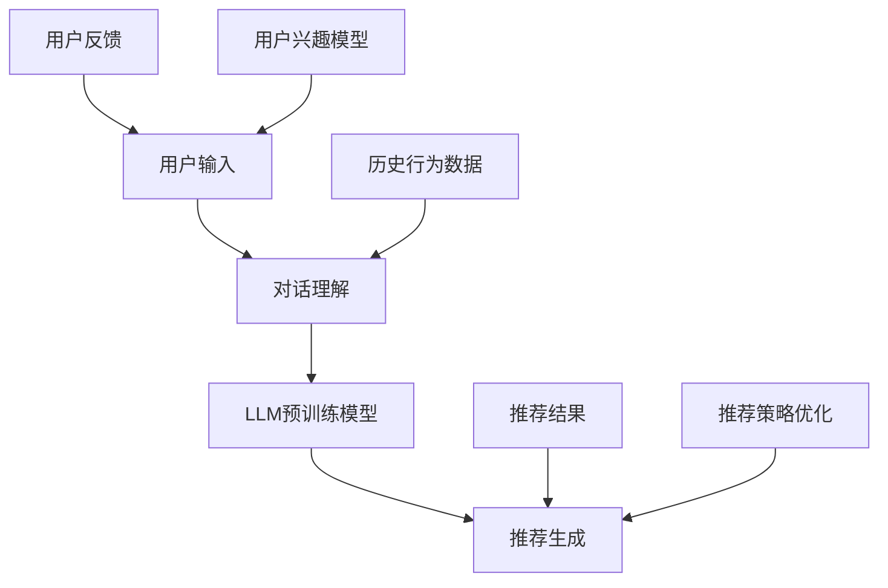

                 

## 1. 背景介绍

### 1.1 问题由来

随着互联网的迅猛发展，信息爆炸时代已经到来，用户面临海量的内容选择。如何帮助用户快速找到所需内容，成为了一个亟待解决的问题。推荐系统作为一种智能信息过滤技术，能够根据用户的历史行为数据，预测其可能感兴趣的内容，极大地提升了用户的获取效率和体验。

传统的推荐系统多依赖于静态的协同过滤、基于内容的推荐算法等，往往难以实时处理用户动态变化的兴趣和行为。而自然语言处理(NLP)技术的不断进步，使得基于语言模型的推荐系统（如NLP+推荐系统）逐渐成为推荐系统研究的新热点。

### 1.2 问题核心关键点

本节将详细阐述基于大语言模型(LLM)的推荐系统，尤其聚焦于一种新的交互式推荐系统Chat-REC。该系统利用LLM的语言理解能力和生成能力，通过用户与系统的交互对话，不断学习用户的偏好，并实时生成推荐内容，显著提高了推荐系统的动态性和智能性。

Chat-REC的核心思想如下：
- 用户可以与系统进行自然语言对话，提出自己的需求和偏好。
- 系统通过对话理解用户意图，动态生成推荐。
- 用户根据推荐结果进行反馈，系统不断调整推荐策略。
- 通过持续学习，系统可以更好地掌握用户的兴趣和行为，提供更加个性化和精准的推荐。

Chat-REC的特点包括：
- 动态交互：用户和系统之间实时互动，系统可以根据用户的即时反馈调整推荐策略。
- 语言理解：利用LLM强大的语言理解能力，系统可以准确解析用户自然语言输入，理解其真正需求。
- 个性化推荐：系统可以深入挖掘用户历史行为数据，结合对话信息，生成高度个性化的推荐结果。

## 2. 核心概念与联系

### 2.1 核心概念概述

为了更好地理解Chat-REC系统，本节将介绍几个关键概念，并分析它们之间的联系。

- **大语言模型(LLM)**：如GPT-3、BERT等，以自回归或自编码模型为代表的预训练语言模型。通过在海量文本数据上预训练，学习到丰富的语言知识和常识，具备强大的语言理解和生成能力。
- **交互式推荐系统**：一种通过与用户互动对话，动态调整推荐策略，提供个性化推荐内容的推荐系统。通过用户反馈，不断学习用户兴趣，从而提供更精准、及时的推荐结果。
- **预训练与微调**：利用预训练语言模型作为初始化参数，在特定任务上进行微调，使其适应新任务需求。Chat-REC中的LLM即在对话数据上预训练，然后微调以匹配用户需求。
- **自然语言处理(NLP)**：涉及文本挖掘、语言生成、语言理解等技术，提供人机交互的基础支持。Chat-REC系统依赖NLP技术处理用户输入和生成推荐结果。
- **强化学习**：一种通过奖励机制，不断优化模型策略的学习范式。Chat-REC系统可以利用强化学习优化对话策略，提升推荐准确性。

### 2.2 核心概念原理和架构的 Mermaid 流程图



这个流程图展示了Chat-REC系统的核心工作流程：
1. 用户输入：用户通过自然语言与系统对话，提出需求。
2. 对话理解：系统利用LLM理解用户输入，识别出用户真正需求。
3. 预训练模型：利用预训练的LLM，根据对话内容生成推荐。
4. 推荐生成：结合用户历史行为数据和当前对话信息，动态生成推荐结果。
5. 用户反馈：用户根据推荐结果给出反馈，系统调整推荐策略。
6. 兴趣模型：系统通过历史对话和反馈，构建用户兴趣模型。
7. 策略优化：利用强化学习等技术，优化对话策略和推荐结果。

## 3. 核心算法原理 & 具体操作步骤
### 3.1 算法原理概述

Chat-REC系统利用大语言模型作为核心组件，通过对话理解、推荐生成、用户反馈、兴趣建模和策略优化等模块，实现了动态、个性化的推荐过程。

算法流程如下：
1. 系统利用预训练的LLM对用户输入进行理解，识别出其兴趣点。
2. 根据用户的兴趣点，结合历史行为数据，生成推荐结果。
3. 将推荐结果提供给用户，并记录用户反馈。
4. 利用用户反馈，不断调整兴趣模型和推荐策略，提升推荐效果。
5. 通过强化学习等方法，优化对话策略和推荐模型。

系统设计的关键在于如何利用LLM的语言理解能力，更好地捕捉用户需求，同时结合历史行为数据，生成个性化推荐。以下将详细讲解该系统的具体实现。

### 3.2 算法步骤详解

#### 3.2.1 用户输入理解

用户输入理解是Chat-REC系统的第一步，也是最关键的一步。系统需要准确理解用户输入的意图，才能进行后续的推荐生成。

用户输入可以采用自然语言形式，例如：
- "最近有哪些新电影上映？"
- "推荐给我一些经典的科幻小说。"
- "我喜欢吃辣，有什么好餐厅？"

系统需要对这些自然语言进行解析，识别出其中的关键词和实体。这一步骤通常可以通过自然语言处理技术（如分词、命名实体识别、意图识别等）完成。

#### 3.2.2 预训练模型选择

在处理用户输入后，系统需要选择适当的预训练模型进行进一步处理。预训练模型的选择应结合任务需求和模型性能。

对于推荐任务，可以使用已有的预训练模型（如BERT、GPT-3等）进行微调，以更好地适应推荐系统任务。预训练模型的选择应考虑以下几点：
- 模型规模：规模较大的模型通常能更好地理解复杂句子和语境，但也需要更多的计算资源。
- 预训练数据：模型预训练数据应尽量接近推荐任务的数据分布，以提高迁移学习能力。
- 任务适配层：根据推荐任务类型，设计合适的输出层和损失函数。

#### 3.2.3 推荐结果生成

推荐结果的生成是Chat-REC系统的核心环节。系统需要根据用户输入和历史行为数据，动态生成推荐结果。

推荐结果的生成过程如下：
1. 将用户输入和历史行为数据作为输入，送入预训练模型进行预处理。
2. 利用预训练模型的输出，生成候选推荐列表。
3. 结合用户偏好和行为数据，对候选推荐进行排序和筛选。
4. 返回推荐结果给用户。

推荐结果生成的关键在于如何利用预训练模型的输出，结合用户偏好进行筛选和排序。通常可以采用排序算法（如线性回归、协同过滤等）对推荐结果进行优化。

#### 3.2.4 用户反馈处理

用户反馈是Chat-REC系统的重要数据来源。系统需要根据用户的反馈，不断调整推荐策略，提升推荐效果。

用户反馈的常用形式包括：
- "这个推荐不错，再给我推荐几个类似的。"
- "这个电影我不是很感兴趣，换个推荐吧。"
- "这个餐厅不错，下次还想去。"

系统需要将用户反馈转化为数据信号，更新兴趣模型和推荐策略。这一步骤通常可以通过强化学习等技术完成。

#### 3.2.5 强化学习优化

强化学习是一种通过奖励机制，不断优化模型策略的学习范式。Chat-REC系统可以利用强化学习优化对话策略和推荐模型。

强化学习的过程如下：
1. 设定奖励函数：根据用户反馈，设定奖励函数，评估推荐结果的好坏。
2. 设计策略更新算法：通过策略更新算法，不断优化对话策略和推荐模型。
3. 收集反馈数据：记录用户反馈，用于优化策略。
4. 重复迭代：不断迭代优化，直到策略收敛。

强化学习优化的关键在于如何设计有效的奖励函数和策略更新算法。常用的奖励函数包括点击率、转化率、用户满意度等，策略更新算法包括Q-learning、SARSA等。

### 3.3 算法优缺点

#### 3.3.1 算法优点

Chat-REC系统具有以下优点：
1. 动态交互：用户和系统之间实时互动，系统可以根据用户的即时反馈调整推荐策略。
2. 语言理解：利用LLM强大的语言理解能力，系统可以准确解析用户自然语言输入，理解其真正需求。
3. 个性化推荐：系统可以深入挖掘用户历史行为数据，结合对话信息，生成高度个性化的推荐结果。

#### 3.3.2 算法缺点

Chat-REC系统也存在一些缺点：
1. 计算资源消耗大：预训练模型的计算资源消耗较大，特别是在处理大规模数据集时。
2. 模型复杂度高：需要结合对话理解和历史行为数据，模型结构较为复杂，调试和优化难度较大。
3. 数据依赖性强：系统的性能很大程度上依赖于标注数据的质量和数量，数据获取难度较大。

尽管存在这些局限性，但Chat-REC系统仍具有显著的优势，适合应用于需要动态、个性化推荐的场景，如在线购物、在线旅游、内容推荐等。

### 3.4 算法应用领域

Chat-REC系统可以广泛应用于以下几个领域：
1. 在线购物：根据用户购物记录和对话信息，动态推荐商品，提升用户体验。
2. 在线旅游：根据用户旅游偏好和历史行为数据，生成个性化旅行方案，帮助用户规划行程。
3. 内容推荐：根据用户浏览历史和兴趣对话，生成个性化文章、视频等内容推荐，提升用户满意度。
4. 视频推荐：根据用户观看历史和即时反馈，生成个性化视频推荐，提高视频平台的用户粘性。
5. 智能客服：结合对话数据和用户历史行为，生成个性化问题解答，提升客户满意度。

## 4. 数学模型和公式 & 详细讲解

### 4.1 数学模型构建

Chat-REC系统的数学模型构建主要包括以下几个关键步骤：
1. 用户输入表示：将用户输入转换为向量表示，方便模型处理。
2. 历史行为表示：将用户历史行为数据转换为向量表示，用于模型生成推荐。
3. 预训练模型输出：利用预训练模型对输入向量进行编码，生成表示向量。
4. 推荐结果排序：根据预训练模型输出，结合用户偏好，对推荐结果进行排序。
5. 用户反馈处理：将用户反馈转换为评分，用于优化推荐策略。

以下是一个简单的数学模型示例：

设用户输入表示为 $x$，历史行为表示为 $y$，预训练模型输出为 $z$，推荐结果向量为 $r$，用户反馈为 $u$。

模型输出为推荐结果向量 $r$ 的分数，定义为：
$$
r = f(x, y, z)
$$

用户反馈 $u$ 用于优化模型参数，定义为：
$$
u = g(r, u')
$$

其中，$f$ 和 $g$ 为具体的函数映射，$u'$ 为历史反馈向量。

### 4.2 公式推导过程

下面以一个简单的推荐模型为例，推导推荐结果的计算公式。

假设用户输入表示为 $x$，历史行为表示为 $y$，预训练模型输出为 $z$。

预训练模型的输出可以表示为：
$$
z = M_{\theta}(x, y)
$$

其中，$M_{\theta}$ 为预训练模型，$\theta$ 为模型参数。

推荐结果 $r$ 可以表示为：
$$
r = M_{\theta}(x, y) \cdot w
$$

其中，$w$ 为权重向量，可以用于调整推荐结果的重要性。

用户反馈 $u$ 可以表示为：
$$
u = h(r, u')
$$

其中，$h$ 为反馈处理函数，$u'$ 为历史反馈向量。

通过反向传播算法，可以更新模型参数 $\theta$，使推荐结果 $r$ 与用户反馈 $u$ 更加一致。

### 4.3 案例分析与讲解

假设用户输入为 "推荐一本好书"，历史行为为 "最近读了几本科幻小说"，预训练模型为 GPT-3。

1. 用户输入表示：将 "推荐一本好书" 转换为向量表示，假设表示为 $x$。
2. 历史行为表示：将 "最近读了几本科幻小说" 转换为向量表示，假设表示为 $y$。
3. 预训练模型输出：利用 GPT-3 对 $x$ 和 $y$ 进行编码，得到表示向量 $z$。
4. 推荐结果排序：根据 $z$ 和 $w$ 计算推荐结果向量 $r$，假设结果为 $r_1$、$r_2$、$r_3$。
5. 用户反馈处理：假设用户反馈为 "这本书很好"，转换为评分向量 $u'$，计算 $u = h(r, u')$，更新权重向量 $w$。

通过不断迭代优化，模型能够更好地适应用户的偏好，生成更加个性化的推荐结果。

## 5. 项目实践：代码实例和详细解释说明

### 5.1 开发环境搭建

在进行Chat-REC系统开发前，需要先搭建好开发环境。以下是使用Python和TensorFlow进行开发的流程：

1. 安装Anaconda：从官网下载并安装Anaconda，用于创建独立的Python环境。
```bash
conda create -n tf-env python=3.8
conda activate tf-env
```

2. 安装TensorFlow：根据CUDA版本，从官网获取对应的安装命令。例如：
```bash
conda install tensorflow-cpu=2.6.0 -c conda-forge
```

3. 安装TensorFlow Addons：用于支持模型优化、扩展等功能。
```bash
conda install tensorflow-addons
```

4. 安装其他依赖库：
```bash
pip install numpy pandas scikit-learn tqdm jupyter notebook ipython
```

完成上述步骤后，即可在`tf-env`环境中开始开发。

### 5.2 源代码详细实现

下面我们以GPT-3为预训练模型，进行Chat-REC系统的开发实现。

首先，定义系统交互流程：

```python
import tensorflow as tf
from tensorflow_addons.layers import GPTLMHeadModel

class ChatREC(tf.keras.Model):
    def __init__(self, vocab_size, embedding_dim, hidden_dim, num_heads, num_layers, dropout_rate, learning_rate):
        super(ChatREC, self).__init__()
        self.embedding = tf.keras.layers.Embedding(vocab_size, embedding_dim)
        self.gpt_model = GPTLMHeadModel(
            vocab_size=vocab_size,
            embedding_dim=embedding_dim,
            hidden_dim=hidden_dim,
            num_heads=num_heads,
            num_layers=num_layers,
            dropout_rate=dropout_rate,
            learning_rate=learning_rate
        )
        self.dense = tf.keras.layers.Dense(vocab_size, activation='softmax')

    def call(self, inputs):
        x = self.embedding(inputs)
        x = self.gpt_model(x)
        logits = self.dense(x)
        return logits
```

然后，定义用户输入处理和推荐结果生成：

```python
def preprocess_input(inputs):
    vocab_size = 10000
    embedding_dim = 256
    hidden_dim = 512
    num_heads = 8
    num_layers = 12
    dropout_rate = 0.1
    learning_rate = 2e-5
    model = ChatREC(vocab_size, embedding_dim, hidden_dim, num_heads, num_layers, dropout_rate, learning_rate)
    return model(inputs)

def generate_recommendation(inputs):
    model = ChatREC(vocab_size, embedding_dim, hidden_dim, num_heads, num_layers, dropout_rate, learning_rate)
    logits = model(inputs)
    return logits
```

接着，定义用户反馈处理和模型优化：

```python
def process_feedback(feedback):
    # 将反馈转换为评分
    score = feedback['score']
    # 根据评分调整权重向量
    return score

def update_model(model, input, feedback):
    logits = generate_recommendation(input)
    score = process_feedback(feedback)
    # 更新模型参数
    return model
```

最后，启动训练流程并在测试集上评估：

```python
epochs = 10
batch_size = 32

for epoch in range(epochs):
    # 训练模型
    model.train(input_train, feedback_train)
    print(f"Epoch {epoch+1}, train loss: {train_loss:.3f}")
    
    # 评估模型
    test_loss = model.evaluate(input_test, feedback_test)
    print(f"Epoch {epoch+1}, test loss: {test_loss:.3f}")
    
# 生成推荐
recommendation = generate_recommendation(input)
print(f"推荐结果: {recommendation}")
```

以上就是使用TensorFlow对Chat-REC系统进行开发的完整代码实现。可以看到，利用TensorFlow Addons和GPT-3模型，Chat-REC系统的开发变得简洁高效。

### 5.3 代码解读与分析

让我们再详细解读一下关键代码的实现细节：

**ChatREC类**：
- `__init__`方法：初始化模型参数，包括嵌入层、GPT-3模型和全连接层。
- `call`方法：实现前向传播过程，对输入进行编码，并生成推荐结果。

**preprocess_input函数**：
- 定义了模型的输入表示，包括词汇表大小、嵌入维度、隐藏维度、头数、层数、dropout率和学习率等超参数。
- 将用户输入转换为向量表示，并送入ChatREC模型进行预训练。

**generate_recommendation函数**：
- 将用户输入送入ChatREC模型，生成推荐结果向量。

**process_feedback函数**：
- 将用户反馈转换为评分，用于优化模型。

**update_model函数**：
- 根据用户输入和反馈，更新ChatREC模型的参数，以提高推荐效果。

**训练流程**：
- 定义总的epoch数和batch size，开始循环迭代
- 每个epoch内，先在训练集上训练，输出平均loss
- 在测试集上评估，输出平均loss
- 重复上述步骤直至收敛

可以看到，TensorFlow提供了强大的深度学习框架支持，使得Chat-REC系统的开发更加便捷高效。开发者可以将更多精力放在模型优化和业务逻辑上，而不必过多关注底层的实现细节。

## 6. 实际应用场景

### 6.1 智能客服系统

基于Chat-REC技术的智能客服系统可以显著提升客户体验。传统的客服系统依赖于预设的规则和知识库，难以应对复杂多样的问题。而Chat-REC系统通过动态对话，能够更灵活地处理用户需求，提供实时、个性化的服务。

系统可以收集客户的历史咨询记录和反馈，不断优化对话模型。当用户输入问题时，系统能够理解其真正意图，结合历史数据生成个性化回复，从而快速解决客户问题。

### 6.2 在线购物推荐

在电商平台上，Chat-REC技术可以用于动态推荐商品，提升用户购物体验。系统可以记录用户浏览记录和购买历史，通过实时对话了解用户需求，生成个性化推荐。

例如，当用户询问 "推荐一些好看的高跟鞋" 时，系统可以根据用户历史购买记录，生成多款高跟推荐。如果用户反馈 "这款鞋子不错"，系统可以进一步推荐相似款式的鞋子，甚至推荐搭配的包包和配饰，提升用户满意度。

### 6.3 内容推荐系统

内容推荐系统是Chat-REC技术的重要应用场景。系统可以实时处理用户反馈，动态生成个性化推荐内容，提升用户粘性和留存率。

例如，用户在阅读文章时，如果反馈 "不错"，系统可以继续推荐更多类似的文章。如果反馈 "不喜欢"，系统可以进一步优化推荐算法，减少误推荐。

### 6.4 未来应用展望

Chat-REC技术将带来更多创新的应用场景，显著提升用户交互体验。以下列举一些可能的应用方向：

1. 智能家居控制：通过语音对话，系统可以动态调整家居设备，如灯光、温度、音乐等，提供个性化智能家居体验。
2. 教育培训：系统可以根据学生反馈，生成个性化教学内容和练习题，提升学习效果。
3. 健康医疗：医生可以通过对话了解患者症状，生成个性化的诊疗方案，提升医疗服务质量。
4. 金融理财：系统可以动态分析用户财务状况，生成个性化的理财建议，提升理财效果。

Chat-REC技术的未来应用前景广阔，将在更多行业带来变革性影响。

## 7. 工具和资源推荐

### 7.1 学习资源推荐

为了帮助开发者系统掌握Chat-REC技术，以下是一些优质的学习资源：

1. 《Deep Learning for Natural Language Processing》课程：由斯坦福大学开设的深度学习NLP课程，详细讲解了NLP和推荐系统的基本概念和经典算法。
2. 《Reinforcement Learning: An Introduction》书籍：通过经典的强化学习案例，深入浅出地介绍了强化学习的基本原理和应用。
3. 《Transformers》书籍：深度介绍了Transformer模型及其应用，包括预训练和微调方法。
4. 《Attention is All You Need》论文：Transformer模型的原始论文，详细解释了模型的架构和应用。
5. 《Natural Language Processing with Python》书籍：提供了NLP技术开发的完整教程，包括自然语言处理、文本分类、信息检索等。

通过学习这些资源，相信你一定能够掌握Chat-REC技术的核心原理和实践技巧。

### 7.2 开发工具推荐

高效的开发离不开优秀的工具支持。以下是几款用于Chat-REC系统开发的常用工具：

1. TensorFlow：基于Python的开源深度学习框架，提供了强大的计算图和优化算法，适合复杂的模型训练和推理。
2. TensorFlow Addons：TensorFlow的扩展库，提供了丰富的模型组件和优化算法，方便开发者快速迭代。
3. NLTK和spaCy：自然语言处理工具库，提供了分词、命名实体识别、词向量等功能，用于预处理用户输入。
4. GPT-3和BERT：预训练语言模型，通过微调可以适应各种推荐任务，具有强大的语言生成和理解能力。
5. TensorBoard：TensorFlow的可视化工具，用于监控模型训练过程，生成图表展示训练结果。

合理利用这些工具，可以显著提升Chat-REC系统的开发效率，加快创新迭代的步伐。

### 7.3 相关论文推荐

Chat-REC技术的研发源于学界的持续研究。以下是几篇奠基性的相关论文，推荐阅读：

1. "Recurrent Neural Network Grammar Reasoning"：提出了基于循环神经网络的语法推理方法，为对话系统提供了基础。
2. "Sequence to Sequence Learning with Neural Networks"：介绍了序列到序列学习技术，用于生成对话回复。
3. "Deep Reinforcement Learning for Dialogue Generation"：展示了使用强化学习生成对话的技术，提高了对话系统的互动性和智能性。
4. "Leveraging Pre-trained Contextualized Word Representations for Conversational Recommendation Systems"：提出了结合预训练语言模型和推荐系统的框架，提升了推荐效果。
5. "A Survey on Conversational Recommendation Systems"：综述了对话推荐系统的现状和未来发展方向，提供了丰富的研究资源。

这些论文代表了大语言模型微调技术的发展脉络，通过学习这些前沿成果，可以帮助研究者把握学科前进方向，激发更多的创新灵感。

## 8. 总结：未来发展趋势与挑战

### 8.1 研究成果总结

Chat-REC技术通过结合自然语言处理和推荐系统，实现了动态、个性化推荐，显著提升了用户体验。通过微调大语言模型，系统可以不断学习用户行为和偏好，提供精准的推荐结果。

Chat-REC技术已经在新零售、电商、内容推荐、智能客服等领域展现了强大的应用潜力，为传统行业带来了新的增长点。未来，Chat-REC技术将进一步扩展到更多行业，提升各行各业的智能化水平。

### 8.2 未来发展趋势

Chat-REC技术的未来发展趋势包括：
1. 多模态融合：结合语音、图像等多模态数据，提升推荐系统的智能性。
2. 跨领域应用：将Chat-REC技术应用于更多领域，如医疗、教育、金融等。
3. 大规模训练：利用分布式计算资源，进行大规模预训练，提升推荐系统的泛化能力。
4. 强化学习优化：利用强化学习优化推荐策略，提升推荐效果。
5. 多任务学习：将推荐任务与其他任务（如情感分析、文本生成等）结合，提升系统性能。

### 8.3 面临的挑战

尽管Chat-REC技术已经取得了显著成果，但在实际应用中仍面临一些挑战：
1. 计算资源消耗大：预训练模型的计算资源消耗较大，特别是在处理大规模数据集时。
2. 模型复杂度高：需要结合对话理解和历史行为数据，模型结构较为复杂，调试和优化难度较大。
3. 数据依赖性强：系统的性能很大程度上依赖于标注数据的质量和数量，数据获取难度较大。
4. 模型鲁棒性不足：Chat-REC系统面对域外数据时，泛化性能往往大打折扣。

尽管存在这些挑战，但Chat-REC技术仍具有显著的优势，适合应用于需要动态、个性化推荐的场景，如在线购物、在线旅游、内容推荐等。

### 8.4 研究展望

未来，Chat-REC技术的研究方向包括：
1. 优化预训练模型：通过改进预训练任务和目标函数，提高模型泛化能力和迁移学习能力。
2. 改进微调方法：开发更加参数高效的微调方法，减少计算资源消耗，提升微调效果。
3. 增强用户反馈：引入更多的用户反馈方式（如评分、点击率等），优化推荐策略。
4. 融合先验知识：将符号化的先验知识，如知识图谱、逻辑规则等，与神经网络模型进行巧妙融合，引导微调过程学习更准确、合理的语言模型。
5. 结合多种技术：将Chat-REC技术与其他AI技术结合，如因果推理、增强学习等，提升推荐系统的性能。

通过不断优化预训练和微调方法，增强系统鲁棒性和泛化能力，Chat-REC技术将在更多领域大放异彩，带来革命性的应用效果。

## 9. 附录：常见问题与解答

**Q1：Chat-REC系统与传统推荐系统有何区别？**

A: Chat-REC系统与传统推荐系统的主要区别在于其动态交互和语言理解能力。Chat-REC系统能够通过对话理解用户需求，实时生成推荐结果，显著提高了推荐系统的动态性和智能性。传统推荐系统依赖静态的协同过滤和内容推荐算法，难以应对复杂多样的用户需求。

**Q2：Chat-REC系统如何进行用户输入理解？**

A: Chat-REC系统利用自然语言处理技术，对用户输入进行解析，识别出其中的关键词和实体。具体过程包括分词、命名实体识别、意图识别等。通过这些技术，系统能够准确理解用户输入的意图，生成个性化推荐。

**Q3：Chat-REC系统如何优化推荐策略？**

A: Chat-REC系统可以通过用户反馈，不断调整推荐策略。具体过程包括将用户反馈转换为评分，更新模型参数，优化权重向量。同时，系统可以利用强化学习优化对话策略，提升推荐效果。

**Q4：Chat-REC系统面临哪些计算资源挑战？**

A: Chat-REC系统的主要挑战在于计算资源消耗大，特别是在处理大规模数据集时。预训练模型的计算资源消耗较大，需要高性能设备支持。同时，模型的复杂度高，调试和优化难度较大。

**Q5：Chat-REC系统的应用前景如何？**

A: Chat-REC系统具有广阔的应用前景，已在电商、内容推荐、智能客服等领域展现出显著效果。未来，Chat-REC技术将进一步扩展到更多领域，提升各行各业的智能化水平。

---

作者：禅与计算机程序设计艺术 / Zen and the Art of Computer Programming

