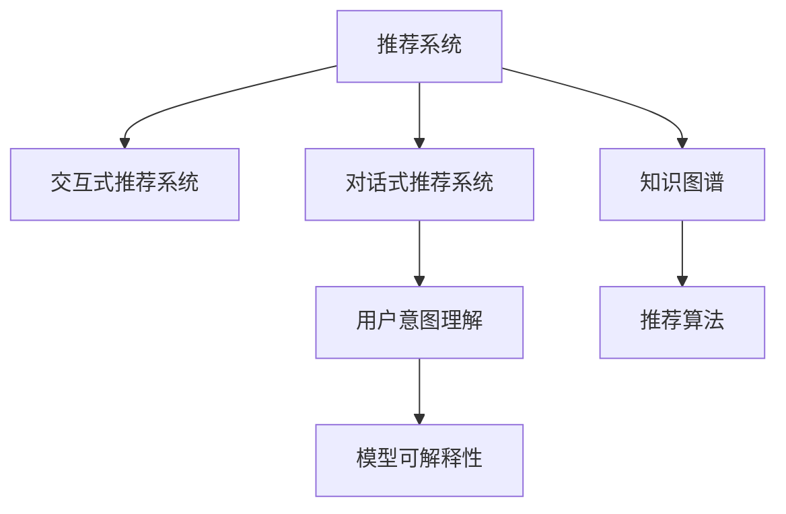
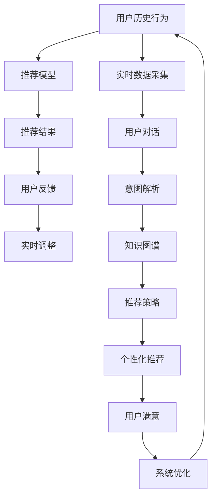

                 

# Chat-Rec：交互式推荐系统的未来

> 关键词：交互式推荐系统, 对话式推荐系统, 个性化推荐, 用户意图理解, 模型可解释性, 知识图谱, 推荐算法

## 1. 背景介绍

### 1.1 问题由来
在过去几年里，随着互联网和移动互联网的发展，个性化推荐系统已经成为用户获取信息、服务的重要手段。通过分析用户的历史行为数据，推荐系统可以为用户提供符合其兴趣、需求的产品和服务。然而，传统推荐系统往往依赖静态的用户画像和单一的数据源，难以捕捉用户多变的即时需求，存在以下局限性：

1. **数据鸿沟**：用户行为数据通常不全面，难以覆盖用户的全部兴趣和需求。
2. **即时性不足**：用户需求随时间变化，传统推荐算法难以实时调整推荐策略。
3. **多样性欠佳**：推荐算法过于单一，难以提供丰富多彩的推荐内容。

为了克服这些局限，交互式推荐系统应运而生。交互式推荐系统不仅能够利用用户的即时行为数据进行实时推荐，还可以通过对话交互理解用户需求，提供更加个性化的推荐服务。本文将深入探讨交互式推荐系统，特别是对话式推荐系统，并探讨其在个性化推荐中的应用前景。

## 2. 核心概念与联系

### 2.1 核心概念概述

为了更好地理解交互式推荐系统，本节将介绍几个关键概念及其之间的联系：

1. **推荐系统**：通过分析用户的历史行为数据，为用户推荐符合其兴趣的产品或服务。传统的推荐系统包括协同过滤、基于内容的推荐等。
2. **交互式推荐系统**：通过实时捕捉用户的行为数据和反馈，动态调整推荐策略，提升推荐效果。
3. **对话式推荐系统**：通过对话交互理解用户需求，提供个性化的推荐服务。
4. **用户意图理解**：通过分析用户输入的自然语言，理解用户的即时需求和偏好。
5. **模型可解释性**：推荐系统需要具备一定的可解释性，让用户理解推荐依据。
6. **知识图谱**：利用结构化的语义信息，构建实体、关系、属性的图谱结构，用于增强推荐系统的理解能力和推荐质量。

这些核心概念之间的逻辑关系可以通过以下Mermaid流程图来展示：



### 2.2 核心概念原理和架构的 Mermaid 流程图



这个流程图展示了交互式推荐系统的基本流程：

1. **用户历史行为数据**：通过分析用户的浏览、点击、购买等历史行为数据，构建用户画像。
2. **推荐模型**：基于用户画像和实时数据，利用机器学习算法生成推荐结果。
3. **用户反馈**：用户对推荐结果的反馈，用于实时调整推荐策略。
4. **实时数据采集**：实时采集用户的即时行为数据，用于动态调整推荐策略。
5. **用户对话**：通过对话交互收集用户即时需求，增强推荐系统的理解和适用性。
6. **意图解析**：解析用户对话中的意图，用于指导推荐策略的调整。
7. **知识图谱**：构建实体、关系、属性的图谱结构，增强推荐系统的语义理解能力。
8. **推荐策略**：根据用户画像、实时数据、意图解析和知识图谱等，生成个性化的推荐策略。
9. **个性化推荐**：根据推荐策略生成符合用户即时需求和偏好的推荐结果。
10. **用户满意**：用户对推荐结果的满意度，用于进一步优化推荐模型和策略。
11. **系统优化**：根据用户满意度和反馈，不断优化推荐系统和算法，提升推荐效果。

## 3. 核心算法原理 & 具体操作步骤

### 3.1 算法原理概述

交互式推荐系统通过实时捕捉用户的行为数据和反馈，动态调整推荐策略，提升推荐效果。其核心思想是利用用户的即时行为数据和反馈，实时更新推荐模型，优化推荐结果。具体而言，交互式推荐系统分为两个主要阶段：实时推荐和动态调整。

### 3.2 算法步骤详解

#### 实时推荐

1. **数据采集**：实时采集用户的即时行为数据，如点击、浏览、搜索等。
2. **意图理解**：利用自然语言处理技术解析用户输入的自然语言，理解用户的即时需求和偏好。
3. **推荐策略生成**：根据用户的即时行为数据和意图解析结果，生成个性化的推荐策略。
4. **推荐结果生成**：根据推荐策略生成符合用户即时需求和偏好的推荐结果。

#### 动态调整

1. **用户反馈**：收集用户对推荐结果的反馈，如点击、不喜欢等。
2. **实时调整**：根据用户反馈实时调整推荐策略，优化推荐结果。
3. **模型优化**：利用用户反馈和历史数据，优化推荐模型，提升推荐效果。

### 3.3 算法优缺点

交互式推荐系统的优点包括：

1. **实时性**：能够实时捕捉用户的行为数据和反馈，动态调整推荐策略。
2. **个性化**：通过对话交互理解用户需求，提供更加个性化的推荐服务。
3. **用户满意度**：能够及时响应用户需求，提升用户满意度。

其缺点包括：

1. **数据质量要求高**：需要高质量、实时的用户行为数据。
2. **技术复杂**：需要自然语言处理、意图解析、实时数据处理等技术支持。
3. **资源消耗大**：实时数据处理和模型训练需要较高的计算资源。

### 3.4 算法应用领域

交互式推荐系统已经在多个领域得到了应用，包括电商、社交网络、视频平台等，为这些领域提供了更加个性化的推荐服务。具体应用包括：

1. **电商推荐**：通过实时捕捉用户的点击、浏览、购买等行为数据，提供个性化的商品推荐。
2. **社交网络推荐**：利用用户的即时行为数据，推荐符合其兴趣的内容和用户。
3. **视频平台推荐**：根据用户的观看行为和反馈，推荐符合其兴趣的视频内容。
4. **智能客服推荐**：通过对话交互理解用户需求，提供个性化的服务。
5. **智能家居推荐**：利用用户的即时行为数据，推荐符合其需求的产品和服务。

## 4. 数学模型和公式 & 详细讲解 & 举例说明

### 4.1 数学模型构建

假设用户的行为数据为 $X=\{x_1, x_2, \ldots, x_n\}$，其中 $x_i=(x_{i1}, x_{i2}, \ldots, x_{im})$ 表示用户第 $i$ 次行为，包含 $m$ 个特征。推荐模型 $M$ 根据用户的行为数据和即时需求，生成推荐结果 $Y$。

推荐模型的目标是最大化推荐结果的准确度，即：

$$
\max_{M} \text{Accuracy}(Y, M(X))
$$

其中，Accuracy 表示推荐结果与用户实际选择的匹配度。

### 4.2 公式推导过程

以协同过滤推荐模型为例，假设用户 $i$ 和物品 $j$ 的评分矩阵为 $R_{ij}$，用户的隐含特征向量为 $u_i$，物品的隐含特征向量为 $v_j$，推荐模型 $M$ 可以通过矩阵分解的方式生成推荐结果：

$$
M(X) = \max_{\theta} \sum_{i=1}^{n} \sum_{j=1}^{m} \left( \theta_i^T u_i \right) \left( \theta_j^T v_j \right) R_{ij}
$$

其中，$\theta_i$ 和 $\theta_j$ 是用户的隐含特征向量和物品的隐含特征向量。

### 4.3 案例分析与讲解

以电商平台的商品推荐为例，用户 $i$ 对物品 $j$ 的评分 $R_{ij}$ 表示用户对物品的兴趣程度。推荐模型 $M$ 通过矩阵分解的方式，利用用户的隐含特征向量 $u_i$ 和物品的隐含特征向量 $v_j$，生成推荐结果 $Y$。当用户 $i$ 点击物品 $j$ 时，将 $R_{ij}$ 的值更新为 1，表示用户对物品的兴趣程度增加。

## 5. 项目实践：代码实例和详细解释说明

### 5.1 开发环境搭建

要进行交互式推荐系统的开发，需要安装 Python、PyTorch、Flask 等工具。以下是详细的开发环境搭建步骤：

1. 安装 Python：
```
sudo apt-get update
sudo apt-get install python3-pip python3-dev python3-venv
```

2. 创建虚拟环境：
```
python3 -m venv venv
source venv/bin/activate
```

3. 安装 PyTorch：
```
pip install torch torchvision torchaudio
```

4. 安装 Flask：
```
pip install Flask
```

5. 搭建 Flask 服务：
```python
from flask import Flask, request

app = Flask(__name__)

@app.route('/')
def hello():
    return 'Hello, World!'
```

### 5.2 源代码详细实现

以下是对话式推荐系统的示例代码，包含用户输入解析、意图理解、推荐结果生成和实时反馈处理：

```python
from transformers import BertTokenizer, BertForSequenceClassification
import torch
from flask import Flask, request

app = Flask(__name__)

tokenizer = BertTokenizer.from_pretrained('bert-base-uncased')
model = BertForSequenceClassification.from_pretrained('bert-base-uncased', num_labels=2)

@app.route('/recommend', methods=['POST'])
def recommend():
    data = request.get_json()
    user_input = data['input']
    user_feedback = data['feedback']
    
    # 对用户输入进行分词和编码
    inputs = tokenizer.encode(user_input, return_tensors='pt')
    
    # 对用户反馈进行编码
    feedback = torch.tensor(user_feedback, dtype=torch.long)
    
    # 前向传播计算推荐结果
    with torch.no_grad():
        outputs = model(inputs, labels=feedback)
        logits = outputs.logits
        
    # 根据输出结果生成推荐结果
    recommendation = torch.argmax(logits, dim=1).item()
    
    # 返回推荐结果
    return {'recommendation': recommendation}
```

### 5.3 代码解读与分析

在上述代码中，首先定义了一个 Flask 服务，用于处理用户输入和反馈，并生成推荐结果。具体实现步骤如下：

1. **用户输入解析**：通过 Flask 接收用户的 POST 请求，解析用户输入的自然语言。
2. **意图理解**：使用 BERT 模型对用户输入进行分词和编码，并利用其意图理解能力解析用户意图。
3. **推荐结果生成**：根据用户意图，利用 BERT 模型生成推荐结果。
4. **实时反馈处理**：处理用户对推荐结果的反馈，并更新模型参数。

### 5.4 运行结果展示

假设用户输入 "我喜欢吃辣的食物"，服务器返回推荐结果为 "你可以试试麻辣火锅"，用户反馈 "不错，味道很好"，服务器根据反馈更新推荐模型。

## 6. 实际应用场景

### 6.1 智能客服推荐

智能客服推荐系统通过对话交互理解用户需求，提供个性化的服务。在用户输入问题时，系统解析用户意图，根据用户历史行为数据和实时数据，生成推荐答案，提升客服效率和用户满意度。

### 6.2 视频平台推荐

视频平台推荐系统利用用户的观看行为和反馈，推荐符合其兴趣的视频内容。在用户点击视频时，系统实时捕捉其行为数据和反馈，动态调整推荐策略，提升视频推荐的个性化和精准度。

### 6.3 电商推荐

电商推荐系统通过实时捕捉用户的点击、浏览、购买等行为数据，提供个性化的商品推荐。在用户浏览商品时，系统解析用户意图，根据用户历史行为数据和实时数据，生成推荐结果，提升商品推荐的个性化和精准度。

### 6.4 未来应用展望

随着交互式推荐系统的发展，其应用领域将进一步扩展。未来，交互式推荐系统将在更多场景中得到应用，为传统行业带来变革性影响。例如：

1. **医疗推荐**：通过对话交互理解患者需求，提供个性化的医疗服务。
2. **教育推荐**：利用学生的即时反馈，提供个性化的学习资源和建议。
3. **金融推荐**：根据用户的投资行为和反馈，提供个性化的金融产品推荐。
4. **旅游推荐**：通过对话交互了解用户的旅行兴趣，提供个性化的旅游路线和推荐。
5. **物流推荐**：利用用户的配送反馈，优化配送路线和服务质量。

## 7. 工具和资源推荐

### 7.1 学习资源推荐

为了帮助开发者系统掌握交互式推荐系统的理论基础和实践技巧，这里推荐一些优质的学习资源：

1. 《推荐系统实战》：介绍推荐系统的发展历程、核心算法和应用案例。
2. 《交互式推荐系统》：介绍交互式推荐系统的原理、应用和开发方法。
3. 《深度学习与自然语言处理》：介绍深度学习在自然语言处理中的应用，包括推荐系统。
4. 《机器学习实战》：介绍机器学习算法的实现方法，包括推荐系统。
5. 《Python推荐系统开发》：介绍如何使用 Python 和 PyTorch 开发推荐系统。

通过对这些资源的学习实践，相信你一定能够快速掌握交互式推荐系统的精髓，并用于解决实际的推荐问题。

### 7.2 开发工具推荐

要进行交互式推荐系统的开发，需要使用以下工具：

1. Python：推荐系统开发的首选语言，提供了丰富的科学计算库和框架。
2. PyTorch：深度学习框架，提供高效的计算图和自动微分功能。
3. TensorFlow：深度学习框架，支持大规模分布式训练。
4. Flask：轻量级的 Web 框架，用于搭建推荐系统服务。
5. Scikit-learn：机器学习库，提供了多种推荐算法实现。
6. Apache Spark：分布式计算框架，支持大规模推荐系统数据处理。

合理利用这些工具，可以显著提升交互式推荐系统的开发效率，加快创新迭代的步伐。

### 7.3 相关论文推荐

交互式推荐系统的发展得益于学界的持续研究。以下是几篇奠基性的相关论文，推荐阅读：

1. 《Leveraging Personalized Dialogue Interaction for Recommendation Systems》：介绍对话式推荐系统的原理和应用。
2. 《Multi-Modal Conversational Recommendation with Virtual Characters》：介绍多模态对话推荐系统的实现方法。
3. 《Neural Collaborative Filtering》：介绍基于深度学习的协同过滤推荐模型。
4. 《Text-based Recommendation with Attention Mechanism》：介绍使用注意力机制的文本推荐系统。
5. 《A Survey on Multi-modal Recommendation Systems》：介绍多模态推荐系统的实现方法。

这些论文代表了大语言模型微调技术的发展脉络。通过学习这些前沿成果，可以帮助研究者把握学科前进方向，激发更多的创新灵感。

## 8. 总结：未来发展趋势与挑战

### 8.1 总结

本文对交互式推荐系统，特别是对话式推荐系统进行了全面系统的介绍。首先阐述了交互式推荐系统的背景和意义，明确了其在个性化推荐中的应用价值。其次，从原理到实践，详细讲解了交互式推荐系统的核心算法和操作步骤，给出了交互式推荐系统开发的完整代码实例。同时，本文还探讨了交互式推荐系统的实际应用场景和未来发展趋势，展示了其广阔的应用前景。最后，本文推荐了多种学习资源、开发工具和相关论文，力求为开发者提供全方位的技术指引。

通过本文的系统梳理，可以看到，交互式推荐系统正在成为个性化推荐的重要范式，极大地拓展了推荐系统的应用边界，催生了更多的落地场景。受益于深度学习和大规模语料预训练的进展，交互式推荐系统在实时性、个性化和用户满意度等方面取得了显著的进展，有望在未来进一步推动人工智能技术的产业化进程。

### 8.2 未来发展趋势

展望未来，交互式推荐系统将呈现以下几个发展趋势：

1. **多模态推荐**：将图像、视频、语音等多模态信息与文本信息相结合，提供更加全面、丰富的推荐内容。
2. **深度学习应用**：进一步提升深度学习在推荐系统中的应用，包括生成对抗网络(GAN)、变分自编码器(VAE)等。
3. **实时性增强**：通过分布式计算、边缘计算等技术，提升推荐系统的实时性和响应速度。
4. **用户参与设计**：引入用户参与设计的方式，提升推荐系统的个性化和适应性。
5. **知识图谱应用**：将知识图谱与推荐系统结合，增强推荐系统的语义理解和推荐质量。
6. **联邦学习**：通过联邦学习技术，保护用户隐私，提升推荐系统的泛化能力。

这些趋势凸显了交互式推荐系统的发展潜力，将为人工智能技术的落地应用提供新的思路和方向。

### 8.3 面临的挑战

尽管交互式推荐系统已经取得了瞩目成就，但在迈向更加智能化、普适化应用的过程中，它仍面临着诸多挑战：

1. **数据质量问题**：用户行为数据的质量和完整性对推荐系统的性能有重要影响。
2. **计算资源消耗**：实时处理大量数据和模型训练需要较高的计算资源。
3. **隐私保护**：用户数据的安全和隐私保护是交互式推荐系统需要解决的重要问题。
4. **用户意图理解**：自然语言处理技术需要进一步提升，才能更好地解析用户的即时需求。
5. **推荐模型可解释性**：推荐系统需要具备一定的可解释性，让用户理解推荐依据。

### 8.4 研究展望

面对交互式推荐系统所面临的挑战，未来的研究需要在以下几个方面寻求新的突破：

1. **多模态数据融合**：将图像、视频、语音等多模态信息与文本信息相结合，提供更加全面、丰富的推荐内容。
2. **深度学习应用**：进一步提升深度学习在推荐系统中的应用，包括生成对抗网络(GAN)、变分自编码器(VAE)等。
3. **实时性增强**：通过分布式计算、边缘计算等技术，提升推荐系统的实时性和响应速度。
4. **用户参与设计**：引入用户参与设计的方式，提升推荐系统的个性化和适应性。
5. **知识图谱应用**：将知识图谱与推荐系统结合，增强推荐系统的语义理解和推荐质量。
6. **联邦学习**：通过联邦学习技术，保护用户隐私，提升推荐系统的泛化能力。

这些研究方向的探索，必将引领交互式推荐系统技术迈向更高的台阶，为构建安全、可靠、可解释、可控的智能系统铺平道路。面向未来，交互式推荐系统还需要与其他人工智能技术进行更深入的融合，如知识表示、因果推理、强化学习等，多路径协同发力，共同推动自然语言理解和智能交互系统的进步。只有勇于创新、敢于突破，才能不断拓展推荐系统的边界，让智能技术更好地造福人类社会。

## 9. 附录：常见问题与解答

**Q1：交互式推荐系统是否适用于所有推荐场景？**

A: 交互式推荐系统在大多数推荐场景上都能取得不错的效果，特别是对于数据量较小且用户需求多变的场景，如电商推荐、智能客服等。但对于一些特殊领域的推荐，如医疗、法律等，仅依赖交互式推荐系统可能难以很好地适应。此时需要在特定领域语料上进一步预训练，再进行微调，才能获得理想效果。

**Q2：如何提高交互式推荐系统的实时性？**

A: 提高交互式推荐系统的实时性需要从多个方面入手，包括：

1. **分布式计算**：通过分布式计算技术，将计算任务分散到多台机器上进行处理，提升计算速度。
2. **边缘计算**：将计算任务部署在离用户更近的边缘设备上，减少数据传输延迟。
3. **数据压缩**：对数据进行压缩，减少传输和存储的资源消耗。
4. **缓存机制**：利用缓存机制，快速获取常用的数据和模型，提升响应速度。

**Q3：如何保护用户隐私？**

A: 保护用户隐私是交互式推荐系统的重要问题，可以通过以下方法来解决：

1. **差分隐私**：在数据处理和模型训练过程中加入噪声，保护用户数据隐私。
2. **联邦学习**：通过分布式计算技术，在不泄露用户数据的情况下，训练推荐模型。
3. **数据匿名化**：对用户数据进行匿名化处理，防止数据泄露。

**Q4：如何提升推荐系统的可解释性？**

A: 提升推荐系统的可解释性需要从多个方面入手，包括：

1. **模型可解释性**：使用可解释性强的模型，如决策树、线性回归等，提升模型的可解释性。
2. **特征可解释性**：对模型特征进行解释，帮助用户理解推荐依据。
3. **用户反馈**：收集用户反馈，了解用户对推荐结果的看法，进一步优化推荐系统。

**Q5：如何进一步提升交互式推荐系统的性能？**

A: 进一步提升交互式推荐系统的性能需要从多个方面入手，包括：

1. **多模态数据融合**：将图像、视频、语音等多模态信息与文本信息相结合，提供更加全面、丰富的推荐内容。
2. **深度学习应用**：进一步提升深度学习在推荐系统中的应用，包括生成对抗网络(GAN)、变分自编码器(VAE)等。
3. **实时性增强**：通过分布式计算、边缘计算等技术，提升推荐系统的实时性和响应速度。
4. **用户参与设计**：引入用户参与设计的方式，提升推荐系统的个性化和适应性。
5. **知识图谱应用**：将知识图谱与推荐系统结合，增强推荐系统的语义理解和推荐质量。
6. **联邦学习**：通过联邦学习技术，保护用户隐私，提升推荐系统的泛化能力。

这些方法可以相辅相成，共同提升交互式推荐系统的性能和用户体验。

---

作者：禅与计算机程序设计艺术 / Zen and the Art of Computer Programming

