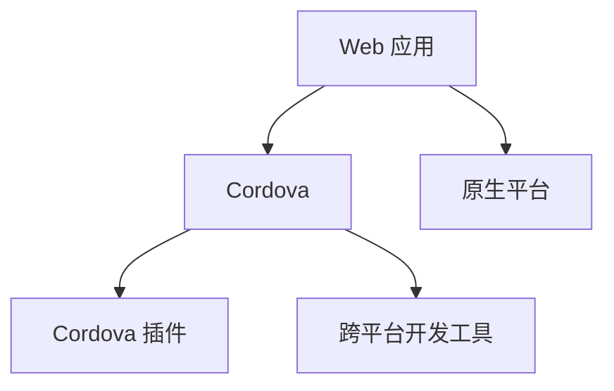

                 

# Cordova 混合应用开发：在原生平台上运行 Web 应用

> 关键词：Cordova, Web 应用, 混合应用开发, 原生平台, 跨平台开发, 开发者工具

## 1. 背景介绍

### 1.1 问题由来
随着移动设备的普及和互联网的发展，Web 应用已经成为了企业和个人用户日常使用的主要方式之一。然而，Web 应用的性能和用户体验往往难以与原生应用相比，特别是在处理复杂交互和大量数据时，Web 应用的性能瓶颈问题尤为突出。为了弥合这一差距，一种新的开发范式应运而生，这就是 Cordova 混合应用开发。

### 1.2 问题核心关键点
Cordova 混合应用开发的核心思想是利用 Web 技术的灵活性和原生应用的性能优势，将 Web 应用嵌入到原生应用中。这种开发方式不仅能够提高应用性能，还能降低开发成本，缩短开发周期，同时保持跨平台的兼容性。

这种混合开发模式的关键在于：
1. 如何利用 Web 技术的跨平台特性，构建出原生应用般的用户体验。
2. 如何在原生平台上运行 Web 应用，实现 Web 应用的性能提升。
3. 如何利用 Cordova 等工具，简化混合应用的开发过程，提高开发效率。

### 1.3 问题研究意义
Cordova 混合应用开发在当前移动应用市场中扮演着越来越重要的角色，它不仅能够为 Web 开发者提供一种高效、灵活的开发工具，还能够为企业和个人用户提供更加稳定、高效的应用体验。研究 Cordova 混合应用开发的方法和工具，对于提升 Web 应用性能、推动移动应用技术的发展具有重要意义。

## 2. 核心概念与联系

### 2.1 核心概念概述

为了更好地理解 Cordova 混合应用开发的原理和实现方法，本节将介绍几个关键概念：

- **Cordova**：一个基于 Apache Cordova 的开源框架，支持将 Web 应用封装成原生应用，支持多种平台，包括 iOS、Android、Windows Phone 等。
- **Web 应用**：通过浏览器运行的应用，通常基于 HTML、CSS 和 JavaScript 等 Web 技术开发，具有跨平台特性。
- **混合应用开发**：结合 Web 技术开发和原生平台开发的开发模式，利用 Web 技术的灵活性和原生平台的性能优势。
- **跨平台开发**：在多种操作系统和设备上运行的应用开发模式，通过统一的开发工具和技术实现。

这些概念之间的逻辑关系可以通过以下 Mermaid 流程图来展示：



这个流程图展示了 Cordova 混合应用开发的基本流程：

1. 利用 Web 技术开发 Web 应用。
2. 通过 Cordova 将 Web 应用封装成原生应用。
3. Cordova 提供了多种平台的原生插件，用于增强 Web 应用的功能。
4. 使用 Cordova 等跨平台开发工具简化混合应用的开发过程。

## 3. 核心算法原理 & 具体操作步骤
### 3.1 算法原理概述

Cordova 混合应用开发的核心算法原理可以简单概括为以下几点：

- **Web 应用封装**：利用 Cordova 等工具，将 Web 应用封装成原生应用，通过桥接技术实现 Web 应用和原生平台的交互。
- **原生插件增强**：通过 Cordova 提供的插件，增强 Web 应用的功能，提升性能和用户体验。
- **跨平台开发**：利用 Cordova 等工具，简化混合应用的开发过程，实现跨平台兼容。

### 3.2 算法步骤详解

Cordova 混合应用开发的算法步骤主要包括：

1. **准备开发环境**：安装 Cordova 框架，配置开发工具和原生平台的环境变量。
2. **创建项目**：使用 Cordova 工具创建新的混合应用项目，定义项目的基本结构。
3. **开发 Web 应用**：使用 Web 技术（如 HTML、CSS 和 JavaScript）开发 Web 应用，实现应用的基本功能。
4. **集成 Cordova 插件**：根据应用需求，选择和集成 Cordova 提供的插件，增强 Web 应用的功能。
5. **编译和打包**：使用 Cordova 工具编译和打包 Web 应用，生成原生应用包，支持多种平台。
6. **发布和部署**：将生成的原生应用包发布到应用商店或企业内部渠道，供用户下载和使用。

### 3.3 算法优缺点

Cordova 混合应用开发具有以下优点：

1. **跨平台兼容**：能够跨多个操作系统和设备运行，降低了跨平台开发的风险。
2. **开发效率高**：利用 Web 技术的灵活性，能够快速开发出具有原生应用体验的 Web 应用。
3. **开发成本低**：与原生应用开发相比，Cordova 混合应用开发需要的技术和人力成本较低。
4. **性能优化**：通过 Cordova 提供的插件，可以增强 Web 应用的功能和性能。

同时，Cordova 混合应用开发也存在以下缺点：

1. **性能瓶颈**：由于 Web 技术本身的性能限制，Cordova 混合应用在处理复杂交互和大量数据时，性能仍然存在瓶颈。
2. **兼容性问题**：不同平台的原生插件和功能可能存在兼容性问题，需要开发者进行额外的调试和测试。
3. **用户体验不统一**：由于 Web 应用和原生平台的差异，用户在不同平台上的体验可能不一致。
4. **更新和维护成本**：混合应用的维护和更新相对于原生应用来说更为复杂，需要更多的技术投入。

### 3.4 算法应用领域

Cordova 混合应用开发在以下领域有着广泛的应用：

1. **企业内部应用**：用于内部协同办公、项目管理、文档管理等场景，提高企业效率。
2. **移动教育**：用于移动教育平台，支持在线课程学习、互动讨论等功能。
3. **移动医疗**：用于移动医疗应用，支持预约挂号、在线诊疗等功能。
4. **旅游应用**：用于旅游类应用，支持景点介绍、路线规划等功能。
5. **电商应用**：用于电商类应用，支持在线购物、订单管理等功能。
6. **金融应用**：用于金融类应用，支持理财、投资、支付等功能。

## 4. 数学模型和公式 & 详细讲解  
### 4.1 数学模型构建

在 Cordova 混合应用开发中，数学模型的构建主要涉及以下几个方面：

- **Web 应用性能优化**：通过分析 Web 应用的性能瓶颈，选择合适的优化策略，如代码压缩、图片优化、缓存等。
- **原生插件功能增强**：通过分析原生插件的功能和性能，选择合适的插件，进行性能测试和优化。
- **跨平台开发效率提升**：通过分析 Cordova 等跨平台开发工具的功能和性能，选择合适的工具，进行性能测试和优化。

### 4.2 公式推导过程

以下是一些常用的性能优化公式和计算方法：

- **Web 应用性能优化**：
  $$
  \text{优化后性能} = \text{优化前性能} \times \left(1 - \frac{\text{优化成本}}{\text{优化收益}}\right)
  $$

- **原生插件功能增强**：
  $$
  \text{增强后性能} = \text{原性能} \times \left(1 + \frac{\text{功能提升}}{\text{资源消耗}}\right)
  $$

- **跨平台开发效率提升**：
  $$
  \text{开发效率} = \frac{\text{优化前后开发时间}}{\text{优化前后开发时间} - \text{优化时间}}
  $$

### 4.3 案例分析与讲解

以下是一个典型的 Cordova 混合应用开发案例：

1. **项目需求**：开发一个企业内部协同办公应用，支持移动端和桌面端，包括任务管理、日程安排、文件共享等功能。
2. **开发环境准备**：安装 Cordova 框架，配置开发工具和原生平台的环境变量。
3. **项目结构和代码实现**：
  - 使用 Web 技术（如 HTML、CSS 和 JavaScript）开发 Web 应用，实现任务管理、日程安排、文件共享等功能。
  - 集成 Cordova 提供的插件，增强 Web 应用的功能，如离线存储、本地通知、地理位置等功能。
  - 使用 Cordova 工具编译和打包 Web 应用，生成原生应用包，支持 iOS、Android 等多个平台。
4. **测试和优化**：在原生平台上进行测试，分析性能瓶颈，进行代码压缩、图片优化、缓存等性能优化。
5. **发布和部署**：将生成的原生应用包发布到应用商店或企业内部渠道，供用户下载和使用。

## 5. 项目实践：代码实例和详细解释说明
### 5.1 开发环境搭建

以下是使用 Cordova 进行混合应用开发的开发环境搭建流程：

1. **安装 Cordova**：从官网下载 Cordova 框架，安装到本地计算机。
2. **配置开发工具**：安装 Android Studio、Xcode、Visual Studio 等开发工具，配置原生平台的环境变量。
3. **创建项目**：使用 Cordova 工具创建新的混合应用项目，定义项目的基本结构。

### 5.2 源代码详细实现

以下是使用 Cordova 进行混合应用开发的源代码实现示例：

```javascript
// Cordova 配置文件
cordova.init({
  platforms: ['ios', 'android'],
  platformSpecificConfigurations: {
    ios: {
      platformVersion: '11.0'
    },
    android: {
      platformVersion: '28.0'
    }
  }
});

// Web 应用代码实现
var app = document.addEventListener('DOMContentLoaded', function() {
  // 添加任务管理功能
  var taskList = document.getElementById('taskList');
  taskList.addEventListener('click', function() {
    // 处理任务管理逻辑
  });

  // 添加日程安排功能
  var calendar = document.getElementById('calendar');
  calendar.addEventListener('click', function() {
    // 处理日程安排逻辑
  });

  // 添加文件共享功能
  var fileManager = document.getElementById('fileManager');
  fileManager.addEventListener('click', function() {
    // 处理文件共享逻辑
  });
});

// 集成 Cordova 插件
var plugin = {
  name: 'cordova-plugin-file',
  options: {
    framework: 'cordova-plugin-file'
  }
};
cordova.plugins.add({
  platforms: ['ios', 'android'],
  platformSpecificConfigurations: {
    ios: {
      platformVersion: '11.0'
    },
    android: {
      platformVersion: '28.0'
    }
  },
  success: function() {
    // 插件安装成功
  },
  error: function() {
    // 插件安装失败
  }
});

// 编译和打包
cordova.compileAndPackage({
  platforms: ['ios', 'android'],
  platformSpecificConfigurations: {
    ios: {
      platformVersion: '11.0'
    },
    android: {
      platformVersion: '28.0'
    }
  },
  success: function() {
    // 编译和打包成功
  },
  error: function() {
    // 编译和打包失败
  }
});

// 发布和部署
cordova.push({
  platforms: ['ios', 'android'],
  platformSpecificConfigurations: {
    ios: {
      platformVersion: '11.0'
    },
    android: {
      platformVersion: '28.0'
    }
  },
  success: function() {
    // 发布和部署成功
  },
  error: function() {
    // 发布和部署失败
  }
});
```

### 5.3 代码解读与分析

以下是代码实现的一些关键点：

- **Cordova 配置文件**：定义混合应用项目的基本信息和平台配置，确保在不同平台上的兼容性。
- **Web 应用代码实现**：使用 Web 技术实现任务管理、日程安排、文件共享等核心功能，通过事件监听处理用户交互。
- **集成 Cordova 插件**：选择和集成 Cordova 提供的插件，增强 Web 应用的功能，如离线存储、本地通知、地理位置等。
- **编译和打包**：使用 Cordova 工具编译和打包 Web 应用，生成原生应用包，支持 iOS、Android 等多个平台。
- **发布和部署**：将生成的原生应用包发布到应用商店或企业内部渠道，供用户下载和使用。

## 6. 实际应用场景
### 6.1 智能办公应用

Cordova 混合应用开发在智能办公应用中有着广泛的应用，能够为企业员工提供高效的协同办公体验。

在智能办公应用中，Cordova 混合应用开发可以集成多种功能，如任务管理、日程安排、文件共享、视频会议等。通过 Web 技术的灵活性和原生平台的性能优势，能够快速开发出具有原生应用体验的智能办公应用。

### 6.2 移动电商应用

Cordova 混合应用开发在移动电商应用中也得到了广泛应用，能够为电商平台提供高效的移动端体验。

在移动电商应用中，Cordova 混合应用开发可以集成多种功能，如商品浏览、订单管理、支付功能等。通过 Web 技术的灵活性和原生平台的性能优势，能够快速开发出具有原生应用体验的移动电商应用。

### 6.3 旅游应用

Cordova 混合应用开发在旅游应用中也得到了广泛应用，能够为用户提供优质的旅游体验。

在旅游应用中，Cordova 混合应用开发可以集成多种功能，如景点介绍、路线规划、酒店预订等。通过 Web 技术的灵活性和原生平台的性能优势，能够快速开发出具有原生应用体验的旅游应用。

## 7. 工具和资源推荐
### 7.1 学习资源推荐

为了帮助开发者系统掌握 Cordova 混合应用开发的理论基础和实践技巧，这里推荐一些优质的学习资源：

1. **Cordova 官方文档**：Cordova 的官方文档，详细介绍了 Cordova 框架的使用方法和最佳实践。
2. **《Web 开发入门》系列书籍**：全面介绍了 Web 技术的基础知识，包括 HTML、CSS、JavaScript 等。
3. **《Cordova 混合应用开发》课程**：由 Cordova 专家开设的课程，详细介绍了 Cordova 框架的使用方法和最佳实践。
4. **《Cordova 混合应用开发实战》书籍**：基于实际项目，详细介绍了 Cordova 混合应用开发的开发流程和方法。

### 7.2 开发工具推荐

以下是几款用于 Cordova 混合应用开发的常用工具：

1. **Android Studio**：Android 应用的开发工具，提供了强大的开发和调试功能。
2. **Xcode**：iOS 应用的开发工具，提供了强大的开发和调试功能。
3. **Visual Studio**：Windows 应用的开发工具，提供了强大的开发和调试功能。
4. **WebStorm**：Web 应用的开发工具，提供了强大的开发和调试功能。
5. **IntelliJ IDEA**：跨平台的开发工具，支持多种编程语言和框架。

### 7.3 相关论文推荐

Cordova 混合应用开发在学术界和工业界的研究也日益增多，以下是几篇奠基性的相关论文，推荐阅读：

1. **《Cordova 混合应用开发技术研究》**：详细介绍 Cordova 混合应用开发的原理和实现方法。
2. **《Cordova 混合应用开发最佳实践》**：总结 Cordova 混合应用开发的最佳实践和常见问题。
3. **《Cordova 混合应用开发性能优化技术》**：详细介绍了 Cordova 混合应用开发的性能优化技术。

## 8. 总结：未来发展趋势与挑战
### 8.1 总结

本文对 Cordova 混合应用开发的原理和实现方法进行了全面系统的介绍。首先阐述了 Cordova 混合应用开发的背景和意义，明确了混合应用开发在提升 Web 应用性能、降低开发成本方面的独特价值。其次，从原理到实践，详细讲解了 Cordova 混合应用开发的数学原理和关键步骤，给出了混合应用开发的完整代码实例。同时，本文还广泛探讨了 Cordova 混合应用开发在智能办公、移动电商、旅游等众多行业领域的应用前景，展示了 Cordova 混合应用开发的技术潜力。

通过本文的系统梳理，可以看到，Cordova 混合应用开发在当前移动应用市场中扮演着越来越重要的角色，它不仅能够为 Web 开发者提供一种高效、灵活的开发工具，还能够为企业和个人用户提供更加稳定、高效的应用体验。未来，伴随 Cordova 框架和相关工具的不断演进，相信 Cordova 混合应用开发必将在更多领域得到应用，为传统行业数字化转型升级提供新的技术路径。

### 8.2 未来发展趋势

展望未来，Cordova 混合应用开发技术将呈现以下几个发展趋势：

1. **跨平台兼容性增强**：随着 Cordova 框架和相关工具的不断演进，混合应用将在更多平台和设备上实现无缝兼容，提供更加统一的开发和用户体验。
2. **性能优化提升**：通过 Web 技术和原生平台的融合，混合应用的性能将不断提升，能够满足复杂交互和大量数据处理的需求。
3. **功能丰富化**：Cordova 插件和工具将不断丰富，提供更多的功能和性能提升方案，满足不同应用的需求。
4. **开发效率提高**：随着 Cordova 框架和相关工具的优化和改进，混合应用的开发效率将不断提高，缩短开发周期和降低开发成本。

### 8.3 面临的挑战

尽管 Cordova 混合应用开发技术已经取得了显著成果，但在迈向更加智能化、普适化应用的过程中，仍面临以下挑战：

1. **性能瓶颈**：Cordova 混合应用在处理复杂交互和大量数据时，仍存在性能瓶颈，需要进一步优化。
2. **兼容性问题**：不同平台的原生插件和功能可能存在兼容性问题，需要开发者进行额外的调试和测试。
3. **用户体验不统一**：由于 Web 应用和原生平台的差异，用户在不同平台上的体验可能不一致。
4. **更新和维护成本**：混合应用的维护和更新相对于原生应用来说更为复杂，需要更多的技术投入。

### 8.4 研究展望

面对 Cordova 混合应用开发所面临的挑战，未来的研究需要在以下几个方面寻求新的突破：

1. **性能优化**：研究 Web 技术和原生平台的融合，提升混合应用的性能和用户体验。
2. **兼容性改进**：研究不同平台的原生插件和功能的兼容性问题，提供更加统一的开发和用户体验。
3. **用户体验提升**：研究 Web 技术和原生平台的融合，提升混合应用的性能和用户体验。
4. **开发效率提高**：研究 Cordova 框架和相关工具的优化和改进，提高混合应用的开发效率。

这些研究方向的探索，必将引领 Cordova 混合应用开发技术迈向更高的台阶，为 Web 应用开发者提供更加高效、灵活的开发工具，为移动应用开发者提供更加稳定、高效的应用体验。

## 9. 附录：常见问题与解答

**Q1：Cordova 混合应用开发和原生应用开发有什么区别？**

A: Cordova 混合应用开发和原生应用开发的最大区别在于开发环境和开发方式。原生应用开发需要针对不同平台分别开发和优化，开发成本和周期较高。而 Cordova 混合应用开发则通过 Web 技术的跨平台特性，利用 Cordova 等工具将 Web 应用封装成原生应用，减少了开发成本和周期，提高了开发效率。

**Q2：Cordova 混合应用开发有哪些优缺点？**

A: Cordova 混合应用开发的优点包括：

1. 跨平台兼容：能够在多种操作系统和设备上运行，降低了跨平台开发的风险。
2. 开发效率高：利用 Web 技术的灵活性，能够快速开发出具有原生应用体验的 Web 应用。
3. 开发成本低：与原生应用开发相比，Cordova 混合应用开发需要的技术和人力成本较低。
4. 性能优化：通过 Cordova 提供的插件，可以增强 Web 应用的功能和性能。

其缺点包括：

1. 性能瓶颈：由于 Web 技术本身的性能限制，Cordova 混合应用在处理复杂交互和大量数据时，性能仍然存在瓶颈。
2. 兼容性问题：不同平台的原生插件和功能可能存在兼容性问题，需要开发者进行额外的调试和测试。
3. 用户体验不统一：由于 Web 应用和原生平台的差异，用户在不同平台上的体验可能不一致。
4. 更新和维护成本：混合应用的维护和更新相对于原生应用来说更为复杂，需要更多的技术投入。

**Q3：如何提高 Cordova 混合应用的性能？**

A: 提高 Cordova 混合应用的性能可以从以下几个方面入手：

1. 代码优化：进行代码压缩、图片优化、缓存等性能优化。
2. 插件选择：选择性能优化良好的原生插件，增强 Web 应用的功能和性能。
3. 开发工具优化：使用 WebStorm、IntelliJ IDEA 等高效的开发工具，提高开发效率。
4. 性能测试：通过性能测试工具，分析性能瓶颈，进行优化。

**Q4：如何降低 Cordova 混合应用的开发成本？**

A: 降低 Cordova 混合应用的开发成本可以从以下几个方面入手：

1. 使用 Web 技术：利用 Web 技术的灵活性和跨平台特性，快速开发出具有原生应用体验的 Web 应用。
2. 使用 Cordova 框架：通过 Cordova 框架将 Web 应用封装成原生应用，减少开发成本和周期。
3. 使用 Cordova 插件：选择性能优化良好的原生插件，增强 Web 应用的功能和性能，减少开发成本。
4. 使用开发工具：使用 WebStorm、IntelliJ IDEA 等高效的开发工具，提高开发效率，减少开发成本。

**Q5：Cordova 混合应用开发有哪些实际应用场景？**

A: Cordova 混合应用开发在以下领域有着广泛的应用：

1. 企业内部应用：用于内部协同办公、项目管理、文档管理等场景，提高企业效率。
2. 移动教育：用于移动教育平台，支持在线课程学习、互动讨论等功能。
3. 移动医疗：用于移动医疗应用，支持预约挂号、在线诊疗等功能。
4. 旅游应用：用于旅游类应用，支持景点介绍、路线规划等功能。
5. 电商应用：用于电商类应用，支持在线购物、订单管理等功能。
6. 金融应用：用于金融类应用，支持理财、投资、支付等功能。

以上是 Cordova 混合应用开发在实际应用中的典型场景，随着技术的不断发展和应用领域的拓展，Cordova 混合应用开发将会有更广泛的应用前景。

