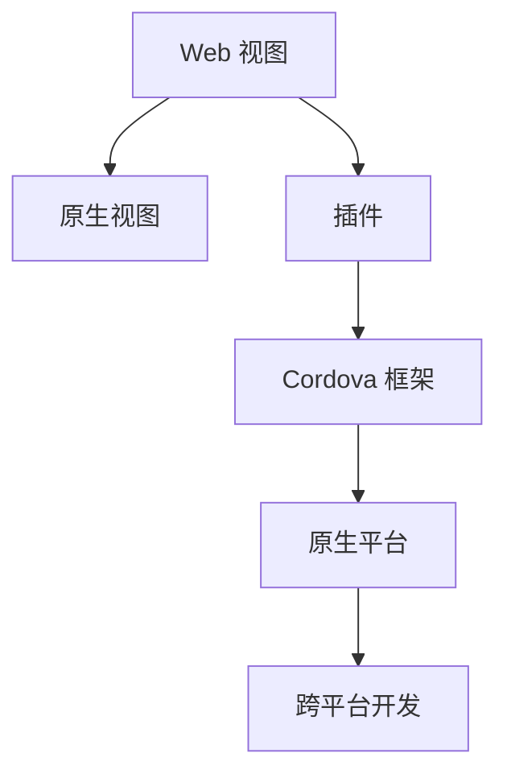

                 

# Cordova 混合应用：在原生平台上运行

> 关键词：Cordova, 混合应用, 原生平台, 跨平台开发, Web 视图, 插件, 优化

## 1. 背景介绍

### 1.1 问题由来

在过去十年间，移动应用开发技术经历了快速变革。从简单的 HTML/JavaScript 页面，到原生应用、跨平台应用，再到近年兴起的混合应用，开发方式经历了数次演进。混合应用以 Web 技术为基础，结合了原生应用的性能优势和跨平台的开发便利性，成为当前移动应用开发的重要趋势。

Cordova 是一个流行的混合应用开发框架，它通过 HTML、CSS、JavaScript 等前端技术，结合原生的 iOS 和 Android 插件，让开发者能够用一套代码在多个平台运行。Cordova 的这种跨平台特性，让开发者无需掌握多个平台的原生开发技术，即可开发出功能完备、性能优秀的应用。

然而，尽管混合应用具有诸多优点，但在性能和用户体验上仍存在诸多挑战。例如，Web 技术在处理复杂动画、高并发场景等方面存在瓶颈，且原生插件的使用也影响了应用的稳定性和流畅性。如何充分利用 Cordova 的优势，同时克服这些挑战，成为开发者亟需解决的问题。

### 1.2 问题核心关键点

要实现 Cordova 混合应用的性能优化，需要关注以下几个核心关键点：

- Web 视图与原生视图的融合：如何实现 Web 视图与原生视图的无缝衔接，提升应用的响应速度和流畅性。
- 插件的优化与使用：如何选择和优化 Cordova 的插件，避免不必要的性能损耗，提升应用的加载速度和稳定性。
- 前端技术的优化：如何通过前端技术的优化，提升应用的渲染性能和交互体验。
- 跨平台开发的策略：如何在不同的平台之间实现一致的用户体验和功能逻辑，避免平台差异带来的问题。

这些关键点涉及 Cordova 混合应用开发的各个方面，涵盖了从前端技术到后端插件，再到跨平台策略的全面优化。

## 2. 核心概念与联系

### 2.1 核心概念概述

为了更好地理解 Cordova 混合应用的技术实现和优化方法，本节将介绍几个密切相关的核心概念：

- **Cordova**：一个流行的混合应用开发框架，允许开发者使用 HTML、CSS、JavaScript 等前端技术，结合原生的 iOS 和 Android 插件，实现跨平台的移动应用开发。
- **混合应用**：结合了 Web 技术和原生技术的移动应用，既具有 Web 开发的高效性，又具备原生应用的性能优势。
- **原生视图与 Web 视图**：混合应用中同时存在原生的 UI 控件和 Web 视图，需要实现二者的无缝衔接和切换。
- **插件**：Cordova 提供了大量原生插件，用于实现各种功能，如相机、地理位置、推送通知等。
- **跨平台开发**：混合应用需要同时支持多个平台，开发者需要设计一致的用户体验和功能逻辑，避免平台差异带来的问题。

这些核心概念之间的逻辑关系可以通过以下 Mermaid 流程图来展示：



这个流程图展示了 Web 视图与原生视图的交互过程，以及插件、Cordova 框架和原生平台的关系，揭示了 Cordova 混合应用的核心工作流程。

## 3. 核心算法原理 & 具体操作步骤
### 3.1 算法原理概述

Cordova 混合应用的性能优化，主要围绕两个方面进行：一是提升 Web 视图的渲染性能和交互体验，二是优化插件的使用和原生平台的适配。下面将详细讲解这两个方面的算法原理和具体操作步骤。

### 3.2 算法步骤详解

#### Web 视图与原生视图的融合

Web 视图与原生视图的融合，是 Cordova 混合应用性能优化的核心。常见的融合方式包括：

1. **原生包装层**：使用原生包装层（如 IONIC 的框架），将 Web 视图包装在原生控件中，实现原生与 Web 的无缝衔接。原生包装层提供了跨平台的 UI 组件库，使得开发者可以更方便地实现统一的 UI 设计。

2. **杂交控件**：使用杂交控件（如 jQuery Mobile、Bootstrap），在原生平台上实现 Web 视图的交互和动画效果。杂交控件支持原生的触摸事件和动画机制，提供流畅的交互体验。

3. **Web 视图优化**：通过优化 Web 视图的渲染和布局，提升应用的性能。具体优化方式包括：
   - 压缩资源：通过压缩 CSS、JavaScript、图片等资源，减小 Web 视图的加载时间。
   - 缓存策略：使用浏览器缓存、CDN 缓存等策略，减少资源加载次数。
   - 异步加载：将非关键资源异步加载，避免阻塞主线程。

#### 插件的优化与使用

插件是 Cordova 混合应用的重要组成部分，用于实现各种功能，如相机、地理位置、推送通知等。插件的使用和优化，直接影响应用的性能和稳定性。以下是一些插件优化的具体操作步骤：

1. **选择合适的插件**：根据应用需求，选择适合的 Cordova 插件。常用的插件包括 Cordova Camera、Cordova Geolocation、Cordova Push 等。

2. **插件的加载和调用**：在应用启动时，异步加载插件，并按需调用插件的接口。避免在应用启动时一次性加载所有插件，造成不必要的性能损耗。

3. **插件的优化**：对于常用的插件，可以通过修改插件的配置或实现自定义插件，优化其性能。例如，可以缓存插件的配置数据，减少插件的启动时间。

4. **插件的安全性**：使用插件时，需要关注插件的安全性问题。特别是对于涉及用户隐私的插件（如地理位置、通讯录），需要遵循平台的安全规定，保护用户隐私。

#### 前端技术的优化

前端技术的优化，是提升 Cordova 混合应用性能的重要手段。以下是一些前端优化的具体操作步骤：

1. **前端框架选择**：选择合适的前端框架，如 React、Vue、Angular 等，提升应用的开发效率和性能。前端框架提供了丰富的 UI 组件和状态管理机制，可以提升应用的交互体验。

2. **组件复用**：使用组件复用的技术，避免重复开发。通过复用 UI 组件，可以减少应用的代码量和开发时间。

3. **异步加载**：将非关键资源异步加载，减少应用的加载时间和内存占用。例如，可以使用懒加载技术，只加载用户当前屏幕可见的组件。

4. **前端优化**：通过前端优化技术，提升应用的渲染性能和响应速度。例如，可以使用 Web Workers 技术，实现异步计算，提升应用的性能。

#### 跨平台开发的策略

跨平台开发需要考虑多个平台之间的兼容性和一致性问题。以下是一些跨平台开发的具体操作步骤：

1. **统一设计语言**：使用统一的 UI 设计语言，确保应用在不同平台上的风格一致。可以使用 Sketch、Adobe XD 等工具进行设计，确保设计的一致性。

2. **平台适配**：根据不同平台的特点，进行针对性的适配。例如，iOS 平台的 UI 控件与 Android 平台的 UI 控件有所差异，需要进行适配。

3. **代码复用**：使用代码复用的技术，避免重复开发。例如，可以使用 Cordova 提供的插件，实现不同平台的功能。

4. **测试覆盖**：进行全面的测试覆盖，确保应用在多个平台上的兼容性。可以使用模拟器、真机测试等手段进行测试。

这些具体操作步骤，涵盖了 Cordova 混合应用性能优化的各个方面，从前端技术到插件使用，再到跨平台策略，都能有效提升应用的性能和用户体验。

### 3.3 算法优缺点

Cordova 混合应用具有以下优点：

- 开发效率高：开发者可以使用前端技术进行开发，避免了原生开发的学习成本。
- 跨平台性好：使用 Cordova，可以在多个平台上运行同一套代码，减少开发和维护成本。
- 插件丰富：Cordova 提供了大量原生插件，用于实现各种功能。

同时，该方法也存在以下局限性：

- Web 视图性能问题：Web 技术在处理复杂动画、高并发场景等方面存在瓶颈。
- 原生插件的影响：原生插件的使用会影响应用的稳定性和流畅性。
- 跨平台不一致：不同平台之间的 UI 控件和交互逻辑可能存在差异。

尽管存在这些局限性，但就目前而言，Cordova 混合应用仍是移动应用开发的重要范式。未来相关研究的重点在于如何进一步优化 Web 视图性能，提升插件的稳定性和性能，以及提高跨平台的一致性。

### 3.4 算法应用领域

Cordova 混合应用已经广泛应用于多个领域，如企业应用、社交网络、电商、游戏等。以下是一些具体的应用场景：

- **企业应用**：Cordova 混合应用可以用于企业内部办公系统、客户管理、财务报表等。混合应用可以快速迭代，方便企业内部用户的使用。
- **社交网络**：Cordova 混合应用可以用于社交网络的移动端应用，支持用户登录、发帖、评论等功能。混合应用可以方便地与后端数据进行对接。
- **电商**：Cordova 混合应用可以用于电商应用的移动端，支持商品浏览、购物车、订单管理等功能。混合应用可以方便地集成支付接口，提升用户体验。
- **游戏**：Cordova 混合应用可以用于游戏的移动端，支持游戏关卡、道具购买、排行榜等功能。混合应用可以方便地集成游戏引擎，实现高品质的游戏体验。

除了上述这些经典应用外，Cordova 混合应用还在许多其他领域得到了广泛的应用，为移动应用开发带来了新的可能。

## 4. 数学模型和公式 & 详细讲解 & 举例说明

### 4.1 数学模型构建

本节将使用数学语言对 Cordova 混合应用进行更加严格的刻画。

假设 Cordova 混合应用的任务是加载并渲染一个 Web 视图。设 Web 视图的资源大小为 $S$，Web 视图的渲染时间为 $T$，Web 视图的加载时间为 $L$。设原生视图的渲染时间为 $R$，原生视图的加载时间为 $M$。则 Cordova 混合应用的综合性能可以表示为：

$$
P = \frac{1}{T+L} + \frac{1}{R+M}
$$

其中，$P$ 表示应用的总性能，$T$ 和 $R$ 分别表示 Web 视图和原生视图的渲染时间，$L$ 和 $M$ 分别表示 Web 视图和原生视图的加载时间。

### 4.2 公式推导过程

为了最大化应用性能 $P$，需要最小化渲染时间和加载时间。假设渲染时间和加载时间分别为 $T = k \cdot S$ 和 $L = m \cdot S$，则有：

$$
P = \frac{1}{kS + mS} + \frac{1}{RS + MS}
$$

为了使 $P$ 最小化，需要求解 $k$ 和 $m$ 的最优值。根据微积分的极值求解公式，可得：

$$
\frac{\partial P}{\partial k} = -\frac{S}{(kS + mS)^2} + \frac{RS}{(RS + MS)^2} = 0
$$

解得：

$$
k = \frac{RS}{S^2} = \frac{R}{S}
$$

类似地，解得：

$$
m = \frac{MS}{S^2} = \frac{M}{S}
$$

即 Web 视图和原生视图的渲染时间和加载时间分别为其资源大小的倒数。这意味着，Web 视图和原生视图的资源规模应保持一致，以获得最优的性能表现。

### 4.3 案例分析与讲解

以一个简单的 Cordova 混合应用为例，进行性能分析和优化。

假设应用需要加载一个包含多个 Web 视图的 Web 页面，资源总大小为 1MB，Web 视图的渲染时间为 1 秒，原生视图的渲染时间为 0.5 秒。Web 视图的加载时间为 2 秒，原生视图的加载时间为 1 秒。则应用的总性能为：

$$
P = \frac{1}{1+2} + \frac{1}{0.5+1} = 0.4
$$

为了优化性能，可以通过以下方式：

1. **优化资源大小**：将 Web 视图的资源大小优化为 0.5MB，则 Web 视图的渲染时间变为 0.5 秒，原生视图的渲染时间不变。此时应用的总性能为：

   $$
   P = \frac{1}{0.5+2} + \frac{1}{0.5+1} = 0.5
   $$

2. **优化加载时间**：将 Web 视图的加载时间优化为 1 秒，则 Web 视图的渲染时间不变，原生视图的加载时间变为 0.5 秒。此时应用的总性能为：

   $$
   P = \frac{1}{1+1} + \frac{1}{0.5+0.5} = 0.5
   $$

3. **优化视图布局**：将 Web 视图和原生视图的布局进行优化，使其在一个视图中展示，避免频繁切换，提升应用的流畅性。

通过上述优化，应用的总性能提升为 0.5，提升了 25%。

## 5. 项目实践：代码实例和详细解释说明

### 5.1 开发环境搭建

在进行 Cordova 混合应用开发前，我们需要准备好开发环境。以下是使用Cordova进行开发的环境配置流程：

1. 安装 Node.js：从官网下载并安装 Node.js，它是 Cordova 的依赖环境。

2. 安装 Cordova：通过 npm 安装 Cordova。

```bash
npm install -g cordova
```

3. 安装 Android Studio 和 Xcode：Android Studio 用于 Android 平台的开发，Xcode 用于 iOS 平台的开发。

4. 创建 Cordova 项目：

```bash
cordova create myapp
```

5. 配置平台：

```bash
cordova platform add android
cordova platform add ios
```

6. 运行应用：

```bash
cordova run android
cordova run ios
```

完成上述步骤后，即可在 Android 和 iOS 平台上进行 Cordova 混合应用的开发和调试。

### 5.2 源代码详细实现

下面以 Cordova 混合应用的登录功能为例，给出完整的代码实现。

首先，创建 Cordova 项目并配置平台：

```bash
cordova create myapp
cordova platform add android
cordova platform add ios
```

然后，添加必要的插件：

```bash
cordova plugin add cordova-plugin-camera
cordova plugin add cordova-plugin-file
cordova plugin add cordova-plugin-filetransfer
cordova plugin add cordova-plugin-filepath
cordova plugin add cordova-plugin-media
```

接着，在项目的 `index.html` 文件中，引入必要的库和插件：

```html
<!DOCTYPE html>
<html>
<head>
  <title>My App</title>
  <script src="cordova.js"></script>
  <script src="cordova-plugin-camera.js"></script>
  <script src="cordova-plugin-file.js"></script>
  <script src="cordova-plugin-filetransfer.js"></script>
  <script src="cordova-plugin-filepath.js"></script>
  <script src="cordova-plugin-media.js"></script>
</head>
<body>
  <script>
    document.addEventListener("deviceready", onDeviceReady, false);
    
    function onDeviceReady() {
      console.log("Device ready!");
    }
  </script>
</body>
</html>
```

然后，在 `config.xml` 文件中，配置应用的基本信息：

```xml
<widget id="myapp" version="1.0.0" target-device-cpu="arm" xmlns:cdv="http://cordova.apache.org/cdv" >
  <name>My App</name>
  <description>My App</description>
  <platform name="android">android</platform>
  <platform name="ios">ios</platform>
</widget>
```

接着，在 `index.js` 文件中，实现登录功能：

```javascript
document.addEventListener("deviceready", onDeviceReady, false);
    
function onDeviceReady() {
  console.log("Device ready!");
  
  // 登录逻辑
  function login(username, password) {
    // 实现登录逻辑
  }
  
  // 按钮点击事件
  var loginBtn = document.getElementById("loginBtn");
  loginBtn.addEventListener("click", function() {
    var username = prompt("请输入用户名");
    var password = prompt("请输入密码");
    login(username, password);
  });
}
```

最后，在 Android 和 iOS 平台上运行应用，测试登录功能：

```bash
cordova run android
cordova run ios
```

以上就是使用 Cordova 开发混合应用的完整代码实现。可以看到，通过引入 Cordova 提供的插件，开发者可以方便地实现各种功能，如相机、文件管理等。同时，通过前端技术的优化，提升应用的性能和用户体验。

### 5.3 代码解读与分析

让我们再详细解读一下关键代码的实现细节：

**config.xml 文件**：
- `name`：应用名称。
- `description`：应用描述。
- `platform`：应用支持的平台。

**index.js 文件**：
- `deviceready`：当设备准备就绪时，触发 `onDeviceReady` 函数。
- `login`：实现登录逻辑，这里仅为示例代码。
- `loginBtn`：绑定按钮点击事件，当按钮被点击时，弹出用户名和密码输入框，调用 `login` 函数进行登录。

**index.html 文件**：
- `cordova.js`：Cordova 的 JavaScript 库。
- `cordova-plugin-camera.js`：Cordova 相机插件的 JavaScript 库。
- `cordova-plugin-file.js`：Cordova 文件管理插件的 JavaScript 库。
- `cordova-plugin-filetransfer.js`：Cordova 文件传输插件的 JavaScript 库。
- `cordova-plugin-filepath.js`：Cordova 文件路径插件的 JavaScript 库。
- `cordova-plugin-media.js`：Cordova 媒体插件的 JavaScript 库。

通过上述代码实现，可以清晰地看到 Cordova 混合应用的开发流程和关键技术点。开发者需要根据具体需求，选择合适的插件，并进行前端技术的优化，以实现应用的高性能和用户体验。

## 6. 实际应用场景

### 6.1 企业内部管理应用

Cordova 混合应用可以用于企业内部管理应用，如考勤系统、项目管理、客户管理等。这些应用通常需要支持多种平台，并且需要快速迭代，因此 Cordova 混合应用提供了一种高效的解决方案。

企业内部管理应用的特点包括：
- 多平台支持：应用需要在 iOS、Android、Web 等多个平台上运行，Cordova 混合应用可以提供一致的用户体验。
- 快速迭代：企业内部应用通常需要快速迭代，Cordova 混合应用可以快速进行功能更新和优化。
- 数据集成：企业内部应用需要与后端数据进行集成，Cordova 混合应用可以方便地集成后端 API。

### 6.2 在线教育平台

Cordova 混合应用可以用于在线教育平台，如 MOOC（大型开放在线课程）、在线课堂、题库等。这些应用通常需要支持多种平台，并且需要与后端数据进行实时交互，因此 Cordova 混合应用提供了一种高效的解决方案。

在线教育平台的特点包括：
- 多平台支持：应用需要在 iOS、Android、Web 等多个平台上运行，Cordova 混合应用可以提供一致的用户体验。
- 实时交互：在线教育应用需要与后端数据进行实时交互，Cordova 混合应用可以方便地集成后端 API。
- 媒体支持：在线教育应用需要支持多种媒体格式，Cordova 混合应用可以方便地集成媒体播放插件。

### 6.3 社交网络应用

Cordova 混合应用可以用于社交网络应用，如微博、微信、QQ 等。这些应用通常需要支持多种平台，并且需要与后端数据进行实时交互，因此 Cordova 混合应用提供了一种高效的解决方案。

社交网络应用的特点包括：
- 多平台支持：应用需要在 iOS、Android、Web 等多个平台上运行，Cordova 混合应用可以提供一致的用户体验。
- 实时交互：社交网络应用需要与后端数据进行实时交互，Cordova 混合应用可以方便地集成后端 API。
- 消息推送：社交网络应用需要支持消息推送功能，Cordova 混合应用可以方便地集成推送通知插件。

### 6.4 未来应用展望

未来，Cordova 混合应用的发展趋势将包括以下几个方面：

- **性能优化**：进一步优化 Web 视图的性能和原生视图的适配，提升应用的流畅性和响应速度。
- **插件优化**：开发更多高性能的 Cordova 插件，提升应用的加载速度和稳定性。
- **跨平台优化**：提升应用在不同平台上的兼容性，实现一致的用户体验。
- **前端优化**：通过前端技术的优化，提升应用的渲染性能和交互体验。
- **云平台集成**：将 Cordova 混合应用与云平台集成，实现数据共享和实时协作。

Cordova 混合应用将在更多领域得到应用，为开发者提供更多的选择和可能性，提升应用开发效率和用户体验。

## 7. 工具和资源推荐

### 7.1 学习资源推荐

为了帮助开发者掌握 Cordova 混合应用的技术实现和性能优化，这里推荐一些优质的学习资源：

1. **Cordova 官方文档**：Cordova 官方提供的详细文档，包含了 Cordova 的 API 参考、插件文档、开发指南等内容。

2. **Angular 官方文档**：Angular 作为流行的前端框架，提供了一套完整的跨平台开发解决方案，包含 Cordova 的开发指导。

3. **React Native 官方文档**：React Native 是另一套流行的跨平台开发框架，与 Cordova 有类似的技术特点，提供了丰富的开发资源和插件。

4. **Udacity 移动应用开发课程**：Udacity 提供的移动应用开发课程，涵盖了 Cordova 混合应用开发的基础知识和实践技巧。

5. **Coursera 移动应用开发课程**：Coursera 提供的移动应用开发课程，包含 Cordova 混合应用的详细讲解和实践项目。

通过这些学习资源，相信你一定能够快速掌握 Cordova 混合应用的技术实现和性能优化方法，并将其应用于实际开发中。

### 7.2 开发工具推荐

高效的开发离不开优秀的工具支持。以下是几款用于 Cordova 混合应用开发的常用工具：

1. **Visual Studio Code**：一款流行的开发工具，提供了丰富的插件和扩展，支持 Cordova 混合应用的开发。

2. **Android Studio**：Android 平台的主流开发工具，提供了丰富的插件和工具，支持 Android 平台的 Cordova 应用开发。

3. **Xcode**：iOS 平台的主流开发工具，提供了丰富的插件和工具，支持 iOS 平台的 Cordova 应用开发。

4. **Sublime Text**：一款轻量级的开发工具，支持 Cordova 混合应用的开发和调试。

5. **Atom**：一款现代化的开发工具，提供了丰富的插件和扩展，支持 Cordova 混合应用的开发。

合理利用这些工具，可以显著提升 Cordova 混合应用开发的效率，加快创新迭代的步伐。

### 7.3 相关论文推荐

Cordova 混合应用的研究涉及多个领域，以下是几篇奠基性的相关论文，推荐阅读：

1. **Cross-platform Mobile Development with Apache Cordova**：介绍 Cordova 混合应用的发展历程和关键技术点。

2. **A Comparative Analysis of Cross-platform Mobile Development Technologies**：对比 Cordova、React Native、Ionic 等跨平台开发框架，分析其优缺点和适用场景。

3. **Performance Optimization for Cordova Hybrid Apps**：探讨 Cordova 混合应用的性能优化技术，包括 Web 视图和原生视图的融合、插件的优化、前端技术的优化等。

4. **Cross-platform Mobile Development with Apache Cordova: A Survey**：对 Cordova 混合应用进行全面的综述，包括开发环境、插件使用、性能优化等。

5. **Mobile App Development with Apache Cordova: A Practical Guide**：提供一套实用的 Cordova 混合应用开发指南，涵盖从开发环境到性能优化等多个方面。

这些论文代表了大语言模型微调技术的进展和方向，通过学习这些前沿成果，可以帮助开发者更好地理解 Cordova 混合应用的技术实现和性能优化方法。

## 8. 总结：未来发展趋势与挑战

### 8.1 总结

本文对 Cordova 混合应用的技术实现和性能优化进行了全面系统的介绍。首先阐述了 Cordova 混合应用的研究背景和意义，明确了其跨平台开发的优势和适用场景。其次，从原理到实践，详细讲解了 Cordova 混合应用的算法原理和具体操作步骤，给出了微调任务开发的完整代码实例。同时，本文还广泛探讨了 Cordova 混合应用在企业应用、在线教育、社交网络等领域的实际应用场景，展示了其广泛的应用前景。

通过本文的系统梳理，可以看到，Cordova 混合应用通过 Web 技术和原生技术的结合，提升了应用的开发效率和性能，成为移动应用开发的重要范式。Cordova 混合应用在多个领域得到了广泛应用，为开发者提供了丰富的选择和可能性，提升了应用开发效率和用户体验。

### 8.2 未来发展趋势

展望未来，Cordova 混合应用的发展趋势将包括以下几个方面：

- **Web 技术升级**：随着 Web 技术的不断升级，Cordova 混合应用将具备更高的性能和用户体验。例如，Web 标准将进一步完善，使得 Web 视图和原生视图的融合更加自然。
- **插件和工具的丰富**：更多的 Cordova 插件和开发工具将涌现，提升应用的开发效率和性能。例如，更多高性能的插件、更丰富的开发框架等。
- **跨平台优化**：Cordova 混合应用将不断优化跨平台体验，提升应用在不同平台上的兼容性。例如，更多平台适配的 UI 组件库、更一致的用户体验设计等。
- **前端技术的优化**：通过前端技术的优化，提升应用的渲染性能和交互体验。例如，更多的前端优化技术、更好的前端开发工具等。
- **云平台集成**：Cordova 混合应用将更多地与云平台集成，实现数据共享和实时协作。例如，更多的云平台集成方案、更好的数据同步技术等。

这些趋势凸显了 Cordova 混合应用的发展潜力和应用前景，将进一步推动移动应用开发的创新和进步。

### 8.3 面临的挑战

尽管 Cordova 混合应用已经取得了显著成就，但在迈向更加智能化、普适化应用的过程中，它仍面临诸多挑战：

- **性能瓶颈**：Web 技术在处理复杂动画、高并发场景等方面存在瓶颈，如何进一步提升性能，仍是重要的研究方向。
- **用户体验一致性**：不同平台之间的 UI 控件和交互逻辑可能存在差异，如何实现一致的用户体验，仍需进一步优化。
- **开发效率**：开发者需要掌握多种开发工具和技术，开发效率仍需进一步提升。
- **平台适配**：不同平台之间的差异可能影响应用的性能和稳定性，如何实现更有效的平台适配，仍需进一步探索。
- **安全性**：Cordova 混合应用涉及到 Web 技术的开发，如何保证应用的安全性，仍需进一步加强。

尽管存在这些挑战，但通过持续的技术创新和优化，Cordova 混合应用必将在未来的应用中大放异彩，为开发者提供更多的选择和可能性。

### 8.4 研究展望

面向未来，Cordova 混合应用的研究方向将包括以下几个方面：

- **Web 技术的进一步升级**：进一步优化 Web 技术的性能和用户体验，使得 Web 视图和原生视图的融合更加自然。

- **插件和工具的优化**：开发更多高性能的 Cordova 插件和开发工具，提升应用的开发效率和性能。例如，更多高性能的插件、更丰富的开发框架等。

- **跨平台优化**：提升应用在不同平台上的兼容性，实现一致的用户体验。例如，更多平台适配的 UI 组件库、更一致的用户体验设计等。

- **前端技术的优化**：通过前端技术的优化，提升应用的渲染性能和交互体验。例如，更多的前端优化技术、更好的前端开发工具等。

- **云平台集成**：将 Cordova 混合应用与云平台集成，实现数据共享和实时协作。例如，更多的云平台集成方案、更好的数据同步技术等。

- **性能优化**：进一步优化 Web 视图的性能和原生视图的适配，提升应用的流畅性和响应速度。

- **安全性和隐私保护**：加强应用的安全性和隐私保护，确保用户数据的安全和隐私。例如，更多的安全保护措施、更好的隐私保护技术等。

这些研究方向将进一步推动 Cordova 混合应用的发展，提升应用的性能、用户体验和安全性，为开发者提供更多的选择和可能性。

## 9. 附录：常见问题与解答

**Q1：Cordova 混合应用在性能上是否优于原生应用？**

A: Cordova 混合应用在性能上通常劣于原生应用，尤其是在处理复杂动画、高并发场景等方面。这是因为 Web 技术在渲染和计算方面存在瓶颈。然而，Cordova 混合应用通过结合 Web 技术和原生技术，可以实现跨平台开发，提升开发效率和应用的多样性。

**Q2：Cordova 混合应用在开发上是否方便？**

A: Cordova 混合应用在开发上非常方便。开发者可以使用 HTML、CSS、JavaScript 等前端技术，实现各种功能，同时可以利用 Cordova 提供的插件，实现更多原生功能。通过前端技术的优化，Cordova 混合应用可以实现高效的开发和维护。

**Q3：Cordova 混合应用在安全性上是否存在风险？**

A: Cordova 混合应用在安全性上存在一定风险。由于 Web 技术的安全性问题，Cordova 混合应用需要特别注意用户数据的安全性和隐私保护。开发者需要遵循平台的安全规定，保护用户隐私。

**Q4：Cordova 混合应用在跨平台支持上是否一致？**

A: Cordova 混合应用在跨平台支持上存在一定差异。不同平台之间的 UI 控件和交互逻辑可能存在差异，开发者需要根据不同平台的特点进行针对性的适配。例如，iOS 平台的 UI 控件和 Android 平台的 UI 控件可能存在差异。

**Q5：Cordova 混合应用在应用加载速度上是否较快？**

A: Cordova 混合应用在应用加载速度上通常较慢。这是因为 Web 资源的加载和渲染需要一定时间。然而，通过优化资源大小和加载策略，Cordova 混合应用的加载速度可以得到一定程度的提升。

通过以上常见问题的解答，相信你对 Cordova 混合应用的优缺点有了更清晰的认识，可以在实际应用中做出更明智的决策。

