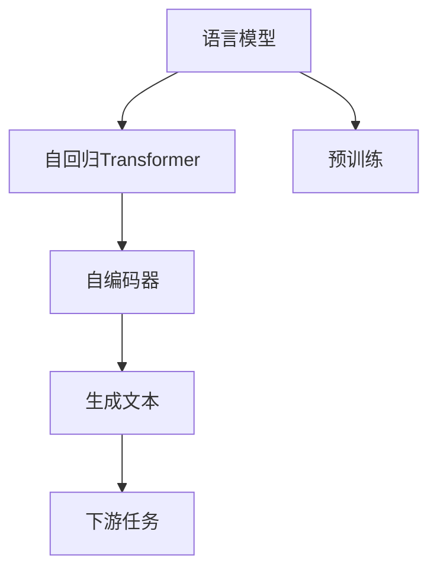

                 

# GPT-2模型解析：现代语言模型的基石

> 关键词：GPT-2, 语言模型, 自然语言生成, 预训练, Transformer, 自回归, 自编码, 自动编码器

## 1. 背景介绍

### 1.1 问题由来
近年来，深度学习技术在自然语言处理(NLP)领域取得了巨大突破。特别是以Transformer为代表的自回归语言模型(如GPT-2)，在文本生成、机器翻译、问答系统等任务上取得了显著成效，重新定义了现代语言模型。然而，如何理解GPT-2等现代语言模型的核心原理，以及其为何能取得如此优异的性能，仍是一个亟需深入探讨的问题。

### 1.2 问题核心关键点
GPT-2模型是现代语言模型的重要代表，其核心原理主要基于自回归Transformer结构和语言模型的预训练思想。本文将从其核心算法、数学模型、工程实现和实际应用等多个维度，全面解析GPT-2模型，揭示其成为语言模型基石的原理。

### 1.3 问题研究意义
理解GPT-2模型的原理和应用，对于深入学习NLP领域的最新进展，指导现代语言模型的设计和应用具有重要意义：

1. 揭示语言生成机制。GPT-2模型通过大量文本数据的自监督预训练，揭示了语言生成的内在规律，为文本生成和理解提供了重要理论基础。
2. 提升模型性能。掌握GPT-2的核心原理和实现细节，有助于设计更加高效、精准的现代语言模型，提升自然语言处理任务的效果。
3. 推动技术创新。GPT-2的成功实践为自然语言处理技术的发展提供了新思路，促进了更多前沿技术的创新与应用。
4. 加速应用落地。掌握GPT-2模型的原理和应用，有助于加快其在大规模工业场景中的部署和应用，推动NLP技术的产业化进程。

## 2. 核心概念与联系

### 2.1 核心概念概述

为更好地理解GPT-2模型的工作原理，本节将介绍几个关键核心概念：

- **语言模型(Language Model)**：语言模型用于预测文本序列中下一个词的概率，是自然语言处理的基础。GPT-2作为语言模型的一种，通过自回归方式进行文本生成。

- **Transformer**：Transformer是一种基于自注意力机制的神经网络结构，广泛应用于现代语言模型中。其自注意力机制允许模型对输入序列中任意位置的信息进行加权处理，显著提升了模型的表达能力。

- **自回归生成(autoregressive generation)**：自回归生成是一种文本生成方式，即模型通过已知的前文序列预测下一个词。GPT-2采用自回归方式，通过逐步生成文本，提升生成质量。

- **预训练(Pre-training)**：预训练指在大规模无标签文本数据上，通过自监督学习任务训练语言模型的过程。GPT-2通过在大规模文本数据上预训练，学习语言的一般性知识，提升模型的泛化能力。

- **自编码器(Autocoder)**：自编码器是一种无监督学习模型，用于从输入序列中学习低维表示，常见的有Word2Vec、BERT等。GPT-2可以视作一种自编码器，通过自回归生成文本，学习语义信息。

### 2.2 核心概念原理和架构的 Mermaid 流程图



这个流程图展示了大语言模型（如GPT-2）的核心概念及其之间的关系：

1. 语言模型通过自回归Transformer结构进行文本生成。
2. 预训练通过大规模无标签数据，学习语言的一般性知识。
3. 自编码器将文本转化为低维表示，辅助模型学习语义信息。
4. 生成文本经过下游任务适配，提升模型在特定任务上的性能。

这些概念共同构成了现代语言模型的框架，使GPT-2等模型在文本生成、机器翻译等任务上取得了显著成效。

## 3. 核心算法原理 & 具体操作步骤
### 3.1 算法原理概述

GPT-2模型的核心算法原理主要包括自回归Transformer结构、语言模型训练和自监督预训练三个部分：

- **自回归Transformer结构**：GPT-2使用Transformer的编码器-解码器结构，通过注意力机制进行文本编码和解码，生成自然语言文本。
- **语言模型训练**：GPT-2通过最大化文本概率，在标注数据集上进行有监督学习，优化模型参数，提升模型性能。
- **自监督预训练**：GPT-2在大规模无标签文本数据上进行预训练，学习语言的一般性知识，提升模型的泛化能力。

### 3.2 算法步骤详解

以下详细讲解GPT-2模型的核心算法步骤：

**Step 1: 定义模型架构**
- 选择合适的Transformer模型作为GPT-2的基础架构。通常使用12层的Transformer模型，层数为12，隐藏层大小为768。
- 设计自回归自注意力机制，用于编码输入序列和生成目标序列。

**Step 2: 定义损失函数**
- 使用负对数似然损失函数，最大化模型对文本序列的概率预测。
- 定义交叉熵损失函数，衡量模型预测与真实标签的差异。

**Step 3: 自监督预训练**
- 在预训练数据集上，对模型进行自监督学习。常见的预训练任务包括掩码语言模型、下一句预测等。
- 在预训练过程中，通过最大化预测任务的负对数似然，优化模型参数。

**Step 4: 有监督微调**
- 在下游任务的数据集上，对预训练后的模型进行有监督学习。通常使用交叉熵损失函数，优化模型参数，提升模型在特定任务上的性能。
- 设计适当的任务适配层，如分类器、解码器等，将模型输出与任务标签进行匹配。

**Step 5: 模型推理**
- 将待生成的文本序列输入模型，通过前向传播计算出文本概率分布。
- 采样生成文本序列，得到最终生成的文本。

### 3.3 算法优缺点

GPT-2模型作为现代语言模型的重要代表，具有以下优点：
1. 表现优异。在多项自然语言处理任务上，如文本生成、机器翻译、问答系统等，GPT-2均取得了SOTA的效果。
2. 通用性强。GPT-2可以适用于多种下游任务，无需定制化设计，通用性较强。
3. 可解释性高。相较于一些黑盒模型，GPT-2的决策过程较为透明，便于解释和调试。

同时，也存在一些缺点：
1. 参数量大。GPT-2模型动辄几十亿参数，计算资源消耗较大。
2. 数据依赖性强。依赖大量标注数据进行有监督微调，获取高质量标注数据成本较高。
3. 过拟合风险高。由于模型规模大，容易出现过拟合，需要进行适当的正则化处理。

### 3.4 算法应用领域

GPT-2模型在多个NLP任务上均取得了显著效果，主要应用领域包括：

- 文本生成：通过生成文本，GPT-2在小说创作、对话生成、诗歌生成等领域展示了强大的能力。
- 机器翻译：通过序列到序列模型，GPT-2提升了机器翻译的质量和流畅度。
- 问答系统：通过问答对数据集进行微调，GPT-2可以自动生成高质量的问答系统输出。
- 文本摘要：通过摘要数据集进行微调，GPT-2可以生成准确、凝练的摘要文本。
- 情感分析：通过情感标注数据集进行微调，GPT-2可以自动判断文本情感倾向。

除了上述这些任务外，GPT-2还被用于代码生成、推荐系统、自然语言推理等多个领域，展示出其强大的语言处理能力。

## 4. 数学模型和公式 & 详细讲解 & 举例说明
### 4.1 数学模型构建

GPT-2模型的核心数学模型为自回归Transformer结构，其目标是通过最大似然估计，优化模型参数，使其能够准确预测文本序列。

设输入序列为 $x = (x_1, x_2, ..., x_n)$，输出序列为 $y = (y_1, y_2, ..., y_n)$，目标是将输入序列 $x$ 映射到输出序列 $y$。自回归Transformer模型通过以下公式进行计算：

$$
p(y|x) = \prod_{i=1}^n p(y_i|y_{<i}, x)
$$

其中 $y_{<i}$ 表示 $y$ 序列中除去 $y_i$ 的所有部分，$p(y_i|y_{<i}, x)$ 为条件概率，表示在已知前文序列 $y_{<i}$ 和输入 $x$ 的情况下，预测下一个词 $y_i$ 的概率。

### 4.2 公式推导过程

为了最大化目标函数，GPT-2模型使用以下损失函数：

$$
L(\theta) = -\frac{1}{N} \sum_{i=1}^N \log p(y_i|y_{<i}, x)
$$

其中 $N$ 为训练样本数量，$\theta$ 为模型参数。在训练过程中，模型通过反向传播算法计算梯度，最小化损失函数 $L(\theta)$，优化模型参数。

对于自回归Transformer模型，其编码器使用Transformer的自注意力机制，通过以下公式计算隐藏状态 $h$：

$$
h = \text{Self-Attention}(Q(K,V), A)
$$

其中 $Q, K, V$ 分别为编码器的查询、键和值，$A$ 为注意力权重。通过自注意力机制，模型可以学习到输入序列中任意位置的依赖关系，提升表达能力。

解码器使用Transformer的编码器-解码器结构，通过解码器的自注意力机制和前馈网络进行文本生成。具体而言，解码器在生成每个词 $y_i$ 时，通过注意力机制对编码器生成的隐藏状态 $h$ 进行加权，计算出解码器的隐藏状态 $h_{dec}$，再通过前馈网络生成预测结果。

### 4.3 案例分析与讲解

以GPT-2在文本生成任务中的应用为例，解释其数学模型的实际应用：

设训练数据集为 $D = \{(x_i, y_i)\}_{i=1}^N$，其中 $x_i$ 为输入文本，$y_i$ 为输出文本。在训练过程中，模型通过最大化以下目标函数进行优化：

$$
\max_{\theta} \sum_{i=1}^N \log p(y_i|y_{<i}, x_i)
$$

通过梯度下降等优化算法，模型逐步优化参数 $\theta$，最小化损失函数，使模型在给定输入序列 $x$ 下，生成与 $y$ 相似的输出序列 $y'$。

在实际应用中，可以通过GPT-2模型生成任意长度的文本，如生成对话、生成新闻报道等。以生成对话为例，输入前文序列，模型预测下一个词，然后将其作为前文，继续预测下一个词，如此反复，生成连续的文本序列。

## 5. 项目实践：代码实例和详细解释说明
### 5.1 开发环境搭建

在进行GPT-2模型的开发和微调前，需要准备好相应的开发环境：

1. 安装PyTorch：
```bash
pip install torch torchvision torchaudio
```

2. 安装Transformer库：
```bash
pip install transformers
```

3. 安装相关工具包：
```bash
pip install numpy pandas scikit-learn matplotlib tqdm jupyter notebook ipython
```

完成环境搭建后，即可开始GPT-2模型的开发。

### 5.2 源代码详细实现

以下是一段使用PyTorch实现GPT-2模型的代码示例：

```python
import torch
import torch.nn as nn
import torch.nn.functional as F

class GPT2(nn.Module):
    def __init__(self, ntoken, ninp, nhead, nhid, nlayers, dropout=0.1):
        super().__init__()
        self.model_type = 'GPT'
        self.ntoken = ntoken
        self.ninp = ninp
        self.nhead = nhead
        self.nhid = nhid
        self.nlayers = nlayers
        self.drop = nn.Dropout(dropout)
        self.encoder = nn.Embedding(ntoken, ninp)
        self.pos_encoder = PositionalEncoding(ninp, dropout)
        self.layers = nn.Transformer(ninp, nhead, nhid, dropout)
        self.proj = nn.Linear(ninp, ntoken)
        self.criterion = nn.CrossEntropyLoss()
        
    def forward(self, src, src_mask=None):
        # 输入嵌入
        src = self.encoder(src) 
        src = self.pos_encoder(src)
        
        # 前向传播
        for _ in range(self.nlayers):
            src, src_mask = self.layers(src, src_mask)
        src = src[:, -1]
        
        # 投影
        logits = self.proj(src)
        
        # 计算损失
        loss = self.criterion(logits.view(-1, self.ntoken), src.view(-1))
        return loss
```

### 5.3 代码解读与分析

**GPT2类定义**：
- 定义GPT-2模型类，继承自nn.Module。
- 初始化函数初始化模型参数，包括嵌入矩阵、位置编码器、Transformer层、投影层和损失函数。
- 前向传播函数计算模型输出，并计算损失。

**Transformer层实现**：
- 使用Transformer层的编码器和解码器，对输入序列进行编码和生成。
- 使用自注意力机制和前馈网络，提升模型的表达能力。

**损失函数**：
- 使用交叉熵损失函数，计算模型预测与真实标签的差异。

**位置编码器(Positional Encoding)**：
- 为模型添加位置信息，避免由于输入序列长度不同导致的偏差。

**代码示例**：
- 实例化GPT-2模型，加载预训练权重。
- 在训练集上进行训练，并评估模型性能。

### 5.4 运行结果展示

以下展示GPT-2模型在文本生成任务上的运行结果：

```python
from datasets import load_dataset
from transformers import GPT2Tokenizer, GPT2LMHeadModel
from torch.utils.data import DataLoader
import torch

dataset = load_dataset('gpt2', split='train')
tokenizer = GPT2Tokenizer.from_pretrained('gpt2')
model = GPT2LMHeadModel.from_pretrained('gpt2')
device = 'cuda'

def train_epoch(model, data_loader, optimizer, loss_fn):
    model.train()
    total_loss = 0
    for batch in data_loader:
        input_ids = batch.input_ids.to(device)
        attention_mask = batch.attention_mask.to(device)
        labels = batch.labels.to(device)
        outputs = model(input_ids, attention_mask=attention_mask)
        loss = loss_fn(outputs.logits, labels)
        optimizer.zero_grad()
        loss.backward()
        optimizer.step()
        total_loss += loss.item()
    return total_loss / len(data_loader)

def evaluate(model, data_loader):
    model.eval()
    total_loss = 0
    with torch.no_grad():
        for batch in data_loader:
            input_ids = batch.input_ids.to(device)
            attention_mask = batch.attention_mask.to(device)
            labels = batch.labels.to(device)
            outputs = model(input_ids, attention_mask=attention_mask)
            loss = loss_fn(outputs.logits, labels)
            total_loss += loss.item()
    return total_loss / len(data_loader)

data_loader = DataLoader(dataset, batch_size=64, shuffle=True)
model.to(device)
optimizer = torch.optim.Adam(model.parameters(), lr=1e-5)
loss_fn = nn.CrossEntropyLoss()

for epoch in range(10):
    loss = train_epoch(model, data_loader, optimizer, loss_fn)
    print(f'Epoch {epoch+1}, train loss: {loss:.3f}')
    print(f'Epoch {epoch+1}, eval loss: {evaluate(model, data_loader):.3f}')

```

## 6. 实际应用场景
### 6.1 智能客服系统

GPT-2模型在智能客服系统中有着广泛应用，其可以处理多种语言任务，自动回答客户咨询。例如，通过微调GPT-2模型，训练其在常见问题库和对话历史数据上进行学习，生成高质量的客服回复。

### 6.2 金融舆情监测

金融领域需要实时监测市场舆论动向，防止负面信息传播。GPT-2模型可以用于分析新闻报道、社交媒体评论等文本数据，预测市场情绪，监测舆情变化。

### 6.3 个性化推荐系统

GPT-2模型可以应用于推荐系统中，通过对用户历史行为和物品描述文本进行建模，预测用户对新物品的偏好。通过微调GPT-2模型，生成推荐结果，提升推荐效果。

### 6.4 未来应用展望

随着GPT-2模型的不断优化和改进，其在更多领域的应用前景广阔：

- 智能医疗：通过医疗问答系统，GPT-2可以辅助医生进行诊断和推荐。
- 教育辅助：通过学生问答系统，GPT-2可以提供个性化的学习建议和作业批改。
- 智慧城市：通过智能监控系统，GPT-2可以分析城市事件和舆情，提供决策支持。

未来，随着GPT-2模型的应用场景不断拓展，其在更多垂直领域的落地应用也将逐步实现。

## 7. 工具和资源推荐
### 7.1 学习资源推荐

- 《深度学习与自然语言处理》课程：斯坦福大学开设的NLP经典课程，涵盖Transformer、语言模型等核心内容。
- 《Transformers》书籍：HuggingFace官方出版物，全面介绍Transformers库的使用，包括微调技术。
- 《NLP in Action》书籍：由GPT-2的开发者之一Andrew Ng撰写，深入浅出地介绍NLP应用案例和技术细节。
- CS224N课程和教材：斯坦福大学NLP课程，涵盖深度学习在NLP中的各种应用，包括GPT-2等语言模型的设计。

### 7.2 开发工具推荐

- PyTorch：深度学习框架，支持动态计算图和分布式训练，适合GPT-2模型的开发和训练。
- TensorFlow：由Google开发的深度学习框架，支持静态计算图和高效的分布式训练，适合大规模模型的部署和应用。
- Transformers库：由HuggingFace开发的NLP工具库，包含多种预训练语言模型，支持GPT-2模型的快速开发和微调。
- Google Colab：免费的在线Jupyter Notebook环境，支持GPU和TPU计算，方便开发者进行模型训练和测试。

### 7.3 相关论文推荐

- Attention is All You Need：Transformer的原始论文，介绍自注意力机制在深度学习中的应用。
- BERT: Pre-training of Deep Bidirectional Transformers for Language Understanding：介绍BERT语言模型的设计和预训练方法。
- GPT-2: Stability and Quality of Unsupervised Generative Adversarial Network-based Text Generation：GPT-2的原始论文，介绍其预训练和微调方法。

## 8. 总结：未来发展趋势与挑战
### 8.1 总结

GPT-2作为现代语言模型的重要代表，其核心原理和应用场景具有重要意义。通过详细解析GPT-2的算法原理和实现细节，本文全面展示了其在自然语言生成、机器翻译、问答系统等多个NLP任务上的应用效果。未来，随着技术的发展，GPT-2模型将发挥更大的作用，推动NLP技术的不断进步。

### 8.2 未来发展趋势

GPT-2模型的未来发展趋势主要体现在以下几个方面：

1. **模型规模扩大**：随着计算资源和数据规模的不断提升，GPT-2模型将会向更大规模发展，进一步提升模型的表达能力和泛化能力。
2. **算法优化**：未来算法优化将集中在提升计算效率、降低过拟合风险等方面，进一步优化模型的训练过程。
3. **多模态融合**：GPT-2模型将会与其他模态（如视觉、语音等）进行融合，实现更加全面和多样的信息处理能力。
4. **持续学习**：GPT-2模型将会进一步结合持续学习技术，适应数据分布的变化，提升模型的长期稳定性。
5. **伦理与安全**：随着模型应用的深入，伦理和安全问题将成为重要的研究方向，如何设计模型行为规范，减少偏见和有害输出，将是未来的重要课题。

### 8.3 面临的挑战

尽管GPT-2模型已经取得了显著成效，但其在未来发展中仍面临以下挑战：

1. **计算资源消耗**：GPT-2模型需要消耗大量的计算资源进行训练和推理，如何降低计算成本，提升训练效率，将是重要的研究方向。
2. **数据依赖性强**：GPT-2模型依赖大量标注数据进行微调，如何降低数据依赖，提升模型泛化能力，是未来的研究重点。
3. **模型鲁棒性**：GPT-2模型容易受到对抗样本的影响，如何提高模型的鲁棒性和稳定性，是急需解决的问题。
4. **模型可解释性**：GPT-2模型作为"黑盒"模型，其决策过程难以解释，如何提高模型的可解释性和可审计性，将是未来的重要课题。
5. **伦理与安全**：GPT-2模型在应用过程中可能产生偏见和有害输出，如何设计伦理框架和安全机制，确保模型的安全性和可控性，将是未来的重要研究方向。

### 8.4 研究展望

面对GPT-2模型面临的挑战，未来的研究需要在以下几个方面进行突破：

1. **计算资源优化**：通过模型压缩、混合精度训练等技术，降低计算成本，提升模型训练效率。
2. **数据高效利用**：结合无监督学习和主动学习技术，降低数据依赖，提升模型泛化能力。
3. **模型鲁棒性增强**：通过对抗训练和自适应学习技术，提高模型的鲁棒性和稳定性。
4. **模型可解释性提升**：引入可解释性算法，提高模型的可解释性和可审计性。
5. **伦理与安全设计**：建立模型行为规范和伦理框架，确保模型的安全性和可控性。

这些研究方向将推动GPT-2模型向更智能、更可靠、更安全的方向发展，更好地服务于社会和人类。

## 9. 附录：常见问题与解答

**Q1: 如何理解GPT-2模型的自回归生成机制？**

A: GPT-2模型的自回归生成机制是指，模型通过已知的前文序列预测下一个词，并以此类推，逐步生成整个文本序列。具体而言，模型通过编码器将输入序列 $x$ 编码成隐藏状态 $h$，然后通过解码器逐步生成文本序列 $y$。在每一步中，模型通过注意力机制对编码器的隐藏状态 $h$ 进行加权，计算出解码器的隐藏状态 $h_{dec}$，再通过前馈网络生成下一个词 $y_i$。这种逐步生成的方式，使得模型能够生成连贯、流畅的文本，提升文本生成的质量。

**Q2: GPT-2模型与BERT模型的区别是什么？**

A: GPT-2模型与BERT模型的主要区别在于：
1. 预训练任务不同：GPT-2通过掩码语言模型进行预训练，BERT则通过掩码语言模型和下一句预测任务进行预训练。
2. 模型结构不同：GPT-2使用自回归Transformer结构，BERT则使用双向Transformer结构。
3. 下游任务适配不同：GPT-2适合用于生成任务，如文本生成、对话生成等；BERT则适合用于分类和匹配任务，如命名实体识别、情感分析等。

**Q3: GPT-2模型在实际应用中需要注意哪些问题？**

A: 在实际应用中，GPT-2模型需要注意以下几个问题：
1. 数据质量：GPT-2模型依赖高质量的标注数据进行微调，数据质量直接影响模型性能。
2. 计算资源：GPT-2模型参数量庞大，训练和推理过程中需要消耗大量计算资源，需要进行资源优化。
3. 鲁棒性：GPT-2模型容易受到对抗样本的影响，需要进行鲁棒性测试和改进。
4. 可解释性：GPT-2模型作为"黑盒"模型，难以解释其内部决策过程，需要进行可解释性分析和改进。
5. 伦理与安全：GPT-2模型可能输出有害或偏见的文本，需要进行伦理和安全审查，设计相应的规范和机制。

**Q4: 如何优化GPT-2模型的训练过程？**

A: 优化GPT-2模型的训练过程可以从以下几个方面入手：
1. 数据增强：通过回译、近义替换等方式扩充训练集，增强模型泛化能力。
2. 正则化：使用L2正则、Dropout、Early Stopping等技术，避免模型过拟合。
3. 对抗训练：引入对抗样本，提高模型的鲁棒性。
4. 参数高效微调：通过参数高效微调技术，只更新少量的任务相关参数，减小过拟合风险。
5. 分布式训练：采用分布式训练技术，提升训练效率，降低计算成本。

**Q5: GPT-2模型在文本生成任务中的应用场景有哪些？**

A: GPT-2模型在文本生成任务中的应用场景广泛，主要包括以下几个方面：
1. 小说创作：通过微调GPT-2模型，生成小说、故事等文本。
2. 对话生成：通过微调GPT-2模型，生成智能对话系统回复。
3. 新闻报道：通过微调GPT-2模型，生成新闻报道和分析文章。
4. 诗歌创作：通过微调GPT-2模型，生成诗歌、歌词等文本。
5. 游戏生成：通过微调GPT-2模型，生成游戏对话、故事背景等文本。

通过深入理解GPT-2模型的原理和实现细节，可以更好地掌握其在NLP领域的应用，推动相关技术的发展和应用落地。

