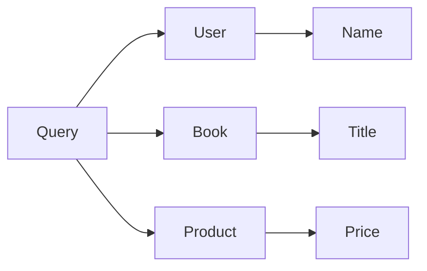

                 

# GraphQL API设计：灵活高效的数据查询语言

## 1. 背景介绍

在当今的软件开发中，API（应用程序编程接口）扮演着至关重要的角色。它们定义了不同软件组件如何相互通信，确保了数据的一致性和实时性。然而，传统的API设计往往存在一些固有的局限性：

1. **数据冗余**：API返回的数据往往是固定的，即使用户只对其中的部分数据感兴趣。这不仅浪费了网络带宽，也增加了客户端的解析和处理成本。
2. **灵活性不足**：客户端只能按预定义的方式请求数据，无法根据自身需求灵活定制查询，限制了API的使用灵活性。
3. **版本管理复杂**：随着API功能的增加，每次更新API时都需要对所有客户端进行版本兼容性测试，增加了维护成本。

为了应对这些问题，一种新的API设计理念应运而生——GraphQL。GraphQL是一种以数据为中心的查询语言，它提供了一种灵活、高效的数据访问方式，极大地简化了API的设计和维护。

## 2. 核心概念与联系

### 2.1 核心概念概述

GraphQL的核心概念主要包括：

- **Schema**：GraphQL的Schema定义了API的数据结构，包括类型系统、查询和变异操作等。Schema是API设计的蓝图，定义了客户端可以查询和变异的所有数据类型及其关系。
- **Query**：GraphQL的Query是一种语言，用于描述客户端对API数据的查询请求。Query可以包含多个字段，每个字段都指定了要查询的数据类型及其子字段。
- **Variation**：GraphQL的Variation也是一种语言，用于描述客户端对API数据的变异请求。Variation允许客户端创建、更新或删除数据，对API进行修改操作。
- **Resolvers**：Resolvers是GraphQL的执行组件，负责根据客户端的查询或变异请求，从数据源中获取数据。Resolvers可以是函数、类或任何其他可执行的代码。

### 2.2 核心概念联系

GraphQL的核心概念相互关联，共同构成了一个灵活、高效的数据查询生态系统。Schema定义了API的数据结构，Query和Variation则提供了客户端与API交互的语言，而Resolvers则负责数据获取和处理。这种架构使得GraphQL能够满足各种数据查询和变异的需求，同时提供了一种简单、灵活的API设计方法。

以下是一个简单的GraphQL Schema示例：



在这个Schema中，我们定义了三个主要数据类型：User、Book和Product，以及它们之间的关系。Query和Variation可以用于查询这些数据，而Resolvers则负责根据这些查询从数据源中获取数据。

## 3. 核心算法原理 & 具体操作步骤

### 3.1 算法原理概述

GraphQL的核心算法原理主要包括以下几个方面：

1. **Schema定义**：GraphQL的Schema定义了API的数据结构，包括数据类型、字段及其关系。Schema是API设计的蓝图，定义了客户端可以查询和变异的所有数据类型及其关系。
2. **Query解析**：GraphQL的Query解析器将客户端的查询请求解析为Schema中的操作和字段。解析器通过Schema验证查询的有效性，确保查询不会超出定义的权限范围。
3. **Resolvers执行**：解析器将解析后的查询请求传递给Resolvers执行。Resolvers根据查询请求从数据源中获取数据，并将结果返回给客户端。
4. **结果合并**：GraphQL的解析器将来自不同Resolvers的结果合并为一个单一的响应对象，确保客户端接收到完整、一致的数据。

### 3.2 算法步骤详解

以下是一个GraphQL查询和变异的详细步骤：

1. **Schema定义**：定义API的数据结构，包括数据类型、字段及其关系。例如：

```graphql
type User {
  id: ID!
  name: String!
  email: String!
  books: [Book!]
  products: [Product!]
}

type Book {
  id: ID!
  title: String!
  author: String!
}

type Product {
  id: ID!
  name: String!
  price: Float!
}
```

2. **Query解析**：客户端通过GraphQL Query请求数据。例如：

```graphql
query {
  user(id: "123") {
    name
    email
    books {
      title
      author
    }
    products {
      name
      price
    }
  }
}
```

3. **Resolvers执行**：Resolvers根据客户端的查询请求，从数据源中获取数据。例如：

```python
# 假设我们有一个User对象
user = {
  'id': '123',
  'name': 'Alice',
  'email': 'alice@example.com',
  'books': [
    {
      'id': '1',
      'title': 'The Great Gatsby',
      'author': 'F. Scott Fitzgerald'
    },
    {
      'id': '2',
      'title': 'To Kill a Mockingbird',
      'author': 'Harper Lee'
    }
  ],
  'products': [
    {
      'id': '1',
      'name': 'iPhone',
      'price': 999.99
    },
    {
      'id': '2',
      'name': 'MacBook',
      'price': 1999.99
    }
  ]
}

# 查询解析器根据Schema验证查询，并调用Resolvers获取数据
def user_resolver(user):
    return {
      'name': user['name'],
      'email': user['email'],
      'books': [
        {'id': book['id'], 'title': book['title'], 'author': book['author']} for book in user['books']
      ],
      'products': [
        {'id': product['id'], 'name': product['name'], 'price': product['price']} for product in user['products']
      ]
    }

# 解析查询并执行Resolvers
query = '''
query {
  user(id: "123") {
    name
    email
    books {
      title
      author
    }
    products {
      name
      price
    }
  }
}
'''
result = parse_query(query, user_resolver)
```

4. **结果合并**：解析器将来自不同Resolvers的结果合并为一个单一的响应对象。例如：

```python
# 响应对象
response = {
  'data': {
    'user': {
      'name': user['name'],
      'email': user['email'],
      'books': [
        {'id': book['id'], 'title': book['title'], 'author': book['author']} for book in user['books']
      ],
      'products': [
        {'id': product['id'], 'name': product['name'], 'price': product['price']} for product in user['products']
      ]
    }
  }
}
```

### 3.3 算法优缺点

GraphQL的优点包括：

- **灵活性**：客户端可以灵活定制查询，只获取自己需要的数据，避免了数据冗余和网络带宽浪费。
- **数据一致性**：GraphQL提供了Schema和Resolvers的定义，确保了客户端接收到一致、准确的数据。
- **简化API设计**：GraphQL的Schema和Query定义了API的数据结构和查询操作，简化了API的设计和维护。

GraphQL的缺点包括：

- **学习曲线较陡**：GraphQL的Schema和Query语言相对复杂，需要一定的学习成本。
- **性能问题**：复杂的查询和变异操作可能会增加服务器的处理负担，需要合理优化查询和Resolvers的性能。

### 3.4 算法应用领域

GraphQL适用于各种API设计场景，特别是需要灵活、高效数据查询的应用。例如：

- **Web应用**：GraphQL可以用于构建高性能、灵活的Web应用，特别是那些需要复杂数据查询的应用。
- **移动应用**：GraphQL可以用于构建高效、灵活的移动应用，特别是那些需要频繁更新数据的应用。
- **企业级应用**：GraphQL可以用于构建企业级应用，特别是那些需要高效、一致的数据访问的应用。

## 4. 数学模型和公式 & 详细讲解

### 4.1 数学模型构建

GraphQL的数学模型主要涉及Schema的定义、Query和Variation的解析，以及Resolvers的执行。以下是一个简单的数学模型示例：

- Schema定义：定义API的数据结构，包括数据类型、字段及其关系。
- Query解析：将客户端的查询请求解析为Schema中的操作和字段。
- Resolvers执行：根据客户端的查询请求，从数据源中获取数据。
- 结果合并：将来自不同Resolvers的结果合并为一个单一的响应对象。

### 4.2 公式推导过程

GraphQL的核心算法原理可以通过以下公式推导：

- **Schema定义**：

  ```math
  Schema = (Type, Field, Relationship)
  ```

- **Query解析**：

  ```math
  Query = (Operation, Field)
  ```

- **Resolvers执行**：

  ```math
  Result = Resolve(Operation, Field)
  ```

- **结果合并**：

  ```math
  Response = Merge(Result)
  ```

### 4.3 案例分析与讲解

假设我们有一个简单的GraphQL Schema，包含User、Book和Product三种数据类型：

```graphql
type User {
  id: ID!
  name: String!
  email: String!
  books: [Book!]
  products: [Product!]
}

type Book {
  id: ID!
  title: String!
  author: String!
}

type Product {
  id: ID!
  name: String!
  price: Float!
}
```

客户端发送以下查询请求：

```graphql
query {
  user(id: "123") {
    name
    email
    books {
      title
      author
    }
    products {
      name
      price
    }
  }
}
```

Resolvers执行以下操作：

```python
# 假设我们有一个User对象
user = {
  'id': '123',
  'name': 'Alice',
  'email': 'alice@example.com',
  'books': [
    {
      'id': '1',
      'title': 'The Great Gatsby',
      'author': 'F. Scott Fitzgerald'
    },
    {
      'id': '2',
      'title': 'To Kill a Mockingbird',
      'author': 'Harper Lee'
    }
  ],
  'products': [
    {
      'id': '1',
      'name': 'iPhone',
      'price': 999.99
    },
    {
      'id': '2',
      'name': 'MacBook',
      'price': 1999.99
    }
  ]
}

# 查询解析器根据Schema验证查询，并调用Resolvers获取数据
def user_resolver(user):
    return {
      'name': user['name'],
      'email': user['email'],
      'books': [
        {'id': book['id'], 'title': book['title'], 'author': book['author']} for book in user['books']
      ],
      'products': [
        {'id': product['id'], 'name': product['name'], 'price': product['price']} for product in user['products']
      ]
    }

# 解析查询并执行Resolvers
query = '''
query {
  user(id: "123") {
    name
    email
    books {
      title
      author
    }
    products {
      name
      price
    }
  }
}
'''
result = parse_query(query, user_resolver)
```

解析器将结果合并为一个单一的响应对象：

```python
# 响应对象
response = {
  'data': {
    'user': {
      'name': user['name'],
      'email': user['email'],
      'books': [
        {'id': book['id'], 'title': book['title'], 'author': book['author']} for book in user['books']
      ],
      'products': [
        {'id': product['id'], 'name': product['name'], 'price': product['price']} for product in user['products']
      ]
    }
  }
}
```

## 5. 项目实践：代码实例和详细解释说明

### 5.1 开发环境搭建

为了搭建GraphQL的开发环境，我们需要使用以下工具：

- **GraphQL Server**：一个用于构建GraphQL API的服务器，支持各种GraphQL库和框架。
- **GraphiQL**：一个用于测试和调试GraphQL查询的界面。
- **TypeScript**：一个用于编写GraphQL Resolvers的编程语言。
- **Apollo Server**：一个用于构建GraphQL API的库，支持多种GraphQL实现和数据源。

以下是使用Node.js和Apollo Server搭建GraphQL API的示例：

```bash
npm install apollo-server graphql
```

### 5.2 源代码详细实现

以下是一个使用Apollo Server构建GraphQL API的示例：

```javascript
import { ApolloServer, gql } from 'apollo-server';

// 定义Schema
const typeDefs = gql`
  type User {
    id: ID!
    name: String!
    email: String!
    books: [Book!]
    products: [Product!]
  }

  type Book {
    id: ID!
    title: String!
    author: String!
  }

  type Product {
    id: ID!
    name: String!
    price: Float!
  }

  type Query {
    user(id: ID!): User
  }

  type Mutation {
    addBook(title: String!, author: String!): Book
    addProduct(name: String!, price: Float!): Product
  }
`;

// 定义Resolvers
const resolvers = {
  Query: {
    user: (parent, args) => {
      // 获取User对象
      const user = getUserById(args.id);
      return {
        name: user.name,
        email: user.email,
        books: user.books.map(book => ({
          id: book.id,
          title: book.title,
          author: book.author
        })),
        products: user.products.map(product => ({
          id: product.id,
          name: product.name,
          price: product.price
        }))
      };
    }
  },
  Mutation: {
    addBook: (parent, args) => {
      // 创建Book对象
      const book = createBook(args.title, args.author);
      return book;
    },
    addProduct: (parent, args) => {
      // 创建Product对象
      const product = createProduct(args.name, args.price);
      return product;
    }
  }
};

// 启动GraphQL Server
const server = new ApolloServer({ typeDefs, resolvers });
server.listen().then(({ url }) => {
  console.log(`Server ready at ${url}`);
});
```

### 5.3 代码解读与分析

以上代码示例演示了如何使用Apollo Server构建一个简单的GraphQL API。首先，我们定义了一个包含User、Book和Product三种数据类型的Schema，以及查询和变异操作。然后，我们定义了Resolvers，用于根据客户端的查询和变异请求，从数据源中获取数据。最后，我们启动了GraphQL Server，使其能够接收客户端的请求并返回响应。

## 6. 实际应用场景

### 6.1 灵活性

GraphQL提供了灵活的查询方式，使得客户端能够根据自己的需求，只获取自己需要的数据，避免了数据冗余和网络带宽浪费。例如，在电子商务应用中，客户端只需要获取特定用户的产品信息，而不需要获取所有用户的信息。

### 6.2 数据一致性

GraphQL通过Schema和Resolvers的定义，确保了客户端接收到一致、准确的数据。例如，在社交媒体应用中，客户端可以根据Schema定义，只获取自己关注的用户信息，而不需要获取所有用户的信息。

### 6.3 简化API设计

GraphQL的Schema和Query定义了API的数据结构和查询操作，简化了API的设计和维护。例如，在新闻应用中，客户端只需要获取特定类型的新闻文章，而不需要获取所有类型的新闻文章。

### 6.4 未来应用展望

随着GraphQL的不断发展，它将在更多的应用场景中得到应用，为API设计带来新的突破。例如：

- **微服务架构**：GraphQL可以用于构建微服务架构，使得不同服务之间的数据访问更加灵活和高效。
- **实时数据查询**：GraphQL可以用于构建实时数据查询系统，使得客户端能够实时获取最新的数据。
- **跨平台应用**：GraphQL可以用于构建跨平台应用，使得不同平台之间的数据访问更加灵活和高效。

## 7. 工具和资源推荐

### 7.1 学习资源推荐

为了帮助开发者系统掌握GraphQL的理论基础和实践技巧，这里推荐一些优质的学习资源：

1. **《GraphQL规范》**：GraphQL官方文档，详细介绍了GraphQL规范和最佳实践。
2. **《GraphQL实战》**：一本介绍GraphQL实战应用的书籍，涵盖多种GraphQL库和框架。
3. **GraphQL Tutorial**：一个GraphQL学习教程，提供了丰富的示例和案例。
4. **GraphQL Subscriptions**：一个介绍GraphQL订阅功能的教程，涵盖如何构建实时数据查询系统。
5. **GraphQL Mastery**：一个GraphQL学习平台，提供各种课程和实战项目。

### 7.2 开发工具推荐

为了高效开发GraphQL应用，我们需要使用以下工具：

- **Apollo Studio**：一个用于管理GraphQL API的可视化工具，提供了丰富的管理和监控功能。
- **GraphiQL**：一个用于测试和调试GraphQL查询的界面。
- **TypeScript**：一个用于编写GraphQL Resolvers的编程语言。
- **GraphQL Playground**：一个用于测试和调试GraphQL查询的工具。

### 7.3 相关论文推荐

GraphQL的发展离不开学界的持续研究。以下是几篇奠基性的相关论文，推荐阅读：

1. **《GraphQL规范》**：GraphQL官方规范，详细介绍了GraphQL规范和最佳实践。
2. **《GraphQL实战》**：介绍GraphQL实战应用的书籍，涵盖多种GraphQL库和框架。
3. **《GraphQL技术概览》**：一篇介绍GraphQL技术的博客文章，涵盖GraphQL的历史、规范和未来发展方向。
4. **《GraphQL的最佳实践》**：一篇介绍GraphQL最佳实践的博客文章，涵盖GraphQL的设计和优化技巧。
5. **《GraphQL的数据模型设计》**：一篇介绍GraphQL数据模型设计的博客文章，涵盖数据模型设计的最佳实践。

## 8. 总结：未来发展趋势与挑战

### 8.1 总结

本文对GraphQL API设计进行了全面系统的介绍。首先阐述了GraphQL的背景和意义，明确了GraphQL在数据查询领域的独特优势。其次，从原理到实践，详细讲解了GraphQL的核心算法和具体操作步骤，给出了GraphQL应用开发的完整代码实例。同时，本文还探讨了GraphQL在多个行业领域的应用前景，展示了GraphQL的巨大潜力。最后，本文精选了GraphQL的学习资源，力求为读者提供全方位的技术指引。

通过本文的系统梳理，可以看到，GraphQL作为一种灵活、高效的数据查询语言，正在成为API设计的理想范式，极大地简化了API的设计和维护。未来，伴随GraphQL的不断发展，GraphQL必将在更多的应用场景中得到应用，为API设计带来新的突破。

### 8.2 未来发展趋势

展望未来，GraphQL的发展趋势主要包括以下几个方面：

1. **标准化**：GraphQL作为一项新兴技术，其规范和最佳实践还在不断演进。未来，GraphQL将逐步实现标准化，成为API设计的通用标准。
2. **性能优化**：随着GraphQL应用的不断扩展，性能优化将成为一大挑战。未来，GraphQL将引入更多的性能优化技术，如缓存、分片等，以提高系统的响应速度和吞吐量。
3. **生态系统扩展**：随着GraphQL应用的不断扩展，生态系统将不断丰富和完善。未来，GraphQL将引入更多的工具和框架，支持更多的数据源和业务场景。
4. **跨平台支持**：GraphQL将支持更多的平台和设备，如移动设备、Web应用、桌面应用等，使得数据查询更加灵活和高效。

### 8.3 面临的挑战

尽管GraphQL在数据查询领域展现了巨大的潜力，但在迈向更加智能化、普适化应用的过程中，它仍面临诸多挑战：

1. **学习曲线**：GraphQL的规范和操作相对复杂，需要一定的学习成本。如何降低学习曲线，提高开发者效率，将是未来的一大挑战。
2. **数据一致性**：GraphQL的Schema和Resolvers需要保证数据的一致性，但在复杂的应用场景中，数据一致性往往难以保证。如何提高数据一致性，将是未来的一大挑战。
3. **性能优化**：随着GraphQL应用的不断扩展，性能优化将成为一大挑战。如何提高系统的响应速度和吞吐量，将是未来的一大挑战。
4. **安全性和隐私**：GraphQL的应用需要保证数据的安全性和隐私，但在复杂的业务场景中，数据泄露和安全问题往往难以避免。如何提高系统的安全性和隐私保护，将是未来的一大挑战。

### 8.4 研究展望

未来，GraphQL的研究方向将主要包括以下几个方面：

1. **数据模型设计**：如何设计灵活、高效的数据模型，使得GraphQL能够适应各种业务场景，将是未来的一大研究方向。
2. **性能优化**：如何提高GraphQL的性能，降低系统的响应时间和资源消耗，将是未来的一大研究方向。
3. **安全性和隐私**：如何提高GraphQL的安全性和隐私保护，确保数据的安全性和隐私，将是未来的一大研究方向。
4. **生态系统扩展**：如何扩展GraphQL的生态系统，支持更多的数据源和业务场景，将是未来的一大研究方向。

通过不断探索和创新，GraphQL必将在数据查询领域发挥更大的作用，为API设计带来新的突破，推动互联网应用的不断进步。

## 9. 附录：常见问题与解答

**Q1：GraphQL是什么？**

A: GraphQL是一种以数据为中心的查询语言，它提供了一种灵活、高效的数据访问方式，极大地简化了API的设计和维护。GraphQL通过Schema和Resolvers的定义，确保了客户端接收到一致、准确的数据。

**Q2：GraphQL与RESTful API相比有哪些优势？**

A: GraphQL相比RESTful API有以下优势：

- **灵活性**：GraphQL允许客户端灵活定制查询，只获取自己需要的数据，避免了数据冗余和网络带宽浪费。
- **数据一致性**：GraphQL通过Schema和Resolvers的定义，确保了客户端接收到一致、准确的数据。
- **简化API设计**：GraphQL的Schema和Query定义了API的数据结构和查询操作，简化了API的设计和维护。

**Q3：如何使用GraphQL构建实时数据查询系统？**

A: 使用GraphQL构建实时数据查询系统需要引入GraphQL订阅功能。GraphQL订阅功能允许客户端订阅数据的实时更新，确保客户端能够获取最新的数据。

**Q4：GraphQL的学习曲线如何？**

A: GraphQL的学习曲线相对较陡，需要一定的学习成本。GraphQL的Schema和Query语言相对复杂，需要一定的理解和实践。但一旦掌握了GraphQL的基本概念和操作，GraphQL的学习成本将大幅降低。

**Q5：GraphQL的性能如何？**

A: GraphQL的性能取决于具体的实现方式和数据结构。一般来说，GraphQL的性能与RESTful API相当或略优。但复杂的查询和变异操作可能会增加服务器的处理负担，需要合理优化查询和Resolvers的性能。

通过本文的系统梳理，可以看到，GraphQL作为一种灵活、高效的数据查询语言，正在成为API设计的理想范式，极大地简化了API的设计和维护。未来，伴随GraphQL的不断发展，GraphQL必将在更多的应用场景中得到应用，为API设计带来新的突破。

