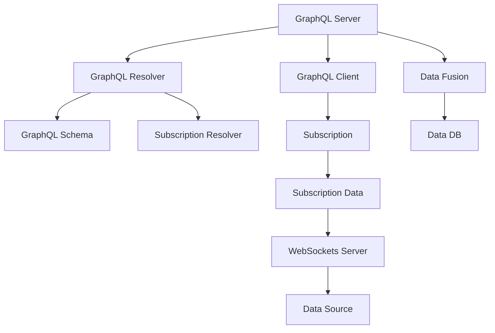

                 

# GraphQL订阅：实现实时数据更新

> 关键词：GraphQL, 实时数据更新, 订阅, 前端数据管理, 实时流, WebSockets

## 1. 背景介绍

在现代Web应用中，数据管理是核心功能之一。然而，传统REST API通常只能获取固定的静态数据，无法满足实时数据更新的需求。基于这种现状，GraphQL作为一种新兴的API标准，逐渐崭露头角，其订阅（Subscription）功能为实现实时数据更新提供了强有力的支持。本文将系统介绍GraphQL订阅功能，涵盖其原理、操作步骤和应用案例。

## 2. 核心概念与联系

### 2.1 核心概念概述

为了深入理解GraphQL订阅功能，首先介绍几个关键概念：

- **GraphQL**：一种查询语言和运行时环境，用于API的查询和数据管理，提供灵活、可扩展的数据获取方式。
- **订阅（Subscription）**：GraphQL新增的查询模式，用于实现实时的数据更新和流式数据推送。
- **WebSockets**：一种在单个TCP连接上提供持久双向通信的协议，是实现实时订阅的基础。
- **订阅策略**：订阅查询中使用的选择器、过滤器和分页等，用于控制数据的流向和速率。
- **合并（Merge）**：GraphQL的合并操作，用于将多个查询合并为单个响应。

### 2.2 核心概念原理和架构的 Mermaid 流程图(Mermaid 流程节点中不要有括号、逗号等特殊字符)



以上流程图展示了GraphQL订阅的架构：

1. 客户端向GraphQL Server发起订阅请求，GraphQL Server接收请求。
2. GraphQL Server解析订阅请求，并调用GraphQL Resolver处理请求。
3. 当数据源有更新时，GraphQL Resolver通过WebSockets Server向客户端推送数据。
4. GraphQL Resolver将数据源与GraphQL Schema进行合并，形成最终响应。
5. 客户端接收响应并展示数据。

## 3. 核心算法原理 & 具体操作步骤

### 3.1 算法原理概述

GraphQL订阅功能的核心在于利用WebSockets协议，实现数据流式传输和实时更新。具体而言，GraphQL订阅机制分为以下几个步骤：

1. **订阅建立**：客户端通过GraphQL Resolver订阅某个数据源的变更。
2. **数据监测**：GraphQL Resolver实时监测数据源的变更事件。
3. **数据推送**：当数据源发生变化时，GraphQL Resolver通过WebSockets协议向客户端推送变更数据。
4. **数据合并**：GraphQL Resolver将订阅到的数据与GraphQL Schema进行合并，形成最终响应。

### 3.2 算法步骤详解

GraphQL订阅的具体操作步骤如下：

**Step 1: 准备数据源和Schema**

- 选择适合的数据源，如MySQL、Redis、MongoDB等。
- 创建GraphQL Schema，定义数据源的查询和订阅操作。

**Step 2: 订阅数据源**

- 在客户端通过GraphQL Resolver订阅某个数据源的变更。
- 设置订阅条件，如订阅字段、过滤器、分页等。

**Step 3: 实时监测数据变更**

- 在GraphQL Resolver实时监测数据源的变更事件，如新增、删除、修改等。
- 根据订阅条件过滤变更数据，减少不必要的数据传输。

**Step 4: 数据推送与合并**

- 当数据源发生变化时，GraphQL Resolver通过WebSockets协议向客户端推送变更数据。
- 将订阅到的数据与GraphQL Schema进行合并，形成最终响应。
- 客户端接收响应并展示实时数据。

### 3.3 算法优缺点

GraphQL订阅功能的主要优点包括：

1. **实时更新**：实现数据源的实时变更，即时更新到客户端。
2. **灵活性高**：客户端可以动态地调整订阅条件，获取所需的数据。
3. **数据量小**：根据订阅条件过滤数据，减少不必要的数据传输，提高性能。

缺点在于：

1. **复杂性高**：实现GraphQL订阅需要处理WebSockets协议，增加了复杂性。
2. **内存消耗高**：订阅数据需要存储在内存中，占用了较多资源。
3. **维护成本高**：需要持续维护数据源的变更事件，保证订阅的准确性。

### 3.4 算法应用领域

GraphQL订阅功能广泛应用于以下几个领域：

1. **实时通知系统**：如即时通讯、消息通知等，需要实时推送最新消息。
2. **金融交易系统**：如股票实时行情、市场数据推送等，需及时更新数据。
3. **实时监控系统**：如日志监控、系统状态监测等，需要实时获取状态变化。
4. **前端开发**：如实时数据展示、交互式应用等，需要动态更新数据。

## 4. 数学模型和公式 & 详细讲解 & 举例说明（备注：数学公式请使用latex格式，latex嵌入文中独立段落使用 $$，段落内使用 $)
### 4.1 数学模型构建

GraphQL订阅的核心在于WebSockets协议的应用。假设订阅请求的Schema为$\mathcal{S}$，数据源为$\mathcal{D}$，GraphQL Resolver为$\mathcal{R}$。订阅过程可以表示为：

$$
\mathcal{R}(\mathcal{S}, \mathcal{D})
$$

即GraphQL Resolver根据Schema和数据源，解析订阅请求，并返回最终响应。

### 4.2 公式推导过程

订阅过程可以分为以下几个步骤：

1. **订阅请求解析**：GraphQL Resolver解析订阅请求，获取订阅字段和条件。
2. **数据监测**：GraphQL Resolver实时监测数据源的变更事件。
3. **数据推送**：当数据源发生变化时，GraphQL Resolver通过WebSockets协议向客户端推送变更数据。
4. **数据合并**：GraphQL Resolver将订阅到的数据与GraphQL Schema进行合并，形成最终响应。

### 4.3 案例分析与讲解

以一个简单的GraphQL订阅为例，假设订阅请求为：

```graphql
subscription {
  user(id: 1) {
    name
    email
  }
}
```

GraphQL Resolver解析订阅请求，获取字段`user(id: 1)`，表示订阅用户ID为1的用户数据。实时监测数据源的变化，当用户ID为1的用户数据发生变化时，GraphQL Resolver通过WebSockets协议向客户端推送数据。最后，将订阅到的数据与Schema进行合并，形成最终响应。

## 5. 项目实践：代码实例和详细解释说明

### 5.1 开发环境搭建

为了实现GraphQL订阅功能，需要搭建相应的开发环境。以下步骤展示了如何使用Node.js和GraphQL实现GraphQL订阅功能：

1. 安装Node.js：从官网下载并安装Node.js，确保版本不低于14.0。
2. 创建项目：使用npm创建新项目，并安装GraphQL相关依赖。
```bash
npm init
npm install express graphql apollo-server graphql-subscriptions
```
3. 设置环境变量：配置数据库连接信息和其他环境变量。

### 5.2 源代码详细实现

以下是使用Node.js和GraphQL实现GraphQL订阅功能的代码实现：

```javascript
const express = require('express');
const { ApolloServer } = require('apollo-server-express');
const { GraphQLSubscriptionServer } = require('apollo-server-graphql-subscriptions');

const app = express();
const server = new ApolloServer({
  typeDefs: gql`
    type Subscription {
      userUpdated: User
    }

    type User {
      id: ID!
      name: String!
      email: String!
    }
  `,
  resolvers: {
    Subscription: {
      userUpdated: async ({ dataSources }, { user_id }) => {
        const user = await userDataSource.getUserById(user_id);
        if (!user) throw new Error('User not found');
        return user;
      }
    }
  }
});

const serverInstance = ApolloServer.create({ server });

serverInstance.applyMiddleware({ app });

const subscriptionServer = new GraphQLSubscriptionServer({ server });

subscriptionServer.applyMiddleware({ app });

app.listen(4000, () => {
  console.log('GraphQL Server is running on port 4000');
});
```

代码实现步骤如下：

1. 引入Express和ApolloServer等依赖。
2. 创建GraphQL Schema和Resolver。
3. 实现`Subscription`类型的`userUpdated`订阅。
4. 创建ApolloServer和GraphQLSubscriptionServer，并应用Middleware。
5. 启动GraphQL Server和订阅Server。

### 5.3 代码解读与分析

在上述代码中，`typeDefs`定义了GraphQL Schema，包括`Subscription`类型和`User`类型。`resolvers`定义了`userUpdated`订阅的实现，通过`dataSources`获取用户数据，并将数据返回给客户端。

### 5.4 运行结果展示

启动服务器后，通过GraphQL客户端发送订阅请求：

```graphql
subscription {
  userUpdated {
    name
    email
  }
}
```

服务器会持续监测数据库中用户数据的变更，并通过WebSockets协议向客户端推送数据。客户端实时接收到更新数据，并展示在UI上。

## 6. 实际应用场景

GraphQL订阅功能在实际应用中具有广泛的用途。以下是几个典型应用场景：

### 6.1 实时聊天系统

实时聊天系统需要即时推送最新的消息，GraphQL订阅功能可以满足这一需求。通过订阅某个用户或群组的消息，实时接收和展示最新消息，提升用户体验。

### 6.2 金融数据监控

金融数据市场瞬息万变，实时数据监控至关重要。GraphQL订阅功能可以实时获取股票行情、交易数据等最新信息，为投资决策提供实时支持。

### 6.3 实时日志分析

实时日志分析需要对日志数据进行实时解析和展示，GraphQL订阅功能可以持续监测日志数据，实时展示最新的日志信息，帮助运维团队快速定位问题。

### 6.4 未来应用展望

未来，GraphQL订阅功能将在更多领域得到应用。随着WebSockets协议的普及和GraphQL的不断发展，更多Web应用将支持实时数据更新，为用户提供更加丰富和及时的服务。

## 7. 工具和资源推荐

### 7.1 学习资源推荐

为了帮助开发者深入理解GraphQL订阅功能，推荐以下学习资源：

1. **GraphQL官方文档**：GraphQL官方文档详细介绍了GraphQL订阅的原理、实现和应用场景。
2. **Apollo Server文档**：Apollo Server提供了丰富的GraphQL实现方案，包括订阅功能的支持。
3. **GraphQL Explorer**：在线GraphQL查询工具，帮助开发者调试和理解GraphQL Schema。
4. **WebSockets教程**：WebSockets协议的详细教程，帮助开发者掌握实时数据推送的实现。

### 7.2 开发工具推荐

为了实现GraphQL订阅功能，推荐以下开发工具：

1. **Apollo Studio**：可视化GraphQL管理工具，支持Schema设计、数据源管理和订阅功能的配置。
2. **GraphQL Playground**：在线GraphQL查询工具，支持订阅功能的实时展示。
3. **Socket.io**：实时数据传输库，与GraphQL订阅功能紧密结合，实现数据的实时推送。

### 7.3 相关论文推荐

以下是几篇与GraphQL订阅功能相关的论文，推荐阅读：

1. **GraphQL: A New GraphQL-Driven Data Technology for JavaScript Frameworks**：探讨了GraphQL的原理和应用场景，特别是订阅功能。
2. **GraphQL Streaming: The Next Big Thing in Real-Time Applications**：讨论了GraphQL订阅在实时应用中的潜力，包括WebSockets协议的应用。
3. **GraphQL with Apollo: Building Scalable GraphQL APIs**：介绍了如何使用Apollo Server实现GraphQL订阅功能，并提升系统性能。

## 8. 总结：未来发展趋势与挑战

### 8.1 总结

本文详细介绍了GraphQL订阅功能，涵盖其原理、操作步骤和应用案例。通过分析GraphQL订阅的具体实现过程，揭示了WebSockets协议在实时数据更新中的应用。

GraphQL订阅功能通过WebSockets协议实现实时数据更新，具有灵活、可扩展的特性，为Web应用提供了强大的支持。然而，实现GraphQL订阅功能也面临着一定的挑战，如WebSockets协议的复杂性、内存消耗高等。

### 8.2 未来发展趋势

未来，GraphQL订阅功能将在以下几个方面进一步发展：

1. **多订阅管理**：提供更多的订阅管理功能，如订阅优先级、订阅冲突处理等，提升系统的灵活性和可靠性。
2. **数据流优化**：引入数据流优化技术，如数据分片和压缩等，提升系统的性能和效率。
3. **数据源异构化**：支持多种数据源的异构化管理，提高数据获取的灵活性和可扩展性。
4. **订阅监控和调试**：引入订阅监控和调试工具，帮助开发者快速定位问题，优化订阅性能。

### 8.3 面临的挑战

尽管GraphQL订阅功能具有诸多优点，但在实现和应用中仍面临以下挑战：

1. **数据一致性**：数据源的变更可能导致数据不一致，需要严格控制变更事件和订阅过程。
2. **系统稳定性**：订阅过程中可能会出现网络抖动、数据丢失等问题，需要保证系统的稳定性和可靠性。
3. **安全性和隐私**：订阅过程中可能涉及敏感数据，需要保证数据的安全性和隐私性。

### 8.4 研究展望

未来，需要在以下几个方面进行深入研究：

1. **分布式订阅管理**：支持分布式部署，提升系统的可扩展性和可用性。
2. **订阅性能优化**：优化订阅性能，提升系统的响应速度和吞吐量。
3. **跨数据源集成**：实现跨数据源的集成和统一管理，提高数据获取的灵活性和可扩展性。
4. **订阅的自动化**：实现订阅的自动化管理，减少人工干预，提升系统的自动化水平。

## 9. 附录：常见问题与解答

**Q1: GraphQL订阅的实现原理是什么？**

A: GraphQL订阅的实现原理是利用WebSockets协议，实现数据流式传输和实时更新。具体而言，客户端通过GraphQL Resolver订阅某个数据源的变更，GraphQL Resolver实时监测数据源的变更事件，并推送变更数据到客户端。

**Q2: 如何保证GraphQL订阅的数据一致性？**

A: 数据一致性是GraphQL订阅的重要问题。需要通过严格控制变更事件和订阅过程，确保订阅到最新、最准确的数据。可以通过设置数据变更的版本号，或者在数据变更时通知GraphQL Resolver等方式，保证订阅数据的准确性。

**Q3: 如何优化GraphQL订阅的性能？**

A: 优化GraphQL订阅的性能可以从以下几个方面入手：
1. 引入数据分片和压缩技术，减少数据传输量。
2. 设置合理的订阅条件和过滤规则，减少不必要的数据传输。
3. 采用缓存技术，减少对数据源的频繁访问。

**Q4: GraphQL订阅在实际应用中需要注意哪些问题？**

A: GraphQL订阅在实际应用中需要注意以下几个问题：
1. 数据源的变更事件需要及时通知GraphQL Resolver。
2. 订阅过程中可能会出现网络抖动、数据丢失等问题，需要保证系统的稳定性和可靠性。
3. 订阅过程中可能涉及敏感数据，需要保证数据的安全性和隐私性。

---

作者：禅与计算机程序设计艺术 / Zen and the Art of Computer Programming

