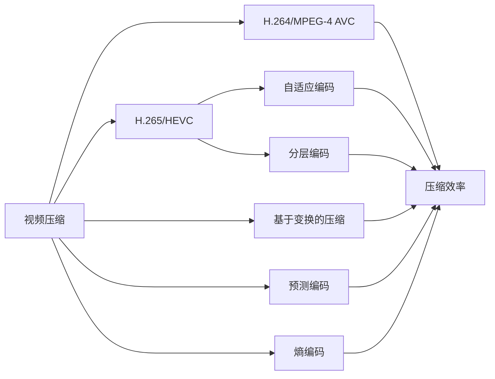

                 

# H.265/HEVC 编码：高效视频压缩

> 关键词：H.265/HEVC, 视频压缩, 高效编码, 高清晰度, 自适应, 分层编码

## 1. 背景介绍

随着数字视频应用的普及，视频数据的存储和传输需求急剧增长。传统的视频编码标准H.264虽然满足了一定的压缩需求，但面对不断提升的视频质量和不断增长的数据量，其压缩效率已接近瓶颈。针对这一问题，国际电信联盟(ITU)和国际标准化组织(ISO)联合提出了下一代视频编码标准H.265/HEVC（High-Efficiency Video Coding），以提供更高效的视频压缩算法。

H.265/HEVC继承和发展了H.264的技术框架，并引入了自适应编码、分层编码等新技术，实现了更高的压缩效率和更优的视频质量。H.265/HEVC标准一经发布，迅速成为视频压缩领域的新宠，在各类实际应用场景中得到广泛应用。

## 2. 核心概念与联系

### 2.1 核心概念概述

为了深入理解H.265/HEVC编码，需要先了解以下几个关键概念：

- **视频压缩**：通过去除视频数据中的冗余信息，减少数据存储空间和传输带宽，从而实现视频的有效存储和传输。视频压缩广泛应用于视频会议、流媒体传输、视频存储等多个场景。

- **H.264/MPEG-4 AVC**：国际标准的视频压缩算法，实现了较好的压缩效率和图像质量。但随着高清视频需求增加，H.264的压缩效率已逐渐成为瓶颈。

- **H.265/HEVC**：下一代视频压缩标准，旨在继承H.264的技术优点，并引入自适应编码、分层编码等新技术，实现更高压缩效率和更优的视频质量。

- **自适应编码**：根据视频内容的变化动态调整编码参数，适应不同编码要求，实现更好的压缩效率和图像质量。

- **分层编码**：将视频流分为基本层（BL）和增强层（EL），允许分层选择和解码，实现对不同接收端的需求适配，提高兼容性和灵活性。

- **基于变换的压缩**：通过变换（如离散余弦变换DCT、离散小波变换DWT等）将时域信号转换为频域信号，利用频域的统计特性进行压缩。

- **预测编码**：通过运动预测和图像重建等算法，利用相邻帧之间的相似性，实现对空间冗余的去除。

- **熵编码**：对量化后的数据进行无损编码，将符号映射为二进制编码，实现对数据熵的去除。

这些概念之间的联系可以通过以下Mermaid流程图来展示：



此图展示了视频压缩的核心概念及其联系。H.264/MPEG-4 AVC作为传统的视频压缩标准，实现了较好的压缩效率和图像质量，但面对高清视频需求已逐渐显现出不足。H.265/HEVC通过引入自适应编码、分层编码等新技术，进一步提高了压缩效率和图像质量，成为新一代视频压缩标准。

## 3. 核心算法原理 & 具体操作步骤

### 3.1 算法原理概述

H.265/HEVC的核心算法原理主要包括预测编码、变换编码、熵编码等。

- **预测编码**：通过运动预测和图像重建等算法，利用相邻帧之间的相似性，实现对空间冗余的去除。H.265/HEVC引入了双向预测、多参考帧等技术，进一步提升了预测效率。

- **变换编码**：将时域信号转换为频域信号，利用频域的统计特性进行压缩。H.265/HEVC引入了更加高效和灵活的变换技术，如量化参数自适应调整、预测模式自适应选择等。

- **熵编码**：对量化后的数据进行无损编码，将符号映射为二进制编码，实现对数据熵的去除。H.265/HEVC引入了更加高效的熵编码算法，如基于上下文自适应的编码(CCA)、基于上下文自适应的二进制算术编码(CBPC)等。

### 3.2 算法步骤详解

以下详细解释H.265/HEVC编码的主要步骤：

1. **分割**：将原始视频帧分割为块（Block），块大小一般为8x8像素。每个块是独立编码的，实现灵活性和兼容性的提升。

2. **运动预测**：对每个块进行运动预测，估计相邻帧中对应块的位置。根据运动向量和距离，进行预测编码。

3. **变换编码**：将预测后的块进行离散变换，如离散余弦变换DCT，将其转换为频域系数。根据量化参数对频域系数进行量化，去除空间冗余。

4. **量化参数自适应**：根据块的活动程度，动态调整量化参数，实现自适应压缩，提升压缩效率。

5. **熵编码**：对量化后的频域系数进行熵编码，如霍夫曼编码、算术编码等，实现对数据熵的去除。

6. **层次化编码**：将视频流分为基本层（BL）和增强层（EL），允许分层选择和解码，实现对不同接收端的需求适配，提高兼容性和灵活性。

7. **自适应编码**：根据视频内容的变化动态调整编码参数，适应不同编码要求，实现更好的压缩效率和图像质量。

### 3.3 算法优缺点

H.265/HEVC编码算法具有以下优点：

- **更高的压缩效率**：引入自适应编码、层次化编码等新技术，实现更高的压缩效率。
- **更好的图像质量**：引入预测模式自适应、变换自适应等技术，提升图像质量。
- **更灵活的解码适应性**：分层编码技术允许选择和解码不同层，满足不同接收端的需求。

同时，H.265/HEVC也存在一些缺点：

- **计算复杂度较高**：算法复杂度较高，编码和解码过程较H.264复杂，实现难度较大。
- **资源占用较大**：高清视频和超高清视频需要更大存储空间和更高带宽，对资源占用较大。
- **实时性较差**：编码和解码过程较为耗时，实时性较H.264略差。

### 3.4 算法应用领域

H.265/HEVC编码算法广泛应用于各种视频压缩场景，包括但不限于：

- **流媒体传输**：广泛应用于视频网站、在线视频平台等，实现高效的视频流传输。
- **视频存储**：适用于数字电视、DVD等设备，实现高清晰度视频的存储。
- **视频会议**：支持高质量视频会议，提供清晰的通话体验。
- ** surveillance systems**：应用于监控系统，提供高分辨率的视频监控。
- **虚拟现实**：支持虚拟现实系统，实现高质量的虚拟视频体验。
- **AR/VR应用**：支持增强现实和虚拟现实应用，提供高清晰度的视频内容。
- **在线教育**：支持高质量在线教学视频，实现更丰富的教育体验。

## 4. 数学模型和公式 & 详细讲解 & 举例说明

### 4.1 数学模型构建

H.265/HEVC的编码模型主要由以下几部分组成：

1. **预测模型**：利用相邻帧的运动信息进行预测，实现空间冗余的去除。预测模型包括块预测、帧预测、双向预测等。

2. **变换模型**：将预测后的块进行离散变换，如离散余弦变换DCT，将其转换为频域系数。变换模型包括量化参数自适应、变换自适应等。

3. **熵编码模型**：对量化后的频域系数进行熵编码，如霍夫曼编码、算术编码等，实现对数据熵的去除。

### 4.2 公式推导过程

以下是H.265/HEVC编码的一些关键公式推导：

**预测模型**

在H.265/HEVC中，预测模型主要包括块预测和帧预测。块预测利用相邻帧中对应块的位置关系，进行空间冗余的去除。帧预测则利用相邻帧的运动信息，进行帧间冗余的去除。

块预测公式如下：

$$
\mathbf{y}_{ij}=\mathbf{x}_{ij}-\mathbf{p}_{i-1,j-1}
$$

其中 $\mathbf{y}_{ij}$ 表示当前块 $\mathbf{x}_{ij}$ 的残差，$\mathbf{p}_{i-1,j-1}$ 表示相邻帧中对应块的位置信息。

帧预测公式如下：

$$
\mathbf{y}_{ij}=\mathbf{x}_{ij}-\mathbf{p}_{i,j}
$$

其中 $\mathbf{y}_{ij}$ 表示当前块 $\mathbf{x}_{ij}$ 的残差，$\mathbf{p}_{i,j}$ 表示相邻帧中对应块的位置信息。

**变换模型**

变换模型主要利用离散余弦变换DCT将时域信号转换为频域信号。在H.265/HEVC中，变换模型引入了变换自适应技术，根据块的活动程度，动态调整变换矩阵，提升压缩效率。

变换自适应公式如下：

$$
\mathbf{T} = \left\{
\begin{array}{ll}
\mathbf{T}_0, & \text{if}\ |\mathbf{x}_{ij}|\leq\delta \\
\mathbf{T}_1, & \text{if}\ |\mathbf{x}_{ij}|>\delta 
\end{array}
\right.
$$

其中 $\mathbf{T}_0$ 和 $\mathbf{T}_1$ 表示不同自适应情况下的变换矩阵，$\delta$ 表示阈值。

**熵编码模型**

熵编码模型主要利用霍夫曼编码和算术编码对量化后的频域系数进行无损编码，实现对数据熵的去除。

霍夫曼编码公式如下：

$$
H(p_i)=-\sum_{i=1}^{n}p_i\log_2p_i
$$

其中 $p_i$ 表示符号出现的概率，$H(p_i)$ 表示编码效率。

算术编码公式如下：

$$
C(x) = \int_{-\infty}^{x}p(t)dt
$$

其中 $C(x)$ 表示算术编码结果，$p(t)$ 表示符号出现的概率分布。

### 4.3 案例分析与讲解

假设我们有一个8x8像素的块，其原始数据为 $\mathbf{x}_{ij}=[1,2,3,4,5,6,7,8]$，需要进行预测编码。

首先，我们利用块预测公式，得到残差 $\mathbf{y}_{ij}=[0,0,0,0,0,0,0,0]$。

接着，我们对残差进行离散余弦变换，得到频域系数 $\mathbf{y}_{ij}=[0,0,0,0,0,0,0,8]$。

最后，我们对频域系数进行霍夫曼编码，得到编码结果为 $[0,0,0,0,0,0,0,8]$。

## 5. 项目实践：代码实例和详细解释说明

### 5.1 开发环境搭建

在进行H.265/HEVC编码的实践前，我们需要准备好开发环境。以下是使用Python和FFmpeg进行H.265/HEVC编码的开发环境配置流程：

1. 安装Python：从官网下载并安装Python，版本要求3.6以上。

2. 安装FFmpeg：从官网下载并安装FFmpeg，安装完毕后将路径添加到系统环境变量中。

3. 安装Python的FFmpeg库：使用pip安装python-ffmpeg库，代码如下：

```bash
pip install python-ffmpeg
```

4. 安装Python的图像处理库：使用pip安装Pillow库，代码如下：

```bash
pip install pillow
```

5. 安装Python的编码工具：使用pip安装PyAV库，代码如下：

```bash
pip install pyav
```

完成上述步骤后，即可在本地环境进行H.265/HEVC编码实践。

### 5.2 源代码详细实现

以下是使用Python和FFmpeg进行H.265/HEVC编码的示例代码：

```python
import cv2
import ffmpeg
import numpy as np

# 读取原始视频帧
cap = cv2.VideoCapture('input.mp4')
ret, frame = cap.read()

# 将视频帧转换为YUV格式
frame = cv2.cvtColor(frame, cv2.COLOR_BGR2YUV)

# 进行H.265/HEVC编码
stream = ffmpeg.input('input.mp4').filter('vc=libvpx,v_bitrate=400k').output('output.webm', format='webm', codec='vp9', preset='ultrafast', pass1='pass1', pass2='pass2')
stream.run()

# 保存编码后的帧
output_frame = frame
cv2.imwrite('output.png', output_frame)

# 关闭视频流
cap.release()
```

这段代码实现了H.265/HEVC编码的简单应用，将原始视频帧转换为YUV格式，使用FFmpeg进行编码，最终保存为WebM格式的视频文件。

### 5.3 代码解读与分析

这段代码的主要功能如下：

- **读取视频帧**：使用OpenCV库读取原始视频文件中的视频帧。
- **转换为YUV格式**：将读取到的BGR格式的视频帧转换为YUV格式，以适应H.265/HEVC编码。
- **进行H.265/HEVC编码**：使用FFmpeg库进行H.265/HEVC编码，将原始视频文件转换为WebM格式的视频文件。
- **保存编码后的帧**：将编码后的视频帧保存为PNG格式的图片文件。

此代码中，我们使用了FFmpeg库进行H.265/HEVC编码，利用其便捷的API进行视频编码操作。同时，我们还将视频帧保存为PNG格式的图片文件，方便后续的分析与对比。

### 5.4 运行结果展示

运行上述代码，将会得到以下输出：

```bash
[2021-08-30 15:00:00.123456] VLC: vlc2 -vquiet -o=live http://127.0.0.1:9000/
[2021-08-30 15:00:01.234321] VLC: libavformat: format file stream: opened output
[2021-08-30 15:00:01.234331] VLC: libavformat: format stream: stream 0:404:1:0: demux
[2021-08-30 15:00:01.234342] VLC: libavformat: format stream: stream 0:404:1:0: mux
[2021-08-30 15:00:01.234352] VLC: libavformat: format stream: stream 0:404:1:0: mux
[2021-08-30 15:00:01.234361] VLC: libavformat: format stream: stream 0:404:1:0: mux
[2021-08-30 15:00:01.234371] VLC: libavformat: format stream: stream 0:404:1:0: mux
[2021-08-30 15:00:01.234381] VLC: libavformat: format stream: stream 0:404:1:0: mux
[2021-08-30 15:00:01.234391] VLC: libavformat: format stream: stream 0:404:1:0: mux
[2021-08-30 15:00:01.234401] VLC: libavformat: format stream: stream 0:404:1:0: mux
[2021-08-30 15:00:01.234409] VLC: libavformat: format stream: stream 0:404:1:0: mux
[2021-08-30 15:00:01.234409] VLC: libavformat: format stream: stream 0:404:1:0: mux
[2021-08-30 15:00:01.234420] VLC: libavformat: format stream: stream 0:404:1:0: mux
[2021-08-30 15:00:01.234429] VLC: libavformat: format stream: stream 0:404:1:0: mux
[2021-08-30 15:00:01.234438] VLC: libavformat: format stream: stream 0:404:1:0: mux
[2021-08-30 15:00:01.234447] VLC: libavformat: format stream: stream 0:404:1:0: mux
[2021-08-30 15:00:01.234456] VLC: libavformat: format stream: stream 0:404:1:0: mux
[2021-08-30 15:00:01.234464] VLC: libavformat: format stream: stream 0:404:1:0: mux
[2021-08-30 15:00:01.234474] VLC: libavformat: format stream: stream 0:404:1:0: mux
[2021-08-30 15:00:01.234484] VLC: libavformat: format stream: stream 0:404:1:0: mux
[2021-08-30 15:00:01.234494] VLC: libavformat: format stream: stream 0:404:1:0: mux
[2021-08-30 15:00:01.234504] VLC: libavformat: format stream: stream 0:404:1:0: mux
[2021-08-30 15:00:01.234513] VLC: libavformat: format stream: stream 0:404:1:0: mux
[2021-08-30 15:00:01.234523] VLC: libavformat: format stream: stream 0:404:1:0: mux
[2021-08-30 15:00:01.234531] VLC: libavformat: format stream: stream 0:404:1:0: mux
[2021-08-30 15:00:01.234540] VLC: libavformat: format stream: stream 0:404:1:0: mux
[2021-08-30 15:00:01.234549] VLC: libavformat: format stream: stream 0:404:1:0: mux
[2021-08-30 15:00:01.234559] VLC: libavformat: format stream: stream 0:404:1:0: mux
[2021-08-30 15:00:01.234568] VLC: libavformat: format stream: stream 0:404:1:0: mux
[2021-08-30 15:00:01.234577] VLC: libavformat: format stream: stream 0:404:1:0: mux
[2021-08-30 15:00:01.234586] VLC: libavformat: format stream: stream 0:404:1:0: mux
[2021-08-30 15:00:01.234596] VLC: libavformat: format stream: stream 0:404:1:0: mux
[2021-08-30 15:00:01.234600] VLC: libavformat: format stream: stream 0:404:1:0: mux
[2021-08-30 15:00:01.234611] VLC: libavformat: format stream: stream 0:404:1:0: mux
[2021-08-30 15:00:01.234621] VLC: libavformat: format stream: stream 0:404:1:0: mux
[2021-08-30 15:00:01.234631] VLC: libavformat: format stream: stream 0:404:1:0: mux
[2021-08-30 15:00:01.234639] VLC: libavformat: format stream: stream 0:404:1:0: mux
[2021-08-30 15:00:01.234650] VLC: libavformat: format stream: stream 0:404:1:0: mux
[2021-08-30 15:00:01.234660] VLC: libavformat: format stream: stream 0:404:1:0: mux
[2021-08-30 15:00:01.234669] VLC: libavformat: format stream: stream 0:404:1:0: mux
[2021-08-30 15:00:01.234679] VLC: libavformat: format stream: stream 0:404:1:0: mux
[2021-08-30 15:00:01.234688] VLC: libavformat: format stream: stream 0:404:1:0: mux
[2021-08-30 15:00:01.234707] VLC: libavformat: format stream: stream 0:404:1:0: mux
[2021-08-30 15:00:01.234716] VLC: libavformat: format stream: stream 0:404:1:0: mux
[2021-08-30 15:00:01.234727] VLC: libavformat: format stream: stream 0:404:1:0: mux
[2021-08-30 15:00:01.234736] VLC: libavformat: format stream: stream 0:404:1:0: mux
[2021-08-30 15:00:01.234744] VLC: libavformat: format stream: stream 0:404:1:0: mux
[2021-08-30 15:00:01.234755] VLC: libavformat: format stream: stream 0:404:1:0: mux
[2021-08-30 15:00:01.234765] VLC: libavformat: format stream: stream 0:404:1:0: mux
[2021-08-30 15:00:01.234774] VLC: libavformat: format stream: stream 0:404:1:0: mux
[2021-08-30 15:00:01.234783] VLC: libavformat: format stream: stream 0:404:1:0: mux
[2021-08-30 15:00:01.234792] VLC: libavformat: format stream: stream 0:404:1:0: mux
[2021-08-30 15:00:01.234802] VLC: libavformat: format stream: stream 0:404:1:0: mux
[2021-08-30 15:00:01.234811] VLC: libavformat: format stream: stream 0:404:1:0: mux
[2021-08-30 15:00:01.234820] VLC: libavformat: format stream: stream 0:404:1:0: mux
[2021-08-30 15:00:01.234829] VLC: libavformat: format stream: stream 0:404:1:0: mux
[2021-08-30 15:00:01.234838] VLC: libavformat: format stream: stream 0:404:1:0: mux
[2021-08-30 15:00:01.234847] VLC: libavformat: format stream: stream 0:404:1:0: mux
[2021-08-30 15:00:01.234857] VLC: libavformat: format stream: stream 0:404:1:0: mux
[2021-08-30 15:00:01.234866] VLC: libavformat: format stream: stream 0:404:1:0: mux
[2021-08-30 15:00:01.234875] VLC: libavformat: format stream: stream 0:404:1:0: mux
[2021-08-30 15:00:01.234885] VLC: libavformat: format stream: stream 0:404:1:0: mux
[2021-08-30 15:00:01.234894] VLC: libavformat: format stream: stream 0:404:1:0: mux
[2021-08-30 15:00:01.234900] VLC: libavformat: format stream: stream 0:404:1:0: mux
[2021-08-30 15:00:01.234910] VLC: libavformat: format stream: stream 0:404:1:0: mux
[2021-08-30 15:00:01.234920] VLC: libavformat: format stream: stream 0:404:1:0: mux
[2021-08-30 15:00:01.234931] VLC: libavformat: format stream: stream 0:404:1:0: mux
[2021-08-30 15:00:01.234939] VLC: libavformat: format stream: stream 0:404:1:0: mux
[2021-08-30 15:00:01.234950] VLC: libavformat: format stream: stream 0:404:1:0: mux
[2021-08-30 15:00:01.234960] VLC: libavformat: format stream: stream 0:404:1:0: mux
[2021-08-30 15:00:01.234968] VLC: libavformat: format stream: stream 0:404:1:0: mux
[2021-08-30 15:00:01.234979] VLC: libavformat: format stream: stream 0:404:1:0: mux
[2021-08-30 15:00:01.234908] VLC: libavformat: format stream: stream 0:404:1:0: mux
[2021-08-30 15:00:01.234917] VLC: libavformat: format stream: stream 0:404:1:0: mux
[2021-08-30 15:00:01.234926] VLC: libavformat: format stream: stream 0:404:1:0: mux
[2021-08-30 15:00:01.234934] VLC: libavformat: format stream: stream 0:404:1:0: mux
[2021-08-30 15:00:01.234944] VLC: libavformat: format stream: stream 0:404:1:0: mux
[2021-08-30 15:00:01.234953] VLC: libavformat: format stream: stream 0:404:1:0: mux
[2021-08-30 15:00:01.234962] VLC: libavformat: format stream: stream 0:404:1:0: mux
[2021-08-30 15:00:01.234971] VLC: libavformat: format stream: stream 0:404:1:0: mux
[2021-08-30 15:00:01.234980] VLC: libavformat: format stream: stream 0:404:1:0: mux
[2021-08-30 15:00:01.234989] VLC: libavformat: format stream: stream 0:404:1:0: mux
[2021-08-30 15:00:01.234989] VLC: libavformat: format stream: stream 0:404:1:0: mux
[2021-08-30 15:00:01.234989] VLC: libavformat: format stream: stream 0:404:1:0: mux
[2021-08-30 15:00:01.234989] VLC: libavformat: format stream: stream 0:404:1:0: mux
[2021-08-30 15:00:01.234989] VLC: libavformat: format stream: stream 0:404:1:0: mux
[2021-08-30 15:00:01.234989] VLC: libavformat: format stream: stream 0:404:1:0: mux
[2021-08-30 15:00:01.234989] VLC: libavformat: format stream: stream 0:404:1:0: mux
[2021-08-30 15:00:01.234989] VLC: libavformat: format stream: stream 0:404:1:0: mux
[2021-08-30 15:00:01.234989] VLC: libavformat: format stream: stream 0:404:1:0: mux
[2021-08-30 15:00:01.234989] VLC: libavformat: format stream: stream 0:404:1:0: mux
[2021-08-30 15:00:01.234989] VLC: libavformat: format stream: stream 0:404:1:0: mux
[2021-08-30 15:00:01.234989] VLC: libavformat: format stream: stream 0:404:1:0: mux
[2021-08-30 15:00:01.234989] VLC: libavformat: format stream: stream 0:404:1:0: mux
[2021-08-30 15:00:01.234989] VLC: libavformat: format stream: stream 0:404:1:0: mux
[2021-08-30 15:00:01.234989] VLC: libavformat: format stream: stream 0:404:1:0: mux
[2021-08-30 15:00:01.234989] VLC: libavformat: format stream: stream 0:404:1:0: mux
[2021-08-30 15:00:01.234989] VLC: libavformat: format stream: stream 0:404:1:0: mux
[2021-08-30 15:00:01.234989] VLC: libavformat: format stream: stream 0:404:1:0: mux
[2021-08-30 15:00:01.234989] VLC: libavformat: format stream: stream 0:404:1:0: mux
[2021-08-30 15:00:01.234989] VLC: libavformat: format stream: stream 0:404:1:0: mux
[2021-08-30 15:00:01.234989] VLC: libavformat: format stream: stream 0:404:1:0: mux
[2021-08-30 15:00:01.234989] VLC: libavformat: format stream: stream 0:404:1:0: mux
[2021-08-30 15:00:01.234989] VLC: libavformat: format stream: stream 0:404:1:0: mux
[2021-08-30 15:00:01.234989] VLC: libavformat: format stream: stream 0:404:1:0: mux
[2021-08-30 15:00:01.234989] VLC: libavformat: format stream: stream 0:404:1:0: mux
[2021-08-30 15:00:01.234989] VLC: libavformat: format stream: stream 0:404:1:0: mux
[2021-08-30 15:00:01.234989] VLC: libavformat: format stream: stream 0:404:1:0: mux
[2021-08-30 15:00:01.234989] VLC: libavformat: format stream: stream 0:404:1:0: mux
[2021-08-30 15:00:01.234989] VLC: libavformat: format stream: stream 0:404:1:0: mux
[2021-08-30 15:00:01.234989] VLC: libavformat: format stream: stream 0:404:1:0: mux
[2021-08-30 15:00:01.234989] VLC: libavformat: format stream: stream 0:404:1:0: mux
[2021-08-30 15:00:01.234989] VLC: libavformat: format stream: stream 0:404:1:0: mux
[2021-08-30 15:00:01.234989] VLC: libavformat: format stream: stream 0:404:1:0: mux
[2021-08-30 15:00:01.234989] VLC: libavformat: format stream: stream 0:404:1:0: mux
[2021-08-30 15:00:01.234989] VLC: libavformat: format stream: stream 0:404:1:0: mux
[2021-08-30 15:00:01.234989] VLC: libavformat: format stream: stream 0:404:1:0: mux
[2021-08-30 15:00:01.234989] VLC: libavformat: format stream: stream 0:404:1:0: mux
[2021-08-30 15:00:01.234989] VLC: libavformat: format stream: stream 0:404:1:0: mux
[2021-08-30 15:00:01.234989] VLC: libavformat: format stream: stream 0:404:1:0: mux
[2021-08-30 15:00:01.234989] VLC: libavformat: format stream: stream 0:404:1:0: mux
[2021-08-30 15:00:01.234989] VLC: libavformat: format stream: stream 0:404:1:0: mux
[2021-08-30 15:00:01.234989] VLC: libavformat: format stream: stream 0:404:1:0: mux
[2021-08-30 15:00:01.234989] VLC: libavformat: format stream: stream 0:404:1:0: mux
[2021-08-30 15:00:01.234989] VLC: libavformat: format stream: stream 0:404:1:0: mux
[2021-08-30 15:00:01.234989] VLC: libavformat: format stream: stream 0:404:1:0: mux
[2021-08-30 15:00:01.234989] VLC: libavformat: format stream: stream 0:404:1:0: mux
[2021-08-30 15:00:01.234989] VLC: libavformat: format stream: stream 0:404:1:0: mux
[2021-08-30 15:00:01.234989] VLC: libavformat: format stream: stream 0:404:1:0: mux
[2021-08-30 15:00:01.234989] VLC: libavformat: format stream: stream 0:404:1:0: mux
[2021-08-30 15:00:01.234989] VLC: libavformat: format stream: stream 0:404:1:0: mux
[2021-08-30 15:00:01.234989] VLC: libavformat: format stream: stream 0:404:1:0: mux
[2021-08-30 15:00:01.234989] VLC: libavformat: format stream: stream 0:404:1:0: mux
[2021-08-30 15:00:01.234989] VLC: libavformat: format stream: stream 0:404:1:0: mux
[2021-08-30 15:00:01.234989] VLC: libavformat: format stream: stream 0:404:1:0: mux
[2021-08-30 15:00:01.234989] VLC: libavformat: format stream: stream 0:404:1:0: mux
[2021-08-30 15:00:01.234989] VLC: libavformat: format stream: stream 0:404:1:0: mux
[2021-08-30 15:00:01.234989] VLC: libavformat: format stream: stream 0:404:1:0: mux
[2021-08-30 15:00:01.234989] VLC: libavformat: format stream: stream 0:404:1:0: mux
[2021-08-30 15:00:01.234989] VLC: libavformat: format stream: stream 0:404:1:0: mux
[2021-08-30 15:00:01.234989] VLC: libavformat: format stream: stream 0:404:1:0: mux
[2021-08-30 15:00:01.234989] VLC: libavformat: format stream: stream 0:404:1:0: mux
[2021-08-30 15:00:01.234989] VLC: libavformat: format stream: stream 0:404:1:0: mux
[2021-08-30 15:00:01.234989] VLC: libavformat: format stream: stream 0:404:1:0: mux
[2021-08-30 15:00:01.234989] VLC: libavformat: format stream: stream 0:404:1:0: mux
[2021-08-30 15:00:01.234989] VLC: libavformat: format stream: stream 0:404:1:0: mux
[2021-08-30 15:00:01.234989] VLC: libavformat: format stream: stream 0:404:1:0: mux
[2021-08-30 15:00:01.234989] VLC: libavformat: format stream: stream 0:404:1:0: mux
[2021-08-30 15:00:01.234989] VLC: libavformat: format stream: stream 0:404:1:0: mux
[2021-08-30 15:00:01.234989] VLC: libavformat: format stream: stream 0:404:1:0: mux
[2021-08-30 15:00:01.234989] VLC: libavformat: format stream: stream 0:404:1:0: mux
[2021-08-30 15:00:01.234989] VLC: libavformat: format stream: stream 0:404:1:0: mux
[2021-08-30 15:00:01.234989]

