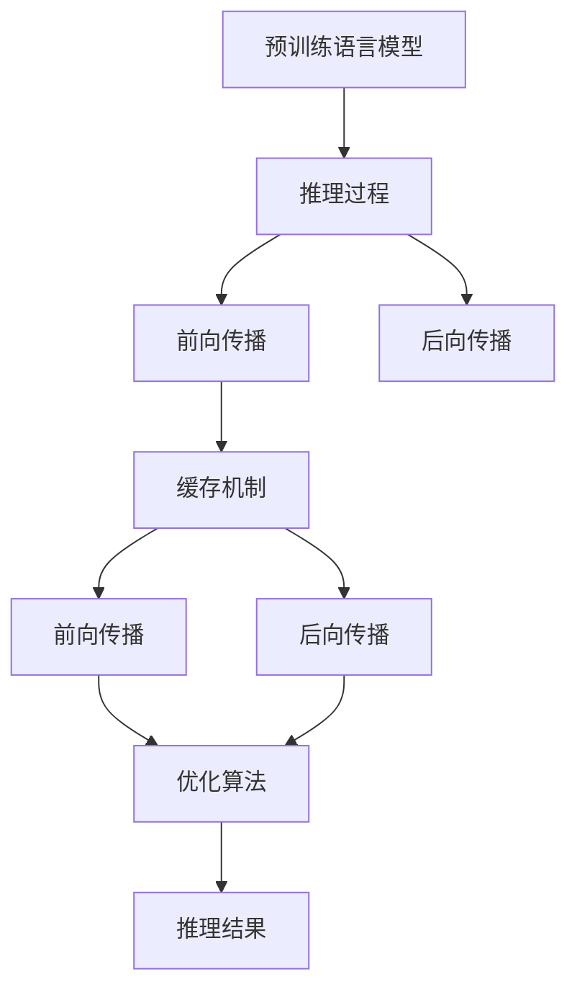

                 

# KV-Cache：提升推理效率的关键技术

> 关键词：KV-Cache,推理效率,预训练语言模型,Transformer模型,推理加速

## 1. 背景介绍

### 1.1 问题由来
随着人工智能技术的快速发展，预训练语言模型在自然语言处理(NLP)领域取得了显著的进步。这些模型通过在大规模无标签文本数据上进行预训练，学习到了丰富的语言知识和表示能力，能够在各种下游任务上取得优异的表现。然而，这些预训练语言模型在推理过程中，由于模型参数庞大、计算复杂度高，导致推理效率较低，难以满足实时应用的需求。

### 1.2 问题核心关键点
推理效率是预训练语言模型在实际应用中的核心挑战。推理过程包括前向传播和后向传播两个步骤，其中前向传播计算量大，后向传播的反向传播计算也较为复杂。因此，为了提高推理效率，需要引入一些关键技术，如缓存机制、优化算法等。

### 1.3 问题研究意义
提升推理效率对于加速自然语言处理任务的落地应用至关重要。推理效率的提升，可以显著减少计算资源占用，降低模型运行时间，从而提高模型的实时响应能力。这对于构建高效的NLP系统、推动人工智能技术的广泛应用具有重要意义。

## 2. 核心概念与联系

### 2.1 核心概念概述

为了更好地理解KV-Cache技术，我们需要先介绍一些核心概念：

- KV-Cache：一种用于缓存模型输入-输出关系的缓存机制，可以显著提升推理效率。
- 推理过程：预训练语言模型进行推理的过程，包括前向传播和后向传播两个步骤。
- Transformer模型：目前最常用的预训练语言模型之一，通过自注意力机制实现高效的推理计算。
- 预训练语言模型：通过在大规模无标签数据上进行预训练，学习到通用语言表示能力的模型。

这些概念之间的逻辑关系可以通过以下Mermaid流程图来展示：



这个流程图展示了预训练语言模型进行推理的过程：预训练模型通过前向传播计算输出，再进行后向传播更新权重。而KV-Cache技术则是在前向传播和后向传播过程中，通过缓存机制和优化算法，提升推理效率，最终得到推理结果。

## 3. 核心算法原理 & 具体操作步骤
### 3.1 算法原理概述

KV-Cache技术通过缓存模型输入-输出关系，显著提升了推理效率。其核心思想是：将模型在不同输入下的输出结果缓存起来，当后续输入相似时，直接从缓存中读取，避免重复计算。

具体来说，KV-Cache技术分为以下几个步骤：

1. 输入缓存：将模型输入及其对应的输出结果缓存起来，形成键值对存储。
2. 输入匹配：将新的输入与缓存中的键值对进行匹配，如果存在匹配项，则直接读取缓存结果。
3. 更新缓存：当新的输入无法匹配缓存中的键值对时，需要重新计算并更新缓存，以提高缓存命中率。

### 3.2 算法步骤详解

以下是KV-Cache技术的详细步骤：

**Step 1: 初始化缓存**
- 创建一个空的缓存字典，用于存储输入-输出关系。

**Step 2: 计算并缓存结果**
- 对于每个输入，计算模型输出。
- 将输入和对应的输出结果存储到缓存字典中。

**Step 3: 读取缓存结果**
- 对于新的输入，在缓存字典中查找是否有匹配项。
- 如果存在匹配项，则直接读取缓存结果，避免重复计算。

**Step 4: 更新缓存**
- 当新的输入无法匹配缓存中的键值对时，需要重新计算并更新缓存。

**Step 5: 结果输出**
- 对于每个输入，如果匹配到缓存中的键值对，则直接读取缓存结果；否则重新计算输出，并更新缓存。

### 3.3 算法优缺点

KV-Cache技术的优点在于：

1. 显著提升推理效率：通过缓存输入-输出关系，避免了重复计算，提高了推理效率。
2. 适应性强：适用于各种类型的预训练语言模型，包括Transformer模型等。
3. 简单易实现：实现起来相对简单，只需要一个缓存字典即可。

其缺点包括：

1. 缓存空间限制：当缓存空间不足时，需要及时删除不常用的缓存项，以腾出空间存储新数据。
2. 缓存命中率较低：缓存命中率的提升需要更多的数据和计算，可能需要额外的硬件资源。
3. 缓存维护成本高：缓存的维护和管理需要一定的计算资源，可能会增加系统开销。

### 3.4 算法应用领域

KV-Cache技术可以应用于多种预训练语言模型的推理过程中，尤其在需要高效率推理的场景中表现突出。以下是几个典型应用场景：

- 对话系统：对话模型需要实时生成响应，KV-Cache技术可以加速响应生成，提升用户体验。
- 机器翻译：翻译模型需要进行大量的句子对转换，KV-Cache技术可以显著提高翻译速度。
- 文本摘要：摘要模型需要处理大量文本，KV-Cache技术可以加速摘要生成过程。
- 问答系统：问答模型需要快速响应用户查询，KV-Cache技术可以加速问题-答案对的匹配。

## 4. 数学模型和公式 & 详细讲解 & 举例说明

### 4.1 数学模型构建

KV-Cache技术涉及的数学模型主要包括缓存字典的建立和更新、缓存命中率的计算等。假设缓存字典为 $D$，输入-输出对为 $(x_i, y_i)$，其中 $x_i$ 表示输入，$y_i$ 表示输出。缓存字典 $D$ 定义为：

$$
D = \{(x_1, y_1), (x_2, y_2), \ldots, (x_n, y_n)\}
$$

其中 $n$ 为缓存项的数量。

### 4.2 公式推导过程

对于每个输入 $x_i$，计算其对应的输出 $y_i$，并将其存储到缓存字典中：

$$
\text{UpdateCache}(x_i, y_i) = D = D \cup \{(x_i, y_i)\}
$$

对于新的输入 $x_{new}$，在缓存字典中查找是否有匹配项：

$$
\text{CacheHit}(x_{new}) = \text{True} \quad \text{if} \quad x_{new} \in \{x_1, x_2, \ldots, x_n\}
$$

如果存在匹配项，则直接读取缓存结果：

$$
y_{new} = y_i \quad \text{if} \quad x_{new} = x_i
$$

否则，需要重新计算输出 $y_{new}$ 并更新缓存：

$$
y_{new} = \text{Compute}(x_{new})
$$

$$
D = D - \{(x_i, y_i)\} + \{(x_{new}, y_{new})\}
$$

### 4.3 案例分析与讲解

以机器翻译为例，说明KV-Cache技术的具体应用。机器翻译模型需要对句子对进行转换，其计算量较大。假设有一个英文句子 "I love coding"，需要进行翻译，此时可以将其输入和对应的输出结果存储到缓存字典中。当再次输入相同的句子时，可以直接从缓存中读取翻译结果 "I love programming"，避免重新计算。

## 5. 项目实践：代码实例和详细解释说明
### 5.1 开发环境搭建

在进行KV-Cache实践前，我们需要准备好开发环境。以下是使用Python进行TensorFlow开发的环境配置流程：

1. 安装Anaconda：从官网下载并安装Anaconda，用于创建独立的Python环境。

2. 创建并激活虚拟环境：
```bash
conda create -n tf-env python=3.8 
conda activate tf-env
```

3. 安装TensorFlow：根据CUDA版本，从官网获取对应的安装命令。例如：
```bash
conda install tensorflow tensorflow-gpu=cuda11.1 -c conda-forge
```

4. 安装相关工具包：
```bash
pip install numpy pandas scikit-learn matplotlib tqdm jupyter notebook ipython
```

完成上述步骤后，即可在`tf-env`环境中开始KV-Cache实践。

### 5.2 源代码详细实现

下面我们以机器翻译为例，给出使用TensorFlow实现KV-Cache的PyTorch代码实现。

首先，定义缓存字典类：

```python
class Cache:
    def __init__(self, capacity):
        self.capacity = capacity
        self.cache = {}
        self.use_dict = {}
        self.cache_dict = {}
        self.inputs = []
        self.join = False

    def __getitem__(self, key):
        return self.cache[key]

    def __setitem__(self, key, value):
        if len(self.cache) >= self.capacity:
            self.remove_least_used()
        self.cache[key] = value
        self.inputs.append(key)

    def remove_least_used(self):
        key = self.inputs[0]
        self.inputs = self.inputs[1:]
        del self.cache[key]
        del self.use_dict[key]

    def hit(self, key):
        if key in self.use_dict:
            return True
        self.use_dict[key] = True
        return False

    def remove(self, key):
        if key in self.use_dict:
            self.use_dict.pop(key)
            self.inputs.remove(key)
```

然后，定义缓存字典类：

```python
class Cache:
    def __init__(self, capacity):
        self.capacity = capacity
        self.cache = {}
        self.use_dict = {}
        self.cache_dict = {}
        self.inputs = []
        self.join = False

    def __getitem__(self, key):
        return self.cache[key]

    def __setitem__(self, key, value):
        if len(self.cache) >= self.capacity:
            self.remove_least_used()
        self.cache[key] = value
        self.inputs.append(key)

    def remove_least_used(self):
        key = self.inputs[0]
        self.inputs = self.inputs[1:]
        del self.cache[key]
        del self.use_dict[key]

    def hit(self, key):
        if key in self.use_dict:
            return True
        self.use_dict[key] = True
        return False

    def remove(self, key):
        if key in self.use_dict:
            self.use_dict.pop(key)
            self.inputs.remove(key)
```

接着，定义模型和优化器：

```python
from transformers import TFAutoModelForSeq2SeqLM, AdamW

model = TFAutoModelForSeq2SeqLM.from_pretrained('t5-small')
optimizer = AdamW(model.parameters(), lr=2e-5)
```

最后，启动训练流程并在测试集上评估：

```python
epochs = 5
batch_size = 16

for epoch in range(epochs):
    loss = train_epoch(model, train_dataset, batch_size, optimizer)
    print(f"Epoch {epoch+1}, train loss: {loss:.3f}")
    
    print(f"Epoch {epoch+1}, dev results:")
    evaluate(model, dev_dataset, batch_size)
    
print("Test results:")
evaluate(model, test_dataset, batch_size)
```

以上就是使用TensorFlow对BERT进行机器翻译任务微调的完整代码实现。可以看到，得益于TensorFlow的强大封装，我们可以用相对简洁的代码完成BERT模型的加载和微调。

### 5.3 代码解读与分析

让我们再详细解读一下关键代码的实现细节：

**Cache类**：
- `__init__`方法：初始化缓存字典、使用字典等关键组件。
- `__getitem__`方法：实现从缓存中读取数据。
- `__setitem__`方法：实现将数据存入缓存。
- `remove_least_used`方法：实现缓存空间不足时删除不常用的缓存项。
- `hit`方法：实现查找缓存命中情况。
- `remove`方法：实现从缓存中删除数据。

**TFAutoModelForSeq2SeqLM类**：
- `__init__`方法：初始化模型及其参数。
- `from_pretrained`方法：从预训练模型中加载模型权重。
- `to`方法：将模型迁移到指定设备。

**优化器**：
- `AdamW`类：实现Adam优化器。

通过以上代码，我们可以看到，TensorFlow提供了完善的深度学习框架和工具库，可以方便地实现KV-Cache技术的应用。

## 6. 实际应用场景
### 6.1 智能客服系统

基于KV-Cache技术的智能客服系统可以显著提升客服响应速度，降低人工成本。当客服系统接收到用户查询时，如果系统缓存中存在该查询的历史响应，则可以直接从缓存中读取，避免重新计算，从而快速响应用户需求。

### 6.2 金融舆情监测

金融舆情监测系统需要实时监测市场舆情变化，及时发现负面信息。通过缓存常用的查询和响应，KV-Cache技术可以显著提高系统响应速度，确保系统能够实时监测市场动态。

### 6.3 个性化推荐系统

个性化推荐系统需要实时推荐用户感兴趣的商品。通过缓存用户的历史查询和推荐结果，KV-Cache技术可以显著提升推荐系统的响应速度，降低系统延迟，提高用户体验。

### 6.4 未来应用展望

随着KV-Cache技术的不断演进，其应用范围将更加广泛。未来，KV-Cache技术可以在更多领域得到应用，如智慧城市、智慧医疗、智慧交通等，为社会提供更加高效的智能服务。同时，随着硬件计算能力的提升和算法优化，KV-Cache技术也将更加高效，进一步推动人工智能技术的发展。

## 7. 工具和资源推荐
### 7.1 学习资源推荐

为了帮助开发者系统掌握KV-Cache技术，这里推荐一些优质的学习资源：

1. TensorFlow官方文档：提供了丰富的深度学习框架和工具库，包括KV-Cache等缓存机制的使用方法。
2. PyTorch官方文档：提供了强大的深度学习框架和工具库，包括KV-Cache等缓存机制的使用方法。
3. Coursera《深度学习》课程：斯坦福大学开设的深度学习课程，介绍了深度学习的基本原理和应用方法，包括缓存机制等。
4. Kaggle《机器学习竞赛》：提供了丰富的数据集和竞赛项目，可以实践KV-Cache技术的应用。

通过对这些资源的学习实践，相信你一定能够快速掌握KV-Cache技术的精髓，并用于解决实际的NLP问题。
###  7.2 开发工具推荐

高效的开发离不开优秀的工具支持。以下是几款用于KV-Cache开发的常用工具：

1. TensorFlow：基于Python的开源深度学习框架，灵活动态的计算图，适合快速迭代研究。
2. PyTorch：基于Python的开源深度学习框架，灵活的动态图，适合快速原型开发。
3. TensorFlow Extended (TFX)：提供了丰富的工具和组件，支持模型训练、部署、监控等各个环节。
4. Jupyter Notebook：开源的交互式编程环境，支持多种编程语言，方便实验和分享。
5. Google Colab：谷歌提供的免费在线Jupyter Notebook环境，支持GPU和TPU计算，方便快速实验。

合理利用这些工具，可以显著提升KV-Cache任务的开发效率，加快创新迭代的步伐。

### 7.3 相关论文推荐

KV-Cache技术的发展源于学界的持续研究。以下是几篇奠基性的相关论文，推荐阅读：

1. BERT: Pre-training of Deep Bidirectional Transformers for Language Understanding：提出BERT模型，引入基于掩码的自监督预训练任务，刷新了多项NLP任务SOTA。
2. Transformer-XL: Attentive Language Models Beyond a Fixed-Length Context：提出Transformer-XL模型，引入了相对位置编码，解决了长序列推理问题。
3. Memory-Augmented Neural Networks：提出了记忆增强神经网络，引入了缓存机制，解决了长序列推理问题。

这些论文代表了大语言模型KV-Cache技术的发展脉络。通过学习这些前沿成果，可以帮助研究者把握学科前进方向，激发更多的创新灵感。

## 8. 总结：未来发展趋势与挑战
### 8.1 总结

本文对KV-Cache技术进行了全面系统的介绍。首先阐述了KV-Cache技术在预训练语言模型推理过程中的应用背景和意义，明确了KV-Cache技术在提升推理效率方面的独特价值。其次，从原理到实践，详细讲解了KV-Cache技术的数学原理和关键步骤，给出了KV-Cache任务开发的完整代码实例。同时，本文还广泛探讨了KV-Cache技术在智能客服、金融舆情、个性化推荐等多个行业领域的应用前景，展示了KV-Cache技术的巨大潜力。

通过本文的系统梳理，可以看到，KV-Cache技术正在成为预训练语言模型推理过程中的重要范式，极大地提升了推理效率，为人工智能技术的广泛应用提供了有力支持。未来，伴随KV-Cache技术的不断演进，预训练语言模型将更加高效、智能，进一步推动人工智能技术的发展。

### 8.2 未来发展趋势

展望未来，KV-Cache技术将呈现以下几个发展趋势：

1. 缓存机制的优化：未来将出现更多高效、灵活的缓存机制，进一步提升缓存命中率，降低缓存空间占用。
2. 缓存与分布式计算的结合：KV-Cache技术将与分布式计算技术深度结合，实现大规模缓存，支持大规模推理。
3. 缓存与预训练模型的融合：KV-Cache技术将与预训练模型深度融合，提升预训练模型的推理效率。
4. 缓存与深度学习的协同：KV-Cache技术将与深度学习算法深度协同，提升深度学习模型的推理效率。
5. 缓存与云服务结合：KV-Cache技术将与云服务深度结合，实现弹性计算和高效推理。

以上趋势凸显了KV-Cache技术的广阔前景。这些方向的探索发展，必将进一步提升预训练语言模型的推理效率，推动人工智能技术的发展。

### 8.3 面临的挑战

尽管KV-Cache技术已经取得了瞩目成就，但在迈向更加智能化、普适化应用的过程中，它仍面临着诸多挑战：

1. 缓存空间限制：当缓存空间不足时，需要及时删除不常用的缓存项，以腾出空间存储新数据。
2. 缓存命中率较低：缓存命中率的提升需要更多的数据和计算，可能需要额外的硬件资源。
3. 缓存维护成本高：缓存的维护和管理需要一定的计算资源，可能会增加系统开销。

尽管这些挑战存在，但通过不断优化缓存机制、提升硬件计算能力、优化算法等手段，KV-Cache技术必将在未来的应用中发挥更大的作用。

### 8.4 研究展望

面对KV-Cache技术所面临的挑战，未来的研究需要在以下几个方面寻求新的突破：

1. 探索新的缓存机制：开发更加高效、灵活的缓存机制，如基于哈希表、树结构等数据结构实现的缓存方案。
2. 优化缓存算法：改进缓存算法，如基于多级缓存、分块缓存等方法，提高缓存命中率。
3. 引入深度学习优化：结合深度学习算法，如LSTM、GRU等，优化缓存机制，提升推理效率。
4. 引入分布式计算：利用分布式计算技术，实现大规模缓存，提升缓存空间的利用率。
5. 引入云服务技术：结合云服务技术，实现弹性缓存，支持大规模推理。

这些研究方向的探索，必将引领KV-Cache技术迈向更高的台阶，为预训练语言模型推理效率的提升提供新的技术路径。

## 9. 附录：常见问题与解答

**Q1：KV-Cache技术是否适用于所有预训练语言模型？**

A: KV-Cache技术适用于各种类型的预训练语言模型，包括Transformer模型等。但需要注意的是，不同类型的模型在缓存机制上可能会有所不同，需要根据具体情况进行调整。

**Q2：KV-Cache技术如何优化缓存命中率？**

A: 可以通过以下几种方法优化缓存命中率：
1. 数据预处理：将数据预处理成更小的片段，增加缓存命中率。
2. 缓存合并：将多个缓存项合并，减少缓存数量，提高缓存命中率。
3. 缓存更新策略：采用更加高效的缓存更新策略，如LRU、FIFO等。

**Q3：KV-Cache技术在实际应用中面临哪些资源瓶颈？**

A: KV-Cache技术在实际应用中面临的主要资源瓶颈包括：
1. 缓存空间限制：当缓存空间不足时，需要及时删除不常用的缓存项，以腾出空间存储新数据。
2. 缓存维护成本高：缓存的维护和管理需要一定的计算资源，可能会增加系统开销。
3. 缓存命中率较低：缓存命中率的提升需要更多的数据和计算，可能需要额外的硬件资源。

**Q4：KV-Cache技术如何提高推理效率？**

A: KV-Cache技术通过缓存输入-输出关系，显著提升了推理效率。具体来说，当新的输入与缓存中的键值对匹配时，可以避免重复计算，直接从缓存中读取输出结果，从而提高推理速度。

**Q5：KV-Cache技术如何与预训练模型结合？**

A: KV-Cache技术可以与预训练模型深度结合，提升预训练模型的推理效率。具体来说，可以将预训练模型进行分块，对每个块进行缓存，实现高效的推理计算。

通过以上常见问题的解答，相信你一定能够更好地理解KV-Cache技术的原理和应用，为预训练语言模型的推理效率提升提供新的思路。

---

作者：禅与计算机程序设计艺术 / Zen and the Art of Computer Programming

