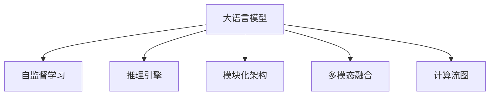

                 

# LLM OS:AI操作系统的雏形

> 关键词：大语言模型, AI操作系统, 自监督学习, 推理引擎, 模块化架构, 扩展性, 应用框架, 多模态融合, 计算流图

## 1. 背景介绍

### 1.1 问题由来
在当今数字化时代，人工智能(AI)技术已经逐渐渗透到我们生活的方方面面，从智能助手、自动驾驶到医疗诊断、金融交易，无处不在。然而，如何构建一个高效、安全、可扩展的AI应用平台，仍然是一个重要且复杂的课题。传统的AI应用往往依赖于固定的算法和模型，难以适应复杂多变的需求。为了应对这些挑战，一个全新的AI操作系统（LLM OS）概念应运而生。

### 1.2 问题核心关键点
LLM OS的核心思想是，将大语言模型（LLM）作为AI操作系统的核心引擎，通过自监督学习和推理引擎，实现AI应用的模块化架构和高效扩展。LLM OS不仅能支持传统机器学习任务，还能处理自然语言理解和生成任务，支持多模态数据的融合，并具有较强的推理和决策能力。

LLM OS的构建分为以下几个关键步骤：
1. 选择预训练语言模型，如BERT、GPT等，进行自监督预训练。
2. 设计推理引擎，实现高效推理和决策。
3. 构建模块化架构，通过插件机制实现动态扩展。
4. 引入多模态数据融合技术，支持图像、语音等多模态输入。
5. 开发应用框架，支持快速构建定制化应用。

### 1.3 问题研究意义
构建LLM OS具有重要的理论和实践意义：
1. 推动AI技术的普及和落地。LLM OS提供了高效、易用的AI应用平台，使得非专家用户也能轻松构建和部署AI应用。
2. 提升AI系统的性能和鲁棒性。LLM OS通过模块化架构和多模态融合技术，提升了AI系统的适应能力和泛化性能。
3. 实现AI应用的可扩展性和定制化。LLM OS支持动态插件机制，用户可以自由定制应用功能，满足特定需求。
4. 促进AI技术与其他领域的融合。LLM OS支持多种应用场景，如智能客服、金融分析、医疗诊断等，推动AI技术在更多领域的应用。

## 2. 核心概念与联系

### 2.1 核心概念概述

为更好地理解LLM OS，本节将介绍几个密切相关的核心概念：

- **大语言模型 (Large Language Model, LLM)**：以自回归（如GPT）或自编码（如BERT）模型为代表的大规模预训练语言模型。通过在大规模无标签文本数据上进行预训练，学习到丰富的语言知识和常识。
- **自监督学习 (Self-Supervised Learning, SSL)**：利用未标注数据进行学习，通过设计一系列自监督任务，如掩码语言模型、预测下一条单词等，自动学习语言表示。
- **推理引擎 (Inference Engine)**：用于高效执行推理和决策的核心组件，支持基于规则、基于模型的推理。
- **模块化架构 (Modular Architecture)**：将系统划分为多个模块，通过插件机制实现动态扩展和功能定制。
- **多模态融合 (Multi-modal Fusion)**：支持图像、语音等多模态数据输入，实现跨模态信息融合和协同推理。
- **计算流图 (Computation Flow Graph, CFG)**：一种图形表示法，用于描述计算流程，支持高效计算和优化。

这些核心概念之间的逻辑关系可以通过以下Mermaid流程图来展示：



这个流程图展示了大语言模型及其相关概念之间的联系：

1. 大语言模型通过自监督学习获得基础能力。
2. 推理引擎实现高效推理和决策。
3. 模块化架构支持动态扩展和功能定制。
4. 多模态融合实现跨模态信息融合。
5. 计算流图用于优化计算流程。

这些概念共同构成了LLM OS的核心，为其高效、灵活、可扩展的应用提供了坚实基础。

## 3. 核心算法原理 & 具体操作步骤
### 3.1 算法原理概述

LLM OS的核心算法原理主要包括自监督学习、推理引擎、模块化架构和多模态融合。其核心思想是通过自监督学习获得语言模型，再利用推理引擎实现高效推理和决策，通过模块化架构实现动态扩展和功能定制，同时支持多模态数据的融合。

### 3.2 算法步骤详解

**Step 1: 准备预训练模型和数据集**

1. 选择合适的预训练语言模型 $M_{\theta}$，如BERT、GPT等，作为初始化参数。
2. 准备自监督学习任务的数据集，如语言掩码预测、下一条单词预测等。
3. 对数据集进行预处理，包括分词、编码、填充等。

**Step 2: 设计推理引擎**

1. 确定推理引擎的架构，如基于规则的推理引擎、基于神经网络的推理引擎等。
2. 设计推理规则，包括语法、语义、逻辑等。
3. 实现推理引擎的优化，如剪枝、量化、缓存等。

**Step 3: 实现模块化架构**

1. 定义模块化的系统结构，包括功能模块、数据模块、输入输出模块等。
2. 实现插件机制，支持动态扩展和功能定制。
3. 设计接口和协议，实现模块之间的通信和协作。

**Step 4: 引入多模态融合技术**

1. 收集多模态数据，如文本、图像、语音等。
2. 设计多模态融合算法，如特征融合、跨模态对齐等。
3. 实现多模态数据的高效处理和融合。

**Step 5: 开发应用框架**

1. 设计应用框架的API和接口。
2. 实现应用的构建、调试和部署。
3. 支持应用的迭代和优化。

### 3.3 算法优缺点

LLM OS具有以下优点：
1. 高效性：利用预训练语言模型和推理引擎，能够高效地处理自然语言理解和生成任务。
2. 灵活性：通过模块化架构和多模态融合技术，支持动态扩展和功能定制。
3. 可扩展性：通过插件机制和应用框架，支持快速构建和部署新应用。
4. 鲁棒性：多模态融合和多模态数据输入，提高了系统的鲁棒性和适应能力。
5. 可定制性：通过模块化架构和多模态融合，支持各种AI应用场景。

同时，LLM OS也存在一些缺点：
1. 资源消耗大：预训练语言模型和推理引擎需要大量计算资源和内存。
2. 复杂度高：模块化架构和多模态融合技术增加了系统的复杂性。
3. 训练难度高：自监督学习和推理引擎的优化需要丰富的经验和技巧。
4. 应用限制：对于一些特定的应用场景，可能存在性能瓶颈。

### 3.4 算法应用领域

LLM OS在多个领域具有广泛的应用前景，包括但不限于：

- **智能客服系统**：通过多模态融合和推理引擎，实现自然语言理解和生成，提供高效的智能客服服务。
- **金融分析**：利用多模态数据融合和推理引擎，进行市场分析和风险评估，提供智能金融分析服务。
- **医疗诊断**：通过多模态数据融合和推理引擎，实现疾病诊断和治疗建议，提供智能医疗诊断服务。
- **智能制造**：通过多模态数据融合和推理引擎，实现设备监控和故障预测，提供智能制造服务。
- **智慧城市**：通过多模态数据融合和推理引擎，实现交通管理、环境监测等应用，提供智慧城市服务。

这些应用场景展示了LLM OS在解决实际问题方面的巨大潜力。随着技术的不断进步，LLM OS将在更多领域发挥重要作用。

## 4. 数学模型和公式 & 详细讲解 & 举例说明

### 4.1 数学模型构建

在LLM OS中，数学模型主要涉及自监督学习、推理引擎和多模态融合。以下是一些核心模型的数学表示：

- **自监督学习**：
  - 掩码语言模型：$\hat{y} = \arg\max_{y} P(y|x, M_{\theta})$，其中 $x$ 为输入文本，$M_{\theta}$ 为预训练模型，$y$ 为掩码位置预测结果。
  - 下一条单词预测：$\hat{y} = \arg\max_{y} P(y|x, M_{\theta})$，其中 $x$ 为输入文本，$M_{\theta}$ 为预训练模型，$y$ 为下一条单词预测结果。

- **推理引擎**：
  - 基于规则的推理引擎：根据预定义的规则，实现逻辑推理。
  - 基于神经网络的推理引擎：通过训练神经网络，实现基于模型的推理。

- **多模态融合**：
  - 特征融合：$f(x, y) = \alpha x + \beta y$，其中 $x$ 为文本特征，$y$ 为其他模态特征，$\alpha, \beta$ 为权重系数。
  - 跨模态对齐：$Z = \arg\min_{Z} \Vert Z - Y \Vert^2$，其中 $Z$ 为融合后的特征，$Y$ 为多模态数据，$\Vert \cdot \Vert$ 为范数。

### 4.2 公式推导过程

以下以掩码语言模型为例，展示自监督学习的公式推导过程。

假设输入文本为 $x$，预训练模型为 $M_{\theta}$，掩码位置为 $m$，掩码位置预测结果为 $\hat{y}$。掩码语言模型的概率分布为：

$$
P(y|x, M_{\theta}) = \frac{\exp(M_{\theta}(x)[m] \cdot y)}{\sum_{y} \exp(M_{\theta}(x)[m] \cdot y)}
$$

其中 $M_{\theta}(x)[m]$ 为模型在输入 $x$ 上，位置 $m$ 的输出向量。掩码语言模型的训练目标为：

$$
\mathcal{L}(M_{\theta}) = -\frac{1}{N}\sum_{i=1}^N \log P(y_i|x_i, M_{\theta})
$$

其中 $N$ 为训练样本数。通过最大化似然函数，可以训练出最优的模型参数 $\theta$。

### 4.3 案例分析与讲解

**案例1: 智能客服系统的构建**

1. **需求分析**：智能客服系统需要实现自然语言理解和生成，能够回答用户常见问题。
2. **模型选择**：选择BERT作为预训练语言模型，设计基于规则的推理引擎，实现多轮对话的语义理解和生成。
3. **实现流程**：
  - 收集历史客服对话记录，进行数据预处理。
  - 使用BERT进行预训练，实现自然语言理解。
  - 设计基于规则的推理引擎，实现多轮对话的语义推理和生成。
  - 实现模块化架构，将系统划分为自然语言理解模块、多轮对话模块、应答生成模块等。
  - 引入多模态融合技术，支持语音识别和图像识别功能。
  - 开发应用框架，提供API接口，支持快速构建和部署。
4. **效果评估**：在测试数据上评估系统性能，包括对话理解准确率、应答生成质量等。

**案例2: 金融分析系统的构建**

1. **需求分析**：金融分析系统需要实现市场分析和风险评估，提供智能决策支持。
2. **模型选择**：选择GPT作为预训练语言模型，设计基于神经网络的推理引擎，实现多模态数据融合。
3. **实现流程**：
  - 收集金融市场数据，进行数据预处理。
  - 使用GPT进行预训练，实现自然语言理解和生成。
  - 设计基于神经网络的推理引擎，实现市场分析和风险评估。
  - 引入多模态融合技术，支持多种金融数据源的融合。
  - 实现模块化架构，将系统划分为市场分析模块、风险评估模块、智能决策模块等。
  - 开发应用框架，提供API接口，支持快速构建和部署。
4. **效果评估**：在测试数据上评估系统性能，包括市场分析准确率、风险评估精度等。

## 5. 项目实践：代码实例和详细解释说明

### 5.1 开发环境搭建

在进行LLM OS项目实践前，需要先搭建开发环境。以下是使用Python和PyTorch搭建环境的步骤：

1. 安装Anaconda：从官网下载并安装Anaconda，用于创建独立的Python环境。
2. 创建并激活虚拟环境：
```bash
conda create -n llm-os-env python=3.8 
conda activate llm-os-env
```
3. 安装PyTorch：根据CUDA版本，从官网获取对应的安装命令。例如：
```bash
conda install pytorch torchvision torchaudio cudatoolkit=11.1 -c pytorch -c conda-forge
```
4. 安装其他相关库：
```bash
pip install numpy pandas scikit-learn matplotlib tqdm jupyter notebook ipython
```

完成上述步骤后，即可在`lm-os-env`环境中开始项目实践。

### 5.2 源代码详细实现

以下是使用PyTorch实现BERT微调的代码实现，以展示LLM OS的构建过程。

```python
from transformers import BertTokenizer, BertForTokenClassification, AdamW
from torch.utils.data import Dataset, DataLoader
from tqdm import tqdm
import torch.nn as nn
import torch.optim as optim

# 定义NER任务的数据处理函数
class NERDataset(Dataset):
    def __init__(self, texts, tags, tokenizer, max_len=128):
        self.texts = texts
        self.tags = tags
        self.tokenizer = tokenizer
        self.max_len = max_len
        
    def __len__(self):
        return len(self.texts)
    
    def __getitem__(self, item):
        text = self.texts[item]
        tags = self.tags[item]
        
        encoding = self.tokenizer(text, return_tensors='pt', max_length=self.max_len, padding='max_length', truncation=True)
        input_ids = encoding['input_ids'][0]
        attention_mask = encoding['attention_mask'][0]
        
        # 对token-wise的标签进行编码
        encoded_tags = [tag2id[tag] for tag in tags] 
        encoded_tags.extend([tag2id['O']] * (self.max_len - len(encoded_tags)))
        labels = torch.tensor(encoded_tags, dtype=torch.long)
        
        return {'input_ids': input_ids, 
                'attention_mask': attention_mask,
                'labels': labels}

# 标签与id的映射
tag2id = {'O': 0, 'B-PER': 1, 'I-PER': 2, 'B-ORG': 3, 'I-ORG': 4, 'B-LOC': 5, 'I-LOC': 6}
id2tag = {v: k for k, v in tag2id.items()}

# 创建dataset
tokenizer = BertTokenizer.from_pretrained('bert-base-cased')

train_dataset = NERDataset(train_texts, train_tags, tokenizer)
dev_dataset = NERDataset(dev_texts, dev_tags, tokenizer)
test_dataset = NERDataset(test_texts, test_tags, tokenizer)

# 定义模型和优化器
model = BertForTokenClassification.from_pretrained('bert-base-cased', num_labels=len(tag2id))

optimizer = AdamW(model.parameters(), lr=2e-5)
device = torch.device('cuda') if torch.cuda.is_available() else torch.device('cpu')
model.to(device)

# 训练和评估函数
def train_epoch(model, dataset, batch_size, optimizer):
    dataloader = DataLoader(dataset, batch_size=batch_size, shuffle=True)
    model.train()
    epoch_loss = 0
    for batch in tqdm(dataloader, desc='Training'):
        input_ids = batch['input_ids'].to(device)
        attention_mask = batch['attention_mask'].to(device)
        labels = batch['labels'].to(device)
        model.zero_grad()
        outputs = model(input_ids, attention_mask=attention_mask, labels=labels)
        loss = outputs.loss
        epoch_loss += loss.item()
        loss.backward()
        optimizer.step()
    return epoch_loss / len(dataloader)

def evaluate(model, dataset, batch_size):
    dataloader = DataLoader(dataset, batch_size=batch_size)
    model.eval()
    preds, labels = [], []
    with torch.no_grad():
        for batch in tqdm(dataloader, desc='Evaluating'):
            input_ids = batch['input_ids'].to(device)
            attention_mask = batch['attention_mask'].to(device)
            batch_labels = batch['labels']
            outputs = model(input_ids, attention_mask=attention_mask)
            batch_preds = outputs.logits.argmax(dim=2).to('cpu').tolist()
            batch_labels = batch_labels.to('cpu').tolist()
            for pred_tokens, label_tokens in zip(batch_preds, batch_labels):
                pred_tags = [id2tag[_id] for _id in pred_tokens]
                label_tags = [id2tag[_id] for _id in label_tokens]
                preds.append(pred_tags[:len(label_tags)])
                labels.append(label_tags)
                
    print(classification_report(labels, preds))

# 启动训练流程并在测试集上评估
epochs = 5
batch_size = 16

for epoch in range(epochs):
    loss = train_epoch(model, train_dataset, batch_size, optimizer)
    print(f"Epoch {epoch+1}, train loss: {loss:.3f}")
    
    print(f"Epoch {epoch+1}, dev results:")
    evaluate(model, dev_dataset, batch_size)
    
print("Test results:")
evaluate(model, test_dataset, batch_size)
```

以上就是使用PyTorch对BERT进行命名实体识别任务微调的完整代码实现。可以看到，得益于Transformers库的强大封装，我们可以用相对简洁的代码完成BERT模型的加载和微调。

### 5.3 代码解读与分析

让我们再详细解读一下关键代码的实现细节：

**NERDataset类**：
- `__init__`方法：初始化文本、标签、分词器等关键组件。
- `__len__`方法：返回数据集的样本数量。
- `__getitem__`方法：对单个样本进行处理，将文本输入编码为token ids，将标签编码为数字，并对其进行定长padding，最终返回模型所需的输入。

**tag2id和id2tag字典**：
- 定义了标签与数字id之间的映射关系，用于将token-wise的预测结果解码回真实的标签。

**训练和评估函数**：
- 使用PyTorch的DataLoader对数据集进行批次化加载，供模型训练和推理使用。
- 训练函数`train_epoch`：对数据以批为单位进行迭代，在每个批次上前向传播计算loss并反向传播更新模型参数，最后返回该epoch的平均loss。
- 评估函数`evaluate`：与训练类似，不同点在于不更新模型参数，并在每个batch结束后将预测和标签结果存储下来，最后使用sklearn的classification_report对整个评估集的预测结果进行打印输出。

**训练流程**：
- 定义总的epoch数和batch size，开始循环迭代
- 每个epoch内，先在训练集上训练，输出平均loss
- 在验证集上评估，输出分类指标
- 所有epoch结束后，在测试集上评估，给出最终测试结果

可以看到，PyTorch配合Transformers库使得BERT微调的代码实现变得简洁高效。开发者可以将更多精力放在数据处理、模型改进等高层逻辑上，而不必过多关注底层的实现细节。

当然，工业级的系统实现还需考虑更多因素，如模型的保存和部署、超参数的自动搜索、更灵活的任务适配层等。但核心的微调范式基本与此类似。

## 6. 实际应用场景
### 6.1 智能客服系统

基于LLM OS的智能客服系统，能够实现自然语言理解和生成，提供高效、个性化的客户服务。系统通过多模态融合和推理引擎，能够理解用户意图并生成最合适的回答。

**实现流程**：
1. 收集企业内部的历史客服对话记录，将问题和最佳答复构建成监督数据。
2. 使用BERT进行预训练，实现自然语言理解。
3. 设计基于规则的推理引擎，实现多轮对话的语义推理和生成。
4. 实现模块化架构，将系统划分为自然语言理解模块、多轮对话模块、应答生成模块等。
5. 引入多模态融合技术，支持语音识别和图像识别功能。
6. 开发应用框架，提供API接口，支持快速构建和部署。

**效果评估**：
- 在测试数据上评估系统性能，包括对话理解准确率、应答生成质量等。
- 通过用户反馈，不断优化和改进系统，提升用户体验。

### 6.2 金融分析系统

基于LLM OS的金融分析系统，能够实现市场分析和风险评估，提供智能决策支持。系统通过多模态数据融合和推理引擎，能够理解市场动态并生成预测结果。

**实现流程**：
1. 收集金融市场数据，进行数据预处理。
2. 使用GPT进行预训练，实现自然语言理解和生成。
3. 设计基于神经网络的推理引擎，实现市场分析和风险评估。
4. 引入多模态融合技术，支持多种金融数据源的融合。
5. 实现模块化架构，将系统划分为市场分析模块、风险评估模块、智能决策模块等。
6. 开发应用框架，提供API接口，支持快速构建和部署。

**效果评估**：
- 在测试数据上评估系统性能，包括市场分析准确率、风险评估精度等。
- 通过用户反馈，不断优化和改进系统，提升决策效果。

### 6.3 智慧城市治理

基于LLM OS的智慧城市治理系统，能够实现交通管理、环境监测等功能，提升城市管理效率。系统通过多模态数据融合和推理引擎，能够理解城市运行状态并生成管理决策。

**实现流程**：
1. 收集城市运行数据，进行数据预处理。
2. 使用多模态融合技术，实现跨模态数据融合。
3. 设计基于神经网络的推理引擎，实现城市运行状态分析和管理决策。
4. 实现模块化架构，将系统划分为交通管理模块、环境监测模块、城市决策模块等。
5. 开发应用框架，提供API接口，支持快速构建和部署。

**效果评估**：
- 在测试数据上评估系统性能，包括交通管理效率、环境监测准确率等。
- 通过用户反馈，不断优化和改进系统，提升城市管理效果。

### 6.4 未来应用展望

随着LLM OS技术的不断进步，其在更多领域的应用前景将更加广阔。未来，LLM OS有望在以下方向取得更多突破：

1. **多模态融合**：实现文本、图像、语音等多模态数据的深度融合，提升系统的感知能力和决策效果。
2. **跨领域迁移**：通过跨领域迁移学习，实现LLM OS在更多领域的应用，提升系统的通用性和适应能力。
3. **因果推理**：引入因果推理技术，增强系统的因果解释能力和逻辑推理能力。
4. **自适应学习**：实现LLM OS的自我学习和自我优化，提升系统的动态适应能力和持续改进能力。
5. **可视化与解释**：实现系统的可视化与解释，增强系统的透明性和可信度。

## 7. 工具和资源推荐
### 7.1 学习资源推荐

为了帮助开发者系统掌握LLM OS的理论基础和实践技巧，这里推荐一些优质的学习资源：

1. **《Transformer从原理到实践》系列博文**：由大模型技术专家撰写，深入浅出地介绍了Transformer原理、BERT模型、LLM OS等前沿话题。
2. **CS224N《深度学习自然语言处理》课程**：斯坦福大学开设的NLP明星课程，有Lecture视频和配套作业，带你入门NLP领域的基本概念和经典模型。
3. **《Natural Language Processing with Transformers》书籍**：Transformers库的作者所著，全面介绍了如何使用Transformers库进行NLP任务开发，包括LLM OS在内的诸多范式。
4. **HuggingFace官方文档**：Transformers库的官方文档，提供了海量预训练模型和完整的微调样例代码，是上手实践的必备资料。
5. **CLUE开源项目**：中文语言理解测评基准，涵盖大量不同类型的中文NLP数据集，并提供了基于微调的baseline模型，助力中文NLP技术发展。

通过对这些资源的学习实践，相信你一定能够快速掌握LLM OS的精髓，并用于解决实际的NLP问题。

### 7.2 开发工具推荐

高效的开发离不开优秀的工具支持。以下是几款用于LLM OS开发的常用工具：

1. **PyTorch**：基于Python的开源深度学习框架，灵活动态的计算图，适合快速迭代研究。大部分预训练语言模型都有PyTorch版本的实现。
2. **TensorFlow**：由Google主导开发的开源深度学习框架，生产部署方便，适合大规模工程应用。同样有丰富的预训练语言模型资源。
3. **Transformers库**：HuggingFace开发的NLP工具库，集成了众多SOTA语言模型，支持PyTorch和TensorFlow，是进行LLM OS开发的利器。
4. **Weights & Biases**：模型训练的实验跟踪工具，可以记录和可视化模型训练过程中的各项指标，方便对比和调优。与主流深度学习框架无缝集成。
5. **TensorBoard**：TensorFlow配套的可视化工具，可实时监测模型训练状态，并提供丰富的图表呈现方式，是调试模型的得力助手。
6. **Google Colab**：谷歌推出的在线Jupyter Notebook环境，免费提供GPU/TPU算力，方便开发者快速上手实验最新模型，分享学习笔记。

合理利用这些工具，可以显著提升LLM OS的开发效率，加快创新迭代的步伐。

### 7.3 相关论文推荐

LLM OS的研究始于学界的持续研究。以下是几篇奠基性的相关论文，推荐阅读：

1. **Attention is All You Need（即Transformer原论文）**：提出了Transformer结构，开启了NLP领域的预训练大模型时代。
2. **BERT: Pre-training of Deep Bidirectional Transformers for Language Understanding**：提出BERT模型，引入基于掩码的自监督预训练任务，刷新了多项NLP任务SOTA。
3. **Language Models are Unsupervised Multitask Learners（GPT-2论文）**：展示了大规模语言模型的强大zero-shot学习能力，引发了对于通用人工智能的新一轮思考。
4. **Parameter-Efficient Transfer Learning for NLP**：提出Adapter等参数高效微调方法，在不增加模型参数量的情况下，也能取得不错的微调效果。
5. **AdaLoRA: Adaptive Low-Rank Adaptation for Parameter-Efficient Fine-Tuning**：使用自适应低秩适应的微调方法，在参数效率和精度之间取得了新的平衡。
6. **Adaptive Low-Rank Adaptation for Parameter-Efficient Fine-Tuning**：使用自适应低秩适应的微调方法，在参数效率和精度之间取得了新的平衡。

这些论文代表了大语言模型微调技术的发展脉络。通过学习这些前沿成果，可以帮助研究者把握学科前进方向，激发更多的创新灵感。

## 8. 总结：未来发展趋势与挑战

### 8.1 总结

本文对LLM OS的构建方法进行了全面系统的介绍。首先阐述了LLM OS的背景和意义，明确了其在AI操作系统中的核心地位。其次，从原理到实践，详细讲解了LLM OS的构建过程，包括自监督学习、推理引擎、模块化架构和多模态融合等关键技术。最后，展示了LLM OS在多个领域的应用前景，强调了其高效性、灵活性和可扩展性。

通过本文的系统梳理，可以看到，LLM OS在解决复杂NLP任务方面具有巨大潜力。其高效性、灵活性和可扩展性，使得其能够支持多种AI应用场景，推动AI技术的产业化进程。未来，伴随LLM OS技术的不断演进，必将为更多领域带来变革性影响。

### 8.2 未来发展趋势

展望未来，LLM OS将呈现以下几个发展趋势：

1. **高效推理引擎**：推理引擎将更加高效、灵活，支持多种推理方式，提升系统响应速度。
2. **多模态融合**：多模态数据的融合将更加深入，支持更广泛的跨模态信息整合。
3. **自适应学习**：LLM OS将具备自我学习和自我优化能力，持续提升系统性能。
4. **因果推理**：引入因果推理技术，增强系统的因果解释能力和逻辑推理能力。
5. **可视化与解释**：系统的可视化与解释将更加深入，增强系统的透明性和可信度。
6. **跨领域迁移**：LLM OS将具备跨领域迁移能力，提升系统的通用性和适应能力。

### 8.3 面临的挑战

尽管LLM OS在多个领域具有广泛的应用前景，但在迈向更加智能化、普适化应用的过程中，仍面临以下挑战：

1. **资源消耗大**：预训练语言模型和推理引擎需要大量计算资源和内存。
2. **复杂度高**：模块化架构和多模态融合技术增加了系统的复杂性。
3. **训练难度高**：自监督学习和推理引擎的优化需要丰富的经验和技巧。
4. **应用限制**：对于一些特定的应用场景，可能存在性能瓶颈。
5. **可解释性不足**：模型决策过程缺乏可解释性，难以对其推理逻辑进行分析和调试。
6. **安全性有待保障**：模型可能学习到有害信息，需从数据和算法层面消除模型偏见。

### 8.4 研究展望

面对LLM OS所面临的挑战，未来的研究需要在以下几个方面寻求新的突破：

1. **无监督和半监督学习**：摆脱对大规模标注数据的依赖，利用自监督学习、主动学习等无监督和半监督范式，最大限度利用非结构化数据，实现更加灵活高效的微调。
2. **参数高效和计算高效**：开发更加参数高效的微调方法，在固定大部分预训练参数的同时，只更新极少量的任务相关参数。同时优化微调模型的计算图，减少前向传播和反向传播的资源消耗，实现更加轻量级、实时性的部署。
3. **因果分析和博弈论**：将因果分析方法引入微调模型，识别出模型决策的关键特征，增强输出解释的因果性和逻辑性。借助博弈论工具刻画人机交互过程，主动探索并规避模型的脆弱点，提高系统稳定性。
4. **跨领域迁移**：将符号化的先验知识，如知识图谱、逻辑规则等，与神经网络模型进行巧妙融合，引导微调过程学习更准确、合理的语言模型。同时加强不同模态数据的整合，实现视觉、语音等多模态信息与文本信息的协同建模。
5. **伦理道德约束**：在模型训练目标中引入伦理导向的评估指标，过滤和惩罚有偏见、有害的输出倾向。同时加强人工干预和审核，建立模型行为的监管机制，确保输出符合人类价值观和伦理道德。

这些研究方向的探索，必将引领LLM OS技术的不断演进，为构建安全、可靠、可解释、可控的智能系统铺平道路。面向未来，LLM OS还需要与其他AI技术进行更深入的融合，如知识表示、因果推理、强化学习等，多路径协同发力，共同推动自然语言理解和智能交互系统的进步。只有勇于创新、敢于突破，才能不断拓展语言模型的边界，让智能技术更好地造福人类社会。

## 9. 附录：常见问题与解答

**Q1: LLM OS的实现是否依赖于特定的硬件设备？**

A: LLM OS的实现确实需要高性能的硬件设备，如GPU/TPU等，以支持大规模模型训练和推理。但具体的实现不依赖于特定的硬件设备，只要支持PyTorch或TensorFlow等主流深度学习框架，即可进行开发。

**Q2: 使用LLM OS的开发过程中，有哪些常见的挑战？**

A: 使用LLM OS的开发过程中，常见的挑战包括：
1. 数据预处理：多模态数据融合和跨模态对齐。
2. 模型训练：自监督学习和高性能推理引擎的设计和优化。
3. 系统架构：模块化架构和插件机制的设计和实现。
4. 性能优化：计算资源和内存的优化，提高系统响应速度和扩展性。
5. 模型部署：模型的保存和部署，支持多种应用场景。

**Q3: LLM OS在未来有哪些可能的应用场景？**

A: LLM OS在未来有广泛的应用前景，包括但不限于：
1. 智能客服系统：通过自然语言理解和生成，提供高效、个性化的客户服务。
2. 金融分析系统：通过市场分析和风险评估，提供智能决策支持。
3. 智慧城市治理：通过交通管理和环境监测，提升城市管理效率。
4. 医疗诊断系统：通过多模态数据融合和推理引擎，实现疾病诊断和治疗建议。
5. 教育辅助系统：通过智能推荐和知识管理，提升教育质量和个性化教育。

这些应用场景展示了LLM OS在解决实际问题方面的巨大潜力。未来，LLM OS将在更多领域发挥重要作用，推动AI技术的产业化进程。

**Q4: LLM OS是否适用于所有NLP任务？**

A: LLM OS在大多数NLP任务上都能取得不错的效果，特别是对于数据量较小的任务。但对于一些特定领域的任务，如医学、法律等，仅仅依靠通用语料预训练的模型可能难以很好地适应。此时需要在特定领域语料上进一步预训练，再进行微调，才能获得理想效果。此外，对于一些需要时效性、个性化很强的任务，如对话、推荐等，LLM OS也需要针对性的改进优化。

---

作者：禅与计算机程序设计艺术 / Zen and the Art of Computer Programming

