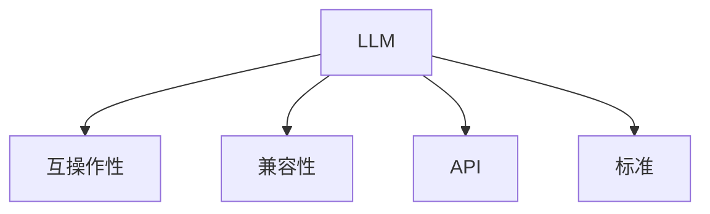

                 

# LLM 标准：促进互操作性和兼容性

## 1. 背景介绍

在大规模语言模型（Large Language Models, LLMs）的时代，不同的LLM模型在架构、参数配置、训练方式、输出格式等方面存在较大的差异。这些差异导致开发者需要面对“模型多样性”带来的开发复杂度和互操作性问题，严重影响了NLP模型的统一部署和跨平台应用。

随着LLM在医疗、法律、金融、教育等行业的应用逐渐深入，如何让不同厂商和团队开发的LLM模型无缝集成，确保其互操作性和兼容性，成为了一个亟待解决的实际需求。

## 2. 核心概念与联系

### 2.1 核心概念概述

为更好地理解LLM标准，我们将介绍几个关键概念：

- **LLM**：以Transformer等架构为代表的大规模预训练语言模型，通过在大规模无标签文本语料上进行预训练，学习通用的语言表示，具备强大的语言理解和生成能力。
- **互操作性(Interoperability)**：不同系统、模型或组件之间能够互相理解并交换信息的能力。对于LLM，互操作性指的是模型输出能够被其他系统理解和处理，以及模型能够读取和处理其他系统的输出。
- **兼容性(Compatibility)**：模型在不同硬件、软件平台或编程语言中的运行效果一致性。兼容性好意味着模型在不同环境下的性能没有显著差异。
- **API**：即应用程序编程接口，定义了模型与外部系统的接口，决定了互操作性和兼容性。
- **标准(Standard)**：一组规范和协议，用于统一模型开发、评估、部署和互操作。

这些核心概念之间的联系通过以下Mermaid流程图表示：



## 3. 核心算法原理 & 具体操作步骤
### 3.1 算法原理概述

LLM标准的核心思想是通过统一模型输出格式、API规范和模型评估标准，来保障不同模型之间的互操作性和兼容性。

标准化的输出格式意味着，不论模型是由哪个厂商或团队开发，其输出结构应该是一致的，包含必要的信息和元数据。这包括但不限于：
- 模型名称和版本
- 输入数据的类型和格式
- 输出数据的类型和结构
- 计算资源的消耗情况（如内存使用、GPU显存等）
- 模型的精度、速度等性能指标

标准的API接口则确保了模型与外部系统的交互方式统一。常见的API形式包括：
- HTTP/REST接口：通过URL和HTTP方法来调用模型服务。
- GRPC接口：使用Google Protocol Buffers协议进行模型服务调用。
- TensorFlow Serving接口：使用TensorFlow的模型部署服务框架进行调用。

标准的评估标准则是通过统一的定义和指标体系，来衡量模型的性能。例如：
- BLEU分数：用于衡量机器翻译任务的翻译质量。
- F1分数：用于衡量自然语言推理任务中分类器的准确性和召回率。
- 情感分析准确率：用于衡量情感分析任务的输出准确性。

### 3.2 算法步骤详解

LLM标准化的步骤通常包括以下几个关键阶段：

**Step 1: 设计输出格式**
- 定义标准化的输出结构，包含必要的元数据。例如，一个标准的输出应包含文本内容和对应的得分，以及计算资源的消耗情况。

**Step 2: 开发统一API**
- 基于选定的API标准，设计并实现模型与外部系统的交互接口。例如，REST API可能定义了GET、POST等HTTP方法，以及参数和返回值的格式。

**Step 3: 编写文档和规范**
- 编写详细的模型使用文档，包括API接口的描述、参数解释、输入输出格式等。同时制定模型的评估标准和方法，方便不同团队对模型进行评估和比较。

**Step 4: 进行模型评估**
- 使用标准化的评估方法，对模型进行性能评估，确保其满足预定的质量要求。例如，使用BLEU分数评估机器翻译模型的性能。

**Step 5: 推广和应用**
- 在模型开发和应用过程中，严格遵循标准化的输出格式、API规范和评估方法。通过开源社区和行业联盟等渠道，推广LLM标准的广泛应用。

### 3.3 算法优缺点

LLM标准化的优点在于：
1. 提高互操作性。通过统一输出格式和API规范，不同模型和系统可以更方便地进行信息交换和集成。
2. 提升兼容性。标准化的评估方法确保了模型在不同环境下的性能一致性。
3. 促进标准化开发。开发团队可以根据标准进行模型设计和开发，减少技术选型和开发复杂度。
4. 便于模型管理和监控。标准化的接口和输出格式便于集中管理和监控模型的运行情况。

然而，标准化的缺点也显而易见：
1. 灵活性受限。标准化过程中可能需要牺牲一定的灵活性，以便确保互操作性和兼容性。
2. 学习和实现成本高。开发者需要额外学习和遵循标准化的规范，增加了开发和维护成本。
3. 可能存在版本兼容性问题。不同版本的模型可能不完全兼容，需要考虑版本兼容性和更新策略。

### 3.4 算法应用领域

LLM标准化的应用领域广泛，不仅限于学术研究，更深入到了产业应用。

- **医疗领域**：标准化的输出和API接口可以方便不同医疗机构之间的数据交换和模型集成，如基于LLM的病历理解和智能诊断系统。
- **金融领域**：金融风险评估、投资分析等任务可以使用标准化的模型输出和API接口进行数据整合和系统集成。
- **教育领域**：智能教育系统需要处理大量的学生数据和教育资源，通过标准化输出和API接口进行数据交换和系统集成，可以提升教学质量和学习效果。
- **智能客服**：智能客服系统需要集成多种自然语言处理任务，通过标准化的输出和API接口，可以更好地进行任务协调和系统集成。

## 4. 数学模型和公式 & 详细讲解
### 4.1 数学模型构建

LLM标准化的数学模型通常基于TensorFlow或PyTorch等深度学习框架进行构建，包括模型的输入、输出和计算图等关键组件。

一个标准的LLM模型输出格式示例如下：

```json
{
    "model_name": "my_LLM_model_v1",
    "input_text": "Hello, world!",
    "output_text": "Welcome to the world!",
    "score": 0.95,
    "memory_usage": 1024.0 MB,
    "wall_time": "0:00:05"
}
```

其中，`model_name`表示模型名称和版本号，`input_text`表示输入文本，`output_text`表示模型输出的文本，`score`表示输出的置信度或得分，`memory_usage`表示计算资源消耗，`wall_time`表示模型运行时间。

### 4.2 公式推导过程

在LLM标准化的过程中，需要定义和推导一些关键公式和指标。

例如，BLEU分数的计算公式如下：

$$
BLEU = \frac{1}{n} \sum_{i=1}^n \frac{p_i}{\min(p_i, \hat{p}_i)}
$$

其中，$n$表示测试集的大小，$p_i$表示模型预测的翻译，$\hat{p}_i$表示人工翻译，$\min(p_i, \hat{p}_i)$表示预测和人工翻译的最小值，以避免0分。

### 4.3 案例分析与讲解

以一个标准的机器翻译任务为例，分析LLM标准化的应用。

假设一个标准的机器翻译API接口如下：

```json
POST /translate
Content-Type: application/json
{
    "source": "I love Python.",
    "target": "en"
}
```

API接口的输出格式如下：

```json
{
    "source": "I love Python.",
    "target": "en",
    "translated_text": "J'aime Python.",
    "source_lang": "fr",
    "target_lang": "en",
    "bleu_score": 0.9
}
```

其中，`source`表示源语言文本，`target`表示目标语言，`translated_text`表示翻译结果，`source_lang`表示源语言，`target_lang`表示目标语言，`bleu_score`表示BLEU分数。

在API调用和返回过程中，开发者无需关心模型的内部实现细节，只需遵循标准化的API和输出格式，即可实现不同模型和系统之间的互操作和集成。

## 5. 项目实践：代码实例和详细解释说明
### 5.1 开发环境搭建

在开发LLM标准化项目时，需要准备以下环境：

1. **编程语言**：Python
2. **深度学习框架**：TensorFlow或PyTorch
3. **Web框架**：Flask或FastAPI
4. **版本控制系统**：Git
5. **模型部署平台**：AWS SageMaker或Google Cloud AI Platform
6. **数据存储平台**：AWS S3或Google Cloud Storage

### 5.2 源代码详细实现

以下是一个基于PyTorch和Flask实现的LLM标准化代码示例：

```python
import torch
import flask
from transformers import BertForSequenceClassification, BertTokenizer

app = flask.Flask(__name__)

@app.route('/classify', methods=['POST'])
def classify():
    data = flask.request.json
    text = data['text']
    model = BertForSequenceClassification.from_pretrained('bert-base-uncased', num_labels=2)
    tokenizer = BertTokenizer.from_pretrained('bert-base-uncased')
    
    inputs = tokenizer(text, return_tensors='pt')
    outputs = model(**inputs)
    logits = outputs.logits
    probabilities = torch.softmax(logits, dim=1)
    
    result = {
        'predicted_label': torch.argmax(probabilities).item(),
        'probability': probabilities[0][torch.argmax(probabilities)].item()
    }
    
    return flask.jsonify(result)

if __name__ == '__main__':
    app.run()
```

上述代码定义了一个简单的Flask API，用于进行文本分类任务。在API调用时，用户只需传入文本，服务器会自动调用预训练的Bert模型进行分类并返回预测结果。

### 5.3 代码解读与分析

让我们详细解读一下关键代码的实现细节：

**Flask框架**：
- Flask是Python常用的Web框架，用于构建API接口，实现模型与外部系统的交互。
- `@app.route('/classify', methods=['POST'])`：定义API接口，用于接收POST请求并处理。
- `flask.jsonify(result)`：将Python字典转换为JSON格式，返回给客户端。

**模型加载与处理**：
- `BertForSequenceClassification.from_pretrained('bert-base-uncased', num_labels=2)`：加载预训练的Bert模型，并进行分类任务的适配。
- `BertTokenizer.from_pretrained('bert-base-uncased')`：加载Bert分词器，用于对输入文本进行分词和编码。
- `inputs = tokenizer(text, return_tensors='pt')`：将输入文本分词并编码为模型所需的张量。
- `outputs = model(**inputs)`：使用模型对输入文本进行分类。
- `logits = outputs.logits`：获取模型的输出，包含分类得分。
- `probabilities = torch.softmax(logits, dim=1)`：对分类得分进行softmax归一化，得到概率分布。
- `torch.argmax(probabilities)`：选择概率最高的类别作为预测结果。

**API返回格式**：
- `result = {'predicted_label': torch.argmax(probabilities).item(), 'probability': probabilities[0][torch.argmax(probabilities)].item()}`：定义API返回格式，包含预测类别和对应的概率。

**模型部署**：
- 使用AWS SageMaker或Google Cloud AI Platform等云服务，将上述代码打包部署为可扩展的服务。
- 使用TensorFlow Serving或Kubeflow等框架，进一步优化模型的性能和可扩展性。

## 6. 实际应用场景
### 6.1 医疗领域

在医疗领域，LLM标准化可以帮助不同医疗机构之间进行数据交换和模型集成，提高医疗服务的智能化水平。例如：

- **病历理解**：不同医院的电子病历系统使用不同的数据格式和API接口，通过标准化输出和API接口，可以实现数据互操作，提升病历理解系统的准确性和一致性。
- **智能诊断**：不同医生的诊断系统使用不同的模型和参数，通过标准化输出和API接口，可以实现模型集成，提升智能诊断系统的诊断效果和普适性。
- **患者交流**：智能医疗助手需要理解患者的自然语言查询，通过标准化输出和API接口，可以实现跨系统交流和信息交换，提升患者体验和满意度。

### 6.2 金融领域

在金融领域，LLM标准化可以帮助不同金融机构进行数据整合和模型集成，提高金融服务的智能化水平。例如：

- **风险评估**：不同金融机构的风险评估系统使用不同的模型和参数，通过标准化输出和API接口，可以实现模型集成，提升风险评估系统的准确性和一致性。
- **投资分析**：不同投资分析系统使用不同的数据格式和API接口，通过标准化输出和API接口，可以实现数据互操作，提升投资分析系统的决策效率和精准度。
- **客户服务**：智能客服系统需要理解客户的自然语言查询，通过标准化输出和API接口，可以实现跨系统交流和信息交换，提升客户体验和满意度。

### 6.3 教育领域

在教育领域，LLM标准化可以帮助不同教育机构进行数据整合和模型集成，提高教学的智能化水平。例如：

- **个性化推荐**：不同教育平台使用不同的数据格式和API接口，通过标准化输出和API接口，可以实现模型集成，提升个性化推荐系统的准确性和一致性。
- **智能评测**：不同教育机构的评测系统使用不同的模型和参数，通过标准化输出和API接口，可以实现模型集成，提升智能评测系统的公平性和准确性。
- **教学辅助**：智能教育助手需要理解学生的自然语言查询，通过标准化输出和API接口，可以实现跨系统交流和信息交换，提升教学辅助系统的智能化水平。

### 6.4 未来应用展望

随着LLM标准化的不断推进，LLM在更多领域的应用前景将更加广阔。

- **智慧城市**：LLM标准化可以帮助不同城市的智能系统进行数据交换和模型集成，提升城市管理的智能化水平。
- **农业领域**：LLM标准化可以帮助农业专家系统进行数据整合和模型集成，提升农业生产的智能化水平。
- **军事领域**：LLM标准化可以帮助不同军种进行数据交换和模型集成，提升军事指挥和决策的智能化水平。

## 7. 工具和资源推荐
### 7.1 学习资源推荐

为了帮助开发者系统掌握LLM标准化的理论基础和实践技巧，这里推荐一些优质的学习资源：

1. **《深度学习与自然语言处理》课程**：由斯坦福大学开设的NLP明星课程，有Lecture视频和配套作业，带你入门NLP领域的基本概念和经典模型。
2. **《自然语言处理实践》书籍**：全面介绍了NLP技术在实际应用中的开发、测试和部署方法，涵盖标准化的输出格式和API接口。
3. **《TensorFlow官方文档》**：提供丰富的模型开发、评估和部署资源，包括标准化的输出格式和API接口。
4. **《PyTorch官方文档》**：提供详细的模型开发和部署方法，包括标准化的输出格式和API接口。
5. **《自然语言处理模型与API设计》博客**：介绍自然语言处理模型的输出格式和API接口设计方法，提供丰富的案例和示例。

通过对这些资源的学习实践，相信你一定能够快速掌握LLM标准化的精髓，并用于解决实际的NLP问题。

### 7.2 开发工具推荐

高效的开发离不开优秀的工具支持。以下是几款用于LLM标准化开发的常用工具：

1. **TensorFlow**：由Google主导开发的深度学习框架，提供丰富的模型部署和评估工具，支持标准化的输出格式和API接口。
2. **PyTorch**：由Facebook主导开发的深度学习框架，提供灵活的模型开发和部署方法，支持标准化的输出格式和API接口。
3. **Flask**：Python常用的Web框架，提供便捷的API接口定义和处理，支持标准化的输出格式和API接口。
4. **AWS SageMaker**：亚马逊提供的云端机器学习平台，提供便捷的模型部署和评估工具，支持标准化的输出格式和API接口。
5. **Google Cloud AI Platform**：谷歌提供的云端机器学习平台，提供便捷的模型部署和评估工具，支持标准化的输出格式和API接口。

合理利用这些工具，可以显著提升LLM标准化的开发效率，加快创新迭代的步伐。

### 7.3 相关论文推荐

LLM标准化的研究源于学界的持续研究。以下是几篇奠基性的相关论文，推荐阅读：

1. **《深度学习与自然语言处理》论文**：详细介绍了深度学习在自然语言处理中的应用，包括模型输出格式和API接口的设计方法。
2. **《自然语言处理标准化框架》论文**：提出了一种自然语言处理标准化的框架，详细介绍了标准化的输出格式和API接口的设计方法。
3. **《基于标准化的自然语言处理模型评估方法》论文**：提出了一种基于标准化的自然语言处理模型评估方法，详细介绍了评估指标和标准化的输出格式。

这些论文代表了大语言模型标准化的发展脉络。通过学习这些前沿成果，可以帮助研究者把握学科前进方向，激发更多的创新灵感。

## 8. 总结：未来发展趋势与挑战
### 8.1 研究成果总结

本文对基于标准化的LLM研究进行了全面系统的介绍。首先阐述了LLM标准化的研究背景和意义，明确了标准化在提高互操作性和兼容性方面的独特价值。其次，从原理到实践，详细讲解了标准化的输出格式、API接口和评估标准，给出了LLM标准化的完整代码实现。同时，本文还广泛探讨了LLM标准化在医疗、金融、教育等多个领域的应用前景，展示了标准化范式的巨大潜力。此外，本文精选了LLM标准化的各类学习资源，力求为读者提供全方位的技术指引。

通过本文的系统梳理，可以看到，基于标准化的LLM方法正在成为NLP领域的重要范式，极大地拓展了LLM的应用边界，催生了更多的落地场景。受益于标准化的数据和算法，LLM将在更多领域发挥更强大的作用。

### 8.2 未来发展趋势

展望未来，LLM标准化的发展趋势将呈现以下几个方向：

1. **标准化框架的普及**：随着标准化技术的普及，越来越多的开发者和厂商将采用标准化的输出格式和API接口，提升NLP技术的互操作性和兼容性。
2. **模型泛化能力的提升**：通过标准化的训练和评估方法，模型的泛化能力将进一步提升，适应不同领域和场景的需求。
3. **跨平台兼容性**：标准化的输出格式和API接口将支持不同平台和框架的兼容，提升模型在不同环境下的性能一致性。
4. **模型复杂度的降低**：通过标准化的简化和优化，模型的复杂度将进一步降低，提升模型的部署和维护效率。

### 8.3 面临的挑战

尽管LLM标准化取得了显著进展，但在迈向更加智能化、普适化应用的过程中，仍面临诸多挑战：

1. **标准化与灵活性的平衡**：如何在保证标准化的同时，保留足够的灵活性，以便适应不同应用场景的需求，是一个需要深入研究的课题。
2. **数据隐私和安全**：标准化过程中可能涉及大量敏感数据，如何保护数据隐私和安全，避免数据泄露和滥用，是一个亟待解决的问题。
3. **跨语言和多模态支持**：当前标准化主要聚焦于单语言文本数据，如何扩展到跨语言和多模态数据，是一个需要重点研究的方向。
4. **模型可解释性和公平性**：标准化过程中可能忽略模型的可解释性和公平性问题，如何在保证标准化的同时，提升模型的透明度和公正性，是一个需要关注的问题。

### 8.4 研究展望

面向未来，LLM标准化的研究需要在以下几个方面寻求新的突破：

1. **多语言和多模态标准化**：开发多语言和多模态的输出格式和API接口，提升标准化技术的普适性。
2. **标准化与可解释性的融合**：引入可解释性技术，提升标准化的模型透明度和公平性。
3. **自动化标准化工具**：开发自动化工具，帮助开发者自动生成标准化的输出格式和API接口，降低标准化开发成本。
4. **模型验证与测试**：开发标准化的模型验证和测试方法，确保模型在不同环境和场景下的性能一致性。

这些研究方向将引领LLM标准化的技术演进，为构建安全、可靠、可解释、可控的智能系统铺平道路。只有勇于创新、敢于突破，才能不断拓展语言模型的边界，让智能技术更好地造福人类社会。

## 9. 附录：常见问题与解答

**Q1：LLM标准化是否适用于所有NLP任务？**

A: LLM标准化在大多数NLP任务上都能取得不错的效果，特别是对于数据量较小的任务。但对于一些特定领域的任务，如医学、法律等，仅仅依靠通用语料预训练的模型可能难以很好地适应。此时需要在特定领域语料上进一步预训练，再进行标准化。此外，对于一些需要时效性、个性化很强的任务，如对话、推荐等，标准化方法也需要针对性的改进优化。

**Q2：如何选择合适的输出格式和API接口？**

A: 选择合适的输出格式和API接口需要考虑以下几个方面：
1. 任务类型：根据任务类型，选择合适的输出格式和API接口。例如，分类任务可以使用JSON格式的输出，生成任务可以使用文本格式的输出。
2. 数据复杂度：根据数据复杂度，选择适合的数据格式。例如，图像数据可以使用二进制格式，文本数据可以使用JSON格式。
3. 部署需求：根据部署需求，选择适合的API接口。例如，REST接口适合用于Web应用，GRPC接口适合用于高性能服务。

**Q3：如何确保LLM标准化的互操作性和兼容性？**

A: 确保LLM标准化的互操作性和兼容性，需要遵循以下几个原则：
1. 定义统一的数据格式和API接口：确保不同系统的数据交换和模型集成能够无缝进行。
2. 制定标准化的评估方法：确保不同模型的性能评估和比较能够公平公正。
3. 使用通用的开发工具和框架：确保不同模型的开发和部署能够高效便捷。

**Q4：LLM标准化是否会增加开发成本？**

A: 初期可能会增加一定的开发成本，包括编写文档、定义标准、进行测试等。但从长远来看，标准化可以减少技术选型和开发复杂度，提升模型的互操作性和兼容性，降低后续的维护和部署成本。

---

作者：禅与计算机程序设计艺术 / Zen and the Art of Computer Programming

