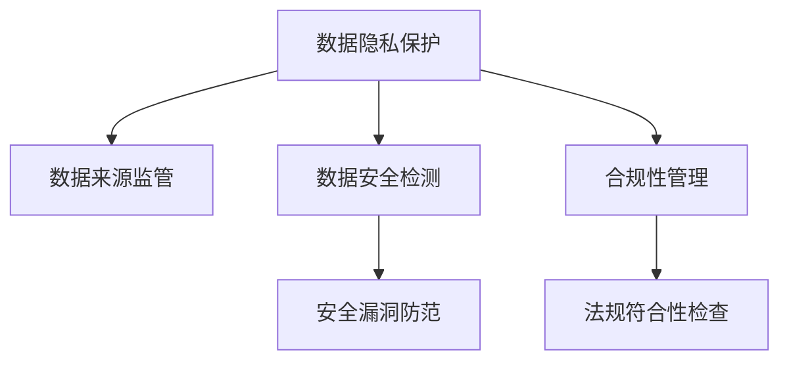

                 

# LLM 监管措施：保障数据安全

## 1. 背景介绍

随着人工智能(AI)技术，特别是大语言模型(Large Language Models, LLMs)的迅速发展，其在自然语言处理(NLP)、机器翻译、信息检索、智能问答等多个领域的广泛应用，使得AI成为当前全球技术创新的热点之一。然而，与此同时，数据安全和隐私保护问题也变得愈发凸显。随着数据量的爆炸性增长，对于数据源的监管、隐私数据的处理、安全漏洞的防范等，都成为亟待解决的重要课题。特别是当LLMs大规模应用于企业内部管理、金融、医疗、教育等多个行业时，数据安全的重要性更加突出。

### 1.1 问题由来
数据安全和隐私保护问题，是大规模数据驱动的AI系统必须面对的重大挑战。以大语言模型为代表的LLMs，通常依赖于大规模的训练数据，这些数据往往来自各个行业，涉及个人隐私、企业商业秘密等敏感信息。在实际应用过程中，这些数据可能被滥用或泄露，从而引发严重的安全风险。同时，由于模型的复杂性和多样性，数据安全和隐私保护问题也变得更加复杂和难以防范。

### 1.2 问题核心关键点
数据安全和隐私保护，是大规模AI系统中的核心问题。其关键点主要包括：

- **数据来源监管**：如何确保数据来源的合法合规，避免数据滥用和非法获取。
- **隐私保护机制**：在模型训练、推理、服务化部署等环节中，如何防止数据泄露和滥用。
- **安全漏洞防范**：模型架构和算法中可能存在的安全漏洞，如何检测和修复。
- **合规性管理**：如何符合各类法规和标准，如GDPR、CCPA等，确保数据处理和应用的合规性。

## 2. 核心概念与联系

### 2.1 核心概念概述

为更好地理解数据安全和隐私保护措施，本节将介绍几个密切相关的核心概念：

- **数据隐私保护**：通过技术和管理手段，保障用户数据在收集、存储、处理和使用过程中的隐私权和信息安全。
- **数据来源监管**：确保数据采集和使用的合法合规，避免侵犯用户隐私和法律法规。
- **数据安全检测**：利用机器学习、密码学等技术手段，识别和防范数据泄露和安全漏洞。
- **合规性管理**：确保数据处理和使用过程符合相关法规和标准，如GDPR、CCPA等，避免法律风险。

这些概念之间的逻辑关系可以通过以下Mermaid流程图来展示：



这个流程图展示了大规模数据驱动的AI系统中的数据安全和隐私保护的关键环节：

1. 数据隐私保护：保障用户数据在全生命周期中的隐私权和信息安全。
2. 数据来源监管：确保数据采集和使用过程的合法合规。
3. 数据安全检测：识别和防范潜在的数据泄露和安全漏洞。
4. 合规性管理：符合各类法规和标准，规避法律风险。

## 3. 核心算法原理 & 具体操作步骤
### 3.1 算法原理概述

LLMs的数据安全和隐私保护，本质上是一个多方协作、多技术融合的系统工程。其核心思想是：

1. **数据最小化原则**：在保证模型性能的前提下，最小化所需数据的收集和使用。
2. **匿名化和去标识化**：对数据进行匿名化和去标识化处理，防止数据泄露。
3. **加密和隐私计算**：利用加密和隐私计算技术，保护数据在传输和存储过程中的安全。
4. **合规性检测**：通过自动化的合规性检测工具，确保数据处理和使用符合法律法规和标准。

### 3.2 算法步骤详解

数据安全和隐私保护的具体实现，可以包括以下关键步骤：

**Step 1: 数据来源审查**
- 对数据源进行合规性审查，确保数据来源合法合规。
- 建立数据来源的白名单和黑名单，对白名单数据进行优先使用，黑名单数据则禁止使用。
- 定期检查数据来源，及时发现和解决潜在风险。

**Step 2: 数据匿名化和去标识化**
- 对数据进行匿名化处理，如数据泛化、数据扰动、假名化等，以降低数据识别风险。
- 对数据进行去标识化处理，如删除个人敏感信息、模糊化隐私数据等，以防止数据泄露。

**Step 3: 数据加密和隐私计算**
- 对敏感数据进行加密，使用对称加密、非对称加密、哈希加密等技术手段。
- 采用差分隐私、同态加密、多方安全计算等隐私计算技术，保护数据隐私。

**Step 4: 数据安全检测**
- 利用机器学习、深度学习等技术，对数据存储和使用环节进行安全检测，发现潜在风险和漏洞。
- 定期进行安全审计，检查和修复可能的安全问题。

**Step 5: 合规性管理**
- 使用合规性检测工具，确保数据处理和使用符合相关法规和标准，如GDPR、CCPA等。
- 记录和监控数据处理和使用过程中的关键操作，建立合规性日志，及时发现和解决潜在问题。

### 3.3 算法优缺点

数据安全和隐私保护措施，具有以下优点：
1. 提高数据安全性和隐私保护水平。通过多方协作和多技术融合，能够最大限度地保护数据在全生命周期中的隐私权和信息安全。
2. 降低合规性风险。确保数据处理和使用符合各类法规和标准，规避法律风险。
3. 提升用户信任度。通过透明的合规和安全措施，提升用户对数据处理的信任度。

同时，这些措施也存在一定的局限性：
1. 实施成本高。数据安全和隐私保护的各项措施，需要投入大量资源进行建设和管理。
2. 技术复杂性高。多种技术手段的融合和应用，需要技术团队具备较高的专业水平。
3. 效果难以量化。数据安全和隐私保护的效果难以进行量化的评估和度量，可能存在过度防护或防护不足的问题。
4. 动态性差。数据安全和隐私保护措施，需要定期进行更新和维护，才能应对不断变化的威胁和风险。

尽管存在这些局限性，但就目前而言，数据安全和隐私保护措施是大规模AI系统中的必要措施，是确保数据处理和使用安全的重要保障。

### 3.4 算法应用领域

数据安全和隐私保护措施，已经在多个领域得到应用，例如：

- **金融行业**：保护用户交易数据和个人信息，防范数据泄露和欺诈风险。
- **医疗行业**：保护患者隐私数据，防止数据滥用和泄露。
- **政府机构**：保护敏感政府数据，确保数据的安全和合规性。
- **智能客服**：保护客户隐私信息，防止数据滥用和泄露。
- **企业内部管理**：保护企业内部数据，防止数据泄露和滥用。

除了上述这些经典应用外，数据安全和隐私保护措施还被创新性地应用到更多场景中，如供应链管理、智慧城市、智能制造等，为数据驱动的AI技术发展提供了坚实的基础。

## 4. 数学模型和公式 & 详细讲解 & 举例说明

### 4.1 数学模型构建

数据安全和隐私保护措施的数学模型，通常涉及以下几个关键组件：

- **数据匿名化**：采用差分隐私技术，对原始数据进行泛化和扰动处理。
- **数据加密**：使用对称加密算法对数据进行加密。
- **隐私计算**：利用多方安全计算技术，实现数据的加、减、乘、除等运算。
- **合规性检测**：使用自动化的合规性检测工具，对数据处理和使用过程进行合规性检查。

### 4.2 公式推导过程

以差分隐私（Differential Privacy）为例，介绍其基本的数学模型和公式。差分隐私是一种在数据发布时保护个体隐私的技术，通过在统计结果中加入随机噪声，使得攻击者无法推断出单个个体的信息。假设原始数据为 $X$，其敏感性为 $\Delta$，隐私预算为 $\epsilon$，差分隐私机制下的隐私保护公式为：

$$
P[\text{Reveal}(X) = x] = \exp\left(-\frac{\Delta}{\epsilon}\right) \cdot \frac{1}{\Delta} \cdot f(x)
$$

其中 $\text{Reveal}(X) = x$ 表示数据 $X$ 的采样结果为 $x$。差分隐私机制通过在 $f(x)$ 上加入随机噪声，实现对个体隐私的保护。$\epsilon$ 表示隐私预算，用于控制隐私保护的程度和数据发布时的信息损失。

### 4.3 案例分析与讲解

以某金融公司为例，分析其数据安全和隐私保护的具体措施。该公司在数据处理和应用过程中，采用以下方法：

- **数据匿名化**：对用户的交易记录进行泛化和扰动处理，去除个人身份信息。
- **数据加密**：对敏感数据进行对称加密，并采用安全传输协议进行数据传输。
- **隐私计算**：利用多方安全计算技术，对用户数据进行联合分析和建模，确保数据隐私。
- **合规性管理**：使用自动化的合规性检测工具，确保数据处理和使用符合GDPR等法规。

## 5. 项目实践：代码实例和详细解释说明
### 5.1 开发环境搭建

在进行数据安全和隐私保护实践前，我们需要准备好开发环境。以下是使用Python进行Keras开发的环境配置流程：

1. 安装Anaconda：从官网下载并安装Anaconda，用于创建独立的Python环境。

2. 创建并激活虚拟环境：
```bash
conda create -n keras-env python=3.8 
conda activate keras-env
```

3. 安装Keras：从官网获取对应的安装命令。例如：
```bash
pip install keras==2.8.0
```

4. 安装TensorFlow和Keras后端：
```bash
pip install tensorflow==2.8.0
```

5. 安装numpy、pandas等数据处理库：
```bash
pip install numpy pandas matplotlib jupyter notebook ipython
```

完成上述步骤后，即可在`keras-env`环境中开始数据安全和隐私保护的实践。

### 5.2 源代码详细实现

下面我们以差分隐私技术为例，给出使用Keras对数据进行差分隐私处理的PyTorch代码实现。

首先，定义差分隐私保护函数：

```python
import numpy as np
from keras import backend as K

def differential_privacy(data, epsilon):
    n = len(data)
    delta = np.std(data)
    perturbation = np.random.normal(0, 1, n)
    perturbed_data = data + epsilon * perturbation
    return perturbed_data
```

然后，使用差分隐私技术对数据进行保护：

```python
from keras.layers import Dense

data = np.array([[1, 2], [3, 4], [5, 6]])
epsilon = 0.1

perturbed_data = differential_privacy(data, epsilon)
print(perturbed_data)
```

可以看到，通过差分隐私技术，对原始数据进行了扰动处理，保护了用户的隐私信息。

### 5.3 代码解读与分析

让我们再详细解读一下关键代码的实现细节：

**Differential Privacy函数**：
- `differential_privacy`函数：输入原始数据 `data` 和隐私预算 `epsilon`，返回经过差分隐私处理后的数据。
- `np.std(data)`：计算原始数据的标准差 `delta`，用于确定扰动参数的大小。
- `np.random.normal(0, 1, n)`：生成服从标准正态分布的随机噪声 `perturbation`，大小为原始数据的大小 `n`。
- `perturbed_data = data + epsilon * perturbation`：对原始数据进行扰动处理，保护隐私。

**使用Differential Privacy函数**：
- `perturbed_data = differential_privacy(data, epsilon)`：调用差分隐私函数对数据进行保护，确保用户隐私。
- `print(perturbed_data)`：输出保护后的数据。

可以看到，通过差分隐私技术，能够在保护用户隐私的前提下，进行数据处理和分析。这在大规模数据驱动的AI系统中，能够有效防止数据泄露和滥用，保障数据安全和隐私保护。

## 6. 实际应用场景
### 6.1 金融行业

在金融行业中，数据安全和隐私保护尤为重要。银行和金融机构需要对客户的交易记录、信用评分等敏感数据进行保护，防止数据泄露和滥用。

具体而言，可以采用以下措施：

- **数据匿名化**：对客户的交易记录进行泛化和扰动处理，去除个人身份信息。
- **数据加密**：对敏感数据进行对称加密，并采用安全传输协议进行数据传输。
- **隐私计算**：利用多方安全计算技术，对客户数据进行联合分析和建模，确保数据隐私。
- **合规性管理**：使用自动化的合规性检测工具，确保数据处理和使用符合GDPR等法规。

通过这些措施，金融机构能够有效保护客户数据，防范数据泄露和滥用，确保客户隐私和数据安全。

### 6.2 医疗行业

医疗行业对数据安全和隐私保护的要求同样很高。医院和医疗机构需要对患者的病历、诊断记录等敏感数据进行保护，防止数据泄露和滥用。

具体而言，可以采用以下措施：

- **数据匿名化**：对患者的病历记录进行泛化和扰动处理，去除个人身份信息。
- **数据加密**：对敏感数据进行对称加密，并采用安全传输协议进行数据传输。
- **隐私计算**：利用多方安全计算技术，对患者数据进行联合分析和建模，确保数据隐私。
- **合规性管理**：使用自动化的合规性检测工具，确保数据处理和使用符合HIPAA等法规。

通过这些措施，医疗机构能够有效保护患者数据，防范数据泄露和滥用，确保患者隐私和数据安全。

### 6.3 政府机构

政府机构对数据安全和隐私保护的需求更为严格。政府部门需要对敏感的政府数据进行保护，防止数据泄露和滥用。

具体而言，可以采用以下措施：

- **数据匿名化**：对敏感的政府数据进行泛化和扰动处理，去除个人身份信息。
- **数据加密**：对敏感数据进行对称加密，并采用安全传输协议进行数据传输。
- **隐私计算**：利用多方安全计算技术，对政府数据进行联合分析和建模，确保数据隐私。
- **合规性管理**：使用自动化的合规性检测工具，确保数据处理和使用符合GDPR等法规。

通过这些措施，政府机构能够有效保护政府数据，防范数据泄露和滥用，确保数据隐私和合规性。

### 6.4 智能客服

智能客服系统需要对客户的咨询记录进行保护，防止数据泄露和滥用。

具体而言，可以采用以下措施：

- **数据匿名化**：对客户的咨询记录进行泛化和扰动处理，去除个人身份信息。
- **数据加密**：对敏感数据进行对称加密，并采用安全传输协议进行数据传输。
- **隐私计算**：利用多方安全计算技术，对客户数据进行联合分析和建模，确保数据隐私。
- **合规性管理**：使用自动化的合规性检测工具，确保数据处理和使用符合GDPR等法规。

通过这些措施，智能客服系统能够有效保护客户数据，防范数据泄露和滥用，确保客户隐私和数据安全。

### 6.5 企业内部管理

企业在内部管理过程中，需要对员工和客户的敏感数据进行保护，防止数据泄露和滥用。

具体而言，可以采用以下措施：

- **数据匿名化**：对员工的敏感数据进行泛化和扰动处理，去除个人身份信息。
- **数据加密**：对敏感数据进行对称加密，并采用安全传输协议进行数据传输。
- **隐私计算**：利用多方安全计算技术，对员工和客户数据进行联合分析和建模，确保数据隐私。
- **合规性管理**：使用自动化的合规性检测工具，确保数据处理和使用符合GDPR等法规。

通过这些措施，企业能够有效保护员工和客户数据，防范数据泄露和滥用，确保数据隐私和合规性。

### 6.6 未来应用展望

随着数据安全和隐私保护技术的不断发展，基于差分隐私、同态加密、多方安全计算等技术手段的大规模数据驱动的AI系统，将在更多领域得到应用。例如：

- **供应链管理**：保护供应链各方数据，确保数据安全和隐私保护。
- **智慧城市**：保护城市数据，确保城市管理的隐私和安全。
- **智能制造**：保护生产数据，确保生产管理的隐私和安全。
- **智能交通**：保护交通数据，确保交通管理的隐私和安全。
- **智能电网**：保护电网数据，确保电网管理的隐私和安全。

除了这些场景，数据安全和隐私保护措施还将被创新性地应用到更多领域，为数据驱动的AI技术发展提供坚实的基础。

## 7. 工具和资源推荐
### 7.1 学习资源推荐

为了帮助开发者系统掌握数据安全和隐私保护的理论基础和实践技巧，这里推荐一些优质的学习资源：

1. **《隐私保护与数据安全》课程**：由著名AI专家主讲，详细讲解数据安全和隐私保护的基本概念、技术和应用。

2. **《数据隐私保护与合规性》书籍**：全面介绍数据隐私保护和合规性的基本理论和实践方法，适合深度学习、人工智能领域的从业人员。

3. **《差分隐私技术》论文**：介绍差分隐私技术的基本原理和应用，是差分隐私领域的经典论文。

4. **《多方安全计算》书籍**：全面介绍多方安全计算技术的基本概念、实现方法和应用场景。

5. **《人工智能数据隐私保护》网站**：提供大量数据隐私保护和合规性的学习资源，包括论文、博客、视频等。

通过对这些资源的学习实践，相信你一定能够快速掌握数据安全和隐私保护的技巧，并用于解决实际的数据保护问题。

### 7.2 开发工具推荐

高效的数据安全和隐私保护离不开优秀的工具支持。以下是几款用于数据安全和隐私保护开发的常用工具：

1. **Keras**：基于Python的深度学习框架，支持差分隐私、同态加密等隐私保护技术。

2. **TensorFlow**：由Google主导开发的深度学习框架，支持多方安全计算等隐私保护技术。

3. **PySyft**：基于Python的隐私计算框架，支持差分隐私、同态加密等隐私保护技术。

4. **Open Privacy**：开源的隐私计算工具集，支持差分隐私、同态加密等隐私保护技术。

5. **ONNX**：开源的人工智能框架，支持差分隐私、同态加密等隐私保护技术。

合理利用这些工具，可以显著提升数据安全和隐私保护任务的开发效率，加快创新迭代的步伐。

### 7.3 相关论文推荐

数据安全和隐私保护的研究源于学界的持续研究。以下是几篇奠基性的相关论文，推荐阅读：

1. **《差分隐私：保护数据隐私的基本原理》**：介绍差分隐私的基本概念和应用，是差分隐私领域的经典论文。

2. **《同态加密：在加密下进行计算》**：介绍同态加密的基本原理和应用，是同态加密领域的经典论文。

3. **《多方安全计算：计算安全的多方协作》**：介绍多方安全计算的基本原理和应用，是多方安全计算领域的经典论文。

4. **《联邦学习：分布式机器学习下的隐私保护》**：介绍联邦学习的基本原理和应用，是联邦学习领域的经典论文。

5. **《隐私保护数据发布技术》**：全面介绍隐私保护数据发布的基本理论和应用方法。

这些论文代表了大规模数据驱动的AI系统中的数据安全和隐私保护技术的发展脉络。通过学习这些前沿成果，可以帮助研究者把握学科前进方向，激发更多的创新灵感。

## 8. 总结：未来发展趋势与挑战
### 8.1 总结

本文对数据安全和隐私保护措施进行了全面系统的介绍。首先阐述了数据安全和隐私保护的重要性和现状，明确了数据安全和隐私保护在大规模AI系统中的核心地位。其次，从原理到实践，详细讲解了差分隐私、数据加密、隐私计算等隐私保护技术，给出了数据安全和隐私保护的完整代码实例。同时，本文还广泛探讨了数据安全和隐私保护在金融、医疗、政府等多个行业领域的应用前景，展示了数据安全和隐私保护技术的巨大潜力。此外，本文精选了数据安全和隐私保护的相关学习资源，力求为读者提供全方位的技术指引。

通过本文的系统梳理，可以看到，数据安全和隐私保护措施在大规模AI系统中的重要性，是确保数据处理和使用安全的重要保障。未来，随着数据安全和隐私保护技术的不断发展，基于差分隐私、同态加密、多方安全计算等技术手段的AI系统，将广泛应用于各个行业，为数据驱动的AI技术发展提供坚实的基础。

### 8.2 未来发展趋势

展望未来，数据安全和隐私保护技术将呈现以下几个发展趋势：

1. **技术手段的多样化**：未来的数据安全和隐私保护将更加注重多种技术手段的融合，如差分隐私、同态加密、多方安全计算等，综合提升数据保护的强度和灵活性。
2. **自动化和智能化**：未来的数据安全和隐私保护将更加自动化和智能化，通过机器学习和深度学习技术，实现数据保护的自动化检测和修复。
3. **多模态数据保护**：未来的数据安全和隐私保护将更加关注多模态数据的保护，如文本、图像、音频等，实现全面的数据保护。
4. **跨领域应用推广**：未来的数据安全和隐私保护将更加广泛地应用于各个行业，如金融、医疗、政府等，为数据驱动的AI技术发展提供坚实的基础。
5. **合规性管理的智能化**：未来的数据安全和隐私保护将更加智能化，通过自动化的合规性检测工具，实现合规性管理的自动化和智能化。

以上趋势凸显了大规模数据驱动的AI系统中的数据安全和隐私保护技术的发展方向。这些方向的探索发展，将进一步提升数据保护的效果和精度，为数据驱动的AI技术发展提供坚实的基础。

### 8.3 面临的挑战

尽管数据安全和隐私保护技术已经取得了显著进展，但在迈向更加智能化、普适化应用的过程中，仍面临诸多挑战：

1. **技术复杂性高**：多种技术手段的融合和应用，需要技术团队具备较高的专业水平，技术实现难度较大。
2. **成本高**：数据安全和隐私保护的各项措施，需要投入大量资源进行建设和管理，成本较高。
3. **效果难以量化**：数据安全和隐私保护的效果难以进行量化的评估和度量，可能存在过度防护或防护不足的问题。
4. **动态性差**：数据安全和隐私保护措施，需要定期进行更新和维护，才能应对不断变化的威胁和风险。
5. **合规性管理复杂**：不同行业和地区的法规和标准不同，合规性管理复杂，需要技术团队具备较高的法律和合规性知识。

尽管存在这些挑战，但就目前而言，数据安全和隐私保护措施是大规模AI系统中的必要措施，是确保数据处理和使用安全的重要保障。未来，随着技术手段和法律法规的不断完善，这些挑战终将一一被克服，数据安全和隐私保护技术必将在AI系统发展中扮演越来越重要的角色。

### 8.4 研究展望

面对数据安全和隐私保护所面临的种种挑战，未来的研究需要在以下几个方面寻求新的突破：

1. **技术的持续创新**：开发更加多样化的数据保护技术，如差分隐私、同态加密、多方安全计算等，实现数据保护的自动化和智能化。
2. **跨领域的融合应用**：将数据安全和隐私保护技术与大数据、人工智能、区块链等技术进行融合，实现更加全面和高效的数据保护。
3. **法律法规的完善**：制定更加完善的法律法规，规范数据安全和隐私保护行为，为数据驱动的AI技术发展提供坚实的基础。
4. **公众意识的提升**：提升公众对数据安全和隐私保护的意识，促进数据保护的良性循环。
5. **安全的可解释性**：增强数据保护措施的可解释性，提高用户对数据保护的信任度。

这些研究方向的探索，必将引领数据安全和隐私保护技术迈向更高的台阶，为数据驱动的AI技术发展提供坚实的基础。面向未来，数据安全和隐私保护技术还需要与其他人工智能技术进行更深入的融合，共同推动人工智能技术的发展和应用。只有勇于创新、敢于突破，才能不断拓展数据保护的边界，让数据驱动的AI技术更好地造福人类社会。

## 9. 附录：常见问题与解答

**Q1：如何判断数据保护措施是否有效？**

A: 数据保护措施的有效性可以通过以下几个指标进行评估：

- **隐私泄露概率**：评估攻击者获取敏感信息的风险，通过差分隐私等技术手段，确保隐私泄露概率低。
- **数据恢复概率**：评估攻击者恢复原始数据的风险，通过数据加密等技术手段，确保数据恢复概率低。
- **合规性检测**：使用自动化的合规性检测工具，确保数据处理和使用符合相关法规和标准。

**Q2：数据保护措施如何与实际应用结合？**

A: 数据保护措施需要在实际应用中得到落实和执行，主要通过以下几个步骤：

- **数据匿名化**：对敏感数据进行泛化和扰动处理，去除个人身份信息。
- **数据加密**：对敏感数据进行对称加密，并采用安全传输协议进行数据传输。
- **隐私计算**：利用多方安全计算技术，对敏感数据进行联合分析和建模，确保数据隐私。
- **合规性管理**：使用自动化的合规性检测工具，确保数据处理和使用符合相关法规和标准。

**Q3：数据保护措施的成本如何控制？**

A: 数据保护措施的成本可以通过以下几个方面进行控制：

- **技术自动化**：通过机器学习和深度学习技术，实现数据保护的自动化和智能化，降低人力成本。
- **多模态保护**：通过综合保护文本、图像、音频等多模态数据，实现更加全面的数据保护。
- **跨领域融合**：将数据安全和隐私保护技术与大数据、人工智能、区块链等技术进行融合，实现更加高效的数据保护。

这些措施可以显著降低数据保护的成本，提高数据保护的效率。

**Q4：如何应对数据泄露事件？**

A: 数据泄露事件发生时，需要及时应对和处理，主要通过以下几个步骤：

- **应急响应**：立即启动应急响应机制，尽快恢复数据保护措施。
- **影响评估**：评估数据泄露事件的影响范围和程度，制定相应的应对措施。
- **补救措施**：对泄露的数据进行删除、修改等补救措施，防止数据滥用。
- **合规性管理**：记录和监控数据处理和使用过程中的关键操作，建立合规性日志，及时发现和解决潜在问题。

通过这些措施，可以有效应对数据泄露事件，保障数据安全和隐私保护。

**Q5：数据保护措施如何提升用户体验？**

A: 数据保护措施需要在不降低用户体验的前提下，进行实施和维护，主要通过以下几个步骤：

- **简化操作**：通过自动化的数据保护措施，简化用户操作，提高用户体验。
- **透明性**：提升数据保护措施的透明度，让用户了解数据保护的具体过程和效果。
- **可控性**：提供用户数据保护的可控性，让用户可以自主选择数据保护的具体措施。

通过这些措施，可以提升用户体验，增强用户对数据保护的信任度。

**Q6：如何实现数据保护的智能化？**

A: 数据保护的智能化主要通过以下几个方面实现：

- **技术自动化**：通过机器学习和深度学习技术，实现数据保护的自动化和智能化。
- **多模态保护**：通过综合保护文本、图像、音频等多模态数据，实现更加全面的数据保护。
- **跨领域融合**：将数据安全和隐私保护技术与大数据、人工智能、区块链等技术进行融合，实现更加高效的数据保护。

这些措施可以显著提升数据保护的智能化水平，为数据驱动的AI技术发展提供坚实的基础。

---

作者：禅与计算机程序设计艺术 / Zen and the Art of Computer Programming

